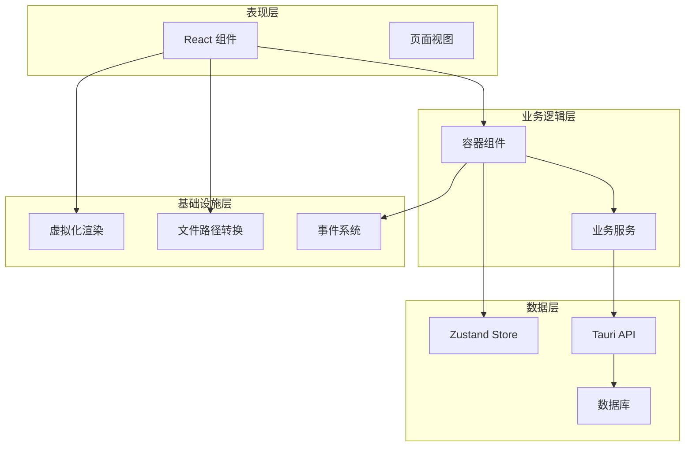
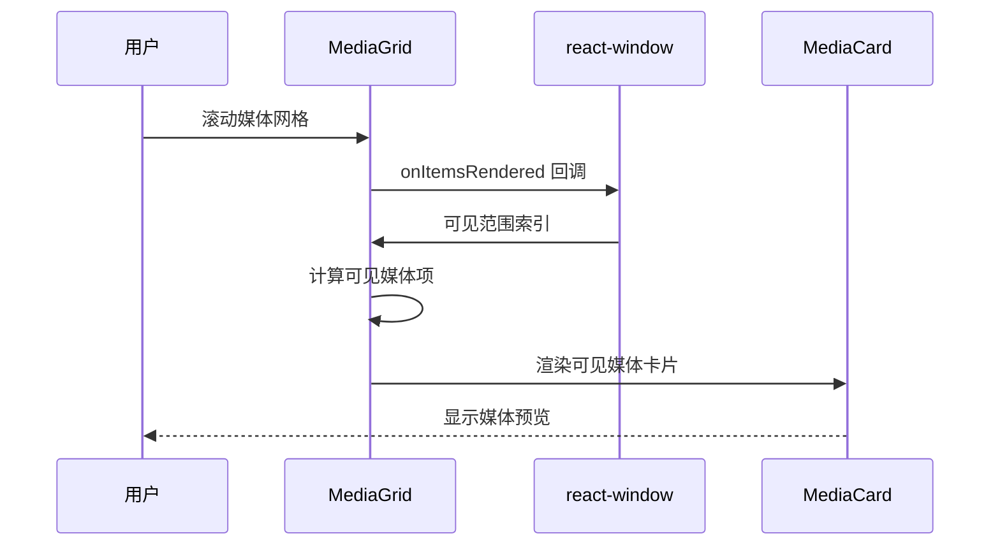
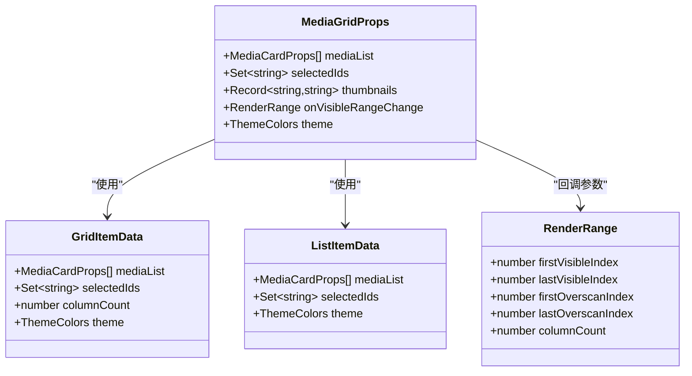
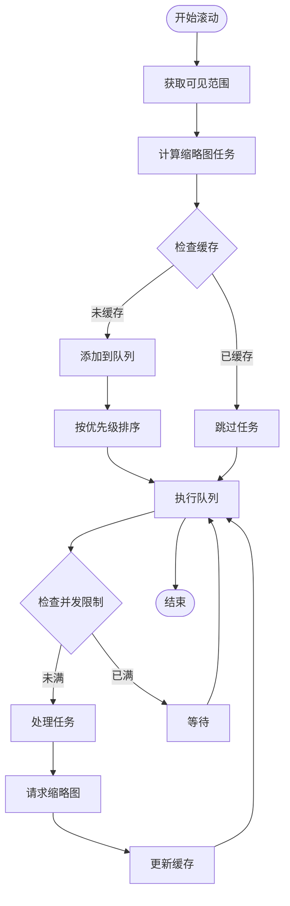
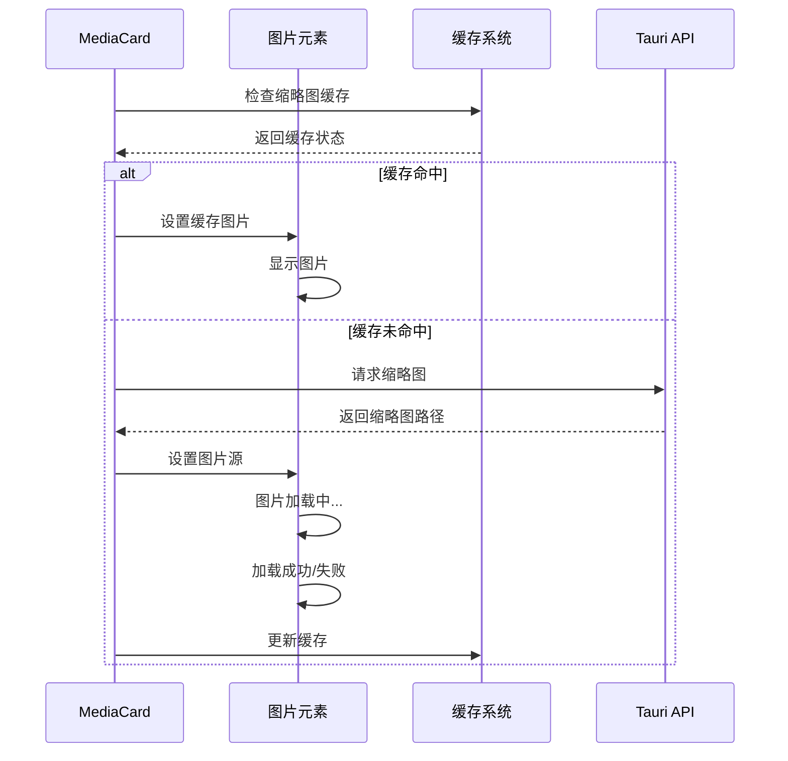

# 前端性能优化

<cite>
**本文档引用的文件**
- [MediaGrid.tsx](file://src/components/MediaGrid.tsx)
- [MediaGridContainer.tsx](file://src/containers/MediaGridContainer.tsx)
- [MediaCard.tsx](file://src/components/MediaCard.tsx)
- [useAppStore.ts](file://src/store/useAppStore.ts)
- [MediaGridContainer.tsx](file://src/containers/MediaGridContainer.tsx)
- [package.json](file://package.json)
- [App.tsx](file://src/App.tsx)
- [main.tsx](file://src/main.tsx)
- [ToolbarContainer.tsx](file://src/containers/ToolbarContainer.tsx)
- [SidebarContainer.tsx](file://src/containers/SidebarContainer.tsx)
</cite>

## 目录
1. [简介](#简介)
2. [项目结构](#项目结构)
3. [核心组件](#核心组件)
4. [架构概览](#架构概览)
5. [详细组件分析](#详细组件分析)
6. [依赖关系分析](#依赖关系分析)
7. [性能考虑](#性能考虑)
8. [故障排除指南](#故障排除指南)
9. [结论](#结论)

## 简介

Medex 是一个基于 React 和 Tauri 的桌面媒体管理应用，专注于为用户提供高效的媒体浏览和管理体验。本文档深入分析了 Medex 前端的性能优化策略，特别关注 React 组件性能优化技术、虚拟化渲染策略、大数据量处理优化以及缩略图懒加载等关键技术。

该项目采用了现代化的前端技术栈，包括 React 18、TypeScript、TailwindCSS 和 Vite 构建工具，配合 Tauri 提供的原生应用能力，实现了高性能的桌面媒体管理解决方案。

## 项目结构

Medex 采用模块化的组件架构，主要分为以下几个层次：

```mermaid
graph TB
subgraph "应用层"
App[App.tsx]
Main[Main 组件]
end
subgraph "容器层"
MediaGridContainer[MediaGridContainer]
SidebarContainer[SidebarContainer]
ToolbarContainer[ToolbarContainer]
end
subgraph "组件层"
MediaGrid[MediaGrid]
MediaCard[MediaCard]
Sidebar[Sidebar]
Toolbar[Toolbar]
end
subgraph "存储层"
useAppStore[useAppStore Zustand Store]
end
subgraph "外部依赖"
ReactWindow[react-window]
Tauri[@tauri-apps/api]
Zustand[zustand]
end
App --> MediaGridContainer
App --> SidebarContainer
MediaGridContainer --> MediaGrid
MediaGrid --> MediaCard
SidebarContainer --> Sidebar
ToolbarContainer --> Toolbar
MediaGridContainer --> useAppStore
MediaGrid --> useAppStore
MediaCard --> useAppStore
MediaGrid --> ReactWindow
MediaGridContainer --> Tauri
MediaGrid --> Tauri
useAppStore --> Zustand
```

**图表来源**
- [App.tsx:1-73](file://src/App.tsx#L1-L73)
- [MediaGridContainer.tsx:1-619](file://src/containers/MediaGridContainer.tsx#L1-L619)
- [MediaGrid.tsx:1-351](file://src/components/MediaGrid.tsx#L1-L351)

**章节来源**
- [App.tsx:1-73](file://src/App.tsx#L1-L73)
- [main.tsx:1-44](file://src/main.tsx#L1-L44)

## 核心组件

### MediaGrid 组件

MediaGrid 是整个应用的核心渲染组件，负责媒体文件的网格和列表视图展示。该组件实现了完整的虚拟化渲染策略，支持大数据量的高效渲染。

### MediaCard 组件

MediaCard 是媒体项的具体展示组件，提供了丰富的交互功能，包括收藏、标签管理、右键菜单等。

### MediaGridContainer 容器

MediaGridContainer 作为容器组件，负责数据获取、状态管理和性能优化策略的执行。

**章节来源**
- [MediaGrid.tsx:70-212](file://src/components/MediaGrid.tsx#L70-L212)
- [MediaCard.tsx:34-264](file://src/components/MediaCard.tsx#L34-L264)
- [MediaGridContainer.tsx:30-619](file://src/containers/MediaGridContainer.tsx#L30-L619)

## 架构概览

Medex 采用了清晰的分层架构，每层都有明确的职责分工：



**图表来源**
- [MediaGridContainer.tsx:1-619](file://src/containers/MediaGridContainer.tsx#L1-L619)
- [useAppStore.ts:145-394](file://src/store/useAppStore.ts#L145-L394)

## 详细组件分析

### MediaGrid 组件性能优化分析

#### 虚拟化渲染实现

MediaGrid 组件使用 react-window 实现了高效的虚拟化渲染，支持两种视图模式：



**图表来源**
- [MediaGrid.tsx:173-209](file://src/components/MediaGrid.tsx#L173-L209)
- [MediaGrid.tsx:183-205](file://src/components/MediaGrid.tsx#L183-L205)

#### 性能优化技术应用

1. **useMemo 优化**：使用 useMemo 缓存计算结果，避免不必要的重新计算
2. **memo 包装**：使用 memo 包装子组件，防止不必要重渲染
3. **useCallback 优化**：使用 useCallback 缓存回调函数引用
4. **虚拟化渲染**：使用 FixedSizeGrid 和 FixedSizeList 实现高效渲染

#### 数据结构优化



**图表来源**
- [MediaGrid.tsx:13-35](file://src/components/MediaGrid.tsx#L13-L35)
- [MediaGrid.tsx:37-58](file://src/components/MediaGrid.tsx#L37-L58)

**章节来源**
- [MediaGrid.tsx:87-124](file://src/components/MediaGrid.tsx#L87-L124)
- [MediaGrid.tsx:214-240](file://src/components/MediaGrid.tsx#L214-L240)
- [MediaGrid.tsx:242-297](file://src/components/MediaGrid.tsx#L242-L297)

### MediaGridContainer 性能优化策略

#### 缩略图懒加载系统

MediaGridContainer 实现了智能的缩略图懒加载系统，通过任务队列和优先级调度优化资源使用：



**图表来源**
- [MediaGridContainer.tsx:390-451](file://src/containers/MediaGridContainer.tsx#L390-L451)

#### 并发控制和队列管理

系统实现了完善的并发控制机制：

- **最大并发数**：MAX_CONCURRENT = 5，限制同时进行的缩略图请求
- **队列大小限制**：MAX_QUEUE_SIZE = 400，防止内存溢出
- **优先级调度**：基于可见性、相邻项和可视范围的优先级算法
- **去重机制**：防止重复请求相同的缩略图

**章节来源**
- [MediaGridContainer.tsx:27-28](file://src/containers/MediaGridContainer.tsx#L27-L28)
- [MediaGridContainer.tsx:390-415](file://src/containers/MediaGridContainer.tsx#L390-L415)
- [MediaGridContainer.tsx:417-451](file://src/containers/MediaGridContainer.tsx#L417-L451)

### MediaCard 组件优化

#### 图片懒加载和错误处理

MediaCard 组件实现了智能的图片加载策略：



**图表来源**
- [MediaCard.tsx:55-63](file://src/components/MediaCard.tsx#L55-L63)
- [MediaCard.tsx:154-179](file://src/components/MediaCard.tsx#L154-L179)

#### 性能监控和调试

组件包含了完整的性能监控机制：

- **图片加载状态跟踪**：监控视频缩略图的加载进度
- **错误处理**：优雅处理图片加载失败的情况
- **状态同步**：与父组件的状态保持同步

**章节来源**
- [MediaCard.tsx:57-63](file://src/components/MediaCard.tsx#L57-L63)
- [MediaCard.tsx:154-179](file://src/components/MediaCard.tsx#L154-L179)

## 依赖关系分析

### 核心依赖关系

```mermaid
graph LR
subgraph "React 生态"
React[React 18.3.1]
ReactDOM[React DOM]
MemoizeOne[memoize-one]
end
subgraph "第三方库"
ReactWindow[react-window 1.8.10]
TauriAPI[@tauri-apps/api 2.0.0]
Zustand[zustand 4.5.5]
Dialog[@tauri-apps/plugin-dialog 2.0.0]
Updater[@tauri-apps/plugin-updater 2.10.0]
end
subgraph "开发工具"
Vite[Vite 5.4.2]
TS[TypeScript 5.5.4]
Tailwind[TailwindCSS 3.4.10]
PostCSS[PostCSS 8.4.45]
end
MediaGrid --> ReactWindow
MediaGrid --> MemoizeOne
MediaGridContainer --> TauriAPI
MediaCard --> TauriAPI
useAppStore --> Zustand
App --> React
App --> ReactDOM
Build --> Vite
Build --> TS
Build --> Tailwind
```

**图表来源**
- [package.json:12-35](file://package.json#L12-L35)

### 性能相关依赖

项目中与性能优化直接相关的依赖包括：

1. **react-window**：提供虚拟化渲染能力
2. **memoize-one**：优化 memoization 性能
3. **zustand**：轻量级状态管理，减少不必要的重渲染
4. **@tauri-apps/api**：提供文件系统访问和原生功能

**章节来源**
- [package.json:12-35](file://package.json#L12-L35)

## 性能考虑

### React 组件性能优化技术

#### useMemo 的正确使用

在 MediaGridContainer 中，useMemo 被广泛用于缓存昂贵的计算结果：

```typescript
// 缓存选中的媒体列表
const selectedMediaList = useMemo(() => {
    return mediaItems.filter((item) => selectedIds.has(item.id));
}, [mediaItems, selectedIds]);

// 缓存公共标签
const commonTags = useMemo(() => {
    if (selectedMediaList.length === 0) return [];
    const firstTags = new Set(selectedMediaList[0].tags);
    return selectedMediaList.slice(1).reduce((acc, item) => {
        return acc.filter((tag) => item.tags.includes(tag));
    }, Array.from(firstTags));
}, [selectedMediaList]);
```

#### memo 的使用策略

MediaCard 组件使用了自定义的比较函数来精确控制重渲染：

```typescript
function areMediaCardPropsEqual(prev: Readonly<MediaCardProps>, next: Readonly<MediaCardProps>) {
    // 仅当关键属性发生变化时才重新渲染
    if (prev.selected !== next.selected) return false;
    if (prev.videoThumbnail !== next.videoThumbnail) return false;
    if (prev.thumbnail !== next.thumbnail) return false;
    // ... 更多属性比较
    return true;
}

export default memo(MediaCard, areMediaCardPropsEqual);
```

#### useCallback 的优化应用

在 MediaGridContainer 中，useCallback 用于缓存事件处理器：

```typescript
const handleCardClick = useCallback(
    (e: React.MouseEvent, mediaId: string, index: number) => {
        // 多选逻辑实现
    },
    [mediaItems, clickMedia]
);

const handleVisibleRangeChange = useCallback(
    (range: RenderRange) => {
        // 缩略图懒加载逻辑
    },
    [mediaList, enqueueThumbnailTask, drainQueue]
);
```

### 虚拟化渲染策略

#### react-window 的实现原理

MediaGrid 组件使用 react-window 的 FixedSizeGrid 和 FixedSizeList 实现虚拟化渲染：

```typescript
// 网格视图虚拟化
<FixedSizeGrid
    width={width}
    height={gridHeight}
    rowCount={rowCount}
    columnCount={columnCount}
    rowHeight={GRID_CELL_HEIGHT}
    columnWidth={GRID_CELL_WIDTH}
    itemData={gridData}
    overscanRowCount={3}
    overscanColumnCount={1}
    onItemsRendered={({ visibleRowStartIndex, visibleRowStopIndex, ... }) => {
        // 计算可见范围并触发缩略图加载
    }}
>
    {GridCell}
</FixedSizeGrid>

// 列表视图虚拟化
<FixedSizeList
    width={width}
    height={listHeight}
    itemCount={mediaList.length}
    itemSize={LIST_ROW_HEIGHT}
    itemData={listData}
    overscanCount={8}
    onItemsRendered={({ visibleStartIndex, visibleStopIndex, ... }) => {
        // 处理可见范围变化
    }}
>
    {ListRow}
</FixedSizeList>
```

#### 滚动区域计算和可视范围优化

系统实现了智能的滚动区域计算：

1. **可视范围计算**：根据可见索引范围计算需要渲染的媒体项
2. **预加载策略**：在可见范围前后预加载相邻的媒体项
3. **过度渲染优化**：通过 overscan 参数控制过度渲染的数量

### 大数据量处理优化

#### 分页加载策略

虽然当前实现主要使用虚拟化渲染，但系统已经为未来的分页加载做好了准备：

```typescript
// 当前实现使用虚拟化渲染处理大数据量
// 未来可以扩展为分页加载
const handleScroll = useCallback((event: React.UIEvent<HTMLDivElement>) => {
    const { scrollTop, scrollHeight, clientHeight } = event.currentTarget;
    const threshold = scrollHeight - clientHeight - 100; // 100px 阈值
    
    if (scrollTop >= threshold && !loadingMore) {
        // 加载更多数据
        loadMoreMedia();
    }
}, [loadingMore]);
```

#### 增量更新机制

系统实现了增量更新机制，只更新发生变化的数据：

```typescript
// 使用 Zustand 的 set 函数进行局部更新
const updateMediaItem = (mediaId: string, updates: Partial<MediaItem>) =>
    set((state) => ({
        mediaItems: state.mediaItems.map(item =>
            item.id === mediaId ? { ...item, ...updates } : item
        )
    }));

// 批量更新优化
const updateMultipleMedia = (updates: Array<{id: string, updates: Partial<MediaItem>}>) =>
    set((state) => {
        const updatesMap = new Map(updates.map(u => [u.id, u.updates]));
        return {
            mediaItems: state.mediaItems.map(item => {
                const update = updatesMap.get(item.id);
                return update ? { ...item, ...update } : item;
            })
        };
    });
```

#### 内存管理策略

系统采用了多种内存管理策略：

1. **组件卸载清理**：及时清理事件监听器和定时器
2. **缓存大小限制**：限制缩略图缓存的大小
3. **任务队列管理**：控制并发任务数量

### 缩略图懒加载和图片优化

#### convertFileSrc 的使用

系统使用 convertFileSrc 函数处理不同类型的媒体文件路径：

```typescript
function toPreviewSrc(src: string): string {
    if (!src) return '';
    
    const isRemote = src.startsWith('http://') || src.startsWith('https://') || src.startsWith('asset:');
    const isAbsoluteUnix = src.startsWith('/');
    const isAbsoluteWindows = /^[A-Za-z]:\\/.test(src);
    
    if (isRemote) return src;
    if (isAbsoluteUnix || isAbsoluteWindows) return convertFileSrc(src);
    return src;
}
```

#### 资源缓存策略

系统实现了多层次的缓存策略：

1. **内存缓存**：使用 thumbnails 对象缓存已加载的缩略图
2. **任务去重**：防止重复请求相同的缩略图
3. **并发控制**：限制同时进行的缩略图请求数量

### 性能监控方法

#### React DevTools Profiler 使用

建议使用 React DevTools Profiler 进行性能分析：

1. **启用 Profiler**：在 React DevTools 中启用 Profiler
2. **录制性能**：录制用户交互过程
3. **分析渲染树**：查看组件的渲染时间和重渲染频率
4. **识别热点**：找出性能瓶颈组件

#### 性能指标分析

推荐关注以下性能指标：

1. **首屏渲染时间**：从应用启动到主要内容可见的时间
2. **交互延迟**：用户操作到界面响应的时间
3. **内存使用**：应用的内存占用情况
4. **CPU 使用率**：渲染和计算的 CPU 占用

## 故障排除指南

### 常见性能问题诊断

#### 缩略图加载失败

**问题症状**：视频缩略图长时间显示加载中状态

**解决方法**：
1. 检查缩略图任务队列是否被阻塞
2. 验证 Tauri 后端的缩略图生成服务
3. 查看网络连接和文件权限

#### 内存泄漏排查

**问题症状**：应用运行时间越长内存占用越高

**解决方法**：
1. 检查事件监听器是否正确清理
2. 验证定时器是否及时清除
3. 确认缓存策略的有效性

#### 渲染性能问题

**问题症状**：滚动时出现卡顿现象

**解决方法**：
1. 调整 overscan 参数优化渲染性能
2. 检查组件重渲染频率
3. 优化图片加载策略

**章节来源**
- [MediaGridContainer.tsx:352-388](file://src/containers/MediaGridContainer.tsx#L352-L388)
- [MediaGridContainer.tsx:453-486](file://src/containers/MediaGridContainer.tsx#L453-L486)

## 结论

Medex 项目展示了现代前端应用的性能优化最佳实践。通过合理使用 React Hooks、虚拟化渲染技术和智能的缓存策略，系统能够在处理大量媒体数据时保持流畅的用户体验。

### 主要优化成果

1. **虚拟化渲染**：使用 react-window 实现了高效的媒体网格渲染
2. **智能缓存**：实现了多层次的缩略图缓存系统
3. **并发控制**：通过任务队列和优先级调度优化资源使用
4. **组件优化**：使用 memo 和 useCallback 减少不必要的重渲染

### 未来改进方向

1. **分页加载**：为超大数据集实现分页加载策略
2. **预加载优化**：基于用户行为预测优化预加载策略
3. **内存监控**：增加更详细的内存使用监控
4. **性能测试**：建立自动化性能测试框架

通过持续的性能优化和监控，Medex 项目为桌面媒体管理应用的性能优化提供了优秀的参考案例。