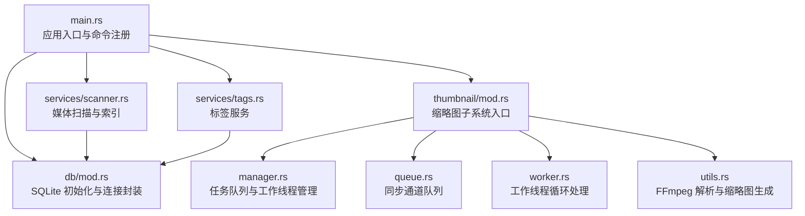
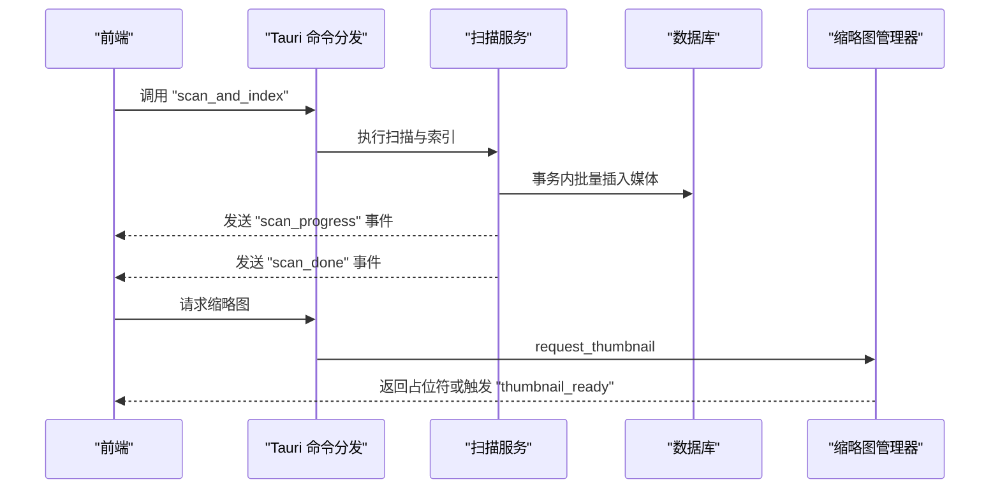
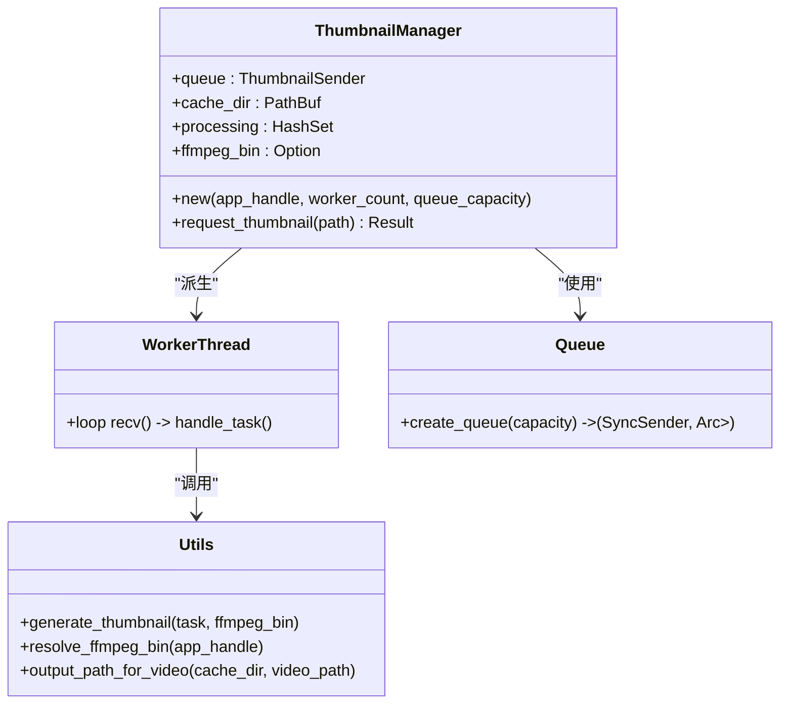
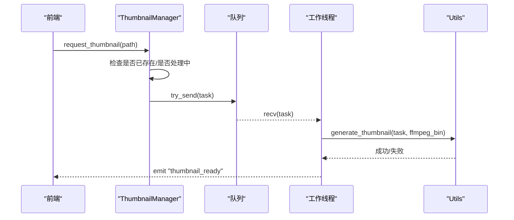
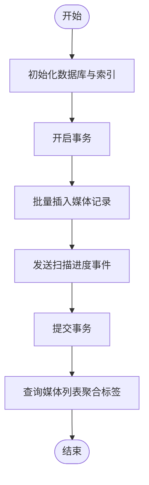
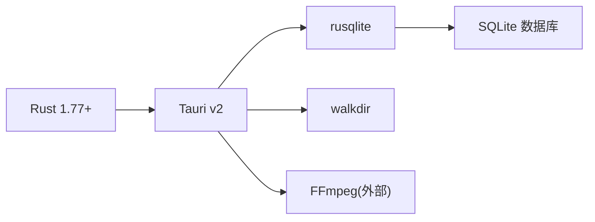

# 后端性能优化

<cite>
**本文引用的文件**   
- [src-tauri/src/main.rs](file://src-tauri/src/main.rs)
- [src-tauri/Cargo.toml](file://src-tauri/Cargo.toml)
- [src-tauri/src/db/mod.rs](file://src-tauri/src/db/mod.rs)
- [src-tauri/src/services/scanner.rs](file://src-tauri/src/services/scanner.rs)
- [src-tauri/src/services/tags.rs](file://src-tauri/src/services/tags.rs)
- [src-tauri/src/thumbnail/mod.rs](file://src-tauri/src/thumbnail/mod.rs)
- [src-tauri/src/thumbnail/manager.rs](file://src-tauri/src/thumbnail/manager.rs)
- [src-tauri/src/thumbnail/queue.rs](file://src-tauri/src/thumbnail/queue.rs)
- [src-tauri/src/thumbnail/worker.rs](file://src-tauri/src/thumbnail/worker.rs)
- [src-tauri/src/thumbnail/utils.rs](file://src-tauri/src/thumbnail/utils.rs)
- [README.md](file://README.md)
</cite>

## 目录
1. [简介](#简介)
2. [项目结构](#项目结构)
3. [核心组件](#核心组件)
4. [架构总览](#架构总览)
5. [详细组件分析](#详细组件分析)
6. [依赖关系分析](#依赖关系分析)
7. [性能考量与优化建议](#性能考量与优化建议)
8. [故障排查指南](#故障排查指南)
9. [结论](#结论)
10. [附录](#附录)

## 简介
本指南聚焦 Medex 后端（Rust/Tauri）的性能优化实践，围绕并发编程、缩略图生成系统、数据库查询、文件系统 I/O 以及性能监控等方面展开。文档以现有代码为依据，结合可落地的优化策略与案例，帮助读者通过合理的并发设计与资源管理显著提升媒体扫描与缩略图生成效率。

## 项目结构
后端位于 src-tauri 目录，采用模块化组织：
- 入口与插件注册：main.rs
- 数据库初始化与连接池封装：db/mod.rs
- 媒体扫描与索引：services/scanner.rs
- 标签服务：services/tags.rs
- 缩略图子系统：thumbnail/mod.rs、manager.rs、queue.rs、worker.rs、utils.rs

**图表来源**
- [src-tauri/src/main.rs:10-69](file://src-tauri/src/main.rs#L10-L69)
- [src-tauri/src/db/mod.rs:45-123](file://src-tauri/src/db/mod.rs#L45-L123)
- [src-tauri/src/thumbnail/mod.rs:32-62](file://src-tauri/src/thumbnail/mod.rs#L32-L62)
- [src-tauri/src/services/scanner.rs:250-341](file://src-tauri/src/services/scanner.rs#L250-L341)
- [src-tauri/src/services/tags.rs:19-220](file://src-tauri/src/services/tags.rs#L19-L220)

**章节来源**
- [src-tauri/src/main.rs:10-69](file://src-tauri/src/main.rs#L10-L69)
- [README.md:97-120](file://README.md#L97-L120)

## 核心组件
- 数据库层：单连接、串行化访问，配合索引与事务优化。
- 媒体扫描：遍历目录、批量插入、进度事件通知。
- 缩略图系统：固定工作线程数、有界队列、去重处理、FFmpeg 外部进程调用。
- 标签服务：简单 CRUD，带事务约束。

**章节来源**
- [src-tauri/src/db/mod.rs:45-123](file://src-tauri/src/db/mod.rs#L45-L123)
- [src-tauri/src/services/scanner.rs:54-88](file://src-tauri/src/services/scanner.rs#L54-L88)
- [src-tauri/src/thumbnail/mod.rs:14-16](file://src-tauri/src/thumbnail/mod.rs#L14-L16)
- [src-tauri/src/services/tags.rs:76-124](file://src-tauri/src/services/tags.rs#L76-L124)

## 架构总览
后端通过 Tauri 注册命令，前端通过 IPC 调用；数据库与缩略图子系统分别承担数据持久化与媒体处理职责。

**图表来源**
- [src-tauri/src/main.rs:49-65](file://src-tauri/src/main.rs#L49-L65)
- [src-tauri/src/services/scanner.rs:250-341](file://src-tauri/src/services/scanner.rs#L250-L341)
- [src-tauri/src/thumbnail/mod.rs:57-61](file://src-tauri/src/thumbnail/mod.rs#L57-L61)

## 详细组件分析

### 缩略图生成系统
- 设计要点
  - 固定工作线程数与有界队列，避免无界增长导致内存压力。
  - 去重集合记录正在处理的任务，防止重复入队。
  - 通过外部进程执行 FFmpeg，生成固定尺寸缩略图。
  - 成功后通过事件通知前端。

**图表来源**
- [src-tauri/src/thumbnail/manager.rs:16-108](file://src-tauri/src/thumbnail/manager.rs#L16-L108)
- [src-tauri/src/thumbnail/worker.rs:13-96](file://src-tauri/src/thumbnail/worker.rs#L13-L96)
- [src-tauri/src/thumbnail/queue.rs:8-12](file://src-tauri/src/thumbnail/queue.rs#L8-L12)
- [src-tauri/src/thumbnail/utils.rs:36-61](file://src-tauri/src/thumbnail/utils.rs#L36-L61)

**图表来源**
- [src-tauri/src/thumbnail/manager.rs:51-106](file://src-tauri/src/thumbnail/manager.rs#L51-L106)
- [src-tauri/src/thumbnail/worker.rs:52-79](file://src-tauri/src/thumbnail/worker.rs#L52-L79)
- [src-tauri/src/thumbnail/utils.rs:36-61](file://src-tauri/src/thumbnail/utils.rs#L36-L61)

**章节来源**
- [src-tauri/src/thumbnail/mod.rs:14-16](file://src-tauri/src/thumbnail/mod.rs#L14-L16)
- [src-tauri/src/thumbnail/manager.rs:24-49](file://src-tauri/src/thumbnail/manager.rs#L24-L49)
- [src-tauri/src/thumbnail/worker.rs:26-49](file://src-tauri/src/thumbnail/worker.rs#L26-L49)
- [src-tauri/src/thumbnail/utils.rs:71-96](file://src-tauri/src/thumbnail/utils.rs#L71-L96)

### 数据库查询与事务优化
- 初始化与索引
  - 创建媒体、标签、关联表与必要索引。
  - 自动迁移：检测并添加缺失列。
- 查询优化
  - 使用 LEFT JOIN + GROUP BY 聚合标签，减少往返。
  - 通过参数化查询与索引覆盖（path、media_id/tag_id、viewed_at）降低开销。
- 事务策略
  - 批量插入与扫描流程使用事务，减少 WAL/提交成本。
  - 标记最近观看与清理逻辑在事务内完成，保证一致性。

**图表来源**
- [src-tauri/src/db/mod.rs:45-95](file://src-tauri/src/db/mod.rs#L45-L95)
- [src-tauri/src/services/scanner.rs:90-115](file://src-tauri/src/services/scanner.rs#L90-L115)
- [src-tauri/src/services/scanner.rs:117-158](file://src-tauri/src/services/scanner.rs#L117-L158)

**章节来源**
- [src-tauri/src/db/mod.rs:12-43](file://src-tauri/src/db/mod.rs#L12-L43)
- [src-tauri/src/services/scanner.rs:250-341](file://src-tauri/src/services/scanner.rs#L250-L341)
- [src-tauri/src/services/scanner.rs:117-158](file://src-tauri/src/services/scanner.rs#L117-L158)

### 文件系统 I/O 优化
- 目录扫描
  - 使用 walkdir 递归遍历，跳过符号链接，按扩展名过滤媒体类型。
- 批量写入
  - 扫描阶段先清空旧数据，再批量插入，减少碎片与锁竞争。
- 缓存与输出
  - 缩略图缓存目录按视频路径哈希命名，避免路径冲突与重名问题。
  - 输出前检查缓存是否存在，命中则直接返回路径。

**章节来源**
- [src-tauri/src/services/scanner.rs:54-88](file://src-tauri/src/services/scanner.rs#L54-L88)
- [src-tauri/src/services/scanner.rs:250-341](file://src-tauri/src/services/scanner.rs#L250-L341)
- [src-tauri/src/thumbnail/utils.rs:20-34](file://src-tauri/src/thumbnail/utils.rs#L20-L34)

## 依赖关系分析
- 语言与生态
  - Rust 1.77+，Tauri v2，rusqlite，walkdir。
- 关键依赖对性能的影响
  - rusqlite：内置事务、参数化查询、索引可显著提升吞吐。
  - walkdir：I/O 密集，注意目录层级与权限。
  - FFmpeg：CPU 密集，受线程数与队列容量影响。

**图表来源**
- [src-tauri/Cargo.toml:13-23](file://src-tauri/Cargo.toml#L13-L23)

**章节来源**
- [src-tauri/Cargo.toml:13-23](file://src-tauri/Cargo.toml#L13-L23)

## 性能考量与优化建议

### Rust 并发编程优化
- 线程池配置
  - 当前固定 4 个工作线程，适合中低并发场景。建议根据 CPU 核心数与 I/O 特性动态调整，或引入可伸缩线程池。
- 异步任务调度
  - 现有为阻塞型工作线程 + 同步通道。若需更高吞吐，可考虑引入异步运行时（如 tokio），将 IO 密集任务异步化，同时保留少量 CPU 密集工作线程。
- 共享状态管理
  - 使用 Arc<Mutex<...>> 管理共享集合，注意锁粒度与持有时间，避免长时间持锁导致排队延迟。

**章节来源**
- [src-tauri/src/thumbnail/mod.rs:14-16](file://src-tauri/src/thumbnail/mod.rs#L14-L16)
- [src-tauri/src/thumbnail/manager.rs:19-21](file://src-tauri/src/thumbnail/manager.rs#L19-L21)
- [src-tauri/src/thumbnail/worker.rs:13-49](file://src-tauri/src/thumbnail/worker.rs#L13-L49)

### 缩略图生成系统优化
- 并发队列设计
  - 当前使用同步通道，容量为 2048。建议：
    - 引入优先级队列：最近请求或可见区域优先。
    - 动态容量：根据队列长度与处理耗时自适应调整。
- 工作线程池配置
  - 线程数固定为 4。建议：
    - CPU 核心数检测：根据硬件能力设置 worker_count。
    - 分离 I/O 与 CPU：I/O 等待时释放线程给其他任务。
- 内存使用控制
  - 缓存目录按哈希命名，避免目录膨胀。建议：
    - 定期清理过期缩略图（LRU/按时间戳）。
    - 限制缓存大小阈值，超过阈值触发回收。

**章节来源**
- [src-tauri/src/thumbnail/mod.rs:14-16](file://src-tauri/src/thumbnail/mod.rs#L14-L16)
- [src-tauri/src/thumbnail/utils.rs:20-34](file://src-tauri/src/thumbnail/utils.rs#L20-L34)

### 数据库查询优化策略
- 索引设计
  - 已有 path、media_tags 的双索引与 recent_views 的时间索引，建议：
    - 对高频过滤字段（如 type、is_favorite）建立复合索引。
    - 对 recent_views 的查询增加覆盖索引，减少回表。
- 查询计划优化
  - 使用 EXPLAIN QUERY PLAN 分析复杂联接（标签过滤、类型过滤）。
  - 将聚合逻辑下沉到 SQL，减少应用侧拼接。
- 事务管理
  - 批量插入与扫描使用事务，建议：
    - 控制事务大小，避免长事务占用锁。
    - 对只读查询使用只读事务，减少写锁争用。

**章节来源**
- [src-tauri/src/db/mod.rs:39-43](file://src-tauri/src/db/mod.rs#L39-L43)
- [src-tauri/src/services/scanner.rs:171-247](file://src-tauri/src/services/scanner.rs#L171-L247)

### 文件系统 I/O 优化
- 批量读取
  - 目录扫描阶段尽量一次性读取元数据，减少 stat 系统调用次数。
- 缓存策略
  - 缩略图缓存命中优先，避免重复生成。
  - 可引入 LRU 缓存管理器，限制最大条目数。
- 磁盘访问优化
  - 顺序写入优于随机写入；批量写入时避免频繁 fsync。
  - 使用 SSD 时，适当增大队列容量与线程数以发挥硬件潜力。

**章节来源**
- [src-tauri/src/services/scanner.rs:54-88](file://src-tauri/src/services/scanner.rs#L54-L88)
- [src-tauri/src/thumbnail/utils.rs:36-61](file://src-tauri/src/thumbnail/utils.rs#L36-L61)

### 性能监控与分析
- tokio tracing 使用
  - 在缩略图生成与扫描流程中加入 span 与事件，标注关键阶段（接收任务、生成开始、生成结束、写入缓存）。
- 指标收集
  - 队列长度、等待时间、处理耗时、错误率、缓存命中率。
- 瓶颈识别
  - 通过火焰图定位 CPU 密集点（FFmpeg 参数与分辨率）与 I/O 瓶颈（磁盘与网络资源）。

[本节为通用指导，不直接分析具体文件，故无“章节来源”]

### 优化案例
- 案例一：媒体扫描效率提升
  - 通过事务批量插入与进度事件，显著降低 UI 卡顿与数据库压力。
  - 建议：拆分大事务、分页处理、异步刷新 UI。
- 案例二：缩略图生成吞吐提升
  - 固定线程数 + 有界队列 + 去重集合，避免过载与重复任务。
  - 建议：引入优先级队列与动态容量，结合缓存回收策略。

**章节来源**
- [src-tauri/src/services/scanner.rs:250-341](file://src-tauri/src/services/scanner.rs#L250-L341)
- [src-tauri/src/thumbnail/manager.rs:51-106](file://src-tauri/src/thumbnail/manager.rs#L51-L106)

## 故障排查指南
- 缩略图未生成
  - 检查 FFmpeg 是否可用与可执行权限。
  - 查看队列是否满导致丢弃任务。
- 扫描卡顿
  - 检查磁盘 I/O 与目录层级，避免深层嵌套与大量小文件。
- 数据库锁等待
  - 减少长事务，拆分批量操作，确保索引覆盖常用查询。

**章节来源**
- [src-tauri/src/thumbnail/utils.rs:71-96](file://src-tauri/src/thumbnail/utils.rs#L71-L96)
- [src-tauri/src/thumbnail/manager.rs:83-103](file://src-tauri/src/thumbnail/manager.rs#L83-L103)
- [src-tauri/src/services/scanner.rs:250-341](file://src-tauri/src/services/scanner.rs#L250-L341)

## 结论
通过合理的并发设计（线程池、队列、共享状态）、数据库索引与事务优化、文件系统 I/O 与缓存策略，以及可观测性的引入，Medex 后端可在保持稳定性的同时显著提升媒体扫描与缩略图生成的性能。建议在现有基础上逐步引入异步运行时与动态资源管理，持续监控关键指标，以应对更大规模的数据与更高的并发需求。

## 附录
- 命令注册与入口
  - 所有后端命令在入口处集中注册，便于统一管理与扩展。

**章节来源**
- [src-tauri/src/main.rs:49-65](file://src-tauri/src/main.rs#L49-L65)