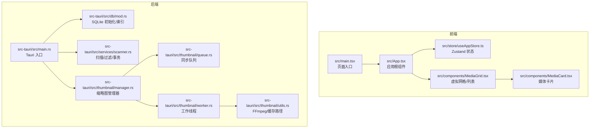
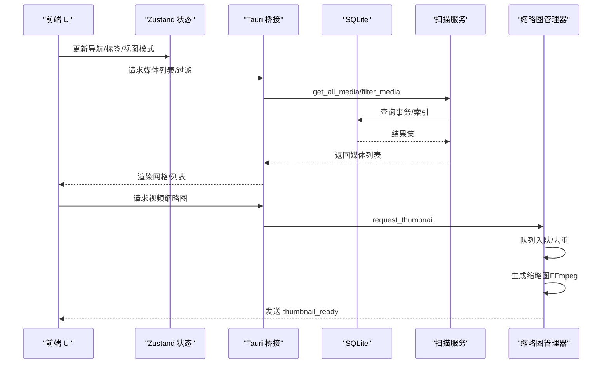
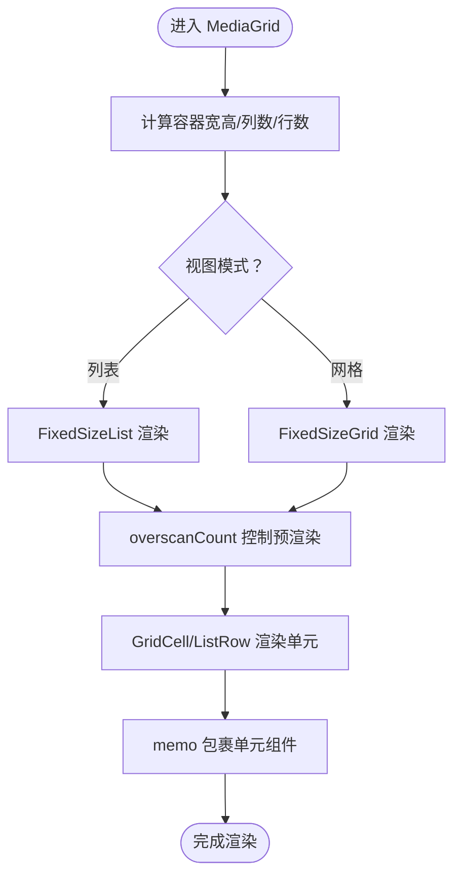
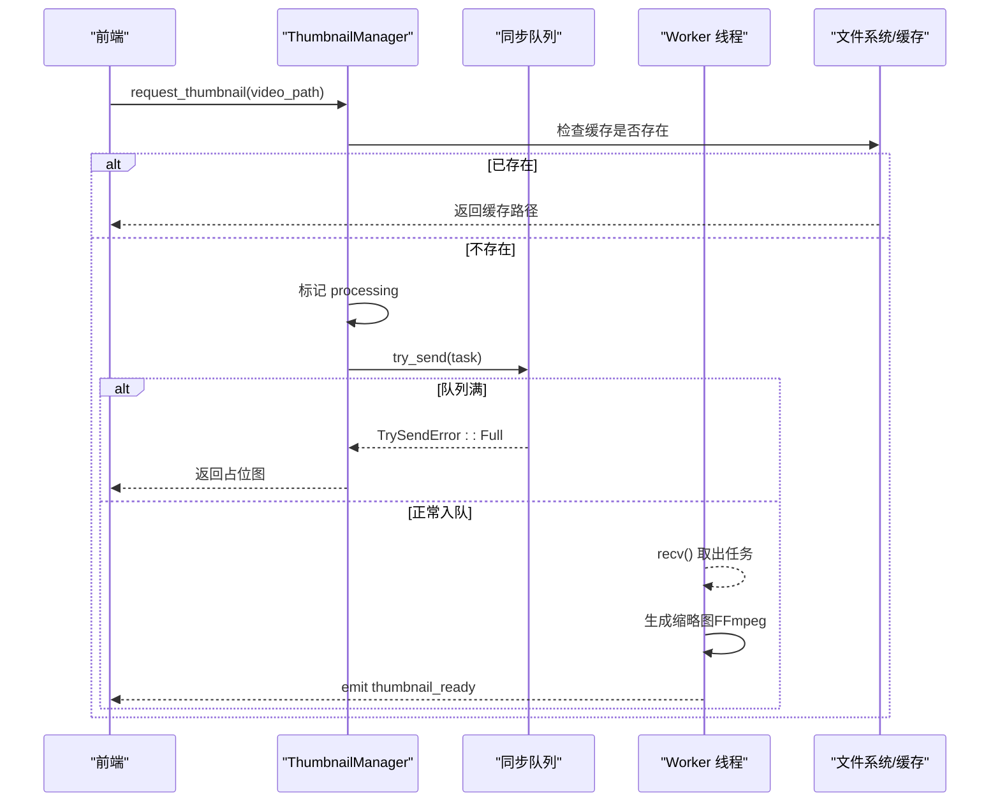
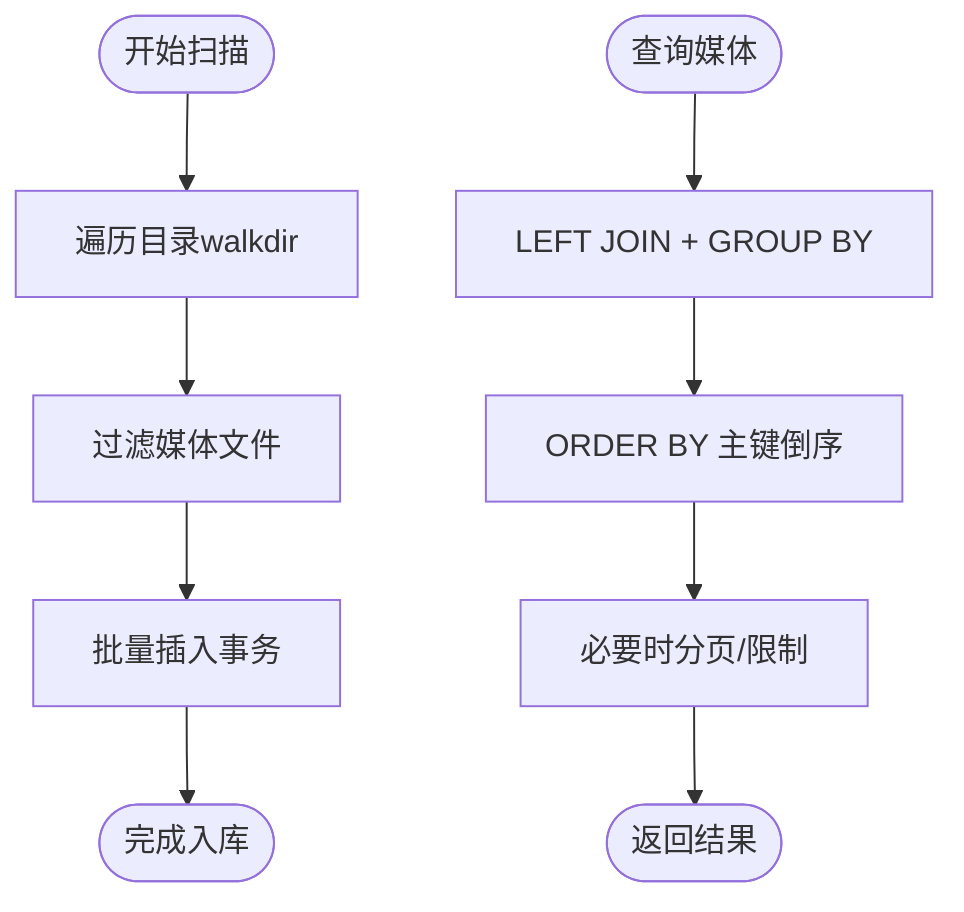
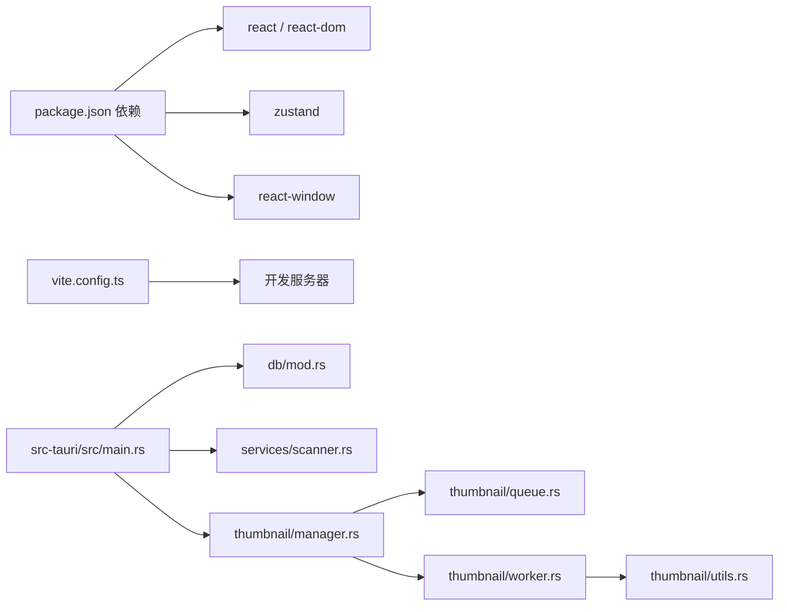

# 性能优化

<cite>
**本文引用的文件**
- [package.json](file://package.json)
- [vite.config.ts](file://vite.config.ts)
- [src/main.tsx](file://src/main.tsx)
- [src/App.tsx](file://src/App.tsx)
- [src/store/useAppStore.ts](file://src/store/useAppStore.ts)
- [src/components/MediaGrid.tsx](file://src/components/MediaGrid.tsx)
- [src/components/MediaCard.tsx](file://src/components/MediaCard.tsx)
- [src-tauri/src/main.rs](file://src-tauri/src/main.rs)
- [src-tauri/src/db/mod.rs](file://src-tauri/src/db/mod.rs)
- [src-tauri/src/services/scanner.rs](file://src-tauri/src/services/scanner.rs)
- [src-tauri/src/thumbnail/manager.rs](file://src-tauri/src/thumbnail/manager.rs)
- [src-tauri/src/thumbnail/queue.rs](file://src-tauri/src/thumbnail/queue.rs)
- [src-tauri/src/thumbnail/worker.rs](file://src-tauri/src/thumbnail/worker.rs)
- [src-tauri/src/thumbnail/utils.rs](file://src-tauri/src/thumbnail/utils.rs)
</cite>

## 目录
1. [简介](#简介)
2. [项目结构](#项目结构)
3. [核心组件](#核心组件)
4. [架构总览](#架构总览)
5. [详细组件分析](#详细组件分析)
6. [依赖关系分析](#依赖关系分析)
7. [性能考量与优化建议](#性能考量与优化建议)
8. [故障排查指南](#故障排查指南)
9. [结论](#结论)
10. [附录](#附录)

## 简介
本指南面向 Medex 桌面应用的性能优化，覆盖前端 React 组件性能、虚拟化渲染、内存与垃圾回收优化；后端 Rust 并发与数据库优化；缩略图系统并发调度与 I/O；以及大数据量场景下的分页/增量更新与资源限制策略。文档同时提供可视化流程图与最佳实践，帮助开发者构建高性能的桌面应用。

## 项目结构
Medex 采用 Tauri + React 技术栈，前端负责 UI 与交互，后端 Rust 提供数据库、扫描与缩略图服务。关键目录与职责如下：
- 前端（React + Vite）：组件层、容器层、状态管理、主题与页面入口
- 后端（Rust + Tauri）：数据库初始化与连接池封装、媒体扫描与过滤、缩略图生成与队列调度

图表来源
- [src/main.tsx:1-44](file://src/main.tsx#L1-L44)
- [src/App.tsx:1-73](file://src/App.tsx#L1-L73)
- [src/store/useAppStore.ts:1-395](file://src/store/useAppStore.ts#L1-L395)
- [src/components/MediaGrid.tsx:1-351](file://src/components/MediaGrid.tsx#L1-L351)
- [src/components/MediaCard.tsx:1-318](file://src/components/MediaCard.tsx#L1-L318)
- [src-tauri/src/main.rs:1-69](file://src-tauri/src/main.rs#L1-L69)
- [src-tauri/src/db/mod.rs:1-123](file://src-tauri/src/db/mod.rs#L1-L123)
- [src-tauri/src/services/scanner.rs:1-525](file://src-tauri/src/services/scanner.rs#L1-L525)
- [src-tauri/src/thumbnail/manager.rs:1-108](file://src-tauri/src/thumbnail/manager.rs#L1-L108)
- [src-tauri/src/thumbnail/queue.rs:1-12](file://src-tauri/src/thumbnail/queue.rs#L1-L12)
- [src-tauri/src/thumbnail/worker.rs:1-96](file://src-tauri/src/thumbnail/worker.rs#L1-L96)
- [src-tauri/src/thumbnail/utils.rs:1-158](file://src-tauri/src/thumbnail/utils.rs#L1-L158)

章节来源
- [src/main.tsx:1-44](file://src/main.tsx#L1-L44)
- [src-tauri/src/main.rs:1-69](file://src-tauri/src/main.rs#L1-L69)

## 核心组件
- 前端入口与路由式渲染：根据 URL 决定渲染主界面或设置/更新页面，减少不必要的全局初始化。
- 应用根组件：聚合侧边栏、主内容区与媒体查看器，按需计算当前视图媒体列表，避免重复筛选。
- 状态管理：Zustand 存储媒体项、标签、导航项与视图模式，提供批量合并与本地变更接口，降低重渲染范围。
- 虚拟化网格/列表：react-window 固定尺寸网格与列表，配合 overscan 控制可见区域外预渲染数量，显著降低 DOM 数量。
- 缩略图系统：基于多线程工作池与有界同步队列，防抖重复任务，命中缓存即返回占位图，异步回传真实缩略图。
- 数据库：SQLite 初始化与索引，扫描阶段使用事务批量插入，查询阶段使用 LEFT JOIN + GROUP BY + 索引排序。

章节来源
- [src/main.tsx:9-44](file://src/main.tsx#L9-L44)
- [src/App.tsx:16-26](file://src/App.tsx#L16-L26)
- [src/store/useAppStore.ts:145-395](file://src/store/useAppStore.ts#L145-L395)
- [src/components/MediaGrid.tsx:70-212](file://src/components/MediaGrid.tsx#L70-L212)
- [src-tauri/src/thumbnail/manager.rs:24-108](file://src-tauri/src/thumbnail/manager.rs#L24-L108)
- [src-tauri/src/db/mod.rs:45-64](file://src-tauri/src/db/mod.rs#L45-L64)

## 架构总览
前端通过 Tauri 暴露的命令调用后端能力，后端以模块化方式组织数据库、扫描与缩略图子系统，形成清晰的职责边界与可扩展性。

图表来源
- [src-tauri/src/main.rs:49-65](file://src-tauri/src/main.rs#L49-L65)
- [src-tauri/src/services/scanner.rs:160-163](file://src-tauri/src/services/scanner.rs#L160-L163)
- [src-tauri/src/db/mod.rs:97-110](file://src-tauri/src/db/mod.rs#L97-L110)
- [src-tauri/src/thumbnail/manager.rs:51-106](file://src-tauri/src/thumbnail/manager.rs#L51-L106)

## 详细组件分析

### 前端组件性能优化
- 虚拟化渲染
  - 使用固定尺寸网格与列表，仅渲染可视区域及少量 overscan，大幅降低 DOM 节点数与重排成本。
  - 可见范围回调用于触发懒加载与滚动优化。
- 组件记忆化
  - MediaGrid 与 MediaCard 使用 memo 包装，结合浅比较与自定义相等函数，避免不必要重渲染。
  - 列表/网格数据对象 useMemo 化，减少引用变化。
- 图片与视频懒加载
  - 图片与视频缩略图均使用延迟加载与解码提示，失败/未就绪时显示占位，提升首屏与滚动流畅度。
- 状态粒度与计算优化
  - 在 App 层按导航条件筛选当前视图媒体列表，避免在卡片层重复计算。
  - Zustand 将媒体项与标签的批量合并与本地变更拆分为原子操作，降低订阅者重渲染次数。

图表来源
- [src/components/MediaGrid.tsx:70-212](file://src/components/MediaGrid.tsx#L70-L212)
- [src/components/MediaCard.tsx:277-317](file://src/components/MediaCard.tsx#L277-L317)

章节来源
- [src/components/MediaGrid.tsx:70-212](file://src/components/MediaGrid.tsx#L70-L212)
- [src/components/MediaCard.tsx:153-184](file://src/components/MediaCard.tsx#L153-L184)
- [src/App.tsx:16-26](file://src/App.tsx#L16-L26)
- [src/store/useAppStore.ts:258-276](file://src/store/useAppStore.ts#L258-L276)

### 缩略图生成系统性能优化
- 并发任务调度
  - 多工作线程从有界同步队列拉取任务，避免主线程阻塞。
  - 使用 HashSet 记录正在处理的任务，防止重复入队。
- 队列管理
  - 同步通道容量受控，队列满时返回占位图，避免阻塞调用方。
- 内存与 I/O 优化
  - 输出路径基于视频路径哈希，命中缓存直接返回；FFmpeg 参数限定缩放与帧数，减少 I/O 与 CPU 开销。
- 错误与可观测性
  - 任务失败与队列断开进行日志记录与错误传播；生成完成后通过事件通知前端。

图表来源
- [src-tauri/src/thumbnail/manager.rs:51-106](file://src-tauri/src/thumbnail/manager.rs#L51-L106)
- [src-tauri/src/thumbnail/queue.rs:8-11](file://src-tauri/src/thumbnail/queue.rs#L8-L11)
- [src-tauri/src/thumbnail/worker.rs:26-49](file://src-tauri/src/thumbnail/worker.rs#L26-L49)
- [src-tauri/src/thumbnail/utils.rs:36-61](file://src-tauri/src/thumbnail/utils.rs#L36-L61)

章节来源
- [src-tauri/src/thumbnail/manager.rs:24-108](file://src-tauri/src/thumbnail/manager.rs#L24-L108)
- [src-tauri/src/thumbnail/worker.rs:52-96](file://src-tauri/src/thumbnail/worker.rs#L52-L96)
- [src-tauri/src/thumbnail/utils.rs:20-34](file://src-tauri/src/thumbnail/utils.rs#L20-L34)

### 后端数据库与扫描优化
- 数据库初始化与索引
  - 初始化时创建媒体、标签、关联表与最近观看表，并建立常用查询索引，确保排序与连接高效。
- 扫描与入库
  - 使用 walkdir 递归扫描，批量插入使用事务，显著降低写放大与锁竞争。
- 查询优化
  - 获取全部媒体与按标签过滤时，使用 LEFT JOIN + GROUP BY + 索引排序，避免 N+1 查询。
- 最近观看剪裁
  - 每次更新最近观看时，保留最近 N 条记录，避免表膨胀。

图表来源
- [src-tauri/src/services/scanner.rs:54-88](file://src-tauri/src/services/scanner.rs#L54-L88)
- [src-tauri/src/services/scanner.rs:90-115](file://src-tauri/src/services/scanner.rs#L90-L115)
- [src-tauri/src/services/scanner.rs:117-158](file://src-tauri/src/services/scanner.rs#L117-L158)
- [src-tauri/src/db/mod.rs:12-43](file://src-tauri/src/db/mod.rs#L12-L43)

章节来源
- [src-tauri/src/db/mod.rs:45-64](file://src-tauri/src/db/mod.rs#L45-L64)
- [src-tauri/src/services/scanner.rs:250-341](file://src-tauri/src/services/scanner.rs#L250-L341)
- [src-tauri/src/services/scanner.rs:357-389](file://src-tauri/src/services/scanner.rs#L357-L389)

### 大数据量处理优化方案
- 分页加载
  - 在查询层支持按需分页（如按主键倒序分页），避免一次性加载全部数据。
- 增量更新
  - 使用“最近观看”表维护小规模热点数据，定期剪裁；标签与媒体关联表通过批量插入与事务保证一致性。
- 资源限制
  - 缩略图队列容量与工作线程数按机器配置动态调整；前端虚拟化渲染严格控制 overscan，避免内存峰值过高。

章节来源
- [src-tauri/src/services/scanner.rs:372-382](file://src-tauri/src/services/scanner.rs#L372-L382)
- [src-tauri/src/thumbnail/manager.rs:33-41](file://src-tauri/src/thumbnail/manager.rs#L33-L41)
- [src/components/MediaGrid.tsx:152-153](file://src/components/MediaGrid.tsx#L152-L153)

## 依赖关系分析
- 前端依赖
  - React 生态与 react-window 虚拟化渲染；Zustand 状态管理；Vite 开发服务器。
- 后端依赖
  - Tauri 运行时与插件；rusqlite SQLite；walkdir 文件扫描；once_cell 单例连接；anyhow 错误处理。

图表来源
- [package.json:12-34](file://package.json#L12-L34)
- [vite.config.ts:1-11](file://vite.config.ts#L1-L11)
- [src-tauri/src/main.rs:10-69](file://src-tauri/src/main.rs#L10-L69)

章节来源
- [package.json:12-34](file://package.json#L12-L34)
- [vite.config.ts:1-11](file://vite.config.ts#L1-L11)
- [src-tauri/src/main.rs:10-69](file://src-tauri/src/main.rs#L10-L69)

## 性能考量与优化建议

### 前端性能优化清单
- 组件层级与渲染
  - 使用 memo 与 useMemo，避免深层重渲染；将昂贵计算上移至容器组件。
  - 控制虚拟化 overscan 数量，结合滚动事件节流，平衡首屏与滚动体验。
- 图像与视频
  - 为图片设置解码与懒加载属性；视频缩略图优先展示占位，异步替换。
  - 对远端与本地资源统一转换为可访问 URL，避免额外转换开销。
- 状态管理
  - 将大数组的局部更新拆分为原子动作，减少订阅者响应范围。
  - 批量合并来自数据库的媒体项，保留本地状态（如是否最近）以避免重复查询。

章节来源
- [src/components/MediaCard.tsx:153-184](file://src/components/MediaCard.tsx#L153-L184)
- [src/components/MediaGrid.tsx:181-205](file://src/components/MediaGrid.tsx#L181-L205)
- [src/store/useAppStore.ts:258-276](file://src/store/useAppStore.ts#L258-L276)

### 后端性能优化清单
- 数据库
  - 事务批量写入；合理使用索引（路径、关联键、最近观看时间）；避免 SELECT *，按需投影。
  - 定期清理最近观看表，维持小而精的热点集合。
- 扫描
  - 递归扫描时跳过非媒体文件；对异常条目进行容错处理，避免中断。
- 缩略图
  - 限制队列容量与工作线程数；命中缓存立即返回；失败与断开进行日志记录以便定位瓶颈。

章节来源
- [src-tauri/src/db/mod.rs:12-43](file://src-tauri/src/db/mod.rs#L12-L43)
- [src-tauri/src/services/scanner.rs:54-88](file://src-tauri/src/services/scanner.rs#L54-L88)
- [src-tauri/src/thumbnail/manager.rs:33-41](file://src-tauri/src/thumbnail/manager.rs#L33-L41)

### 大数据量处理最佳实践
- 分页与增量
  - 前端：虚拟化 + 分页滚动；后端：按主键倒序分页，限制单页大小。
- 资源限制
  - 缩略图：队列容量与线程数上限；前端：overscan 与可见区域阈值。
- 缓存与去重
  - 缩略图缓存目录与哈希命名；重复任务去重标记。

章节来源
- [src-tauri/src/services/scanner.rs:160-163](file://src-tauri/src/services/scanner.rs#L160-L163)
- [src-tauri/src/thumbnail/utils.rs:31-34](file://src-tauri/src/thumbnail/utils.rs#L31-L34)
- [src-tauri/src/thumbnail/manager.rs:71-75](file://src-tauri/src/thumbnail/manager.rs#L71-L75)

### 性能监控与分析
- 指标采集
  - 前端：测量虚拟化渲染首帧时间、滚动帧率、图片加载耗时；后端：扫描进度事件、队列长度、工作线程空闲率。
- 瓶颈识别
  - 前端：React Profiler 与浏览器性能面板；后端：日志与事件统计。
- 效果评估
  - 对比不同 overscan 与线程数下的吞吐与延迟；对比启用/禁用缓存的缩略图生成时间。

[本节为通用指导，无需特定文件来源]

## 故障排查指南
- 缩略图未生成
  - 检查 FFmpeg 可执行文件解析路径与可用性；确认缓存目录创建成功；观察队列是否频繁满载。
- 扫描卡顿或中断
  - 查看 walkdir 异常日志；确认事务提交路径；检查磁盘权限与路径有效性。
- 数据库性能问题
  - 确认索引已创建；避免在热路径上执行全表扫描；关注最近观看表大小。

章节来源
- [src-tauri/src/thumbnail/utils.rs:71-96](file://src-tauri/src/thumbnail/utils.rs#L71-L96)
- [src-tauri/src/thumbnail/manager.rs:83-102](file://src-tauri/src/thumbnail/manager.rs#L83-L102)
- [src-tauri/src/services/scanner.rs:57-64](file://src-tauri/src/services/scanner.rs#L57-L64)
- [src-tauri/src/db/mod.rs:45-64](file://src-tauri/src/db/mod.rs#L45-L64)

## 结论
通过前端虚拟化渲染、组件记忆化与状态粒度优化，结合后端事务批量写入、索引与最近数据剪裁，以及缩略图系统的并发队列与缓存策略，Medex 能够在海量媒体场景下保持流畅的用户体验。建议持续以指标驱动迭代，逐步调优 overscan、线程数与队列容量，确保在不同硬件配置下稳定运行。

## 附录
- 开发与构建
  - 开发服务器端口与严格端口配置，便于本地调试与网络联调。
- 页面入口
  - 根据路径选择性渲染设置/更新页面，减少主应用初始化开销。

章节来源
- [vite.config.ts:6-9](file://vite.config.ts#L6-L9)
- [src/main.tsx:16-40](file://src/main.tsx#L16-L40)