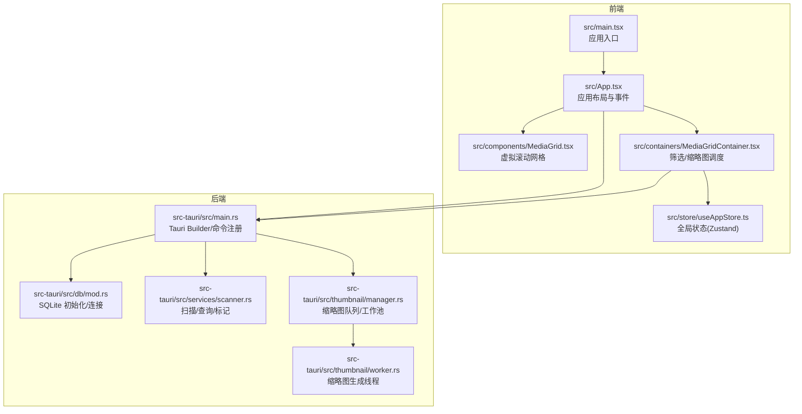
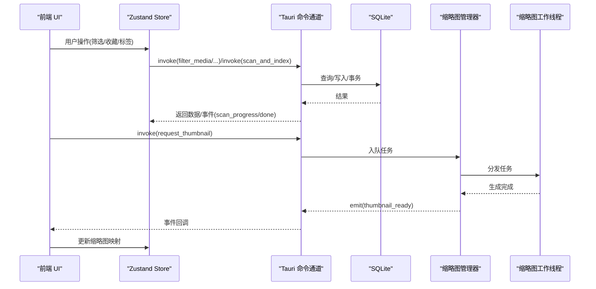
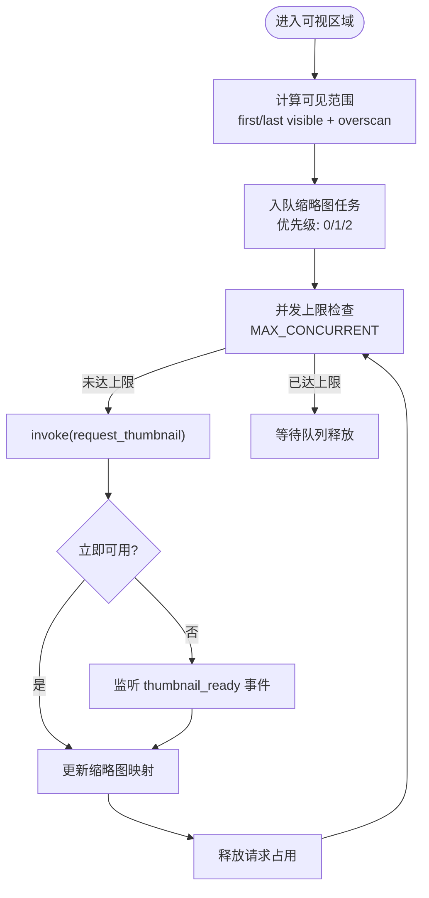
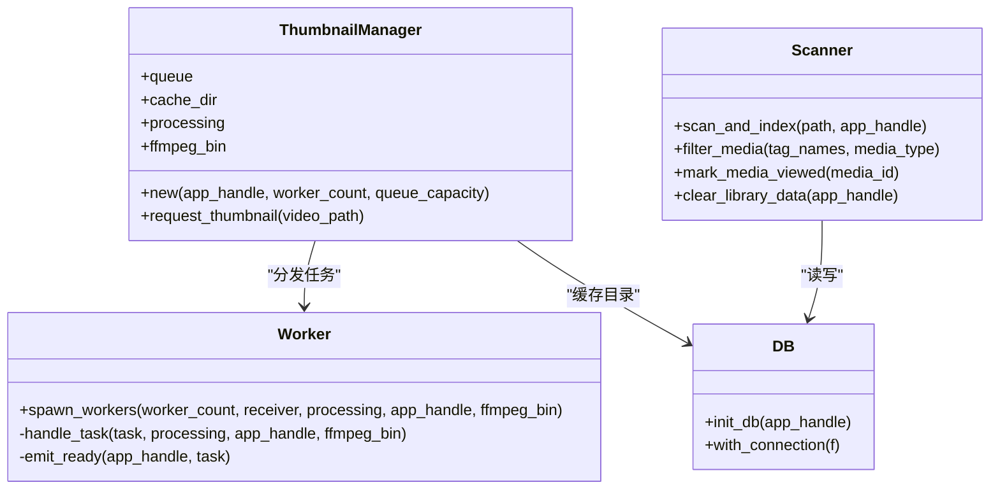
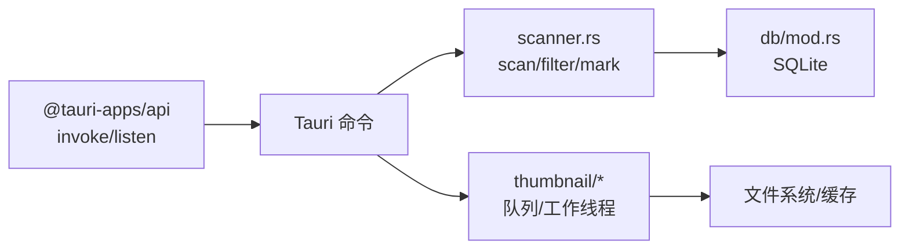

# 性能监控与分析

<cite>
**本文引用的文件**
- [README.md](file://README.md)
- [package.json](file://package.json)
- [vite.config.ts](file://vite.config.ts)
- [src/main.tsx](file://src/main.tsx)
- [src/App.tsx](file://src/App.tsx)
- [src/components/MediaGrid.tsx](file://src/components/MediaGrid.tsx)
- [src/containers/MediaGridContainer.tsx](file://src/containers/MediaGridContainer.tsx)
- [src/store/useAppStore.ts](file://src/store/useAppStore.ts)
- [src-tauri/src/main.rs](file://src-tauri/src/main.rs)
- [src-tauri/src/db/mod.rs](file://src-tauri/src/db/mod.rs)
- [src-tauri/src/services/scanner.rs](file://src-tauri/src/services/scanner.rs)
- [src-tauri/src/thumbnail/manager.rs](file://src-tauri/src/thumbnail/manager.rs)
- [src-tauri/src/thumbnail/worker.rs](file://src-tauri/src/thumbnail/worker.rs)
- [API_REFERENCE.md](file://API_REFERENCE.md)
- [DEVELOPMENT.md](file://DEVELOPMENT.md)
</cite>

## 目录
1. [简介](#简介)
2. [项目结构](#项目结构)
3. [核心组件](#核心组件)
4. [架构总览](#架构总览)
5. [详细组件分析](#详细组件分析)
6. [依赖关系分析](#依赖关系分析)
7. [性能考量](#性能考量)
8. [故障排查指南](#故障排查指南)
9. [结论](#结论)
10. [附录](#附录)

## 简介
本指南面向 Medex 的性能监控与分析，围绕前端与后端两条主线，系统阐述性能指标采集、分析策略、工具使用与优化验证方法。结合项目现有实现，给出可落地的监控配置与分析案例，帮助团队建立完善的性能监控体系。

## 项目结构
Medex 采用 React + TypeScript + Tauri V2 + TailwindCSS 的组合，前端负责 UI、状态与事件编排，后端（Rust/Tauri）负责数据库、扫描与缩略图生成等 CPU/IO 密集任务。前端通过 Tauri invoke 与命令通道与后端交互，后端通过事件向前端推送进度与结果。

图表来源
- [src/main.tsx:1-44](file://src/main.tsx#L1-L44)
- [src/App.tsx:1-73](file://src/App.tsx#L1-L73)
- [src/components/MediaGrid.tsx:1-351](file://src/components/MediaGrid.tsx#L1-L351)
- [src/containers/MediaGridContainer.tsx:1-619](file://src/containers/MediaGridContainer.tsx#L1-L619)
- [src/store/useAppStore.ts:1-395](file://src/store/useAppStore.ts#L1-L395)
- [src-tauri/src/main.rs:1-69](file://src-tauri/src/main.rs#L1-L69)
- [src-tauri/src/db/mod.rs:1-123](file://src-tauri/src/db/mod.rs#L1-L123)
- [src-tauri/src/services/scanner.rs:1-525](file://src-tauri/src/services/scanner.rs#L1-L525)
- [src-tauri/src/thumbnail/manager.rs:1-108](file://src-tauri/src/thumbnail/manager.rs#L1-L108)
- [src-tauri/src/thumbnail/worker.rs:1-96](file://src-tauri/src/thumbnail/worker.rs#L1-L96)

章节来源
- [README.md:97-119](file://README.md#L97-L119)
- [package.json:1-36](file://package.json#L1-L36)
- [vite.config.ts:1-11](file://vite.config.ts#L1-L11)

## 核心组件
- 前端应用入口与路由：根据路径决定渲染 Settings、Update 或主应用。
- 应用布局与事件：处理媒体查看器打开/关闭、调用后端标记“最近观看”。
- 媒体网格：基于 react-window 的虚拟滚动，支持网格与列表两种视图，计算可见范围并触发缩略图请求。
- 网格容器：负责筛选、批量标签、收藏、上下文菜单、缩略图队列与并发控制、事件监听与状态同步。
- 全局状态：Zustand store 管理导航、标签、媒体项、选择态、视图模式与媒体类型过滤。
- 后端入口：注册 Tauri 命令，初始化数据库与缩略图系统，设置菜单与事件监听。
- 数据库：SQLite 初始化、表与索引、连接池封装。
- 扫描服务：扫描目录、批量插入、查询过滤、标记最近观看、清理库数据。
- 缩略图系统：队列 + 多线程工作池，请求去重、并发上限、事件回调。

章节来源
- [src/main.tsx:9-44](file://src/main.tsx#L9-L44)
- [src/App.tsx:28-72](file://src/App.tsx#L28-L72)
- [src/components/MediaGrid.tsx:70-212](file://src/components/MediaGrid.tsx#L70-L212)
- [src/containers/MediaGridContainer.tsx:30-619](file://src/containers/MediaGridContainer.tsx#L30-L619)
- [src/store/useAppStore.ts:145-395](file://src/store/useAppStore.ts#L145-L395)
- [src-tauri/src/main.rs:10-69](file://src-tauri/src/main.rs#L10-L69)
- [src-tauri/src/db/mod.rs:45-123](file://src-tauri/src/db/mod.rs#L45-L123)
- [src-tauri/src/services/scanner.rs:160-341](file://src-tauri/src/services/scanner.rs#L160-L341)
- [src-tauri/src/thumbnail/manager.rs:23-108](file://src-tauri/src/thumbnail/manager.rs#L23-L108)
- [src-tauri/src/thumbnail/worker.rs:13-96](file://src-tauri/src/thumbnail/worker.rs#L13-L96)

## 架构总览
前端通过 Tauri invoke 调用后端命令，后端执行数据库操作或生成缩略图，完成后通过事件通知前端更新 UI。缩略图生成采用异步队列与多线程，避免阻塞主线程。

图表来源
- [src-tauri/src/main.rs:49-65](file://src-tauri/src/main.rs#L49-L65)
- [src-tauri/src/services/scanner.rs:160-341](file://src-tauri/src/services/scanner.rs#L160-L341)
- [src-tauri/src/db/mod.rs:97-123](file://src-tauri/src/db/mod.rs#L97-L123)
- [src-tauri/src/thumbnail/manager.rs:51-108](file://src-tauri/src/thumbnail/manager.rs#L51-L108)
- [src-tauri/src/thumbnail/worker.rs:52-96](file://src-tauri/src/thumbnail/worker.rs#L52-L96)
- [src/containers/MediaGridContainer.tsx:417-486](file://src/containers/MediaGridContainer.tsx#L417-L486)

## 详细组件分析

### 前端性能监控与分析
- 虚拟滚动与可见范围计算：MediaGrid 使用 react-window 的 FixedSizeGrid/FixedSizeList，通过 onItemsRendered 回调计算 first/last 可见索引与 overscan 区域，用于触发缩略图请求，减少不必要的 IO。
- 缩略图请求调度：MediaGridContainer 维护任务队列、并发上限与去重集合，按优先级与视口位置入队，避免重复请求与队列溢出。
- 事件驱动的状态同步：通过 window.dispatchEvent 与 Tauri 事件（如 thumbnail_ready、scan_progress、scan_done）实现跨容器同步，降低耦合。
- 全局状态与选择态：Zustand store 管理导航、标签、媒体项与选择态，避免重复渲染与不必要计算。
- 路由与页面切换：main.tsx 根据路径选择渲染 Settings、Update 或 App，减少无关模块加载。

图表来源
- [src/components/MediaGrid.tsx:183-206](file://src/components/MediaGrid.tsx#L183-L206)
- [src/containers/MediaGridContainer.tsx:390-451](file://src/containers/MediaGridContainer.tsx#L390-L451)
- [src/containers/MediaGridContainer.tsx:453-486](file://src/containers/MediaGridContainer.tsx#L453-L486)

章节来源
- [src/components/MediaGrid.tsx:70-212](file://src/components/MediaGrid.tsx#L70-L212)
- [src/containers/MediaGridContainer.tsx:30-619](file://src/containers/MediaGridContainer.tsx#L30-L619)
- [src/store/useAppStore.ts:145-395](file://src/store/useAppStore.ts#L145-L395)
- [src/main.tsx:9-44](file://src/main.tsx#L9-L44)

### 后端性能监控与分析
- Tauri Builder 与命令注册：集中注册扫描、过滤、标签、缩略图等命令，便于统一监控与限流。
- 数据库初始化与连接：OnceCell + Mutex 管理连接，确保线程安全；创建索引提升查询性能。
- 扫描与索引：批量插入使用事务，减少磁盘写放大；扫描进度通过事件广播，前端可实时反馈。
- 缩略图系统：队列容量与工作线程数可调；处理去重、队列满与断开错误；生成失败记录日志。
- 最近观看标记：使用 upsert 并限制条目数量，避免历史无限增长。

图表来源
- [src-tauri/src/thumbnail/manager.rs:16-108](file://src-tauri/src/thumbnail/manager.rs#L16-L108)
- [src-tauri/src/thumbnail/worker.rs:13-96](file://src-tauri/src/thumbnail/worker.rs#L13-L96)
- [src-tauri/src/services/scanner.rs:250-341](file://src-tauri/src/services/scanner.rs#L250-L341)
- [src-tauri/src/db/mod.rs:45-123](file://src-tauri/src/db/mod.rs#L45-L123)

章节来源
- [src-tauri/src/main.rs:10-69](file://src-tauri/src/main.rs#L10-L69)
- [src-tauri/src/db/mod.rs:45-123](file://src-tauri/src/db/mod.rs#L45-L123)
- [src-tauri/src/services/scanner.rs:160-341](file://src-tauri/src/services/scanner.rs#L160-L341)
- [src-tauri/src/thumbnail/manager.rs:23-108](file://src-tauri/src/thumbnail/manager.rs#L23-L108)
- [src-tauri/src/thumbnail/worker.rs:13-96](file://src-tauri/src/thumbnail/worker.rs#L13-L96)

### 性能数据收集与分析策略
- 关键性能指标(KPI)定义
  - 前端：首屏渲染时间、首包时间、交互延迟、滚动帧率(FPS)、缩略图加载耗时、事件响应延迟。
  - 后端：扫描耗时、数据库查询耗时、事务提交耗时、缩略图生成耗时、队列积压时长。
- 性能基准测试
  - 大规模媒体库扫描：准备 N 万级媒体文件目录，测量 scan_and_index 总耗时与平均插入耗时。
  - 虚拟滚动压测：在不同分辨率与列数下滚动，记录 FPS、卡顿次数与内存峰值。
  - 缩略图并发压测：模拟高并发请求，观察队列长度、生成耗时与失败率。
- 回归检测
  - 将上述指标纳入 CI，设定阈值告警；对每次变更进行对比分析，定位回归点。

章节来源
- [DEVELOPMENT.md:607-618](file://DEVELOPMENT.md#L607-L618)

### 性能分析工具使用
- 前端
  - Chrome DevTools Performance 面板：录制交互（滚动、筛选、打开查看器），分析主线程耗时、GC、布局与绘制热点。
  - Firefox Profiler：对比不同浏览器的性能特征，识别平台差异。
  - React Profiler：配合 React DevTools，定位组件重渲染热点与优化点。
- 后端
  - Rust 性能分析：使用 perf、flamegraph 或 rr 录制后端进程，分析 CPU 热点与系统调用。
  - 系统资源监控：top/htop、iotop、sar、netstat、iostat，观测 CPU、内存、IO、网络。
  - Tauri 日志：结合后端 println/eprintln 输出与事件日志，定位慢查询与异常路径。

章节来源
- [src-tauri/src/services/scanner.rs:250-341](file://src-tauri/src/services/scanner.rs#L250-L341)
- [src-tauri/src/thumbnail/manager.rs:51-108](file://src-tauri/src/thumbnail/manager.rs#L51-L108)

### 性能优化验证方法
- A/B 测试：对缩略图并发参数、虚拟滚动 overscan、数据库索引策略进行 A/B 对比，评估收益。
- 性能回归测试：在 CI 中加入基准测试脚本，自动比较关键指标，异常即告警。
- 用户体验指标跟踪：记录用户关键动作（打开查看器、切换视图、筛选）的时延分布，关注 P95/P99。

章节来源
- [DEVELOPMENT.md:607-618](file://DEVELOPMENT.md#L607-L618)

## 依赖关系分析
- 前端依赖
  - @tauri-apps/api：与后端通信、事件监听。
  - react-window：虚拟滚动，降低 DOM 与重绘成本。
  - zustand：轻量全局状态管理，避免深层 props 传递。
- 后端依赖
  - rusqlite：SQLite 访问与事务。
  - walkdir：递归遍历目录。
  - tauri-plugin-dialog/updater：桌面能力扩展。

图表来源
- [package.json:12-34](file://package.json#L12-L34)
- [src-tauri/src/main.rs:49-65](file://src-tauri/src/main.rs#L49-L65)
- [src-tauri/src/services/scanner.rs:160-341](file://src-tauri/src/services/scanner.rs#L160-L341)
- [src-tauri/src/db/mod.rs:45-123](file://src-tauri/src/db/mod.rs#L45-L123)
- [src-tauri/src/thumbnail/manager.rs:23-108](file://src-tauri/src/thumbnail/manager.rs#L23-L108)

章节来源
- [package.json:12-34](file://package.json#L12-L34)
- [src-tauri/src/main.rs:10-69](file://src-tauri/src/main.rs#L10-L69)

## 性能考量
- 前端
  - 虚拟滚动参数：grid/list 的 overscan 与行列数应随容器尺寸动态调整，避免过度渲染。
  - 缩略图并发：合理设置 MAX_CONCURRENT 与队列容量，防止内存与磁盘抖动。
  - 事件与状态：尽量使用局部状态与 useMemo/memo，减少全局重渲染。
- 后端
  - 数据库：批量插入使用事务；查询涉及多表关联时，确保索引覆盖；限制最近观看条目数量。
  - 缩略图：队列满时返回占位图，避免阻塞；失败重试与超时回收机制待增强。
  - 日志：区分 info/warn/error，避免过多 console 输出影响性能。

章节来源
- [src/components/MediaGrid.tsx:183-206](file://src/components/MediaGrid.tsx#L183-L206)
- [src/containers/MediaGridContainer.tsx:27-28](file://src/containers/MediaGridContainer.tsx#L27-L28)
- [src-tauri/src/services/scanner.rs:90-115](file://src-tauri/src/services/scanner.rs#L90-L115)
- [src-tauri/src/db/mod.rs:39-43](file://src-tauri/src/db/mod.rs#L39-L43)
- [DEVELOPMENT.md:482-484](file://DEVELOPMENT.md#L482-L484)

## 故障排查指南
- 缩略图无法生成
  - 检查 ffmpeg 是否可用与路径解析是否正确。
  - 观察队列是否满导致返回占位图；适当提高队列容量或并发。
  - 监听 thumbnail_ready 事件是否到达，确认事件回调与状态更新。
- 扫描缓慢
  - 确认事务批处理是否生效；检查磁盘 IO 与目录权限。
  - 监听 scan_progress 事件，定位瓶颈阶段。
- 数据库锁与慢查询
  - 检查索引是否存在；避免在主线程执行长事务。
- 事件丢失或状态不一致
  - 使用 window.dispatchEvent 时，确保只在必要场景使用；考虑迁移到 Zustand action 或统一查询层。

章节来源
- [src-tauri/src/thumbnail/manager.rs:51-108](file://src-tauri/src/thumbnail/manager.rs#L51-L108)
- [src-tauri/src/thumbnail/worker.rs:52-96](file://src-tauri/src/thumbnail/worker.rs#L52-L96)
- [src-tauri/src/services/scanner.rs:250-341](file://src-tauri/src/services/scanner.rs#L250-L341)
- [src-tauri/src/db/mod.rs:97-123](file://src-tauri/src/db/mod.rs#L97-L123)
- [API_REFERENCE.md:411-439](file://API_REFERENCE.md#L411-L439)
- [DEVELOPMENT.md:482-492](file://DEVELOPMENT.md#L482-L492)

## 结论
通过前端虚拟滚动与事件驱动的缩略图调度、后端事务化扫描与多线程缩略图生成，Medex 已具备良好的性能基础。建议进一步完善并发与超时回收机制、引入统一日志分级与指标埋点、在 CI 中固化性能回归测试，从而形成闭环的性能监控与优化体系。

## 附录
- 监控配置示例（概念性）
  - 前端：在 MediaGridContainer 中增加性能计时器，记录从入队到事件回调的时间；在虚拟滚动回调中统计可见区域渲染耗时。
  - 后端：在 scanner.rs 的关键路径（批量插入、事务提交、最近观看 upsert）增加计时与日志；在 thumbnail/manager.rs 记录队列长度与处理耗时。
- 性能分析案例（概念性）
  - 案例一：大目录扫描（10k+ 文件）：观察 scan_and_index 总耗时与每批次平均耗时，定位磁盘 IO 与索引创建瓶颈。
  - 案例二：滚动性能（1080p/4K）：在不同 overscan 设置下测量 FPS，评估渲染与图片解码开销。
  - 案例三：缩略图并发（高并发）：观察队列积压与失败率，调整并发与队列容量。

章节来源
- [src/containers/MediaGridContainer.tsx:417-486](file://src/containers/MediaGridContainer.tsx#L417-L486)
- [src-tauri/src/services/scanner.rs:250-341](file://src-tauri/src/services/scanner.rs#L250-L341)
- [src-tauri/src/thumbnail/manager.rs:51-108](file://src-tauri/src/thumbnail/manager.rs#L51-L108)