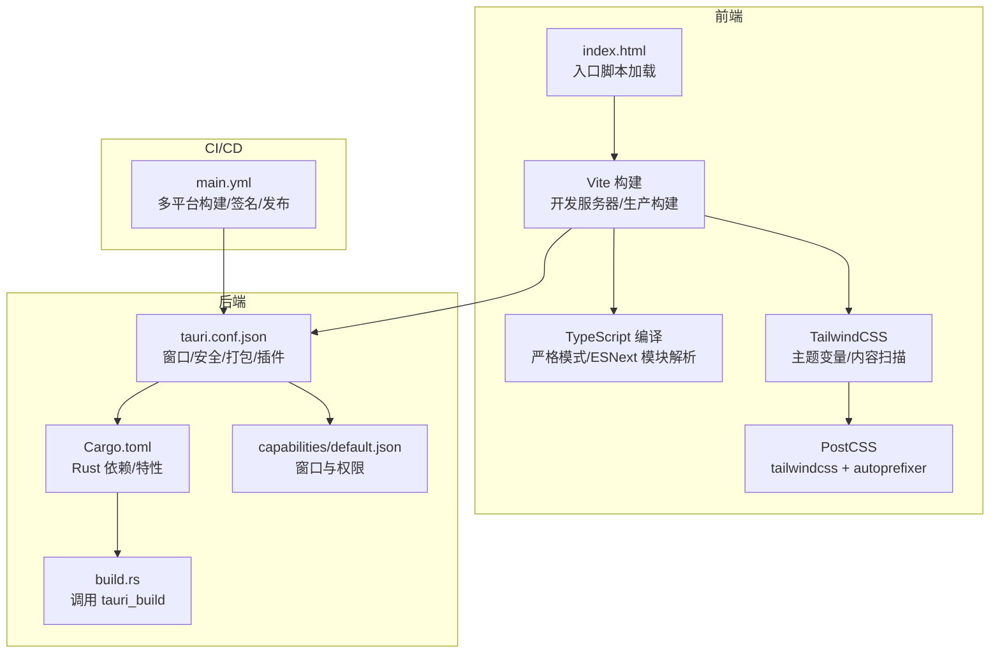
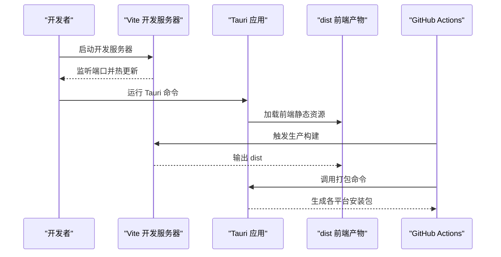
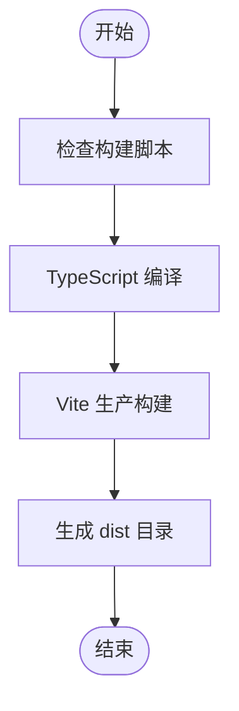
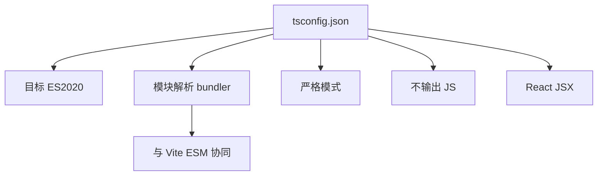
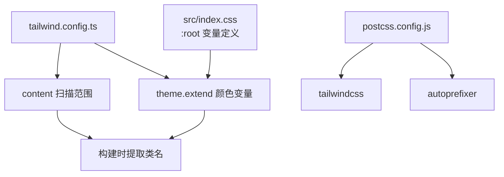
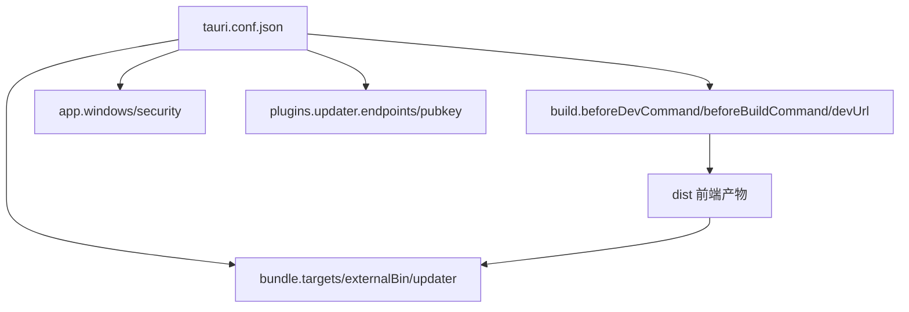
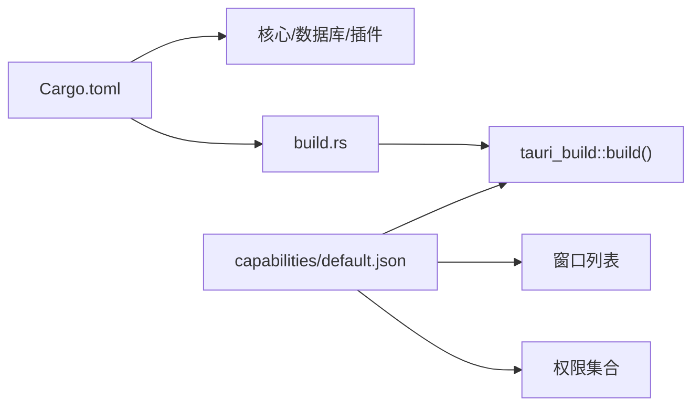
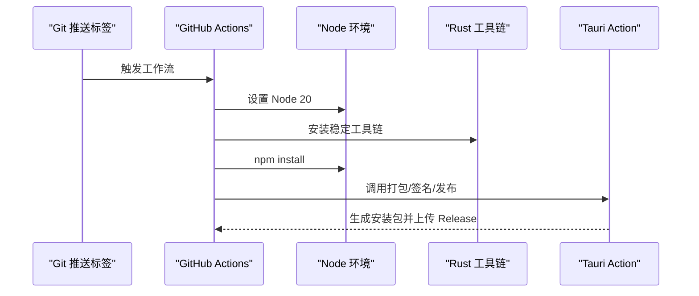
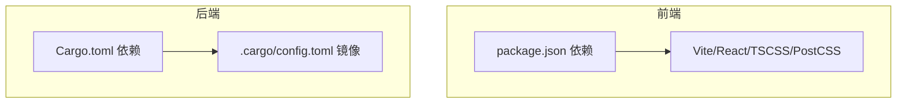

# 构建配置

<cite>
**本文引用的文件**
- [vite.config.ts](file://vite.config.ts)
- [package.json](file://package.json)
- [src-tauri/tauri.conf.json](file://src-tauri/tauri.conf.json)
- [tsconfig.json](file://tsconfig.json)
- [tailwind.config.ts](file://tailwind.config.ts)
- [postcss.config.js](file://postcss.config.js)
- [src/index.css](file://src/index.css)
- [src/main.tsx](file://src/main.tsx)
- [index.html](file://index.html)
- [src-tauri/Cargo.toml](file://src-tauri/Cargo.toml)
- [src-tauri/build.rs](file://src-tauri/build.rs)
- [src-tauri/.cargo/config.toml](file://src-tauri/.cargo/config.toml)
- [src-tauri/capabilities/default.json](file://src-tauri/capabilities/default.json)
- [.github/workflows/main.yml](file://.github/workflows/main.yml)
</cite>

## 目录
1. [简介](#简介)
2. [项目结构](#项目结构)
3. [核心组件](#核心组件)
4. [架构总览](#架构总览)
5. [详细组件分析](#详细组件分析)
6. [依赖关系分析](#依赖关系分析)
7. [性能考量](#性能考量)
8. [故障排查指南](#故障排查指南)
9. [结论](#结论)
10. [附录](#附录)

## 简介
本文件系统性梳理 Medex 项目的构建配置，覆盖前端 Vite 构建、TypeScript 编译、TailwindCSS 样式体系、以及 Tauri 打包与权限配置，并结合 CI/CD 工作流给出部署与发布建议。目标是帮助开发者在不同环境下快速理解并高效维护构建流程。

## 项目结构
Medex 采用“前端 Vite + 后端 Rust(Tauri)”的双栈结构：
- 前端：React + TypeScript，使用 Vite 提供开发服务器与生产构建；TailwindCSS 负责样式，PostCSS 自动前缀。
- 后端：Tauri 应用通过 Rust 编译，使用 Cargo 管理依赖；打包时将前端产物 dist 注入为应用资源。
- CI/CD：GitHub Actions 在打标签时自动构建多平台安装包并上传到 Release。

图表来源
- [vite.config.ts:1-11](file://vite.config.ts#L1-L11)
- [package.json:1-36](file://package.json#L1-L36)
- [tailwind.config.ts:1-36](file://tailwind.config.ts#L1-L36)
- [postcss.config.js:1-7](file://postcss.config.js#L1-L7)
- [index.html:1-13](file://index.html#L1-L13)
- [src-tauri/tauri.conf.json:1-46](file://src-tauri/tauri.conf.json#L1-L46)
- [src-tauri/Cargo.toml:1-23](file://src-tauri/Cargo.toml#L1-L23)
- [src-tauri/build.rs:1-4](file://src-tauri/build.rs#L1-L4)
- [src-tauri/capabilities/default.json:1-15](file://src-tauri/capabilities/default.json#L1-L15)
- [.github/workflows/main.yml:1-42](file://.github/workflows/main.yml#L1-L42)

章节来源
- [vite.config.ts:1-11](file://vite.config.ts#L1-L11)
- [package.json:1-36](file://package.json#L1-L36)
- [src-tauri/tauri.conf.json:1-46](file://src-tauri/tauri.conf.json#L1-L46)
- [tsconfig.json:1-19](file://tsconfig.json#L1-L19)
- [tailwind.config.ts:1-36](file://tailwind.config.ts#L1-L36)
- [postcss.config.js:1-7](file://postcss.config.js#L1-L7)
- [src/index.css:1-156](file://src/index.css#L1-L156)
- [index.html:1-13](file://index.html#L1-L13)
- [src-tauri/Cargo.toml:1-23](file://src-tauri/Cargo.toml#L1-L23)
- [src-tauri/build.rs:1-4](file://src-tauri/build.rs#L1-L4)
- [src-tauri/.cargo/config.toml:1-5](file://src-tauri/.cargo/config.toml#L1-L5)
- [src-tauri/capabilities/default.json:1-15](file://src-tauri/capabilities/default.json#L1-L15)
- [.github/workflows/main.yml:1-42](file://.github/workflows/main.yml#L1-L42)

## 核心组件
- Vite 构建配置：启用 React 插件，本地开发服务器端口固定，便于 Tauri devUrl 对齐。
- TypeScript 编译配置：ESNext 模块解析、严格模式、JSX 仅用于 React 组件、无输出（由 Vite ESM）。
- TailwindCSS 配置：基于内容扫描 src 下 TS/TSX 文件与根 HTML，主题扩展自定义 CSS 变量。
- Tauri 配置：前后端联动构建、窗口尺寸与可调整属性、安全协议作用域、打包目标与外部二进制、更新器配置。
- Rust 依赖与能力：Cargo.toml 声明 Tauri 与数据库等依赖，capabilities 定义窗口与权限。

章节来源
- [vite.config.ts:1-11](file://vite.config.ts#L1-L11)
- [package.json:1-36](file://package.json#L1-L36)
- [tsconfig.json:1-19](file://tsconfig.json#L1-L19)
- [tailwind.config.ts:1-36](file://tailwind.config.ts#L1-L36)
- [postcss.config.js:1-7](file://postcss.config.js#L1-L7)
- [src-tauri/tauri.conf.json:1-46](file://src-tauri/tauri.conf.json#L1-L46)
- [src-tauri/Cargo.toml:1-23](file://src-tauri/Cargo.toml#L1-L23)
- [src-tauri/capabilities/default.json:1-15](file://src-tauri/capabilities/default.json#L1-L15)

## 架构总览
下图展示从开发到打包的关键流程：Vite 先于 Tauri 运行，Tauri 读取前端 dist 并注入资源，最终生成多平台安装包。

图表来源
- [vite.config.ts:6-9](file://vite.config.ts#L6-L9)
- [src-tauri/tauri.conf.json:6-11](file://src-tauri/tauri.conf.json#L6-L11)
- [package.json:6-11](file://package.json#L6-L11)
- [.github/workflows/main.yml:31-42](file://.github/workflows/main.yml#L31-L42)

## 详细组件分析

### Vite 构建配置
- 插件：已启用 React 插件，适配 JSX 与 React 生态。
- 开发服务器：固定端口与严格端口策略，确保 Tauri devUrl 一致。
- 生产构建：通过脚本先执行 TypeScript 编译再进行 Vite 构建，保证类型安全与打包一致性。

图表来源
- [package.json:8-9](file://package.json#L8-L9)
- [vite.config.ts:5](file://vite.config.ts#L5)
- [vite.config.ts:6-9](file://vite.config.ts#L6-L9)

章节来源
- [vite.config.ts:1-11](file://vite.config.ts#L1-L11)
- [package.json:6-11](file://package.json#L6-L11)

### TypeScript 编译配置
- 目标与模块：ES2020 目标、ESNext 模块解析，配合 Vite 的 ESM 打包。
- 类型检查：严格模式、跳过库检查、隔离模块、不输出 JS（由 Vite 处理）。
- JSX：仅对 React 组件生效，避免非 React 文件被错误识别。
- 路径映射：未显式配置 baseUrl/paths，遵循 bundler 默认解析行为。

图表来源
- [tsconfig.json:2-16](file://tsconfig.json#L2-L16)

章节来源
- [tsconfig.json:1-19](file://tsconfig.json#L1-L19)

### TailwindCSS 配置与样式体系
- 内容扫描：扫描根 HTML 与 src 下 TS/TSX 文件，确保按需生成样式。
- 主题扩展：通过 CSS 变量映射自定义色彩，实现深浅主题切换与统一风格。
- PostCSS：启用 tailwindcss 与 autoprefixer，自动添加浏览器前缀。

图表来源
- [tailwind.config.ts:3-33](file://tailwind.config.ts#L3-L33)
- [postcss.config.js:1-7](file://postcss.config.js#L1-L7)
- [src/index.css:1-156](file://src/index.css#L1-L156)

章节来源
- [tailwind.config.ts:1-36](file://tailwind.config.ts#L1-L36)
- [postcss.config.js:1-7](file://postcss.config.js#L1-L7)
- [src/index.css:1-156](file://src/index.css#L1-L156)

### Tauri 构建配置与打包
- 应用元数据：产品名、版本、标识符。
- 构建联动：devUrl 指向 Vite 开发端口，构建前命令指向前端构建脚本。
- 窗口与安全：窗口尺寸与可调整属性；安全协议启用资产作用域。
- 打包：开启打包、目标为 all、外部二进制包含 ffmpeg、启用更新器产物。
- 插件：更新器启用，配置检查端点与公钥。

图表来源
- [src-tauri/tauri.conf.json:6-44](file://src-tauri/tauri.conf.json#L6-L44)

章节来源
- [src-tauri/tauri.conf.json:1-46](file://src-tauri/tauri.conf.json#L1-L46)

### Rust 依赖与能力声明
- Cargo 依赖：Tauri 核心、序列化、SQLite（捆绑）、对话框与更新器插件等。
- 能力：声明默认能力集，包含主窗口、更新页、设置页及对话框、更新器权限。
- 构建：build.rs 调用 tauri_build 完成资源与能力注入。

图表来源
- [src-tauri/Cargo.toml:13-23](file://src-tauri/Cargo.toml#L13-L23)
- [src-tauri/capabilities/default.json:1-15](file://src-tauri/capabilities/default.json#L1-L15)
- [src-tauri/build.rs:1-4](file://src-tauri/build.rs#L1-L4)

章节来源
- [src-tauri/Cargo.toml:1-23](file://src-tauri/Cargo.toml#L1-L23)
- [src-tauri/capabilities/default.json:1-15](file://src-tauri/capabilities/default.json#L1-L15)
- [src-tauri/build.rs:1-4](file://src-tauri/build.rs#L1-L4)

### CI/CD 与发布流程
- 触发条件：推送以 v 开头的标签。
- 平台矩阵：macOS 与 Windows。
- 步骤：检出代码、安装 Node 与 Rust 工具链、安装依赖、调用 Tauri Action 打包并签名、上传 Release。

图表来源
- [.github/workflows/main.yml:1-42](file://.github/workflows/main.yml#L1-L42)

章节来源
- [.github/workflows/main.yml:1-42](file://.github/workflows/main.yml#L1-L42)

## 依赖关系分析
- 前端依赖：React 生态、Zustand 状态管理、DnD 拖拽、窗口虚拟化、Tauri JS API 与插件。
- 开发依赖：Vite、React 插件、TypeScript、TailwindCSS、PostCSS、Autoprefixer。
- 后端依赖：Tauri 核心、序列化、SQLite（捆绑）、对话框与更新器插件。
- Cargo 源镜像：使用清华源加速 crates.io 访问。

图表来源
- [package.json:12-34](file://package.json#L12-L34)
- [src-tauri/Cargo.toml:13-23](file://src-tauri/Cargo.toml#L13-L23)
- [src-tauri/.cargo/config.toml:1-5](file://src-tauri/.cargo/config.toml#L1-L5)

章节来源
- [package.json:1-36](file://package.json#L1-L36)
- [src-tauri/Cargo.toml:1-23](file://src-tauri/Cargo.toml#L1-L23)
- [src-tauri/.cargo/config.toml:1-5](file://src-tauri/.cargo/config.toml#L1-L5)

## 性能考量
- 开发体验：固定端口减少重连开销；严格端口避免端口冲突导致的反复重启。
- 构建顺序：先 TypeScript 编译再 Vite 构建，有助于提前暴露类型问题，降低运行时风险。
- 样式体积：Tailwind 按内容扫描提取类名，建议保持 content 范围精准，避免生成冗余样式。
- 打包体积：外部二进制 ffmpeg 显式声明，避免重复打包；启用更新器产物以便增量分发。
- CI 并行：平台矩阵并行构建，缩短整体耗时。

章节来源
- [vite.config.ts:6-9](file://vite.config.ts#L6-L9)
- [package.json:8-9](file://package.json#L8-L9)
- [tailwind.config.ts:4](file://tailwind.config.ts#L4)
- [src-tauri/tauri.conf.json:32](file://src-tauri/tauri.conf.json#L32)
- [.github/workflows/main.yml:14-16](file://.github/workflows/main.yml#L14-L16)

## 故障排查指南
- 开发服务器端口占用
  - 现象：启动失败或端口冲突。
  - 处理：确认严格端口策略与唯一端口占用情况，必要时修改端口。
  - 参考：[vite.config.ts:7-9](file://vite.config.ts#L7-L9)
- 前端构建失败
  - 现象：TypeScript 报错或 Vite 构建中断。
  - 处理：先修复类型错误，再执行生产构建脚本。
  - 参考：[package.json:8-9](file://package.json#L8-L9)
- 样式未生效
  - 现象：Tailwind 类无效或主题变量未解析。
  - 处理：检查内容扫描范围与 CSS 变量是否正确引入。
  - 参考：[tailwind.config.ts:4](file://tailwind.config.ts#L4)，[src/index.css:1-156](file://src/index.css#L1-L156)
- Tauri 无法加载前端资源
  - 现象：devUrl 与实际端口不一致导致加载失败。
  - 处理：确保 Vite 开发端口与 tauri.conf.json 中 devUrl 一致。
  - 参考：[vite.config.ts:7-9](file://vite.config.ts#L7-L9)，[src-tauri/tauri.conf.json:10](file://src-tauri/tauri.conf.json#L10)
- 权限不足导致功能异常
  - 现象：对话框或更新器相关功能不可用。
  - 处理：核对 capabilities 中权限声明与所需窗口。
  - 参考：[src-tauri/capabilities/default.json:6-13](file://src-tauri/capabilities/default.json#L6-L13)
- 发布签名失败
  - 现象：CI 打包阶段签名参数缺失或错误。
  - 处理：检查仓库密钥与密码配置是否正确。
  - 参考：[main.yml:32-35](file://.github/workflows/main.yml#L32-L35)

章节来源
- [vite.config.ts:6-9](file://vite.config.ts#L6-L9)
- [package.json:8-9](file://package.json#L8-L9)
- [tailwind.config.ts:4](file://tailwind.config.ts#L4)
- [src/index.css:1-156](file://src/index.css#L1-L156)
- [src-tauri/tauri.conf.json:10](file://src-tauri/tauri.conf.json#L10)
- [src-tauri/capabilities/default.json:6-13](file://src-tauri/capabilities/default.json#L6-L13)
- [.github/workflows/main.yml:32-35](file://.github/workflows/main.yml#L32-L35)

## 结论
Medex 的构建配置围绕“前端 Vite + TypeScript + TailwindCSS”与“后端 Tauri + Rust”的组合展开，强调开发端口一致性、类型安全前置、按需样式提取与多平台打包。通过 CI/CD 实现自动化发布，结合权限与能力声明保障功能可用性。建议在后续迭代中持续优化内容扫描范围、细化权限清单与缓存策略，以进一步提升构建效率与安全性。

## 附录
- 不同环境下的构建差异
  - 开发环境：Vite 开发服务器 + Tauri devUrl 对齐；无需生产构建。
  - 生产环境：先 TypeScript 编译，再 Vite 生产构建，生成 dist 供 Tauri 打包。
  - CI 环境：平台矩阵并行构建，统一 Node 与 Rust 版本，启用签名与更新器产物。
- 部署注意事项
  - 确保 devUrl 与 Vite 端口一致，避免 Tauri 无法加载前端资源。
  - 外部二进制 ffmpeg 明确声明，避免打包遗漏。
  - 更新器端点与公钥需与发布渠道匹配，确保自动更新可用。
  - 样式内容扫描范围应覆盖所有使用 Tailwind 类的文件，避免样式缺失。

章节来源
- [vite.config.ts:6-9](file://vite.config.ts#L6-L9)
- [package.json:8-9](file://package.json#L8-L9)
- [src-tauri/tauri.conf.json:6-44](file://src-tauri/tauri.conf.json#L6-L44)
- [.github/workflows/main.yml:14-16](file://.github/workflows/main.yml#L14-L16)