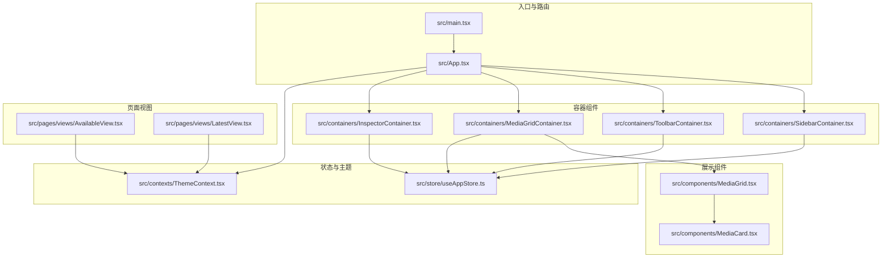
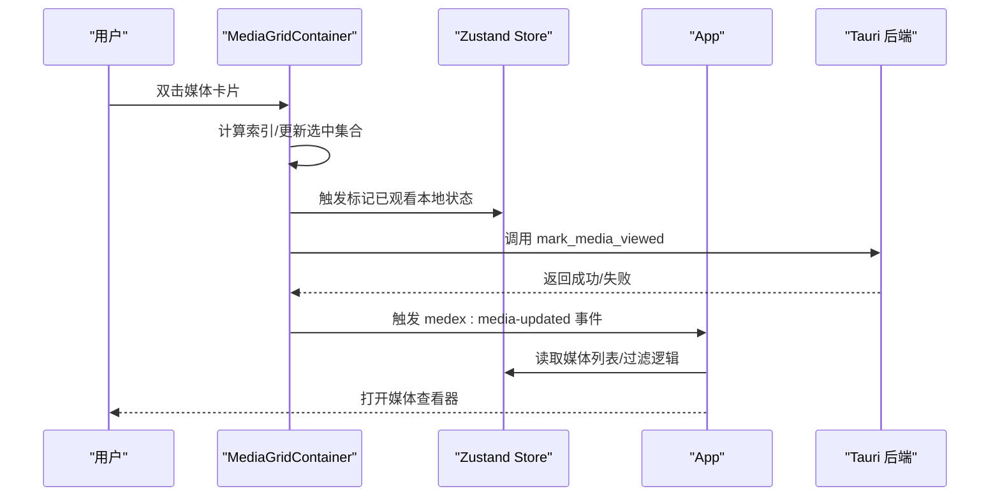
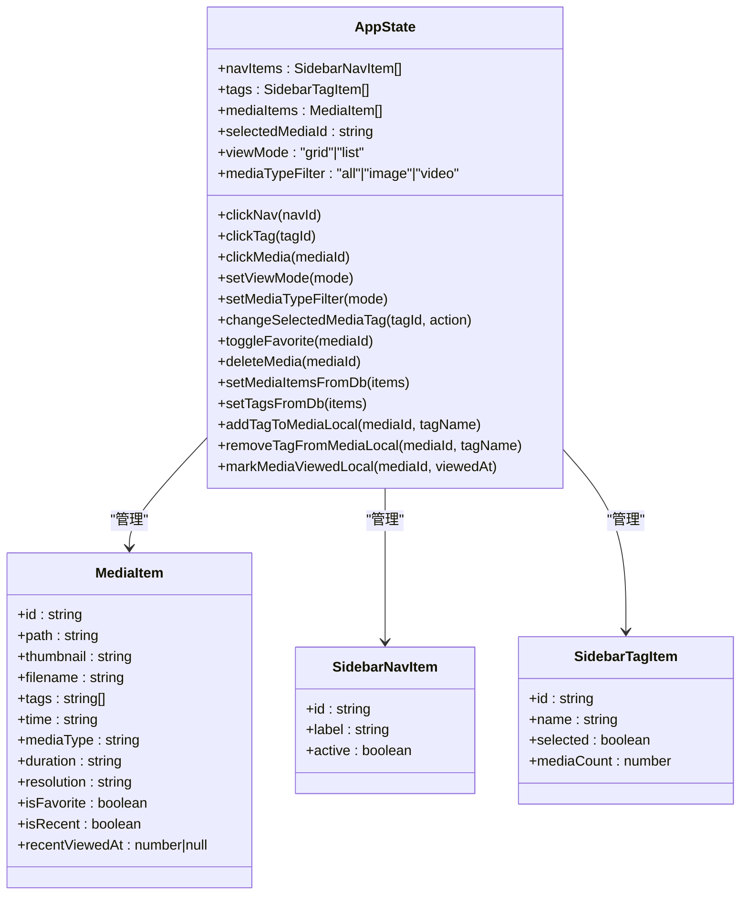
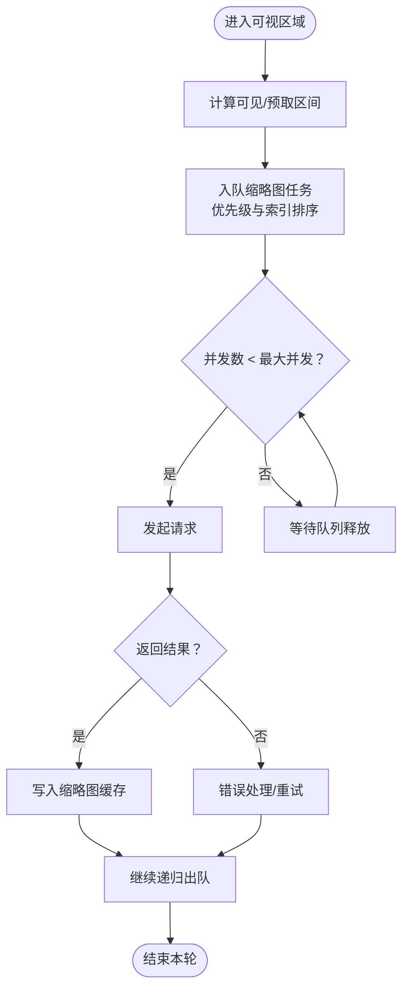
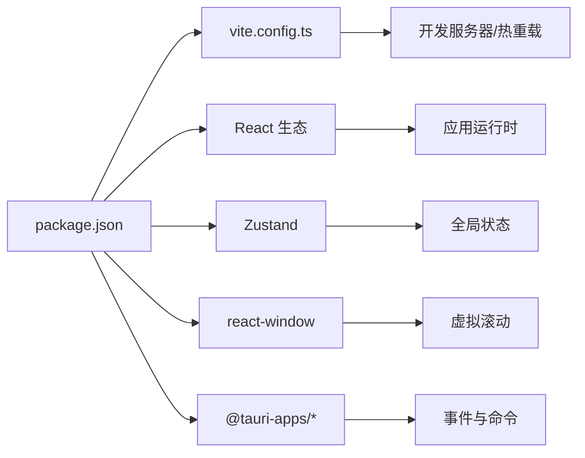

# 前端调试

<cite>
**本文引用的文件**
- [package.json](file://package.json)
- [vite.config.ts](file://vite.config.ts)
- [src/main.tsx](file://src/main.tsx)
- [src/App.tsx](file://src/App.tsx)
- [src/store/useAppStore.ts](file://src/store/useAppStore.ts)
- [src/components/MediaGrid.tsx](file://src/components/MediaGrid.tsx)
- [src/containers/MediaGridContainer.tsx](file://src/containers/MediaGridContainer.tsx)
- [src/components/MediaCard.tsx](file://src/components/MediaCard.tsx)
- [src/containers/SidebarContainer.tsx](file://src/containers/SidebarContainer.tsx)
- [src/containers/ToolbarContainer.tsx](file://src/containers/ToolbarContainer.tsx)
- [src/containers/InspectorContainer.tsx](file://src/containers/InspectorContainer.tsx)
- [src/contexts/ThemeContext.tsx](file://src/contexts/ThemeContext.tsx)
- [src/pages/views/AvailableView.tsx](file://src/pages/views/AvailableView.tsx)
- [src/pages/views/LatestView.tsx](file://src/pages/views/LatestView.tsx)
</cite>

## 目录
1. [简介](#简介)
2. [项目结构](#项目结构)
3. [核心组件](#核心组件)
4. [架构总览](#架构总览)
5. [详细组件分析](#详细组件分析)
6. [依赖分析](#依赖分析)
7. [性能考量](#性能考量)
8. [故障排查指南](#故障排查指南)
9. [结论](#结论)
10. [附录](#附录)

## 简介
本指南面向 Medex 前端开发与调试场景，聚焦以下目标：
- 浏览器开发者工具的高级用法：Elements、Console、Sources、Network、Performance 面板。
- React DevTools 集成与使用：组件树查看、Props/State 监控、性能分析与时间线追踪。
- Vite 热重载调试：模块热替换原理、错误边界处理与构建优化调试。
- Zustand 状态管理调试：状态变更追踪、中间件使用与性能监控。
- 媒体网格组件调试：虚拟滚动调试、事件处理与内存泄漏检测。
- 实战案例与常见问题解决方案。

## 项目结构
Medex 前端基于 React + Vite 构建，采用容器-展示组件分层、Zustand 状态管理、Tauri 事件通信与主题上下文。关键目录与文件如下：
- 入口与路由：src/main.tsx、src/App.tsx
- 容器组件：src/containers/*
- 展示组件：src/components/*
- 状态管理：src/store/useAppStore.ts
- 主题上下文：src/contexts/ThemeContext.tsx
- 页面视图：src/pages/views/*
- 构建配置：vite.config.ts、package.json

图表来源
- [src/main.tsx:1-44](file://src/main.tsx#L1-L44)
- [src/App.tsx:1-73](file://src/App.tsx#L1-L73)
- [src/containers/MediaGridContainer.tsx:1-619](file://src/containers/MediaGridContainer.tsx#L1-L619)
- [src/components/MediaGrid.tsx:1-351](file://src/components/MediaGrid.tsx#L1-L351)
- [src/components/MediaCard.tsx:1-318](file://src/components/MediaCard.tsx#L1-L318)
- [src/containers/SidebarContainer.tsx:1-79](file://src/containers/SidebarContainer.tsx#L1-L79)
- [src/containers/ToolbarContainer.tsx:1-113](file://src/containers/ToolbarContainer.tsx#L1-L113)
- [src/containers/InspectorContainer.tsx:1-32](file://src/containers/InspectorContainer.tsx#L1-L32)
- [src/store/useAppStore.ts:1-395](file://src/store/useAppStore.ts#L1-L395)
- [src/contexts/ThemeContext.tsx:1-99](file://src/contexts/ThemeContext.tsx#L1-L99)
- [src/pages/views/AvailableView.tsx:1-87](file://src/pages/views/AvailableView.tsx#L1-L87)
- [src/pages/views/LatestView.tsx:1-48](file://src/pages/views/LatestView.tsx#L1-L48)

章节来源
- [src/main.tsx:1-44](file://src/main.tsx#L1-L44)
- [src/App.tsx:1-73](file://src/App.tsx#L1-L73)
- [vite.config.ts:1-11](file://vite.config.ts#L1-L11)
- [package.json:1-36](file://package.json#L1-L36)

## 核心组件
- 容器-展示分层：容器负责数据与副作用（如监听事件、调用后端接口），展示组件专注渲染与交互。
- 状态管理：Zustand 提供全局状态（导航、标签、媒体项、视图模式等）。
- 主题系统：ThemeContext 提供主题模式切换与持久化。
- 媒体网格：MediaGrid 使用 react-window 进行虚拟滚动；MediaCard 负责单个媒体项渲染与交互。
- 事件通信：通过 window 自定义事件与 Tauri 事件进行跨组件通信。

章节来源
- [src/containers/MediaGridContainer.tsx:1-619](file://src/containers/MediaGridContainer.tsx#L1-L619)
- [src/components/MediaGrid.tsx:1-351](file://src/components/MediaGrid.tsx#L1-L351)
- [src/components/MediaCard.tsx:1-318](file://src/components/MediaCard.tsx#L1-L318)
- [src/store/useAppStore.ts:1-395](file://src/store/useAppStore.ts#L1-L395)
- [src/contexts/ThemeContext.tsx:1-99](file://src/contexts/ThemeContext.tsx#L1-L99)

## 架构总览
下面以序列图展示一次“打开媒体查看器”的典型流程，涵盖容器、状态、事件与后端调用：

图表来源
- [src/containers/MediaGridContainer.tsx:1-619](file://src/containers/MediaGridContainer.tsx#L1-L619)
- [src/App.tsx:1-73](file://src/App.tsx#L1-L73)
- [src/store/useAppStore.ts:1-395](file://src/store/useAppStore.ts#L1-L395)

## 详细组件分析

### 组件类图（Zustand Store）

图表来源
- [src/store/useAppStore.ts:1-395](file://src/store/useAppStore.ts#L1-L395)

章节来源
- [src/store/useAppStore.ts:1-395](file://src/store/useAppStore.ts#L1-L395)

### 媒体网格组件（虚拟滚动）调试要点
- 关键点：MediaGrid 使用 react-window 的 FixedSizeGrid/FixedSizeList，通过 onItemsRendered 回调暴露可见范围，便于预取缩略图与性能观测。
- 调试建议：
  - 在 onVisibleRangeChange 中打印 firstVisibleIndex/lastVisibleIndex 与 overscan 区间，确认渲染区间是否合理。
  - 使用 Performance 面板录制滚动过程，观察帧率与重排重绘热点。
  - 在 MediaGridContainer 的任务队列与并发控制处设置断点，验证缩略图请求顺序与去重逻辑。
  - 使用 Memory 面板捕获快照，排查缩略图缓存与 Ref 对象是否异常增长。

图表来源
- [src/containers/MediaGridContainer.tsx:352-486](file://src/containers/MediaGridContainer.tsx#L352-L486)
- [src/components/MediaGrid.tsx:146-209](file://src/components/MediaGrid.tsx#L146-L209)

章节来源
- [src/containers/MediaGridContainer.tsx:1-619](file://src/containers/MediaGridContainer.tsx#L1-L619)
- [src/components/MediaGrid.tsx:1-351](file://src/components/MediaGrid.tsx#L1-L351)

### 事件处理与内存泄漏检测
- 常见泄漏源：键盘事件、窗口事件、Tauri 事件监听、定时器、ResizeObserver。
- 建议：
  - 在容器组件中统一注册/注销监听器，确保副作用清理完整。
  - 使用 Performance 面板的“监听器”统计与 Memory 面板的堆快照对比，定位未释放的监听器或闭包。
  - 对于 ResizeObserver，确保在组件卸载时调用 disconnect。

章节来源
- [src/containers/MediaGridContainer.tsx:100-109](file://src/containers/MediaGridContainer.tsx#L100-L109)
- [src/containers/MediaGridContainer.tsx:294-308](file://src/containers/MediaGridContainer.tsx#L294-L308)
- [src/components/MediaGrid.tsx:323-350](file://src/components/MediaGrid.tsx#L323-L350)

### 状态变更追踪与中间件（Zustand）
- 追踪策略：
  - 在关键动作（如 toggleFavorite、addTagToMediaLocal）前后记录状态快照，比较差异字段。
  - 使用中间件（如日志中间件）记录动作名、旧状态、新状态与耗时。
- 性能监控：
  - 结合 Performance 面板录制交互，观察状态变更引发的渲染次数与时间。
  - 对高频动作（如标签增删）进行节流/防抖，避免过度渲染。

章节来源
- [src/store/useAppStore.ts:1-395](file://src/store/useAppStore.ts#L1-L395)

### React DevTools 集成与使用
- 安装与启用：在浏览器扩展商店安装 React DevTools，并在页面中启用。
- 组件树查看：定位 App → 容器 → 展示组件层级，核对 props 与 state。
- Props/State 监控：在组件上右键选择“在组件面板中显示”，实时查看 selectedIds、mediaList、viewMode 等。
- 性能分析：使用 Profiler 录制交互（如切换标签、滚动网格），观察渲染次数与热点组件。
- 时间线追踪：结合 Performance 面板，将渲染事件与时间线对齐，定位长任务。

## 依赖分析
- 构建与开发：Vite 提供快速启动与热重载；@vitejs/plugin-react 支持 JSX 与 HMR。
- 运行时：React、react-window（虚拟滚动）、Zustand（状态管理）、@tauri-apps/*（系统集成）。
- 主题与样式：TailwindCSS、PostCSS、主题常量与上下文。

图表来源
- [package.json:1-36](file://package.json#L1-L36)
- [vite.config.ts:1-11](file://vite.config.ts#L1-L11)

章节来源
- [package.json:1-36](file://package.json#L1-L36)
- [vite.config.ts:1-11](file://vite.config.ts#L1-L11)

## 性能考量
- 虚拟滚动参数调优：Grid 的 overscanRowCount/overscanColumnCount、List 的 overscanCount 应根据屏幕高度与设备性能调整。
- 缩略图预取策略：MediaGridContainer 的任务队列与并发上限需平衡首屏速度与资源占用。
- 渲染优化：MediaCard 使用 memo 并自定义浅比较，减少不必要重渲染。
- 事件与监听：统一在容器组件中管理，避免重复绑定导致的性能与内存问题。

章节来源
- [src/components/MediaGrid.tsx:146-209](file://src/components/MediaGrid.tsx#L146-L209)
- [src/containers/MediaGridContainer.tsx:352-486](file://src/containers/MediaGridContainer.tsx#L352-L486)
- [src/components/MediaCard.tsx:277-318](file://src/components/MediaCard.tsx#L277-L318)

## 故障排查指南
- 热重载无效或报错
  - 症状：修改代码后页面未更新或出现语法错误。
  - 排查：检查 Vite 配置端口与严格端口设置；确认浏览器未缓存旧资源；查看 Console 错误栈。
  - 参考
    - [vite.config.ts:6-9](file://vite.config.ts#L6-L9)
    - [package.json:6-11](file://package.json#L6-L11)
- 媒体网格空白或滚动卡顿
  - 症状：网格无内容或滚动掉帧。
  - 排查：确认 mediaList 是否为空；检查 onVisibleRangeChange 的区间计算；验证缩略图队列与并发上限。
  - 参考
    - [src/containers/MediaGridContainer.tsx:417-451](file://src/containers/MediaGridContainer.tsx#L417-L451)
    - [src/components/MediaGrid.tsx:146-209](file://src/components/MediaGrid.tsx#L146-L209)
- 标签/收藏状态不同步
  - 症状：界面状态与数据库不一致。
  - 排查：检查 Tauri 事件触发与监听（如 medex:tags-updated、medex:media-updated）；确认 invoke 成功后再更新本地状态。
  - 参考
    - [src/containers/MediaGridContainer.tsx:145-175](file://src/containers/MediaGridContainer.tsx#L145-L175)
    - [src/containers/SidebarContainer.tsx:28-33](file://src/containers/SidebarContainer.tsx#L28-L33)
- 主题切换不同步
  - 症状：切换主题后部分组件颜色未更新。
  - 排查：确认 ThemeContext 已提供有效主题；检查 data-theme 属性是否正确设置；跨窗口存储事件是否触发。
  - 参考
    - [src/contexts/ThemeContext.tsx:46-66](file://src/contexts/ThemeContext.tsx#L46-L66)
- 媒体查看器无法打开
  - 症状：双击媒体无响应。
  - 排查：检查 App 中 handleOpenViewer 的索引计算与 viewerMediaList 过滤；确认 Tauri 调用成功并触发事件。
  - 参考
    - [src/App.tsx:28-57](file://src/App.tsx#L28-L57)

## 结论
通过合理运用浏览器开发者工具、React DevTools、Zustand 中间件与 Vite 热重载机制，可以高效定位与解决 Medex 前端的渲染、状态与性能问题。针对媒体网格的虚拟滚动与缩略图预取，建议以“区间计算 + 并发控制 + 缓存命中”为核心进行调试与优化。

## 附录
- 实用调试清单
  - Elements：检查 DOM 结构与样式变量，定位布局与主题色问题。
  - Console：集中查看错误日志与关键动作日志，配合断点定位。
  - Sources：利用断点与条件断点，跟踪事件回调与状态变更路径。
  - Network：观察缩略图请求、Tauri 命令往返与资源加载情况。
  - Performance：录制滚动、切换视图与标签筛选等关键交互，识别长任务与重排。
  - React DevTools：Profiler 分析渲染热点，时间线追踪交互链路。
  - Memory：捕获快照对比，排查监听器与缓存泄漏。