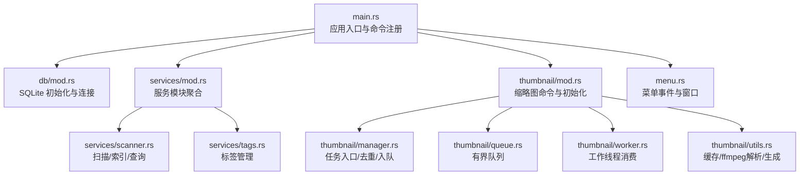
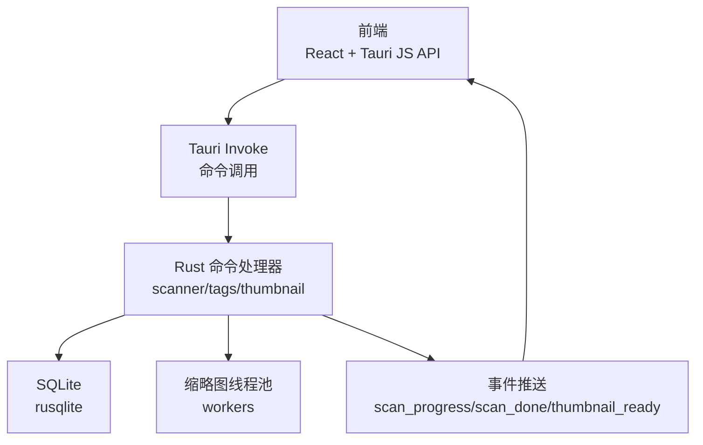
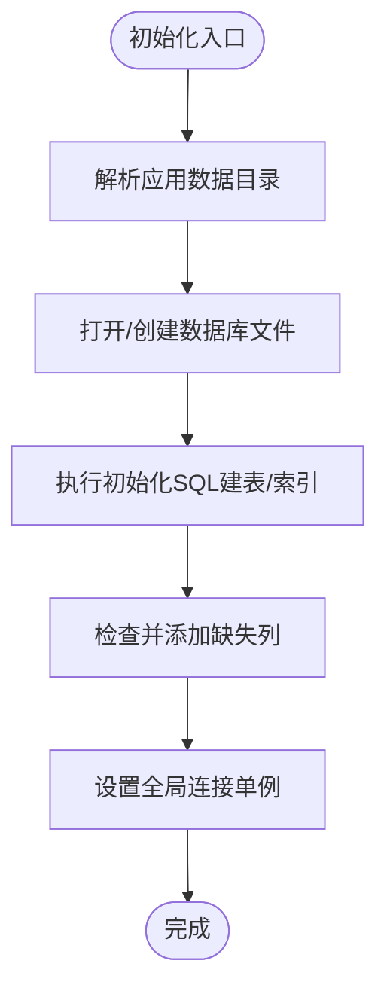
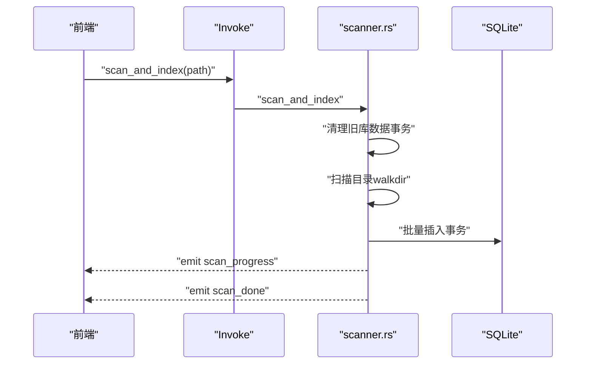
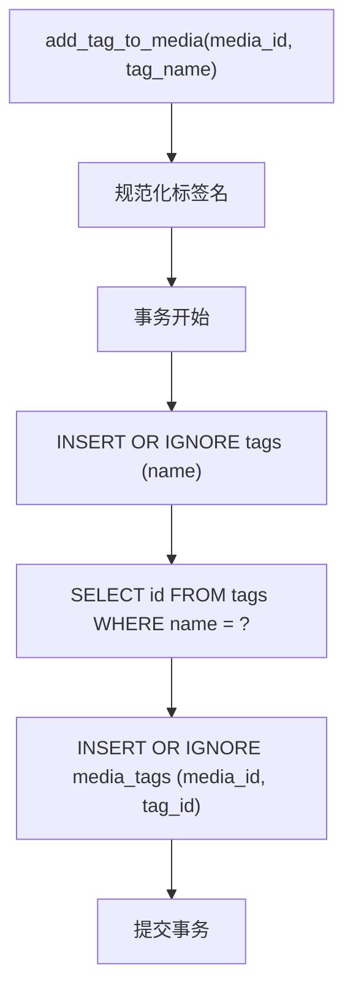
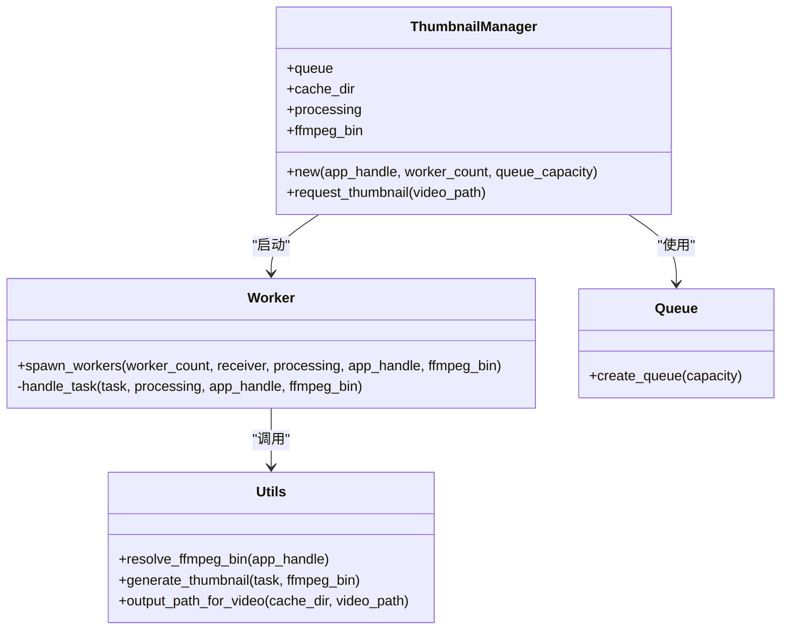
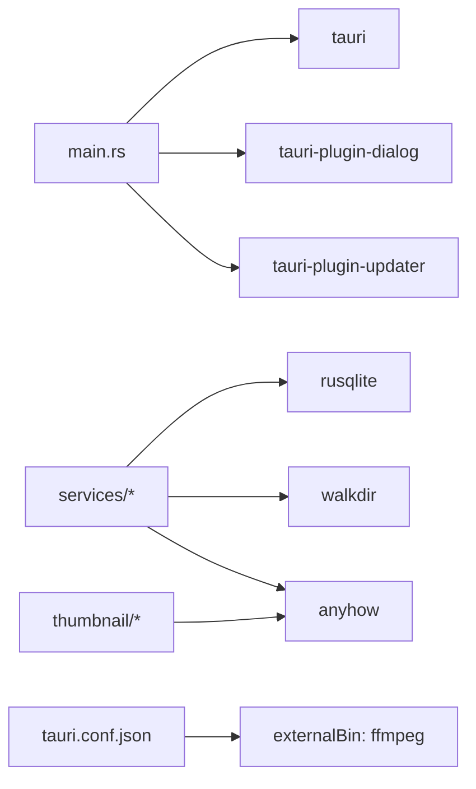

# 后端调试

<cite>
**本文引用的文件**   
- [src-tauri/src/main.rs](file://src-tauri/src/main.rs)
- [src-tauri/src/db/mod.rs](file://src-tauri/src/db/mod.rs)
- [src-tauri/src/services/mod.rs](file://src-tauri/src/services/mod.rs)
- [src-tauri/src/services/scanner.rs](file://src-tauri/src/services/scanner.rs)
- [src-tauri/src/services/tags.rs](file://src-tauri/src/services/tags.rs)
- [src-tauri/src/thumbnail/mod.rs](file://src-tauri/src/thumbnail/mod.rs)
- [src-tauri/src/thumbnail/manager.rs](file://src-tauri/src/thumbnail/manager.rs)
- [src-tauri/src/thumbnail/queue.rs](file://src-tauri/src/thumbnail/queue.rs)
- [src-tauri/src/thumbnail/worker.rs](file://src-tauri/src/thumbnail/worker.rs)
- [src-tauri/src/thumbnail/utils.rs](file://src-tauri/src/thumbnail/utils.rs)
- [src-tauri/src/menu.rs](file://src-tauri/src/menu.rs)
- [src-tauri/Cargo.toml](file://src-tauri/Cargo.toml)
- [src-tauri/tauri.conf.json](file://src-tauri/tauri.conf.json)
- [src-tauri/build.rs](file://src-tauri/build.rs)
- [src-tauri/.cargo/config.toml](file://src-tauri/.cargo/config.toml)
- [DEVELOPMENT.md](file://DEVELOPMENT.md)
</cite>

## 目录
1. [简介](#简介)
2. [项目结构](#项目结构)
3. [核心组件](#核心组件)
4. [架构总览](#架构总览)
5. [详细组件分析](#详细组件分析)
6. [依赖分析](#依赖分析)
7. [性能考量](#性能考量)
8. [故障排查指南](#故障排查指南)
9. [结论](#结论)
10. [附录](#附录)

## 简介
本指南面向 Medex 后端（Rust/Tauri）开发者，聚焦于调试实践，覆盖以下主题：
- Rust/GDB 调试器使用：断点设置、变量检查、调用栈分析、内存调试
- 日志系统配置与使用：log、tracing、env_logger 的集成与日志级别控制
- 异步代码调试：async/await 调试、Tokio 调度器监控、并发问题排查
- Tauri 命令调试：命令参数验证、返回值检查、错误处理调试
- 数据库操作调试：SQLite 查询优化、事务调试、连接池监控
- 实战调试场景与性能分析工具使用

## 项目结构
后端位于 src-tauri，采用模块化组织：
- 入口与插件：main.rs
- 数据库：db/mod.rs（SQLite 初始化、连接封装）
- 服务层：services/mod.rs + scanner.rs（扫描/索引/查询）、tags.rs（标签管理）
- 缩略图系统：thumbnail/mod.rs + manager.rs + queue.rs + worker.rs + utils.rs
- 菜单与窗口：menu.rs
- 构建与配置：Cargo.toml、tauri.conf.json、build.rs、.cargo/config.toml

图表来源
- [src-tauri/src/main.rs:10-68](file://src-tauri/src/main.rs#L10-L68)
- [src-tauri/src/db/mod.rs:45-122](file://src-tauri/src/db/mod.rs#L45-L122)
- [src-tauri/src/services/mod.rs:1-3](file://src-tauri/src/services/mod.rs#L1-L3)
- [src-tauri/src/services/scanner.rs:250-341](file://src-tauri/src/services/scanner.rs#L250-L341)
- [src-tauri/src/services/tags.rs:19-220](file://src-tauri/src/services/tags.rs#L19-L220)
- [src-tauri/src/thumbnail/mod.rs:32-61](file://src-tauri/src/thumbnail/mod.rs#L32-L61)
- [src-tauri/src/thumbnail/manager.rs:24-49](file://src-tauri/src/thumbnail/manager.rs#L24-L49)
- [src-tauri/src/thumbnail/queue.rs:8-11](file://src-tauri/src/thumbnail/queue.rs#L8-L11)
- [src-tauri/src/thumbnail/worker.rs:13-50](file://src-tauri/src/thumbnail/worker.rs#L13-L50)
- [src-tauri/src/thumbnail/utils.rs:20-96](file://src-tauri/src/thumbnail/utils.rs#L20-L96)
- [src-tauri/src/menu.rs:31-51](file://src-tauri/src/menu.rs#L31-L51)

章节来源
- [src-tauri/src/main.rs:10-68](file://src-tauri/src/main.rs#L10-L68)
- [DEVELOPMENT.md:51-116](file://DEVELOPMENT.md#L51-L116)

## 核心组件
- 应用入口与命令注册：在入口处注册所有 Tauri 命令，初始化数据库与缩略图系统，并设置菜单与事件监听。
- 数据库模块：负责数据库初始化、表结构与索引创建、连接安全封装、路径解析。
- 扫描与媒体服务：目录扫描、批量插入、查询与筛选、收藏与最近查看、清理库数据。
- 标签服务：标签 CRUD、媒体打标签、按媒体查询标签。
- 缩略图系统：任务去重、队列、多线程 worker、ffmpeg 调用与缓存。
- 菜单与窗口：菜单事件处理与窗口打开。

章节来源
- [src-tauri/src/main.rs:10-68](file://src-tauri/src/main.rs#L10-L68)
- [src-tauri/src/db/mod.rs:45-122](file://src-tauri/src/db/mod.rs#L45-L122)
- [src-tauri/src/services/scanner.rs:250-341](file://src-tauri/src/services/scanner.rs#L250-L341)
- [src-tauri/src/services/tags.rs:19-220](file://src-tauri/src/services/tags.rs#L19-L220)
- [src-tauri/src/thumbnail/mod.rs:32-61](file://src-tauri/src/thumbnail/mod.rs#L32-L61)
- [src-tauri/src/menu.rs:31-51](file://src-tauri/src/menu.rs#L31-L51)

## 架构总览
后端采用 Tauri v2 的 invoke/event 模式与 SQLite 存储，配合缩略图后台线程池实现高性能媒体管理。

图表来源
- [src-tauri/src/main.rs:49-65](file://src-tauri/src/main.rs#L49-L65)
- [src-tauri/src/services/scanner.rs:306-330](file://src-tauri/src/services/scanner.rs#L306-L330)
- [src-tauri/src/thumbnail/worker.rs:81-89](file://src-tauri/src/thumbnail/worker.rs#L81-L89)

## 详细组件分析

### 数据库模块（SQLite）
- 初始化流程：解析应用数据目录，创建数据库文件，执行初始化 SQL（建表/索引），确保列存在性，设置全局连接。
- 连接封装：使用 OnceCell + Mutex 包裹 rusqlite 连接，提供 with_connection 闭包安全访问。
- 路径解析：通过 Tauri AppHandle 获取应用数据目录，保证跨平台一致性。

图表来源
- [src-tauri/src/db/mod.rs:45-64](file://src-tauri/src/db/mod.rs#L45-L64)
- [src-tauri/src/db/mod.rs:112-122](file://src-tauri/src/db/mod.rs#L112-L122)

章节来源
- [src-tauri/src/db/mod.rs:45-122](file://src-tauri/src/db/mod.rs#L45-L122)

### 扫描与媒体服务
- 目录扫描：使用 walkdir 递归遍历，过滤媒体类型，收集文件信息。
- 批量插入：事务包裹批量 INSERT OR IGNORE，避免重复与提升性能。
- 查询与筛选：多表联接 + GROUP_CONCAT + HAVING COUNT 实现标签交集筛选。
- 收藏与最近查看：更新媒体收藏字段；最近查看 upsert 并限制条目数量。
- 清理库数据：事务清空媒体/关系/视图表并重置自增。

图表来源
- [src-tauri/src/services/scanner.rs:250-341](file://src-tauri/src/services/scanner.rs#L250-L341)
- [src-tauri/src/services/scanner.rs:90-115](file://src-tauri/src/services/scanner.rs#L90-L115)

章节来源
- [src-tauri/src/services/scanner.rs:54-88](file://src-tauri/src/services/scanner.rs#L54-L88)
- [src-tauri/src/services/scanner.rs:90-115](file://src-tauri/src/services/scanner.rs#L90-L115)
- [src-tauri/src/services/scanner.rs:160-163](file://src-tauri/src/services/scanner.rs#L160-L163)
- [src-tauri/src/services/scanner.rs:170-247](file://src-tauri/src/services/scanner.rs#L170-L247)
- [src-tauri/src/services/scanner.rs:343-389](file://src-tauri/src/services/scanner.rs#L343-L389)
- [src-tauri/src/services/scanner.rs:475-524](file://src-tauri/src/services/scanner.rs#L475-L524)

### 标签服务
- 标签 CRUD：查询、创建（去空白/去重）、删除（无使用才允许）。
- 媒体打标签：先插入标签，再建立关系；移除标签只移除关系。
- 按媒体查询标签：联接查询返回标签列表。

图表来源
- [src-tauri/src/services/tags.rs:127-164](file://src-tauri/src/services/tags.rs#L127-L164)

章节来源
- [src-tauri/src/services/tags.rs:19-220](file://src-tauri/src/services/tags.rs#L19-L220)

### 缩略图系统
- 任务去重：processing 集合防止重复请求。
- 队列与并发：有界同步通道 + 固定 worker 数量。
- ffmpeg 解析：优先内置资源，其次开发目录，再次系统 PATH，最后常见 macOS 路径。
- 事件推送：生成完成后通过事件通知前端。

图表来源
- [src-tauri/src/thumbnail/manager.rs:16-49](file://src-tauri/src/thumbnail/manager.rs#L16-L49)
- [src-tauri/src/thumbnail/worker.rs:13-50](file://src-tauri/src/thumbnail/worker.rs#L13-L50)
- [src-tauri/src/thumbnail/queue.rs:8-11](file://src-tauri/src/thumbnail/queue.rs#L8-L11)
- [src-tauri/src/thumbnail/utils.rs:71-96](file://src-tauri/src/thumbnail/utils.rs#L71-L96)

章节来源
- [src-tauri/src/thumbnail/mod.rs:32-61](file://src-tauri/src/thumbnail/mod.rs#L32-L61)
- [src-tauri/src/thumbnail/manager.rs:51-107](file://src-tauri/src/thumbnail/manager.rs#L51-L107)
- [src-tauri/src/thumbnail/worker.rs:52-96](file://src-tauri/src/thumbnail/worker.rs#L52-L96)
- [src-tauri/src/thumbnail/utils.rs:36-61](file://src-tauri/src/thumbnail/utils.rs#L36-L61)

### 菜单与窗口
- 菜单事件：打开设置/更新窗口，关于对话框，退出应用。
- 窗口管理：根据窗口标识复用或新建窗口。

章节来源
- [src-tauri/src/menu.rs:31-51](file://src-tauri/src/menu.rs#L31-L51)

## 依赖分析
- 核心依赖：tauri、rusqlite、walkdir、anyhow、once_cell、tauri-plugin-dialog、tauri-plugin-updater。
- 构建与镜像：tauri-build、crates-io 源替换为 tuna。
- 配置：tauri.conf.json 控制构建、安全策略、外部二进制（ffmpeg）打包。

图表来源
- [src-tauri/Cargo.toml:13-22](file://src-tauri/Cargo.toml#L13-L22)
- [src-tauri/src/main.rs:12-13](file://src-tauri/src/main.rs#L12-L13)
- [src-tauri/tauri.conf.json:32](file://src-tauri/tauri.conf.json#L32)

章节来源
- [src-tauri/Cargo.toml:13-22](file://src-tauri/Cargo.toml#L13-L22)
- [src-tauri/tauri.conf.json:32](file://src-tauri/tauri.conf.json#L32)

## 性能考量
- 批量写入：扫描阶段使用事务包裹批量插入，减少磁盘写放大。
- 查询优化：合理使用索引（媒体路径、关系表主键、最近查看时间倒序），避免 N+1 查询。
- 缩略图并发：固定 worker 数量与队列容量，结合去重与占位符，平衡吞吐与资源占用。
- I/O 与 CPU：ffmpeg 生成缩略图为 CPU 密集型，注意并发与系统负载。

章节来源
- [src-tauri/src/services/scanner.rs:90-115](file://src-tauri/src/services/scanner.rs#L90-L115)
- [src-tauri/src/db/mod.rs:39-42](file://src-tauri/src/db/mod.rs#L39-L42)
- [src-tauri/src/thumbnail/mod.rs:14-16](file://src-tauri/src/thumbnail/mod.rs#L14-L16)

## 故障排查指南
- 缩略图生成失败
  - 检查 ffmpeg 是否可用：优先内置资源，其次开发目录，再次系统 PATH。
  - 若不存在，返回占位符并记录错误，避免阻塞任务流。
- 数据库初始化失败
  - 检查应用数据目录权限与路径解析。
  - 确认初始化 SQL 成功执行，索引创建与列补齐。
- 命令调用异常
  - 检查命令参数类型与必填项，关注错误字符串转换。
  - 对事务操作进行回滚与错误传播，避免部分成功。
- 事件未到达前端
  - 确认事件名称与负载结构一致，检查 emit 返回错误。
- 菜单/窗口问题
  - 检查窗口标识与复用逻辑，确认资源协议与文件预览路径。

章节来源
- [src-tauri/src/thumbnail/utils.rs:71-96](file://src-tauri/src/thumbnail/utils.rs#L71-L96)
- [src-tauri/src/thumbnail/manager.rs:51-107](file://src-tauri/src/thumbnail/manager.rs#L51-L107)
- [src-tauri/src/db/mod.rs:45-64](file://src-tauri/src/db/mod.rs#L45-L64)
- [src-tauri/src/services/scanner.rs:250-341](file://src-tauri/src/services/scanner.rs#L250-L341)
- [src-tauri/src/thumbnail/worker.rs:81-89](file://src-tauri/src/thumbnail/worker.rs#L81-L89)
- [src-tauri/src/menu.rs:31-51](file://src-tauri/src/menu.rs#L31-L51)

## 结论
本指南提供了 Medex 后端的系统化调试方法，涵盖数据库、命令、缩略图与并发等关键领域。建议在开发与发布前，结合本文的调试流程与性能建议，完成端到端验证与回归测试。

## 附录

### Rust/GDB 调试器使用要点
- 启用调试符号：使用 debug 构建或在 Cargo.toml 中配置调试信息。
- 断点设置：在关键函数入口（如命令处理、数据库事务、缩略图生成）设置断点。
- 变量检查：观察参数、中间结果与错误上下文（anyhow Context）。
- 调用栈分析：定位错误发生的具体调用链，结合上下文消息定位问题。
- 内存调试：关注缩略图队列容量与 worker 并发，避免死锁与内存泄漏。

### 日志系统配置与使用
- 当前实现：后端使用 println!/eprintln! 输出关键信息（数据库初始化、缩略图状态、扫描进度等）。
- 建议增强：引入 log/tracing/env_logger，统一日志级别与输出格式，便于生产环境采集与分析。

### 异步代码调试技巧
- async/await 调试：在命令处理中使用 await 的关键节点设置断点，观察 future 状态与错误传播。
- Tokio 调度器监控：结合线程名（worker 线程）与队列容量，定位阻塞与饥饿问题。
- 并发问题排查：检查共享状态（processing 集合）的互斥访问，避免竞态条件。

### Tauri 命令调试方法
- 参数验证：在命令入口校验参数类型与边界（如 media_id、tag_id、路径存在性）。
- 返回值检查：命令返回 Result<T, String>，前端收到错误字符串，应记录并上报。
- 错误处理调试：利用 anyhow 的 Context 信息，串联错误上下文，便于定位根因。

### 数据库操作调试
- SQLite 查询优化：使用 EXPLAIN QUERY PLAN 分析慢查询，确保索引命中。
- 事务调试：对长事务进行拆分，减少锁持有时间；捕获事务错误并回滚。
- 连接池监控：当前使用单连接封装，建议在高并发场景引入连接池并监控活跃连接数。

### 实战调试场景与性能分析工具
- 场景一：大目录扫描卡顿
  - 步骤：启用 scan_progress 事件，观察进度；检查事务大小与磁盘 I/O；必要时分批提交。
- 场景二：缩略图生成失败
  - 步骤：检查 ffmpeg 可用性与输出日志；确认缓存目录权限；监控队列积压。
- 场景三：标签筛选性能差
  - 步骤：分析 SQL 与索引；避免不必要的 GROUP_CONCAT；考虑分页或物化视图。
- 性能分析工具：使用 perf/flamegraph（Linux/macOS）或 Instruments（macOS）分析 CPU/内存热点。

章节来源
- [src-tauri/src/services/scanner.rs:250-341](file://src-tauri/src/services/scanner.rs#L250-L341)
- [src-tauri/src/thumbnail/utils.rs:36-61](file://src-tauri/src/thumbnail/utils.rs#L36-L61)
- [src-tauri/src/services/tags.rs:127-164](file://src-tauri/src/services/tags.rs#L127-L164)