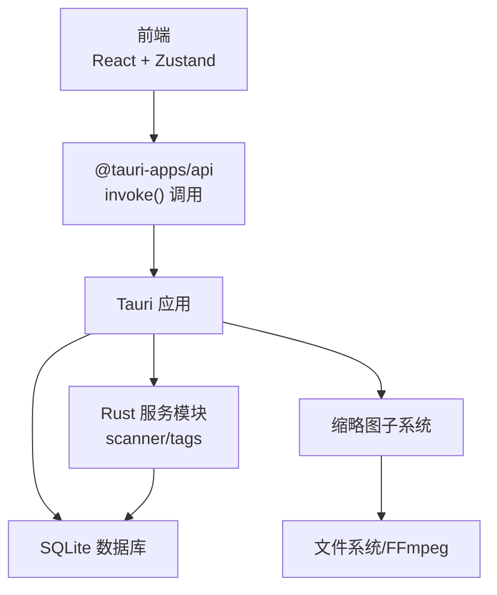
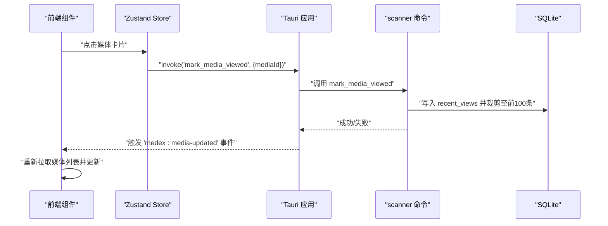
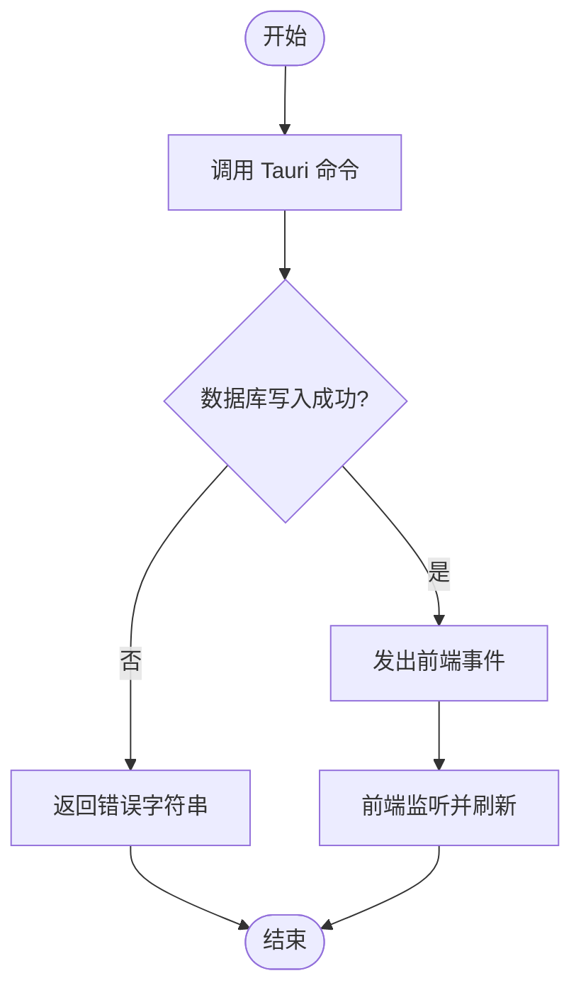
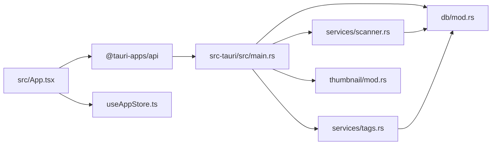

# 测试策略

<cite>
**本文引用的文件**
- [package.json](file://package.json)
- [vite.config.ts](file://vite.config.ts)
- [src/App.tsx](file://src/App.tsx)
- [src/store/useAppStore.ts](file://src/store/useAppStore.ts)
- [.github/workflows/main.yml](file://.github/workflows/main.yml)
- [src-tauri/Cargo.toml](file://src-tauri/Cargo.toml)
- [src-tauri/src/main.rs](file://src-tauri/src/main.rs)
- [src-tauri/src/db/mod.rs](file://src-tauri/src/db/mod.rs)
- [src-tauri/src/services/mod.rs](file://src-tauri/src/services/mod.rs)
- [src-tauri/src/services/scanner.rs](file://src-tauri/src/services/scanner.rs)
- [src-tauri/src/services/tags.rs](file://src-tauri/src/services/tags.rs)
- [src-tauri/src/thumbnail/mod.rs](file://src-tauri/src/thumbnail/mod.rs)
- [src-tauri/src/thumbnail/manager.rs](file://src-tauri/src/thumbnail/manager.rs)
</cite>

## 目录
1. [引言](#引言)
2. [项目结构](#项目结构)
3. [核心组件](#核心组件)
4. [架构总览](#架构总览)
5. [详细组件分析](#详细组件分析)
6. [依赖关系分析](#依赖关系分析)
7. [性能考量](#性能考量)
8. [故障排查指南](#故障排查指南)
9. [结论](#结论)
10. [附录](#附录)

## 引言
本指南面向 Medex 桌面应用的测试策略制定与落地，覆盖前端单元测试（Jest/React Testing Library）、组件测试、集成测试（含 E2E）以及 Rust 后端单元与集成测试。文档同时涵盖 Tauri 命令测试、事件系统测试、数据库操作测试、测试最佳实践、持续集成配置与测试数据管理策略，帮助团队建立可维护、可扩展且高可靠性的测试体系。

## 项目结构
Medex 采用前后端分离的桌面应用架构：前端基于 React + Vite，后端基于 Tauri + Rust。测试应围绕以下层次展开：
- 前端层：组件与状态逻辑（Zustand Store）、用户交互（React Testing Library）、API 调用（Tauri 命令）。
- 后端层：Rust 模块（服务、数据库、缩略图），Tauri 命令注册与事件分发。
- 集成层：前端通过 @tauri-apps/api 调用后端命令，后端通过事件通知前端刷新界面。

图表来源
- [src/App.tsx:1-73](file://src/App.tsx#L1-L73)
- [src-tauri/src/main.rs:10-68](file://src-tauri/src/main.rs#L10-L68)
- [src-tauri/src/services/scanner.rs:160-341](file://src-tauri/src/services/scanner.rs#L160-L341)
- [src-tauri/src/services/tags.rs:19-220](file://src-tauri/src/services/tags.rs#L19-L220)
- [src-tauri/src/db/mod.rs:45-122](file://src-tauri/src/db/mod.rs#L45-L122)
- [src-tauri/src/thumbnail/mod.rs:32-61](file://src-tauri/src/thumbnail/mod.rs#L32-L61)

章节来源
- [package.json:1-36](file://package.json#L1-L36)
- [vite.config.ts:1-11](file://vite.config.ts#L1-L11)
- [src-tauri/Cargo.toml:1-23](file://src-tauri/Cargo.toml#L1-L23)

## 核心组件
- 前端应用入口与视图容器：负责导航、媒体列表筛选、收藏与最近状态更新、媒体查看器打开/关闭等交互。
- 状态管理（Zustand）：集中管理导航项、标签、媒体项、视图模式、类型过滤、本地标签变更与收藏切换等。
- Tauri 命令：扫描与索引、媒体查询与过滤、收藏标记、最近观看记录、标签 CRUD、缩略图请求等。
- 数据库（SQLite）：媒体表、标签表、媒体-标签关联表、最近观看表；初始化、迁移与并发访问控制。
- 缩略图子系统：队列、工作线程、缓存目录、FFmpeg 可用性检测与占位符返回策略。

章节来源
- [src/App.tsx:8-72](file://src/App.tsx#L8-L72)
- [src/store/useAppStore.ts:145-394](file://src/store/useAppStore.ts#L145-L394)
- [src-tauri/src/main.rs:49-65](file://src-tauri/src/main.rs#L49-L65)
- [src-tauri/src/db/mod.rs:12-122](file://src-tauri/src/db/mod.rs#L12-L122)
- [src-tauri/src/thumbnail/mod.rs:18-61](file://src-tauri/src/thumbnail/mod.rs#L18-L61)

## 架构总览
前端通过 invoke 调用后端命令，后端命令执行数据库操作或触发事件，前端监听事件以刷新 UI。缩略图请求由后端管理器异步处理，必要时返回占位符路径。

图表来源
- [src/App.tsx:35-41](file://src/App.tsx#L35-L41)
- [src-tauri/src/services/scanner.rs:356-389](file://src-tauri/src/services/scanner.rs#L356-L389)

## 详细组件分析

### 前端单元测试与组件测试策略
- 测试目标
  - 组件渲染与交互：导航切换、标签筛选、收藏切换、媒体查看器打开/关闭。
  - 状态逻辑：Zustand Store 的动作与派生状态计算。
  - API 调用：invoke 调用 Tauri 命令的正确性与错误处理。
- Jest 配置建议
  - 执行环境：jsdom 或 node（根据是否需要 DOM）。
  - 文件扩展名：.test.tsx 或 .spec.tsx。
  - 快照与覆盖率：开启覆盖率统计，关注组件、Store、工具函数。
- 测试文件组织
  - 按功能域划分：components、hooks、store、lib。
  - 容器组件与展示组件分离测试。
- Mock 对象使用
  - Mock @tauri-apps/api 的 invoke 返回值与错误。
  - Mock Zustand Store 的状态与动作。
  - Mock 文件系统与网络请求（如需）。
- 覆盖率报告生成
  - 使用 Jest 覆盖率选项生成 HTML 报告，定期 CI 中收集。

章节来源
- [src/App.tsx:28-47](file://src/App.tsx#L28-L47)
- [src/store/useAppStore.ts:145-394](file://src/store/useAppStore.ts#L145-L394)

### 组件测试（React Testing Library）
- 用户交互模拟
  - 使用 fireEvent 模拟点击、键盘输入、滚动等。
  - 断言 UI 状态变化（类名、属性、可见性）。
- 状态测试
  - 通过 act 包裹状态更新，断言 Store 动作触发后的状态变化。
  - 验证导航与标签筛选对媒体列表的影响。
- 事件驱动测试
  - 模拟 Tauri 事件（如 'medex:media-updated'）触发后 UI 刷新。

章节来源
- [src/App.tsx:59-71](file://src/App.tsx#L59-L71)
- [src/store/useAppStore.ts:152-179](file://src/store/useAppStore.ts#L152-L179)

### 集成测试（E2E）
- 框架选择
  - Playwright 或 Cypress（推荐 Playwright，跨平台与 Tauri 更契合）。
- 测试用例设计
  - 完整流程：启动应用 → 选择媒体库目录 → 触发扫描 → 过滤与收藏 → 查看器浏览 → 标签管理。
  - 错误场景：无权限目录、磁盘空间不足、FFmpeg 缺失、数据库异常。
- 自动化流水线
  - 在 CI 中安装依赖、构建 Tauri 应用、运行 E2E 测试并上传报告。

章节来源
- [.github/workflows/main.yml:12-42](file://.github/workflows/main.yml#L12-L42)

### Rust 单元测试与集成测试
- 测试模块组织
  - 在各模块内使用 #[cfg(test)] 子模块或独立 tests 目录。
  - 将公共测试辅助函数放入 tests/support。
- mock 依赖
  - 使用 mockall 或 std::mem::replace 替换全局静态（如 OnceCell）。
  - 使用 tempdir 或内存数据库替代真实文件系统。
- 性能测试
  - 使用 criterion 或 bencher 对关键路径（扫描、过滤、缩略图生成）进行基准测试。
- 示例测试点
  - 数据库初始化与索引创建。
  - 标签 CRUD 事务与约束校验。
  - 扫描与索引的批量插入与进度事件。
  - 最近观看记录的裁剪逻辑。
  - 缩略图请求的占位符与队列满处理。

章节来源
- [src-tauri/src/db/mod.rs:45-122](file://src-tauri/src/db/mod.rs#L45-L122)
- [src-tauri/src/services/tags.rs:19-220](file://src-tauri/src/services/tags.rs#L19-L220)
- [src-tauri/src/services/scanner.rs:250-341](file://src-tauri/src/services/scanner.rs#L250-L341)
- [src-tauri/src/services/scanner.rs:356-389](file://src-tauri/src/services/scanner.rs#L356-L389)
- [src-tauri/src/thumbnail/manager.rs:51-106](file://src-tauri/src/thumbnail/manager.rs#L51-L106)

### API 接口测试（Tauri 命令、事件系统、数据库）
- Tauri 命令测试
  - 通过 Tauri 的测试工具链或在测试中直接调用命令函数，绕过前端。
  - 断言返回值与副作用（数据库写入、事件发出）。
- 事件系统测试
  - 发出事件后验证前端是否收到并触发 UI 更新。
- 数据库操作测试
  - 验证事务、约束、索引与数据一致性。
  - 验证扫描与索引流程中的多表联动。

图表来源
- [src-tauri/src/main.rs:49-65](file://src-tauri/src/main.rs#L49-L65)
- [src-tauri/src/services/scanner.rs:306-330](file://src-tauri/src/services/scanner.rs#L306-L330)
- [src/App.tsx:38-41](file://src/App.tsx#L38-L41)

## 依赖关系分析
- 前端依赖
  - @tauri-apps/api 提供 invoke 能力。
  - Zustand 管理全局状态。
  - Vite 提供开发与构建支持。
- 后端依赖
  - Tauri 提供命令注册与事件系统。
  - rusqlite 访问 SQLite。
  - walkdir 遍历媒体文件。
  - tauri-plugin-dialog/updater 提供系统级能力。

图表来源
- [src/App.tsx:2-6](file://src/App.tsx#L2-L6)
- [src-tauri/src/main.rs:49-65](file://src-tauri/src/main.rs#L49-L65)
- [src-tauri/src/services/scanner.rs:160-341](file://src-tauri/src/services/scanner.rs#L160-L341)
- [src-tauri/src/services/tags.rs:19-220](file://src-tauri/src/services/tags.rs#L19-L220)
- [src-tauri/src/db/mod.rs:45-122](file://src-tauri/src/db/mod.rs#L45-L122)
- [src-tauri/src/thumbnail/mod.rs:32-61](file://src-tauri/src/thumbnail/mod.rs#L32-L61)

章节来源
- [package.json:12-34](file://package.json#L12-L34)
- [src-tauri/Cargo.toml:13-23](file://src-tauri/Cargo.toml#L13-L23)

## 性能考量
- 前端
  - 使用 React.memo 与 useMemo 优化渲染。
  - 分页或虚拟化长列表（如 MediaGrid）。
- 后端
  - 批量插入与事务提交减少 IO。
  - SQLite 索引命中与 SQL 查询优化。
  - 缩略图队列容量与工作线程数平衡吞吐与资源占用。
- 基准测试
  - 对扫描、过滤、缩略图生成进行基准测试，识别瓶颈。

## 故障排查指南
- Tauri 命令失败
  - 检查命令返回的错误字符串，定位数据库或文件系统问题。
  - 确认命令已注册到 invoke_handler。
- 事件未触发
  - 确认 app_handle.emit 是否被调用，前端是否监听对应事件。
- 数据库异常
  - 检查初始化流程与连接池锁，确认事务提交与回滚路径。
- 缩略图不生成
  - 检查 FFmpeg 可用性与队列状态，确认占位符返回逻辑。

章节来源
- [src-tauri/src/main.rs:49-65](file://src-tauri/src/main.rs#L49-L65)
- [src-tauri/src/services/scanner.rs:306-330](file://src-tauri/src/services/scanner.rs#L306-L330)
- [src-tauri/src/db/mod.rs:97-110](file://src-tauri/src/db/mod.rs#L97-L110)
- [src-tauri/src/thumbnail/manager.rs:51-106](file://src-tauri/src/thumbnail/manager.rs#L51-L106)

## 结论
通过分层测试策略（单元、组件、集成、E2E）与 Rust 后端的模块化测试，结合 Tauri 命令与事件系统的验证，Medex 可以在功能复杂度增长的同时保持高质量与稳定性。建议在 CI 中引入覆盖率阈值、性能回归检测与 E2E 报告归档，形成闭环的质量保障体系。

## 附录
- 持续集成配置要点
  - 多平台矩阵（macOS/windows）构建与签名。
  - 前端与 Rust 工具链版本固定。
  - 发布产物包含更新器 JSON。
- 测试数据管理
  - 使用临时数据库与隔离目录，避免污染用户环境。
  - 为缩略图生成准备最小化测试视频集。

章节来源
- [.github/workflows/main.yml:12-42](file://.github/workflows/main.yml#L12-L42)