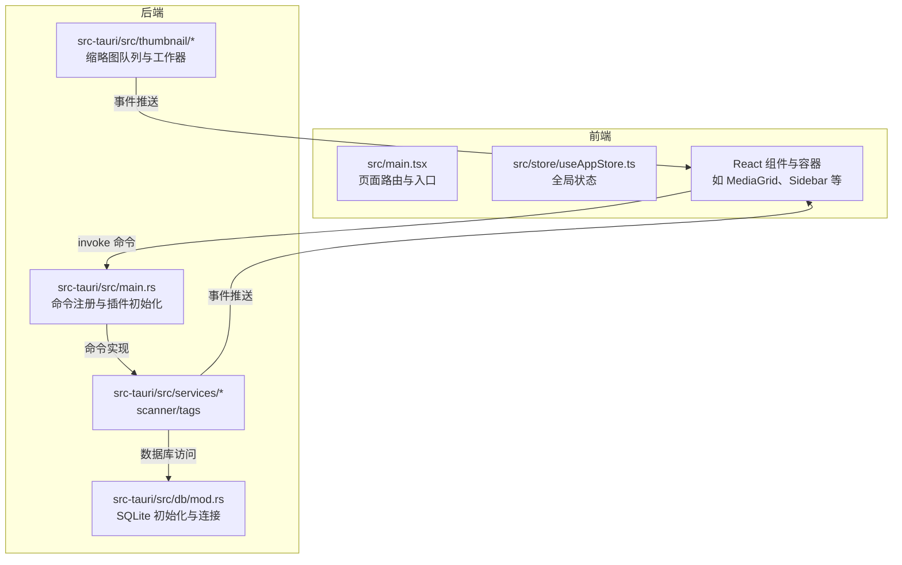
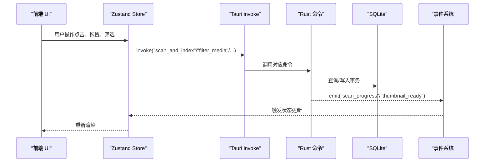
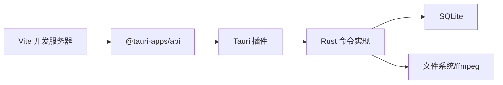

# 调试与测试

<cite>
**本文引用的文件**
- [package.json](file://package.json)
- [vite.config.ts](file://vite.config.ts)
- [DEVELOPMENT.md](file://DEVELOPMENT.md)
- [src/main.tsx](file://src/main.tsx)
- [src/store/useAppStore.ts](file://src/store/useAppStore.ts)
- [src-tauri/Cargo.toml](file://src-tauri/Cargo.toml)
- [src-tauri/tauri.conf.json](file://src-tauri/tauri.conf.json)
- [src-tauri/src/main.rs](file://src-tauri/src/main.rs)
- [src-tauri/src/db/mod.rs](file://src-tauri/src/db/mod.rs)
- [src-tauri/src/services/scanner.rs](file://src-tauri/src/services/scanner.rs)
- [src-tauri/src/services/tags.rs](file://src-tauri/src/services/tags.rs)
- [src-tauri/src/thumbnail/manager.rs](file://src-tauri/src/thumbnail/manager.rs)
</cite>

## 目录
1. [简介](#简介)
2. [项目结构](#项目结构)
3. [核心组件](#核心组件)
4. [架构总览](#架构总览)
5. [详细组件分析](#详细组件分析)
6. [依赖分析](#依赖分析)
7. [性能考虑](#性能考虑)
8. [故障排除指南](#故障排除指南)
9. [结论](#结论)
10. [附录](#附录)

## 简介
本指南面向 Medex 项目的开发与维护团队，提供一套完整的调试与测试实践，覆盖前端（React/Vite）、后端（Tauri/Rust）、跨语言通信（invoke/event）、以及单元与集成测试策略。内容基于仓库现有配置与实现，结合常见问题与最佳实践，帮助快速定位问题、提升开发效率。

## 项目结构
Medex 采用“前端 React/Vite + 后端 Tauri/Rust”的混合架构，前端负责 UI 与交互，后端负责数据库、扫描与缩略图等计算密集型任务，并通过 Tauri 的 invoke 与事件系统进行通信。

图表来源
- [src/main.tsx:1-44](file://src/main.tsx#L1-L44)
- [src/store/useAppStore.ts:1-395](file://src/store/useAppStore.ts#L1-L395)
- [src-tauri/src/main.rs:1-69](file://src-tauri/src/main.rs#L1-L69)
- [src-tauri/src/db/mod.rs:1-123](file://src-tauri/src/db/mod.rs#L1-L123)
- [src-tauri/src/services/scanner.rs:1-200](file://src-tauri/src/services/scanner.rs#L1-L200)
- [src-tauri/src/services/tags.rs:1-200](file://src-tauri/src/services/tags.rs#L1-L200)
- [src-tauri/src/thumbnail/manager.rs:1-108](file://src-tauri/src/thumbnail/manager.rs#L1-L108)

章节来源
- [DEVELOPMENT.md: 第50-116 行:50-116](file://DEVELOPMENT.md#L50-L116)
- [package.json: 第1-36 行:1-36](file://package.json#L1-L36)
- [vite.config.ts: 第1-11 行:1-11](file://vite.config.ts#L1-L11)
- [src-tauri/tauri.conf.json: 第1-46 行:1-46](file://src-tauri/tauri.conf.json#L1-L46)

## 核心组件
- 前端入口与路由：根据路径选择渲染主应用、设置页或更新页，便于隔离页面级调试。
- 全局状态：Zustand store 管理导航、标签、媒体列表与筛选条件，便于断点观察状态变更。
- Tauri 命令注册：集中注册 scanner/tags/thumbnail 的命令，便于统一调试 invoke 调用链。
- 数据库模块：SQLite 初始化、表结构与索引、连接池封装，便于定位 SQL 性能与一致性问题。
- 缩略图系统：队列、工作器、去重与缓存路径，便于定位并发与资源占用问题。

章节来源
- [src/main.tsx: 第10-41 行:10-41](file://src/main.tsx#L10-L41)
- [src/store/useAppStore.ts: 第145-L395:145-395](file://src/store/useAppStore.ts#L145-L395)
- [src-tauri/src/main.rs: 第49-L65:49-65](file://src-tauri/src/main.rs#L49-L65)
- [src-tauri/src/db/mod.rs: 第45-L64:45-64](file://src-tauri/src/db/mod.rs#L45-L64)
- [src-tauri/src/thumbnail/manager.rs: 第24-L49:24-49](file://src-tauri/src/thumbnail/manager.rs#L24-L49)

## 架构总览
Medex 的前后端通过 Tauri 的 invoke 与事件双向通信：
- 前端通过 invoke 调用后端命令（如扫描、筛选、标签操作、缩略图请求）。
- 后端通过事件向前端推送扫描进度、缩略图完成等消息。
- 前端内部也使用 window.dispatchEvent 做轻量刷新信号。

图表来源
- [DEVELOPMENT.md: 第124-L140:124-140](file://DEVELOPMENT.md#L124-L140)
- [src-tauri/src/main.rs: 第49-L65:49-65](file://src-tauri/src/main.rs#L49-L65)
- [src-tauri/src/services/scanner.rs: 第160-L163:160-163](file://src-tauri/src/services/scanner.rs#L160-L163)
- [src-tauri/src/services/tags.rs: 第19-L42:19-42](file://src-tauri/src/services/tags.rs#L19-L42)
- [src-tauri/src/thumbnail/manager.rs: 第51-L106:51-106](file://src-tauri/src/thumbnail/manager.rs#L51-L106)

## 详细组件分析

### 前端调试要点
- 浏览器开发者工具
  - 使用 Elements/Network/Console/Performance 面板定位 UI、网络与性能问题。
  - 在关键交互处设置断点（如点击标签、切换视图模式、触发缩略图请求）。
- React DevTools 集成
  - 安装 React DevTools 浏览器扩展，观察组件树、Props 与状态变化，定位不必要的重渲染。
- Vite 热重载调试
  - 开发服务器端口已在配置中固定，便于联调与抓包。
  - 修改组件或 store 后热更新应即时生效；若未生效，检查控制台错误与依赖循环。
- 网络请求监控
  - 通过 Network 面板观察 invoke 请求与响应，核对 payload 与返回值。
  - 若涉及本地文件预览，确保使用 convertFileSrc 转换路径，避免 unsupported URL。

章节来源
- [vite.config.ts: 第6-L9:6-9](file://vite.config.ts#L6-L9)
- [DEVELOPMENT.md: 第564-L595:564-595](file://DEVELOPMENT.md#L564-L595)
- [src/main.tsx: 第10-L41:10-41](file://src/main.tsx#L10-L41)

### 后端调试要点（Rust/Tauri）
- 日志级别与输出
  - 后端使用 println!/eprintln! 输出关键信息（如数据库初始化、ffmpeg 查找、缩略图队列状态），便于定位问题。
- 断点设置
  - 在命令函数入口与关键分支设置断点，观察参数、返回值与异常路径。
- 内存与并发
  - 缩略图系统使用固定 worker 数与有界队列，注意队列满与去重集合的并发安全。
- 数据库调试
  - 通过 with_connection 访问数据库，可在事务与查询处设置断点，核对 SQL 语句与索引使用情况。

章节来源
- [src-tauri/src/main.rs: 第14-L22:14-22](file://src-tauri/src/main.rs#L14-L22)
- [src-tauri/src/db/mod.rs: 第97-L110:97-110](file://src-tauri/src/db/mod.rs#L97-L110)
- [src-tauri/src/thumbnail/manager.rs: 第24-L49:24-49](file://src-tauri/src/thumbnail/manager.rs#L24-L49)

### 跨语言调试策略（Tauri invoke 与事件）
- 命令调用跟踪
  - 在前端 store 或容器中记录 invoke 调用与响应，核对命令名与参数类型。
  - 在后端 main.rs 的 invoke_handler 中核对命令注册与实现是否一致。
- 事件监听
  - 监听 scan_progress、scan_done、thumbnail_ready 等事件，观察事件频率与数据结构。
- 事件总线
  - 前端内部使用 window.dispatchEvent 做轻量刷新，建议逐步迁移到显式 store action，便于调试与追踪。

章节来源
- [DEVELOPMENT.md: 第124-L140:124-140](file://DEVELOPMENT.md#L124-L140)
- [src-tauri/src/main.rs: 第49-L65:49-65](file://src-tauri/src/main.rs#L49-L65)

### 单元测试策略（建议）
- Jest 配置
  - 建议在 package.json 中添加测试脚本与 jest 配置，覆盖 store action、工具函数与纯 Rust 逻辑（通过 FFI 或独立模块）。
- 测试文件组织
  - 将测试文件置于同目录下的 __tests__ 或 *.test.ts，按功能模块划分（store、utils、services）。
- Mock 对象
  - 对 invoke 与事件进行 Mock，模拟成功/失败场景，验证状态更新与 UI 行为。
- 覆盖率报告
  - 集成覆盖率收集与阈值配置，保证关键路径均有覆盖。

（本节为通用测试策略建议，未直接分析具体文件）

### 集成测试方法（建议）
- E2E 框架选择
  - 推荐使用 Playwright 或 Cypress，支持多窗口与桌面应用特性。
- 测试用例设计
  - 扫描导入：选择目录、监听进度事件、校验媒体列表。
  - 标签筛选：创建标签、拖拽打标、交集筛选、计数更新。
  - 缩略图：可见区域滚动、并发与去重、事件回调。
  - 最近查看：双击打开 Viewer、标记最近查看、切换导航。
- 自动化流水线
  - 在 CI 中执行 E2E 测试，结合构建与打包步骤，确保端到端稳定性。

（本节为通用测试策略建议，未直接分析具体文件）

## 依赖分析
- 前端依赖
  - @tauri-apps/api 提供 invoke、event、convertFileSrc 等能力。
  - Vite 提供开发服务器与热重载。
- 后端依赖
  - tauri、tauri-plugin-dialog、tauri-plugin-updater 提供桌面能力与更新。
  - rusqlite、walkdir、serde 等支撑数据库与扫描。
- 配置耦合
  - tauri.conf.json 的 devUrl 与前端 Vite 端口保持一致，确保热重载与 invoke 调用正常。

图表来源
- [package.json: 第12-L34:12-34](file://package.json#L12-L34)
- [src-tauri/Cargo.toml: 第13-L22:13-22](file://src-tauri/Cargo.toml#L13-L22)
- [src-tauri/tauri.conf.json: 第6-L11:6-11](file://src-tauri/tauri.conf.json#L6-L11)

章节来源
- [package.json: 第12-L34:12-34](file://package.json#L12-L34)
- [src-tauri/Cargo.toml: 第13-L22:13-22](file://src-tauri/Cargo.toml#L13-L22)
- [src-tauri/tauri.conf.json: 第6-L11:6-11](file://src-tauri/tauri.conf.json#L6-L11)

## 性能考虑
- 前端性能
  - 使用 react-window 虚拟化渲染，避免一次性渲染大量节点。
  - 控制缩略图并发与队列长度，防止主线程阻塞。
- 后端性能
  - 批量插入使用事务，减少磁盘 IO。
  - 缩略图队列容量与 worker 数量需平衡吞吐与资源占用。
- 数据库性能
  - 合理使用索引，避免全表扫描；关注大查询的执行计划。

（本节为通用性能建议，未直接分析具体文件）

## 故障排除指南
- dialog.open 权限不足
  - 检查 capabilities 配置是否包含 dialog:allow-open 与 dialog:default。
- 本地文件无法预览
  - 确保使用 convertFileSrc 转换路径，而非直接拼接绝对路径。
- 缩略图一直失败
  - 检查系统是否存在 ffmpeg，或在 src-tauri/binaries 放置内置二进制。
- 页面卡顿/白屏
  - 排查是否在网格内批量挂载视频、是否启用虚拟化、并发是否过高。

章节来源
- [DEVELOPMENT.md: 第566-L595:566-595](file://DEVELOPMENT.md#L566-L595)

## 结论
通过明确的前端/后端调试入口、完善的跨语言通信链路与可落地的测试策略，Medex 能够在开发与维护阶段快速定位问题、稳定迭代功能。建议逐步完善单元与 E2E 测试，统一日志与事件总线，持续优化性能与可靠性。

## 附录
- 快速排障清单
  - 检查 capabilities 与资源协议配置
  - 确认 devUrl 与前端端口一致
  - 校验 ffmpeg 可用性与内置二进制
  - 使用 React DevTools 与浏览器性能面板定位瓶颈

章节来源
- [DEVELOPMENT.md: 第564-L595:564-595](file://DEVELOPMENT.md#L564-L595)
- [src-tauri/tauri.conf.json: 第6-L11:6-11](file://src-tauri/tauri.conf.json#L6-L11)