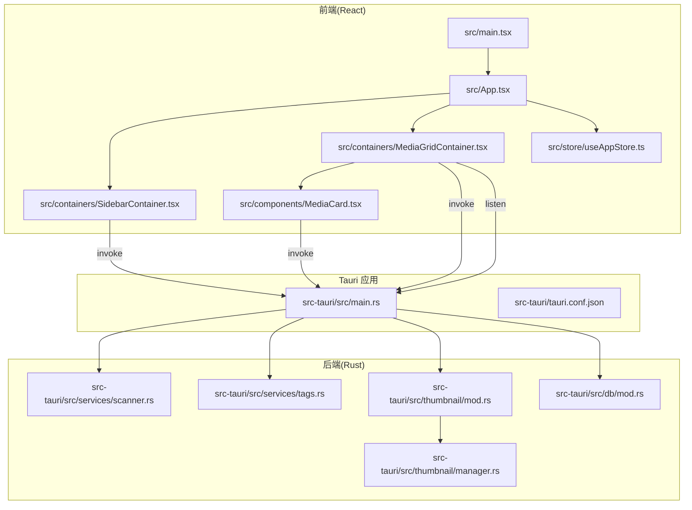
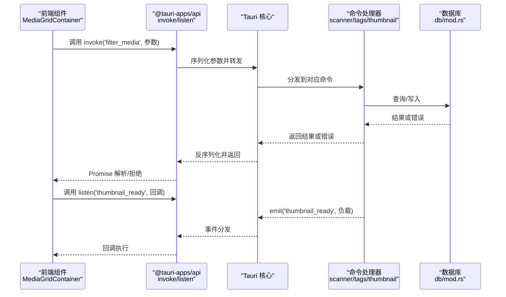
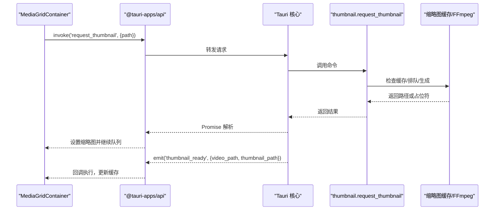
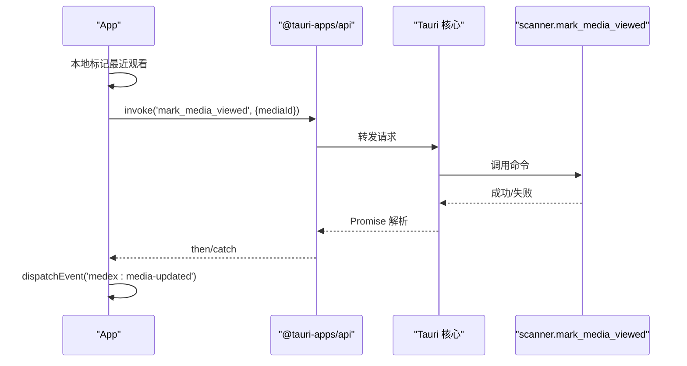
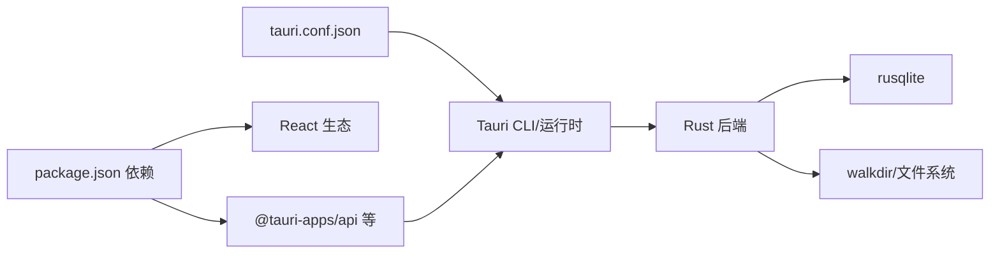

# 跨语言调试

<cite>
**本文引用的文件**
- [src-tauri/src/main.rs](file://src-tauri/src/main.rs)
- [src-tauri/tauri.conf.json](file://src-tauri/tauri.conf.json)
- [package.json](file://package.json)
- [src/main.tsx](file://src/main.tsx)
- [src/App.tsx](file://src/App.tsx)
- [src/components/Main.tsx](file://src/components/Main.tsx)
- [src/containers/MediaGridContainer.tsx](file://src/containers/MediaGridContainer.tsx)
- [src/containers/SidebarContainer.tsx](file://src/containers/SidebarContainer.tsx)
- [src/components/MediaCard.tsx](file://src/components/MediaCard.tsx)
- [src/store/useAppStore.ts](file://src/store/useAppStore.ts)
- [src-tauri/src/services/scanner.rs](file://src-tauri/src/services/scanner.rs)
- [src-tauri/src/services/tags.rs](file://src-tauri/src/services/tags.rs)
- [src-tauri/src/thumbnail/mod.rs](file://src-tauri/src/thumbnail/mod.rs)
- [src-tauri/src/thumbnail/manager.rs](file://src-tauri/src/thumbnail/manager.rs)
- [src-tauri/src/db/mod.rs](file://src-tauri/src/db/mod.rs)
</cite>

## 目录
1. [简介](#简介)
2. [项目结构](#项目结构)
3. [核心组件](#核心组件)
4. [架构总览](#架构总览)
5. [详细组件分析](#详细组件分析)
6. [依赖关系分析](#依赖关系分析)
7. [性能考量](#性能考量)
8. [故障排查指南](#故障排查指南)
9. [结论](#结论)
10. [附录](#附录)

## 简介
本指南面向 Medex 的跨语言调试场景，聚焦于 Tauri 前后端通信调试，涵盖 invoke 命令调用调试、事件监听调试与数据序列化问题排查；解释 TypeScript 与 Rust 类型系统差异导致的调试问题；阐述异步通信调试技巧（Promise 处理、回调调试、超时处理）；提供事件系统调试方法（监听器注册、事件传播追踪、性能影响分析）；并详述文件系统操作调试（路径解析、权限检查、跨平台兼容性）。文档同时给出实际跨语言调试案例与常见问题的解决方案。

## 项目结构
Medex 采用 Tauri v2 架构，前端为 React + Vite，后端为 Rust，通过 @tauri-apps/api 提供跨语言桥接。核心目录与职责如下：
- src：React 前端组件、容器、页面与状态管理
- src-tauri：Rust 后端，包含命令注册、数据库初始化、缩略图子系统、服务模块等
- 配置：package.json（前端依赖与脚本）、tauri.conf.json（Tauri 应用配置）

图表来源
- [src/main.tsx:1-44](file://src/main.tsx#L1-L44)
- [src/App.tsx:1-73](file://src/App.tsx#L1-L73)
- [src/containers/MediaGridContainer.tsx:1-619](file://src/containers/MediaGridContainer.tsx#L1-L619)
- [src/containers/SidebarContainer.tsx:1-79](file://src/containers/SidebarContainer.tsx#L1-L79)
- [src/components/MediaCard.tsx:1-318](file://src/components/MediaCard.tsx#L1-L318)
- [src/store/useAppStore.ts:1-395](file://src/store/useAppStore.ts#L1-L395)
- [src-tauri/src/main.rs:10-68](file://src-tauri/src/main.rs#L10-L68)
- [src-tauri/src/services/scanner.rs:160-341](file://src-tauri/src/services/scanner.rs#L160-L341)
- [src-tauri/src/services/tags.rs:19-220](file://src-tauri/src/services/tags.rs#L19-L220)
- [src-tauri/src/thumbnail/mod.rs:57-62](file://src-tauri/src/thumbnail/mod.rs#L57-L62)
- [src-tauri/src/thumbnail/manager.rs:24-107](file://src-tauri/src/thumbnail/manager.rs#L24-L107)
- [src-tauri/src/db/mod.rs:45-123](file://src-tauri/src/db/mod.rs#L45-L123)

章节来源
- [src/main.tsx:1-44](file://src/main.tsx#L1-L44)
- [src/App.tsx:1-73](file://src/App.tsx#L1-L73)
- [src-tauri/src/main.rs:10-68](file://src-tauri/src/main.rs#L10-L68)

## 核心组件
- 前端入口与路由：根据 URL 决定渲染页面，挂载主题上下文与应用根组件。
- 应用根组件：负责媒体项状态、导航项状态、打开媒体查看器时触发后端标记“最近观看”并派发全局事件。
- 媒体网格容器：负责筛选媒体、批量标签操作、请求缩略图、监听缩略图就绪事件、监听媒体库路径变更事件、监听媒体更新事件。
- 侧边栏容器：负责标签列表加载、创建/删除标签、监听标签更新事件。
- 媒体卡片：负责收藏切换、移除标签、预览图处理。
- 应用状态：使用 Zustand 管理导航、标签、媒体列表、视图模式、媒体类型过滤等。
- 后端命令：扫描与索引、查询媒体、按标签过滤、收藏状态切换、最近观看记录、标签 CRUD、缩略图请求。
- 数据库：SQLite 初始化、表结构与索引、连接池封装。
- 缩略图：任务队列、工作线程、缓存目录、FFmpeg 可用性检测与占位符返回。

章节来源
- [src/App.tsx:28-42](file://src/App.tsx#L28-L42)
- [src/containers/MediaGridContainer.tsx:210-235](file://src/containers/MediaGridContainer.tsx#L210-L235)
- [src/containers/MediaGridContainer.tsx:365-387](file://src/containers/MediaGridContainer.tsx#L365-L387)
- [src/containers/MediaGridContainer.tsx:453-486](file://src/containers/MediaGridContainer.tsx#L453-L486)
- [src/containers/SidebarContainer.tsx:16-33](file://src/containers/SidebarContainer.tsx#L16-L33)
- [src/components/MediaCard.tsx:65-84](file://src/components/MediaCard.tsx#L65-L84)
- [src/store/useAppStore.ts:145-394](file://src/store/useAppStore.ts#L145-L394)
- [src-tauri/src/services/scanner.rs:160-341](file://src-tauri/src/services/scanner.rs#L160-L341)
- [src-tauri/src/services/tags.rs:19-220](file://src-tauri/src/services/tags.rs#L19-L220)
- [src-tauri/src/thumbnail/mod.rs:57-62](file://src-tauri/src/thumbnail/mod.rs#L57-L62)
- [src-tauri/src/db/mod.rs:45-123](file://src-tauri/src/db/mod.rs#L45-L123)

## 架构总览
Tauri 应用启动时注册命令处理器与菜单事件，前端通过 @tauri-apps/api 的 invoke 与 listen 进行跨语言通信。数据库与缩略图子系统在后端初始化并提供能力，前端通过命令与事件进行交互。

图表来源
- [src-tauri/src/main.rs:49-65](file://src-tauri/src/main.rs#L49-L65)
- [src-tauri/src/services/scanner.rs:306-329](file://src-tauri/src/services/scanner.rs#L306-L329)
- [src-tauri/src/services/scanner.rs:343-389](file://src-tauri/src/services/scanner.rs#L343-L389)
- [src-tauri/src/services/tags.rs:19-220](file://src-tauri/src/services/tags.rs#L19-L220)
- [src-tauri/src/db/mod.rs:97-110](file://src-tauri/src/db/mod.rs#L97-L110)
- [src/containers/MediaGridContainer.tsx:453-486](file://src/containers/MediaGridContainer.tsx#L453-L486)

## 详细组件分析

### 组件一：媒体网格容器（跨语言通信与事件系统）
- 职责
  - 通过 invoke('filter_media') 获取媒体列表，映射为前端模型
  - 通过 invoke('request_thumbnail') 请求视频缩略图，使用占位符策略避免重复请求
  - 监听 'thumbnail_ready' 事件，更新缩略图缓存并驱动队列继续
  - 监听 'medex:media-updated' 等全局事件，触发本地状态刷新
  - 监听 'medex:library-path-cleared' 事件，保持跨窗口状态一致
- 关键调试点
  - invoke 参数类型与后端命令签名一致性（如 mediaId 的 i64 vs 前端字符串）
  - 事件负载结构与前端监听回调期望一致（thumbnail_ready 负载字段）
  - 并发与队列容量控制，避免阻塞 UI
  - 错误处理：网络/磁盘/FFmpeg 异常的降级与日志

图表来源
- [src/containers/MediaGridContainer.tsx:365-387](file://src/containers/MediaGridContainer.tsx#L365-L387)
- [src/containers/MediaGridContainer.tsx:453-486](file://src/containers/MediaGridContainer.tsx#L453-L486)
- [src-tauri/src/thumbnail/mod.rs:57-62](file://src-tauri/src/thumbnail/mod.rs#L57-L62)
- [src-tauri/src/thumbnail/manager.rs:51-106](file://src-tauri/src/thumbnail/manager.rs#L51-L106)

章节来源
- [src/containers/MediaGridContainer.tsx:210-235](file://src/containers/MediaGridContainer.tsx#L210-L235)
- [src/containers/MediaGridContainer.tsx:365-387](file://src/containers/MediaGridContainer.tsx#L365-L387)
- [src/containers/MediaGridContainer.tsx:453-486](file://src/containers/MediaGridContainer.tsx#L453-L486)
- [src-tauri/src/thumbnail/mod.rs:57-62](file://src-tauri/src/thumbnail/mod.rs#L57-L62)
- [src-tauri/src/thumbnail/manager.rs:51-106](file://src-tauri/src/thumbnail/manager.rs#L51-L106)

### 组件二：应用根组件（命令调用与事件派发）
- 职责
  - 打开媒体查看器时，先本地标记“最近观看”，再调用后端命令 mark_media_viewed
  - 命令成功后派发 'medex:media-updated' 事件，通知网格刷新
- 关键调试点
  - 本地状态与后端状态的一致性（先本地再后端）
  - Promise 链式处理与错误捕获
  - 事件命名与监听方约定一致

图表来源
- [src/App.tsx:35-41](file://src/App.tsx#L35-L41)
- [src-tauri/src/services/scanner.rs:357-389](file://src-tauri/src/services/scanner.rs#L357-L389)

章节来源
- [src/App.tsx:28-42](file://src/App.tsx#L28-L42)
- [src-tauri/src/services/scanner.rs:357-389](file://src-tauri/src/services/scanner.rs#L357-L389)

### 组件三：侧边栏容器（标签 CRUD 与事件）
- 职责
  - 通过 invoke('get_all_tags_with_count') 加载标签
  - 通过 invoke('create_tag'/'delete_tag') 修改标签
  - 监听 'medex:tags-updated' 刷新标签列表
- 关键调试点
  - 标签名去空格与唯一性约束
  - 删除标签前的使用检查（是否仍关联媒体）
  - 事件驱动的刷新策略

章节来源
- [src/containers/SidebarContainer.tsx:16-33](file://src/containers/SidebarContainer.tsx#L16-L33)
- [src/containers/SidebarContainer.tsx:35-63](file://src/containers/SidebarContainer.tsx#L35-L63)
- [src-tauri/src/services/tags.rs:44-124](file://src-tauri/src/services/tags.rs#L44-L124)

### 组件四：媒体卡片（标签移除与收藏切换）
- 职责
  - 收藏切换：invoke('set_media_favorite')
  - 移除标签：先查询媒体标签，匹配后调用 'remove_tag_from_media'
- 关键调试点
  - 前端 id 与后端 id 的类型转换（Number(id)）
  - 标签名称匹配与后端 id 对应关系

章节来源
- [src/components/MediaCard.tsx:65-84](file://src/components/MediaCard.tsx#L65-L84)
- [src-tauri/src/services/tags.rs:166-188](file://src-tauri/src/services/tags.rs#L166-L188)

### 组件五：缩略图子系统（队列、并发与占位符）
- 职责
  - 任务队列与工作线程
  - 缓存命中直接返回路径，未命中返回占位符并入队
  - FFmpeg 可用性检测与错误提示
- 关键调试点
  - 队列满时的降级策略（返回占位符）
  - 并发集合去重与重复请求抑制
  - 输出路径与缓存目录跨平台兼容

章节来源
- [src-tauri/src/thumbnail/mod.rs:57-62](file://src-tauri/src/thumbnail/mod.rs#L57-L62)
- [src-tauri/src/thumbnail/manager.rs:51-106](file://src-tauri/src/thumbnail/manager.rs#L51-L106)

### 组件六：数据库（初始化与连接）
- 职责
  - 初始化 SQLite 文件与表结构、索引
  - 提供连接获取与迁移（如新增列）
- 关键调试点
  - 数据目录可读写权限
  - 并发锁与死锁规避
  - SQL 语句与参数绑定

章节来源
- [src-tauri/src/db/mod.rs:45-123](file://src-tauri/src/db/mod.rs#L45-L123)

## 依赖关系分析
- 前端依赖
  - @tauri-apps/api：invoke、listen、convertFileSrc
  - @tauri-apps/plugin-dialog：文件选择
  - react/react-dom、react-dnd、react-window、zustand
- 后端依赖
  - tauri、tauri-plugin-dialog、tauri-plugin-updater
  - rusqlite、walkdir、serde、anyhow、once_cell
- 应用配置
  - tauri.conf.json：开发/构建 URL、安全策略、插件启用、外部二进制（FFmpeg）

图表来源
- [package.json:12-34](file://package.json#L12-L34)
- [src-tauri/tauri.conf.json:6-44](file://src-tauri/tauri.conf.json#L6-L44)

章节来源
- [package.json:12-34](file://package.json#L12-L34)
- [src-tauri/tauri.conf.json:6-44](file://src-tauri/tauri.conf.json#L6-L44)

## 性能考量
- 前端
  - 使用 memo 与浅比较减少渲染开销（MediaCard）
  - 虚拟化滚动与可见范围计算（MediaGridContainer）
  - 防抖/节流与定时器清理（过滤与路径检查）
- 后端
  - 事务批处理插入（scanner.insert_media_batch）
  - 限流与队列容量控制（thumbnail 队列）
  - 索引优化（数据库索引）
- 事件系统
  - 事件监听器及时解绑，避免内存泄漏
  - 事件负载尽量轻量化，避免大对象频繁传输

章节来源
- [src/components/MediaCard.tsx:277-317](file://src/components/MediaCard.tsx#L277-L317)
- [src/containers/MediaGridContainer.tsx:417-451](file://src/containers/MediaGridContainer.tsx#L417-L451)
- [src-tauri/src/services/scanner.rs:90-115](file://src-tauri/src/services/scanner.rs#L90-L115)
- [src-tauri/src/db/mod.rs:39-43](file://src-tauri/src/db/mod.rs#L39-L43)
- [src-tauri/src/thumbnail/manager.rs:83-103](file://src-tauri/src/thumbnail/manager.rs#L83-L103)

## 故障排查指南

### invoke 命令调用调试
- 症状
  - Promise 永不 resolve 或抛错
  - 后端日志无输出
- 排查步骤
  - 确认命令已在 main.rs 中注册（generate_handler）
  - 检查前端调用的命令名与参数类型是否与后端签名一致
  - 在后端命令中打印关键信息（输入参数、执行阶段），验证是否到达
  - 捕获并记录前端错误，区分网络/序列化/业务异常
- 相关文件
  - [src-tauri/src/main.rs:49-65](file://src-tauri/src/main.rs#L49-L65)
  - [src/containers/MediaGridContainer.tsx:212-235](file://src/containers/MediaGridContainer.tsx#L212-L235)
  - [src-tauri/src/services/scanner.rs:160-163](file://src-tauri/src/services/scanner.rs#L160-L163)

章节来源
- [src-tauri/src/main.rs:49-65](file://src-tauri/src/main.rs#L49-L65)
- [src-tauri/src/services/scanner.rs:160-163](file://src-tauri/src/services/scanner.rs#L160-L163)

### 事件监听调试
- 症状
  - 事件未触发或回调不执行
  - 事件风暴导致 UI 卡顿
- 排查步骤
  - 确认事件名拼写一致（大小写、连字符）
  - 检查 emit 调用位置与时机（scanner、thumbnail）
  - 监听器解绑逻辑是否正确（useEffect cleanup）
  - 事件负载过大时拆分或延迟发送
- 相关文件
  - [src-tauri/src/services/scanner.rs:306-329](file://src-tauri/src/services/scanner.rs#L306-L329)
  - [src/containers/MediaGridContainer.tsx:453-486](file://src/containers/MediaGridContainer.tsx#L453-L486)
  - [src/App.tsx:38-41](file://src/App.tsx#L38-L41)

章节来源
- [src-tauri/src/services/scanner.rs:306-329](file://src-tauri/src/services/scanner.rs#L306-L329)
- [src/containers/MediaGridContainer.tsx:453-486](file://src/containers/MediaGridContainer.tsx#L453-L486)
- [src/App.tsx:38-41](file://src/App.tsx#L38-L41)

### 数据序列化问题排查
- 症状
  - 前端收到的字段名与预期不符
  - 数值/布尔值类型错位
- 排查步骤
  - 检查后端 serde 注解（rename、Serialize）
  - 比对前端模型字段（useAppStore 中的 DbMediaItem/MediaItem）
  - 使用最小化 payload 验证序列化行为
- 相关文件
  - [src-tauri/src/services/scanner.rs:18-31](file://src-tauri/src/services/scanner.rs#L18-L31)
  - [src/store/useAppStore.ts:31-46](file://src/store/useAppStore.ts#L31-L46)
  - [src/containers/MediaGridContainer.tsx:217-231](file://src/containers/MediaGridContainer.tsx#L217-L231)

章节来源
- [src-tauri/src/services/scanner.rs:18-31](file://src-tauri/src/services/scanner.rs#L18-L31)
- [src/store/useAppStore.ts:31-46](file://src/store/useAppStore.ts#L31-L46)
- [src/containers/MediaGridContainer.tsx:217-231](file://src/containers/MediaGridContainer.tsx#L217-L231)

### TypeScript 与 Rust 类型系统差异
- 症状
  - 前端传入 i64，后端解析失败
  - 布尔值在 JSON 中被误解
- 排查步骤
  - 前端统一将数字转为 BigInt/Number 合法范围内的整数
  - 后端显式校验与错误返回（Result/Err）
  - 使用 serde rename 保证字段名一致
- 相关文件
  - [src-tauri/src/services/scanner.rs:344-354](file://src-tauri/src/services/scanner.rs#L344-L354)
  - [src-tauri/src/services/tags.rs:77-93](file://src-tauri/src/services/tags.rs#L77-L93)
  - [src/components/MediaCard.tsx:66-76](file://src/components/MediaCard.tsx#L66-L76)

章节来源
- [src-tauri/src/services/scanner.rs:344-354](file://src-tauri/src/services/scanner.rs#L344-L354)
- [src-tauri/src/services/tags.rs:77-93](file://src-tauri/src/services/tags.rs#L77-L93)
- [src/components/MediaCard.tsx:66-76](file://src/components/MediaCard.tsx#L66-L76)

### 异步通信调试技巧
- Promise 处理
  - 使用 try/catch 包裹 invoke，记录错误栈
  - 对批量操作使用 Promise.allSettled 控制风险
- 回调函数调试
  - 在 listen 回调中打印 payload 结构
  - 逐步注释/恢复逻辑定位问题
- 超时处理
  - 为长耗时命令设置超时（如扫描/缩略图生成）
  - 使用 cancelable promise 或 AbortController

章节来源
- [src/containers/MediaGridContainer.tsx:145-175](file://src/containers/MediaGridContainer.tsx#L145-L175)
- [src/containers/MediaGridContainer.tsx:365-387](file://src/containers/MediaGridContainer.tsx#L365-L387)
- [src-tauri/src/thumbnail/manager.rs:83-103](file://src-tauri/src/thumbnail/manager.rs#L83-L103)

### 事件系统调试方法
- 监听器注册
  - 在组件 mount 时注册，在 unmount 时解绑
  - 使用 ref 存储回调以支持立即解绑
- 事件传播追踪
  - 在 emit 端打印事件名与 payload
  - 在 listen 端打印接收时间与负载摘要
- 性能影响分析
  - 避免高频事件（如滚动/缩略图 ready）
  - 使用节流/去抖或批量更新

章节来源
- [src/containers/MediaGridContainer.tsx:294-308](file://src/containers/MediaGridContainer.tsx#L294-L308)
- [src-tauri/src/services/scanner.rs:306-329](file://src-tauri/src/services/scanner.rs#L306-L329)

### 文件系统操作调试
- 路径解析
  - 统一使用 convertFileSrc 将绝对路径转换为可访问 URL
  - 跨平台路径前缀识别（Unix/Windows）
- 权限检查
  - 确保应用数据目录可写（resolve_db_path）
  - 缩略图缓存目录存在且可写
- 跨平台兼容性
  - FFmpeg 二进制路径与打包策略（externalBin）
  - 文件扩展名与媒体类型判断（小写/白名单）

章节来源
- [src/components/MediaCard.tsx:266-275](file://src/components/MediaCard.tsx#L266-L275)
- [src-tauri/src/db/mod.rs:112-122](file://src-tauri/src/db/mod.rs#L112-L122)
- [src-tauri/tauri.conf.json:32](file://src-tauri/tauri.conf.json#L32)
- [src-tauri/src/thumbnail/manager.rs:26-31](file://src-tauri/src/thumbnail/manager.rs#L26-L31)

### 实际跨语言调试案例
- 案例一：媒体列表为空
  - 现象：前端显示“暂无媒体库”或“暂无数据”
  - 排查：检查 localStorage.libraryPath 是否存在；确认已触发 scan_and_index；监听 'medex:library-path-cleared' 事件
  - 处理：在 MediaGridContainer 中监听并刷新
  - 参考
    - [src/containers/MediaGridContainer.tsx:294-308](file://src/containers/MediaGridContainer.tsx#L294-L308)
    - [src/containers/MediaGridContainer.tsx:311-331](file://src/containers/MediaGridContainer.tsx#L311-L331)
- 案例二：缩略图不显示
  - 现象：视频卡片显示“生成缩略图...”
  - 排查：确认 FFmpeg 可用；检查队列是否满；查看占位符返回
  - 处理：增大队列容量或降低并发；确保缓存目录可写
  - 参考
    - [src-tauri/src/thumbnail/manager.rs:83-103](file://src-tauri/src/thumbnail/manager.rs#L83-L103)
    - [src/containers/MediaGridContainer.tsx:453-486](file://src/containers/MediaGridContainer.tsx#L453-L486)
- 案例三：收藏状态不同步
  - 现象：点击收藏后 UI 未更新
  - 排查：确认 set_media_favorite 命令成功；检查本地状态更新逻辑
  - 处理：在成功回调中调用 toggleFavorite
  - 参考
    - [src/components/MediaCard.tsx:65-84](file://src/components/MediaCard.tsx#L65-L84)
    - [src/containers/MediaGridContainer.tsx:185-201](file://src/containers/MediaGridContainer.tsx#L185-L201)

## 结论
Medex 的跨语言调试围绕 invoke 命令与事件系统展开。通过明确命令注册、参数类型、序列化规则与错误处理机制，结合前端 Promise/事件调试与后端日志，可快速定位问题。缩略图与数据库子系统需要关注并发、队列与文件系统权限。建议在开发阶段开启详细日志与断点，配合最小化复现步骤，逐步缩小问题范围。

## 附录
- 常用调试命令
  - 开发模式：npm run dev
  - 构建：npm run build
  - Tauri CLI：npm run tauri
- 关键配置
  - tauri.conf.json 中 devUrl、externalBin、插件启用
  - package.json 中依赖版本与脚本

章节来源
- [src-tauri/tauri.conf.json:6-11](file://src-tauri/tauri.conf.json#L6-L11)
- [package.json:6-11](file://package.json#L6-L11)