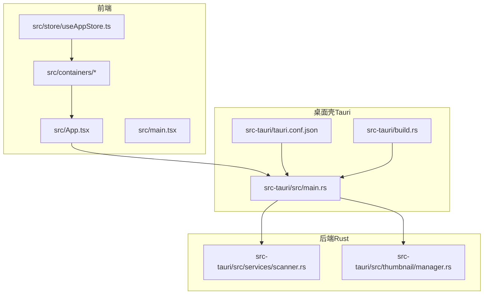
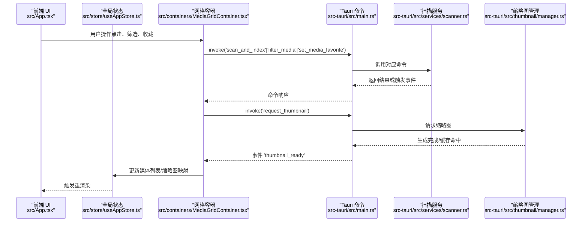
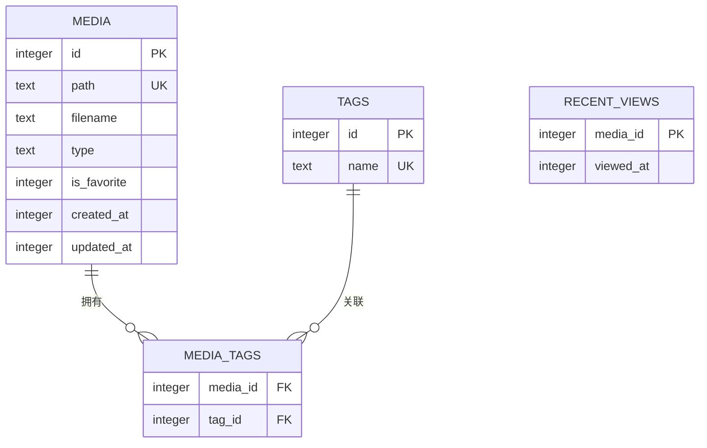
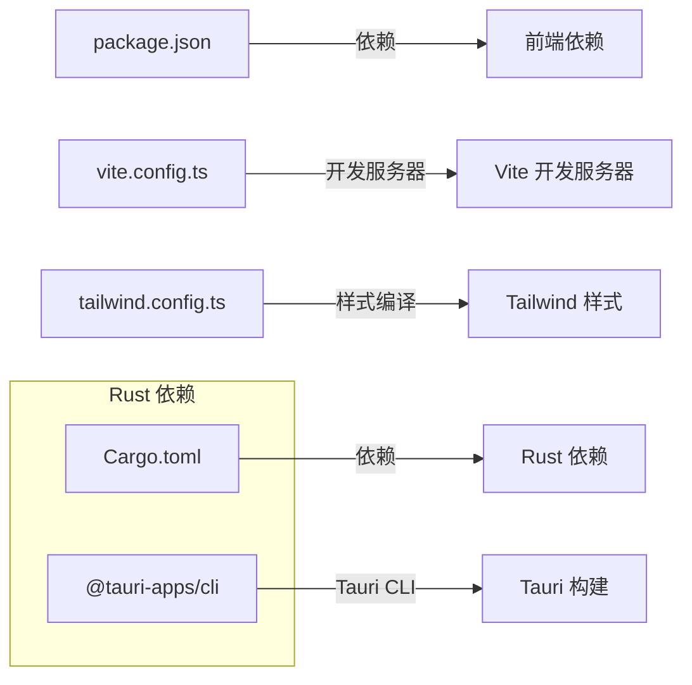

# 快速开始

<cite>
**本文引用的文件**
- [README.md](file://README.md)
- [DEVELOPMENT.md](file://DEVELOPMENT.md)
- [package.json](file://package.json)
- [vite.config.ts](file://vite.config.ts)
- [tailwind.config.ts](file://tailwind.config.ts)
- [src-tauri/tauri.conf.json](file://src-tauri/tauri.conf.json)
- [src-tauri/Cargo.toml](file://src-tauri/Cargo.toml)
- [src-tauri/.cargo/config.toml](file://src-tauri/.cargo/config.toml)
- [src-tauri/build.rs](file://src-tauri/build.rs)
- [src-tauri/src/main.rs](file://src-tauri/src/main.rs)
- [src-tauri/src/services/scanner.rs](file://src-tauri/src/services/scanner.rs)
- [src-tauri/src/thumbnail/manager.rs](file://src-tauri/src/thumbnail/manager.rs)
- [src/App.tsx](file://src/App.tsx)
- [src/main.tsx](file://src/main.tsx)
- [src/containers/MediaGridContainer.tsx](file://src/containers/MediaGridContainer.tsx)
- [src/store/useAppStore.ts](file://src/store/useAppStore.ts)
</cite>

## 目录
1. [简介](#简介)
2. [项目结构](#项目结构)
3. [核心组件](#核心组件)
4. [架构总览](#架构总览)
5. [详细组件分析](#详细组件分析)
6. [依赖分析](#依赖分析)
7. [性能考虑](#性能考虑)
8. [故障排除指南](#故障排除指南)
9. [结论](#结论)
10. [附录](#附录)

## 简介
本指南面向初学者，帮助你在本地快速搭建并运行 Medex 项目。Medex 是一个基于 React + TypeScript + Tauri V2 + Rust + SQLite 的桌面媒体管理应用，支持视频与图片展示、标签分类与筛选、收藏与最近查看等功能。你将学会：
- 环境要求与前置条件（Node.js 18+、Rust 1.77.2+、npm/pnpm）
- 安装与配置依赖（前端与 Rust 后端）
- 开发模式启动（前端开发模式与 Tauri 完整开发模式）
- 生产构建与预览
- 常见问题与故障排除

## 项目结构
Medex 采用“前端（React/Vite）+ 桌面壳（Tauri）+ 后端（Rust）”的三层架构：
- 前端：src/ 目录下的 React + TypeScript + TailwindCSS + Vite
- 桌面壳：src-tauri/ 目录下的 Tauri 配置与 Rust 后端
- 构建与脚本：根目录 package.json 中定义的开发、构建与预览脚本

图表来源
- [src-tauri/tauri.conf.json:1-46](file://src-tauri/tauri.conf.json#L1-L46)
- [src-tauri/build.rs:1-4](file://src-tauri/build.rs#L1-L4)
- [src-tauri/src/main.rs:1-98](file://src-tauri/src/main.rs#L1-L98)
- [src-tauri/src/services/scanner.rs:1-200](file://src-tauri/src/services/scanner.rs#L1-L200)
- [src-tauri/src/thumbnail/manager.rs:1-108](file://src-tauri/src/thumbnail/manager.rs#L1-L108)
- [src/App.tsx:1-73](file://src/App.tsx#L1-L73)
- [src/main.tsx:1-44](file://src/main.tsx#L1-L44)
- [src/containers/MediaGridContainer.tsx:1-200](file://src/containers/MediaGridContainer.tsx#L1-L200)
- [src/store/useAppStore.ts:1-200](file://src/store/useAppStore.ts#L1-L200)

章节来源
- [README.md:50-119](file://README.md#L50-L119)
- [DEVELOPMENT.md:51-116](file://DEVELOPMENT.md#L51-L116)

## 核心组件
- 前端入口与路由：src/main.tsx 根据路径渲染不同页面（App、Settings、Update）
- 应用主布局：src/App.tsx 组织 Sidebar、Main、MediaViewer
- 媒体网格与调度：src/containers/MediaGridContainer.tsx 负责筛选、缩略图请求与批量操作
- 全局状态：src/store/useAppStore.ts 管理导航、标签、媒体列表与筛选状态
- Tauri 配置：src-tauri/tauri.conf.json 定义窗口、安全策略、资源协议与打包参数
- Rust 后端：src-tauri/src/main.rs 注册命令、初始化数据库与缩略图系统
- 扫描与标签：src-tauri/src/services/scanner.rs 提供扫描、筛选、收藏、最近查看等命令
- 缩略图系统：src-tauri/src/thumbnail/manager.rs 负责任务入队、并发控制与缓存路径

章节来源
- [src/main.tsx:9-44](file://src/main.tsx#L9-L44)
- [src/App.tsx:8-73](file://src/App.tsx#L8-L73)
- [src/containers/MediaGridContainer.tsx:30-200](file://src/containers/MediaGridContainer.tsx#L30-L200)
- [src/store/useAppStore.ts:48-68](file://src/store/useAppStore.ts#L48-L68)
- [src-tauri/tauri.conf.json:1-46](file://src-tauri/tauri.conf.json#L1-L46)
- [src-tauri/src/main.rs:11-98](file://src-tauri/src/main.rs#L11-L98)
- [src-tauri/src/services/scanner.rs:160-200](file://src-tauri/src/services/scanner.rs#L160-L200)
- [src-tauri/src/thumbnail/manager.rs:23-108](file://src-tauri/src/thumbnail/manager.rs#L23-L108)

## 架构总览
Medex 的前后端通信通过 Tauri 的 invoke 与事件系统完成：
- 前端通过 invoke 调用 Rust 命令（如扫描、筛选、收藏、缩略图请求）
- 后端通过事件向前端推送扫描进度与缩略图完成通知
- 前端使用 window.dispatchEvent 触发本地刷新信号

图表来源
- [src-tauri/src/main.rs:78-94](file://src-tauri/src/main.rs#L78-L94)
- [src-tauri/src/services/scanner.rs:160-200](file://src-tauri/src/services/scanner.rs#L160-L200)
- [src-tauri/src/thumbnail/manager.rs:51-108](file://src-tauri/src/thumbnail/manager.rs#L51-L108)
- [src/containers/MediaGridContainer.tsx:16-200](file://src/containers/MediaGridContainer.tsx#L16-L200)
- [src/App.tsx:28-42](file://src/App.tsx#L28-L42)

章节来源
- [DEVELOPMENT.md:120-140](file://DEVELOPMENT.md#L120-L140)
- [src-tauri/src/main.rs:11-98](file://src-tauri/src/main.rs#L11-L98)

## 详细组件分析

### 环境要求与前置条件
- Node.js：18+
- Rust：1.77.2+
- 包管理器：npm 或 pnpm
- 可选：ffmpeg（用于视频缩略图生成）

章节来源
- [README.md:52-56](file://README.md#L52-L56)
- [DEVELOPMENT.md:44-48](file://DEVELOPMENT.md#L44-L48)

### 依赖安装步骤
- 安装前端依赖
  - 使用 npm 或 pnpm 在项目根目录执行安装命令
- 配置 Cargo 镜像源（中国大陆推荐）
  - 项目已内置清华大学镜像源配置，位于 src-tauri/.cargo/config.toml
- 安装 Rust 依赖
  - 在 src-tauri 目录下使用 cargo add 添加新的 Rust 依赖

章节来源
- [README.md:58-67](file://README.md#L58-L67)
- [src-tauri/.cargo/config.toml:1-5](file://src-tauri/.cargo/config.toml#L1-L5)
- [DEVELOPMENT.md:151-160](file://DEVELOPMENT.md#L151-L160)

### 开发模式启动
- 前端开发模式（快速迭代 UI）
  - 在项目根目录执行开发命令，Vite 将在 1420 端口启动前端服务
- Tauri 完整开发模式（包含 Rust 后端）
  - 在项目根目录执行 tauri 开发命令，Tauri 将在前端 devUrl 的基础上启动桌面应用

章节来源
- [README.md:70-78](file://README.md#L70-L78)
- [vite.config.ts:6-10](file://vite.config.ts#L6-L10)
- [src-tauri/tauri.conf.json:6-11](file://src-tauri/tauri.conf.json#L6-L11)

### 生产构建与预览
- 构建前端产物
  - 执行构建脚本生成 dist 目录
- 构建桌面应用
  - 执行 tauri build 生成目标平台安装包
- 预览构建结果
  - 执行预览脚本在本地查看构建效果

章节来源
- [README.md:80-94](file://README.md#L80-L94)
- [package.json:6-11](file://package.json#L6-L11)

### 数据模型与命令清单
- 数据模型（SQLite）
  - 媒体表、标签表、媒体-标签关系表、最近查看表
- 前端暴露的 Rust 命令
  - 扫描与媒体查询、标签管理、缩略图请求等

图表来源
- [DEVELOPMENT.md:170-204](file://DEVELOPMENT.md#L170-L204)

章节来源
- [DEVELOPMENT.md:207-234](file://DEVELOPMENT.md#L207-L234)

## 依赖分析
- 前端依赖
  - React、React DOM、Zustand、@tauri-apps/api、@tauri-apps/plugin-dialog、@tauri-apps/plugin-updater 等
- Rust 依赖
  - Tauri v2、Serde、rusqlite、walkdir、tauri-plugin-* 等
- 构建与脚本
  - Vite、TypeScript、TailwindCSS、PostCSS、Autoprefixer 等

图表来源
- [package.json:12-34](file://package.json#L12-L34)
- [vite.config.ts:1-11](file://vite.config.ts#L1-L11)
- [tailwind.config.ts:1-36](file://tailwind.config.ts#L1-L36)
- [src-tauri/Cargo.toml:10-24](file://src-tauri/Cargo.toml#L10-L24)

章节来源
- [package.json:12-34](file://package.json#L12-L34)
- [src-tauri/Cargo.toml:10-24](file://src-tauri/Cargo.toml#L10-L24)

## 性能考虑
- 虚拟化渲染
  - 使用 react-window 对媒体网格进行虚拟化，仅渲染可视区域，显著降低 DOM 数量
- 缩略图调度
  - 前端根据可视区域与下一屏设置优先级，限制并发与队列长度，避免卡顿
- 后端批处理
  - 扫描阶段使用事务批量写入数据库，减少 IO 次数
- 资源协议
  - 启用 asset protocol，便于本地文件预览与资源访问

章节来源
- [DEVELOPMENT.md:306-341](file://DEVELOPMENT.md#L306-L341)
- [DEVELOPMENT.md:317-334](file://DEVELOPMENT.md#L317-L334)
- [DEVELOPMENT.md:238-258](file://DEVELOPMENT.md#L238-L258)
- [src-tauri/tauri.conf.json:23-27](file://src-tauri/tauri.conf.json#L23-L27)

## 故障排除指南
- 权限相关
  - 若遇到对话框权限问题，检查 Tauri 能力配置是否包含允许打开对话框与默认权限
- 本地文件无法预览
  - 确保前端使用 convertFileSrc 转换本地文件路径，而非直接使用绝对路径
- 缩略图生成失败
  - 检查系统是否存在 ffmpeg，或在 src-tauri/binaries 中放置内置二进制
- 页面卡顿/白屏
  - 排查是否在网格中批量挂载视频、是否启用虚拟化、并发请求是否过高
- 构建失败
  - 在 src-tauri 目录执行 cargo check 进行本地检查

章节来源
- [DEVELOPMENT.md:564-595](file://DEVELOPMENT.md#L564-L595)
- [DEVELOPMENT.md:461-467](file://DEVELOPMENT.md#L461-L467)

## 结论
通过本指南，你可以完成 Medex 的环境准备、依赖安装、开发与构建流程，并掌握常见问题的排查方法。建议在开发过程中结合前端虚拟化与 Rust 批处理策略，持续优化大媒体库场景下的性能体验。

## 附录
- 项目结构与文件索引
  - 前端入口：src/App.tsx、src/main.tsx
  - 布局与容器：src/components/Main、src/containers/*
  - 全局状态：src/store/useAppStore.ts
  - 后端命令注册：src-tauri/src/main.rs
  - 扫描与标签服务：src-tauri/src/services/*
  - 缩略图系统：src-tauri/src/thumbnail/*
  - Tauri 配置：src-tauri/tauri.conf.json
  - Cargo 配置：src-tauri/Cargo.toml、src-tauri/.cargo/config.toml

章节来源
- [DEVELOPMENT.md:620-635](file://DEVELOPMENT.md#L620-L635)