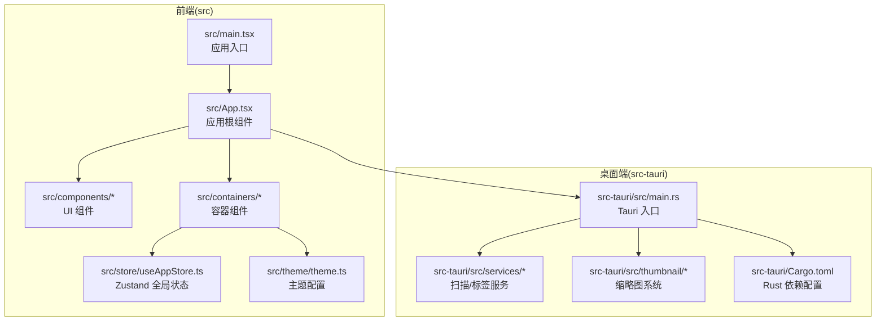
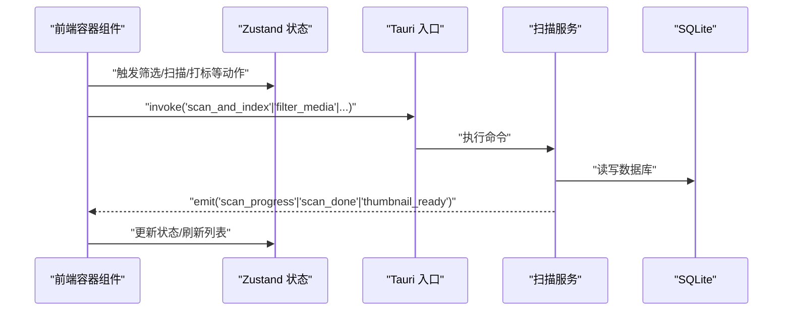
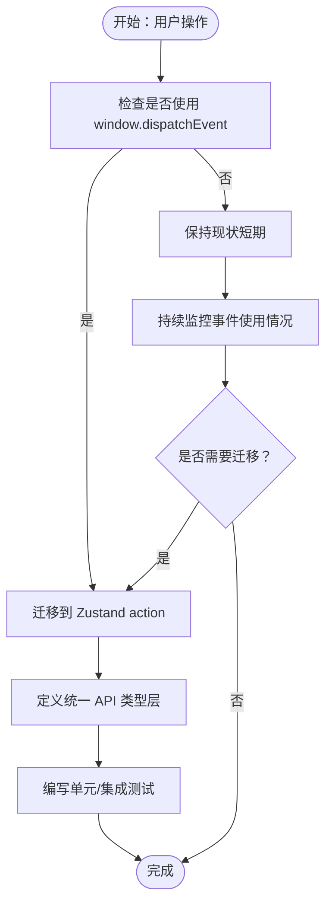
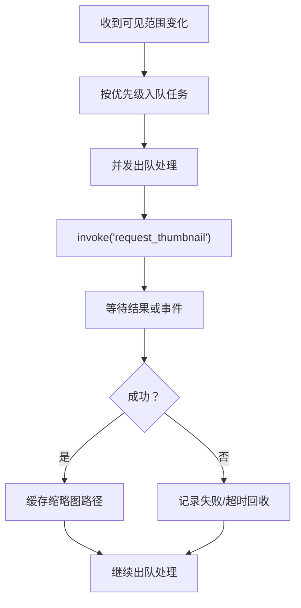
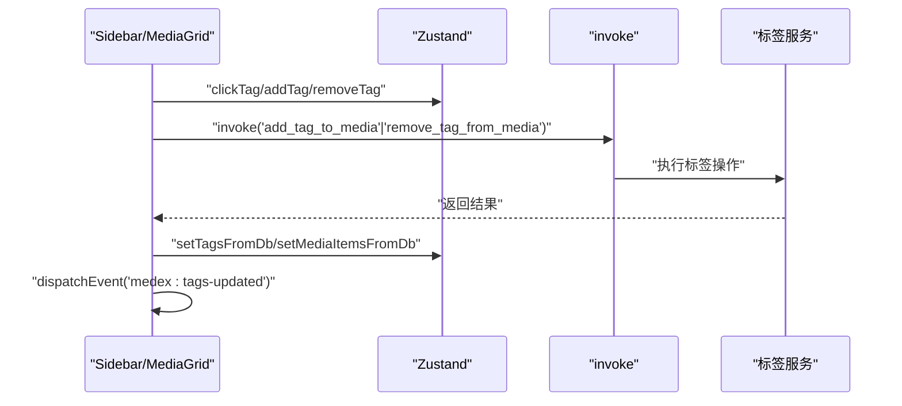
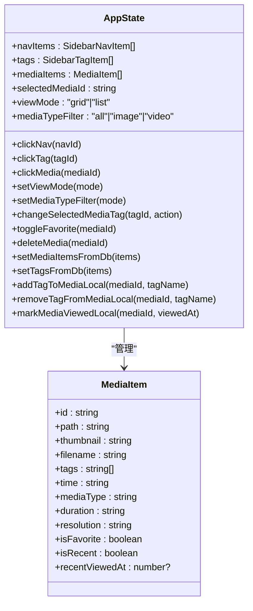
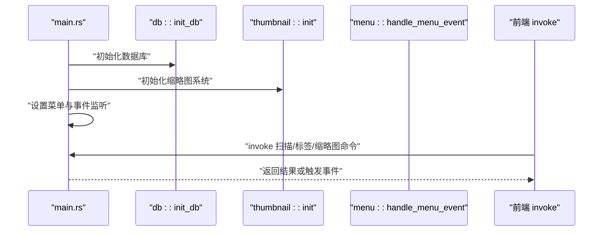
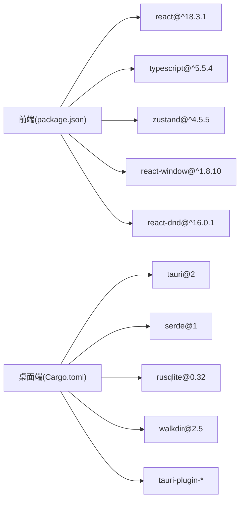

# 代码维护

<cite>
**本文引用的文件**
- [README.md](file://README.md)
- [DEVELOPMENT.md](file://DEVELOPMENT.md)
- [package.json](file://package.json)
- [src-tauri/Cargo.toml](file://src-tauri/Cargo.toml)
- [src/main.tsx](file://src/main.tsx)
- [src/App.tsx](file://src/App.tsx)
- [src/store/useAppStore.ts](file://src/store/useAppStore.ts)
- [src-tauri/src/main.rs](file://src-tauri/src/main.rs)
- [src-tauri/src/services/scanner.rs](file://src-tauri/src/services/scanner.rs)
- [src-tauri/src/thumbnail/manager.rs](file://src-tauri/src/thumbnail/manager.rs)
- [src/containers/MediaGridContainer.tsx](file://src/containers/MediaGridContainer.tsx)
- [src/containers/SidebarContainer.tsx](file://src/containers/SidebarContainer.tsx)
- [src/containers/InspectorContainer.tsx](file://src/containers/InspectorContainer.tsx)
- [src/components/Main.tsx](file://src/components/Main.tsx)
- [src/theme/theme.ts](file://src/theme/theme.ts)
- [vite.config.ts](file://vite.config.ts)
- [tailwind.config.ts](file://tailwind.config.ts)
</cite>

## 目录
1. [简介](#简介)
2. [项目结构](#项目结构)
3. [核心组件](#核心组件)
4. [架构总览](#架构总览)
5. [详细组件分析](#详细组件分析)
6. [依赖分析](#依赖分析)
7. [性能考量](#性能考量)
8. [故障排查指南](#故障排查指南)
9. [结论](#结论)
10. [附录](#附录)

## 简介
本文件面向 Medex 项目的长期维护与架构演进，聚焦于以下目标：
- 代码重构策略：模块拆分、接口设计优化、代码结构改进
- 依赖更新最佳实践：前端依赖升级、Rust crate 更新、版本兼容性处理
- 代码质量保证：单元测试、集成测试、代码审查流程
- 架构演进方向与优先级：从 window.dispatchEvent 迁移到 Zustand action、引入统一 API 类型层等现代化改造
- 代码文档化标准与注释规范：提升团队协作效率
- 迁移指南与向后兼容性：为长期维护奠定基础

## 项目结构
Medex 采用“前端 React + TypeScript + Zustand + TailwindCSS + Tauri V2 + Rust + SQLite”的技术栈，分为 src 与 src-tauri 两大子工程，分别承载前端界面与桌面端后端逻辑。

**图表来源**
- [src/main.tsx:1-44](file://src/main.tsx#L1-L44)
- [src/App.tsx:1-73](file://src/App.tsx#L1-L73)
- [src/store/useAppStore.ts:1-395](file://src/store/useAppStore.ts#L1-L395)
- [src-tauri/src/main.rs:1-69](file://src-tauri/src/main.rs#L1-L69)

**章节来源**
- [README.md:97-119](file://README.md#L97-L119)
- [DEVELOPMENT.md:51-116](file://DEVELOPMENT.md#L51-L116)

## 核心组件
- 前端入口与路由：根据 URL 路径决定渲染 Settings、Update 或 App 页面，统一注入主题上下文。
- 应用根组件：负责媒体列表、导航筛选、Viewer 打开/关闭、与后端交互。
- 全局状态：Zustand store 提供导航、标签、媒体列表、视图模式、筛选条件等状态与动作。
- 容器组件：封装与后端的 invoke 交互、事件监听、缩略图调度、批量操作等。
- 桌面端入口：注册命令、初始化数据库与缩略图系统、设置菜单与事件监听。
- 服务模块：扫描目录、过滤媒体、标签管理、最近查看记录等。
- 缩略图系统：队列、工作线程、缓存与事件通知。

**章节来源**
- [src/main.tsx:9-44](file://src/main.tsx#L9-L44)
- [src/App.tsx:8-73](file://src/App.tsx#L8-L73)
- [src/store/useAppStore.ts:48-394](file://src/store/useAppStore.ts#L48-L394)
- [src-tauri/src/main.rs:10-68](file://src-tauri/src/main.rs#L10-L68)
- [src-tauri/src/services/scanner.rs:160-341](file://src-tauri/src/services/scanner.rs#L160-L341)
- [src-tauri/src/thumbnail/manager.rs:16-108](file://src-tauri/src/thumbnail/manager.rs#L16-L108)

## 架构总览
Medex 采用“前端 UI + Zustand 状态 + Tauri invoke + Rust 后端 + SQLite 数据库”的分层架构。前端通过 invoke 调用后端命令，后端通过事件推送进度与结果；同时前端内部使用 window.dispatchEvent 做轻量刷新信号，未来建议迁移到 Zustand action。

**图表来源**
- [src-tauri/src/main.rs:49-65](file://src-tauri/src/main.rs#L49-L65)
- [src-tauri/src/services/scanner.rs:250-341](file://src-tauri/src/services/scanner.rs#L250-L341)
- [src/containers/MediaGridContainer.tsx:453-486](file://src/containers/MediaGridContainer.tsx#L453-L486)

## 详细组件分析

### 状态与事件总线现状与迁移建议
- 现状：前端多处使用 window.dispatchEvent 触发“medex:media-updated”、“medex:tags-updated”等事件，用于跨容器同步。
- 风险：事件分散、命名不统一、缺乏契约约束，易造成维护成本上升。
- 建议：
  - 将事件迁移为显式的 store action，集中编排状态变更。
  - 对外暴露统一的 API 类型层（例如 src/api/types.ts + client.ts），减少 invoke 字符串分散。
  - 为关键事件增加类型定义与校验，确保前后端契约清晰。

**图表来源**
- [src/App.tsx:35-42](file://src/App.tsx#L35-L42)
- [src/containers/SidebarContainer.tsx:28-33](file://src/containers/SidebarContainer.tsx#L28-L33)
- [src/containers/MediaGridContainer.tsx:145-175](file://src/containers/MediaGridContainer.tsx#L145-L175)

**章节来源**
- [DEVELOPMENT.md:486-492](file://DEVELOPMENT.md#L486-L492)
- [DEVELOPMENT.md:597-604](file://DEVELOPMENT.md#L597-L604)

### 媒体网格与缩略图调度
- 虚拟化渲染：使用 react-window 控制可见区域，显著降低 DOM 数量。
- 缩略图优先级：可见区域优先级最高，其次下一屏，最后 overscan；并发限制与队列上限控制资源占用。
- 事件驱动：后端生成缩略图后通过事件推送，前端更新缓存并继续出队。

**图表来源**
- [src/containers/MediaGridContainer.tsx:390-451](file://src/containers/MediaGridContainer.tsx#L390-L451)
- [src-tauri/src/thumbnail/manager.rs:51-107](file://src-tauri/src/thumbnail/manager.rs#L51-L107)

**章节来源**
- [src/containers/MediaGridContainer.tsx:30-619](file://src/containers/MediaGridContainer.tsx#L30-L619)
- [src-tauri/src/thumbnail/manager.rs:16-108](file://src-tauri/src/thumbnail/manager.rs#L16-L108)

### 标签系统与筛选
- 标签筛选：多标签交集筛选，媒体类型可选过滤。
- 标签管理：新增/删除标签、为媒体添加/移除标签，标签计数与本地状态同步。
- 事件同步：标签变更后通过事件触发全局刷新。

**图表来源**
- [src/containers/SidebarContainer.tsx:35-63](file://src/containers/SidebarContainer.tsx#L35-L63)
- [src/containers/MediaGridContainer.tsx:145-175](file://src/containers/MediaGridContainer.tsx#L145-L175)
- [src-tauri/src/services/scanner.rs:165-247](file://src-tauri/src/services/scanner.rs#L165-L247)

**章节来源**
- [src/containers/SidebarContainer.tsx:1-79](file://src/containers/SidebarContainer.tsx#L1-L79)
- [src/containers/MediaGridContainer.tsx:210-235](file://src/containers/MediaGridContainer.tsx#L210-L235)
- [src-tauri/src/services/scanner.rs:165-247](file://src-tauri/src/services/scanner.rs#L165-L247)

### 全局状态与模型
- 状态模型：包含导航项、标签项、媒体项、视图模式、媒体类型过滤等。
- 动作方法：点击导航/标签、点击媒体、切换视图模式、切换媒体类型、添加/移除标签、收藏/删除媒体、从数据库设置媒体/标签、标记媒体已查看等。
- 本地与数据库同步：通过 setMediaItemsFromDb 与 setTagsFromDb 合并历史状态，保证一致性。

**图表来源**
- [src/store/useAppStore.ts:48-394](file://src/store/useAppStore.ts#L48-L394)

**章节来源**
- [src/store/useAppStore.ts:1-395](file://src/store/useAppStore.ts#L1-L395)

### 桌面端入口与命令注册
- 入口初始化：注册插件、数据库与缩略图初始化、菜单设置、事件监听。
- 命令注册：扫描、过滤、标签、缩略图等命令暴露给前端调用。

**图表来源**
- [src-tauri/src/main.rs:10-68](file://src-tauri/src/main.rs#L10-L68)

**章节来源**
- [src-tauri/src/main.rs:1-69](file://src-tauri/src/main.rs#L1-L69)

## 依赖分析
- 前端依赖：React、TypeScript、Vite、TailwindCSS、Zustand、react-window、react-dnd 等。
- 桌面端依赖：Tauri、Serde、rusqlite、walkdir、once_cell、anyhow、tauri-plugin-* 等。
- 版本与兼容性：前端使用 React 18.3、TypeScript 5.5、Vite 5.4；桌面端使用 Rust 1.77.2+、Tauri 2。

**图表来源**
- [package.json:12-34](file://package.json#L12-L34)
- [src-tauri/Cargo.toml:13-23](file://src-tauri/Cargo.toml#L13-L23)

**章节来源**
- [README.md:35-47](file://README.md#L35-L47)
- [package.json:1-36](file://package.json#L1-L36)
- [src-tauri/Cargo.toml:1-23](file://src-tauri/Cargo.toml#L1-L23)

## 性能考量
- 虚拟化渲染：react-window 仅渲染可见区域与 overscan，显著降低 DOM 数量。
- 缩略图调度：并发限制与队列上限控制资源占用；优先级策略保证视觉流畅。
- 数据库事务：批量插入与事务提交提升写入性能。
- 事件与刷新：尽量使用显式状态更新替代频繁的 window.dispatchEvent，减少全局广播。

**章节来源**
- [src/containers/MediaGridContainer.tsx:30-619](file://src/containers/MediaGridContainer.tsx#L30-L619)
- [src-tauri/src/services/scanner.rs:90-115](file://src-tauri/src/services/scanner.rs#L90-L115)
- [DEVELOPMENT.md:306-342](file://DEVELOPMENT.md#L306-L342)

## 故障排查指南
- dialog.open 权限：检查 capabilities/default.json 是否包含允许的 dialog 权限。
- 本地文件预览：必须使用 convertFileSrc 转换路径，避免 unsupported URL。
- ffmpeg 未找到：检查系统 PATH 或内置二进制；若缺失，缩略图请求会失败。
- 页面卡顿：排查是否在网格内挂载过多视频、是否启用虚拟化、并发是否过高。
- 事件同步问题：逐步将 window.dispatchEvent 迁移到 Zustand action，统一事件契约。

**章节来源**
- [DEVELOPMENT.md:564-596](file://DEVELOPMENT.md#L564-L596)
- [src-tauri/src/thumbnail/manager.rs:51-60](file://src-tauri/src/thumbnail/manager.rs#L51-L60)

## 结论
Medex 已具备清晰的分层架构与良好的性能基线。建议优先完成以下演进：
- 引入统一 API 类型层与显式 store action，替代 window.dispatchEvent。
- 拆分后端服务模块，降低单文件复杂度。
- 增强测试覆盖与日志分级，提升可观测性。
- 完善媒体删除与错误提示组件，补齐核心功能闭环。

## 附录

### 代码重构策略
- 模块拆分
  - 将 scanner.rs 拆分为 media_query.rs、scan.rs、recent.rs，降低文件复杂度。
  - 将标签相关命令与逻辑收敛至独立模块，便于扩展与测试。
- 接口设计优化
  - 为 invoke 命令定义统一的类型层（src/api/types.ts + client.ts），减少字符串分散。
  - 为 store action 增加类型约束与校验，确保调用方契约清晰。
- 代码结构改进
  - 将事件驱动的轻量刷新迁移为显式 action，集中编排状态变更。
  - 为关键流程（扫描、筛选、缩略图）增加单元测试与集成测试。

**章节来源**
- [DEVELOPMENT.md:597-604](file://DEVELOPMENT.md#L597-L604)

### 依赖更新最佳实践
- 前端依赖升级
  - 使用 package.json 管理依赖版本，升级前先运行构建与测试，确保兼容性。
  - 重点关注 React、TypeScript、Vite、TailwindCSS 的兼容性矩阵。
- Rust crate 更新
  - 使用 Cargo.toml 管理版本，升级前运行 cargo check 与测试，关注 breaking changes。
  - 对 Tauri 2 插件与 rusqlite 等关键 crate，优先采用语义化版本。
- 版本兼容性处理
  - 前端与桌面端版本号保持一致或明确映射关系，避免运行时冲突。
  - 对外部依赖（如 ffmpeg）提供回退策略与错误提示。

**章节来源**
- [package.json:12-34](file://package.json#L12-L34)
- [src-tauri/Cargo.toml:13-23](file://src-tauri/Cargo.toml#L13-L23)

### 代码质量保证措施
- 单元测试
  - 为 store action（尤其是标签计数与本地同步逻辑）编写单元测试。
  - 为缩略图调度与事件处理编写模拟测试，覆盖边界场景。
- 集成测试
  - 覆盖端到端流程：扫描导入、标签筛选、缩略图生成、最近查看。
- 代码审查流程
  - 引入 PR 模plate，强制包含变更说明、测试覆盖与风险评估。
  - 对涉及 invoke 命令与数据库操作的变更，要求双人审查。

**章节来源**
- [DEVELOPMENT.md:597-604](file://DEVELOPMENT.md#L597-L604)

### 架构演进方向与优先级
- P0（建议先做）
  - 完成 ffmpeg 内置打包链路，确保跨平台可用。
  - 增加缩略图任务超时与失败重试策略。
  - 补齐媒体删除后端命令（含 DB 清理）。
  - 增加统一错误提示组件（替换 window.alert）。
- P1
  - 复用 Inspector（可折叠右栏）。
  - 搜索功能（按文件名/标签模糊搜索）。
  - 批量选择与批量打标签/收藏。
  - 初步分页加载或增量拉取策略。
- P2
  - 后台扫描任务可取消。
  - 缩略图优先级升级（按视口位置/交互行为动态提权）。
  - 数据迁移框架（schema version + migration）。
  - 增加 E2E 自动化（扫描、筛选、打标、viewer）。

**章节来源**
- [DEVELOPMENT.md:503-525](file://DEVELOPMENT.md#L503-L525)

### 代码文档化标准与注释规范
- 文件头部注释：简述模块职责与关键数据结构。
- 函数注释：说明输入参数、返回值、副作用与异常处理。
- 类型注释：为复杂类型提供注释，便于 IDE 与读者理解。
- 架构注释：在关键流程（扫描、筛选、缩略图）添加注释说明。

**章节来源**
- [DEVELOPMENT.md:528-562](file://DEVELOPMENT.md#L528-L562)

### 迁移指南与向后兼容性
- 从 window.dispatchEvent 迁移
  - 识别现有事件使用点，逐一替换为显式 store action。
  - 为 action 增加类型定义与校验，确保调用方契约清晰。
- 引入统一 API 类型层
  - 定义 src/api/types.ts 与 client.ts，集中管理 invoke 命令与参数。
  - 逐步替换字符串命令调用，提升可维护性。
- 向后兼容性
  - 对外暴露的命令与类型保持稳定，必要时通过版本号区分。
  - 对破坏性变更提供迁移脚本与降级策略。

**章节来源**
- [DEVELOPMENT.md:486-492](file://DEVELOPMENT.md#L486-L492)
- [DEVELOPMENT.md:597-604](file://DEVELOPMENT.md#L597-L604)