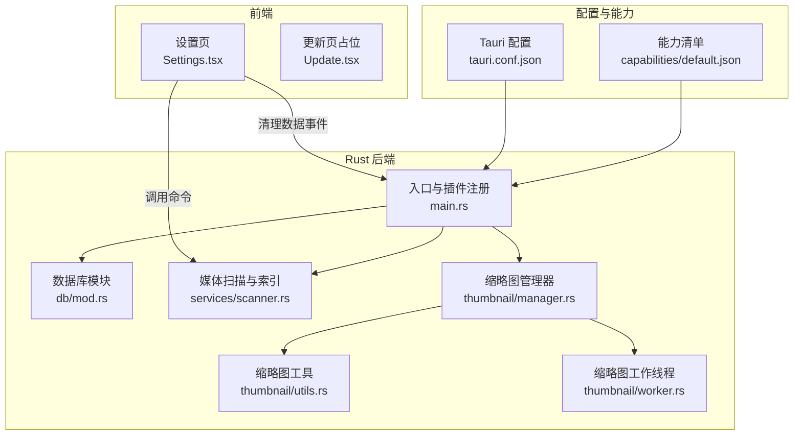
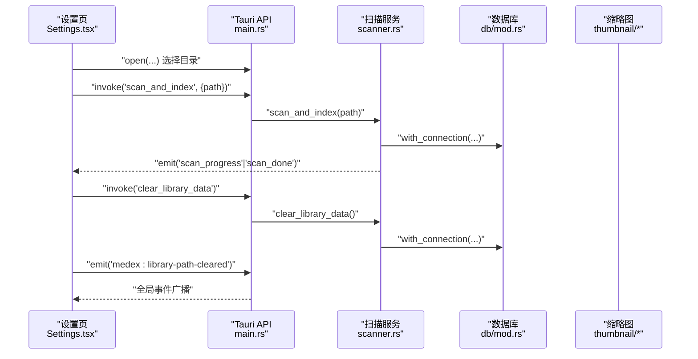
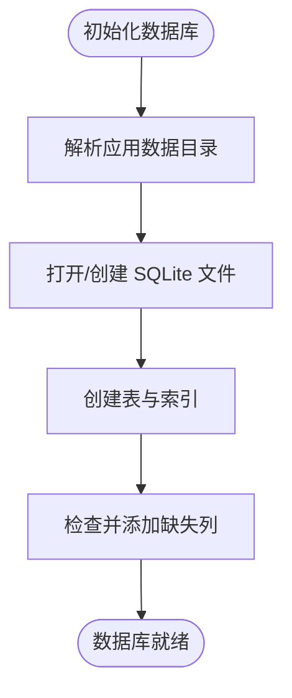
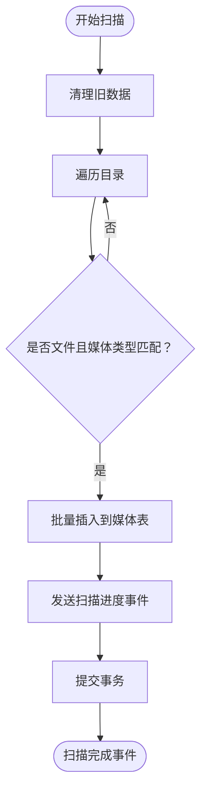
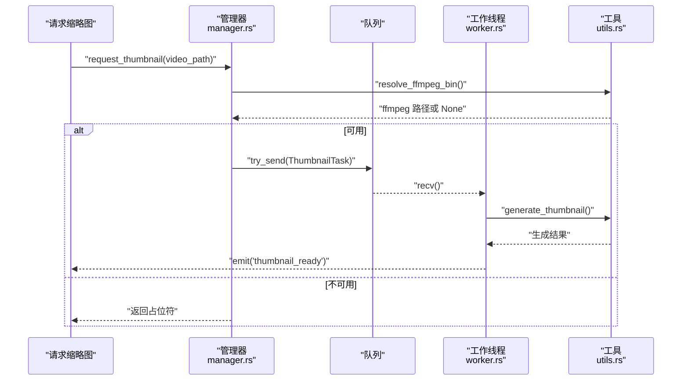

# 安全更新

<cite>
**本文引用的文件**
- [src-tauri/Cargo.toml](file://src-tauri/Cargo.toml)
- [src-tauri/tauri.conf.json](file://src-tauri/tauri.conf.json)
- [package.json](file://package.json)
- [src-tauri/capabilities/default.json](file://src-tauri/capabilities/default.json)
- [src-tauri/src/main.rs](file://src-tauri/src/main.rs)
- [src-tauri/src/db/mod.rs](file://src-tauri/src/db/mod.rs)
- [src-tauri/src/services/scanner.rs](file://src-tauri/src/services/scanner.rs)
- [src-tauri/src/thumbnail/manager.rs](file://src-tauri/src/thumbnail/manager.rs)
- [src-tauri/src/thumbnail/utils.rs](file://src-tauri/src/thumbnail/utils.rs)
- [src-tauri/src/thumbnail/worker.rs](file://src-tauri/src/thumbnail/worker.rs)
- [src/pages/Settings.tsx](file://src/pages/Settings.tsx)
- [src/pages/Update.tsx](file://src/pages/Update.tsx)
- [src-tauri/Cargo.lock](file://src-tauri/Cargo.lock)
- [src-tauri/build.rs](file://src-tauri/build.rs)
</cite>

## 目录
1. [简介](#简介)
2. [项目结构](#项目结构)
3. [核心组件](#核心组件)
4. [架构总览](#架构总览)
5. [详细组件分析](#详细组件分析)
6. [依赖与供应链安全](#依赖与供应链安全)
7. [Tauri 安全配置](#tauri-安全配置)
8. [数据安全与隐私保护](#数据安全与隐私保护)
9. [安全更新操作指南](#安全更新操作指南)
10. [安全事件响应预案](#安全事件响应预案)
11. [安全测试与渗透测试建议](#安全测试与渗透测试建议)
12. [故障排查](#故障排查)
13. [结论](#结论)

## 简介
本指南面向 Medex 桌面应用的安全更新与维护，聚焦以下目标：
- 建立安全漏洞识别与修复流程：覆盖依赖漏洞扫描、代码安全审计、配置安全检查。
- 提供定期安全更新操作指南：前端依赖安全补丁、Rust crate 升级、系统库更新。
- 解释 Tauri 应用安全配置：权限管理、资源访问控制、插件与能力声明。
- 阐述数据安全保护：数据库存储、敏感信息处理、缓存与临时文件管理。
- 制定安全事件响应预案：漏洞报告流程、紧急修复、用户通知机制。
- 给出安全测试与渗透测试建议，保障生产环境安全。

## 项目结构
Medex 采用 Tauri v2 + React 前后端分离架构，Rust 在 src-tauri 中实现核心服务与系统交互，前端位于 src。关键安全相关位置如下：
- Rust 核心：数据库初始化、媒体扫描与索引、缩略图生成与队列、菜单与事件。
- 前端设置页：媒体库路径选择、扫描触发、清理数据、主题与语言设置。
- 配置与能力：Tauri 配置、能力清单、插件启用与签名验证。
- 依赖清单：前端 npm 与 Rust Cargo 依赖。

图表来源
- [src/pages/Settings.tsx:1-272](file://src/pages/Settings.tsx#L1-L272)
- [src-tauri/src/main.rs:1-69](file://src-tauri/src/main.rs#L1-L69)
- [src-tauri/src/db/mod.rs:1-123](file://src-tauri/src/db/mod.rs#L1-L123)
- [src-tauri/src/services/scanner.rs:1-525](file://src-tauri/src/services/scanner.rs#L1-L525)
- [src-tauri/src/thumbnail/manager.rs:1-108](file://src-tauri/src/thumbnail/manager.rs#L1-L108)
- [src-tauri/src/thumbnail/utils.rs:1-158](file://src-tauri/src/thumbnail/utils.rs#L1-L158)
- [src-tauri/src/thumbnail/worker.rs:1-96](file://src-tauri/src/thumbnail/worker.rs#L1-L96)
- [src-tauri/tauri.conf.json:1-46](file://src-tauri/tauri.conf.json#L1-L46)
- [src-tauri/capabilities/default.json:1-15](file://src-tauri/capabilities/default.json#L1-L15)

章节来源
- [src-tauri/src/main.rs:1-69](file://src-tauri/src/main.rs#L1-L69)
- [src-tauri/tauri.conf.json:1-46](file://src-tauri/tauri.conf.json#L1-L46)
- [src-tauri/capabilities/default.json:1-15](file://src-tauri/capabilities/default.json#L1-L15)
- [package.json:1-36](file://package.json#L1-L36)

## 核心组件
- 应用入口与插件注册：初始化数据库、缩略图系统、菜单与事件监听；注册对话框与更新插件。
- 数据库模块：SQLite 初始化、表结构与索引、连接池封装、路径解析。
- 媒体扫描与索引：目录遍历、类型识别、批量插入、进度与完成事件、最近观看记录。
- 缩略图子系统：任务队列、工作线程、缓存目录、FFmpeg 可执行文件解析与生成。
- 设置页：媒体库路径选择、扫描触发、清理数据、主题与语言设置。

章节来源
- [src-tauri/src/main.rs:10-68](file://src-tauri/src/main.rs#L10-L68)
- [src-tauri/src/db/mod.rs:45-122](file://src-tauri/src/db/mod.rs#L45-L122)
- [src-tauri/src/services/scanner.rs:54-341](file://src-tauri/src/services/scanner.rs#L54-L341)
- [src-tauri/src/thumbnail/manager.rs:24-107](file://src-tauri/src/thumbnail/manager.rs#L24-L107)
- [src/pages/Settings.tsx:23-70](file://src/pages/Settings.tsx#L23-L70)

## 架构总览
下图展示前端与 Rust 后端之间的调用关系与安全边界：

图表来源
- [src/pages/Settings.tsx:23-70](file://src/pages/Settings.tsx#L23-L70)
- [src-tauri/src/main.rs:49-65](file://src-tauri/src/main.rs#L49-L65)
- [src-tauri/src/services/scanner.rs:250-341](file://src-tauri/src/services/scanner.rs#L250-L341)
- [src-tauri/src/db/mod.rs:97-110](file://src-tauri/src/db/mod.rs#L97-L110)

## 详细组件分析

### 数据库与文件系统安全
- 数据库初始化与路径解析：通过应用数据目录创建数据库文件，避免写入受限或不安全路径。
- 连接封装与并发：使用互斥锁保护连接，防止并发写入冲突；事务用于批量插入与清理。
- 表结构与索引：为路径与标签关联建立索引，提升查询性能，减少不必要的全表扫描。
- 清理策略：支持清空媒体、标签与最近观看记录，重置自增序列，避免残留数据影响后续扫描。

图表来源
- [src-tauri/src/db/mod.rs:45-95](file://src-tauri/src/db/mod.rs#L45-L95)

章节来源
- [src-tauri/src/db/mod.rs:45-122](file://src-tauri/src/db/mod.rs#L45-L122)

### 媒体扫描与索引安全
- 目录遍历：使用受控遍历深度与链接跟随策略，跳过非文件项与不受支持扩展名。
- 类型识别：基于扩展名判断媒体类型，避免误判与异常处理。
- 批量插入：使用事务保证原子性，失败回滚，降低部分写入风险。
- 进度与完成事件：通过事件系统通知前端，避免阻塞主线程。
- 最近观看记录：限制条目数量，防止无限增长导致资源占用。

图表来源
- [src-tauri/src/services/scanner.rs:250-341](file://src-tauri/src/services/scanner.rs#L250-L341)

章节来源
- [src-tauri/src/services/scanner.rs:54-341](file://src-tauri/src/services/scanner.rs#L54-L341)

### 缩略图生成与 FFmpeg 集成
- 任务队列：异步任务入队，满队列时返回占位符，避免阻塞。
- 工作线程：多线程消费队列，生成缩略图并发出完成事件。
- 缓存目录：位于应用数据目录下的独立子目录，便于清理与权限控制。
- FFmpeg 解析：优先资源内嵌二进制，其次开发目录，再回退系统 PATH，最后尝试常见 Homebrew 路径；若不可用则禁用视频缩略图生成功能。

图表来源
- [src-tauri/src/thumbnail/manager.rs:51-107](file://src-tauri/src/thumbnail/manager.rs#L51-L107)
- [src-tauri/src/thumbnail/worker.rs:52-96](file://src-tauri/src/thumbnail/worker.rs#L52-L96)
- [src-tauri/src/thumbnail/utils.rs:71-96](file://src-tauri/src/thumbnail/utils.rs#L71-L96)

章节来源
- [src-tauri/src/thumbnail/manager.rs:24-107](file://src-tauri/src/thumbnail/manager.rs#L24-L107)
- [src-tauri/src/thumbnail/worker.rs:13-96](file://src-tauri/src/thumbnail/worker.rs#L13-L96)
- [src-tauri/src/thumbnail/utils.rs:36-96](file://src-tauri/src/thumbnail/utils.rs#L36-L96)

### 设置页与用户交互安全
- 媒体库路径选择：通过对话框插件选择目录，仅本地路径，避免远程路径注入。
- 扫描触发：调用后端命令进行扫描，扫描期间禁用按钮，避免重复触发。
- 清理数据：调用后端命令清空数据库并广播全局事件，前端刷新界面。
- 主题与语言：本地状态存储于前端，不涉及敏感数据。

章节来源
- [src/pages/Settings.tsx:23-70](file://src/pages/Settings.tsx#L23-L70)

## 依赖与供应链安全
- 前端依赖：React 生态、Tauri 插件、构建工具链等。建议使用锁定文件与依赖扫描工具定期检查已知漏洞。
- Rust 依赖：Tauri v2、serde、rusqlite、walkdir、anyhow、once_cell 等。建议使用 Cargo audit 或类似工具定期审计。
- 锁定文件：Cargo.lock 记录具体版本与校验和，确保可复现构建与供应链一致性。

章节来源
- [package.json:12-34](file://package.json#L12-L34)
- [src-tauri/Cargo.toml:13-22](file://src-tauri/Cargo.toml#L13-L22)
- [src-tauri/Cargo.lock:1-200](file://src-tauri/Cargo.lock#L1-L200)

## Tauri 安全配置
- 资源协议与作用域：启用 asset 协议并允许所有路径，需结合实际需求收紧作用域以降低任意文件读取风险。
- 插件与能力：默认能力包含对话框与更新插件；更新插件启用公钥验证，提升更新包可信度。
- 更新通道：GitHub Releases 端点与公钥配置，建议定期轮换密钥与发布渠道。
- 权限最小化：能力清单仅授予必要权限，避免过度授权。

章节来源
- [src-tauri/tauri.conf.json:21-44](file://src-tauri/tauri.conf.json#L21-L44)
- [src-tauri/capabilities/default.json:6-13](file://src-tauri/capabilities/default.json#L6-L13)
- [src-tauri/src/main.rs:12-13](file://src-tauri/src/main.rs#L12-L13)

## 数据安全与隐私保护
- 数据库存储：数据库文件位于应用数据目录，避免暴露在可写受限的系统位置；建议在打包时考虑加密存储或系统级加密。
- 缓存与临时文件：缩略图缓存位于应用数据目录子路径，随应用卸载清理；注意清理策略与磁盘空间管理。
- 敏感信息处理：当前代码未见明文存储敏感凭据；若引入网络功能，应避免在日志中输出敏感字段。
- 备份安全：建议对应用数据目录进行加密备份，并限制备份文件的访问权限。

章节来源
- [src-tauri/src/db/mod.rs:112-122](file://src-tauri/src/db/mod.rs#L112-L122)
- [src-tauri/src/thumbnail/utils.rs:20-29](file://src-tauri/src/thumbnail/utils.rs#L20-L29)

## 安全更新操作指南
- 前端依赖安全补丁
  - 步骤：更新 package.json 的依赖版本，运行安装并生成新的锁定文件；运行依赖扫描工具检查已知漏洞；构建并测试。
  - 关注：React、@tauri-apps 插件、构建工具链等。
- Rust crate 安全升级
  - 步骤：更新 Cargo.toml 版本约束；运行 cargo update；执行 cargo audit 并修复高危问题；运行测试与集成测试。
  - 关注：tauri、tauri-plugin-dialog、tauri-plugin-updater、rusqlite、walkdir、anyhow 等。
- 系统库更新
  - 步骤：在 CI 中使用最新基础镜像；更新 FFmpeg 二进制（如需要）；验证缩略图功能；重新打包。
  - 关注：FFmpeg 可执行文件解析逻辑与资源打包。
- 配置与能力更新
  - 步骤：调整 tauri.conf.json 与 capabilities/default.json；收紧资源作用域；重新签名与发布。
- 发布与验证
  - 步骤：启用更新插件的公钥验证；在预发布环境验证更新流程；监控错误日志与崩溃报告。

章节来源
- [package.json:12-34](file://package.json#L12-L34)
- [src-tauri/Cargo.toml:13-22](file://src-tauri/Cargo.toml#L13-L22)
- [src-tauri/tauri.conf.json:36-44](file://src-tauri/tauri.conf.json#L36-L44)
- [src-tauri/capabilities/default.json:6-13](file://src-tauri/capabilities/default.json#L6-L13)

## 安全事件响应预案
- 漏洞报告流程
  - 内部：记录漏洞类型、影响范围、复现步骤、日志片段；评估风险等级并制定修复计划。
  - 外部：遵循负责任披露原则，向相关生态（npm、crates.io、Tauri 社区）报告。
- 紧急修复程序
  - 快速定位受影响组件（前端依赖或 Rust crate）；准备热修复版本；在 CI 中自动化测试与签名。
- 用户通知机制
  - 通过更新插件推送安全公告；在应用内弹窗提示重要更新；提供更新日志与修复摘要。
- 回滚策略
  - 保留上一个稳定版本的发布包与签名；在更新失败时自动回滚至前一版本。

章节来源
- [src-tauri/tauri.conf.json:36-44](file://src-tauri/tauri.conf.json#L36-L44)
- [src/pages/Settings.tsx:23-70](file://src/pages/Settings.tsx#L23-L70)

## 安全测试与渗透测试建议
- 依赖漏洞扫描
  - 前端：使用 npm audit 或类似工具；结合 SCA 工具持续监控。
  - Rust：使用 cargo audit；关注 crates.io 的安全通告。
- 代码安全审计
  - 关键路径：数据库写入、文件系统访问、外部进程调用（FFmpeg）、事件广播。
  - 静态分析：启用 clippy 警告与安全规则；对 unsafe 代码进行专项审查。
- 配置安全检查
  - 资源作用域：收紧 asset 协议作用域；禁用不必要的协议与权限。
  - 插件与能力：最小权限原则；定期审查能力清单变更。
- 渗透测试建议
  - 文件系统：尝试目录穿越、越权读取、写入受限路径；验证数据库文件与缓存目录权限。
  - 进程与外部工具：验证 FFmpeg 调用参数注入、路径解析边界；确认资源内嵌与系统 PATH 的优先级。
  - 更新通道：模拟恶意更新包、公钥伪造、中间人攻击；验证签名验证与更新失败回滚。
- 自动化与持续集成
  - 将依赖扫描、静态分析、单元测试与集成测试纳入 CI；对安全测试结果进行告警与阻断。

章节来源
- [src-tauri/src/services/scanner.rs:54-88](file://src-tauri/src/services/scanner.rs#L54-L88)
- [src-tauri/src/thumbnail/utils.rs:71-96](file://src-tauri/src/thumbnail/utils.rs#L71-L96)
- [src-tauri/tauri.conf.json:21-44](file://src-tauri/tauri.conf.json#L21-L44)

## 故障排查
- 数据库初始化失败
  - 检查应用数据目录权限与磁盘空间；确认 SQLite 文件未被其他进程占用。
- 扫描无结果或卡住
  - 检查媒体库路径是否存在与可读；查看扫描进度事件是否正常触发；确认事务是否提交。
- 缩略图生成失败
  - 检查 FFmpeg 是否可用与可执行权限；确认缓存目录存在且可写；查看工作线程日志。
- 更新插件异常
  - 检查更新端点可达性与公钥配置；查看签名验证日志；确认网络代理与防火墙设置。

章节来源
- [src-tauri/src/db/mod.rs:45-64](file://src-tauri/src/db/mod.rs#L45-L64)
- [src-tauri/src/services/scanner.rs:250-341](file://src-tauri/src/services/scanner.rs#L250-L341)
- [src-tauri/src/thumbnail/utils.rs:71-96](file://src-tauri/src/thumbnail/utils.rs#L71-L96)
- [src-tauri/tauri.conf.json:36-44](file://src-tauri/tauri.conf.json#L36-L44)

## 结论
通过建立完善的依赖审计、代码安全审查与配置安全检查机制，结合最小权限的能力清单与严格的更新通道验证，Medex 可在生产环境中保持较高的安全性。建议将安全测试与渗透测试常态化纳入 CI/CD 流程，并制定清晰的漏洞响应与用户通知机制，确保快速、透明地应对安全事件。