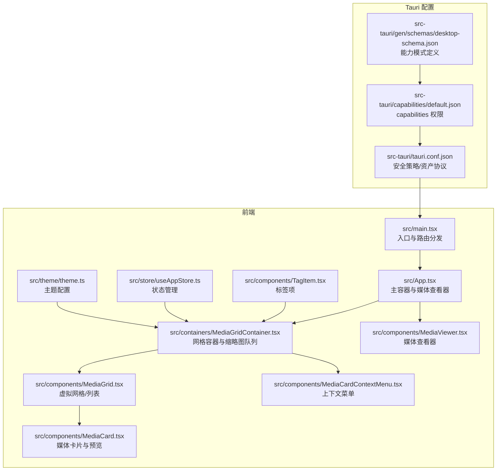
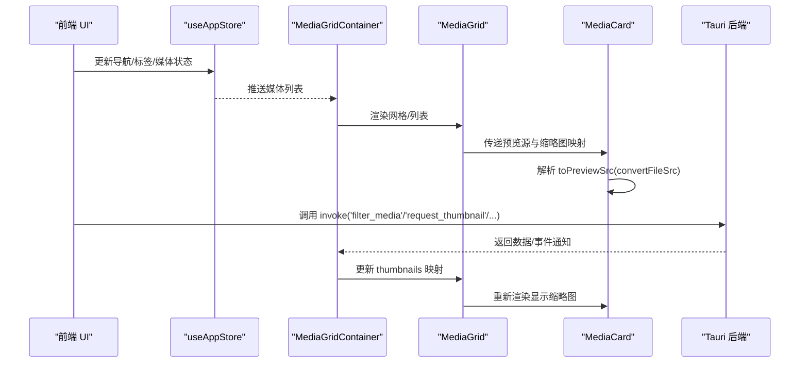
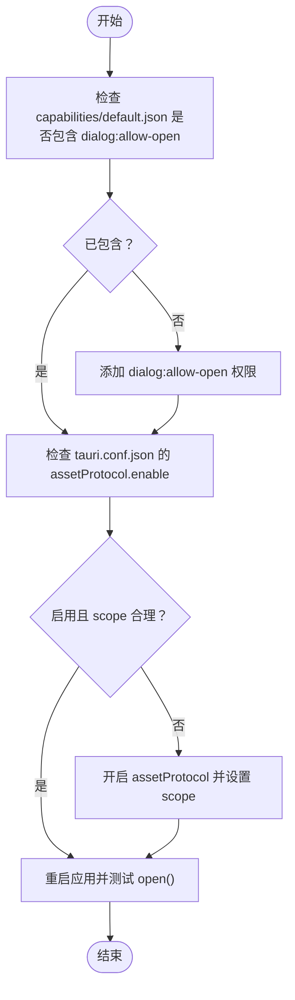
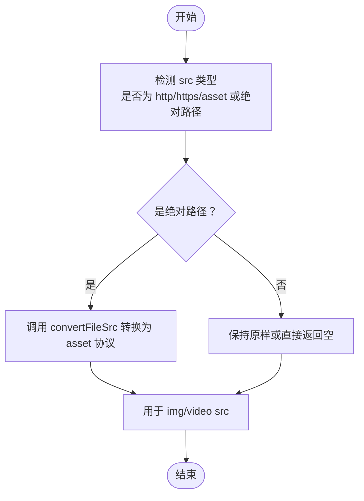
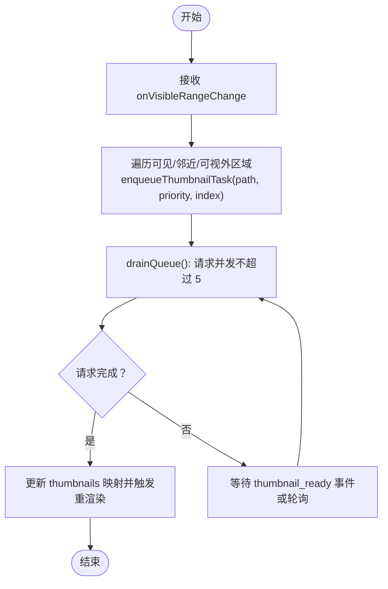
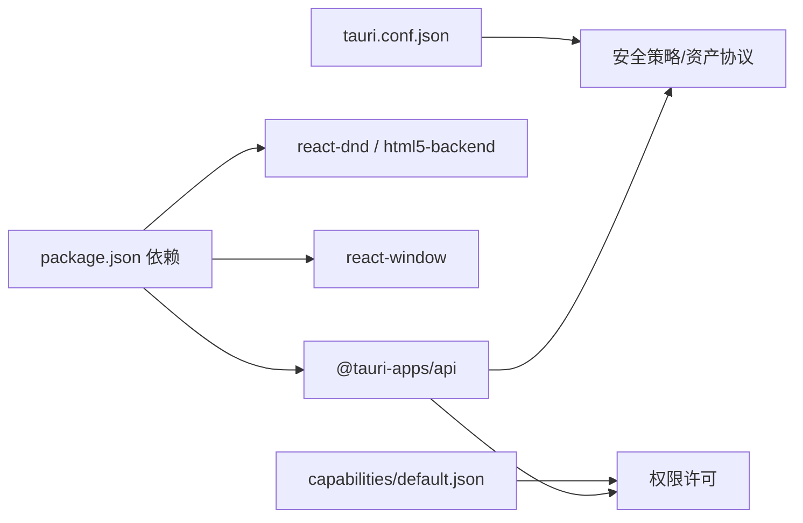

# 前端问题

<cite>
**本文引用的文件**
- [src/main.tsx](file://src/main.tsx)
- [src/App.tsx](file://src/App.tsx)
- [src-tauri/tauri.conf.json](file://src-tauri/tauri.conf.json)
- [src-tauri/capabilities/default.json](file://src-tauri/capabilities/default.json)
- [src-tauri/gen/schemas/desktop-schema.json](file://src-tauri/gen/schemas/desktop-schema.json)
- [src-tauri/gen/schemas/macOS-schema.json](file://src-tauri/gen/schemas/macOS-schema.json)
- [src/components/MediaGrid.tsx](file://src/components/MediaGrid.tsx)
- [src/components/MediaCard.tsx](file://src/components/MediaCard.tsx)
- [src/components/MediaViewer.tsx](file://src/components/MediaViewer.tsx)
- [src/components/MediaCardContextMenu.tsx](file://src/components/MediaCardContextMenu.tsx)
- [src/containers/MediaGridContainer.tsx](file://src/containers/MediaGridContainer.tsx)
- [src/components/TagItem.tsx](file://src/components/TagItem.tsx)
- [package.json](file://package.json)
- [src/theme/theme.ts](file://src/theme/theme.ts)
- [src/store/useAppStore.ts](file://src/store/useAppStore.ts)
</cite>

## 目录
1. [简介](#简介)
2. [项目结构](#项目结构)
3. [核心组件](#核心组件)
4. [架构总览](#架构总览)
5. [详细组件分析](#详细组件分析)
6. [依赖分析](#依赖分析)
7. [性能考虑](#性能考虑)
8. [故障排除指南](#故障排除指南)
9. [结论](#结论)

## 简介
本文件聚焦 Medex 前端常见问题的系统化解决方案，覆盖以下关键领域：
- 对话框权限与 capabilities 配置：针对 dialog.open 权限报错“not allowed”的根因与修复步骤
- 本地文件预览失败：convertFileSrc 使用方法与资源协议配置
- 媒体网格渲染问题：虚拟列表配置、缩略图懒加载失败、视频播放卡顿等性能优化
- 标签拖拽功能异常：react-dnd 配置与事件处理排查思路

目标是帮助前端开发者快速定位并解决界面相关问题。

## 项目结构
Medex 采用 Tauri + React 架构，前端通过 @tauri-apps/api 与后端 Rust 服务通信；资源访问通过 asset 协议与 convertFileSrc 统一转换。

**图表来源**
- [src/main.tsx:1-44](file://src/main.tsx#L1-L44)
- [src/App.tsx:1-73](file://src/App.tsx#L1-L73)
- [src-tauri/tauri.conf.json:1-46](file://src-tauri/tauri.conf.json#L1-L46)
- [src-tauri/capabilities/default.json:1-15](file://src-tauri/capabilities/default.json#L1-L15)
- [src-tauri/gen/schemas/desktop-schema.json:42-86](file://src-tauri/gen/schemas/desktop-schema.json#L42-L86)

**章节来源**
- [src/main.tsx:1-44](file://src/main.tsx#L1-L44)
- [src/App.tsx:1-73](file://src/App.tsx#L1-L73)
- [src-tauri/tauri.conf.json:1-46](file://src-tauri/tauri.conf.json#L1-L46)
- [src-tauri/capabilities/default.json:1-15](file://src-tauri/capabilities/default.json#L1-L15)
- [src-tauri/gen/schemas/desktop-schema.json:42-86](file://src-tauri/gen/schemas/desktop-schema.json#L42-L86)

## 核心组件
- 入口与路由：根据路径选择渲染主应用或设置/更新页
- 主容器：负责媒体列表筛选、查看器开关与媒体标记
- 网格容器：负责过滤、多选、上下文菜单、标签批量操作、缩略图队列与并发控制
- 虚拟网格/列表：基于 react-window 的高性能渲染，支持可视范围回调
- 媒体卡片：统一预览源解析（convertFileSrc），图片/视频懒加载与错误处理
- 媒体查看器：根据类型选择 video/img 渲染
- 上下文菜单：标签增删与批量应用
- 主题与状态：主题颜色与全局状态管理

**章节来源**
- [src/main.tsx:10-41](file://src/main.tsx#L10-L41)
- [src/App.tsx:8-72](file://src/App.tsx#L8-L72)
- [src/containers/MediaGridContainer.tsx:30-618](file://src/containers/MediaGridContainer.tsx#L30-L618)
- [src/components/MediaGrid.tsx:70-212](file://src/components/MediaGrid.tsx#L70-L212)
- [src/components/MediaCard.tsx:34-264](file://src/components/MediaCard.tsx#L34-L264)
- [src/components/MediaViewer.tsx:152-185](file://src/components/MediaViewer.tsx#L152-L185)
- [src/components/MediaCardContextMenu.tsx:23-254](file://src/components/MediaCardContextMenu.tsx#L23-L254)
- [src/theme/theme.ts:1-159](file://src/theme/theme.ts#L1-L159)
- [src/store/useAppStore.ts:145-394](file://src/store/useAppStore.ts#L145-L394)

## 架构总览
前端通过 @tauri-apps/api 与后端通信，资源访问通过 convertFileSrc 将本地绝对路径转换为可访问的 asset 协议 URL；capabilities 控制对话框等敏感权限。

**图表来源**
- [src/store/useAppStore.ts:145-394](file://src/store/useAppStore.ts#L145-L394)
- [src/containers/MediaGridContainer.tsx:210-243](file://src/containers/MediaGridContainer.tsx#L210-L243)
- [src/components/MediaGrid.tsx:312-321](file://src/components/MediaGrid.tsx#L312-L321)
- [src/components/MediaCard.tsx:266-275](file://src/components/MediaCard.tsx#L266-L275)

## 详细组件分析

### 对话框权限与 capabilities 配置（dialog.open not allowed）
- 错误现象
  - 在调用 open({ directory: true }) 时出现“not allowed”提示
- 根因分析
  - Tauri capabilities 中缺少对 dialog:allow-open 的授权
  - 资产协议与安全策略需允许本地资源访问
- 配置修改步骤
  1) 在 capabilities/default.json 中确认已包含 dialog:allow-open 权限
  2) 在 tauri.conf.json 的 app.security.assetProtocol.enable=true，并确保 scope 合理
  3) 如需远程资源访问，可在 capabilities 中配置 remote.urls
- 验证方法
  - 重启应用后，尝试打开目录选择对话框，确认无权限弹窗
  - 在控制台观察是否有权限相关的错误日志

**图表来源**
- [src-tauri/capabilities/default.json:6-13](file://src-tauri/capabilities/default.json#L6-L13)
- [src-tauri/tauri.conf.json:21-27](file://src-tauri/tauri.conf.json#L21-L27)

**章节来源**
- [src-tauri/capabilities/default.json:1-15](file://src-tauri/capabilities/default.json#L1-L15)
- [src-tauri/tauri.conf.json:1-46](file://src-tauri/tauri.conf.json#L1-L46)
- [src-tauri/gen/schemas/desktop-schema.json:42-86](file://src-tauri/gen/schemas/desktop-schema.json#L42-L86)
- [src-tauri/gen/schemas/macOS-schema.json:42-86](file://src-tauri/gen/schemas/macOS-schema.json#L42-L86)

### 本地文件预览失败（convertFileSrc 使用与资源协议）
- 错误现象
  - 图片/视频无法显示，显示“无预览”或占位符
- 根因分析
  - 本地绝对路径未通过 convertFileSrc 转换为可访问的 asset 协议 URL
  - toPreviewSrc 判断逻辑需覆盖 Unix/Windows 绝对路径与 http/https/asset 协议
- 配置修改步骤
  1) 在 MediaGrid 与 MediaCard 的 toPreviewSrc 中确保传入绝对路径会被 convertFileSrc 处理
  2) 确保 tauri.conf.json 的 assetProtocol.enable=true，scope 包含所需资源范围
- 验证方法
  - 在 MediaGridContainer 中打印预览 URL，确认为 asset: 开头
  - 刷新网格，检查缩略图是否正常显示

**图表来源**
- [src/components/MediaGrid.tsx:312-321](file://src/components/MediaGrid.tsx#L312-L321)
- [src/components/MediaCard.tsx:266-275](file://src/components/MediaCard.tsx#L266-L275)
- [src-tauri/tauri.conf.json:21-27](file://src-tauri/tauri.conf.json#L21-L27)

**章节来源**
- [src/components/MediaGrid.tsx:312-321](file://src/components/MediaGrid.tsx#L312-L321)
- [src/components/MediaCard.tsx:266-275](file://src/components/MediaCard.tsx#L266-L275)
- [src-tauri/tauri.conf.json:21-27](file://src-tauri/tauri.conf.json#L21-L27)

### 媒体网格渲染问题（虚拟列表、缩略图懒加载、视频卡顿）
- 错误现象
  - 网格滚动卡顿、缩略图加载慢或空白、视频首帧卡顿
- 根因分析
  - 虚拟列表 overscan 与可见范围回调未充分利用
  - 缩略图请求并发过高或队列溢出
  - 视频首帧加载未做渐进式显示与懒加载
- 优化方案
  1) 调整虚拟列表 overscan：grid 3 行/1 列，list 8 行，提升滚动顺滑度
  2) 缩略图队列：最大并发 5，队列上限 400；按优先级（可见>邻近>可视外）调度
  3) 视频缩略图：懒加载 + 渐隐过渡，避免阻塞主线程
  4) 图片错误兜底：onError 标记失败，避免重复重试
- 验证方法
  - 滚动网格，观察缩略图加载顺序与过渡
  - 打开大量视频，确认不会阻塞 UI
  - 检查控制台日志，确认队列未溢出

**图表来源**
- [src/containers/MediaGridContainer.tsx:417-451](file://src/containers/MediaGridContainer.tsx#L417-L451)
- [src/containers/MediaGridContainer.tsx:352-388](file://src/containers/MediaGridContainer.tsx#L352-L388)
- [src/containers/MediaGridContainer.tsx:453-486](file://src/containers/MediaGridContainer.tsx#L453-L486)
- [src/components/MediaGrid.tsx:170-212](file://src/components/MediaGrid.tsx#L170-L212)
- [src/components/MediaCard.tsx:153-184](file://src/components/MediaCard.tsx#L153-L184)

**章节来源**
- [src/containers/MediaGridContainer.tsx:27-48](file://src/containers/MediaGridContainer.tsx#L27-L48)
- [src/containers/MediaGridContainer.tsx:352-486](file://src/containers/MediaGridContainer.tsx#L352-L486)
- [src/components/MediaGrid.tsx:170-212](file://src/components/MediaGrid.tsx#L170-L212)
- [src/components/MediaCard.tsx:153-184](file://src/components/MediaCard.tsx#L153-L184)

### 标签拖拽功能异常（react-dnd 配置与事件处理）
- 现状说明
  - 项目依赖 react-dnd 与 react-dnd-html5-backend，但当前标签交互主要通过点击与上下文菜单实现，未见 react-dnd 的具体使用
- 排查建议
  1) 若计划引入 react-dnd，请确认：
     - Provider 包裹层级正确（建议在入口或主题 Provider 内）
     - Backend 注册与 DndProvider 版本兼容
     - 拖拽元素与目标容器的类型与收集器配置一致
  2) 事件处理要点：
     - 阻止默认行为与冒泡，避免浏览器默认拖拽干扰
     - 在 onDrop 中进行状态更新与全局事件派发
  3) 若暂时不使用 react-dnd，建议：
     - 保留现有上下文菜单与批量标签操作，确保交互稳定
     - 如需拖拽，可参考上下文菜单的事件处理模式，统一事件流

**章节来源**
- [package.json:17-18](file://package.json#L17-L18)
- [src/components/MediaCardContextMenu.tsx:134-161](file://src/components/MediaCardContextMenu.tsx#L134-L161)
- [src/components/TagItem.tsx:11-69](file://src/components/TagItem.tsx#L11-L69)

## 依赖分析
- 前端依赖
  - @tauri-apps/api：与后端通信、对话框、文件协议转换
  - react-dnd / react-dnd-html5-backend：拖拽支持（如启用）
  - react-window：虚拟列表渲染
- 配置依赖
  - tauri.conf.json：资产协议、安全策略
  - capabilities/default.json：权限白名单

**图表来源**
- [package.json:12-21](file://package.json#L12-L21)
- [src-tauri/tauri.conf.json:21-27](file://src-tauri/tauri.conf.json#L21-L27)
- [src-tauri/capabilities/default.json:6-13](file://src-tauri/capabilities/default.json#L6-L13)

**章节来源**
- [package.json:12-21](file://package.json#L12-L21)
- [src-tauri/tauri.conf.json:21-27](file://src-tauri/tauri.conf.json#L21-L27)
- [src-tauri/capabilities/default.json:6-13](file://src-tauri/capabilities/default.json#L6-L13)

## 性能考虑
- 虚拟渲染
  - 固定尺寸网格/列表，合理设置 overscan，减少重绘
- 缩略图策略
  - 并发限制与优先级队列，避免 UI 阻塞
  - 懒加载与渐进式显示，降低内存占用
- 资源协议
  - 统一 convertFileSrc，避免跨协议资源导致的额外开销
- 主题与样式
  - 使用主题变量减少样式计算成本

[本节为通用指导，无需列出具体文件来源]

## 故障排除指南
- 对话框权限
  - 确认 capabilities/default.json 包含 dialog:allow-open
  - 确认 tauri.conf.json 的 assetProtocol.enable=true
- 本地预览
  - 检查 toPreviewSrc 是否覆盖绝对路径与协议判断
  - 确认 convertFileSrc 被调用且返回值用于 src
- 网格渲染
  - 调整虚拟列表 overscan 与可见范围回调参数
  - 检查缩略图队列是否溢出或并发过高
- 标签交互
  - 若启用 react-dnd，核对 Provider、Backend 与事件处理
  - 若未启用，确保上下文菜单与批量操作逻辑正确

**章节来源**
- [src-tauri/capabilities/default.json:6-13](file://src-tauri/capabilities/default.json#L6-L13)
- [src-tauri/tauri.conf.json:21-27](file://src-tauri/tauri.conf.json#L21-L27)
- [src/components/MediaGrid.tsx:312-321](file://src/components/MediaGrid.tsx#L312-L321)
- [src/components/MediaCard.tsx:266-275](file://src/components/MediaCard.tsx#L266-L275)
- [src/containers/MediaGridContainer.tsx:352-486](file://src/containers/MediaGridContainer.tsx#L352-L486)
- [package.json:17-18](file://package.json#L17-L18)

## 结论
通过明确权限与资源协议配置、优化虚拟渲染与缩略图队列、完善预览源解析与事件处理，可有效解决 Medex 前端的对话框权限、本地预览、网格渲染与标签交互问题。建议在后续迭代中：
- 明确 react-dnd 的启用策略与边界
- 引入更细粒度的性能监控与日志
- 持续优化虚拟列表与缩略图并发策略