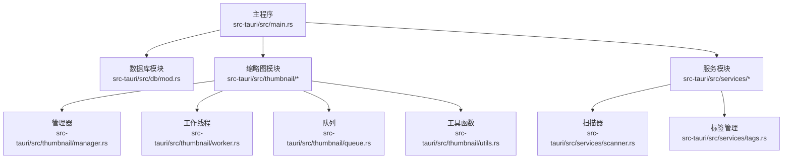
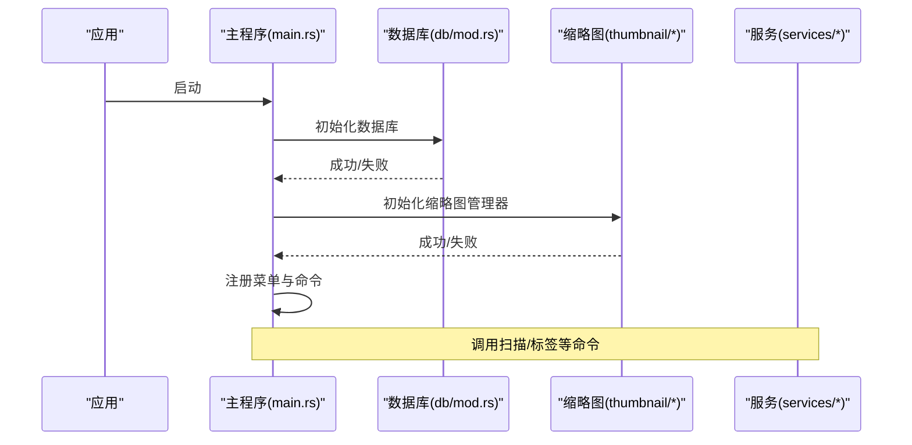
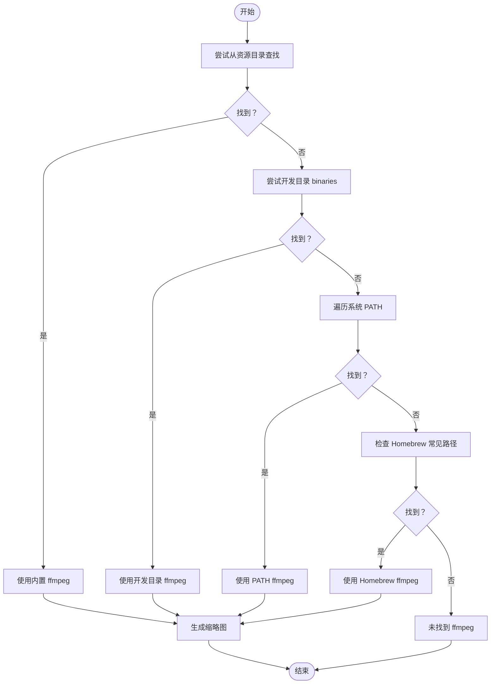
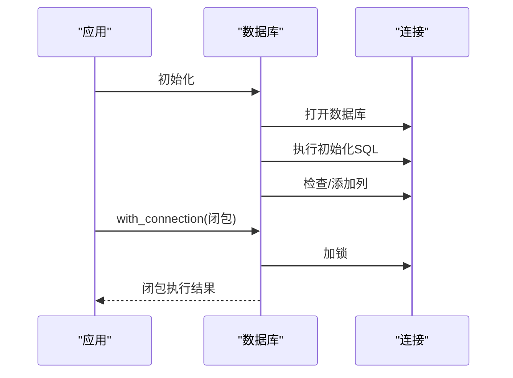
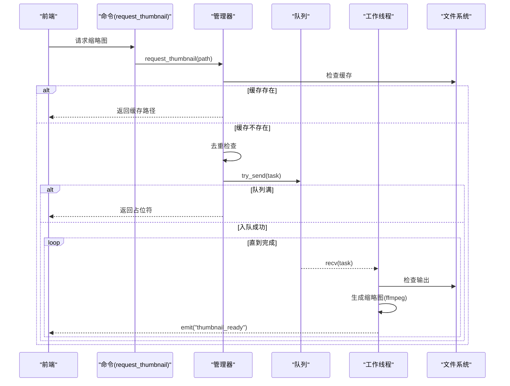
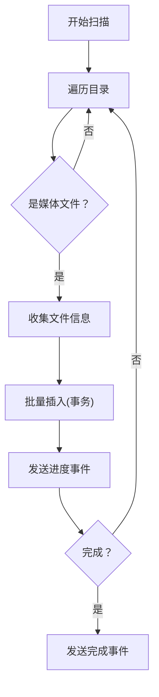
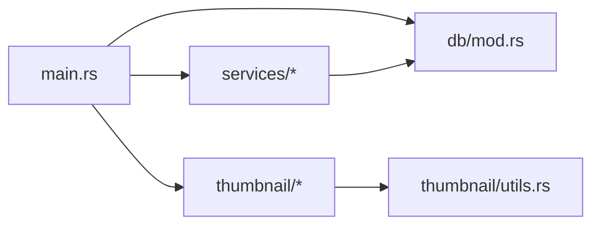

# 后端问题

<cite>
**本文引用的文件**
- [src-tauri/src/main.rs](file://src-tauri/src/main.rs)
- [src-tauri/src/db/mod.rs](file://src-tauri/src/db/mod.rs)
- [src-tauri/src/services/scanner.rs](file://src-tauri/src/services/scanner.rs)
- [src-tauri/src/services/tags.rs](file://src-tauri/src/services/tags.rs)
- [src-tauri/src/thumbnail/mod.rs](file://src-tauri/src/thumbnail/mod.rs)
- [src-tauri/src/thumbnail/manager.rs](file://src-tauri/src/thumbnail/manager.rs)
- [src-tauri/src/thumbnail/worker.rs](file://src-tauri/src/thumbnail/worker.rs)
- [src-tauri/src/thumbnail/queue.rs](file://src-tauri/src/thumbnail/queue.rs)
- [src-tauri/src/thumbnail/utils.rs](file://src-tauri/src/thumbnail/utils.rs)
- [src-tauri/tauri.conf.json](file://src-tauri/tauri.conf.json)
- [RELEASE_GUIDE.md](file://RELEASE_GUIDE.md)
</cite>

## 目录
1. [简介](#简介)
2. [项目结构](#项目结构)
3. [核心组件](#核心组件)
4. [架构总览](#架构总览)
5. [详细组件分析](#详细组件分析)
6. [依赖关系分析](#依赖关系分析)
7. [性能考量](#性能考量)
8. [故障排除指南](#故障排除指南)
9. [结论](#结论)
10. [附录](#附录)

## 简介
本文件面向 Medex 桌面应用后端（Tauri + Rust），聚焦以下常见问题的系统化排查与修复方案：
- ffmpeg 依赖问题：二进制查找顺序、内置二进制配置、系统 PATH 设置
- 数据库连接异常：初始化流程、连接池与事务处理
- 缩略图生成失败：worker 并发、队列容量、缓存路径与 ffmpeg 可用性
- 媒体扫描卡顿与内存占用：批量插入、事务与进度事件
- Rust 异步与并发陷阱：错误处理、生命周期与线程安全

同时提供日志分析技巧、配置文件修改方法与性能监控指标，帮助快速定位与解决问题。

## 项目结构
后端位于 src-tauri，采用模块化组织：
- 主入口负责插件注册、数据库与缩略图子系统初始化、命令导出与菜单事件
- 数据库模块封装 SQLite 连接、初始化与连接访问器
- 服务模块提供扫描与标签管理命令
- 缩略图模块提供任务队列、工作线程、缓存目录与 ffmpeg 解析逻辑

**图表来源**
- [src-tauri/src/main.rs:10-68](file://src-tauri/src/main.rs#L10-L68)
- [src-tauri/src/db/mod.rs:45-122](file://src-tauri/src/db/mod.rs#L45-L122)
- [src-tauri/src/thumbnail/mod.rs:32-61](file://src-tauri/src/thumbnail/mod.rs#L32-L61)
- [src-tauri/src/services/scanner.rs:250-341](file://src-tauri/src/services/scanner.rs#L250-L341)
- [src-tauri/src/services/tags.rs:19-220](file://src-tauri/src/services/tags.rs#L19-L220)

**章节来源**
- [src-tauri/src/main.rs:10-68](file://src-tauri/src/main.rs#L10-L68)
- [src-tauri/src/db/mod.rs:45-122](file://src-tauri/src/db/mod.rs#L45-L122)
- [src-tauri/src/thumbnail/mod.rs:32-61](file://src-tauri/src/thumbnail/mod.rs#L32-L61)
- [src-tauri/src/services/scanner.rs:250-341](file://src-tauri/src/services/scanner.rs#L250-L341)
- [src-tauri/src/services/tags.rs:19-220](file://src-tauri/src/services/tags.rs#L19-L220)

## 核心组件
- 数据库子系统：单例连接、初始化 SQL、索引、迁移与连接访问器
- 缩略图子系统：任务队列、工作线程、缓存目录、ffmpeg 查找策略
- 扫描与标签服务：批量插入、事务、查询与事件通知
- 主程序：插件、菜单、命令导出与初始化顺序

**章节来源**
- [src-tauri/src/db/mod.rs:45-122](file://src-tauri/src/db/mod.rs#L45-L122)
- [src-tauri/src/thumbnail/mod.rs:32-61](file://src-tauri/src/thumbnail/mod.rs#L32-L61)
- [src-tauri/src/services/scanner.rs:90-115](file://src-tauri/src/services/scanner.rs#L90-L115)
- [src-tauri/src/services/tags.rs:76-124](file://src-tauri/src/services/tags.rs#L76-L124)
- [src-tauri/src/main.rs:14-48](file://src-tauri/src/main.rs#L14-L48)

## 架构总览
后端启动流程与关键交互如下：

**图表来源**
- [src-tauri/src/main.rs:14-48](file://src-tauri/src/main.rs#L14-L48)
- [src-tauri/src/db/mod.rs:45-64](file://src-tauri/src/db/mod.rs#L45-L64)
- [src-tauri/src/thumbnail/mod.rs:32-49](file://src-tauri/src/thumbnail/mod.rs#L32-L49)

## 详细组件分析

### 组件一：ffmpeg 依赖与二进制查找顺序
- 查找优先级
  1) Tauri 资源目录（内置二进制）
  2) 开发环境 binaries 目录
  3) 系统 PATH
  4) 常见 macOS Homebrew 路径
- 关键行为
  - 若未找到 ffmpeg，缩略图生成被禁用，请求返回占位符
  - 生成缩略图时若 ffmpeg 不可用，记录日志并跳过
- 配置与打包
  - 在构建配置中声明外部二进制，确保各平台二进制存在
  - 发布前检查清单要求首次安装无需手动安装 ffmpeg

**图表来源**
- [src-tauri/src/thumbnail/utils.rs:71-96](file://src-tauri/src/thumbnail/utils.rs#L71-L96)
- [src-tauri/src/thumbnail/utils.rs:109-157](file://src-tauri/src/thumbnail/utils.rs#L109-L157)
- [src-tauri/src/thumbnail/manager.rs:24-49](file://src-tauri/src/thumbnail/manager.rs#L24-L49)

**章节来源**
- [src-tauri/src/thumbnail/utils.rs:71-96](file://src-tauri/src/thumbnail/utils.rs#L71-L96)
- [src-tauri/src/thumbnail/utils.rs:109-157](file://src-tauri/src/thumbnail/utils.rs#L109-L157)
- [src-tauri/src/thumbnail/manager.rs:24-49](file://src-tauri/src/thumbnail/manager.rs#L24-L49)
- [src-tauri/tauri.conf.json:32](file://src-tauri/tauri.conf.json#L32)
- [RELEASE_GUIDE.md:79-115](file://RELEASE_GUIDE.md#L79-L115)

### 组件二：数据库连接与事务处理
- 初始化
  - 解析应用数据目录，创建数据库文件
  - 执行初始化 SQL（建表、索引）
  - 检查并添加缺失列（收藏字段）
- 访问器
  - 单例连接，带锁保护
  - 提供闭包式访问，简化调用方错误处理
- 事务与批量操作
  - 批量插入使用事务，减少磁盘写入次数
  - 标签删除前检查是否仍被使用
  - 最近观看记录维护上限

**图表来源**
- [src-tauri/src/db/mod.rs:45-64](file://src-tauri/src/db/mod.rs#L45-L64)
- [src-tauri/src/db/mod.rs:97-110](file://src-tauri/src/db/mod.rs#L97-L110)
- [src-tauri/src/services/scanner.rs:90-115](file://src-tauri/src/services/scanner.rs#L90-L115)
- [src-tauri/src/services/tags.rs:96-124](file://src-tauri/src/services/tags.rs#L96-L124)

**章节来源**
- [src-tauri/src/db/mod.rs:45-122](file://src-tauri/src/db/mod.rs#L45-L122)
- [src-tauri/src/services/scanner.rs:90-115](file://src-tauri/src/services/scanner.rs#L90-L115)
- [src-tauri/src/services/tags.rs:96-124](file://src-tauri/src/services/tags.rs#L96-L124)

### 组件三：缩略图生成流水线（队列、工作线程、缓存）
- 配置
  - 工作线程数、队列容量、占位符
- 流程
  - 请求缩略图：校验类型、检查缓存、去重、入队
  - 工作线程：接收任务、检查输出、生成缩略图、发射完成事件
  - 队列满或断开：记录日志并返回占位符
- 缓存
  - 缓存目录位于应用数据目录下的 thumbnails 子目录
  - 输出文件以输入路径哈希命名，避免冲突

**图表来源**
- [src-tauri/src/thumbnail/mod.rs:57-61](file://src-tauri/src/thumbnail/mod.rs#L57-L61)
- [src-tauri/src/thumbnail/manager.rs:51-106](file://src-tauri/src/thumbnail/manager.rs#L51-L106)
- [src-tauri/src/thumbnail/worker.rs:52-89](file://src-tauri/src/thumbnail/worker.rs#L52-L89)
- [src-tauri/src/thumbnail/queue.rs:8-11](file://src-tauri/src/thumbnail/queue.rs#L8-L11)

**章节来源**
- [src-tauri/src/thumbnail/mod.rs:14-16](file://src-tauri/src/thumbnail/mod.rs#L14-L16)
- [src-tauri/src/thumbnail/manager.rs:51-106](file://src-tauri/src/thumbnail/manager.rs#L51-L106)
- [src-tauri/src/thumbnail/worker.rs:52-89](file://src-tauri/src/thumbnail/worker.rs#L52-L89)
- [src-tauri/src/thumbnail/queue.rs:8-11](file://src-tauri/src/thumbnail/queue.rs#L8-L11)
- [src-tauri/src/thumbnail/utils.rs:20-34](file://src-tauri/src/thumbnail/utils.rs#L20-L34)

### 组件四：媒体扫描与标签管理
- 扫描
  - 使用目录遍历识别媒体文件
  - 批量插入到媒体表，使用事务保证一致性
  - 发送扫描进度事件，完成后发送完成事件
- 标签
  - 新增标签时去空格标准化
  - 删除标签前检查是否仍被使用
  - 获取媒体标签、添加/移除标签均使用事务

**图表来源**
- [src-tauri/src/services/scanner.rs:54-88](file://src-tauri/src/services/scanner.rs#L54-L88)
- [src-tauri/src/services/scanner.rs:90-115](file://src-tauri/src/services/scanner.rs#L90-L115)
- [src-tauri/src/services/scanner.rs:250-341](file://src-tauri/src/services/scanner.rs#L250-L341)

**章节来源**
- [src-tauri/src/services/scanner.rs:54-88](file://src-tauri/src/services/scanner.rs#L54-L88)
- [src-tauri/src/services/scanner.rs:90-115](file://src-tauri/src/services/scanner.rs#L90-L115)
- [src-tauri/src/services/scanner.rs:250-341](file://src-tauri/src/services/scanner.rs#L250-L341)
- [src-tauri/src/services/tags.rs:76-124](file://src-tauri/src/services/tags.rs#L76-L124)

## 依赖关系分析
- 外部依赖
  - Tauri：桌面框架、插件、命令导出
  - rusqlite：SQLite 访问与事务
  - walkdir：目录遍历
  - once_cell：单例初始化
  - anyhow：错误处理
- 内部模块耦合
  - 主程序依赖数据库与缩略图模块初始化
  - 服务模块依赖数据库访问器
  - 缩略图模块内部通过工具函数解析 ffmpeg 与缓存路径

**图表来源**
- [src-tauri/src/main.rs:10-68](file://src-tauri/src/main.rs#L10-L68)
- [src-tauri/src/db/mod.rs:45-122](file://src-tauri/src/db/mod.rs#L45-L122)
- [src-tauri/src/thumbnail/utils.rs:71-96](file://src-tauri/src/thumbnail/utils.rs#L71-L96)

**章节来源**
- [src-tauri/src/main.rs:10-68](file://src-tauri/src/main.rs#L10-L68)
- [src-tauri/src/db/mod.rs:45-122](file://src-tauri/src/db/mod.rs#L45-L122)
- [src-tauri/src/thumbnail/utils.rs:71-96](file://src-tauri/src/thumbnail/utils.rs#L71-L96)

## 性能考量
- 扫描与内存
  - 使用批量插入与事务，降低磁盘写放大
  - 目录遍历支持符号链接跳过，避免无限递归
- 缩略图
  - 固定工作线程数与队列容量，防止资源耗尽
  - 缓存命中直接返回，避免重复生成
- 数据库
  - 预创建索引，减少查询成本
  - 读写分离思路：扫描写入使用事务，查询聚合使用索引

[本节为通用性能建议，不直接分析具体文件]

## 故障排除指南

### ffmpeg 依赖问题
- 现象
  - 缩略图请求返回占位符
  - 日志提示未找到 ffmpeg 或生成失败
- 排查步骤
  - 检查内置二进制：确认构建配置已启用 externalBin 并包含对应平台二进制
  - 检查开发目录：确认 binaries 目录存在且包含 ffmpeg
  - 检查系统 PATH：确认 ffmpeg 可执行文件存在于 PATH 某个目录
  - 检查 Homebrew 路径：macOS 常见路径是否存在
- 修复建议
  - 在各平台准备对应二进制并放入 binaries 目录
  - 在 tauri.conf.json 中启用 externalBin 并指向 binaries
  - 发布前检查清单确保首次安装无需手动安装 ffmpeg

**章节来源**
- [src-tauri/src/thumbnail/utils.rs:71-96](file://src-tauri/src/thumbnail/utils.rs#L71-L96)
- [src-tauri/src/thumbnail/manager.rs:24-49](file://src-tauri/src/thumbnail/manager.rs#L24-L49)
- [src-tauri/tauri.conf.json:32](file://src-tauri/tauri.conf.json#L32)
- [RELEASE_GUIDE.md:79-115](file://RELEASE_GUIDE.md#L79-L115)

### 数据库连接异常
- 现象
  - 初始化失败、查询报错、事务回滚
- 排查步骤
  - 检查应用数据目录可写性
  - 检查数据库文件权限与磁盘空间
  - 检查初始化 SQL 是否成功执行
  - 检查迁移逻辑（如新增列）是否成功
- 修复建议
  - 确保应用数据目录创建成功
  - 使用事务包裹批量写入，失败时回滚
  - 对关键 SQL 添加上下文信息以便定位

**章节来源**
- [src-tauri/src/db/mod.rs:45-64](file://src-tauri/src/db/mod.rs#L45-L64)
- [src-tauri/src/db/mod.rs:97-110](file://src-tauri/src/db/mod.rs#L97-L110)
- [src-tauri/src/services/scanner.rs:90-115](file://src-tauri/src/services/scanner.rs#L90-L115)

### 缩略图生成失败
- 现象
  - 队列满导致跳过生成
  - 队列断开或 ffmpeg 不可用
  - 缓存路径不可写
- 排查步骤
  - 观察日志中“队列已满”或“队列断开”的提示
  - 检查缓存目录是否存在且可写
  - 检查 ffmpeg 可用性与输出路径
- 修复建议
  - 适当提高队列容量或工作线程数
  - 确保缓存目录创建成功
  - 保证 ffmpeg 可用或启用内置二进制

**章节来源**
- [src-tauri/src/thumbnail/manager.rs:83-103](file://src-tauri/src/thumbnail/manager.rs#L83-L103)
- [src-tauri/src/thumbnail/worker.rs:64-76](file://src-tauri/src/thumbnail/worker.rs#L64-L76)
- [src-tauri/src/thumbnail/utils.rs:20-34](file://src-tauri/src/thumbnail/utils.rs#L20-L34)

### 媒体扫描卡顿与内存占用过高
- 现象
  - 扫描过程中 UI 卡顿、内存上升
- 排查步骤
  - 检查批量插入是否使用事务
  - 检查是否在循环中频繁触发事件
  - 检查目录遍历深度与符号链接处理
- 修复建议
  - 使用事务批量插入
  - 控制事件发送频率
  - 合理设置索引，避免全表扫描

**章节来源**
- [src-tauri/src/services/scanner.rs:90-115](file://src-tauri/src/services/scanner.rs#L90-L115)
- [src-tauri/src/services/scanner.rs:250-341](file://src-tauri/src/services/scanner.rs#L250-L341)

### Rust 异步与并发陷阱
- 错误处理
  - 使用 anyhow 包裹上下文，便于追踪
  - 对可能失败的操作进行显式错误转换
- 生命周期与并发
  - 单例初始化使用 OnceCell，避免重复初始化
  - 线程间共享状态使用 Arc + Mutex，注意加锁范围
  - 通道使用同步通道与 try_send，避免阻塞
- 并发安全
  - 任务去重使用 HashSet，注意并发安全
  - 生成缩略图时避免阻塞主线程

**章节来源**
- [src-tauri/src/db/mod.rs:8-8](file://src-tauri/src/db/mod.rs#L8-L8)
- [src-tauri/src/thumbnail/manager.rs:32-48](file://src-tauri/src/thumbnail/manager.rs#L32-L48)
- [src-tauri/src/thumbnail/worker.rs:13-50](file://src-tauri/src/thumbnail/worker.rs#L13-L50)
- [src-tauri/src/thumbnail/queue.rs:8-11](file://src-tauri/src/thumbnail/queue.rs#L8-L11)

## 结论
通过明确 ffmpeg 查找顺序、数据库初始化与事务、缩略图队列与缓存策略、扫描批处理与事件控制，以及 Rust 并发与错误处理最佳实践，可以系统性地解决 Medex 后端常见问题。建议在开发与发布流程中固化配置与检查清单，确保跨平台稳定性与用户体验。

## 附录
- 日志分析要点
  - ffmpeg：未找到、生成失败、不可用
  - 数据库：初始化失败、事务回滚、锁失败
  - 缩略图：队列满、断开、占位符返回
  - 扫描：进度事件、完成事件、错误跳过
- 配置文件修改
  - tauri.conf.json：启用 externalBin 指向 binaries
  - 发布前检查清单：确保内置二进制齐全、缓存目录可写
- 性能监控指标
  - 扫描耗时、事件发送频率、队列长度、工作线程利用率、数据库事务耗时