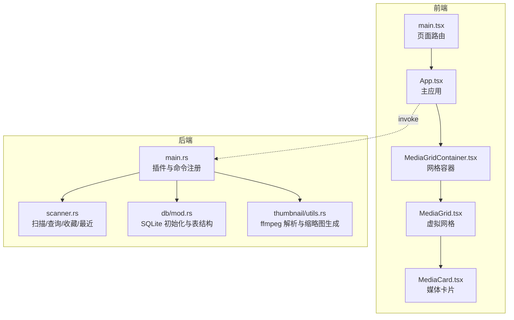
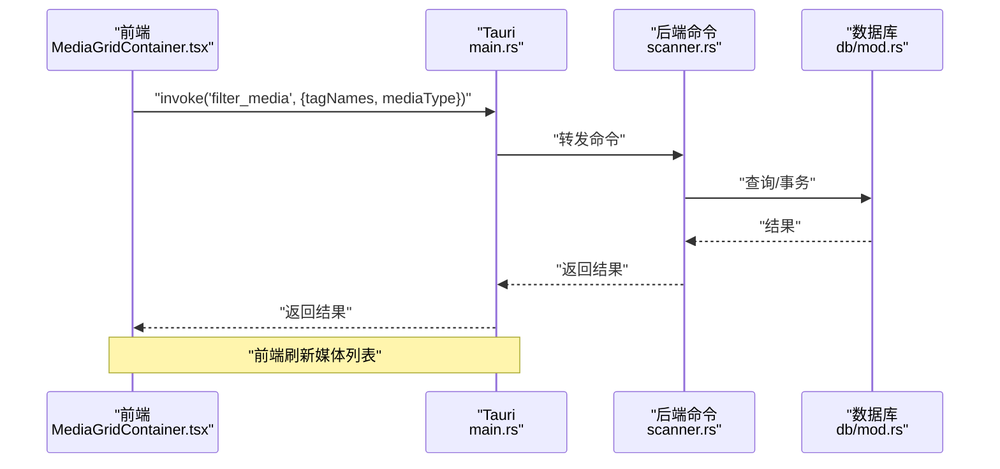
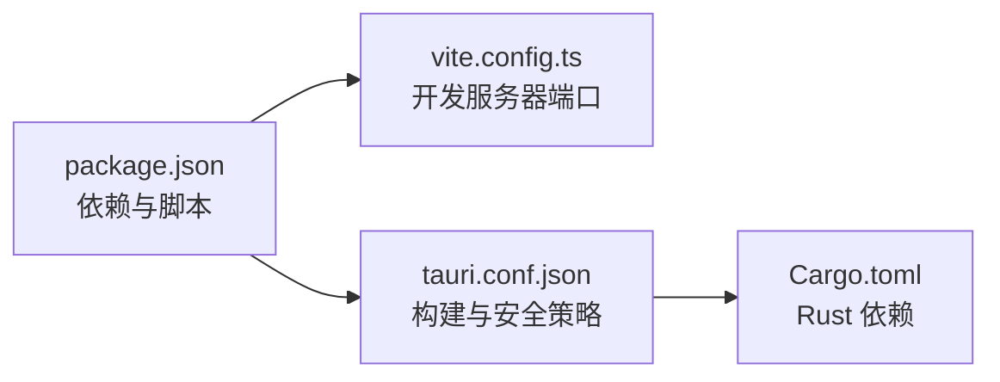

# 常见问题解决

<cite>
**本文引用的文件**
- [package.json](file://package.json)
- [vite.config.ts](file://vite.config.ts)
- [tauri.conf.json](file://src-tauri/tauri.conf.json)
- [Cargo.toml](file://src-tauri/Cargo.toml)
- [default.json](file://src-tauri/capabilities/default.json)
- [main.rs](file://src-tauri/src/main.rs)
- [DEVELOPMENT.md](file://DEVELOPMENT.md)
- [utils.rs](file://src-tauri/src/thumbnail/utils.rs)
- [scanner.rs](file://src-tauri/src/services/scanner.rs)
- [mod.rs](file://src-tauri/src/db/mod.rs)
- [App.tsx](file://src/App.tsx)
- [main.tsx](file://src/main.tsx)
- [MediaGridContainer.tsx](file://src/containers/MediaGridContainer.tsx)
- [MediaGrid.tsx](file://src/components/MediaGrid.tsx)
- [MediaCard.tsx](file://src/components/MediaCard.tsx)
</cite>

## 目录
1. [简介](#简介)
2. [项目结构](#项目结构)
3. [核心组件](#核心组件)
4. [架构总览](#架构总览)
5. [详细组件分析](#详细组件分析)
6. [依赖关系分析](#依赖关系分析)
7. [性能考虑](#性能考虑)
8. [故障排查指南](#故障排查指南)
9. [结论](#结论)
10. [附录](#附录)

## 简介
本文件面向 Medex 开发者，提供从开发环境到运行时的系统化问题排查与解决指南。内容覆盖依赖安装失败、构建配置错误、权限不足、运行时错误、前端对话框权限缺失、本地文件预览失败、缩略图生成失败、后端 ffmpeg 依赖问题、数据库连接异常、文件系统权限等常见问题，并给出预防措施与最佳实践。

## 项目结构
Medex 采用 React + TypeScript + Vite 前端与 Tauri v2 + Rust 后端的混合架构，前端负责 UI 与交互，后端负责媒体扫描、数据库与缩略图生成，二者通过 Tauri 的 invoke/event 通信。

**图表来源**
- [main.tsx:1-44](file://src/main.tsx#L1-L44)
- [App.tsx:1-73](file://src/App.tsx#L1-L73)
- [MediaGridContainer.tsx:1-619](file://src/containers/MediaGridContainer.tsx#L1-L619)
- [MediaGrid.tsx:1-351](file://src/components/MediaGrid.tsx#L1-L351)
- [MediaCard.tsx:1-318](file://src/components/MediaCard.tsx#L1-L318)
- [main.rs:1-69](file://src-tauri/src/main.rs#L1-L69)
- [scanner.rs:1-525](file://src-tauri/src/services/scanner.rs#L1-L525)
- [mod.rs:1-123](file://src-tauri/src/db/mod.rs#L1-L123)
- [utils.rs:1-158](file://src-tauri/src/thumbnail/utils.rs#L1-L158)

**章节来源**
- [DEVELOPMENT.md:51-116](file://DEVELOPMENT.md#L51-L116)
- [package.json:1-36](file://package.json#L1-L36)
- [vite.config.ts:1-11](file://vite.config.ts#L1-L11)
- [tauri.conf.json:1-46](file://src-tauri/tauri.conf.json#L1-L46)
- [Cargo.toml:1-23](file://src-tauri/Cargo.toml#L1-L23)

## 核心组件
- 前端应用入口与页面路由：负责根据路径渲染不同页面（主界面、设置、更新）。
- 媒体网格容器：负责筛选、缩略图任务调度、事件监听与状态同步。
- 虚拟网格与卡片：负责高性能渲染与本地文件预览转换。
- 后端命令注册：暴露扫描、查询、收藏、最近查看、标签管理、缩略图请求等命令。
- 数据库模块：负责 SQLite 初始化、表结构与索引、连接管理。
- 缩略图工具：负责 ffmpeg 二进制解析、缩略图生成与缓存路径。

**章节来源**
- [main.tsx:9-41](file://src/main.tsx#L9-L41)
- [MediaGridContainer.tsx:30-619](file://src/containers/MediaGridContainer.tsx#L30-L619)
- [MediaGrid.tsx:70-351](file://src/components/MediaGrid.tsx#L70-L351)
- [MediaCard.tsx:34-318](file://src/components/MediaCard.tsx#L34-L318)
- [main.rs:49-66](file://src-tauri/src/main.rs#L49-L66)
- [mod.rs:45-123](file://src-tauri/src/db/mod.rs#L45-L123)
- [utils.rs:36-158](file://src-tauri/src/thumbnail/utils.rs#L36-L158)

## 架构总览
前后端通过 Tauri 的 invoke 与事件进行通信，前端发起命令，后端执行业务逻辑并返回结果或推送事件。

**图表来源**
- [MediaGridContainer.tsx:210-235](file://src/containers/MediaGridContainer.tsx#L210-L235)
- [main.rs:49-66](file://src-tauri/src/main.rs#L49-L66)
- [scanner.rs:160-168](file://src-tauri/src/services/scanner.rs#L160-L168)
- [mod.rs:97-111](file://src-tauri/src/db/mod.rs#L97-L111)

## 详细组件分析

### 前端：对话框权限缺失（dialog.open not allowed）
症状
- 点击“选择文件夹”无弹窗或报错“dialog.open not allowed”。

原因分析
- Tauri 能力配置缺少必要的对话框权限。

解决步骤
- 确认能力文件包含允许打开对话框的权限。
- 在开发模式下重启 Tauri 开发服务器以重新加载能力。

预防与最佳实践
- 将权限集中管理于能力文件，避免在运行时动态变更。
- 在 CI 中校验能力文件完整性。

**章节来源**
- [default.json:6-13](file://src-tauri/capabilities/default.json#L6-L13)
- [DEVELOPMENT.md:566-572](file://DEVELOPMENT.md#L566-L572)

### 前端：本地文件预览失败（unsupported URL）
症状
- 图片/视频无法显示，控制台提示 URL 不受支持。

原因分析
- 前端直接使用绝对路径而非 convertFileSrc 转换导致资源协议不识别。

解决步骤
- 确保对本地绝对路径使用 convertFileSrc 转换后再赋值给 src。
- 检查 toPreviewSrc 逻辑是否正确处理绝对路径与资源协议。

预防与最佳实践
- 统一在渲染前进行 URL 转换，避免散落在各处手动拼接。
- 对非本地路径（http/https/asset）保持原样。

**章节来源**
- [MediaGrid.tsx:312-321](file://src/components/MediaGrid.tsx#L312-L321)
- [MediaCard.tsx:266-275](file://src/components/MediaCard.tsx#L266-L275)
- [DEVELOPMENT.md:573-576](file://DEVELOPMENT.md#L573-L576)

### 前端：缩略图生成失败
症状
- 视频卡片长时间显示“生成缩略图...”或占位符。

原因分析
- 后端 ffmpeg 二进制不可用或路径解析失败。
- 前端未收到 thumbnail_ready 事件或请求未完成。

解决步骤
- 检查系统 PATH 是否包含 ffmpeg，或在开发目录放置内置二进制。
- 确认前端已监听 thumbnail_ready 事件并更新缩略图映射。
- 控制并发与队列大小，避免阻塞。

预防与最佳实践
- 在构建阶段打包 ffmpeg 二进制，避免运行时缺失。
- 增加超时回收与失败重试策略。

**章节来源**
- [utils.rs:71-96](file://src-tauri/src/thumbnail/utils.rs#L71-L96)
- [MediaGridContainer.tsx:453-486](file://src/containers/MediaGridContainer.tsx#L453-L486)
- [DEVELOPMENT.md:577-586](file://DEVELOPMENT.md#L577-L586)

### 后端：ffmpeg 依赖问题
症状
- request_thumbnail 返回错误，缩略图生成失败。

原因分析
- 二进制解析顺序：资源内嵌 → 开发目录 → 系统 PATH → 常见 Homebrew 路径。
- 若均未找到，直接返回错误。

解决步骤
- 在 src-tauri/binaries 放置对应平台的 ffmpeg。
- 或在系统 PATH 正确安装 ffmpeg。
- 在 tauri.conf.json 中配置 externalBin 以随包分发。

预防与最佳实践
- 为多平台准备二进制并在构建脚本中校验。
- 在 CI 中增加 ffmpeg 存在性检查。

**章节来源**
- [utils.rs:71-158](file://src-tauri/src/thumbnail/utils.rs#L71-L158)
- [tauri.conf.json:32](file://src-tauri/tauri.conf.json#L32)
- [DEVELOPMENT.md:472-481](file://DEVELOPMENT.md#L472-L481)

### 后端：数据库连接异常
症状
- 初始化数据库时报错，或查询/写入失败。

原因分析
- 数据库路径解析失败或权限不足。
- 表结构初始化失败或列缺失。

解决步骤
- 确认 app_data_dir 可用且具备写权限。
- 检查初始化 SQL 与索引创建。
- 确保 is_favorite 列存在，必要时自动迁移。

预防与最佳实践
- 在首次启动时进行数据库初始化验证。
- 对异常进行明确的错误信息输出与日志记录。

**章节来源**
- [mod.rs:45-95](file://src-tauri/src/db/mod.rs#L45-L95)
- [mod.rs:112-123](file://src-tauri/src/db/mod.rs#L112-L123)

### 后端：扫描与筛选性能问题
症状
- 大目录扫描卡顿或耗时过长。

原因分析
- 未使用事务批量插入，或未启用虚拟化渲染。
- 未对媒体类型与标签进行有效过滤。

解决步骤
- 使用事务批量写入 INSERT OR IGNORE。
- 通过标签交集与媒体类型过滤减少查询负载。
- 优化前端虚拟化渲染与缩略图并发。

预防与最佳实践
- 对大目录扫描增加进度事件与取消机制。
- 前端对可见区域外的缩略图请求降级优先级。

**章节来源**
- [scanner.rs:90-115](file://src-tauri/src/services/scanner.rs#L90-L115)
- [scanner.rs:171-247](file://src-tauri/src/services/scanner.rs#L171-L247)
- [MediaGridContainer.tsx:27-28](file://src/containers/MediaGridContainer.tsx#L27-L28)

### 前端：运行时错误与日志分析
症状
- 控制台出现大量错误，页面卡顿或白屏。

原因分析
- 误在网格内挂载多个 <video> 导致卡顿。
- 未启用 react-window 虚拟化。
- 缩略图请求并发过高导致阻塞。

解决步骤
- 确保视频卡片仅在 Viewer 中挂载 <video>。
- 检查虚拟化参数与 overscan 设置。
- 限制并发与队列长度，避免过度请求。

预防与最佳实践
- 使用统一的错误提示组件替代 alert。
- 对关键路径增加日志分级与错误边界。

**章节来源**
- [MediaGridContainer.tsx:342-351](file://src/containers/MediaGridContainer.tsx#L342-L351)
- [MediaGrid.tsx:337-350](file://src/components/MediaGrid.tsx#L337-L350)
- [DEVELOPMENT.md:587-595](file://DEVELOPMENT.md#L587-L595)

## 依赖关系分析
前端与后端通过 Tauri CLI 与配置文件协同工作，前端使用 @tauri-apps/api 与 @tauri-apps/plugin-* 插件，后端使用 tauri、rusqlite、walkdir、anyhow 等。

**图表来源**
- [package.json:6-11](file://package.json#L6-L11)
- [vite.config.ts:4-10](file://vite.config.ts#L4-L10)
- [tauri.conf.json:6-11](file://src-tauri/tauri.conf.json#L6-L11)
- [Cargo.toml:13-23](file://src-tauri/Cargo.toml#L13-L23)

**章节来源**
- [package.json:12-34](file://package.json#L12-L34)
- [Cargo.toml:10-23](file://src-tauri/Cargo.toml#L10-L23)

## 性能考虑
- 前端：使用 react-window 虚拟化渲染，合理设置 overscan 与列数，避免在网格中挂载视频元素。
- 后端：批量事务写入、索引优化、worker 并发与队列容量控制。
- 缩略图：固定 worker 数量与队列容量，优先级调度，缓存路径与哈希命名。

**章节来源**
- [MediaGrid.tsx:170-212](file://src/components/MediaGrid.tsx#L170-L212)
- [MediaGridContainer.tsx:27-28](file://src/containers/MediaGridContainer.tsx#L27-L28)
- [utils.rs:36-61](file://src-tauri/src/thumbnail/utils.rs#L36-L61)

## 故障排查指南

### 开发环境问题
- 依赖安装失败
  - 症状：npm install 报错。
  - 排查：检查网络代理、Node 版本与缓存。
  - 解决：清理缓存后重试，或更换镜像源。
- 构建配置错误
  - 症状：vite 构建失败或端口占用。
  - 排查：确认端口 1420 未被占用，严格端口配置生效。
  - 解决：修改端口或释放占用进程。
- 权限不足
  - 症状：无法访问媒体库目录或写入数据库。
  - 排查：检查用户对目录与数据目录的读写权限。
  - 解决：提升权限或更换目录。

**章节来源**
- [vite.config.ts:6-9](file://vite.config.ts#L6-L9)
- [mod.rs:112-123](file://src-tauri/src/db/mod.rs#L112-L123)

### 运行时错误
- 日志分析技巧
  - 前端：区分 console.log/warn/error，使用统一错误提示组件。
  - 后端：在命令执行前后打印关键信息，捕获 anyhow 错误并输出。
- 错误代码解读
  - 数据库未初始化：检查 init_db 与 app_data_dir。
  - ffmpeg 未找到：检查 resolve_ffmpeg_bin 的查找顺序。
- 快速修复方案
  - 重新初始化数据库，确保表与索引存在。
  - 在开发目录放置 ffmpeg 二进制，或在 PATH 中加入可执行文件。

**章节来源**
- [main.rs:14-22](file://src-tauri/src/main.rs#L14-L22)
- [utils.rs:71-96](file://src-tauri/src/thumbnail/utils.rs#L71-L96)

### 前端问题
- 对话框权限缺失
  - 检查能力文件是否包含允许打开对话框与消息的权限。
- 本地文件预览失败
  - 确保使用 convertFileSrc 转换绝对路径。
- 缩略图生成失败
  - 检查 ffmpeg 是否可用，前端是否监听 thumbnail_ready 事件。

**章节来源**
- [default.json:6-13](file://src-tauri/capabilities/default.json#L6-L13)
- [MediaGrid.tsx:312-321](file://src/components/MediaGrid.tsx#L312-L321)
- [MediaGridContainer.tsx:453-486](file://src/containers/MediaGridContainer.tsx#L453-L486)

### 后端问题
- ffmpeg 依赖问题
  - 按顺序解析资源内嵌、开发目录、系统 PATH、Homebrew 路径。
  - 若最终缺失，直接返回错误。
- 数据库连接异常
  - 检查 app_data_dir 与数据库文件权限，确保初始化 SQL 成功执行。
- 文件系统权限
  - 确保扫描目录可读，数据库目录可写。

**章节来源**
- [utils.rs:71-158](file://src-tauri/src/thumbnail/utils.rs#L71-L158)
- [mod.rs:45-95](file://src-tauri/src/db/mod.rs#L45-L95)

### 预防措施与最佳实践
- 前端
  - 统一 URL 转换与错误提示，避免散落的 alert。
  - 使用虚拟化渲染与合理的缩略图并发策略。
- 后端
  - 在构建阶段打包 ffmpeg，CI 中校验二进制存在性。
  - 对数据库初始化与命令执行增加日志与错误处理。
- 通用
  - 在 tauri.conf.json 中明确 externalBin 与安全策略。
  - 对大目录扫描与筛选增加进度与取消机制。

**章节来源**
- [tauri.conf.json:32](file://src-tauri/tauri.conf.json#L32)
- [DEVELOPMENT.md:597-604](file://DEVELOPMENT.md#L597-L604)

## 结论
通过系统化的权限配置、URL 转换、ffmpeg 二进制管理、数据库初始化与日志分析，可以有效解决 Medex 开发与运行中的大部分问题。建议在团队内形成标准化的开发与发布流程，结合 CI 校验关键依赖与配置，确保问题早发现、快修复。

## 附录
- 关键文件索引
  - 前端入口：src/main.tsx
  - 主应用：src/App.tsx
  - 媒体网格容器：src/containers/MediaGridContainer.tsx
  - 虚拟网格：src/components/MediaGrid.tsx
  - 媒体卡片：src/components/MediaCard.tsx
  - 后端命令注册：src-tauri/src/main.rs
  - 扫描与查询：src-tauri/src/services/scanner.rs
  - 数据库模块：src-tauri/src/db/mod.rs
  - 缩略图工具：src-tauri/src/thumbnail/utils.rs
  - 能力配置：src-tauri/capabilities/default.json
  - 构建配置：src-tauri/tauri.conf.json

**章节来源**
- [DEVELOPMENT.md:620-635](file://DEVELOPMENT.md#L620-L635)