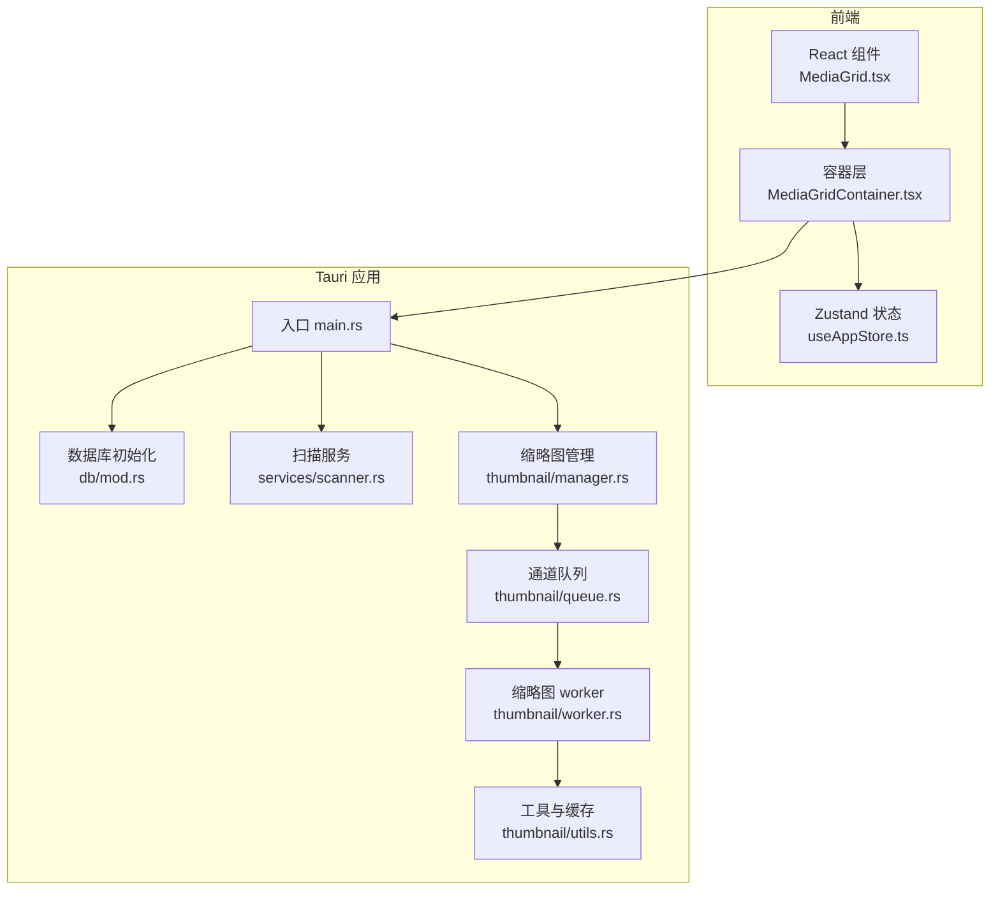
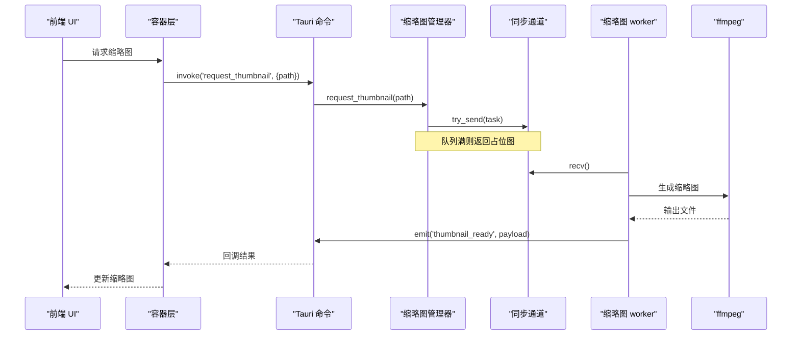
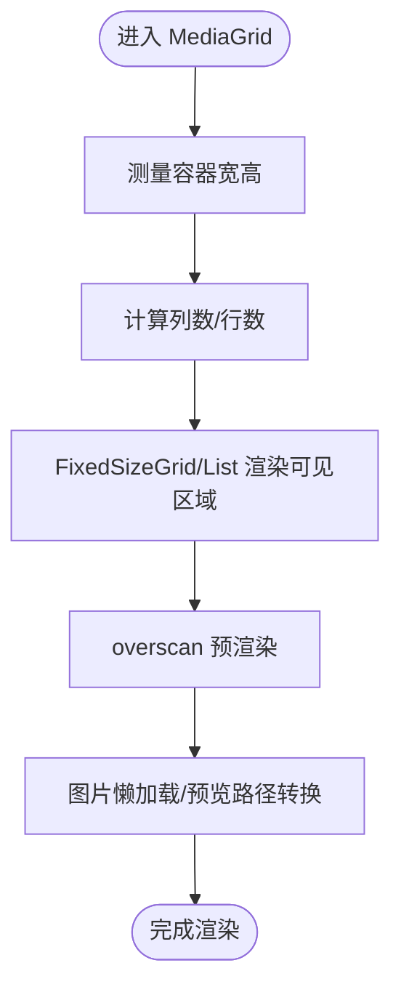
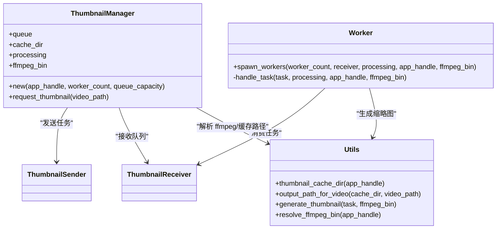
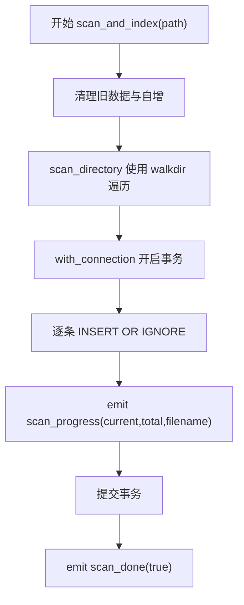
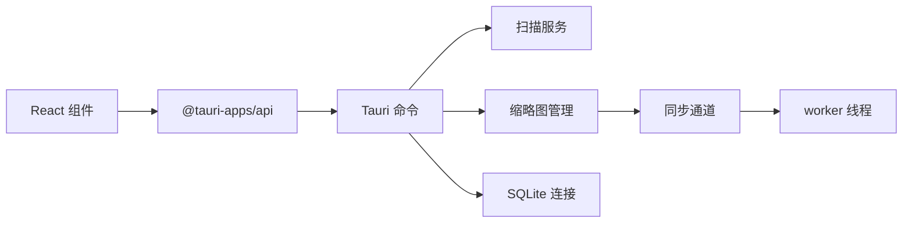

# 性能问题

<cite>
**本文引用的文件**
- [src-tauri/src/main.rs](file://src-tauri/src/main.rs)
- [src-tauri/src/db/mod.rs](file://src-tauri/src/db/mod.rs)
- [src-tauri/src/services/scanner.rs](file://src-tauri/src/services/scanner.rs)
- [src-tauri/src/thumbnail/manager.rs](file://src-tauri/src/thumbnail/manager.rs)
- [src-tauri/src/thumbnail/queue.rs](file://src-tauri/src/thumbnail/queue.rs)
- [src-tauri/src/thumbnail/worker.rs](file://src-tauri/src/thumbnail/worker.rs)
- [src-tauri/src/thumbnail/utils.rs](file://src-tauri/src/thumbnail/utils.rs)
- [src/components/MediaGrid.tsx](file://src/components/MediaGrid.tsx)
- [src/containers/MediaGridContainer.tsx](file://src/containers/MediaGridContainer.tsx)
- [src/store/useAppStore.ts](file://src/store/useAppStore.ts)
- [package.json](file://package.json)
- [src-tauri/Cargo.toml](file://src-tauri/Cargo.toml)
</cite>

## 目录
1. [简介](#简介)
2. [项目结构](#项目结构)
3. [核心组件](#核心组件)
4. [架构总览](#架构总览)
5. [详细组件分析](#详细组件分析)
6. [依赖关系分析](#依赖关系分析)
7. [性能考量](#性能考量)
8. [故障排查指南](#故障排查指南)
9. [结论](#结论)
10. [附录](#附录)

## 简介
本指南聚焦 Medex 的性能问题诊断与优化，围绕以下主线展开：
- 媒体列表渲染卡顿：虚拟化配置、DOM 数量控制、内存泄漏检测
- 缩略图生成性能瓶颈：并发 worker 调整、队列容量优化、缓存策略改进
- 大目录扫描性能：扫描进度优化、数据库批量写入、内存使用控制
- 视频播放性能：硬件加速配置、缓冲策略、播放器优化
- 性能监控与基准测试：Chrome DevTools、Rust Profiler、系统资源监控；性能回归检测策略

## 项目结构
Medex 采用 Tauri + React 架构，前端负责 UI 与交互，后端 Rust 负责高性能任务（扫描、缩略图、数据库）。关键路径如下：
- 前端：React + react-window（虚拟化）+ Zustand（状态）
- 后端：Tauri 命令桥接 + SQLite（rusqlite）+ 多线程缩略图 worker + ffmpeg

图表来源
- [src-tauri/src/main.rs:10-68](file://src-tauri/src/main.rs#L10-L68)
- [src-tauri/src/db/mod.rs:45-64](file://src-tauri/src/db/mod.rs#L45-L64)
- [src-tauri/src/services/scanner.rs:250-341](file://src-tauri/src/services/scanner.rs#L250-L341)
- [src-tauri/src/thumbnail/manager.rs:24-49](file://src-tauri/src/thumbnail/manager.rs#L24-L49)
- [src-tauri/src/thumbnail/queue.rs:8-11](file://src-tauri/src/thumbnail/queue.rs#L8-L11)
- [src-tauri/src/thumbnail/worker.rs:13-50](file://src-tauri/src/thumbnail/worker.rs#L13-L50)
- [src-tauri/src/thumbnail/utils.rs:20-34](file://src-tauri/src/thumbnail/utils.rs#L20-L34)
- [src/components/MediaGrid.tsx:70-212](file://src/components/MediaGrid.tsx#L70-L212)
- [src/containers/MediaGridContainer.tsx:359-396](file://src/containers/MediaGridContainer.tsx#L359-L396)
- [src/store/useAppStore.ts:145-394](file://src/store/useAppStore.ts#L145-L394)

章节来源
- [src-tauri/src/main.rs:10-68](file://src-tauri/src/main.rs#L10-L68)
- [package.json:12-22](file://package.json#L12-L22)
- [src-tauri/Cargo.toml:13-23](file://src-tauri/Cargo.toml#L13-L23)

## 核心组件
- 媒体列表渲染（虚拟化）：使用 react-window 的 FixedSizeGrid/List，按需渲染可见区域并配置 overscan，显著降低 DOM 数量
- 缩略图系统：多线程 worker + 有界同步通道队列 + 缓存目录 + ffmpeg 生成
- 扫描与索引：walkdir 递归扫描 + SQLite 事务批量插入 + 进度事件
- 数据库：SQLite 初始化、索引、连接池封装（Mutex 包裹）

章节来源
- [src/components/MediaGrid.tsx:146-212](file://src/components/MediaGrid.tsx#L146-L212)
- [src-tauri/src/thumbnail/manager.rs:16-49](file://src-tauri/src/thumbnail/manager.rs#L16-L49)
- [src-tauri/src/thumbnail/queue.rs:8-11](file://src-tauri/src/thumbnail/queue.rs#L8-L11)
- [src-tauri/src/thumbnail/worker.rs:13-50](file://src-tauri/src/thumbnail/worker.rs#L13-L50)
- [src-tauri/src/services/scanner.rs:54-88](file://src-tauri/src/services/scanner.rs#L54-L88)
- [src-tauri/src/db/mod.rs:45-64](file://src-tauri/src/db/mod.rs#L45-L64)

## 架构总览
下面以序列图展示缩略图请求与生成的关键流程，以及扫描与数据库写入流程。

图表来源
- [src-tauri/src/thumbnail/manager.rs:51-106](file://src-tauri/src/thumbnail/manager.rs#L51-L106)
- [src-tauri/src/thumbnail/queue.rs:8-11](file://src-tauri/src/thumbnail/queue.rs#L8-L11)
- [src-tauri/src/thumbnail/worker.rs:26-89](file://src-tauri/src/thumbnail/worker.rs#L26-L89)
- [src-tauri/src/thumbnail/utils.rs:36-61](file://src-tauri/src/thumbnail/utils.rs#L36-L61)
- [src/containers/MediaGridContainer.tsx:359-396](file://src/containers/MediaGridContainer.tsx#L359-L396)

## 详细组件分析

### 组件一：媒体列表渲染（虚拟化与 DOM 控制）
- 使用 FixedSizeGrid/FixedSizeList，按容器尺寸计算列数/行数，仅渲染可见区域与 overscan
- 列表模式下 overscanCount=8，网格模式下 overscanRowCount/ColumnCount=3/1，避免滚动抖动
- 图片懒加载与预览路径转换，减少首屏压力
- 通过 onVisibleRangeChange 将可视范围传递给容器层，便于进一步优化（如延迟加载）

图表来源
- [src/components/MediaGrid.tsx:70-212](file://src/components/MediaGrid.tsx#L70-L212)

章节来源
- [src/components/MediaGrid.tsx:146-212](file://src/components/MediaGrid.tsx#L146-L212)
- [src/containers/MediaGridContainer.tsx:359-396](file://src/containers/MediaGridContainer.tsx#L359-L396)

### 组件二：缩略图生成系统（并发、队列与缓存）
- 并发：spawn_workers 根据 worker_count 启动多个线程，循环从队列接收任务
- 队列：create_queue 基于同步通道，容量由 queue_capacity 控制
- 缓存：输出路径基于视频路径哈希，缓存目录在应用数据目录下
- ffmpeg 解析：优先从资源目录查找，回退到开发目录、PATH、Homebrew 路径
- 队列满/断开处理：返回占位图，避免阻塞 UI

图表来源
- [src-tauri/src/thumbnail/manager.rs:16-49](file://src-tauri/src/thumbnail/manager.rs#L16-L49)
- [src-tauri/src/thumbnail/queue.rs:5-11](file://src-tauri/src/thumbnail/queue.rs#L5-L11)
- [src-tauri/src/thumbnail/worker.rs:13-50](file://src-tauri/src/thumbnail/worker.rs#L13-L50)
- [src-tauri/src/thumbnail/utils.rs:20-34](file://src-tauri/src/thumbnail/utils.rs#L20-L34)

章节来源
- [src-tauri/src/thumbnail/manager.rs:24-106](file://src-tauri/src/thumbnail/manager.rs#L24-L106)
- [src-tauri/src/thumbnail/queue.rs:8-11](file://src-tauri/src/thumbnail/queue.rs#L8-L11)
- [src-tauri/src/thumbnail/worker.rs:13-96](file://src-tauri/src/thumbnail/worker.rs#L13-L96)
- [src-tauri/src/thumbnail/utils.rs:36-96](file://src-tauri/src/thumbnail/utils.rs#L36-L96)

### 组件三：大目录扫描与数据库写入
- 扫描：walkdir 递归遍历，跳过非文件与非媒体扩展名
- 批量写入：事务包裹 INSERT OR IGNORE，逐条执行并发射 scan_progress 事件
- 进度：每处理一条即 emit，前端可据此更新进度条
- 清理：扫描前清空 media/media_tags/recent_views 并重置自增

图表来源
- [src-tauri/src/services/scanner.rs:250-341](file://src-tauri/src/services/scanner.rs#L250-L341)
- [src-tauri/src/services/scanner.rs:54-88](file://src-tauri/src/services/scanner.rs#L54-L88)
- [src-tauri/src/services/scanner.rs:90-115](file://src-tauri/src/services/scanner.rs#L90-L115)

章节来源
- [src-tauri/src/services/scanner.rs:54-341](file://src-tauri/src/services/scanner.rs#L54-L341)
- [src-tauri/src/db/mod.rs:45-64](file://src-tauri/src/db/mod.rs#L45-L64)

### 组件四：视频播放性能（播放器与缓冲）
- 播放器：双击打开 MediaViewer，视频自动播放
- 缓冲策略：建议前端在可见性变化时暂停/播放，避免后台资源浪费
- 硬件加速：浏览器/系统驱动决定，应用侧可通过媒体属性与格式选择影响解码效率

章节来源
- [DEVELOPMENT.md:288-296](file://DEVELOPMENT.md#L288-L296)

## 依赖关系分析
- 前端依赖：react、react-window、zustand、@tauri-apps/api
- 后端依赖：tauri、rusqlite、walkdir、anyhow、once_cell
- 关键耦合点：Tauri 命令桥接、缩略图通道、数据库连接

图表来源
- [package.json:12-22](file://package.json#L12-L22)
- [src-tauri/Cargo.toml:13-23](file://src-tauri/Cargo.toml#L13-L23)
- [src-tauri/src/main.rs:49-65](file://src-tauri/src/main.rs#L49-L65)

章节来源
- [package.json:12-22](file://package.json#L12-L22)
- [src-tauri/Cargo.toml:13-23](file://src-tauri/Cargo.toml#L13-L23)
- [src-tauri/src/main.rs:49-65](file://src-tauri/src/main.rs#L49-L65)

## 性能考量

### 媒体列表渲染卡顿优化
- 虚拟化参数微调
  - 网格 overscanRowCount/ColumnCount：当前为 3/1，可根据屏幕分辨率与滚动速度调整
  - 列表 overscanCount：当前为 8，可按设备性能动态下调
- DOM 元素数量控制
  - 固定卡片尺寸与间距，避免频繁 reflow
  - 图片懒加载与占位符，减少首屏渲染压力
- 内存泄漏检测
  - 使用 ResizeObserver 时注意在组件卸载时断开
  - 确保事件监听与定时器在卸载时清理
  - 使用 React DevTools Profiler 检测长列表重渲染热点

章节来源
- [src/components/MediaGrid.tsx:146-212](file://src/components/MediaGrid.tsx#L146-L212)
- [src/containers/MediaGridContainer.tsx:359-396](file://src/containers/MediaGridContainer.tsx#L359-L396)

### 缩略图生成性能瓶颈优化
- 并发 worker 调整
  - 默认 worker 数量未在代码中显式配置，建议根据 CPU 核心数与 ffmpeg 资源占用动态设置
  - 监控队列长度与处理耗时，避免过度并发导致 I/O 抖动
- 队列容量优化
  - 当前队列容量来自外部参数，建议根据内存与磁盘 IO 能力设定上限
  - 队列满时返回占位图，避免 UI 阻塞；可考虑优先级队列或去重
- 缓存策略改进
  - 输出路径基于哈希，命中率高；建议增加缓存失效策略（如修改时间校验）
  - ffmpeg 参数可微调（如缩放尺寸、帧采样），平衡质量与速度

章节来源
- [src-tauri/src/thumbnail/manager.rs:24-106](file://src-tauri/src/thumbnail/manager.rs#L24-L106)
- [src-tauri/src/thumbnail/queue.rs:8-11](file://src-tauri/src/thumbnail/queue.rs#L8-L11)
- [src-tauri/src/thumbnail/worker.rs:13-96](file://src-tauri/src/thumbnail/worker.rs#L13-L96)
- [src-tauri/src/thumbnail/utils.rs:36-96](file://src-tauri/src/thumbnail/utils.rs#L36-L96)

### 大目录扫描性能优化
- 扫描进度优化
  - 已通过 scan_progress 事件推送进度，建议前端节流更新
- 数据库批量写入
  - 使用事务包裹批量插入，已具备良好实践
  - 可考虑分批大小（例如每批 1000 条）以平衡内存与吞吐
- 内存使用控制
  - walkdir 遍历过程中避免持有大对象引用
  - 插入完成后及时释放中间集合

章节来源
- [src-tauri/src/services/scanner.rs:250-341](file://src-tauri/src/services/scanner.rs#L250-L341)
- [src-tauri/src/services/scanner.rs:90-115](file://src-tauri/src/services/scanner.rs#L90-L115)

### 视频播放性能
- 硬件加速：确保系统驱动可用，选择合适编码格式
- 缓冲策略：在页面不可见时暂停播放，可见时再恢复
- 播放器优化：避免重复创建播放器实例，统一管理生命周期

章节来源
- [DEVELOPMENT.md:288-296](file://DEVELOPMENT.md#L288-L296)

### 性能监控与基准测试
- Chrome DevTools
  - Performance：录制滚动/缩略图请求，定位长任务与布局抖动
  - Memory：快照对比，排查缩略图缓存与组件卸载问题
  - Lighthouse：评估首屏与交互指标
- Rust Profiler
  - perf-map-agent + Speedscope：分析缩略图 worker 与扫描阶段热点
  - flamegraph：生成火焰图，识别 CPU 密集环节
- 系统资源监控
  - Windows：任务管理器/资源监视器；macOS：活动监视器
  - Linux：htop/iostat/iotop
- 基准测试与回归检测
  - 缩略图：对相同视频集进行多次生成，统计平均耗时与 P95
  - 列表渲染：不同 overscan 设置下的帧时间分布
  - 扫描：不同目录规模下的总耗时与峰值内存
  - 回归：建立 CI 基准阈值，失败即告警

## 故障排查指南
- 缩略图不生成
  - 检查 ffmpeg 是否可用（resolve_ffmpeg_bin），确认输出目录可写
  - 查看队列是否频繁满（Full 错误），适当增大容量或减少并发
- 列表卡顿
  - 检查 overscan 是否过大，尝试降低
  - 确认图片懒加载与预览路径转换逻辑
- 扫描缓慢
  - 确认网络存储是否为瓶颈，尽量本地扫描
  - 分批插入与事务使用正确
- 数据库异常
  - 确认连接初始化成功，索引存在
  - 检查事务提交与错误日志

章节来源
- [src-tauri/src/thumbnail/utils.rs:71-96](file://src-tauri/src/thumbnail/utils.rs#L71-L96)
- [src-tauri/src/thumbnail/manager.rs:83-103](file://src-tauri/src/thumbnail/manager.rs#L83-L103)
- [src-tauri/src/services/scanner.rs:250-341](file://src-tauri/src/services/scanner.rs#L250-L341)
- [src-tauri/src/db/mod.rs:45-64](file://src-tauri/src/db/mod.rs#L45-L64)

## 结论
Medex 在渲染与 I/O 方面已具备良好的基础：虚拟化渲染、事务批量写入、多线程缩略图与 ffmpeg。针对性能问题，建议从以下方向持续优化：
- 动态调节虚拟化 overscan 与缩略图并发
- 引入队列优先级与去重，优化缓存失效策略
- 扫描阶段引入分批与进度节流
- 建立系统化的性能监控与回归检测体系

## 附录
- 相关实现位置
  - 虚拟化渲染：[MediaGrid.tsx:146-212](file://src/components/MediaGrid.tsx#L146-L212)
  - 缩略图管理：[manager.rs:24-106](file://src-tauri/src/thumbnail/manager.rs#L24-L106)
  - 队列与 worker：[queue.rs:8-11](file://src-tauri/src/thumbnail/queue.rs#L8-L11)、[worker.rs:13-96](file://src-tauri/src/thumbnail/worker.rs#L13-L96)
  - 扫描与索引：[scanner.rs:250-341](file://src-tauri/src/services/scanner.rs#L250-L341)
  - 数据库初始化：[db/mod.rs:45-64](file://src-tauri/src/db/mod.rs#L45-L64)
  - 播放器说明：[DEVELOPMENT.md:288-296](file://DEVELOPMENT.md#L288-L296)