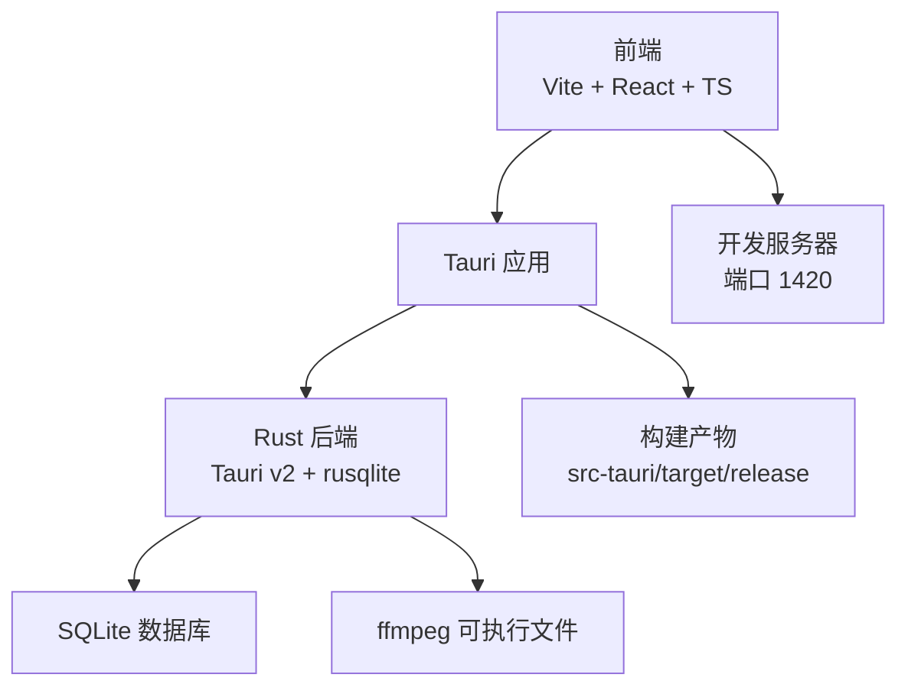
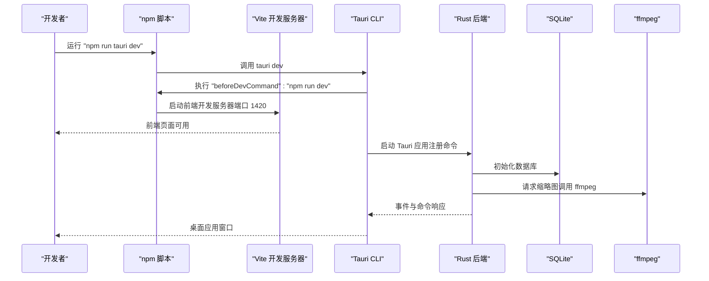
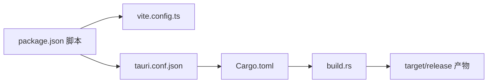

# 环境配置问题

<cite>
**本文引用的文件**
- [package.json](file://package.json)
- [vite.config.ts](file://vite.config.ts)
- [src-tauri/Cargo.toml](file://src-tauri/Cargo.toml)
- [src-tauri/tauri.conf.json](file://src-tauri/tauri.conf.json)
- [src-tauri/build.rs](file://src-tauri/build.rs)
- [src-tauri/.cargo/config.toml](file://src-tauri/.cargo/config.toml)
- [tailwind.config.ts](file://tailwind.config.ts)
- [tsconfig.json](file://tsconfig.json)
- [.github/workflows/main.yml](file://.github/workflows/main.yml)
- [README.md](file://README.md)
- [DEVELOPMENT.md](file://DEVELOPMENT.md)
- [src-tauri/src/main.rs](file://src-tauri/src/main.rs)
- [src-tauri/src/thumbnail/mod.rs](file://src-tauri/src/thumbnail/mod.rs)
- [src-tauri/src/services/scanner.rs](file://src-tauri/src/services/scanner.rs)
</cite>

## 目录
1. [简介](#简介)
2. [项目结构](#项目结构)
3. [核心组件](#核心组件)
4. [架构总览](#架构总览)
5. [详细组件分析](#详细组件分析)
6. [依赖关系分析](#依赖关系分析)
7. [性能考虑](#性能考虑)
8. [故障排查指南](#故障排查指南)
9. [结论](#结论)
10. [附录](#附录)

## 简介
本文件面向 Medex 的开发环境配置问题，提供从 Node.js/npm/yarn 版本兼容性、Rust 工具链、Tauri 开发环境到跨平台特殊问题的完整解决方案。内容覆盖依赖安装失败、开发服务器启动失败、热重载失效、构建脚本错误、权限限制与防病毒冲突、以及缩略图生成失败等常见问题的定位与修复方法。

## 项目结构
- 前端：React + TypeScript + Vite + TailwindCSS，开发端口 1420，严格端口模式。
- 后端：Tauri v2 + Rust 1.77.2+，SQLite（rusqlite bundled），缩略图系统由 Rust 后端负责，依赖 ffmpeg。
- 配置：package.json 脚本驱动开发与构建；tauri.conf.json 配置前端开发 URL、构建命令与安全策略；Cargo.toml 指定 Rust 版本与依赖；GitHub Actions 用于跨平台发布。

图表来源
- [vite.config.ts:1-11](file://vite.config.ts#L1-L11)
- [src-tauri/tauri.conf.json:6-11](file://src-tauri/tauri.conf.json#L6-L11)
- [src-tauri/Cargo.toml:8](file://src-tauri/Cargo.toml#L8)
- [src-tauri/src/main.rs:10-69](file://src-tauri/src/main.rs#L10-L69)

章节来源
- [README.md:50-94](file://README.md#L50-L94)
- [vite.config.ts:1-11](file://vite.config.ts#L1-L11)
- [src-tauri/tauri.conf.json:6-11](file://src-tauri/tauri.conf.json#L6-L11)
- [src-tauri/Cargo.toml:8](file://src-tauri/Cargo.toml#L8)

## 核心组件
- Node.js 与包管理器：项目要求 Node.js 18+，使用 npm/pnpm。前端脚本通过 package.json 驱动开发与构建。
- Rust 工具链：Rust 1.77.2+，使用 crates-io 镜像（清华大学 TUNA）加速依赖下载。
- Tauri：v2，前端开发 URL 与构建命令在 tauri.conf.json 中配置；资源协议启用以支持 convertFileSrc 预览本地文件。
- 构建与打包：Vite 构建前端，Tauri CLI 触发 Rust 构建；GitHub Actions 在 macOS 与 Windows 上自动发布。

章节来源
- [README.md:52-56](file://README.md#L52-L56)
- [src-tauri/.cargo/config.toml:1-5](file://src-tauri/.cargo/config.toml#L1-L5)
- [src-tauri/tauri.conf.json:6-11](file://src-tauri/tauri.conf.json#L6-L11)
- [.github/workflows/main.yml:23-27](file://.github/workflows/main.yml#L23-L27)

## 架构总览
下图展示了开发与构建的关键流程：前端开发服务器、Tauri 前置命令、Rust 后端初始化与命令注册、以及资源协议与外部二进制（ffmpeg）的关系。

图表来源
- [src-tauri/tauri.conf.json:7-10](file://src-tauri/tauri.conf.json#L7-L10)
- [vite.config.ts:6-9](file://vite.config.ts#L6-L9)
- [src-tauri/src/main.rs:14-48](file://src-tauri/src/main.rs#L14-L48)
- [src-tauri/src/thumbnail/mod.rs:32-49](file://src-tauri/src/thumbnail/mod.rs#L32-L49)

## 详细组件分析

### Node.js 与包管理器版本兼容性
- 版本要求：Node.js 18+，CI 使用 Node.js 20。
- 包管理器：npm 或 pnpm 均可；项目未锁定 yarn。
- 前端脚本：dev、build、preview、tauri，分别对应 Vite 开发、TypeScript + Vite 构建、本地预览、Tauri CLI。
- TypeScript 与 Vite 配置：tsconfig.json 使用 bundler 解析、严格模式；vite.config.ts 指定端口与严格端口。

常见问题与修复
- 依赖安装失败（权限/网络）：更换 npm registry、使用 pnpm、清理缓存后重试。
- Node 版本过低：升级至 18+，确保与 CI 一致。
- 端口占用：修改 vite.config.ts 的 server.port 或释放 1420 端口。

章节来源
- [README.md:52-56](file://README.md#L52-L56)
- [.github/workflows/main.yml:24-25](file://.github/workflows/main.yml#L24-L25)
- [package.json:6-11](file://package.json#L6-L11)
- [tsconfig.json:1-19](file://tsconfig.json#L1-L19)
- [vite.config.ts:6-9](file://vite.config.ts#L6-L9)

### Rust 工具链配置
- Rust 版本：1.77.2+，CI 使用 dtolnay/rust-toolchain@stable。
- 镜像源：使用 TUNA 清华大学镜像加速 crates.io。
- 依赖：rusqlite（bundled）、tauri、tauri 插件、walkdir、serde 等。
- 构建：build.rs 调用 tauri_build::build，配合 tauri.conf.json 的 bundle.externalBin。

常见问题与修复
- rustc 版本过低：升级到 1.77.2+。
- 网络缓慢：启用 .cargo/config.toml 的 tuna 镜像。
- 外部二进制缺失导致构建失败：根据 externalBin 配置补齐对应平台二进制。

章节来源
- [src-tauri/Cargo.toml:8](file://src-tauri/Cargo.toml#L8)
- [.github/workflows/main.yml:27](file://.github/workflows/main.yml#L27)
- [src-tauri/.cargo/config.toml:1-5](file://src-tauri/.cargo/config.toml#L1-L5)
- [src-tauri/tauri.conf.json:32](file://src-tauri/tauri.conf.json#L32)
- [src-tauri/build.rs:1-4](file://src-tauri/build.rs#L1-L4)

### Tauri 开发环境设置
- 前端开发 URL：devUrl 为 http://localhost:1420，与 vite.config.ts 一致。
- 前置命令：beforeDevCommand 与 beforeBuildCommand 分别指向 npm run dev 与 npm run build。
- 资源协议：开启 assetProtocol 并设置 scope 为 "**"，确保 convertFileSrc 生效。
- 插件：启用 updater，配置 pubkey 与 endpoint；dialog 插件默认启用。
- 菜单与命令：main.rs 中注册了扫描、标签、缩略图等命令，并初始化数据库与缩略图系统。

常见问题与修复
- 资源协议导致“unsupported URL”：前端必须使用 convertFileSrc(path)。
- 对话框权限：检查 capabilities/default.json 是否包含 dialog:allow-open。
- 开发服务器未启动：确认 devUrl 与 vite 端口一致，且端口未被占用。

章节来源
- [src-tauri/tauri.conf.json:6-27](file://src-tauri/tauri.conf.json#L6-L27)
- [vite.config.ts:6-9](file://vite.config.ts#L6-L9)
- [src-tauri/src/main.rs:14-65](file://src-tauri/src/main.rs#L14-L65)
- [DEVELOPMENT.md:418-437](file://DEVELOPMENT.md#L418-L437)

### 跨平台开发特殊问题
- macOS Catalina+ 权限限制：首次运行需授予沙盒外目录访问权限；若涉及 ffmpeg，确保其可执行权限。
- Windows 防病毒软件冲突：关闭实时保护或添加排除目录；必要时以管理员身份运行。
- Linux 发行版依赖：安装 libwebkit2gtk、libappindicator3-1、gcc、g++、pkg-config、libcurl4-nss-dev、libsecret-1-dev 等系统依赖（参考 Tauri 官方文档）。

章节来源
- [README.md:52-56](file://README.md#L52-L56)
- [DEVELOPMENT.md:472-481](file://DEVELOPMENT.md#L472-L481)

### 缩略图与 ffmpeg 配置
- 任务并发与队列：固定 4 个 worker，队列容量 2048；去重集合防止重复请求。
- ffmpeg 解析策略：优先内置二进制 → 开发目录 → 系统 PATH → macOS 常见路径；若均不可用则返回错误。
- 前端触发：request_thumbnail 命令；后端事件 thumbnail_ready 通知前端缓存更新。

常见问题与修复
- 缩略图一直失败：检查 which ffmpeg 输出；将 ffmpeg 放置到内置路径或系统 PATH。
- 事件未到达：确认前端监听 thumbnail_ready 且 convertFileSrc 正确使用。

章节来源
- [src-tauri/src/thumbnail/mod.rs:14-49](file://src-tauri/src/thumbnail/mod.rs#L14-L49)
- [DEVELOPMENT.md:364-377](file://DEVELOPMENT.md#L364-L377)
- [DEVELOPMENT.md:577-586](file://DEVELOPMENT.md#L577-L586)

## 依赖关系分析
- 前端依赖：@tauri-apps/api、@tauri-apps/cli、react、vite、tailwindcss、typescript 等。
- 后端依赖：tauri、rusqlite(bundled)、tauri-plugin-dialog、tauri-plugin-updater、walkdir、serde 等。
- 构建链路：npm run build → tsc + vite build；npm run tauri dev → 前端 devUrl + Rust 构建。

图表来源
- [package.json:6-11](file://package.json#L6-L11)
- [vite.config.ts:1-11](file://vite.config.ts#L1-L11)
- [src-tauri/tauri.conf.json:6-11](file://src-tauri/tauri.conf.json#L6-L11)
- [src-tauri/Cargo.toml:10-23](file://src-tauri/Cargo.toml#L10-L23)
- [src-tauri/build.rs:1-4](file://src-tauri/build.rs#L1-L4)

章节来源
- [package.json:12-34](file://package.json#L12-L34)
- [src-tauri/Cargo.toml:13-23](file://src-tauri/Cargo.toml#L13-L23)

## 性能考虑
- 前端性能：react-window 虚拟列表/网格、缩略图优先级调度（可见 > 下一屏 > overscan）、并发限制与队列上限。
- 后端性能：批量插入事务、walkdir 错误容错、SQLite 索引优化。
- 构建性能：启用镜像源、合理拆分命令与缓存。

章节来源
- [DEVELOPMENT.md:306-341](file://DEVELOPMENT.md#L306-L341)
- [src-tauri/src/services/scanner.rs:90-115](file://src-tauri/src/services/scanner.rs#L90-L115)

## 故障排查指南

### 依赖安装失败
- 症状：npm/yarn/pnpm 安装报错（权限/网络/缓存）。
- 排查与修复：
  - 更换 npm registry（如使用 cnpm 或 pnpm）。
  - 清理缓存后重试。
  - 确保 Node.js 版本满足 18+ 要求。

章节来源
- [README.md:52-56](file://README.md#L52-L56)

### 开发服务器启动失败
- 症状：无法访问 http://localhost:1420。
- 排查与修复：
  - 确认 vite.config.ts 的 server.port 与 tauri.conf.json 的 devUrl 一致。
  - 使用 strictPort=true，避免端口漂移。
  - 检查端口占用并释放 1420。

章节来源
- [vite.config.ts:6-9](file://vite.config.ts#L6-L9)
- [src-tauri/tauri.conf.json:10](file://src-tauri/tauri.conf.json#L10)

### 热重载失效
- 症状：修改前端代码后页面未刷新。
- 排查与修复：
  - 确认 Vite 插件配置正确（@vitejs/plugin-react）。
  - 检查文件保存与热重载相关设置（IDE 插件）。

章节来源
- [vite.config.ts:1-2](file://vite.config.ts#L1-L2)

### 构建脚本错误
- 症状：npm run build 或 npm run tauri build 失败。
- 排查与修复：
  - 先执行 npm run build，再在 src-tauri 目录执行 cargo check。
  - 若存在 externalBin 配置，确保对应平台二进制存在。

章节来源
- [DEVELOPMENT.md:461-467](file://DEVELOPMENT.md#L461-L467)
- [src-tauri/tauri.conf.json:32](file://src-tauri/tauri.conf.json#L32)

### 本地文件无法预览（unsupported URL）
- 症状：直接使用绝对路径加载本地文件失败。
- 排查与修复：
  - 前端必须使用 convertFileSrc(path) 将文件路径转换为可访问的 URL。

章节来源
- [DEVELOPMENT.md:573-576](file://DEVELOPMENT.md#L573-L576)

### 缩略图生成失败
- 症状：视频缩略图一直失败或无响应。
- 排查与修复：
  - 检查 which ffmpeg 输出；若无输出，安装 ffmpeg 或将二进制放入内置路径。
  - 确认资源协议已启用，convertFileSrc 正常工作。

章节来源
- [DEVELOPMENT.md:577-586](file://DEVELOPMENT.md#L577-L586)
- [src-tauri/src/thumbnail/mod.rs:32-49](file://src-tauri/src/thumbnail/mod.rs#L32-L49)
- [DEVELOPMENT.md:429-437](file://DEVELOPMENT.md#L429-L437)

### 对话框权限问题（dialog.open not allowed）
- 症状：调用对话框弹窗时报错。
- 排查与修复：
  - 检查 capabilities/default.json 是否包含 dialog:allow-open 与 dialog:default。

章节来源
- [DEVELOPMENT.md:566-572](file://DEVELOPMENT.md#L566-L572)

### 页面卡顿/白屏
- 症状：滚动卡顿或白屏。
- 排查与修复：
  - 避免在网格内批量挂载 <video>。
  - 确认已启用 react-window 虚拟化。
  - 控制缩略图请求并发，避免过高负载。

章节来源
- [DEVELOPMENT.md:587-595](file://DEVELOPMENT.md#L587-L595)

### 跨平台特殊问题
- macOS Catalina+：首次运行需授予目录访问权限；ffmpeg 可执行权限。
- Windows 防病毒：关闭实时保护或添加排除；必要时以管理员身份运行。
- Linux：安装系统依赖（libwebkit2gtk、libappindicator3-1、gcc/g++、pkg-config、libcurl4-nss-dev、libsecret-1-dev）。

章节来源
- [DEVELOPMENT.md:472-481](file://DEVELOPMENT.md#L472-L481)
- [README.md:52-56](file://README.md#L52-L56)

## 结论
Medex 的开发环境配置围绕 Node.js 18+、Rust 1.77.2+、Tauri v2 与 Vite 展开。通过统一的脚本与配置（package.json、vite.config.ts、tauri.conf.json、Cargo.toml），可实现前后端一体化开发与构建。针对常见问题，建议优先核对版本要求、端口与资源协议、ffmpeg 可用性与系统权限，并结合镜像源与外部二进制策略提升稳定性与性能。

## 附录
- 快速检查清单
  - Node.js ≥ 18，npm/pnpm 可用
  - Rust ≥ 1.77.2，启用 TUNA 镜像
  - Vite 端口 1420，devUrl 一致
  - 资源协议启用，convertFileSrc 正确使用
  - ffmpeg 可用或内置二进制就绪
  - capabilities 包含 dialog:allow-open
  - Linux 安装系统依赖；Windows 关闭防病毒实时保护或添加排除