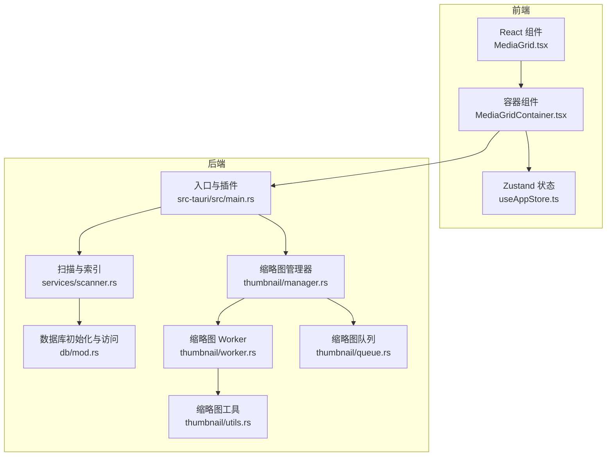
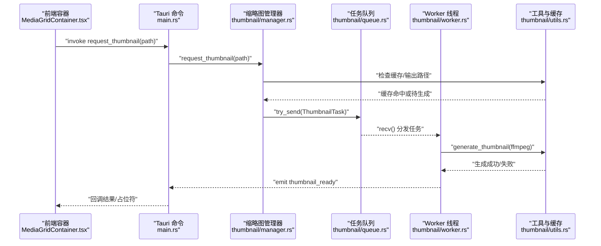
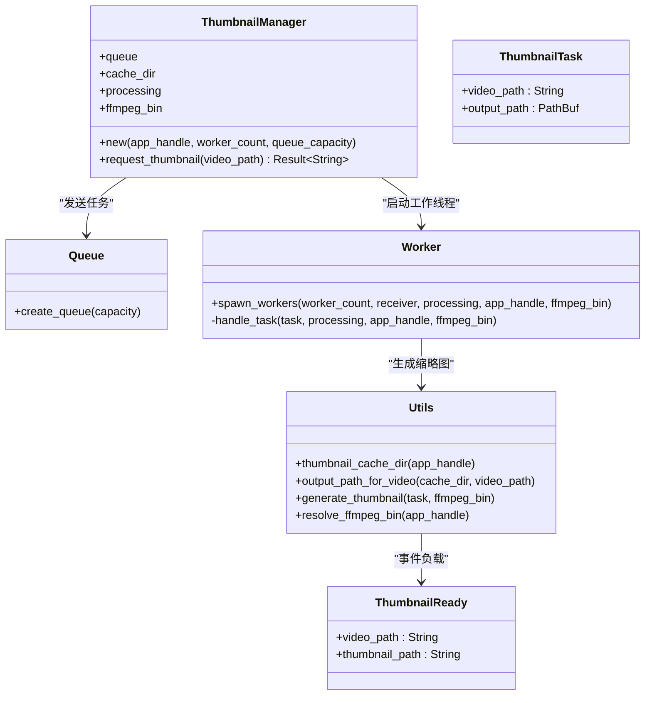
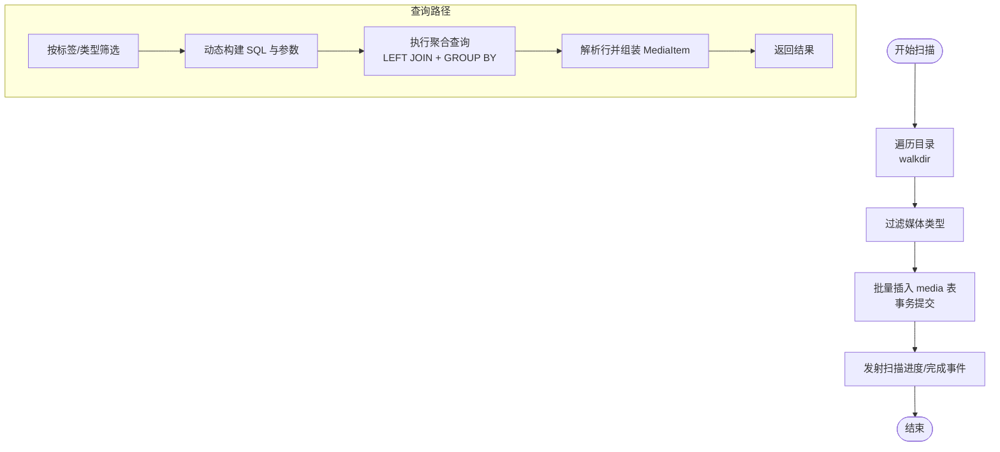
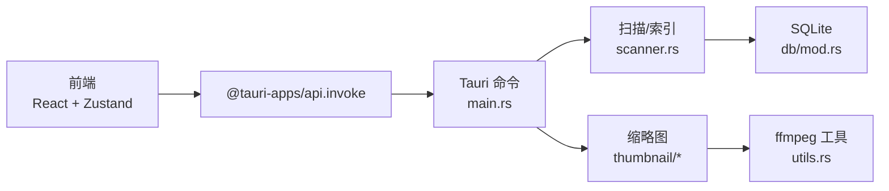

# 性能优化

<cite>
**本文引用的文件**
- [src-tauri/src/main.rs](file://src-tauri/src/main.rs)
- [src-tauri/src/thumbnail/mod.rs](file://src-tauri/src/thumbnail/mod.rs)
- [src-tauri/src/thumbnail/manager.rs](file://src-tauri/src/thumbnail/manager.rs)
- [src-tauri/src/thumbnail/queue.rs](file://src-tauri/src/thumbnail/queue.rs)
- [src-tauri/src/thumbnail/worker.rs](file://src-tauri/src/thumbnail/worker.rs)
- [src-tauri/src/thumbnail/utils.rs](file://src-tauri/src/thumbnail/utils.rs)
- [src-tauri/src/services/scanner.rs](file://src-tauri/src/services/scanner.rs)
- [src-tauri/src/db/mod.rs](file://src-tauri/src/db/mod.rs)
- [src/store/useAppStore.ts](file://src/store/useAppStore.ts)
- [src/components/MediaGrid.tsx](file://src/components/MediaGrid.tsx)
- [src/containers/MediaGridContainer.tsx](file://src/containers/MediaGridContainer.tsx)
- [src-tauri/Cargo.toml](file://src-tauri/Cargo.toml)
- [package.json](file://package.json)
</cite>

## 目录
1. [简介](#简介)
2. [项目结构](#项目结构)
3. [核心组件](#核心组件)
4. [架构总览](#架构总览)
5. [详细组件分析](#详细组件分析)
6. [依赖关系分析](#依赖关系分析)
7. [性能考量与优化策略](#性能考量与优化策略)
8. [故障排查指南](#故障排查指南)
9. [结论](#结论)
10. [附录：性能测试与基准测试](#附录性能测试与基准测试)

## 简介
本指南面向 Medex 桌面应用，聚焦于媒体资产管理场景下的系统性能优化。内容涵盖：
- 性能问题识别方法：内存使用监控、CPU 占用分析、I/O 性能评估
- 面向媒体库的大规模场景优化策略：虚拟列表渲染优化、缩略图生成并发控制、数据库查询优化
- 缩略图系统的性能瓶颈与优化：并发 worker 数量、队列容量、缓存策略
- 内存泄漏检测与修复：前端状态管理与后端资源管理
- 性能测试与基准测试方法，确保在大型媒体库下的稳定运行

## 项目结构
Medex 采用 Tauri v2 架构，前端为 React + TypeScript，后端为 Rust（Tauri 后端服务）。核心性能相关模块分布如下：
- 前端：虚拟列表渲染（react-window）、全局状态（Zustand）、媒体网格展示
- 后端：缩略图系统（多线程 worker + 有界队列）、扫描与索引（批量插入 + 事务）、SQLite 数据库（索引与查询）

图表来源
- [src-tauri/src/main.rs:10-68](file://src-tauri/src/main.rs#L10-L68)
- [src-tauri/src/services/scanner.rs:250-341](file://src-tauri/src/services/scanner.rs#L250-L341)
- [src-tauri/src/db/mod.rs:45-64](file://src-tauri/src/db/mod.rs#L45-L64)
- [src-tauri/src/thumbnail/manager.rs:24-49](file://src-tauri/src/thumbnail/manager.rs#L24-L49)
- [src-tauri/src/thumbnail/worker.rs:13-50](file://src-tauri/src/thumbnail/worker.rs#L13-L50)
- [src-tauri/src/thumbnail/queue.rs:8-11](file://src-tauri/src/thumbnail/queue.rs#L8-L11)
- [src-tauri/src/thumbnail/utils.rs:36-61](file://src-tauri/src/thumbnail/utils.rs#L36-L61)
- [src/components/MediaGrid.tsx:70-212](file://src/components/MediaGrid.tsx#L70-L212)
- [src/store/useAppStore.ts:145-394](file://src/store/useAppStore.ts#L145-L394)
- [src/containers/MediaGridContainer.tsx:359-396](file://src/containers/MediaGridContainer.tsx#L359-L396)

章节来源
- [src-tauri/src/main.rs:10-68](file://src-tauri/src/main.rs#L10-L68)
- [src/components/MediaGrid.tsx:70-212](file://src/components/MediaGrid.tsx#L70-L212)
- [src/store/useAppStore.ts:145-394](file://src/store/useAppStore.ts#L145-L394)

## 核心组件
- 缩略图系统：基于同步有界通道的多线程任务队列，支持占位符返回与缓存命中直接返回；支持 ffmpeg 可选路径解析与缩略图生成。
- 扫描与索引：目录遍历扫描媒体文件，批量插入到 SQLite，事务提交提升吞吐；提供按标签与类型的筛选查询。
- 数据库层：初始化表结构与索引，提供连接池封装与并发安全访问。
- 前端渲染：react-window 虚拟列表，Grid/List 双模式，懒加载缩略图，ResizeObserver 动态尺寸计算。

章节来源
- [src-tauri/src/thumbnail/mod.rs:14-16](file://src-tauri/src/thumbnail/mod.rs#L14-L16)
- [src-tauri/src/thumbnail/manager.rs:51-106](file://src-tauri/src/thumbnail/manager.rs#L51-L106)
- [src-tauri/src/services/scanner.rs:54-88](file://src-tauri/src/services/scanner.rs#L54-L88)
- [src-tauri/src/services/scanner.rs:90-115](file://src-tauri/src/services/scanner.rs#L90-L115)
- [src-tauri/src/db/mod.rs:12-43](file://src-tauri/src/db/mod.rs#L12-L43)
- [src/components/MediaGrid.tsx:133-168](file://src/components/MediaGrid.tsx#L133-L168)
- [src/components/MediaGrid.tsx:170-212](file://src/components/MediaGrid.tsx#L170-L212)

## 架构总览
缩略图系统与扫描索引是影响性能的关键路径。缩略图通过命令接口从前端触发，后端以固定数量 worker 并发处理，队列容量限制背压；扫描阶段批量写入数据库，减少事务开销；前端使用虚拟列表避免全量 DOM 渲染。

图表来源
- [src-tauri/src/main.rs:49-65](file://src-tauri/src/main.rs#L49-L65)
- [src-tauri/src/thumbnail/mod.rs:57-61](file://src-tauri/src/thumbnail/mod.rs#L57-L61)
- [src-tauri/src/thumbnail/manager.rs:51-106](file://src-tauri/src/thumbnail/manager.rs#L51-L106)
- [src-tauri/src/thumbnail/queue.rs:8-11](file://src-tauri/src/thumbnail/queue.rs#L8-L11)
- [src-tauri/src/thumbnail/worker.rs:52-79](file://src-tauri/src/thumbnail/worker.rs#L52-L79)
- [src-tauri/src/thumbnail/utils.rs:36-61](file://src-tauri/src/thumbnail/utils.rs#L36-L61)
- [src/containers/MediaGridContainer.tsx:359-396](file://src/containers/MediaGridContainer.tsx#L359-L396)

## 详细组件分析

### 缩略图系统（并发、队列与缓存）
- 并发模型：固定 worker 数量，每个 worker 从共享接收端阻塞取任务，循环处理，避免主线程阻塞。
- 队列容量：有界同步通道，满载时返回占位符，防止无界增长导致内存压力。
- 缓存策略：输出路径基于视频路径哈希，命中直接返回；处理中集合去重，避免重复排队。
- ffmpeg 解析：优先资源内嵌二进制，其次开发目录，再回退系统 PATH，最后常见 Homebrew 路径。
- 事件回传：生成完成后通过 Tauri 事件通知前端，前端更新缩略图映射。

图表来源
- [src-tauri/src/thumbnail/manager.rs:16-107](file://src-tauri/src/thumbnail/manager.rs#L16-L107)
- [src-tauri/src/thumbnail/mod.rs:18-28](file://src-tauri/src/thumbnail/mod.rs#L18-L28)
- [src-tauri/src/thumbnail/queue.rs:5-11](file://src-tauri/src/thumbnail/queue.rs#L5-L11)
- [src-tauri/src/thumbnail/worker.rs:13-96](file://src-tauri/src/thumbnail/worker.rs#L13-L96)
- [src-tauri/src/thumbnail/utils.rs:20-61](file://src-tauri/src/thumbnail/utils.rs#L20-L61)

章节来源
- [src-tauri/src/thumbnail/mod.rs:14-16](file://src-tauri/src/thumbnail/mod.rs#L14-L16)
- [src-tauri/src/thumbnail/manager.rs:51-106](file://src-tauri/src/thumbnail/manager.rs#L51-L106)
- [src-tauri/src/thumbnail/worker.rs:13-96](file://src-tauri/src/thumbnail/worker.rs#L13-L96)
- [src-tauri/src/thumbnail/utils.rs:36-61](file://src-tauri/src/thumbnail/utils.rs#L36-L61)

### 扫描与索引（批量插入与查询）
- 扫描：walkdir 遍历目录，过滤媒体类型，批量插入到 media 表，事务一次性提交，显著降低写放大。
- 查询：聚合查询包含最近观看视图与标签拼接，使用 LEFT JOIN 与 GROUP BY，配合索引提升性能。
- 标签筛选：动态拼接 SQL 与参数绑定，按标签集合交集过滤，支持类型过滤与“全部”场景。

图表来源
- [src-tauri/src/services/scanner.rs:54-88](file://src-tauri/src/services/scanner.rs#L54-L88)
- [src-tauri/src/services/scanner.rs:90-115](file://src-tauri/src/services/scanner.rs#L90-L115)
- [src-tauri/src/services/scanner.rs:160-163](file://src-tauri/src/services/scanner.rs#L160-L163)
- [src-tauri/src/services/scanner.rs:170-247](file://src-tauri/src/services/scanner.rs#L170-L247)
- [src-tauri/src/services/scanner.rs:410-458](file://src-tauri/src/services/scanner.rs#L410-L458)

章节来源
- [src-tauri/src/services/scanner.rs:250-341](file://src-tauri/src/services/scanner.rs#L250-L341)
- [src-tauri/src/services/scanner.rs:117-158](file://src-tauri/src/services/scanner.rs#L117-L158)
- [src-tauri/src/services/scanner.rs:170-247](file://src-tauri/src/services/scanner.rs#L170-L247)

### 数据库层（索引与并发访问）
- 初始化：创建媒体、标签、关联与最近观看表，建立必要索引（媒体路径、标签关联键、最近观看时间）。
- 连接封装：OnceCell + Mutex 封装单例连接，with_connection 提供并发安全访问。
- 列扩展：运行时检测并添加缺失列（如 is_favorite），保证迁移兼容性。

章节来源
- [src-tauri/src/db/mod.rs:12-43](file://src-tauri/src/db/mod.rs#L12-L43)
- [src-tauri/src/db/mod.rs:97-110](file://src-tauri/src/db/mod.rs#L97-L110)
- [src-tauri/src/db/mod.rs:66-95](file://src-tauri/src/db/mod.rs#L66-L95)

### 前端渲染（虚拟列表与懒加载）
- Grid/List 双模式：Grid 使用 react-window FixedSizeGrid，List 使用 FixedSizeList，均配置 overscan 控制可见前后缓冲。
- 缩略图懒加载：根据视频路径从 thumbnails 映射取缩略图，不存在时显示占位符，等待后端事件回传。
- 尺寸监听：ResizeObserver 计算容器尺寸，避免强制布局抖动。

章节来源
- [src/components/MediaGrid.tsx:133-168](file://src/components/MediaGrid.tsx#L133-L168)
- [src/components/MediaGrid.tsx:170-212](file://src/components/MediaGrid.tsx#L170-L212)
- [src/components/MediaGrid.tsx:323-350](file://src/components/MediaGrid.tsx#L323-L350)

## 依赖关系分析
- 前端依赖：react、react-window、zustand、@tauri-apps/api 等。
- 后端依赖：tauri、rusqlite（带打包特性）、walkdir、anyhow、once_cell 等。
- 关键耦合点：前端通过 invoke 调用后端命令；后端通过事件向前端推送缩略图就绪；数据库作为扫描与索引的持久化存储。

图表来源
- [src-tauri/src/main.rs:49-65](file://src-tauri/src/main.rs#L49-L65)
- [src-tauri/src/services/scanner.rs:250-341](file://src-tauri/src/services/scanner.rs#L250-L341)
- [src-tauri/src/db/mod.rs:45-64](file://src-tauri/src/db/mod.rs#L45-L64)
- [src-tauri/src/thumbnail/utils.rs:71-96](file://src-tauri/src/thumbnail/utils.rs#L71-L96)
- [package.json:12-22](file://package.json#L12-L22)
- [src-tauri/Cargo.toml:13-23](file://src-tauri/Cargo.toml#L13-L23)

章节来源
- [package.json:12-22](file://package.json#L12-L22)
- [src-tauri/Cargo.toml:13-23](file://src-tauri/Cargo.toml#L13-L23)

## 性能考量与优化策略

### 1) 缩略图系统性能瓶颈与优化
- 并发 worker 数量
  - 当前固定为 4。建议依据 CPU 核心数与 ffmpeg 编码器特性动态调整；在高核 CPU 上适度增加可提升吞吐，但需避免过度竞争 I/O。
  - 优化建议：在设置页暴露可调参数，结合系统信息与历史生成耗时进行自适应。
- 队列容量
  - 当前为 2048。满载时会返回占位符并丢弃后续任务，可能造成视觉闪烁或延迟。建议：
    - 引入优先级队列：对可视区域附近元素提高优先级
    - 动态容量：根据队列积压与内存占用动态调节
- 缓存策略
  - 输出路径基于视频路径哈希，命中直接返回。建议：
    - 增加 LRU 淘汰策略，避免缓存无限增长
    - 对生成失败的路径做短期缓存抑制，避免反复尝试
- ffmpeg 可用性
  - 若未找到 ffmpeg，缩略图生成被禁用。建议：
    - 在设置页提示并引导安装
    - 提供离线生成选项（如外部工具链）

章节来源
- [src-tauri/src/thumbnail/mod.rs:14-16](file://src-tauri/src/thumbnail/mod.rs#L14-L16)
- [src-tauri/src/thumbnail/manager.rs:83-103](file://src-tauri/src/thumbnail/manager.rs#L83-L103)
- [src-tauri/src/thumbnail/utils.rs:71-96](file://src-tauri/src/thumbnail/utils.rs#L71-L96)

### 2) 虚拟列表渲染优化
- Grid/List overscan
  - Grid 设置为 3 行/1 列，List 为 8。建议：
    - 根据屏幕分辨率与缩略图尺寸动态计算 overscan
    - 在滚动速率较高时降低 overscan，减少重绘
- 懒加载与占位符
  - 视频缩略图为空时显示占位符，等待事件回传后再渲染。建议：
    - 为不同媒体类型设置差异化占位符
    - 对已请求但尚未生成的任务做去重与限流
- 尺寸监听
  - 使用 ResizeObserver 计算列数与行数，避免频繁重排。建议：
    - 节流/防抖尺寸变化回调
    - 首屏预估尺寸，减少首次渲染抖动

章节来源
- [src/components/MediaGrid.tsx:170-212](file://src/components/MediaGrid.tsx#L170-L212)
- [src/components/MediaGrid.tsx:133-168](file://src/components/MediaGrid.tsx#L133-L168)
- [src/components/MediaGrid.tsx:323-350](file://src/components/MediaGrid.tsx#L323-L350)

### 3) 数据库查询与写入优化
- 批量插入与事务
  - 插入阶段使用事务一次性提交，显著降低 WAL/日志写入成本。建议：
    - 控制批次大小，避免单次事务过大导致锁竞争
    - 在扫描过程中分批发射进度事件，提升用户感知
- 查询优化
  - 聚合查询包含 LEFT JOIN + GROUP BY，已具备必要索引。建议：
    - 对标签筛选的 SQL 参数化绑定已正确，避免二次编译
    - 对高频查询（如“最近查看”）考虑物化视图或二级索引
- 最近观看表维护
  - 限制保留条目数量，避免表膨胀。建议：
    - 结合业务需求调整上限
    - 定期归档或压缩历史记录

章节来源
- [src-tauri/src/services/scanner.rs:90-115](file://src-tauri/src/services/scanner.rs#L90-L115)
- [src-tauri/src/services/scanner.rs:117-158](file://src-tauri/src/services/scanner.rs#L117-L158)
- [src-tauri/src/services/scanner.rs:356-389](file://src-tauri/src/services/scanner.rs#L356-L389)
- [src-tauri/src/db/mod.rs:12-43](file://src-tauri/src/db/mod.rs#L12-L43)

### 4) 内存泄漏检测与修复
- 前端
  - Zustand 状态：确认组件卸载时不会残留订阅或定时器；避免在状态更新中创建闭包导致对象常驻。
  - 虚拟列表：确保组件销毁时移除 ResizeObserver 与滚动监听。
- 后端
  - OnceCell + Mutex 的连接与管理器需确保生命周期与应用关闭流程一致，避免线程泄漏。
  - 缩略图队列与 worker 需在应用退出时优雅关闭，避免阻塞进程退出。

章节来源
- [src/store/useAppStore.ts:145-394](file://src/store/useAppStore.ts#L145-L394)
- [src-tauri/src/db/mod.rs:97-110](file://src-tauri/src/db/mod.rs#L97-L110)
- [src-tauri/src/thumbnail/manager.rs:24-49](file://src-tauri/src/thumbnail/manager.rs#L24-L49)

### 5) CPU 与 I/O 性能评估
- CPU 占用
  - 使用系统自带性能分析工具（如 macOS Activity Monitor、Windows Performance Monitor）观察 ffmpeg 子进程 CPU 利用率峰值与平均值。
  - 在高并发 worker 下，适当降低缩略图尺寸或帧采样间隔以平衡质量与性能。
- I/O 性能
  - 监控磁盘读写：扫描阶段大量文件读取，建议使用 SSD 或将扫描路径指向本地高速盘。
  - 缩略图生成涉及临时文件写入，建议将缓存目录置于高性能磁盘。

### 6) 内存使用监控
- 前端：使用浏览器性能面板（Memory）观察堆快照变化，定位大数组、闭包与事件监听器泄漏。
- 后端：Rust 程序可通过系统工具或火焰图工具（perf/flamegraph）观测线程栈与内存分配热点。

## 故障排查指南
- 缩略图不生成
  - 检查 ffmpeg 是否可用与路径解析是否成功；若不可用，前端将收到错误回调。
  - 查看队列是否满载导致任务被丢弃。
- 扫描卡顿
  - 大型媒体库扫描时，确认事务批处理正常；关注进度事件是否持续发射。
  - 检查磁盘 I/O 是否成为瓶颈。
- 查询缓慢
  - 确认索引存在且未被破坏；检查 SQL 参数绑定与查询计划。
- 前端渲染卡顿
  - 检查 overscan 设置是否过高；确认 ResizeObserver 回调节流生效。

章节来源
- [src-tauri/src/thumbnail/utils.rs:71-96](file://src-tauri/src/thumbnail/utils.rs#L71-L96)
- [src-tauri/src/thumbnail/manager.rs:83-103](file://src-tauri/src/thumbnail/manager.rs#L83-L103)
- [src-tauri/src/services/scanner.rs:250-341](file://src-tauri/src/services/scanner.rs#L250-L341)
- [src-tauri/src/db/mod.rs:12-43](file://src-tauri/src/db/mod.rs#L12-L43)

## 结论
Medex 的性能优化应围绕“任务队列背压 + 并发 worker + 缓存命中 + 虚拟渲染 + 批量事务 + 索引优化”展开。通过动态调整 worker 数量与队列容量、引入优先级与淘汰策略、优化虚拟列表与懒加载、以及持续的数据库与 I/O 监控，可在大规模媒体库场景下保持流畅体验。

## 附录：性能测试与基准测试

### 测试目标
- 缩略图生成吞吐：单位时间内生成的缩略图数量
- 渲染响应：Grid/List 滚动时的帧率与掉帧情况
- 扫描速度：单位时间内扫描的媒体文件数量
- 数据库写入：批量插入的事务耗时与锁等待
- 内存占用：前端与后端的堆内存峰值与稳定态

### 基准测试方法
- 缩略图生成
  - 准备 N 个不同长度的视频文件，分别测试不同 worker 数量与队列容量组合，记录生成耗时与 CPU/I/O 利用率。
- 虚拟渲染
  - 使用 react-window 的 onItemsRendered 回调统计可见范围变更频率与渲染耗时，对比不同 overscan 设置。
- 扫描与索引
  - 准备包含 M 个媒体文件的目录树，测量扫描与插入总耗时，记录事务提交耗时。
- 数据库查询
  - 针对高频查询构造压力测试，测量 P50/P95 延迟与吞吐。

### 工具与脚本建议
- 前端：浏览器性能面板、React DevTools Profiler
- 后端：perf（Linux/macOS）、Visual Studio Profiler（Windows）
- 自动化：编写 Node/Rust 脚本驱动上述测试，收集指标并生成报告