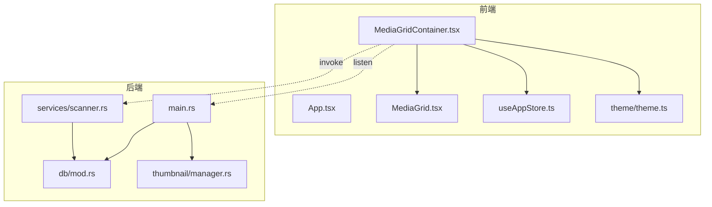
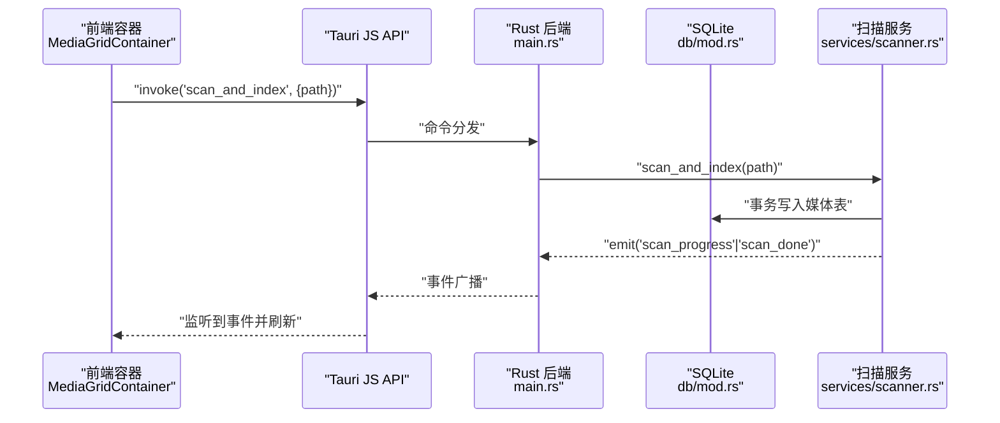
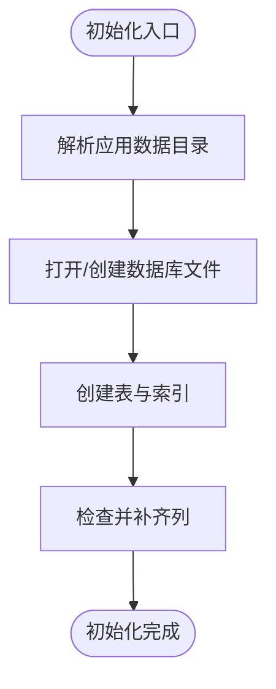
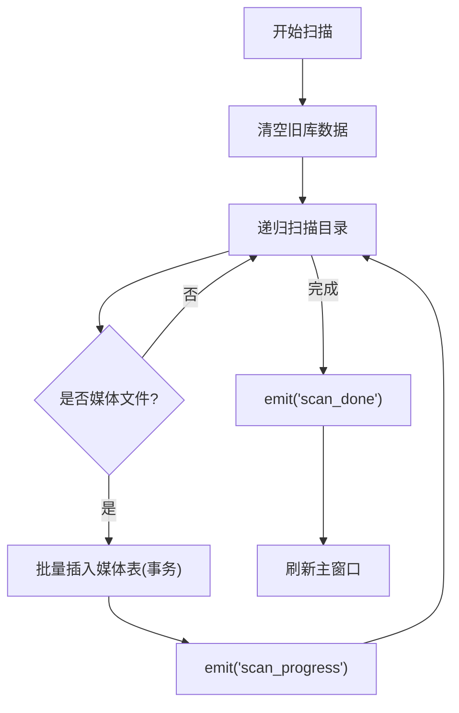
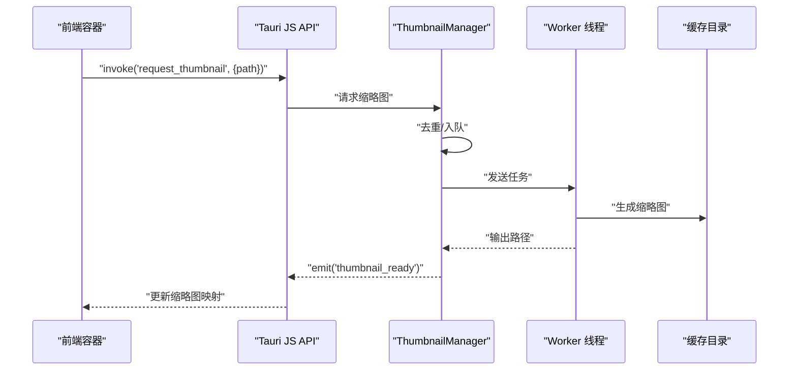
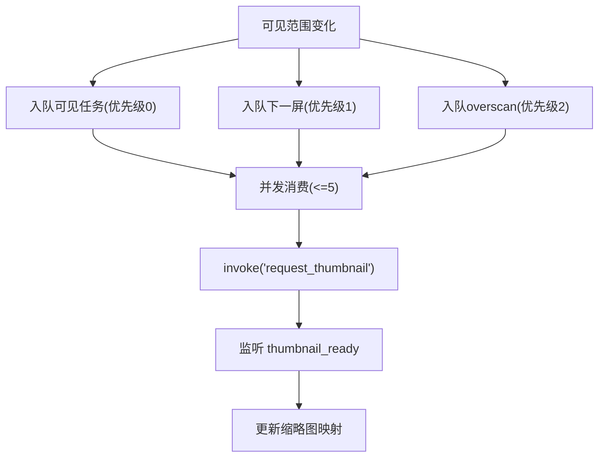
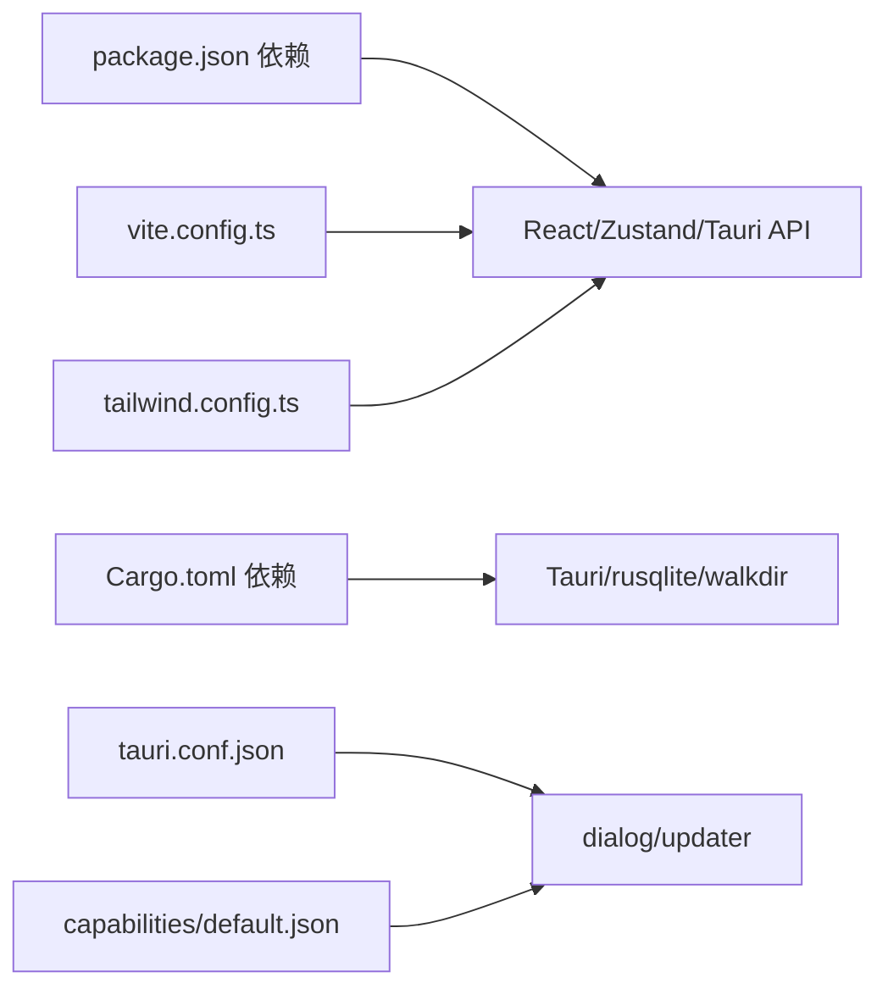

# 故障排除与维护

<cite>
**本文引用的文件**
- [package.json](file://package.json)
- [vite.config.ts](file://vite.config.ts)
- [tailwind.config.ts](file://tailwind.config.ts)
- [README.md](file://README.md)
- [DEVELOPMENT.md](file://DEVELOPMENT.md)
- [src-tauri/tauri.conf.json](file://src-tauri/tauri.conf.json)
- [src-tauri/Cargo.toml](file://src-tauri/Cargo.toml)
- [src-tauri/build.rs](file://src-tauri/build.rs)
- [src-tauri/capabilities/default.json](file://src-tauri/capabilities/default.json)
- [src-tauri/src/main.rs](file://src-tauri/src/main.rs)
- [src-tauri/src/db/mod.rs](file://src-tauri/src/db/mod.rs)
- [src-tauri/src/services/scanner.rs](file://src-tauri/src/services/scanner.rs)
- [src-tauri/src/thumbnail/manager.rs](file://src-tauri/src/thumbnail/manager.rs)
- [src/store/useAppStore.ts](file://src/store/useAppStore.ts)
- [src/components/MediaGrid.tsx](file://src/components/MediaGrid.tsx)
- [src/containers/MediaGridContainer.tsx](file://src/containers/MediaGridContainer.tsx)
- [src/pages/views/AvailableView.tsx](file://src/pages/views/AvailableView.tsx)
</cite>

## 目录
1. [简介](#简介)
2. [项目结构](#项目结构)
3. [核心组件](#核心组件)
4. [架构总览](#架构总览)
5. [详细组件分析](#详细组件分析)
6. [依赖关系分析](#依赖关系分析)
7. [性能考量](#性能考量)
8. [故障排除指南](#故障排除指南)
9. [结论](#结论)
10. [附录](#附录)

## 简介
本指南面向 Medex 桌面应用的维护者与开发者，聚焦于开发环境问题诊断、构建与运行时错误排查、性能问题定位与优化、代码维护策略、数据迁移与数据库维护、安全更新流程、维护工具与自动化运维脚本，以及社区支持与问题反馈渠道。内容基于仓库现有实现与文档，强调可操作性与可追溯性。

## 项目结构
Medex 采用“前端 React + TypeScript + Vite + TailwindCSS + Zustand”与“后端 Tauri v2 + Rust + SQLite”的混合架构。前端负责 UI、状态与交互，后端负责文件扫描、数据库与缩略图生成，二者通过 Tauri invoke/event 通信。

图表来源
- [src/components/MediaGrid.tsx:1-351](file://src/components/MediaGrid.tsx#L1-L351)
- [src/containers/MediaGridContainer.tsx:1-619](file://src/containers/MediaGridContainer.tsx#L1-L619)
- [src/store/useAppStore.ts:1-395](file://src/store/useAppStore.ts#L1-L395)
- [src-tauri/src/main.rs:1-69](file://src-tauri/src/main.rs#L1-L69)
- [src-tauri/src/db/mod.rs:1-123](file://src-tauri/src/db/mod.rs#L1-L123)
- [src-tauri/src/services/scanner.rs:1-525](file://src-tauri/src/services/scanner.rs#L1-L525)
- [src-tauri/src/thumbnail/manager.rs:1-108](file://src-tauri/src/thumbnail/manager.rs#L1-L108)

章节来源
- [README.md: 97-119:97-119](file://README.md#L97-L119)
- [DEVELOPMENT.md: 51-116:51-116](file://DEVELOPMENT.md#L51-L116)

## 核心组件
- 前端状态与 UI
  - 全局状态：Zustand store（导航、标签、媒体列表、筛选条件等）
  - 媒体网格：react-window 虚拟化渲染，支持网格/列表视图
  - 媒体卡片：展示缩略图、标签、收藏与最近查看状态
  - 缩略图调度：容器根据可见范围入队、并发控制与去重
- 后端服务
  - 数据库：SQLite（rusqlite，bundled），初始化与索引
  - 扫描与索引：walkdir 递归扫描，事务批量写入，事件通知
  - 缩略图：固定 worker 并发队列，缓存与 ffmpeg 解析
  - 命令注册：scanner、tags、thumbnail 对外暴露 invoke

章节来源
- [src/store/useAppStore.ts: 48-68:48-68](file://src/store/useAppStore.ts#L48-L68)
- [src/components/MediaGrid.tsx: 70-212:70-212](file://src/components/MediaGrid.tsx#L70-L212)
- [src/containers/MediaGridContainer.tsx: 30-L619:30-619](file://src/containers/MediaGridContainer.tsx#L30-L619)
- [src-tauri/src/db/mod.rs: 45-L123:45-123](file://src-tauri/src/db/mod.rs#L45-L123)
- [src-tauri/src/services/scanner.rs: 160-L341:160-341](file://src-tauri/src/services/scanner.rs#L160-L341)
- [src-tauri/src/thumbnail/manager.rs: 24-L108:24-108](file://src-tauri/src/thumbnail/manager.rs#L24-L108)

## 架构总览
前后端通过 Tauri 的 invoke 与事件系统交互，前端发起命令、后端执行业务逻辑并回传结果或推送事件。资源协议启用 asset protocol，支持本地文件转换为可预览 URL。

图表来源
- [src-tauri/src/main.rs: 49-L65:49-65](file://src-tauri/src/main.rs#L49-L65)
- [src-tauri/src/db/mod.rs: 45-L64:45-64](file://src-tauri/src/db/mod.rs#L45-L64)
- [src-tauri/src/services/scanner.rs: 250-L341:250-341](file://src-tauri/src/services/scanner.rs#L250-L341)
- [src/containers/MediaGridContainer.tsx: 311-L331:311-331](file://src/containers/MediaGridContainer.tsx#L311-L331)

## 详细组件分析

### 数据库与初始化
- 初始化流程：解析应用数据目录，创建数据库文件与表结构，确保列存在性，建立必要索引
- 并发访问：使用 OnceCell + Mutex 包裹连接，提供 with_connection 封装
- 路径解析：通过 Tauri 路径 API 获取 app_data_dir，拼接数据库文件名

图表来源
- [src-tauri/src/db/mod.rs: 45-L95:45-95](file://src-tauri/src/db/mod.rs#L45-L95)

章节来源
- [src-tauri/src/db/mod.rs: 45-L123:45-123](file://src-tauri/src/db/mod.rs#L45-L123)

### 扫描与索引（Rust）
- 扫描策略：walkdir 递归遍历，过滤支持的媒体扩展名，批量 INSERT OR IGNORE
- 事件驱动：逐文件 emit 进度事件，完成后发送完成事件
- 并发与事务：事务批量写入，提升吞吐；错误容错跳过不可读项

图表来源
- [src-tauri/src/services/scanner.rs: 250-L341:250-341](file://src-tauri/src/services/scanner.rs#L250-L341)

章节来源
- [src-tauri/src/services/scanner.rs: 54-L88:54-88](file://src-tauri/src/services/scanner.rs#L54-L88)
- [src-tauri/src/services/scanner.rs: 90-L115:90-115](file://src-tauri/src/services/scanner.rs#L90-L115)
- [src-tauri/src/services/scanner.rs: 250-L341:250-341](file://src-tauri/src/services/scanner.rs#L250-L341)

### 缩略图系统（Rust）
- 任务模型：固定 worker 数量与队列容量，去重集合防止重复处理
- ffmpeg 解析：优先内置二进制，其次开发目录，再系统 PATH，最后常见路径
- 结果回传：事件通知前端更新缓存映射

图表来源
- [src-tauri/src/thumbnail/manager.rs: 51-L108:51-108](file://src-tauri/src/thumbnail/manager.rs#L51-L108)
- [src/containers/MediaGridContainer.tsx: 453-L486:453-486](file://src/containers/MediaGridContainer.tsx#L453-L486)

章节来源
- [src-tauri/src/thumbnail/manager.rs: 24-L108:24-108](file://src-tauri/src/thumbnail/manager.rs#L24-L108)
- [src/containers/MediaGridContainer.tsx: 390-L451:390-451](file://src/containers/MediaGridContainer.tsx#L390-L451)

### 前端状态与缩略图调度
- 虚拟化渲染：react-window Grid/List，仅渲染可见区域
- 缩略图优先级：可见区最高、下一屏次之、其余最低；并发限制与队列上限
- 事件与命令：监听 thumbnail_ready 事件，invoke 请求缩略图，convertFileSrc 预览本地文件

图表来源
- [src/components/MediaGrid.tsx: 173-L211:173-211](file://src/components/MediaGrid.tsx#L173-L211)
- [src/containers/MediaGridContainer.tsx: 417-L451:417-451](file://src/containers/MediaGridContainer.tsx#L417-L451)
- [src/containers/MediaGridContainer.tsx: 453-L486:453-486](file://src/containers/MediaGridContainer.tsx#L453-L486)

章节来源
- [src/components/MediaGrid.tsx: 70-L212:70-212](file://src/components/MediaGrid.tsx#L70-L212)
- [src/containers/MediaGridContainer.tsx: 27-L48:27-48](file://src/containers/MediaGridContainer.tsx#L27-L48)
- [src/containers/MediaGridContainer.tsx: 365-L387:365-387](file://src/containers/MediaGridContainer.tsx#L365-L387)

## 依赖关系分析
- 前端依赖
  - React、Zustand、react-window、react-dnd、@tauri-apps/api 等
  - Vite 作为开发服务器与构建工具，端口 1420
  - TailwindCSS 通过主题变量与 content 配置扫描组件
- 后端依赖
  - Tauri v2、rusqlite(bundled)、walkdir、serde、anyhow、once_cell
  - 插件：dialog、updater
- 配置与权限
  - tauri.conf.json 启用 asset protocol、bundle externalBin、updater endpoint
  - capabilities/default.json 控制窗口与权限

图表来源
- [package.json: 12-L34:12-34](file://package.json#L12-L34)
- [vite.config.ts: 1-L11:1-11](file://vite.config.ts#L1-L11)
- [tailwind.config.ts: 1-L36:1-36](file://tailwind.config.ts#L1-L36)
- [src-tauri/Cargo.toml: 10-L23:10-23](file://src-tauri/Cargo.toml#L10-L23)
- [src-tauri/tauri.conf.json: 6-L44:6-44](file://src-tauri/tauri.conf.json#L6-L44)
- [src-tauri/capabilities/default.json: 1-L15:1-15](file://src-tauri/capabilities/default.json#L1-L15)

章节来源
- [package.json: 6-L11:6-11](file://package.json#L6-L11)
- [vite.config.ts: 4-L10:4-10](file://vite.config.ts#L4-L10)
- [tailwind.config.ts: 3-L33:3-33](file://tailwind.config.ts#L3-L33)
- [src-tauri/Cargo.toml: 13-L22:13-22](file://src-tauri/Cargo.toml#L13-L22)
- [src-tauri/tauri.conf.json: 21-L44:21-44](file://src-tauri/tauri.conf.json#L21-L44)
- [src-tauri/capabilities/default.json: 6-L13:6-13](file://src-tauri/capabilities/default.json#L6-L13)

## 性能考量
- 渲染性能
  - 使用 react-window 虚拟化，合理设置 overscan，避免一次性渲染大量节点
  - 网格/列表切换时注意计算开销，避免不必要的重渲染
- 缩略图性能
  - 并发上限与队列容量限制，防止过度占用 CPU 与 I/O
  - 事件驱动更新，避免重复请求与重复渲染
- 数据库性能
  - 事务批量写入，减少磁盘写放大
  - 合理索引（路径、关系表主键、最近查看倒序索引）
- 资源协议与本地预览
  - 使用 convertFileSrc 将本地绝对路径转为可预览 URL，避免 unsupported URL

章节来源
- [src/components/MediaGrid.tsx: 173-L211:173-211](file://src/components/MediaGrid.tsx#L173-L211)
- [src/containers/MediaGridContainer.tsx: 27-L28:27-28](file://src/containers/MediaGridContainer.tsx#L27-L28)
- [src-tauri/src/db/mod.rs: 39-L43:39-43](file://src-tauri/src/db/mod.rs#L39-L43)
- [src-tauri/src/services/scanner.rs: 90-L115:90-115](file://src-tauri/src/services/scanner.rs#L90-L115)

## 故障排除指南

### 1. 开发环境问题
- Node 与 Rust 版本不满足
  - 环境要求：Node.js 18+、Rust 1.77.2+，请核对本地版本
- NPM 安装失败或依赖冲突
  - 清理缓存与锁文件后重装：删除 node_modules、package-lock.json，重新安装
  - 若使用 pnpm，请确认与 package.json 依赖一致
- Vite 开发服务器端口冲突
  - 修改 vite.config.ts 中 server.port 与 strictPort 配置，避免端口占用
- Cargo 镜像源
  - 项目已配置清华镜像源，如需更换请调整 .cargo/config.toml

章节来源
- [README.md: 52-L78:52-78](file://README.md#L52-L78)
- [vite.config.ts: 6-L9:6-9](file://vite.config.ts#L6-L9)
- [src-tauri/Cargo.toml: 8-L8:8-8](file://src-tauri/Cargo.toml#L8-L8)

### 2. 构建失败
- 前端构建
  - 确保 TypeScript 与 Vite 正常，检查 tsconfig 与 vite.config
- Rust 构建
  - 使用 cargo check 验证语法；如涉及外部二进制（如 ffmpeg），确保路径正确
- Tauri 打包
  - externalBin 配置需与实际二进制一致，否则构建失败
  - bundle 与 updater 配置需与发布地址匹配

章节来源
- [DEVELOPMENT.md: 461-L467:461-467](file://DEVELOPMENT.md#L461-L467)
- [src-tauri/tauri.conf.json: 32-L33:32-33](file://src-tauri/tauri.conf.json#L32-L33)

### 3. 运行时错误排查
- 对话框权限不足
  - 检查 capabilities/default.json 是否包含 dialog:allow-open、dialog:allow-message
- 本地文件无法预览
  - 确保使用 convertFileSrc 转换绝对路径，避免直接使用绝对 URL
- 缩略图一直失败
  - 检查系统是否存在 ffmpeg，或在 src-tauri/binaries 放置内置二进制
- 页面卡顿/白屏
  - 排查是否在网格内挂载过多视频元素；确认虚拟化开启与并发参数合理

章节来源
- [src-tauri/capabilities/default.json: 6-L13:6-13](file://src-tauri/capabilities/default.json#L6-L13)
- [src/components/MediaGrid.tsx: 312-L321:312-321](file://src/components/MediaGrid.tsx#L312-L321)
- [DEVELOPMENT.md: 577-L595:577-595](file://DEVELOPMENT.md#L577-L595)

### 4. 日志分析与错误跟踪
- 后端日志
  - 初始化数据库与缩略图系统时的错误会打印到标准错误；关注失败原因
- 前端日志
  - invoke 失败与事件监听错误会在控制台输出；结合网络面板与 Tauri 日志定位
- 事件总线
  - 使用 window.dispatchEvent 触发跨容器同步；建议逐步迁移到显式 store action

章节来源
- [src-tauri/src/main.rs: 14-L22:14-22](file://src-tauri/src/main.rs#L14-L22)
- [src/containers/MediaGridContainer.tsx: 489-L494:489-494](file://src/containers/MediaGridContainer.tsx#L489-L494)

### 5. 性能问题诊断与优化
- 内存泄漏检测
  - 使用浏览器性能面板观察堆增长；避免在事件回调中累积引用
- CPU 使用率优化
  - 控制缩略图并发与队列长度；减少不必要的 re-render
- I/O 性能调优
  - 批量写入数据库；为大目录扫描增加进度反馈；合理设置索引

章节来源
- [src/containers/MediaGridContainer.tsx: 27-L28:27-28](file://src/containers/MediaGridContainer.tsx#L27-L28)
- [src-tauri/src/services/scanner.rs: 90-L115:90-115](file://src-tauri/src/services/scanner.rs#L90-L115)

### 6. 代码维护策略
- 重构建议
  - 将 scanner.rs 拆分为 media_query.rs、scan.rs、recent.rs，降低复杂度
  - 引入 API 类型层（src/api/types.ts + client.ts），减少 invoke 字符串分散
- 测试与日志
  - 为 store actions 增加单元测试；引入日志分级替代散落 console.log
  - 将 window.dispatchEvent 迁移为显式 store action

章节来源
- [DEVELOPMENT.md: 597-L604:597-604](file://DEVELOPMENT.md#L597-L604)

### 7. 数据迁移与数据库维护
- 初始化与列补齐
  - 数据库初始化时会检查并补齐列；确保首次启动成功
- 索引与查询
  - 确保索引存在；对高频查询（路径、关系表、最近查看）保持良好性能
- 清理与重置
  - 提供清除媒体库数据的命令，删除相关表并重置自增

章节来源
- [src-tauri/src/db/mod.rs: 45-L95:45-95](file://src-tauri/src/db/mod.rs#L45-L95)
- [src-tauri/src/db/mod.rs: 39-L43:39-43](file://src-tauri/src/db/mod.rs#L39-L43)
- [src-tauri/src/services/scanner.rs: 475-L525:475-525](file://src-tauri/src/services/scanner.rs#L475-L525)

### 8. 安全更新流程与最佳实践
- 更新配置
  - tauri.conf.json 中配置 updater endpoint 与公钥；dialog 关闭可避免弹窗打扰
- 发布准备
  - 准备多平台 ffmpeg 二进制并配置 externalBin；完成压力测试与回归测试

章节来源
- [src-tauri/tauri.conf.json: 36-L44:36-44](file://src-tauri/tauri.conf.json#L36-L44)
- [DEVELOPMENT.md: 607-L617:607-617](file://DEVELOPMENT.md#L607-L617)

### 9. 维护工具与自动化运维
- 前端
  - 使用 npm scripts 进行开发、构建与预览
- 后端
  - 使用 cargo check 验证；构建时注意 externalBin 与 bundle 配置
- 更新页面
  - AvailableView 展示版本与更新说明，便于用户决策

章节来源
- [package.json: 6-L11:6-11](file://package.json#L6-L11)
- [src-tauri/build.rs: 1-L4:1-4](file://src-tauri/build.rs#L1-L4)
- [src/pages/views/AvailableView.tsx: 12-L87:12-87](file://src/pages/views/AvailableView.tsx#L12-L87)

### 10. 社区支持与问题反馈
- 仓库与许可证
  - 项目托管于 GitHub，采用 MIT 许可；欢迎提交 Issue 与 PR
- 贡献流程
  - Fork → 创建特性分支 → 提交更改 → 推送 → 开启 PR

章节来源
- [README.md: 171-L186:171-186](file://README.md#L171-L186)

## 结论
本指南提供了从开发环境到运行维护的全流程实践建议。通过规范化的依赖管理、严格的构建与打包配置、完善的日志与事件机制、合理的性能优化策略与数据库维护流程，可有效降低故障率并提升用户体验。建议在团队内形成标准化的发布与回滚流程，并持续完善自动化测试与监控。

## 附录
- 快速排障清单
  - 检查 Node/Rust 版本与依赖安装
  - 确认 Vite 端口与 Tailwind 内容扫描
  - 校验 capabilities 与 tauri.conf.json 权限与 bundle 配置
  - 验证 ffmpeg 存在与 externalBin 设置
  - 关注数据库初始化与索引状态
  - 使用 convertFileSrc 预览本地文件
  - 控制缩略图并发与队列长度
  - 通过事件与日志定位问题

章节来源
- [DEVELOPMENT.md: 564-L595:564-595](file://DEVELOPMENT.md#L564-L595)
- [src-tauri/tauri.conf.json: 21-L44:21-44](file://src-tauri/tauri.conf.json#L21-L44)
- [src-tauri/capabilities/default.json: 6-L13:6-13](file://src-tauri/capabilities/default.json#L6-L13)