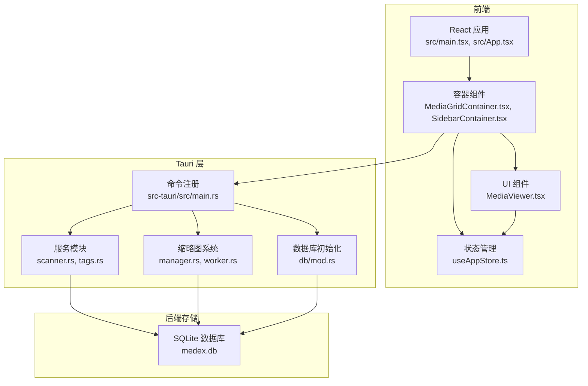
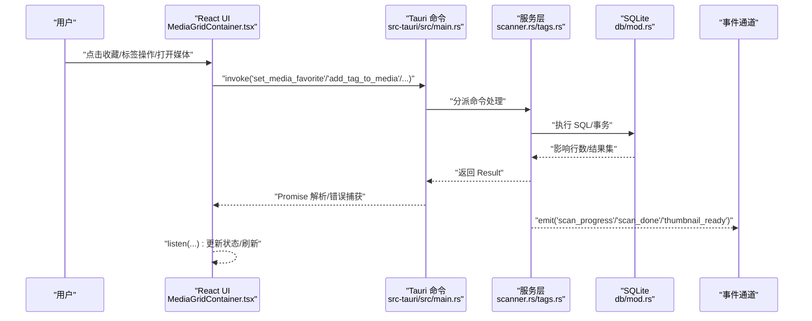
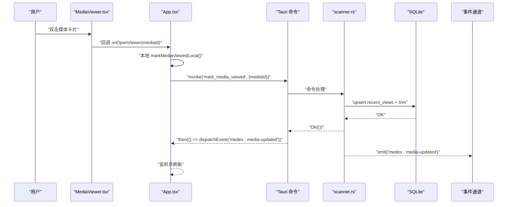
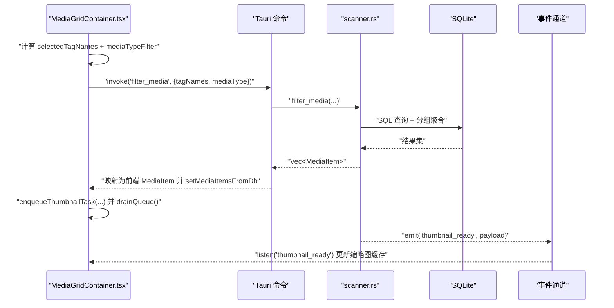
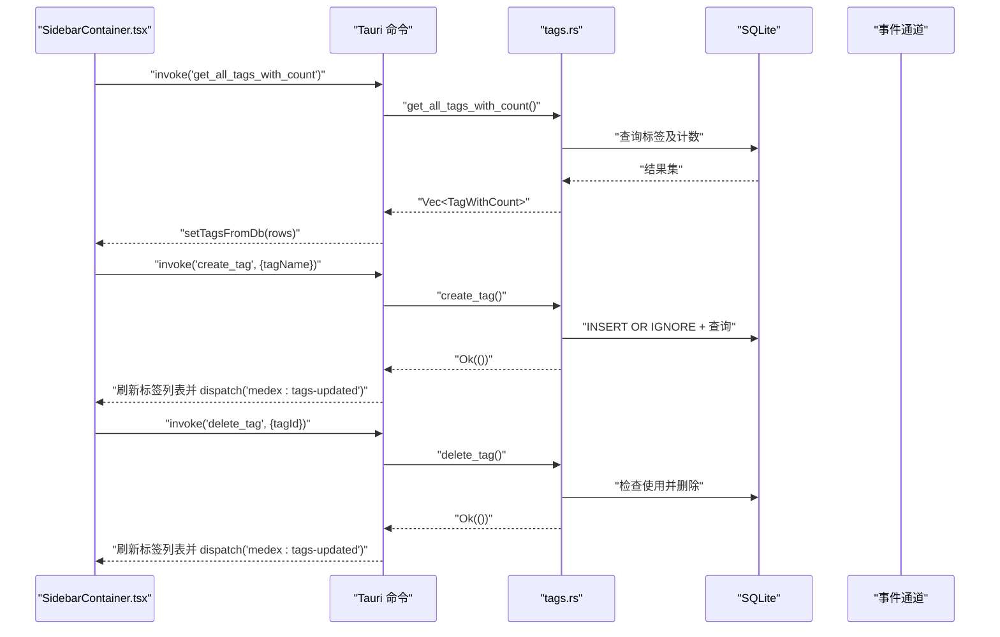
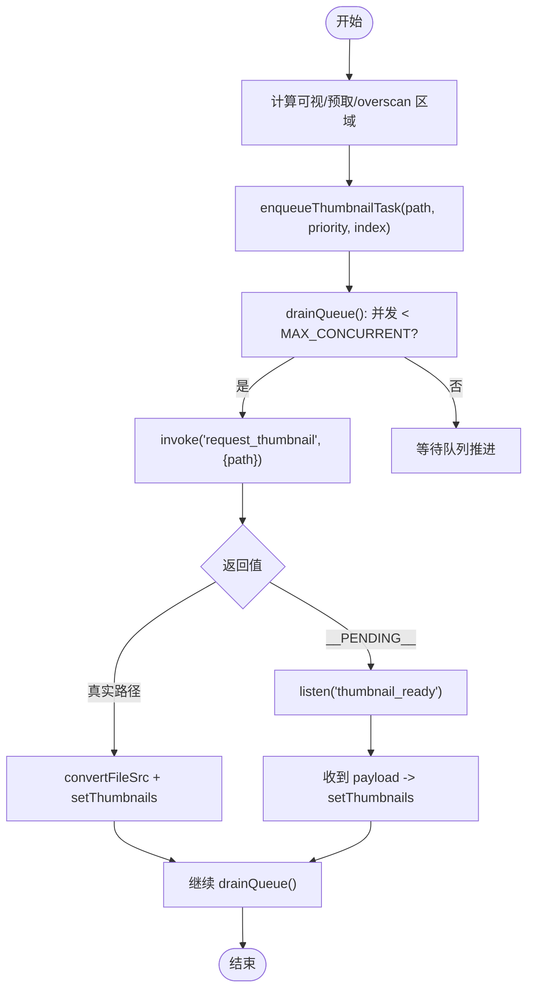
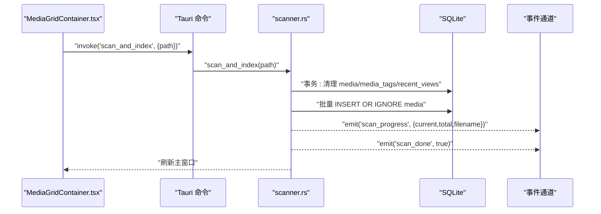
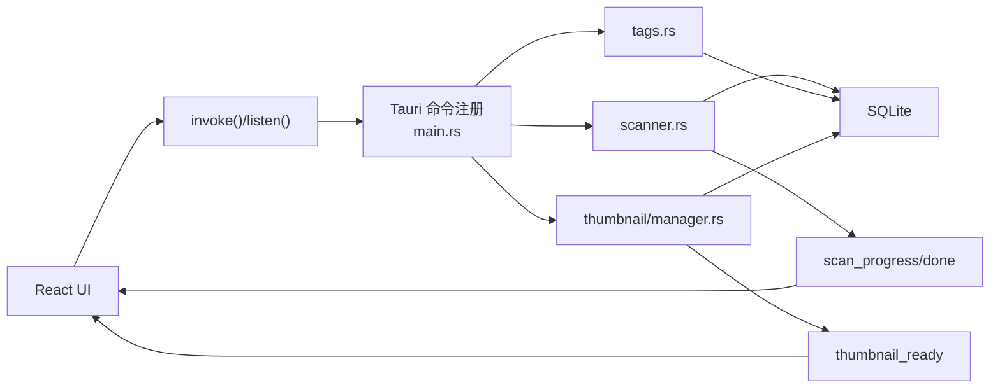

# 数据流架构

<cite>
**本文引用的文件**
- [src/main.tsx](file://src/main.tsx)
- [src/App.tsx](file://src/App.tsx)
- [src/components/MediaViewer.tsx](file://src/components/MediaViewer.tsx)
- [src/containers/MediaGridContainer.tsx](file://src/containers/MediaGridContainer.tsx)
- [src/containers/SidebarContainer.tsx](file://src/containers/SidebarContainer.tsx)
- [src/store/useAppStore.ts](file://src/store/useAppStore.ts)
- [src-tauri/src/main.rs](file://src-tauri/src/main.rs)
- [src-tauri/src/db/mod.rs](file://src-tauri/src/db/mod.rs)
- [src-tauri/src/services/scanner.rs](file://src-tauri/src/services/scanner.rs)
- [src-tauri/src/services/tags.rs](file://src-tauri/src/services/tags.rs)
- [src-tauri/src/thumbnail/manager.rs](file://src-tauri/src/thumbnail/manager.rs)
- [src-tauri/src/thumbnail/worker.rs](file://src-tauri/src/thumbnail/worker.rs)
- [API_REFERENCE.md](file://API_REFERENCE.md)
</cite>

## 目录
1. [简介](#简介)
2. [项目结构](#项目结构)
3. [核心组件](#核心组件)
4. [架构总览](#架构总览)
5. [详细组件分析](#详细组件分析)
6. [依赖关系分析](#依赖关系分析)
7. [性能考量](#性能考量)
8. [故障排查指南](#故障排查指南)
9. [结论](#结论)
10. [附录](#附录)

## 简介
本文件面向 Medex 应用，系统性梳理从用户操作到 SQLite 数据库再到事件通知与 UI 的完整数据流路径。重点覆盖：
- 用户操作如何驱动 React UI 状态变更
- React UI 如何通过 Tauri 命令调用 Rust 后端
- Rust 后端对 SQLite 的读写与事务控制
- 事件通道（scan_progress、scan_done、thumbnail_ready 等）如何回传至前端
- 前端如何基于事件与命令结果更新视图
- 数据验证、缓存策略、一致性保障与并发控制
- 异步数据加载与状态更新的处理方式
- 错误传播与异常处理的架构设计
- 典型场景的时序图与代码示例路径

## 项目结构
Medex 采用 Tauri v2 架构，前端为 React + TypeScript，后端为 Rust，二者通过 Tauri 命令与事件通道通信；SQLite 作为本地持久化存储。

图表来源
- [src/main.tsx:1-44](file://src/main.tsx#L1-L44)
- [src/App.tsx:1-73](file://src/App.tsx#L1-L73)
- [src-tauri/src/main.rs:10-68](file://src-tauri/src/main.rs#L10-L68)
- [src-tauri/src/db/mod.rs:45-123](file://src-tauri/src/db/mod.rs#L45-L123)
- [src-tauri/src/services/scanner.rs:160-341](file://src-tauri/src/services/scanner.rs#L160-L341)
- [src-tauri/src/services/tags.rs:19-220](file://src-tauri/src/services/tags.rs#L19-L220)
- [src-tauri/src/thumbnail/manager.rs:24-108](file://src-tauri/src/thumbnail/manager.rs#L24-L108)
- [src-tauri/src/thumbnail/worker.rs:13-96](file://src-tauri/src/thumbnail/worker.rs#L13-L96)

章节来源
- [src/main.tsx:1-44](file://src/main.tsx#L1-L44)
- [src/App.tsx:1-73](file://src/App.tsx#L1-L73)
- [src-tauri/src/main.rs:10-68](file://src-tauri/src/main.rs#L10-L68)

## 核心组件
- 前端入口与路由：根据路径渲染不同页面，ThemeProvider 包裹应用主题上下文。
- 应用根组件：负责媒体列表、导航筛选、媒体查看器的打开/关闭与状态联动。
- 容器组件：
  - 媒体网格容器：负责标签筛选、媒体类型过滤、收藏状态切换、批量标签操作、缩略图请求与并发调度、事件监听与刷新。
  - 侧边栏容器：负责标签列表加载、创建/删除标签、导航切换。
- 状态管理：Zustand Store 提供媒体项、标签、导航项、视图模式、媒体类型过滤等状态，以及本地更新方法。
- Tauri 命令注册：集中注册媒体扫描、查询、标签管理、缩略图请求等命令。
- 数据库：SQLite 初始化、建表、索引、事务封装与连接池化。
- 缩略图系统：线程池工作线程、任务队列、处理中去重、缓存目录与事件回传。

章节来源
- [src/main.tsx:9-44](file://src/main.tsx#L9-L44)
- [src/App.tsx:8-73](file://src/App.tsx#L8-L73)
- [src/containers/MediaGridContainer.tsx:30-619](file://src/containers/MediaGridContainer.tsx#L30-L619)
- [src/containers/SidebarContainer.tsx:7-79](file://src/containers/SidebarContainer.tsx#L7-L79)
- [src/store/useAppStore.ts:145-395](file://src/store/useAppStore.ts#L145-L395)
- [src-tauri/src/main.rs:49-65](file://src-tauri/src/main.rs#L49-L65)
- [src-tauri/src/db/mod.rs:45-123](file://src-tauri/src/db/mod.rs#L45-L123)
- [src-tauri/src/thumbnail/manager.rs:24-108](file://src-tauri/src/thumbnail/manager.rs#L24-L108)

## 架构总览
Medex 的数据流遵循“用户操作 → React UI → Tauri 命令 → Rust 后端 → SQLite → 事件通知 → React UI”的闭环。命令与事件均通过 Tauri 进行桥接，前后端类型分离，命令返回统一为 Result<…, String>，前端捕获错误并提示。

图表来源
- [src-tauri/src/main.rs:49-65](file://src-tauri/src/main.rs#L49-L65)
- [src-tauri/src/services/scanner.rs:250-341](file://src-tauri/src/services/scanner.rs#L250-L341)
- [src-tauri/src/services/tags.rs:76-220](file://src-tauri/src/services/tags.rs#L76-L220)
- [src-tauri/src/db/mod.rs:97-123](file://src-tauri/src/db/mod.rs#L97-L123)
- [src/containers/MediaGridContainer.tsx:453-487](file://src/containers/MediaGridContainer.tsx#L453-L487)

## 详细组件分析

### 媒体查看器数据流（打开/标记最近观看）
用户在媒体网格双击打开媒体查看器，前端立即本地标记“最近观看”，同时异步调用后端命令更新最近观看记录；命令完成后，后端发出事件，前端监听并刷新媒体列表。

图表来源
- [src/App.tsx:28-42](file://src/App.tsx#L28-L42)
- [src-tauri/src/services/scanner.rs:356-389](file://src-tauri/src/services/scanner.rs#L356-L389)
- [src-tauri/src/db/mod.rs:97-123](file://src-tauri/src/db/mod.rs#L97-L123)
- [src/containers/MediaGridContainer.tsx:488-494](file://src/containers/MediaGridContainer.tsx#L488-L494)

章节来源
- [src/App.tsx:28-42](file://src/App.tsx#L28-L42)
- [src/components/MediaViewer.tsx:14-186](file://src/components/MediaViewer.tsx#L14-L186)
- [src-tauri/src/services/scanner.rs:356-389](file://src-tauri/src/services/scanner.rs#L356-L389)

### 媒体网格与标签筛选数据流
前端根据侧边栏标签与媒体类型过滤条件，调用后端筛选命令获取媒体列表；同时维护缩略图请求队列与并发控制，监听缩略图生成完成事件以更新 UI。

图表来源
- [src/containers/MediaGridContainer.tsx:210-236](file://src/containers/MediaGridContainer.tsx#L210-L236)
- [src/containers/MediaGridContainer.tsx:390-451](file://src/containers/MediaGridContainer.tsx#L390-L451)
- [src-tauri/src/services/scanner.rs:170-247](file://src-tauri/src/services/scanner.rs#L170-L247)
- [src-tauri/src/db/mod.rs:112-123](file://src-tauri/src/db/mod.rs#L112-L123)
- [src-tauri/src/thumbnail/worker.rs:81-89](file://src-tauri/src/thumbnail/worker.rs#L81-L89)

章节来源
- [src/containers/MediaGridContainer.tsx:210-236](file://src/containers/MediaGridContainer.tsx#L210-L236)
- [src/containers/MediaGridContainer.tsx:390-451](file://src/containers/MediaGridContainer.tsx#L390-L451)
- [src-tauri/src/services/scanner.rs:170-247](file://src-tauri/src/services/scanner.rs#L170-L247)

### 侧边栏标签管理数据流
侧边栏加载标签列表，支持创建/删除标签；创建/删除后通过全局事件通知其他组件刷新。

图表来源
- [src/containers/SidebarContainer.tsx:16-33](file://src/containers/SidebarContainer.tsx#L16-L33)
- [src/containers/SidebarContainer.tsx:35-63](file://src/containers/SidebarContainer.tsx#L35-L63)
- [src-tauri/src/services/tags.rs:19-220](file://src-tauri/src/services/tags.rs#L19-L220)
- [src-tauri/src/db/mod.rs:97-123](file://src-tauri/src/db/mod.rs#L97-L123)

章节来源
- [src/containers/SidebarContainer.tsx:16-33](file://src/containers/SidebarContainer.tsx#L16-L33)
- [src/containers/SidebarContainer.tsx:35-63](file://src/containers/SidebarContainer.tsx#L35-L63)
- [src-tauri/src/services/tags.rs:19-220](file://src-tauri/src/services/tags.rs#L19-L220)

### 缩略图请求与并发控制
前端根据可视区域动态入队缩略图任务，限制并发数量与队列长度；后端线程池工作线程生成缩略图并通过事件回传。

图表来源
- [src/containers/MediaGridContainer.tsx:390-451](file://src/containers/MediaGridContainer.tsx#L390-L451)
- [src/containers/MediaGridContainer.tsx:453-487](file://src/containers/MediaGridContainer.tsx#L453-L487)
- [src-tauri/src/thumbnail/manager.rs:51-108](file://src-tauri/src/thumbnail/manager.rs#L51-L108)
- [src-tauri/src/thumbnail/worker.rs:13-96](file://src-tauri/src/thumbnail/worker.rs#L13-L96)

章节来源
- [src/containers/MediaGridContainer.tsx:390-451](file://src/containers/MediaGridContainer.tsx#L390-L451)
- [src/containers/MediaGridContainer.tsx:453-487](file://src/containers/MediaGridContainer.tsx#L453-L487)
- [src-tauri/src/thumbnail/manager.rs:51-108](file://src-tauri/src/thumbnail/manager.rs#L51-L108)
- [src-tauri/src/thumbnail/worker.rs:13-96](file://src-tauri/src/thumbnail/worker.rs#L13-L96)

### 扫描与索引数据流
用户选择媒体库目录后，前端调用扫描命令；后端清理旧数据、批量插入媒体、逐文件发送进度事件，完成后统一刷新界面。

图表来源
- [src/containers/MediaGridContainer.tsx:310-331](file://src/containers/MediaGridContainer.tsx#L310-L331)
- [src-tauri/src/services/scanner.rs:250-341](file://src-tauri/src/services/scanner.rs#L250-L341)
- [src-tauri/src/db/mod.rs:97-123](file://src-tauri/src/db/mod.rs#L97-L123)

章节来源
- [src/containers/MediaGridContainer.tsx:310-331](file://src/containers/MediaGridContainer.tsx#L310-L331)
- [src-tauri/src/services/scanner.rs:250-341](file://src-tauri/src/services/scanner.rs#L250-L341)

## 依赖关系分析
- 前端依赖：
  - @tauri-apps/api：invoke、listen、convertFileSrc
  - Zustand：全局状态管理
  - 主题上下文：统一主题色与交互样式
- 后端依赖：
  - rusqlite：SQLite 访问与事务
  - walkdir：目录扫描
  - serde：序列化/反序列化
  - tauri-plugin-*：对话框、更新插件
- 命令与事件：
  - 命令注册集中在 main.rs，服务层按功能拆分（scanner/tags/thumbnail）
  - 事件用于长耗时任务进度与结果回传

图表来源
- [src-tauri/src/main.rs:49-65](file://src-tauri/src/main.rs#L49-L65)
- [src-tauri/src/services/scanner.rs:160-341](file://src-tauri/src/services/scanner.rs#L160-L341)
- [src-tauri/src/services/tags.rs:19-220](file://src-tauri/src/services/tags.rs#L19-L220)
- [src-tauri/src/thumbnail/manager.rs:24-108](file://src-tauri/src/thumbnail/manager.rs#L24-L108)

章节来源
- [src-tauri/src/main.rs:49-65](file://src-tauri/src/main.rs#L49-L65)
- [src-tauri/src/services/scanner.rs:160-341](file://src-tauri/src/services/scanner.rs#L160-L341)
- [src-tauri/src/services/tags.rs:19-220](file://src-tauri/src/services/tags.rs#L19-L220)
- [src-tauri/src/thumbnail/manager.rs:24-108](file://src-tauri/src/thumbnail/manager.rs#L24-L108)

## 性能考量
- 前端缩略图并发与队列
  - 最大并发：5；队列容量：400；优先级：可见 > 下一屏 > overscan，降低卡顿与抖动。
- 后端缩略图并发与队列
  - 工作线程：4；队列容量：2048；同一路径去重避免重复处理。
- 数据库事务与索引
  - 批量插入使用事务，减少磁盘写放大；为 media/path、media_tags、recent_views 等建立索引，提升查询效率。
- 前端状态合并
  - Store 提供“从数据库合并媒体项”的方法，保留本地状态（如最近观看），避免重复渲染。
- 事件驱动刷新
  - 通过全局事件与 Tauri 事件统一刷新，避免轮询带来的资源浪费。

章节来源
- [src/containers/MediaGridContainer.tsx:27-28](file://src/containers/MediaGridContainer.tsx#L27-L28)
- [src-tauri/src/thumbnail/manager.rs:24-108](file://src-tauri/src/thumbnail/manager.rs#L24-L108)
- [src-tauri/src/db/mod.rs:39-43](file://src-tauri/src/db/mod.rs#L39-L43)
- [src/store/useAppStore.ts:258-276](file://src/store/useAppStore.ts#L258-L276)

## 故障排查指南
- 命令错误处理
  - Rust 命令统一返回 Result<…, String>，前端 try/catch 后打印错误并弹窗提示。
- 事件监听
  - 缩略图：监听 thumbnail_ready；扫描：监听 scan_progress 与 scan_done；媒体更新：监听 medex:media-updated。
- 数据库初始化
  - 初始化失败会在控制台打印错误并中断启动；确认应用数据目录可写、SQLite 可用。
- 缩略图生成
  - 若 ffmpeg 不存在，缩略图生成会禁用；检查 ffmpeg 路径或打包二进制。

章节来源
- [API_REFERENCE.md:450-467](file://API_REFERENCE.md#L450-L467)
- [src-tauri/src/main.rs:14-22](file://src-tauri/src/main.rs#L14-L22)
- [src-tauri/src/thumbnail/manager.rs:24-32](file://src-tauri/src/thumbnail/manager.rs#L24-L32)

## 结论
Medex 的数据流以 Tauri 为桥梁，实现了从前端 UI 到 Rust 后端与 SQLite 的清晰分层与职责分离。通过命令与事件通道、事务与索引、并发队列与去重、本地状态合并与事件驱动刷新，系统在性能与一致性之间取得平衡。建议后续引入分页接口、批量标签与统一错误码，进一步提升大规模媒体库的体验与可维护性。

## 附录
- 命令与事件参考：见 [API_REFERENCE.md](file://API_REFERENCE.md)
- 数据库建表与索引：见 [src-tauri/src/db/mod.rs:12-43](file://src-tauri/src/db/mod.rs#L12-L43)
- 前端核心类型定义：见 [src/store/useAppStore.ts:16-47](file://src/store/useAppStore.ts#L16-L47)