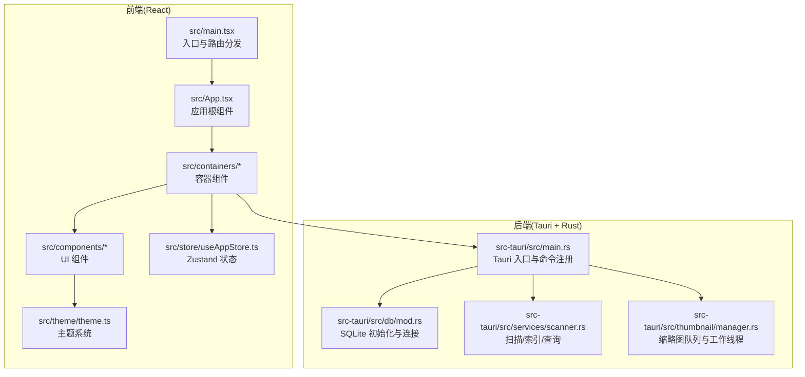
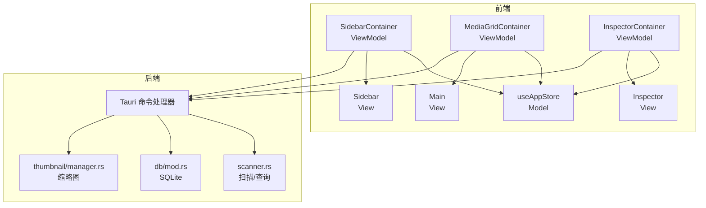
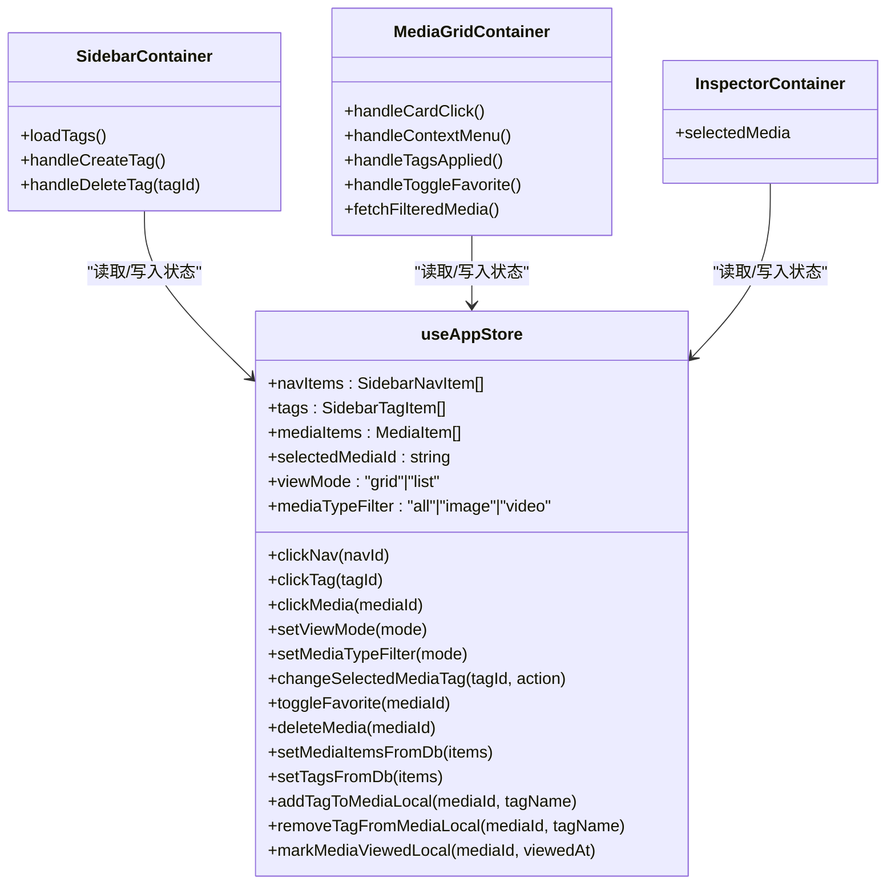
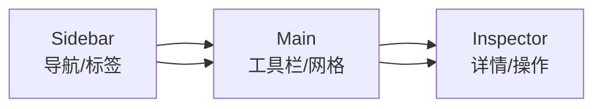
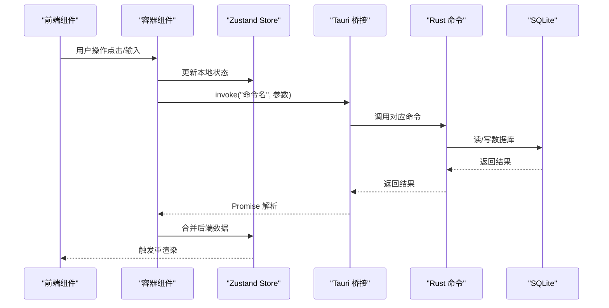
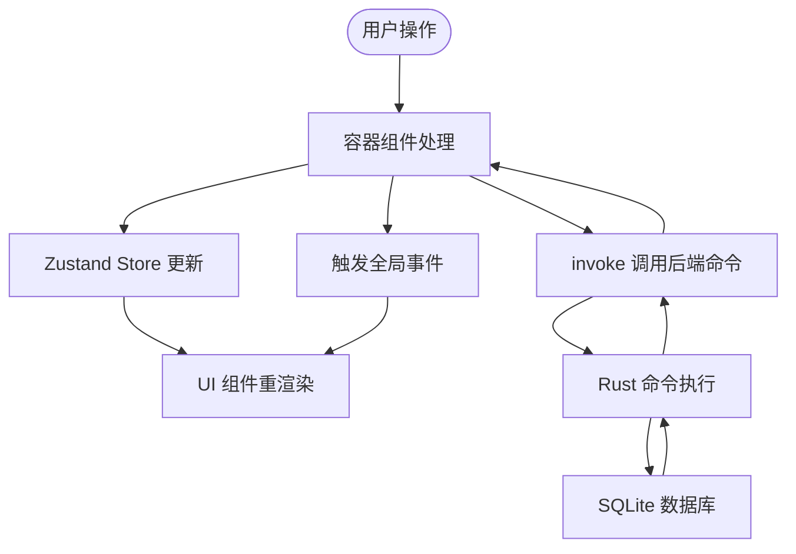
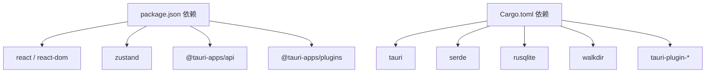

# 整体架构模式

<cite>
**本文引用的文件**
- [README.md](file://README.md)
- [package.json](file://package.json)
- [src-tauri/Cargo.toml](file://src-tauri/Cargo.toml)
- [src-tauri/tauri.conf.json](file://src-tauri/tauri.conf.json)
- [src/main.tsx](file://src/main.tsx)
- [src/App.tsx](file://src/App.tsx)
- [src/store/useAppStore.ts](file://src/store/useAppStore.ts)
- [src/containers/SidebarContainer.tsx](file://src/containers/SidebarContainer.tsx)
- [src/containers/MediaGridContainer.tsx](file://src/containers/MediaGridContainer.tsx)
- [src/containers/InspectorContainer.tsx](file://src/containers/InspectorContainer.tsx)
- [src/components/Sidebar.tsx](file://src/components/Sidebar.tsx)
- [src/components/Main.tsx](file://src/components/Main.tsx)
- [src/components/Inspector.tsx](file://src/components/Inspector.tsx)
- [src-tauri/src/main.rs](file://src-tauri/src/main.rs)
- [src-tauri/src/services/scanner.rs](file://src-tauri/src/services/scanner.rs)
- [src-tauri/src/db/mod.rs](file://src-tauri/src/db/mod.rs)
- [src-tauri/src/thumbnail/manager.rs](file://src-tauri/src/thumbnail/manager.rs)
- [src/theme/theme.ts](file://src/theme/theme.ts)
</cite>

## 目录
1. [简介](#简介)
2. [项目结构](#项目结构)
3. [核心组件](#核心组件)
4. [架构总览](#架构总览)
5. [详细组件分析](#详细组件分析)
6. [依赖分析](#依赖分析)
7. [性能考虑](#性能考虑)
8. [故障排查指南](#故障排查指南)
9. [结论](#结论)

## 简介
本项目采用 Tauri + React + Rust 的混合桌面应用架构，围绕“三栏式布局（Sidebar / Main / Inspector）”组织界面，结合前端 MVVM 模式实现清晰的职责分离。前端使用 React + TypeScript + Zustand 管理状态，通过 @tauri-apps/api 与 Rust 后端进行桥接调用；后端基于 Tauri V2，使用 SQLite 存储媒体元数据与标签，提供扫描、索引、标签管理、缩略图生成等能力。

## 项目结构
- 前端目录 src：包含组件、容器、页面、状态管理、主题与上下文等。
- 后端目录 src-tauri：包含 Tauri 入口、数据库初始化、服务模块（扫描、标签）、缩略图子系统等。
- 配置文件：package.json（前端依赖与脚本）、Cargo.toml（Rust 依赖）、tauri.conf.json（Tauri 构建与安全策略）。

图表来源
- [src/main.tsx:1-44](file://src/main.tsx#L1-L44)
- [src/App.tsx:1-73](file://src/App.tsx#L1-L73)
- [src/store/useAppStore.ts:1-395](file://src/store/useAppStore.ts#L1-L395)
- [src-tauri/src/main.rs:1-69](file://src-tauri/src/main.rs#L1-L69)
- [src-tauri/src/db/mod.rs:1-123](file://src-tauri/src/db/mod.rs#L1-L123)
- [src-tauri/src/services/scanner.rs:1-525](file://src-tauri/src/services/scanner.rs#L1-L525)
- [src-tauri/src/thumbnail/manager.rs:1-108](file://src-tauri/src/thumbnail/manager.rs#L1-L108)

章节来源
- [README.md:97-119](file://README.md#L97-L119)
- [package.json:1-36](file://package.json#L1-L36)
- [src-tauri/Cargo.toml:1-23](file://src-tauri/Cargo.toml#L1-L23)
- [src-tauri/tauri.conf.json:1-46](file://src-tauri/tauri.conf.json#L1-L46)

## 核心组件
- 应用入口与路由：根据 URL 决定渲染 App、设置页或更新页。
- 根组件 App：组织三栏布局，协调媒体查看器与状态联动。
- 容器组件：封装业务逻辑与状态调用，向 UI 组件传递 props。
- UI 组件：负责展示与用户交互，不直接访问后端。
- 状态管理：Zustand Store 统一管理导航、标签、媒体项与视图模式。
- 主题系统：统一的颜色变量与深浅主题生成。

章节来源
- [src/main.tsx:9-44](file://src/main.tsx#L9-L44)
- [src/App.tsx:8-72](file://src/App.tsx#L8-L72)
- [src/store/useAppStore.ts:48-394](file://src/store/useAppStore.ts#L48-L394)
- [src/theme/theme.ts:8-159](file://src/theme/theme.ts#L8-L159)

## 架构总览
该架构采用“前端 MVVM + 后端 Rust/Tauri”的分层设计：
- View（视图）：由 React 组件构成，负责渲染与交互。
- ViewModel（视图模型）：容器组件承担，负责处理业务逻辑、事件与状态更新。
- Model（模型）：Zustand Store 作为前端数据模型，同时通过 Tauri 命令与后端交互，实现数据持久化与系统级能力。

图表来源
- [src/containers/SidebarContainer.tsx:1-79](file://src/containers/SidebarContainer.tsx#L1-L79)
- [src/containers/MediaGridContainer.tsx:1-619](file://src/containers/MediaGridContainer.tsx#L1-L619)
- [src/containers/InspectorContainer.tsx:1-32](file://src/containers/InspectorContainer.tsx#L1-L32)
- [src/store/useAppStore.ts:145-394](file://src/store/useAppStore.ts#L145-L394)
- [src-tauri/src/main.rs:49-65](file://src-tauri/src/main.rs#L49-L65)
- [src-tauri/src/services/scanner.rs:160-341](file://src-tauri/src/services/scanner.rs#L160-L341)
- [src-tauri/src/db/mod.rs:45-123](file://src-tauri/src/db/mod.rs#L45-L123)
- [src-tauri/src/thumbnail/manager.rs:24-107](file://src-tauri/src/thumbnail/manager.rs#L24-L107)

## 详细组件分析

### MVVM 架构在前端的实现
- Model（数据模型）：useAppStore 定义状态类型与动作，集中管理媒体、标签、导航与视图模式。
- ViewModel（视图模型）：SidebarContainer、MediaGridContainer、InspectorContainer 将 UI 事件映射为 Store 动作与 Tauri 调用。
- View（视图）：Sidebar、Main、Inspector 组件负责渲染与交互，样式由主题系统统一控制。

图表来源
- [src/store/useAppStore.ts:48-394](file://src/store/useAppStore.ts#L48-L394)
- [src/containers/SidebarContainer.tsx:7-78](file://src/containers/SidebarContainer.tsx#L7-L78)
- [src/containers/MediaGridContainer.tsx:30-618](file://src/containers/MediaGridContainer.tsx#L30-L618)
- [src/containers/InspectorContainer.tsx:6-31](file://src/containers/InspectorContainer.tsx#L6-L31)

章节来源
- [src/store/useAppStore.ts:145-394](file://src/store/useAppStore.ts#L145-L394)
- [src/containers/SidebarContainer.tsx:7-78](file://src/containers/SidebarContainer.tsx#L7-L78)
- [src/containers/MediaGridContainer.tsx:30-618](file://src/containers/MediaGridContainer.tsx#L30-L618)
- [src/containers/InspectorContainer.tsx:6-31](file://src/containers/InspectorContainer.tsx#L6-L31)

### 三栏式布局（Sidebar/Main/Inspector）设计
- Sidebar：导航与标签列表，支持新增/删除标签、切换导航项。
- Main：工具栏与媒体网格，负责媒体筛选、多选、上下文菜单、批量标签操作与缩略图请求。
- Inspector：选中媒体详情与操作，支持标签增删、收藏切换、删除媒体。

图表来源
- [src/components/Sidebar.tsx:17-144](file://src/components/Sidebar.tsx#L17-L144)
- [src/components/Main.tsx:8-24](file://src/components/Main.tsx#L8-L24)
- [src/components/Inspector.tsx:19-265](file://src/components/Inspector.tsx#L19-L265)

章节来源
- [src/components/Sidebar.tsx:17-144](file://src/components/Sidebar.tsx#L17-L144)
- [src/components/Main.tsx:8-24](file://src/components/Main.tsx#L8-L24)
- [src/components/Inspector.tsx:19-265](file://src/components/Inspector.tsx#L19-L265)

### 前端通过 Tauri 桥接与 Rust 后端通信
- 前端使用 @tauri-apps/api 的 invoke 调用后端注册的命令。
- 后端在 main.rs 中通过 generate_handler 注册命令，如扫描、过滤、标签管理、缩略图请求等。
- 数据库与缩略图子系统在 Rust 侧实现，前端仅通过命令接口访问。

图表来源
- [src/containers/MediaGridContainer.tsx:210-235](file://src/containers/MediaGridContainer.tsx#L210-L235)
- [src/containers/SidebarContainer.tsx:16-33](file://src/containers/SidebarContainer.tsx#L16-L33)
- [src-tauri/src/main.rs:49-65](file://src-tauri/src/main.rs#L49-L65)
- [src-tauri/src/services/scanner.rs:160-341](file://src-tauri/src/services/scanner.rs#L160-L341)
- [src-tauri/src/db/mod.rs:97-123](file://src-tauri/src/db/mod.rs#L97-L123)

章节来源
- [src/containers/MediaGridContainer.tsx:210-235](file://src/containers/MediaGridContainer.tsx#L210-L235)
- [src/containers/SidebarContainer.tsx:16-33](file://src/containers/SidebarContainer.tsx#L16-L33)
- [src-tauri/src/main.rs:49-65](file://src-tauri/src/main.rs#L49-L65)

### 数据流与组件依赖关系
- 状态驱动：useAppStore 作为单一数据源，容器组件通过其动作更新状态。
- 事件驱动：窗口事件（如 medex:tags-updated、medex:media-updated）用于跨组件同步。
- 本地存储：MediaGridContainer 通过 localStorage 与 Tauri 事件同步媒体库路径变更。

图表来源
- [src/store/useAppStore.ts:145-394](file://src/store/useAppStore.ts#L145-L394)
- [src/containers/MediaGridContainer.tsx:488-494](file://src/containers/MediaGridContainer.tsx#L488-L494)
- [src-tauri/src/services/scanner.rs:327-336](file://src-tauri/src/services/scanner.rs#L327-L336)

章节来源
- [src/store/useAppStore.ts:145-394](file://src/store/useAppStore.ts#L145-L394)
- [src/containers/MediaGridContainer.tsx:488-494](file://src/containers/MediaGridContainer.tsx#L488-L494)

## 依赖分析
- 前端依赖：React、Zustand、@tauri-apps/api、@tauri-apps 插件（dialog/updater）、TailwindCSS。
- 后端依赖：tauri、serde、rusqlite、walkdir、tauri-plugin-dialog、tauri-plugin-updater。
- 构建与打包：Vite（前端）、Tauri CLI（后端），tauri.conf.json 配置 devUrl、bundle、插件等。

图表来源
- [package.json:12-34](file://package.json#L12-L34)
- [src-tauri/Cargo.toml:13-23](file://src-tauri/Cargo.toml#L13-L23)

章节来源
- [package.json:12-34](file://package.json#L12-L34)
- [src-tauri/Cargo.toml:13-23](file://src-tauri/Cargo.toml#L13-L23)
- [src-tauri/tauri.conf.json:6-44](file://src-tauri/tauri.conf.json#L6-L44)

## 性能考虑
- 缩略图生成：Rust 侧使用队列与工作线程并发生成，前端通过事件与 invoke 结合，避免阻塞 UI。
- 媒体筛选：前端对标签与类型进行去抖与缓存，减少后端压力。
- 数据库：SQLite 事务批量插入，索引优化查询性能。
- 前端渲染：虚拟滚动与可见区域计算减少 DOM 数量，提升网格性能。

章节来源
- [src-tauri/src/thumbnail/manager.rs:24-107](file://src-tauri/src/thumbnail/manager.rs#L24-L107)
- [src/containers/MediaGridContainer.tsx:417-451](file://src/containers/MediaGridContainer.tsx#L417-L451)
- [src-tauri/src/services/scanner.rs:90-115](file://src-tauri/src/services/scanner.rs#L90-L115)
- [src-tauri/src/db/mod.rs:12-43](file://src-tauri/src/db/mod.rs#L12-L43)

## 故障排查指南
- Tauri 命令调用失败：检查命令是否在 main.rs 的 generate_handler 中注册，确认参数与返回值类型匹配。
- 数据库初始化失败：确认 app_data_dir 可写，SQLite 表与索引创建成功。
- 缩略图生成异常：确认 ffmpeg 可用，缓存目录可写，队列容量与并发数合理。
- 事件未触发：检查全局事件名称与监听逻辑，确保在正确时机派发与移除监听。

章节来源
- [src-tauri/src/main.rs:49-65](file://src-tauri/src/main.rs#L49-L65)
- [src-tauri/src/db/mod.rs:45-64](file://src-tauri/src/db/mod.rs#L45-L64)
- [src-tauri/src/thumbnail/manager.rs:24-49](file://src-tauri/src/thumbnail/manager.rs#L24-L49)
- [src/containers/MediaGridContainer.tsx:453-486](file://src/containers/MediaGridContainer.tsx#L453-L486)

## 结论
本项目通过 Tauri + React + Rust 的混合架构，实现了高性能、可维护的桌面媒体管理应用。前端采用 MVVM 模式，清晰分离视图、视图模型与模型；后端以 Rust 提供稳定的系统级能力与数据持久化。三栏式布局与主题系统进一步提升了用户体验与可扩展性。建议后续完善标签系统、搜索与过滤、批量操作等功能，持续优化缩略图与数据库性能。