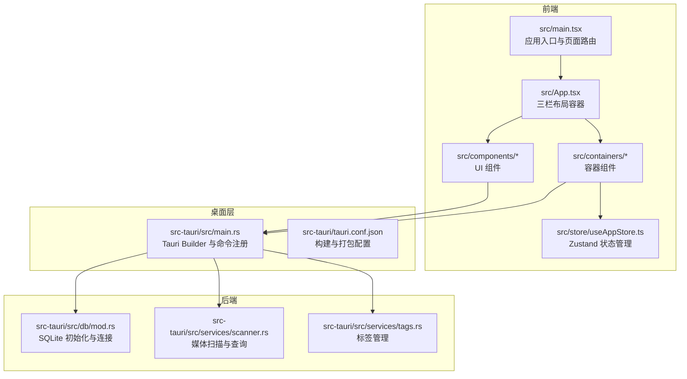
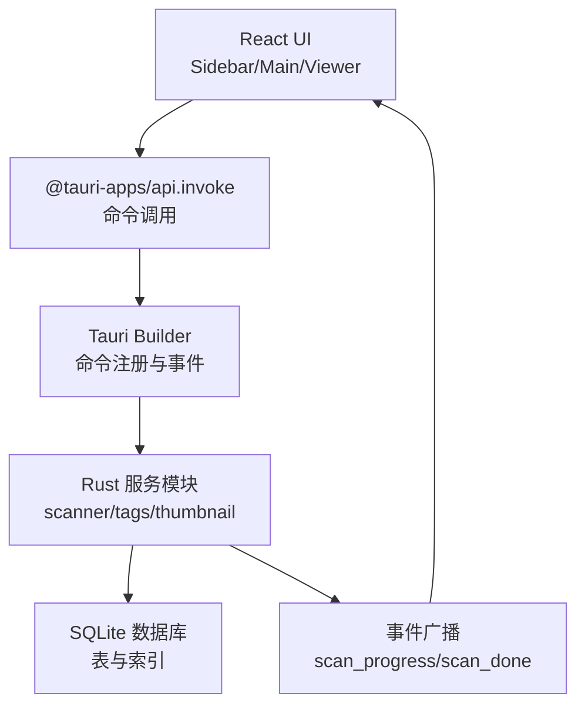
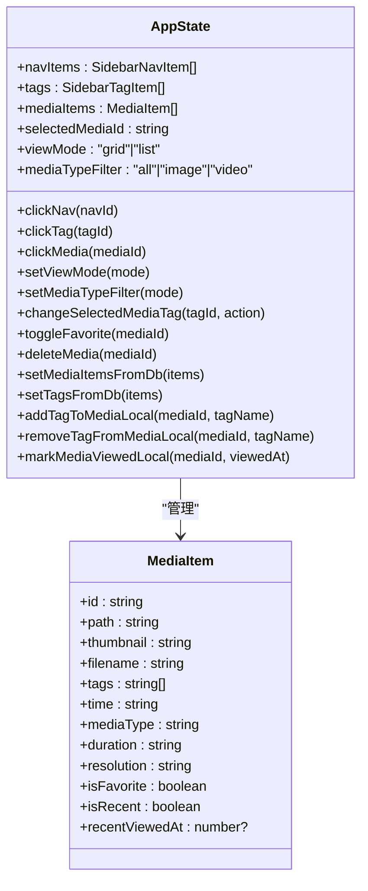
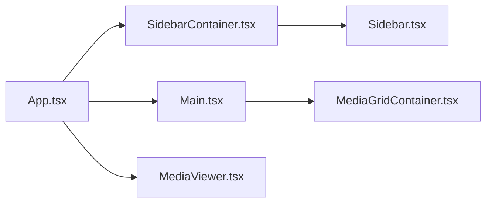
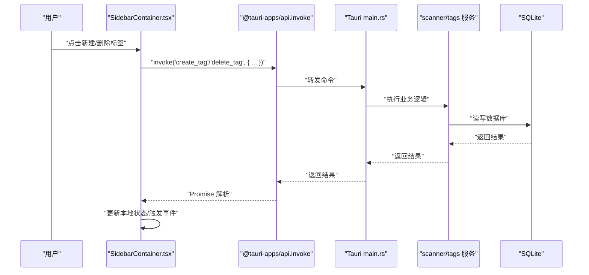
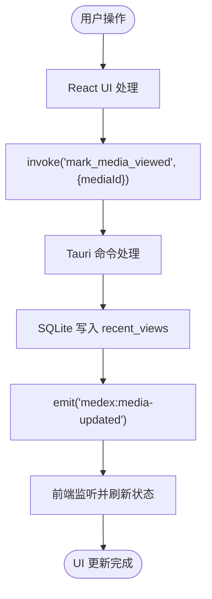
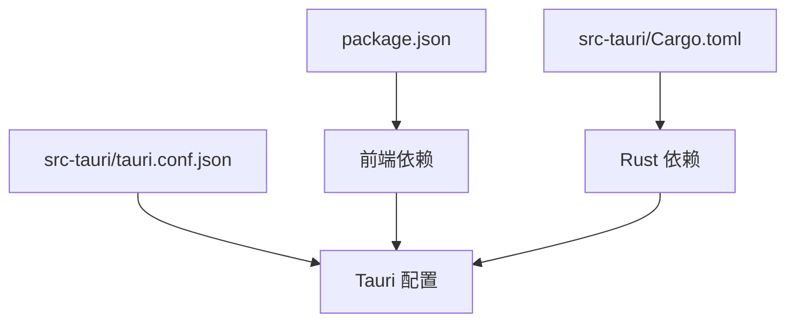

# 架构设计

<cite>
**本文引用的文件**
- [README.md](file://README.md)
- [package.json](file://package.json)
- [src-tauri/Cargo.toml](file://src-tauri/Cargo.toml)
- [src-tauri/tauri.conf.json](file://src-tauri/tauri.conf.json)
- [src/main.tsx](file://src/main.tsx)
- [src/App.tsx](file://src/App.tsx)
- [src/store/useAppStore.ts](file://src/store/useAppStore.ts)
- [src/components/Sidebar.tsx](file://src/components/Sidebar.tsx)
- [src/components/Main.tsx](file://src/components/Main.tsx)
- [src/containers/SidebarContainer.tsx](file://src/containers/SidebarContainer.tsx)
- [src-tauri/src/main.rs](file://src-tauri/src/main.rs)
- [src-tauri/src/db/mod.rs](file://src-tauri/src/db/mod.rs)
- [src-tauri/src/services/scanner.rs](file://src-tauri/src/services/scanner.rs)
- [src-tauri/src/services/tags.rs](file://src-tauri/src/services/tags.rs)
</cite>

## 目录
1. [引言](#引言)
2. [项目结构](#项目结构)
3. [核心组件](#核心组件)
4. [架构总览](#架构总览)
5. [详细组件分析](#详细组件分析)
6. [依赖分析](#依赖分析)
7. [性能考量](#性能考量)
8. [故障排查指南](#故障排查指南)
9. [结论](#结论)
10. [附录](#附录)

## 引言
本文件面向 Medex 应用，系统化阐述其“Tauri + React + Rust”三层架构设计，解释前后端分离理念与通信机制，详解前端 MVVM 模式与 Zustand 状态管理在本项目中的落地，剖析三栏式布局（Sidebar/Main/Inspector）的组件关系与职责划分，并以序列图与流程图呈现“用户操作 → React UI → Tauri 命令 → Rust 后端 → SQLite 数据库 → 事件通知 → React UI”的完整数据流。同时给出系统边界、集成模式、技术决策与权衡、基础设施要求、可扩展性与部署拓扑建议。

## 项目结构
Medex 采用前后端分离的工程组织方式：
- 前端（React + TypeScript + Vite + TailwindCSS + Zustand）：位于 src/ 目录，负责 UI、状态管理与与 Tauri 的命令通信。
- 桌面层（Tauri V2）：位于 src-tauri/ 目录，负责应用生命周期、插件、菜单、命令注册与跨语言桥接。
- 后端（Rust + SQLite）：位于 src-tauri/src/ 下，提供数据库访问、业务服务（扫描、标签、缩略图等）与命令实现。

图表来源
- [src/main.tsx:1-44](file://src/main.tsx#L1-L44)
- [src/App.tsx:1-73](file://src/App.tsx#L1-L73)
- [src/store/useAppStore.ts:1-395](file://src/store/useAppStore.ts#L1-L395)
- [src-tauri/src/main.rs:1-98](file://src-tauri/src/main.rs#L1-L98)
- [src-tauri/src/db/mod.rs:1-123](file://src-tauri/src/db/mod.rs#L1-L123)
- [src-tauri/src/services/scanner.rs:1-597](file://src-tauri/src/services/scanner.rs#L1-L597)
- [src-tauri/src/services/tags.rs:1-220](file://src-tauri/src/services/tags.rs#L1-L220)

章节来源
- [README.md:97-119](file://README.md#L97-L119)
- [src/main.tsx:9-41](file://src/main.tsx#L9-L41)
- [src-tauri/tauri.conf.json:6-11](file://src-tauri/tauri.conf.json#L6-L11)

## 核心组件
- 前端入口与页面路由：根据 URL 决定渲染 App、设置页或更新页，统一注入主题上下文。
- 应用根容器：负责三栏布局（Sidebar/Main/Viewer），协调媒体列表与查看器状态。
- 状态管理：Zustand Store 定义导航、标签、媒体项、视图模式与筛选条件，并提供本地变更与从数据库同步的方法。
- 容器组件：将 UI 组件与 Tauri 命令解耦，负责调用 invoke 并监听后端事件。
- Tauri 命令系统：在 main.rs 中集中注册命令，桥接前端与 Rust 后端。
- 数据库与服务：SQLite 初始化、媒体扫描与查询、标签 CRUD、最近观看记录维护。

章节来源
- [src/main.tsx:9-41](file://src/main.tsx#L9-L41)
- [src/App.tsx:8-72](file://src/App.tsx#L8-L72)
- [src/store/useAppStore.ts:48-394](file://src/store/useAppStore.ts#L48-L394)
- [src-tauri/src/main.rs:78-94](file://src-tauri/src/main.rs#L78-L94)
- [src-tauri/src/db/mod.rs:45-64](file://src-tauri/src/db/mod.rs#L45-L64)

## 架构总览
Medex 采用“前端 UI（React/Zustand）—桌面桥接（Tauri）—后端服务（Rust/SQLite）”的分层架构。前端通过 @tauri-apps/api 的 invoke 机制调用后端命令；后端通过命令处理业务逻辑，访问 SQLite 数据库；完成后端通过事件广播（emit）通知前端刷新 UI。三栏布局将导航、媒体网格与媒体详情（Inspector）解耦，便于扩展与维护。

图表来源
- [src-tauri/src/main.rs:78-94](file://src-tauri/src/main.rs#L78-L94)
- [src-tauri/src/services/scanner.rs:321-413](file://src-tauri/src/services/scanner.rs#L321-L413)
- [src-tauri/src/db/mod.rs:45-64](file://src-tauri/src/db/mod.rs#L45-L64)

## 详细组件分析

### MVVM 与 Zustand 状态管理
- 视图模型（ViewModel）由 Zustand Store 承担，定义导航、标签、媒体项、视图模式与筛选条件等状态字段及派生计算。
- 前端组件仅负责渲染与用户交互，状态变更通过 Store 方法完成，避免直接访问后端。
- 本地变更方法（如标记已看、添加/移除标签）与从数据库同步方法（如 setMediaItemsFromDb、setTagsFromDb）清晰分离，保证一致性与可追踪性。

图表来源
- [src/store/useAppStore.ts:48-394](file://src/store/useAppStore.ts#L48-L394)

章节来源
- [src/store/useAppStore.ts:145-394](file://src/store/useAppStore.ts#L145-L394)

### 三栏式布局（Sidebar/Main/Inspector）
- Sidebar：负责应用导航与标签列表，支持新建/删除标签、标签选择与导航切换。
- Main：承载工具栏与媒体网格，作为媒体展示与交互的主要区域。
- Inspector：预留媒体详情与属性编辑（当前为占位），与选中媒体状态联动。
- 布局容器：App.tsx 以 Flex 布局组织三列，SidebarContainer 与 Main 组件分别承担状态与命令桥接职责。

图表来源
- [src/App.tsx:60-71](file://src/App.tsx#L60-L71)
- [src/components/Sidebar.tsx:17-144](file://src/components/Sidebar.tsx#L17-L144)
- [src/components/Main.tsx:8-24](file://src/components/Main.tsx#L8-L24)
- [src/containers/SidebarContainer.tsx:7-78](file://src/containers/SidebarContainer.tsx#L7-L78)

章节来源
- [src/App.tsx:8-72](file://src/App.tsx#L8-L72)
- [src/components/Sidebar.tsx:17-144](file://src/components/Sidebar.tsx#L17-L144)
- [src/components/Main.tsx:8-24](file://src/components/Main.tsx#L8-L24)
- [src/containers/SidebarContainer.tsx:7-78](file://src/containers/SidebarContainer.tsx#L7-L78)

### Tauri 命令系统与前端通信
- 命令注册：在 main.rs 中通过 generate_handler! 注册扫描、标签、缩略图等命令，供前端 invoke 调用。
- 前端调用：SidebarContainer.tsx 等容器组件通过 @tauri-apps/api 的 invoke 发起命令，传入参数并接收返回值。
- 事件通知：扫描过程通过 emit 发送 scan_progress/scan_done 事件，前端监听后刷新 UI。
- 页面路由：main.tsx 根据路径选择渲染 App、设置页或更新页，统一注入主题上下文。

图表来源
- [src-tauri/src/main.rs:78-94](file://src-tauri/src/main.rs#L78-L94)
- [src-tauri/src/services/tags.rs:76-124](file://src-tauri/src/services/tags.rs#L76-L124)
- [src-tauri/src/db/mod.rs:97-110](file://src-tauri/src/db/mod.rs#L97-L110)

章节来源
- [src-tauri/src/main.rs:78-94](file://src-tauri/src/main.rs#L78-L94)
- [src/containers/SidebarContainer.tsx:16-63](file://src/containers/SidebarContainer.tsx#L16-L63)

### 数据流向：从用户到数据库再到 UI
- 用户操作：在 Sidebar 选择导航或标签，在 Main 点击媒体卡片打开查看器。
- 前端处理：App.tsx 计算当前视图媒体列表，调用 invoke 标记已看并触发“medex:media-updated”事件。
- 后端处理：scanner.rs 更新 recent_views 表，保持最近观看记录上限。
- 事件回推：后端通过 emit 广播扫描进度与完成事件，前端监听并刷新。
- 数据库：SQLite 存储媒体、标签、关联关系与最近观看记录，提供索引优化查询。

图表来源
- [src/App.tsx:35-42](file://src/App.tsx#L35-L42)
- [src-tauri/src/services/scanner.rs:428-461](file://src-tauri/src/services/scanner.rs#L428-L461)

章节来源
- [src/App.tsx:28-57](file://src/App.tsx#L28-L57)
- [src-tauri/src/services/scanner.rs:428-461](file://src-tauri/src/services/scanner.rs#L428-L461)

## 依赖分析
- 前端依赖：React、Zustand、@tauri-apps/api 及相关插件，构建工具链由 Vite + TypeScript + TailwindCSS 支撑。
- 桌面层依赖：Tauri V2、Serde、rusqlite、tauri-plugin-* 等，负责命令、对话框、更新与存储插件。
- 配置文件：package.json、Cargo.toml、tauri.conf.json 分别定义前端脚本、Rust 依赖与 Tauri 构建/打包策略。

图表来源
- [package.json:12-34](file://package.json#L12-L34)
- [src-tauri/Cargo.toml:13-24](file://src-tauri/Cargo.toml#L13-L24)
- [src-tauri/tauri.conf.json:6-44](file://src-tauri/tauri.conf.json#L6-L44)

章节来源
- [package.json:6-11](file://package.json#L6-L11)
- [src-tauri/Cargo.toml:1-8](file://src-tauri/Cargo.toml#L1-L8)
- [src-tauri/tauri.conf.json:1-46](file://src-tauri/tauri.conf.json#L1-L46)

## 性能考量
- 数据库事务批处理：扫描与插入采用事务，减少磁盘写入次数，提升批量导入性能。
- 索引优化：对媒体路径、标签关联与最近观看时间建立索引，降低查询成本。
- 事件驱动刷新：通过事件而非轮询刷新 UI，降低前端开销。
- 前端虚拟化：媒体网格可结合 react-window 实现虚拟滚动，减少 DOM 节点数量。
- I/O 限制：扫描目录时使用 walkdir，注意大库路径遍历的内存与 CPU 占用，建议分批处理与进度反馈。

## 故障排查指南
- 命令调用失败：检查 invoke 参数类型与命令签名是否一致，确认 main.rs 中命令已注册。
- 数据库未初始化：确认 init_db 已在 setup 阶段调用，数据库路径解析正确。
- 事件未触发：确认 emit 调用位置与窗口标签，确保前端监听事件名称一致。
- 权限与作用域：Tauri 配置中 assetProtocol 的 scope 与安全策略需允许前端资源加载。

章节来源
- [src-tauri/src/main.rs:16-24](file://src-tauri/src/main.rs#L16-L24)
- [src-tauri/src/db/mod.rs:45-64](file://src-tauri/src/db/mod.rs#L45-L64)
- [src-tauri/tauri.conf.json:21-27](file://src-tauri/tauri.conf.json#L21-L27)

## 结论
Medex 以清晰的前后端分层与命令桥接实现了稳定的数据流与良好的可扩展性。Zustand 简化了前端状态管理，三栏布局明确了职责边界。通过 SQLite 与事件驱动机制，系统在桌面环境下具备高效、可控的本地数据能力。后续可在媒体导入、搜索过滤、批量操作等方面沿用现有模式持续演进。

## 附录
- 基础设施要求
  - Node.js 18+、Rust 1.77.2+、包管理器（npm/pnpm）
  - 开发模式：前端热更新（npm run dev）、完整开发（npm run tauri dev）
  - 生产构建：先前端构建，再 Tauri 构建，产物位于 src-tauri/target/release/
- 可扩展性考虑
  - 命令模块化：按领域拆分命令（scanner/tags/thumbnail），便于测试与维护
  - 插件化：利用 Tauri 插件体系扩展能力（对话框、更新、存储）
  - 数据迁移：通过数据库迁移脚本或版本化初始化 SQL 管理结构演进
- 部署拓扑
  - 单机桌面应用，数据存储于应用数据目录下的 SQLite 文件
  - 可选外部二进制（如 ffmpeg）通过 externalBin 配置集成

章节来源
- [README.md:50-94](file://README.md#L50-L94)
- [src-tauri/tauri.conf.json:29-34](file://src-tauri/tauri.conf.json#L29-L34)