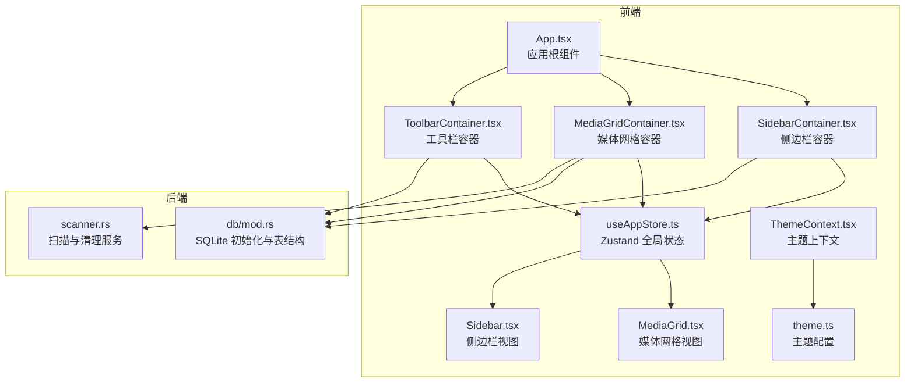
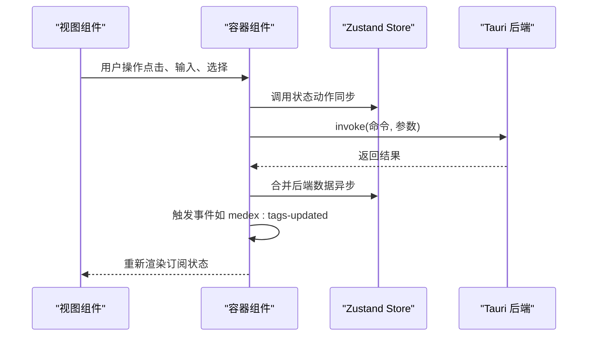
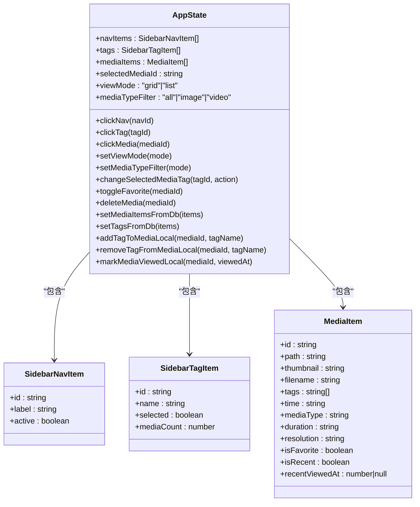
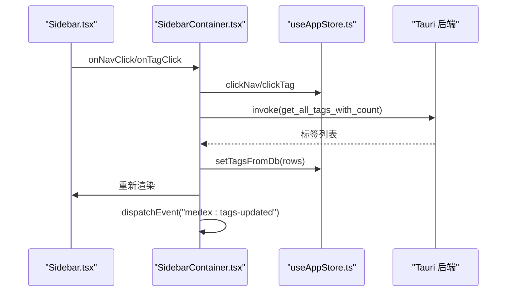
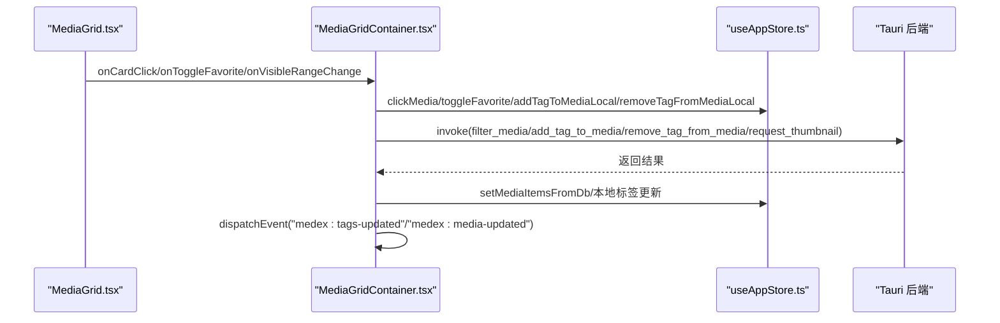
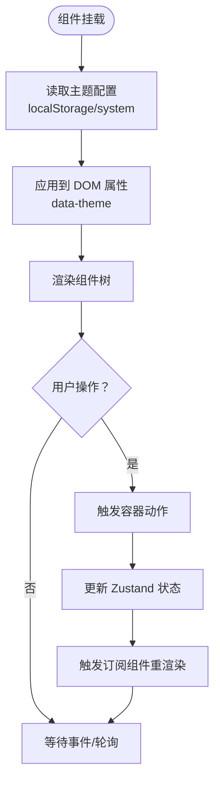
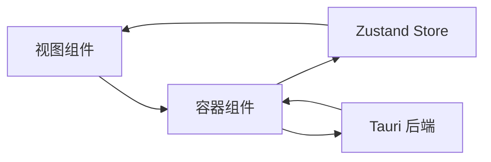
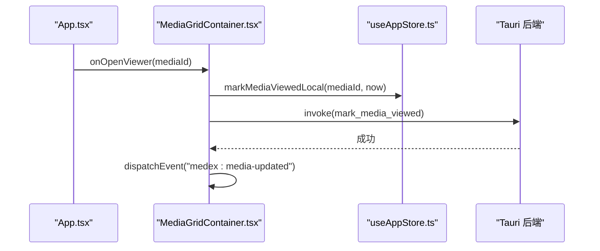

# 状态管理架构

<cite>
**本文引用的文件**
- [src/store/useAppStore.ts](file://src/store/useAppStore.ts)
- [src/App.tsx](file://src/App.tsx)
- [src/main.tsx](file://src/main.tsx)
- [src/containers/SidebarContainer.tsx](file://src/containers/SidebarContainer.tsx)
- [src/containers/MediaGridContainer.tsx](file://src/containers/MediaGridContainer.tsx)
- [src/containers/ToolbarContainer.tsx](file://src/containers/ToolbarContainer.tsx)
- [src/components/MediaGrid.tsx](file://src/components/MediaGrid.tsx)
- [src/components/Sidebar.tsx](file://src/components/Sidebar.tsx)
- [src/contexts/ThemeContext.tsx](file://src/contexts/ThemeContext.tsx)
- [src/theme/theme.ts](file://src/theme/theme.ts)
- [package.json](file://package.json)
- [src-tauri/src/db/mod.rs](file://src-tauri/src/db/mod.rs)
- [src-tauri/src/services/scanner.rs](file://src-tauri/src/services/scanner.rs)
</cite>

## 目录
1. [简介](#简介)
2. [项目结构](#项目结构)
3. [核心组件](#核心组件)
4. [架构总览](#架构总览)
5. [详细组件分析](#详细组件分析)
6. [依赖关系分析](#依赖关系分析)
7. [性能考量](#性能考量)
8. [故障排查指南](#故障排查指南)
9. [结论](#结论)
10. [附录](#附录)

## 简介
本文件系统性阐述 Medex 应用的状态管理架构与实现细节，重点围绕 Zustand 全局状态库的选择理由、使用模式与最佳实践展开。文档覆盖媒体数据、导航状态、用户偏好等状态的组织方式，状态更新机制（同步与异步）、订阅与组件绑定、持久化与恢复策略，并提供状态流转图与典型场景的调用序列图，帮助开发者快速理解并扩展状态管理方案。

## 项目结构
Medex 的前端采用 React + Tauri 架构，状态管理集中于 Zustand Store，组件通过容器组件进行状态订阅与业务逻辑编排，后端由 Rust 提供数据库与系统能力支撑。

**图表来源**
- [src/App.tsx:1-73](file://src/App.tsx#L1-L73)
- [src/containers/SidebarContainer.tsx:1-79](file://src/containers/SidebarContainer.tsx#L1-L79)
- [src/containers/MediaGridContainer.tsx:1-619](file://src/containers/MediaGridContainer.tsx#L1-L619)
- [src/containers/ToolbarContainer.tsx:1-113](file://src/containers/ToolbarContainer.tsx#L1-L113)
- [src/store/useAppStore.ts:1-395](file://src/store/useAppStore.ts#L1-L395)
- [src/components/MediaGrid.tsx:1-200](file://src/components/MediaGrid.tsx#L1-L200)
- [src/components/Sidebar.tsx:1-145](file://src/components/Sidebar.tsx#L1-L145)
- [src/contexts/ThemeContext.tsx:1-99](file://src/contexts/ThemeContext.tsx#L1-L99)
- [src/theme/theme.ts:1-159](file://src/theme/theme.ts#L1-L159)
- [src-tauri/src/db/mod.rs:1-122](file://src-tauri/src/db/mod.rs#L1-L122)
- [src-tauri/src/services/scanner.rs:492-524](file://src-tauri/src/services/scanner.rs#L492-L524)

**章节来源**
- [src/main.tsx:1-44](file://src/main.tsx#L1-L44)
- [package.json:1-36](file://package.json#L1-L36)

## 核心组件
- Zustand 全局状态仓库：集中管理导航项、标签、媒体项、视图模式、媒体类型过滤器、选中媒体等状态；提供同步与异步更新方法。
- 容器组件：负责订阅状态、触发动作、与后端交互（Tauri invoke），并通过事件或轮询驱动状态刷新。
- 视图组件：接收来自容器的状态与回调，渲染 UI 并触发本地动作。
- 主题上下文：提供主题模式切换与持久化，影响 UI 渲染。

关键要点
- 状态模型清晰：导航、标签、媒体、视图模式、过滤器等分层明确，便于按需订阅。
- 同步更新：直接 set 或映射更新，适合轻量 UI 状态。
- 异步更新：通过 invoke 调用后端接口，成功后再合并回前端状态，避免竞态。
- 事件驱动：使用 window 自定义事件与 Tauri 事件监听，实现跨组件与跨窗口状态同步。

**章节来源**
- [src/store/useAppStore.ts:48-68](file://src/store/useAppStore.ts#L48-L68)
- [src/containers/SidebarContainer.tsx:1-79](file://src/containers/SidebarContainer.tsx#L1-L79)
- [src/containers/MediaGridContainer.tsx:1-619](file://src/containers/MediaGridContainer.tsx#L1-L619)
- [src/containers/ToolbarContainer.tsx:1-113](file://src/containers/ToolbarContainer.tsx#L1-L113)
- [src/contexts/ThemeContext.tsx:1-99](file://src/contexts/ThemeContext.tsx#L1-L99)

## 架构总览
Zustand 在本项目中承担“单一真相源”的角色，容器组件作为“动作发起者”，视图组件作为“渲染者”。后端通过 Tauri 暴露命令，容器组件通过 invoke 调用，成功后回写前端状态并广播事件，其他组件监听事件刷新。

**图表来源**
- [src/containers/MediaGridContainer.tsx:145-175](file://src/containers/MediaGridContainer.tsx#L145-L175)
- [src/containers/SidebarContainer.tsx:28-33](file://src/containers/SidebarContainer.tsx#L28-L33)
- [src/store/useAppStore.ts:258-288](file://src/store/useAppStore.ts#L258-L288)

## 详细组件分析

### Zustand 状态仓库（useAppStore）
- 设计原则
  - 类型安全：通过 TypeScript 类型约束导航项、标签、媒体项等结构。
  - 分层职责：将 UI 状态（导航、视图模式、过滤器）与数据状态（媒体、标签）分离。
  - 可组合动作：将本地更新与后端同步动作解耦，便于测试与维护。
- 关键动作
  - 导航与标签选择：clickNav、clickTag 支持 UI 激活态切换。
  - 媒体选择与收藏：clickMedia、toggleFavorite、deleteMedia。
  - 标签管理：changeSelectedMediaTag、addTagToMediaLocal、removeTagFromMediaLocal。
  - 数据同步：setMediaItemsFromDb、setTagsFromDb。
  - 最近浏览标记：markMediaViewedLocal。
- 性能特性
  - 仅订阅所需字段，减少不必要重渲染。
  - 批量合并更新（如 setMediaItemsFromDb），降低多次重渲染成本。

**图表来源**
- [src/store/useAppStore.ts:3-46](file://src/store/useAppStore.ts#L3-L46)
- [src/store/useAppStore.ts:48-68](file://src/store/useAppStore.ts#L48-L68)

**章节来源**
- [src/store/useAppStore.ts:145-394](file://src/store/useAppStore.ts#L145-L394)

### 容器组件与状态订阅

#### 侧边栏容器（SidebarContainer）
- 职责
  - 订阅导航与标签状态，响应用户点击。
  - 从后端获取标签列表并回填至状态。
  - 创建/删除标签并广播“标签已更新”事件。
- 订阅与动作
  - 订阅：navItems、tags、clickNav、clickTag、setTagsFromDb。
  - 动作：handleCreateTag、handleDeleteTag。
- 事件驱动
  - 监听“medex:tags-updated”事件，触发重新拉取标签。

**图表来源**
- [src/containers/SidebarContainer.tsx:8-33](file://src/containers/SidebarContainer.tsx#L8-L33)
- [src/store/useAppStore.ts:277-288](file://src/store/useAppStore.ts#L277-L288)

**章节来源**
- [src/containers/SidebarContainer.tsx:1-79](file://src/containers/SidebarContainer.tsx#L1-L79)
- [src/components/Sidebar.tsx:1-145](file://src/components/Sidebar.tsx#L1-L145)

#### 媒体网格容器（MediaGridContainer）
- 职责
  - 订阅媒体列表、导航、标签、视图模式与过滤器。
  - 与后端交互：筛选媒体、收藏切换、批量标签应用、缩略图请求。
  - 事件监听：媒体更新、扫描完成、缩略图就绪、库路径变更。
- 关键流程
  - 筛选与排序：根据导航与标签选择过滤媒体，最近视图按最近观看时间排序。
  - 批量标签：对选中媒体批量添加/移除标签，同时调用后端与本地更新。
  - 缩略图队列：并发限制与优先级调度，避免资源争用。
- 订阅与动作
  - 订阅：mediaItems、navItems、tags、selectedMediaId、mediaTypeFilter、setMediaItemsFromDb、addTagToMediaLocal、removeTagFromMediaLocal、toggleFavorite。
  - 动作：handleCardClick、handleContextMenu、handleTagsApplied、handleToggleFavorite、handleVisibleRangeChange。

**图表来源**
- [src/containers/MediaGridContainer.tsx:30-619](file://src/containers/MediaGridContainer.tsx#L30-L619)
- [src/components/MediaGrid.tsx:70-200](file://src/components/MediaGrid.tsx#L70-L200)
- [src/store/useAppStore.ts:174-177](file://src/store/useAppStore.ts#L174-L177)

**章节来源**
- [src/containers/MediaGridContainer.tsx:1-619](file://src/containers/MediaGridContainer.tsx#L1-L619)
- [src/components/MediaGrid.tsx:1-200](file://src/components/MediaGrid.tsx#L1-L200)

#### 工具栏容器（ToolbarContainer）
- 职责
  - 订阅标签与媒体类型过滤器，加载全部媒体并展示结果数量。
  - 监听扫描完成事件，刷新媒体列表。
- 订阅与动作
  - 订阅：tags、mediaItems、mediaTypeFilter、setMediaTypeFilter、setMediaItemsFromDb。
  - 动作：loadAllMedia、handleMediaTypeChange。

**章节来源**
- [src/containers/ToolbarContainer.tsx:1-113](file://src/containers/ToolbarContainer.tsx#L1-L113)

### 视图组件与主题上下文
- 视图组件通过容器组件注入的状态与回调渲染 UI，并响应用户交互。
- 主题上下文提供主题模式切换与持久化，影响组件样式变量。

**图表来源**
- [src/contexts/ThemeContext.tsx:17-99](file://src/contexts/ThemeContext.tsx#L17-L99)
- [src/theme/theme.ts:1-159](file://src/theme/theme.ts#L1-L159)

**章节来源**
- [src/contexts/ThemeContext.tsx:1-99](file://src/contexts/ThemeContext.tsx#L1-L99)
- [src/theme/theme.ts:1-159](file://src/theme/theme.ts#L1-L159)

## 依赖关系分析
- 状态依赖
  - 容器组件依赖 Zustand Store 的状态与动作。
  - 视图组件依赖容器组件提供的 props 与回调。
- 外部依赖
  - Tauri invoke 用于与后端通信。
  - 事件系统用于跨组件与跨窗口同步。
- 数据流
  - 后端数据 → 容器 → Store → 视图组件。
  - 用户交互 → 容器 → Store → 后端 → 容器 → Store → 视图组件。

**图表来源**
- [src/containers/MediaGridContainer.tsx:30-619](file://src/containers/MediaGridContainer.tsx#L30-L619)
- [src/store/useAppStore.ts:145-394](file://src/store/useAppStore.ts#L145-L394)

**章节来源**
- [package.json:12-21](file://package.json#L12-L21)

## 性能考量
- 订阅粒度
  - 仅订阅需要的字段，避免不必要的重渲染。
  - 使用 useMemo/memo 优化计算与子组件渲染。
- 异步批处理
  - setMediaItemsFromDb 合并前后端数据，减少多次渲染。
  - 批量标签操作一次性提交，降低事件风暴。
- 资源调度
  - 缩略图请求队列控制并发与优先级，避免阻塞主线程。
- 事件去抖
  - 使用定时器与节流策略（如筛选防抖）平衡实时性与性能。

[本节为通用性能建议，无需特定文件来源]

## 故障排查指南
- 标签更新不同步
  - 确认容器是否在操作后触发“medex:tags-updated”事件。
  - 检查监听器是否正确注册与注销。
- 媒体更新未生效
  - 确认“medex:media-updated”事件是否触发与监听。
  - 检查 setMediaItemsFromDb 是否合并了最新数据。
- 缩略图不显示
  - 检查缩略图队列与并发限制，确认请求成功回调。
  - 确认 thumbnail_ready 事件是否被监听。
- 主题切换无效
  - 检查 localStorage 键值与 data-theme 属性更新。
  - 确认跨窗口 storage 事件监听是否生效。

**章节来源**
- [src/containers/MediaGridContainer.tsx:488-494](file://src/containers/MediaGridContainer.tsx#L488-L494)
- [src/containers/SidebarContainer.tsx:31-33](file://src/containers/SidebarContainer.tsx#L31-L33)
- [src/contexts/ThemeContext.tsx:56-66](file://src/contexts/ThemeContext.tsx#L56-L66)

## 结论
Medex 的状态管理以 Zustand 为核心，结合容器组件与事件驱动机制，实现了清晰的职责划分与良好的可维护性。通过同步与异步动作的合理拆分、细粒度订阅与批处理策略，系统在复杂交互场景下仍能保持稳定与高性能。建议后续在以下方面持续优化：
- 将部分状态持久化到 localStorage 或 IndexedDB，提升重启体验。
- 对高频事件（如滚动、缩略图）增加节流/去抖策略。
- 增加状态快照与回滚能力，增强调试与恢复能力。

[本节为总结性内容，无需特定文件来源]

## 附录

### 状态更新机制与持久化
- 同步更新
  - 适用于 UI 激活态切换、视图模式与过滤器等轻量状态。
  - 示例：点击导航项、切换视图模式、选择标签。
- 异步更新
  - 适用于与后端交互的数据变更，成功后再合并到前端状态。
  - 示例：收藏状态切换、标签增删、媒体筛选。
- 持久化与恢复
  - 主题模式：localStorage 持久化，跨窗口同步。
  - 媒体库路径：localStorage 存储，容器监听变化并刷新。
  - 建议：将关键 UI 偏好（如视图模式、过滤器）持久化，提升用户体验。

**章节来源**
- [src/containers/ToolbarContainer.tsx:31-52](file://src/containers/ToolbarContainer.tsx#L31-L52)
- [src/containers/MediaGridContainer.tsx:269-291](file://src/containers/MediaGridContainer.tsx#L269-L291)
- [src/contexts/ThemeContext.tsx:34-54](file://src/contexts/ThemeContext.tsx#L34-L54)

### 典型状态变更场景
- 打开媒体查看器
  - 容器根据当前导航与标签筛选媒体列表，打开查看器并标记最近浏览。
  - 触发后端“mark_media_viewed”命令，完成后广播“medex:media-updated”。

**图表来源**
- [src/App.tsx:28-42](file://src/App.tsx#L28-L42)
- [src/store/useAppStore.ts:382-393](file://src/store/useAppStore.ts#L382-L393)

### 数据库与扫描服务
- 数据库初始化
  - 初始化 SQLite 文件与表结构，建立索引以优化查询。
- 扫描与清理
  - 提供扫描与清理媒体库的能力，清理后刷新非设置窗口。

**章节来源**
- [src-tauri/src/db/mod.rs:12-43](file://src-tauri/src/db/mod.rs#L12-L43)
- [src-tauri/src/services/scanner.rs:492-524](file://src-tauri/src/services/scanner.rs#L492-L524)