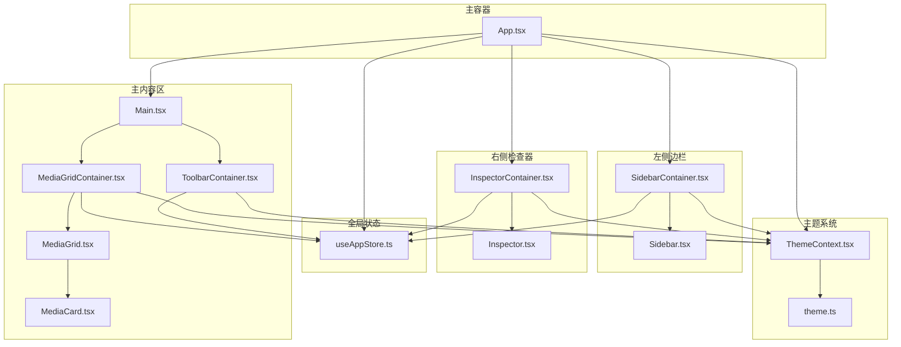
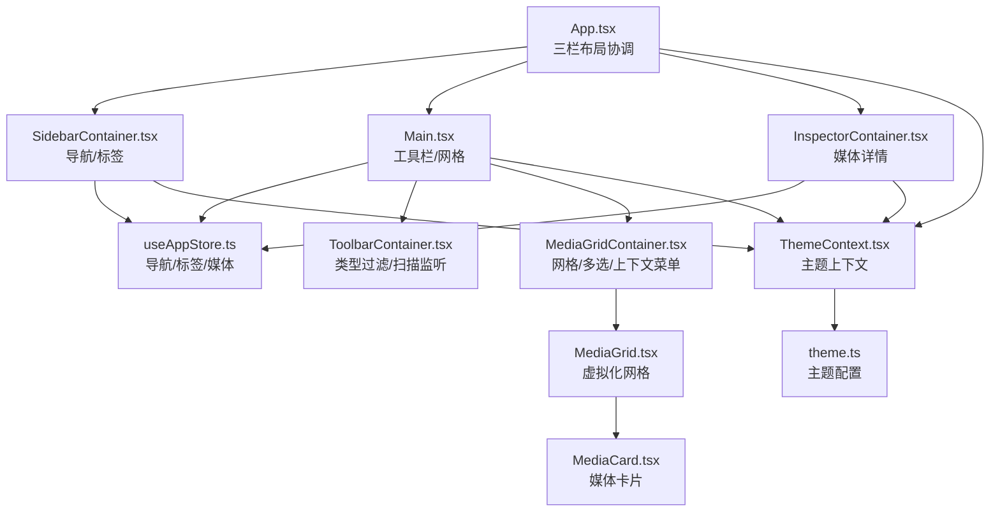
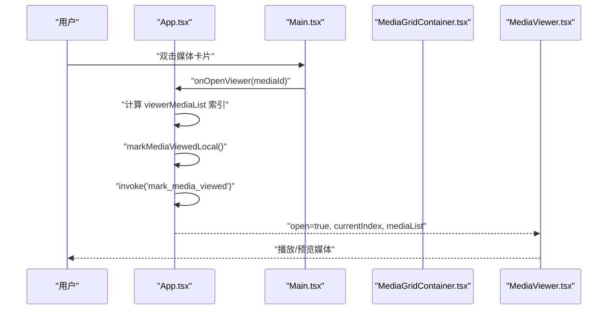
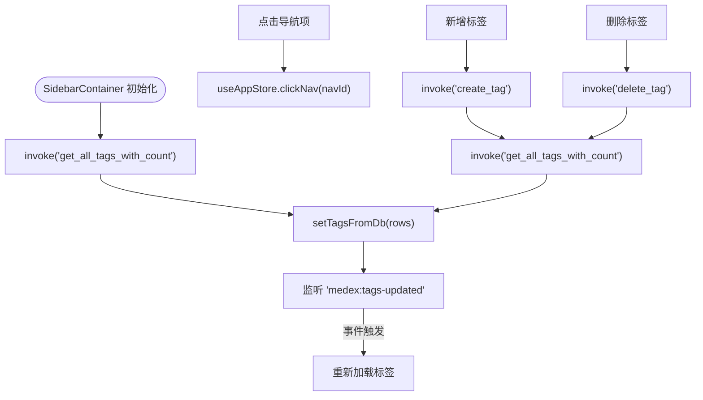
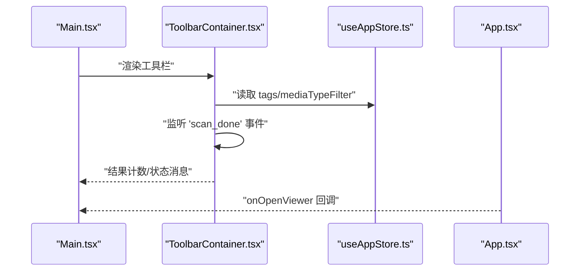
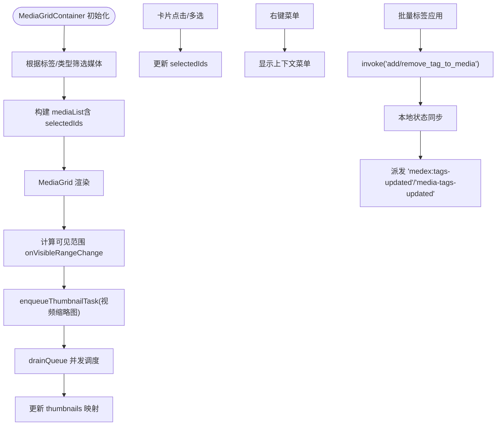
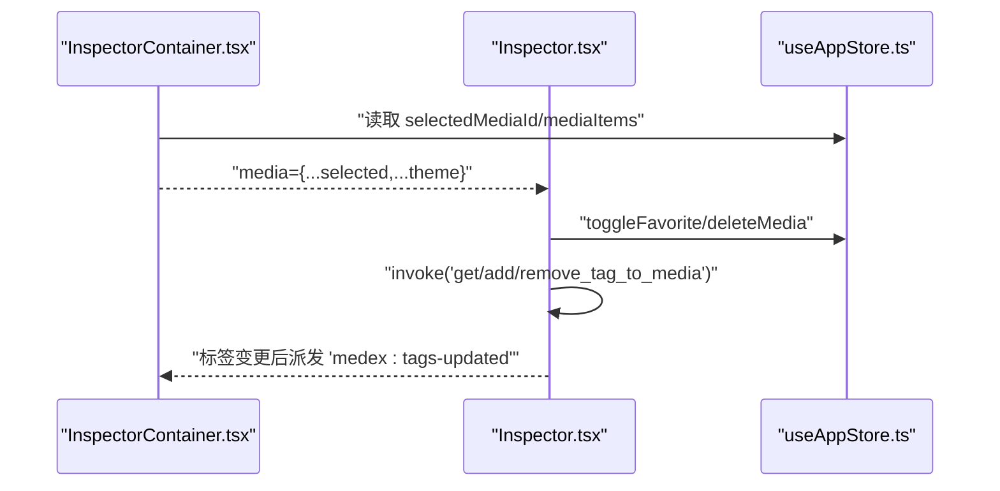
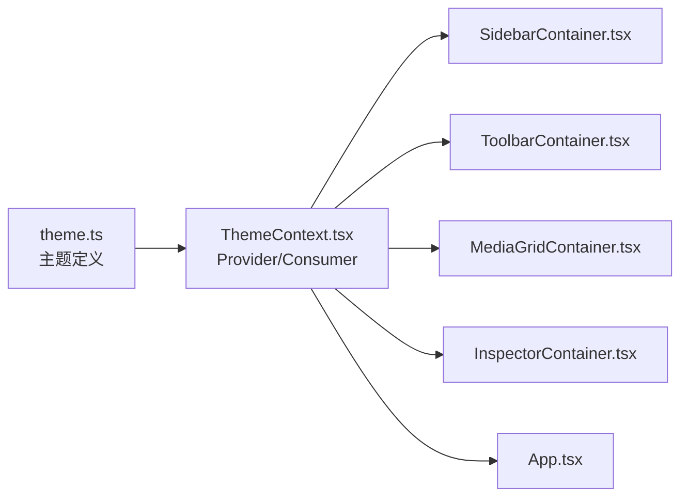
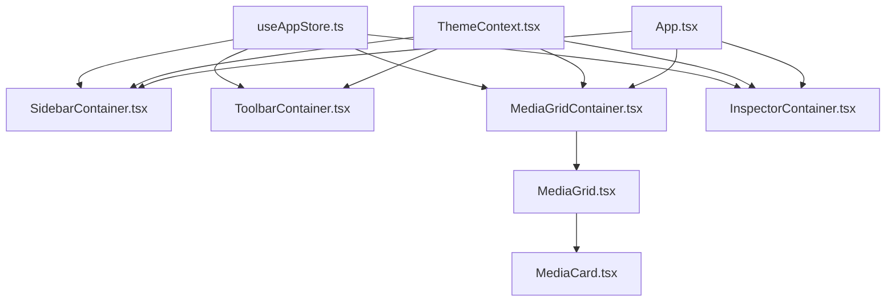

# 组件关系设计

<cite>
**本文引用的文件**
- [App.tsx](file://src/App.tsx)
- [Main.tsx](file://src/components/Main.tsx)
- [Sidebar.tsx](file://src/components/Sidebar.tsx)
- [Inspector.tsx](file://src/components/Inspector.tsx)
- [MediaGrid.tsx](file://src/components/MediaGrid.tsx)
- [MediaCard.tsx](file://src/components/MediaCard.tsx)
- [MediaViewer.tsx](file://src/components/MediaViewer.tsx)
- [SidebarContainer.tsx](file://src/containers/SidebarContainer.tsx)
- [InspectorContainer.tsx](file://src/containers/InspectorContainer.tsx)
- [MediaGridContainer.tsx](file://src/containers/MediaGridContainer.tsx)
- [ToolbarContainer.tsx](file://src/containers/ToolbarContainer.tsx)
- [useAppStore.ts](file://src/store/useAppStore.ts)
- [ThemeContext.tsx](file://src/contexts/ThemeContext.tsx)
- [theme.ts](file://src/theme/theme.ts)
</cite>

## 目录
1. [简介](#简介)
2. [项目结构](#项目结构)
3. [核心组件](#核心组件)
4. [架构总览](#架构总览)
5. [详细组件分析](#详细组件分析)
6. [依赖分析](#依赖分析)
7. [性能考量](#性能考量)
8. [故障排查指南](#故障排查指南)
9. [结论](#结论)
10. [附录](#附录)

## 简介
本设计文档聚焦 Medex 应用的三栏式布局与组件关系，围绕 App.tsx 作为主容器如何协调 Sidebar、Main、Inspector 三大区域展开；阐述容器组件与展示组件的分离原则、组件间通信机制（props 传递、事件回调、状态共享）、生命周期管理与性能优化策略，并提供组件关系图与数据流向图，最后总结组件复用性与可扩展性设计。

## 项目结构
Medex 采用“容器组件 + 展示组件 + 全局状态 + 主题上下文”的分层组织方式：
- 容器组件负责数据获取、状态管理与事件处理，向展示组件注入 props
- 展示组件专注 UI 呈现与用户交互，不直接访问外部系统
- 全局状态通过 Zustand 管理应用级数据与行为
- 主题上下文统一提供主题模式与颜色变量

图表来源
- [App.tsx:1-73](file://src/App.tsx#L1-L73)
- [Main.tsx:1-25](file://src/components/Main.tsx#L1-L25)
- [SidebarContainer.tsx:1-79](file://src/containers/SidebarContainer.tsx#L1-L79)
- [Sidebar.tsx:1-145](file://src/components/Sidebar.tsx#L1-L145)
- [InspectorContainer.tsx:1-32](file://src/containers/InspectorContainer.tsx#L1-L32)
- [Inspector.tsx:1-277](file://src/components/Inspector.tsx#L1-L277)
- [MediaGridContainer.tsx:1-619](file://src/containers/MediaGridContainer.tsx#L1-L619)
- [MediaGrid.tsx:1-351](file://src/components/MediaGrid.tsx#L1-L351)
- [MediaCard.tsx:1-318](file://src/components/MediaCard.tsx#L1-L318)
- [ToolbarContainer.tsx:1-113](file://src/containers/ToolbarContainer.tsx#L1-L113)
- [useAppStore.ts:1-395](file://src/store/useAppStore.ts#L1-L395)
- [ThemeContext.tsx:1-99](file://src/contexts/ThemeContext.tsx#L1-L99)
- [theme.ts:1-159](file://src/theme/theme.ts#L1-L159)

章节来源
- [App.tsx:1-73](file://src/App.tsx#L1-L73)
- [Main.tsx:1-25](file://src/components/Main.tsx#L1-L25)
- [SidebarContainer.tsx:1-79](file://src/containers/SidebarContainer.tsx#L1-L79)
- [Sidebar.tsx:1-145](file://src/components/Sidebar.tsx#L1-L145)
- [InspectorContainer.tsx:1-32](file://src/containers/InspectorContainer.tsx#L1-L32)
- [Inspector.tsx:1-277](file://src/components/Inspector.tsx#L1-L277)
- [MediaGridContainer.tsx:1-619](file://src/containers/MediaGridContainer.tsx#L1-L619)
- [MediaGrid.tsx:1-351](file://src/components/MediaGrid.tsx#L1-L351)
- [MediaCard.tsx:1-318](file://src/components/MediaCard.tsx#L1-L318)
- [ToolbarContainer.tsx:1-113](file://src/containers/ToolbarContainer.tsx#L1-L113)
- [useAppStore.ts:1-395](file://src/store/useAppStore.ts#L1-L395)
- [ThemeContext.tsx:1-99](file://src/contexts/ThemeContext.tsx#L1-L99)
- [theme.ts:1-159](file://src/theme/theme.ts#L1-L159)

## 核心组件
- App.tsx：三栏式布局的根容器，协调 Sidebar、Main、Inspector 区域，维护媒体查看器状态与导航筛选逻辑
- SidebarContainer.tsx + Sidebar.tsx：侧边导航与标签管理，负责标签 CRUD、导航切换与主题注入
- Main.tsx：主内容区入口，承载工具栏与媒体网格
- ToolbarContainer.tsx：工具栏容器，负责类型过滤、扫描进度监听与结果计数
- MediaGridContainer.tsx + MediaGrid.tsx + MediaCard.tsx：媒体网格渲染与交互，支持多选、上下文菜单、批量标签、视频缩略图队列与懒加载
- InspectorContainer.tsx + Inspector.tsx：媒体详情检查器，支持标签增删、收藏切换、删除媒体
- useAppStore.ts：Zustand 全局状态，集中管理导航项、标签、媒体项、选中态与视图模式等
- ThemeContext.tsx + theme.ts：主题上下文与主题配置，支持深浅色与系统跟随

章节来源
- [App.tsx:1-73](file://src/App.tsx#L1-L73)
- [SidebarContainer.tsx:1-79](file://src/containers/SidebarContainer.tsx#L1-L79)
- [Sidebar.tsx:1-145](file://src/components/Sidebar.tsx#L1-L145)
- [Main.tsx:1-25](file://src/components/Main.tsx#L1-L25)
- [ToolbarContainer.tsx:1-113](file://src/containers/ToolbarContainer.tsx#L1-L113)
- [MediaGridContainer.tsx:1-619](file://src/containers/MediaGridContainer.tsx#L1-L619)
- [MediaGrid.tsx:1-351](file://src/components/MediaGrid.tsx#L1-L351)
- [MediaCard.tsx:1-318](file://src/components/MediaCard.tsx#L1-L318)
- [InspectorContainer.tsx:1-32](file://src/containers/InspectorContainer.tsx#L1-L32)
- [Inspector.tsx:1-277](file://src/components/Inspector.tsx#L1-L277)
- [useAppStore.ts:1-395](file://src/store/useAppStore.ts#L1-L395)
- [ThemeContext.tsx:1-99](file://src/contexts/ThemeContext.tsx#L1-L99)
- [theme.ts:1-159](file://src/theme/theme.ts#L1-L159)

## 架构总览
三栏式布局由 App.tsx 统一调度：
- 左侧 Sidebar：导航与标签管理，触发全局状态变更
- 中部 Main：工具栏与媒体网格，响应导航与标签筛选
- 右侧 Inspector：媒体详情，支持标签与收藏操作
- 上层容器组件通过 useAppStore 与 ThemeContext 提供数据与主题
- 下层展示组件仅消费 props 并触发回调，避免直接访问外部系统

图表来源
- [App.tsx:1-73](file://src/App.tsx#L1-L73)
- [SidebarContainer.tsx:1-79](file://src/containers/SidebarContainer.tsx#L1-L79)
- [Main.tsx:1-25](file://src/components/Main.tsx#L1-L25)
- [ToolbarContainer.tsx:1-113](file://src/containers/ToolbarContainer.tsx#L1-L113)
- [MediaGridContainer.tsx:1-619](file://src/containers/MediaGridContainer.tsx#L1-L619)
- [MediaGrid.tsx:1-351](file://src/components/MediaGrid.tsx#L1-L351)
- [MediaCard.tsx:1-318](file://src/components/MediaCard.tsx#L1-L318)
- [InspectorContainer.tsx:1-32](file://src/containers/InspectorContainer.tsx#L1-L32)
- [useAppStore.ts:1-395](file://src/store/useAppStore.ts#L1-L395)
- [ThemeContext.tsx:1-99](file://src/contexts/ThemeContext.tsx#L1-L99)
- [theme.ts:1-159](file://src/theme/theme.ts#L1-L159)

## 详细组件分析

### App.tsx 主容器
- 职责
  - 维护媒体查看器状态（打开/关闭、当前索引）
  - 基于导航项计算查看器媒体列表（收藏/最近/全部）
  - 将打开查看器的回调传递给 Main，将媒体列表与索引传递给 MediaViewer
  - 生命周期中校验查看器状态与边界
- 关键交互
  - onOpenViewer：定位媒体索引、标记已观看、调用后端接口并派发全局事件
  - handleCloseViewer：关闭查看器
- 数据流
  - 从 useAppStore 读取 mediaItems/navItems/markMediaViewedLocal
  - 计算 viewerMediaList 并传入 MediaViewer

图表来源
- [App.tsx:28-46](file://src/App.tsx#L28-L46)
- [App.tsx:48-57](file://src/App.tsx#L48-L57)
- [Main.tsx:8-23](file://src/components/Main.tsx#L8-L23)
- [MediaGridContainer.tsx:593-594](file://src/containers/MediaGridContainer.tsx#L593-L594)
- [MediaViewer.tsx:14-63](file://src/components/MediaViewer.tsx#L14-L63)

章节来源
- [App.tsx:1-73](file://src/App.tsx#L1-L73)

### Sidebar 与 SidebarContainer
- 职责分离
  - SidebarContainer：从 useAppStore 读取导航与标签，执行标签 CRUD、导航点击、主题注入
  - Sidebar：接收回调与主题，渲染导航与标签 UI
- 通信机制
  - props：navItems/tags/newTagName/on* 回调
  - 全局事件：标签变更后派发 medex:tags-updated，驱动重新加载
- 性能与健壮性
  - 加载标签时捕获错误并提示
  - 监听 medex:tags-updated 事件，确保跨窗口同步

图表来源
- [SidebarContainer.tsx:16-33](file://src/containers/SidebarContainer.tsx#L16-L33)
- [SidebarContainer.tsx:35-63](file://src/containers/SidebarContainer.tsx#L35-L63)
- [Sidebar.tsx:5-27](file://src/components/Sidebar.tsx#L5-L27)
- [useAppStore.ts:152-172](file://src/store/useAppStore.ts#L152-L172)

章节来源
- [SidebarContainer.tsx:1-79](file://src/containers/SidebarContainer.tsx#L1-L79)
- [Sidebar.tsx:1-145](file://src/components/Sidebar.tsx#L1-L145)
- [useAppStore.ts:1-395](file://src/store/useAppStore.ts#L1-L395)

### Main 与 ToolbarContainer
- Main：承载标题、工具栏与媒体网格容器
- ToolbarContainer：类型过滤、扫描进度监听、结果计数
- 通信机制
  - Main -> ToolbarContainer：无 props，内部自行订阅状态
  - Main -> MediaGridContainer：onOpenViewer 回调

图表来源
- [Main.tsx:8-23](file://src/components/Main.tsx#L8-L23)
- [ToolbarContainer.tsx:14-112](file://src/containers/ToolbarContainer.tsx#L14-L112)
- [useAppStore.ts:15-68](file://src/store/useAppStore.ts#L15-L68)

章节来源
- [Main.tsx:1-25](file://src/components/Main.tsx#L1-L25)
- [ToolbarContainer.tsx:1-113](file://src/containers/ToolbarContainer.tsx#L1-L113)
- [useAppStore.ts:1-395](file://src/store/useAppStore.ts#L1-L395)

### MediaGridContainer、MediaGrid 与 MediaCard
- 职责
  - MediaGridContainer：筛选媒体、多选、上下文菜单、批量标签、视频缩略图队列、库路径监听、全局事件监听
  - MediaGrid：虚拟化网格/列表渲染，计算可见范围并回调
  - MediaCard：媒体卡片 UI，支持收藏、标签移除、双击打开查看器
- 通信机制
  - MediaGridContainer -> MediaGrid：mediaList、selectedIds、回调、主题
  - MediaGrid -> MediaCard：每个单元的 props（含回调）
  - MediaCard -> MediaGridContainer：onDoubleClick -> onOpenViewer
- 性能优化
  - react-window 虚拟化，减少 DOM 数量
  - 缩略图请求队列与并发控制，避免阻塞
  - useMemo/useCallback 缓存计算与回调
  - ResizeObserver 监听容器尺寸变化

图表来源
- [MediaGridContainer.tsx:30-618](file://src/containers/MediaGridContainer.tsx#L30-L618)
- [MediaGrid.tsx:70-212](file://src/components/MediaGrid.tsx#L70-L212)
- [MediaCard.tsx:34-264](file://src/components/MediaCard.tsx#L34-L264)

章节来源
- [MediaGridContainer.tsx:1-619](file://src/containers/MediaGridContainer.tsx#L1-L619)
- [MediaGrid.tsx:1-351](file://src/components/MediaGrid.tsx#L1-L351)
- [MediaCard.tsx:1-318](file://src/components/MediaCard.tsx#L1-L318)

### Inspector 与 InspectorContainer
- 职责
  - InspectorContainer：从 useAppStore 读取选中媒体，组装为 Inspector 的 props
  - Inspector：展示媒体详情、标签增删、收藏切换、删除媒体
- 通信机制
  - InspectorContainer -> Inspector：media/onToggleFavorite/onDeleteMedia
  - Inspector -> useAppStore：toggleFavorite/deleteMedia
  - Inspector 内部通过 invoke 与全局事件与后端交互

图表来源
- [InspectorContainer.tsx:6-31](file://src/containers/InspectorContainer.tsx#L6-L31)
- [Inspector.tsx:19-264](file://src/components/Inspector.tsx#L19-L264)
- [useAppStore.ts:61-67](file://src/store/useAppStore.ts#L61-L67)

章节来源
- [InspectorContainer.tsx:1-32](file://src/containers/InspectorContainer.tsx#L1-L32)
- [Inspector.tsx:1-277](file://src/components/Inspector.tsx#L1-L277)
- [useAppStore.ts:1-395](file://src/store/useAppStore.ts#L1-L395)

### 主题系统与样式一致性
- ThemeContext 提供主题模式切换与颜色变量
- theme.ts 定义深/浅色主题与系统跟随逻辑
- 各容器与展示组件通过 useThemeContext 注入主题，确保 UI 一致性

图表来源
- [ThemeContext.tsx:17-98](file://src/contexts/ThemeContext.tsx#L17-L98)
- [theme.ts:54-159](file://src/theme/theme.ts#L54-L159)

章节来源
- [ThemeContext.tsx:1-99](file://src/contexts/ThemeContext.tsx#L1-L99)
- [theme.ts:1-159](file://src/theme/theme.ts#L1-L159)

## 依赖分析
- 组件耦合
  - 容器组件对全局状态与主题上下文有直接依赖，展示组件仅依赖 props
  - MediaGridContainer 与 MediaGrid 之间为强耦合的数据/回调关系
- 外部依赖
  - @tauri-apps/api：invoke、listen、dialog、event
  - react-window：虚拟化渲染
  - Zustand：状态管理
- 循环依赖
  - 未见循环依赖，组件按容器/展示分层组织

图表来源
- [useAppStore.ts:1-395](file://src/store/useAppStore.ts#L1-L395)
- [ThemeContext.tsx:1-99](file://src/contexts/ThemeContext.tsx#L1-L99)
- [MediaGridContainer.tsx:1-619](file://src/containers/MediaGridContainer.tsx#L1-L619)
- [MediaGrid.tsx:1-351](file://src/components/MediaGrid.tsx#L1-L351)
- [MediaCard.tsx:1-318](file://src/components/MediaCard.tsx#L1-L318)
- [App.tsx:1-73](file://src/App.tsx#L1-L73)

章节来源
- [useAppStore.ts:1-395](file://src/store/useAppStore.ts#L1-L395)
- [ThemeContext.tsx:1-99](file://src/contexts/ThemeContext.tsx#L1-L99)
- [MediaGridContainer.tsx:1-619](file://src/containers/MediaGridContainer.tsx#L1-L619)
- [MediaGrid.tsx:1-351](file://src/components/MediaGrid.tsx#L1-L351)
- [MediaCard.tsx:1-318](file://src/components/MediaCard.tsx#L1-L318)
- [App.tsx:1-73](file://src/App.tsx#L1-L73)

## 性能考量
- 虚拟化渲染
  - MediaGrid 使用 react-window 的 FixedSizeGrid/List，仅渲染可视区域，降低内存占用与重排成本
- 计算缓存
  - useMemo/useCallback 在 MediaGridContainer 与 MediaGrid 中广泛使用，避免重复计算与对象重建
- 缩略图队列与并发
  - 任务队列与并发上限控制，结合请求去重与溢出保护，提升视频缩略图加载效率
- 尺寸监听
  - ResizeObserver 监听容器尺寸变化，避免强制布局抖动
- 事件与全局状态
  - 通过全局事件与局部状态同步，减少不必要的重渲染
- 图片与视频懒加载
  - MediaCard 对图片失败回退与视频缩略图加载状态进行处理，提升体验

章节来源
- [MediaGrid.tsx:84-212](file://src/components/MediaGrid.tsx#L84-L212)
- [MediaGridContainer.tsx:352-486](file://src/containers/MediaGridContainer.tsx#L352-L486)
- [MediaCard.tsx:52-264](file://src/components/MediaCard.tsx#L52-L264)

## 故障排查指南
- 标签操作失败
  - 现象：新增/删除标签弹窗提示失败
  - 排查：检查 invoke('create_tag'/'delete_tag'/'add_tag_to_media'/'remove_tag_from_media') 返回值与错误日志
  - 处理：确认后端服务可用、网络正常、标签名非空且唯一
- 媒体查看器无法切换
  - 现象：左右箭头或键盘方向键无效
  - 排查：检查 currentIndex/safeIndex 边界、mediaList 非空
  - 处理：确保 onOpenViewer 正确设置 currentIndex，App.tsx 的边界校验逻辑生效
- 缩略图加载缓慢
  - 现象：视频缩略图长时间显示占位符
  - 排查：检查 thumbnail_ready 事件是否到达、队列是否溢出、并发上限是否合理
  - 处理：适当提高并发上限、清理过期任务、确认后端生成任务正常
- 主题切换不同步
  - 现象：切换主题后部分组件颜色未更新
  - 排查：确认 ThemeProvider 已包裹应用根节点、localStorage 与 storage 事件监听
  - 处理：确保 data-theme 属性正确写入、主题模式持久化

章节来源
- [Inspector.tsx:27-41](file://src/components/Inspector.tsx#L27-L41)
- [MediaViewer.tsx:23-55](file://src/components/MediaViewer.tsx#L23-L55)
- [MediaGridContainer.tsx:352-486](file://src/containers/MediaGridContainer.tsx#L352-L486)
- [ThemeContext.tsx:56-66](file://src/contexts/ThemeContext.tsx#L56-L66)

## 结论
Medex 的三栏式布局通过容器组件与展示组件的清晰分离，实现了良好的关注点分离与可维护性。App.tsx 作为主容器，将 Sidebar、Main、Inspector 三大区域有机串联，配合全局状态与主题上下文，形成稳定的数据流与交互链路。容器组件承担数据与事件处理，展示组件专注 UI 呈现，辅以虚拟化渲染、队列并发与缓存策略，整体具备较好的性能表现与扩展空间。

## 附录
- 组件复用性
  - Sidebar、MediaGrid、MediaCard、Inspector 等组件均以 props 驱动，便于在不同场景复用
- 可扩展性
  - 新增导航项：在 useAppStore 的 navItems 中扩展，Sidebar 自动适配
  - 新增标签：Sidebar 提供统一入口，无需改动其他模块
  - 新增媒体类型：MediaGrid 支持按类型过滤，容器层可扩展筛选条件
  - 新增主题：在 theme.ts 中扩展主题配置，ThemeContext 自动生效