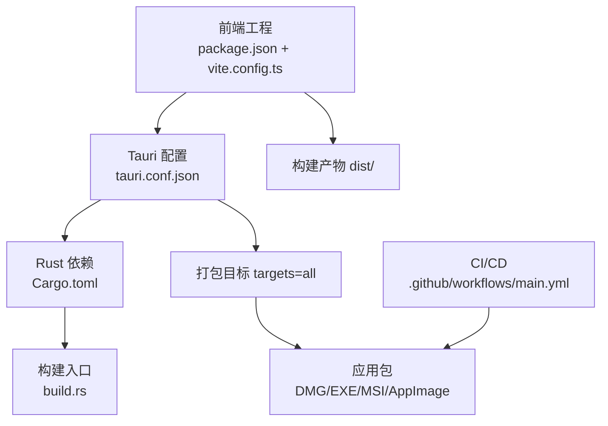
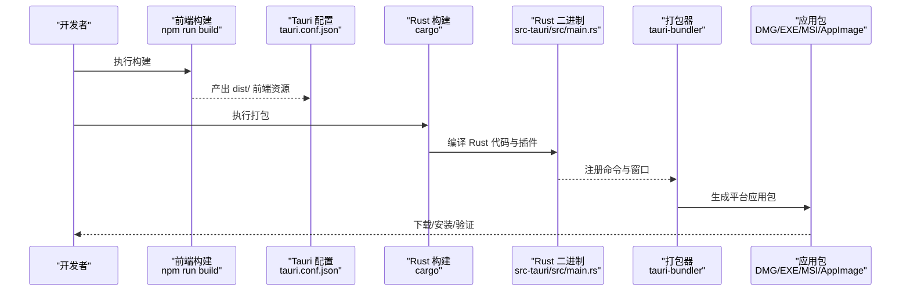
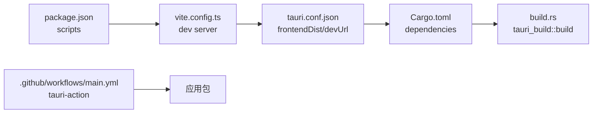

# 应用打包

<cite>
**本文引用的文件**
- [tauri.conf.json](file://src-tauri/tauri.conf.json)
- [Cargo.toml](file://src-tauri/Cargo.toml)
- [package.json](file://package.json)
- [vite.config.ts](file://vite.config.ts)
- [build.rs](file://src-tauri/build.rs)
- [.cargo/config.toml](file://src-tauri/.cargo/config.toml)
- [capabilities/default.json](file://src-tauri/capabilities/default.json)
- [.github/workflows/main.yml](file://.github/workflows/main.yml)
- [src/main.rs](file://src-tauri/src/main.rs)
- [src/menu.rs](file://src-tauri/src/menu.rs)
- [src/services/scanner.rs](file://src-tauri/src/services/scanner.rs)
- [RELEASE_GUIDE.md](file://RELEASE_GUIDE.md)
</cite>

## 目录
1. [简介](#简介)
2. [项目结构](#项目结构)
3. [核心组件](#核心组件)
4. [架构总览](#架构总览)
5. [详细组件分析](#详细组件分析)
6. [依赖分析](#依赖分析)
7. [性能考虑](#性能考虑)
8. [故障排查指南](#故障排查指南)
9. [结论](#结论)
10. [附录](#附录)

## 简介
本文件面向 Medex 桌面应用的打包与发布，围绕 Tauri v2 的打包流程进行系统性说明，覆盖前端资源打包、Rust 二进制构建、最终应用包生成、Tauri 配置项解读、平台特定打包要求（Windows EXE、macOS DMG、Linux AppImage）、代码签名与公证（尤其是 macOS）、自动更新配置与应用图标配置、常见问题与解决方案，以及不同平台的打包命令与参数说明。

## 项目结构
Medex 采用典型的 Tauri v2 结构：前端使用 Vite + React，后端使用 Rust，通过 Tauri 的命令系统桥接前后端。打包相关的关键位置如下：
- 前端工程：根目录下的 package.json、vite.config.ts、dist 输出目录
- Tauri 配置：src-tauri/tauri.conf.json
- Rust 依赖与插件：src-tauri/Cargo.toml
- 能力与权限：src-tauri/capabilities/default.json
- 构建入口与构建脚本：src-tauri/build.rs、src-tauri/.cargo/config.toml
- 自动更新与签名：.github/workflows/main.yml
- 运行时菜单与窗口：src-tauri/src/main.rs、src-tauri/src/menu.rs
- 扫描与数据库：src-tauri/src/services/scanner.rs

图表来源
- [tauri.conf.json:1-46](file://src-tauri/tauri.conf.json#L1-L46)
- [Cargo.toml:1-23](file://src-tauri/Cargo.toml#L1-L23)
- [build.rs:1-4](file://src-tauri/build.rs#L1-L4)
- [package.json:1-36](file://package.json#L1-L36)
- [vite.config.ts:1-11](file://vite.config.ts#L1-L11)
- [.github/workflows/main.yml:1-42](file://.github/workflows/main.yml#L1-L42)

章节来源
- [tauri.conf.json:1-46](file://src-tauri/tauri.conf.json#L1-L46)
- [Cargo.toml:1-23](file://src-tauri/Cargo.toml#L1-L23)
- [package.json:1-36](file://package.json#L1-L36)
- [vite.config.ts:1-11](file://vite.config.ts#L1-L11)
- [build.rs:1-4](file://src-tauri/build.rs#L1-L4)
- [.cargo/config.toml:1-5](file://src-tauri/.cargo/config.toml#L1-L5)
- [.github/workflows/main.yml:1-42](file://.github/workflows/main.yml#L1-L42)

## 核心组件
- 前端构建与开发服务器
  - 使用 Vite 作为构建工具，开发服务器端口与 Tauri devUrl 保持一致，便于热重载调试。
  - 前端构建脚本输出至 dist 目录，由 Tauri 配置指定为 frontendDist。
- Tauri 配置
  - 应用元数据：productName、version、identifier
  - 开发与构建：beforeDevCommand、beforeBuildCommand、frontendDist、devUrl
  - 窗口与安全：窗口尺寸、可调整、CSP 为空、资产协议作用域
  - 打包：targets=all、externalBin 指向 ffmpeg 二进制、开启 createUpdaterArtifacts
  - 插件：updater 开启，配置更新源、公钥、对话框行为
- Rust 二进制与插件
  - 依赖 tauri、tauri-plugin-dialog、tauri-plugin-updater
  - 构建入口调用 tauri_build::build
- 能力与权限
  - default 能力声明了窗口集与权限集合，包含对话框、更新器等默认权限
- CI/CD
  - GitHub Actions 使用 tauri-action，支持签名与发布，包含 macOS 与 Windows 平台矩阵

章节来源
- [tauri.conf.json:1-46](file://src-tauri/tauri.conf.json#L1-L46)
- [Cargo.toml:1-23](file://src-tauri/Cargo.toml#L1-L23)
- [package.json:1-36](file://package.json#L1-L36)
- [vite.config.ts:1-11](file://vite.config.ts#L1-L11)
- [build.rs:1-4](file://src-tauri/build.rs#L1-L4)
- [capabilities/default.json:1-15](file://src-tauri/capabilities/default.json#L1-L15)
- [.github/workflows/main.yml:1-42](file://.github/workflows/main.yml#L1-L42)

## 架构总览
下图展示从前端到打包产物的整体流程，以及关键配置点：

图表来源
- [tauri.conf.json:6-11](file://src-tauri/tauri.conf.json#L6-L11)
- [package.json:6-11](file://package.json#L6-L11)
- [Cargo.toml:13-22](file://src-tauri/Cargo.toml#L13-L22)
- [src/main.rs:10-68](file://src-tauri/src/main.rs#L10-L68)

## 详细组件分析

### Tauri 配置详解
- 应用元数据
  - productName：应用名称
  - version：应用版本
  - identifier：应用标识符
- 构建与开发
  - beforeDevCommand：开发时启动前端
  - beforeBuildCommand：构建时启动前端
  - frontendDist：前端构建产物目录
  - devUrl：开发服务器地址
- 窗口与安全
  - windows：窗口标题、尺寸、可调整
  - security.csp：未设置（允许默认 CSP）
  - security.assetProtocol.enable：启用资产协议
  - security.assetProtocol.scope：资源访问范围
- 打包
  - bundle.active：启用打包
  - bundle.targets：all（多平台）
  - bundle.externalBin：外部二进制列表（ffmpeg）
  - bundle.createUpdaterArtifacts：生成更新产物
- 插件
  - plugins.updater：启用更新器
  - endpoints：更新源地址
  - dialog：禁用更新对话框
  - pubkey：更新公钥

章节来源
- [tauri.conf.json:1-46](file://src-tauri/tauri.conf.json#L1-L46)

### 能力与权限
- 能力标识与描述
- 窗口集：main、update、settings
- 权限集合：core、dialog 默认权限，以及对话框与更新器的显式授权

章节来源
- [capabilities/default.json:1-15](file://src-tauri/capabilities/default.json#L1-L15)

### Rust 二进制与插件
- 依赖
  - tauri：核心框架
  - tauri-plugin-dialog：对话框插件
  - tauri-plugin-updater：更新插件
- 构建入口
  - build.rs 调用 tauri_build::build
- 运行时初始化
  - 初始化数据库与缩略图系统
  - 注册菜单与事件监听
  - 注册命令（扫描、过滤、标签、缩略图请求等）

章节来源
- [Cargo.toml:10-22](file://src-tauri/Cargo.toml#L10-L22)
- [build.rs:1-4](file://src-tauri/build.rs#L1-L4)
- [src/main.rs:10-68](file://src-tauri/src/main.rs#L10-L68)

### 自动更新与签名
- 更新器配置
  - endpoints：更新源
  - dialog：禁用弹窗
  - pubkey：公钥用于校验更新包
- CI/CD 签名
  - 使用 tauri-action，传入签名私钥与密码
  - 支持 macOS 与 Windows 平台

章节来源
- [tauri.conf.json:36-44](file://src-tauri/tauri.conf.json#L36-L44)
- [.github/workflows/main.yml:31-42](file://.github/workflows/main.yml#L31-L42)

### 平台特定打包要求
- Windows
  - 目标三元组：x86_64-pc-windows-msvc
  - 产物类型：MSI、EXE
  - 需要 Visual Studio Build Tools（MSVC）
- macOS
  - 目标三元组：aarch64-apple-darwin、x86_64-apple-darwin
  - 产物类型：DMG
  - 需要 Xcode Command Line Tools
  - 需要代码签名与公证（CI 中通过环境变量注入密钥）
- Linux
  - 目标三元组：x86_64-unknown-linux-gnu
  - 产物类型：AppImage
  - 需要 Linux 打包工具链

章节来源
- [RELEASE_GUIDE.md:53-71](file://RELEASE_GUIDE.md#L53-L71)
- [RELEASE_GUIDE.md:88-94](file://RELEASE_GUIDE.md#L88-L94)
- [RELEASE_GUIDE.md:34-40](file://RELEASE_GUIDE.md#L34-L40)
- [.github/workflows/main.yml:16-18](file://.github/workflows/main.yml#L16-L18)

### 代码签名与公证（macOS）
- CI 环境变量
  - TAURI_SIGNING_PRIVATE_KEY：私钥
  - TAURI_SIGNING_PRIVATE_KEY_PASSWORD：私钥密码
- 签名与公证由 tauri-action 自动完成
- 建议在本地开发时也配置相同密钥以保证一致性

章节来源
- [.github/workflows/main.yml:32-35](file://.github/workflows/main.yml#L32-L35)

### 打包命令与参数
- 本地打包
  - 前端构建：npm run build
  - Tauri 打包：npm run tauri build
  - 产物位置：src-tauri/target/release/bundle
- CI 打包
  - 使用 tauri-action，自动矩阵构建 macOS 与 Windows
  - includeUpdaterJson：包含更新 JSON

章节来源
- [package.json:6-11](file://package.json#L6-L11)
- [RELEASE_GUIDE.md:152-157](file://RELEASE_GUIDE.md#L152-L157)
- [.github/workflows/main.yml:31-42](file://.github/workflows/main.yml#L31-L42)

### 应用图标与资源
- 图标资源位于 src-tauri/icons，包含多种尺寸与格式
- 建议确保至少存在有效的 PNG 图标且为 RGBA，避免构建失败

章节来源
- [RELEASE_GUIDE.md:225-229](file://RELEASE_GUIDE.md#L225-L229)

### ffmpeg 二进制与 externalBin
- externalBin 指定将 ffmpeg 作为外部二进制打包
- 不同平台需提供对应目标三元组的二进制文件
- 构建时若缺少对应文件会直接失败

章节来源
- [tauri.conf.json:32](file://src-tauri/tauri.conf.json#L32)
- [RELEASE_GUIDE.md:97-115](file://RELEASE_GUIDE.md#L97-L115)

### 自动更新与更新 JSON
- tauri.conf.json 中配置了更新源与公钥
- CI 中通过 includeUpdaterJson 生成更新 JSON
- 建议在发布说明中标注第三方二进制（如 ffmpeg）的许可证信息

章节来源
- [tauri.conf.json:36-44](file://src-tauri/tauri.conf.json#L36-L44)
- [.github/workflows/main.yml:41](file://.github/workflows/main.yml#L41)
- [RELEASE_GUIDE.md:232-237](file://RELEASE_GUIDE.md#L232-L237)

## 依赖分析
- 前端到 Tauri
  - package.json 的 scripts 与 vite.config.ts 的 dev 服务器端口共同驱动 Tauri devUrl
  - tauri.conf.json 的 frontendDist 指向 dist
- Rust 到 Tauri
  - Cargo.toml 声明 tauri 与插件依赖
  - build.rs 调用 tauri_build::build
- CI 到打包
  - GitHub Actions 使用 tauri-action，传入签名密钥与发布参数

图表来源
- [package.json:6-11](file://package.json#L6-L11)
- [vite.config.ts:6-9](file://vite.config.ts#L6-L9)
- [tauri.conf.json:6-11](file://src-tauri/tauri.conf.json#L6-L11)
- [Cargo.toml:13-22](file://src-tauri/Cargo.toml#L13-L22)
- [build.rs:1-4](file://src-tauri/build.rs#L1-L4)
- [.github/workflows/main.yml:31-42](file://.github/workflows/main.yml#L31-L42)

章节来源
- [package.json:6-11](file://package.json#L6-L11)
- [vite.config.ts:6-9](file://vite.config.ts#L6-L9)
- [tauri.conf.json:6-11](file://src-tauri/tauri.conf.json#L6-L11)
- [Cargo.toml:13-22](file://src-tauri/Cargo.toml#L13-L22)
- [build.rs:1-4](file://src-tauri/build.rs#L1-L4)
- [.github/workflows/main.yml:31-42](file://.github/workflows/main.yml#L31-L42)

## 性能考虑
- 前端性能：React + react-window + 懒加载，有助于大媒体库的滚动性能
- 数据库：SQLite 本地存储，批量插入与事务提交减少 IO 压力
- 缩略图：后台生成与队列管理，避免主线程阻塞
- 打包体积：externalBin 将 ffmpeg 一并打包，减少用户环境依赖，但会增加包体大小

章节来源
- [RELEASE_GUIDE.md:241-249](file://RELEASE_GUIDE.md#L241-L249)
- [src/services/scanner.rs:90-115](file://src-tauri/src/services/scanner.rs#L90-L115)

## 故障排查指南
- 资源路径不存在
  - 现象：构建时报错提示 externalBin 路径不存在
  - 处理：补齐对应目标三元组的 ffmpeg 二进制文件
- 运行时找不到 ffmpeg
  - 现象：运行时报错找不到 ffmpeg
  - 处理：确认发布包包含二进制、运行时解析顺序命中、二进制具有执行权限
- 图标构建失败
  - 现象：构建时图标缺失或格式不正确
  - 处理：确保存在有效 PNG 图标且为 RGBA
- CI 签名失败
  - 现象：签名私钥或密码不正确
  - 处理：检查环境变量 TAURI_SIGNING_PRIVATE_KEY 与 TAURI_SIGNING_PRIVATE_KEY_PASSWORD

章节来源
- [RELEASE_GUIDE.md:211-215](file://RELEASE_GUIDE.md#L211-L215)
- [RELEASE_GUIDE.md:216-224](file://RELEASE_GUIDE.md#L216-L224)
- [RELEASE_GUIDE.md:225-229](file://RELEASE_GUIDE.md#L225-L229)
- [.github/workflows/main.yml:32-35](file://.github/workflows/main.yml#L32-L35)

## 结论
Medex 的打包体系基于 Tauri v2，结合前端 Vite 与 Rust 生态，实现了跨平台应用包的自动化构建与发布。通过 externalBin 将 ffmpeg 内置分发，显著降低了用户的环境门槛；通过 CI/CD 的签名与发布流程，保障了发布的一致性与安全性。建议在后续迭代中完善 Linux 平台的打包矩阵与自动更新校验，持续优化打包体积与启动性能。

## 附录
- 发布前检查清单
  - 前端：npm ci、npm run build、cd src-tauri && cargo check
  - 功能回归：扫描、缩略图、标签、收藏、Recent 列表、双击查看
  - 发布体验：首次安装无需手动安装 ffmpeg、本地图片/视频可预览、缩略图缓存目录可写
- 本地打包步骤
  - 清理 dist 与 target
  - npm run tauri build
  - 查看产物位置：src-tauri/target/release/bundle
- CI/CD 建议
  - 分支策略：main、release/*、codex/*
  - 阶段建议：Install → Frontend build → Rust check → Tauri build → Artifact upload
  - 制品命名：medex-v{version}-{platform}-{arch}.{ext}

章节来源
- [RELEASE_GUIDE.md:118-140](file://RELEASE_GUIDE.md#L118-L140)
- [RELEASE_GUIDE.md:143-166](file://RELEASE_GUIDE.md#L143-L166)
- [RELEASE_GUIDE.md:182-206](file://RELEASE_GUIDE.md#L182-L206)
- [RELEASE_GUIDE.md:252-272](file://RELEASE_GUIDE.md#L252-L272)