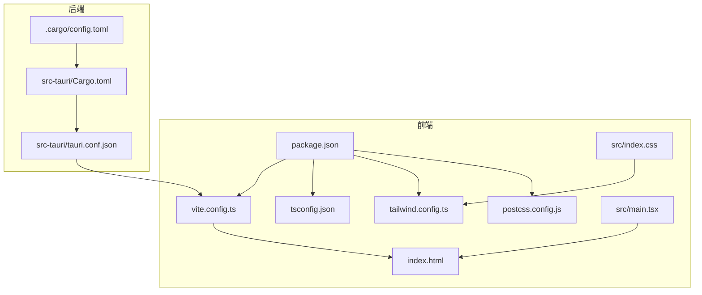
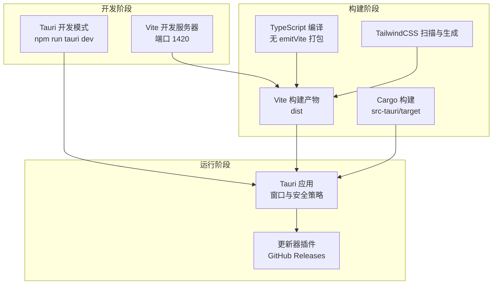
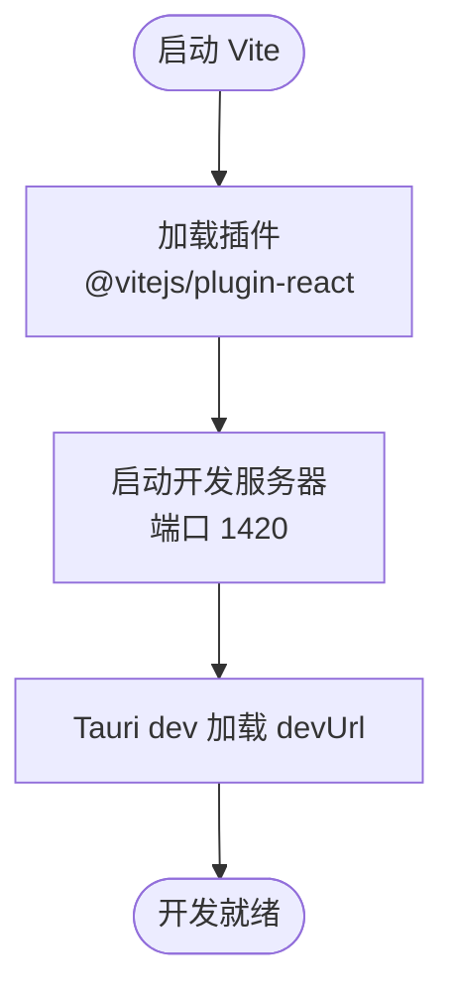
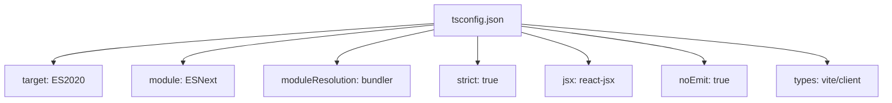
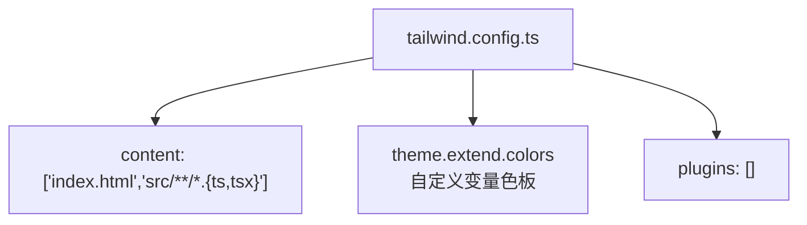
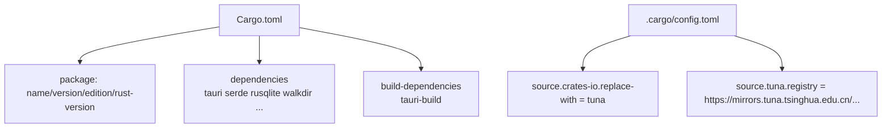
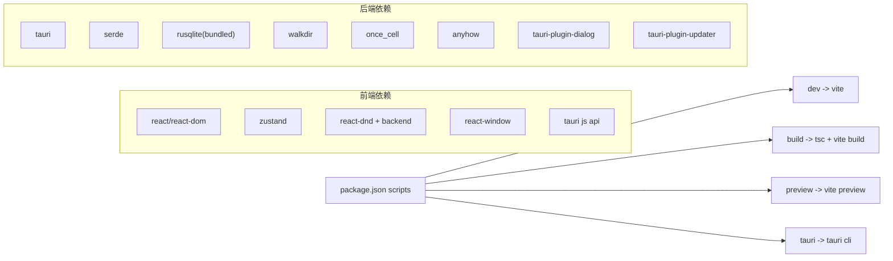

# 构建配置

<cite>
**本文引用的文件**
- [vite.config.ts](file://vite.config.ts)
- [tsconfig.json](file://tsconfig.json)
- [tailwind.config.ts](file://tailwind.config.ts)
- [postcss.config.js](file://postcss.config.js)
- [package.json](file://package.json)
- [src/index.css](file://src/index.css)
- [src/theme/theme.ts](file://src/theme/theme.ts)
- [index.html](file://index.html)
- [src/main.tsx](file://src/main.tsx)
- [src-tauri/Cargo.toml](file://src-tauri/Cargo.toml)
- [src-tauri/.cargo/config.toml](file://src-tauri/.cargo/config.toml)
- [src-tauri/tauri.conf.json](file://src-tauri/tauri.conf.json)
- [DEVELOPMENT.md](file://DEVELOPMENT.md)
- [README.md](file://README.md)
</cite>

## 目录
1. [简介](#简介)
2. [项目结构](#项目结构)
3. [核心组件](#核心组件)
4. [架构总览](#架构总览)
5. [详细组件分析](#详细组件分析)
6. [依赖分析](#依赖分析)
7. [性能考虑](#性能考虑)
8. [故障排查指南](#故障排查指南)
9. [结论](#结论)
10. [附录](#附录)

## 简介
本文件面向 Medex 应用的构建配置，系统性说明前端构建（Vite + TypeScript + TailwindCSS）、后端构建（Rust Cargo + Tauri）以及两者协同的生产与开发差异、性能优化与环境配置最佳实践。读者无需深入技术背景即可理解各配置的作用与影响。

## 项目结构
Medex 采用“前端 Vite + 后端 Tauri/Rust”的混合架构，构建相关的关键文件分布如下：
- 前端构建：vite.config.ts、tsconfig.json、tailwind.config.ts、postcss.config.js、package.json、src/index.css、src/main.tsx、index.html
- 后端构建：src-tauri/Cargo.toml、src-tauri/.cargo/config.toml、src-tauri/tauri.conf.json
- 开发与运行：README.md、DEVELOPMENT.md

图表来源
- [vite.config.ts:1-11](file://vite.config.ts#L1-L11)
- [tsconfig.json:1-19](file://tsconfig.json#L1-L19)
- [tailwind.config.ts:1-36](file://tailwind.config.ts#L1-L36)
- [postcss.config.js:1-7](file://postcss.config.js#L1-L7)
- [package.json:1-36](file://package.json#L1-L36)
- [src/index.css:1-156](file://src/index.css#L1-L156)
- [src/main.tsx:1-44](file://src/main.tsx#L1-L44)
- [index.html:1-13](file://index.html#L1-L13)
- [src-tauri/Cargo.toml:1-23](file://src-tauri/Cargo.toml#L1-L23)
- [src-tauri/.cargo/config.toml:1-5](file://src-tauri/.cargo/config.toml#L1-L5)
- [src-tauri/tauri.conf.json:1-46](file://src-tauri/tauri.conf.json#L1-L46)

章节来源
- [README.md:97-119](file://README.md#L97-L119)
- [DEVELOPMENT.md:51-116](file://DEVELOPMENT.md#L51-L116)

## 核心组件
本节概述各构建配置的核心要点与作用域。

- Vite 构建配置
  - 插件：React 插件
  - 开发服务器：端口与端口严格模式
  - 与 Tauri 协同：devUrl 指向 Vite 开发服务器
- TypeScript 编译配置
  - 目标与模块：ES2020、ESNext
  - 模块解析：bundler
  - 严格模式与 JSX：react-jsx
  - 无 emit（由 Vite 打包）
- TailwindCSS 配置
  - 内容扫描：HTML 与 src 下 TS/TSX
  - 主题扩展：自定义变量色板
  - 插件：空数组
- PostCSS 配置
  - 插件：tailwindcss、autoprefixer
- Rust Cargo 配置
  - 包信息：名称、版本、描述、作者、许可证、Rust 版本
  - 依赖：tauri、serde、rusqlite（bundled）、walkdir、once_cell、anyhow、tauri-plugin-dialog、tauri-plugin-updater
  - 构建依赖：tauri-build
  - Cargo 镜像源：清华大学镜像
- Tauri 配置
  - 构建：devUrl、前端 dist 目录、构建前命令
  - 应用：窗口尺寸、可调整大小、安全策略（资源协议）
  - 打包：目标平台、外部二进制（ffmpeg）、更新器
  - 插件：更新器端点、公钥、对话框

章节来源
- [vite.config.ts:1-11](file://vite.config.ts#L1-L11)
- [tsconfig.json:1-19](file://tsconfig.json#L1-L19)
- [tailwind.config.ts:1-36](file://tailwind.config.ts#L1-L36)
- [postcss.config.js:1-7](file://postcss.config.js#L1-L7)
- [src-tauri/Cargo.toml:1-23](file://src-tauri/Cargo.toml#L1-L23)
- [src-tauri/.cargo/config.toml:1-5](file://src-tauri/.cargo/config.toml#L1-L5)
- [src-tauri/tauri.conf.json:1-46](file://src-tauri/tauri.conf.json#L1-L46)

## 架构总览
下图展示了前端构建、样式管线与后端打包的整体协作关系，以及开发与生产的差异点。

图表来源
- [vite.config.ts:4-10](file://vite.config.ts#L4-L10)
- [src-tauri/tauri.conf.json:6-11](file://src-tauri/tauri.conf.json#L6-L11)
- [src-tauri/tauri.conf.json:29-44](file://src-tauri/tauri.conf.json#L29-L44)

## 详细组件分析

### Vite 构建配置
- 插件
  - @vitejs/plugin-react：启用 React JSX 转换与 HMR
- 开发服务器
  - 端口：1420
  - 严格端口：开启，避免端口冲突
- 与 Tauri 协同
  - devUrl 指向 http://localhost:1420，确保 Tauri dev 模式加载前端开发服务器

图表来源
- [vite.config.ts:4-10](file://vite.config.ts#L4-L10)
- [src-tauri/tauri.conf.json:10](file://src-tauri/tauri.conf.json#L10)

章节来源
- [vite.config.ts:1-11](file://vite.config.ts#L1-L11)
- [src-tauri/tauri.conf.json:6-11](file://src-tauri/tauri.conf.json#L6-L11)

### TypeScript 编译配置
- 目标与模块
  - target: ES2020
  - module: ESNext
- 模块解析
  - moduleResolution: bundler（与 Vite 协同）
- 严格性与 JSX
  - strict: true
  - jsx: react-jsx
  - noEmit: true（由 Vite 输出）
- 类型声明
  - types: vite/client（Vite 环境类型）

图表来源
- [tsconfig.json:2-16](file://tsconfig.json#L2-L16)

章节来源
- [tsconfig.json:1-19](file://tsconfig.json#L1-L19)

### TailwindCSS 配置
- 内容扫描
  - 扫描 index.html 与 src 下 TS/TSX 文件
- 主题扩展
  - 自定义颜色变量：medexText、medexSidebar、medexMain、medexInspector、medexCard、medexToolbar、medexBorder、medexBorderLight、medexHover、medexActive、medexSelected、medexInputBg、medexInputBorder、medexTagBg、medexTagHover、medexButtonBg、medexButtonHover、medexOverlay、medexFavorite、medexHighlight、medexProgress
- 插件
  - 空数组（未启用额外插件）

图表来源
- [tailwind.config.ts:3-33](file://tailwind.config.ts#L3-L33)

章节来源
- [tailwind.config.ts:1-36](file://tailwind.config.ts#L1-L36)
- [src/index.css:1-156](file://src/index.css#L1-L156)

### PostCSS 配置
- 插件
  - tailwindcss：处理 Tailwind 指令
  - autoprefixer：自动添加浏览器前缀

章节来源
- [postcss.config.js:1-7](file://postcss.config.js#L1-L7)

### Rust Cargo 构建配置
- 包信息
  - 名称、版本、描述、作者、许可证、Rust 版本
- 依赖
  - tauri（带 features）、serde、serde_json、rusqlite（bundled）、once_cell、anyhow、walkdir、tauri-plugin-dialog、tauri-plugin-updater
- 构建依赖
  - tauri-build
- Cargo 镜像源
  - 清华大学镜像源（加速 crates.io）

图表来源
- [src-tauri/Cargo.toml:1-23](file://src-tauri/Cargo.toml#L1-L23)
- [src-tauri/.cargo/config.toml:1-5](file://src-tauri/.cargo/config.toml#L1-L5)

章节来源
- [src-tauri/Cargo.toml:1-23](file://src-tauri/Cargo.toml#L1-L23)
- [src-tauri/.cargo/config.toml:1-5](file://src-tauri/.cargo/config.toml#L1-L5)

### Tauri 配置
- 构建
  - beforeDevCommand：npm run dev
  - beforeBuildCommand：npm run build
  - frontendDist：../dist
  - devUrl：http://localhost:1420
- 应用
  - 窗口：标题、宽高、可调整大小
  - 安全：资源协议启用与作用域
- 打包
  - targets：all
  - externalBin：binaries/ffmpeg
  - createUpdaterArtifacts：true
- 插件
  - updater：端点、对话框关闭、公钥

章节来源
- [src-tauri/tauri.conf.json:1-46](file://src-tauri/tauri.conf.json#L1-L46)

## 依赖分析
- 前端脚本
  - dev：vite
  - build：tsc（无 emit）+ vite build
  - preview：vite preview
  - tauri：tauri
- 前端依赖
  - React 生态、Zustand、react-window、react-dnd、@tauri-apps API
- 后端依赖
  - tauri、serde、rusqlite（bundled）、walkdir、once_cell、anyhow、tauri-plugin-dialog、tauri-plugin-updater

图表来源
- [package.json:6-11](file://package.json#L6-L11)
- [package.json:23-34](file://package.json#L23-L34)
- [src-tauri/Cargo.toml:13-22](file://src-tauri/Cargo.toml#L13-L22)

章节来源
- [package.json:1-36](file://package.json#L1-L36)
- [src-tauri/Cargo.toml:1-23](file://src-tauri/Cargo.toml#L1-L23)

## 性能考虑
- 前端
  - Vite 默认启用 HMR 与按需打包，结合 React 插件提升开发体验
  - TypeScript 严格模式与 noEmit 由 Vite 承担打包，减少重复编译
  - TailwindCSS 仅扫描指定文件，避免全量扫描带来的开销
- 后端
  - rusqlite 使用 bundled 特性减少运行时依赖
  - 虚拟列表与缩略图队列策略在前端已实现，降低渲染与 I/O 压力
- 构建优化建议
  - 前端：启用 Vite 预构建依赖、合理拆分代码、使用动态导入
  - 后端：启用 release 构建、裁剪不必要的 features、使用 LTO（如需要）
  - 依赖镜像：继续使用清华镜像以提升下载速度

章节来源
- [tsconfig.json:7-12](file://tsconfig.json#L7-L12)
- [tailwind.config.ts:4](file://tailwind.config.ts#L4)
- [src-tauri/Cargo.toml:17](file://src-tauri/Cargo.toml#L17)
- [DEVELOPMENT.md:306-341](file://DEVELOPMENT.md#L306-L341)

## 故障排查指南
- 开发服务器端口占用
  - 现象：端口 1420 被占用
  - 处理：修改 vite.config.ts 的 server.port 或释放端口
- Tauri devUrl 不匹配
  - 现象：Tauri 无法加载前端开发服务器
  - 处理：确认 src-tauri/tauri.conf.json 的 devUrl 与 Vite 端口一致
- TailwindCSS 样式未生效
  - 现象：自定义颜色变量未生成
  - 处理：确认 tailwind.config.ts 的 content 路径包含实际使用的组件文件
- Cargo 镜像源问题
  - 现象：crates.io 下载缓慢或失败
  - 处理：检查 .cargo/config.toml 的镜像配置是否正确
- ffmpeg 二进制缺失
  - 现象：缩略图生成失败
  - 处理：确保 binaries/ffmpeg 存在或系统 PATH 中可用

章节来源
- [vite.config.ts:6-9](file://vite.config.ts#L6-L9)
- [src-tauri/tauri.conf.json:10](file://src-tauri/tauri.conf.json#L10)
- [tailwind.config.ts:4](file://tailwind.config.ts#L4)
- [src-tauri/.cargo/config.toml:1-5](file://src-tauri/.cargo/config.toml#L1-L5)
- [DEVELOPMENT.md:573-585](file://DEVELOPMENT.md#L573-L585)

## 结论
Medex 的构建配置围绕“前端 Vite + TypeScript + TailwindCSS + React”与“后端 Tauri/Rust”两条主线展开，通过明确的 devUrl、内容扫描与模块解析策略，实现了高效的开发与稳定的生产构建。结合虚拟列表、缩略图队列等前端性能策略与 rusqlite 的 bundled 依赖，整体具备良好的可维护性与扩展性。

## 附录

### 开发与生产构建区别
- 开发构建
  - Vite dev：热更新、严格端口、快速启动
  - Tauri dev：加载 devUrl，实时同步前端变更
- 生产构建
  - 前端：tsc（无 emit）+ vite build，产物输出至 dist
  - 后端：cargo build（release），产物输出至 src-tauri/target
  - Tauri 打包：targets=all，externalBin=ffmpeg，createUpdaterArtifacts=true

章节来源
- [README.md:70-94](file://README.md#L70-L94)
- [src-tauri/tauri.conf.json:6-11](file://src-tauri/tauri.conf.json#L6-L11)
- [src-tauri/tauri.conf.json:29-34](file://src-tauri/tauri.conf.json#L29-L34)

### 环境配置与最佳实践
- 环境变量
  - 未发现显式的环境变量配置文件；如需区分开发/生产，可在 CI 中注入变量并在构建脚本中使用
- 资源协议与安全
  - 已启用 assetProtocol 与作用域，确保本地文件预览与安全访问
- 主题与样式
  - 使用 CSS 变量与 Tailwind 自定义色板，配合深/浅主题切换
- 依赖镜像
  - 继续使用清华大学镜像源以提升下载速度

章节来源
- [src-tauri/tauri.conf.json:21-27](file://src-tauri/tauri.conf.json#L21-L27)
- [src/index.css:5-108](file://src/index.css#L5-L108)
- [src/theme/theme.ts:1-159](file://src/theme/theme.ts#L1-L159)
- [src-tauri/.cargo/config.toml:1-5](file://src-tauri/.cargo/config.toml#L1-L5)