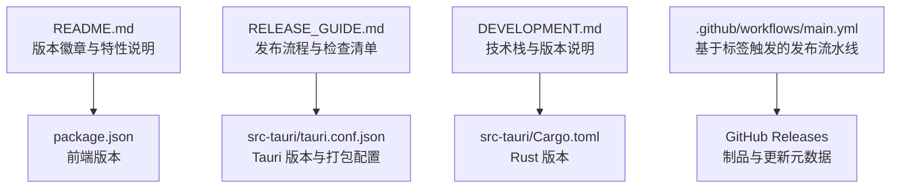
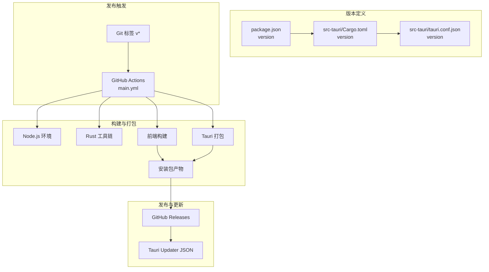
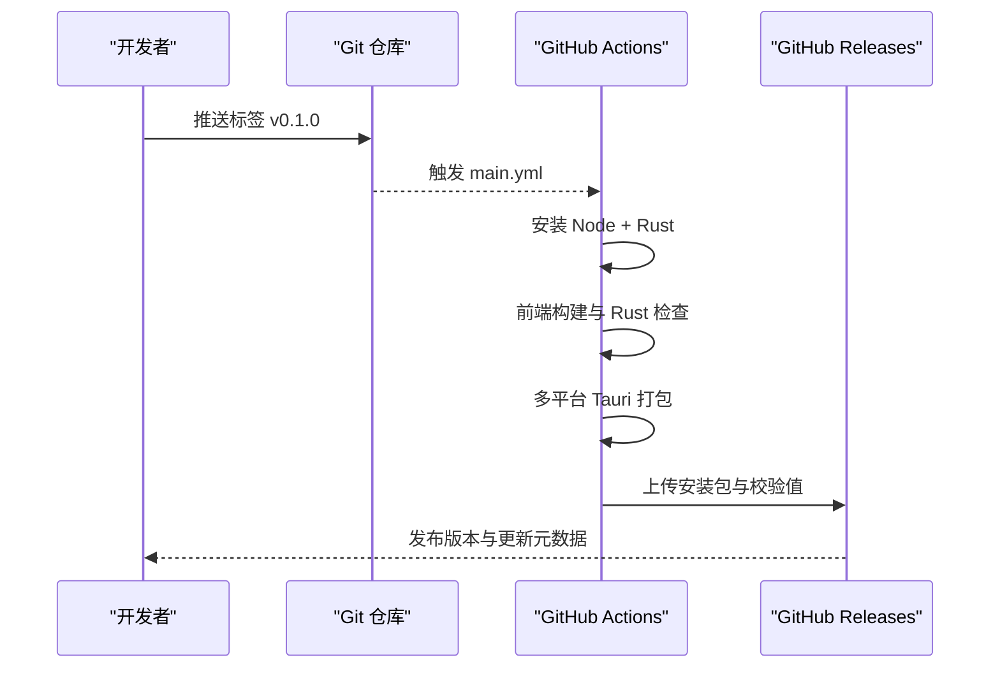
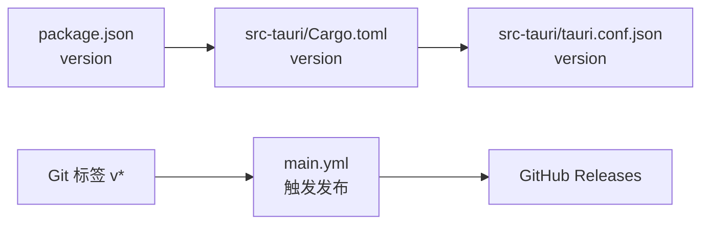

# 版本管理

<cite>
**本文引用的文件**
- [README.md](file://README.md)
- [RELEASE_GUIDE.md](file://RELEASE_GUIDE.md)
- [DEVELOPMENT.md](file://DEVELOPMENT.md)
- [.github/workflows/main.yml](file://.github/workflows/main.yml)
- [package.json](file://package.json)
- [src-tauri/Cargo.toml](file://src-tauri/Cargo.toml)
- [src-tauri/tauri.conf.json](file://src-tauri/tauri.conf.json)
- [API_REFERENCE.md](file://API_REFERENCE.md)
- [src-tauri/build.rs](file://src-tauri/build.rs)
</cite>

## 目录
1. [简介](#简介)
2. [项目结构](#项目结构)
3. [核心组件](#核心组件)
4. [架构总览](#架构总览)
5. [详细组件分析](#详细组件分析)
6. [依赖分析](#依赖分析)
7. [性能考虑](#性能考虑)
8. [故障排查指南](#故障排查指南)
9. [结论](#结论)
10. [附录](#附录)

## 简介
本文件面向 Medex 应用的版本管理与发布流程，结合仓库现有配置与文档，系统性地说明版本号命名规范、语义化版本控制策略、发布前准备、发布流程、不同类型版本的管理方法、发布检查清单、质量保证流程、紧急修复与热修复处理、发布后监控与回滚策略，以及发布模板与自动化脚本示例。目标是帮助团队在保持高质量交付的同时，提升发布效率与可追溯性。

## 项目结构
Medex 采用前端（React + TypeScript + Vite）与桌面后端（Tauri + Rust）的混合架构。版本号在多个层面体现：
- 前端 package.json 中的 version 字段
- Rust 侧 Cargo.toml 中的 version 字段
- Tauri 配置中的 version 字段
- GitHub Actions 工作流基于 Git 标签触发发布

**图表来源**
- [README.md:1-209](file://README.md#L1-L209)
- [RELEASE_GUIDE.md:1-283](file://RELEASE_GUIDE.md#L1-L283)
- [DEVELOPMENT.md:1-643](file://DEVELOPMENT.md#L1-L643)
- [.github/workflows/main.yml:1-42](file://.github/workflows/main.yml#L1-L42)
- [package.json:1-36](file://package.json#L1-L36)
- [src-tauri/Cargo.toml:1-23](file://src-tauri/Cargo.toml#L1-L23)
- [src-tauri/tauri.conf.json:1-46](file://src-tauri/tauri.conf.json#L1-L46)

**章节来源**
- [README.md:1-209](file://README.md#L1-L209)
- [RELEASE_GUIDE.md:1-283](file://RELEASE_GUIDE.md#L1-L283)
- [DEVELOPMENT.md:1-643](file://DEVELOPMENT.md#L1-L643)
- [.github/workflows/main.yml:1-42](file://.github/workflows/main.yml#L1-L42)
- [package.json:1-36](file://package.json#L1-L36)
- [src-tauri/Cargo.toml:1-23](file://src-tauri/Cargo.toml#L1-L23)
- [src-tauri/tauri.conf.json:1-46](file://src-tauri/tauri.conf.json#L1-L46)

## 核心组件
- 版本号来源与一致性
  - 前端版本：package.json 的 version 字段
  - 桌面应用版本：src-tauri/Cargo.toml 的 version 字段
  - Tauri 应用版本：src-tauri/tauri.conf.json 的 version 字段
  - 发布标签：GitHub 标签（如 v0.1.0），由工作流自动触发
- 发布自动化
  - GitHub Actions 基于标签触发，自动构建多平台安装包并生成更新元数据
- 发布产物与外部二进制
  - 可选内置 ffmpeg 二进制（通过 bundle.externalBin 配置），并提供多平台二进制准备建议

**章节来源**
- [package.json:1-36](file://package.json#L1-L36)
- [src-tauri/Cargo.toml:1-23](file://src-tauri/Cargo.toml#L1-L23)
- [src-tauri/tauri.conf.json:1-46](file://src-tauri/tauri.conf.json#L1-L46)
- [.github/workflows/main.yml:1-42](file://.github/workflows/main.yml#L1-L42)
- [RELEASE_GUIDE.md:73-116](file://RELEASE_GUIDE.md#L73-L116)

## 架构总览
下图展示了从版本号定义到发布产物生成的关键路径，以及与 CI 的联动。

**图表来源**
- [package.json:1-36](file://package.json#L1-L36)
- [src-tauri/Cargo.toml:1-23](file://src-tauri/Cargo.toml#L1-L23)
- [src-tauri/tauri.conf.json:1-46](file://src-tauri/tauri.conf.json#L1-L46)
- [.github/workflows/main.yml:1-42](file://.github/workflows/main.yml#L1-L42)

## 详细组件分析

### 版本号命名规范与语义化版本控制策略
- 命名规范
  - 使用语义化版本号格式 x.y.z（主版本.次版本.补丁版本）
  - 前端、Rust、Tauri 三处版本号应保持一致，避免版本漂移
- 语义化版本控制策略
  - 主版本（x）：破坏性变更或重大架构调整
  - 次版本（y）：新增功能且向后兼容
  - 补丁版本（z）：向后兼容的问题修复
- 标签与发布
  - 使用 Git 标签 v0.1.0 等形式，触发 CI 自动发布
  - 发布名称与标签名一致，便于追踪

**章节来源**
- [RELEASE_GUIDE.md:198-206](file://RELEASE_GUIDE.md#L198-L206)
- [package.json:1-36](file://package.json#L1-L36)
- [src-tauri/Cargo.toml:1-23](file://src-tauri/Cargo.toml#L1-L23)
- [src-tauri/tauri.conf.json:1-46](file://src-tauri/tauri.conf.json#L1-L46)
- [.github/workflows/main.yml:3-6](file://.github/workflows/main.yml#L3-L6)

### 发布前准备（代码审查、测试验证、文档更新）
- 代码与依赖
  - 通过 npm ci、前端构建、Rust 检查
- 功能回归
  - 大规模媒体扫描、缩略图生成、标签筛选、收藏状态、Recent 列表、Viewer 行为等
- 发布体验
  - 首次安装无需手动安装 ffmpeg、本地媒体可预览、缩略图缓存目录可写
- 文档更新
  - 更新 README 版本徽章与特性说明，必要时更新发布说明与变更日志

**章节来源**
- [RELEASE_GUIDE.md:118-141](file://RELEASE_GUIDE.md#L118-L141)
- [RELEASE_GUIDE.md:169-180](file://RELEASE_GUIDE.md#L169-L180)
- [RELEASE_GUIDE.md:182-206](file://RELEASE_GUIDE.md#L182-L206)
- [README.md:10-32](file://README.md#L10-L32)

### 发布流程（从开发分支合并到正式发布）
- 分支策略
  - main：稳定发布线
  - release/*：发布候选
  - codex/*：功能开发线
- 本地打包
  - 清理构建缓存、前端构建、Rust 检查、Tauri 打包、产物位置核验
- CI/CD
  - 基于标签触发，安装 Node + Rust、前端构建、Rust 检查、多平台打包、制品上传
- 产物命名
  - 建议使用 medex-v{version}-{platform}-{arch}.{ext} 的命名规范

**图表来源**
- [.github/workflows/main.yml:1-42](file://.github/workflows/main.yml#L1-L42)
- [RELEASE_GUIDE.md:143-166](file://RELEASE_GUIDE.md#L143-L166)
- [RELEASE_GUIDE.md:182-206](file://RELEASE_GUIDE.md#L182-L206)

**章节来源**
- [RELEASE_GUIDE.md:184-196](file://RELEASE_GUIDE.md#L184-L196)
- [RELEASE_GUIDE.md:143-166](file://RELEASE_GUIDE.md#L143-L166)
- [.github/workflows/main.yml:1-42](file://.github/workflows/main.yml#L1-L42)

### 不同类型版本的管理
- 主要版本（x.0.0）
  - 适用于重大功能里程碑或破坏性变更
  - 建议配合发布节奏规划与充分回归测试
- 次要版本（0.y.0）
  - 新增功能且向后兼容
  - 建议在 release/* 分支上进行充分验证
- 补丁版本（0.0.z）
  - 问题修复与安全更新
  - 可直接从 main 合并 hotfix 分支，快速回滚与发布

**章节来源**
- [RELEASE_GUIDE.md:241-249](file://RELEASE_GUIDE.md#L241-L249)

### 发布检查清单与质量保证流程
- 必须项
  - 依赖安装与构建通过、功能回归验证、发布体验验证
- 质量保证
  - 安装后冒烟测试、多平台产物核验、更新元数据可用性

**章节来源**
- [RELEASE_GUIDE.md:118-141](file://RELEASE_GUIDE.md#L118-L141)
- [RELEASE_GUIDE.md:169-180](file://RELEASE_GUIDE.md#L169-L180)

### 紧急修复与热修复版本
- 流程
  - 从 main 创建 hotfix 分支，修复后合并至 main 与 release/*，打标签并触发发布
- 注意事项
  - 保持版本号一致性，确保 CI 正常构建与签名

**章节来源**
- [RELEASE_GUIDE.md:252-272](file://RELEASE_GUIDE.md#L252-L272)

### 发布后的监控与回滚策略
- 监控
  - 通过 Tauri Updater 的更新元数据与发布说明进行用户反馈收集
- 回滚
  - 如发现严重问题，可发布更高补丁版本进行回滚
  - 保留旧版本安装包与校验值，便于用户手动回滚

**章节来源**
- [src-tauri/tauri.conf.json:36-44](file://src-tauri/tauri.conf.json#L36-L44)
- [RELEASE_GUIDE.md:241-249](file://RELEASE_GUIDE.md#L241-L249)

### 版本发布模板与自动化脚本示例
- 发布操作模板（可直接复用）
  - 切换到 release 分支、安装依赖、前端构建、Rust 检查、Tauri 打包、记录产物
- CI 自动化
  - 基于标签触发，自动安装依赖、构建与打包、上传制品

**章节来源**
- [RELEASE_GUIDE.md:252-272](file://RELEASE_GUIDE.md#L252-L272)
- [.github/workflows/main.yml:1-42](file://.github/workflows/main.yml#L1-L42)

## 依赖分析
版本号在多处配置中相互影响，需保持一致：

**图表来源**
- [package.json:1-36](file://package.json#L1-L36)
- [src-tauri/Cargo.toml:1-23](file://src-tauri/Cargo.toml#L1-L23)
- [src-tauri/tauri.conf.json:1-46](file://src-tauri/tauri.conf.json#L1-L46)
- [.github/workflows/main.yml:3-6](file://.github/workflows/main.yml#L3-L6)

**章节来源**
- [package.json:1-36](file://package.json#L1-L36)
- [src-tauri/Cargo.toml:1-23](file://src-tauri/Cargo.toml#L1-L23)
- [src-tauri/tauri.conf.json:1-46](file://src-tauri/tauri.conf.json#L1-L46)
- [.github/workflows/main.yml:1-42](file://.github/workflows/main.yml#L1-L42)

## 性能考虑
- 发布前构建与打包
  - 前端构建与 Rust 检查应在本地先行验证，减少 CI 失败概率
- 产物体积与外部二进制
  - ffmpeg 二进制的许可与体积需评估，必要时在 CI 中统一管理与校验可执行权限

**章节来源**
- [RELEASE_GUIDE.md:182-206](file://RELEASE_GUIDE.md#L182-L206)
- [RELEASE_GUIDE.md:232-238](file://RELEASE_GUIDE.md#L232-L238)

## 故障排查指南
- 常见发布错误与处理
  - externalBin 缺失：补齐对应平台二进制
  - 运行时 ffmpeg 未找到：确认发布包包含二进制、解析顺序命中、二进制具备执行权限
  - 图标相关构建失败：确保图标存在且格式正确
- 安装后验证
  - 在“干净机器”执行冒烟测试，确认无白屏、扫描与 Viewer 正常、收藏与 Recent 数据持久化

**章节来源**
- [RELEASE_GUIDE.md:209-230](file://RELEASE_GUIDE.md#L209-L230)
- [RELEASE_GUIDE.md:169-180](file://RELEASE_GUIDE.md#L169-L180)

## 结论
通过统一的版本号管理、严格的发布前检查、清晰的分支与标签策略、完善的自动化流水线以及明确的监控与回滚机制，Medex 可以稳定高效地交付高质量版本。建议在现有基础上进一步完善变更日志、发布签名与校验、自动注入 ffmpeg 二进制与权限校验、安装后首启自检页面等增强措施，以持续提升发布质量与用户体验。

## 附录
- 版本号来源对照
  - 前端：package.json
  - 桌面应用：Cargo.toml
  - Tauri 应用：tauri.conf.json
- 发布模板与自动化脚本
  - 发布操作模板与 CI 工作流已在发布指南与工作流文件中给出

**章节来源**
- [RELEASE_GUIDE.md:252-272](file://RELEASE_GUIDE.md#L252-L272)
- [.github/workflows/main.yml:1-42](file://.github/workflows/main.yml#L1-L42)