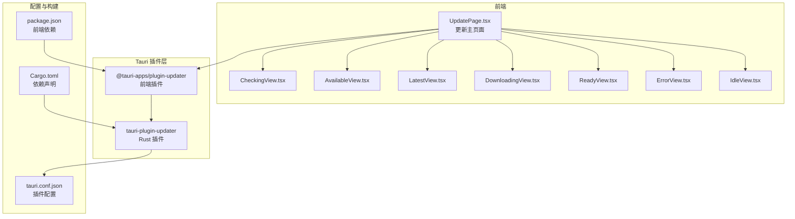
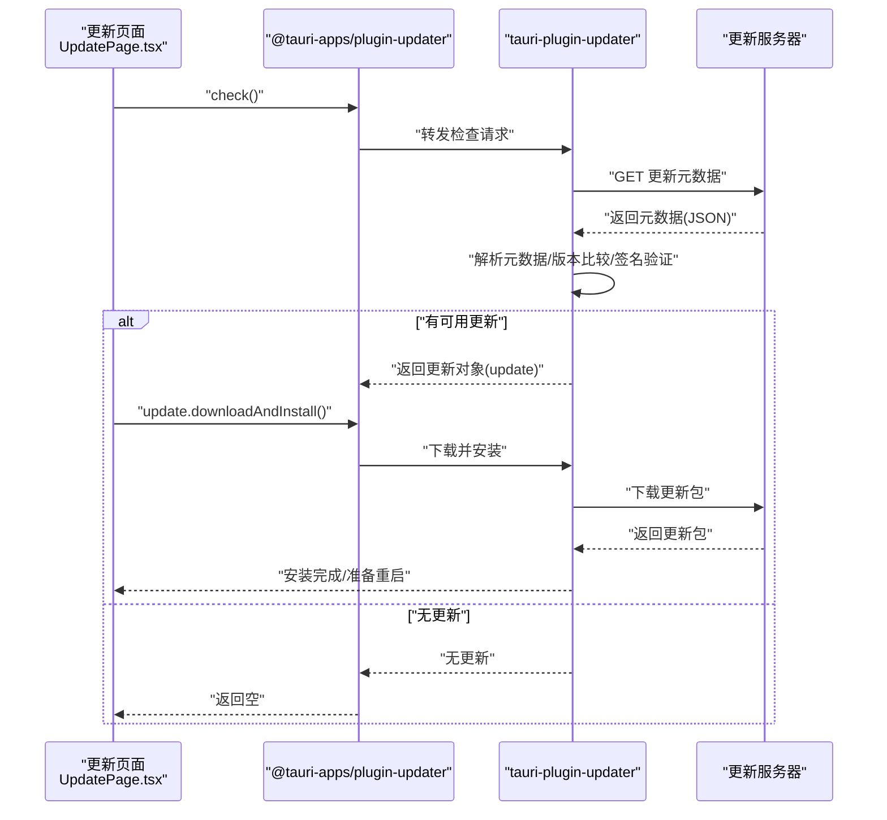
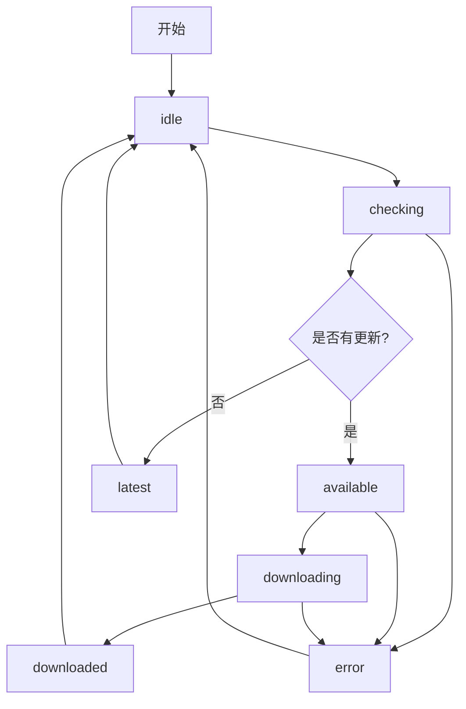
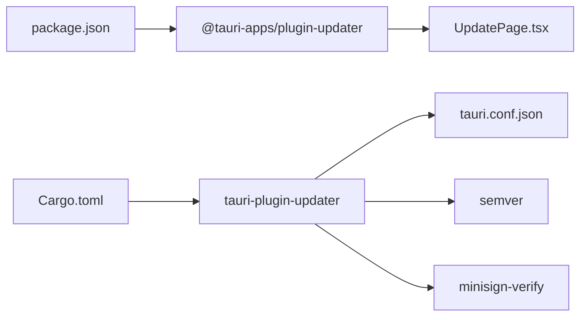

# 自动更新机制

<cite>
**本文引用的文件**
- [src-tauri/tauri.conf.json](file://src-tauri/tauri.conf.json)
- [src-tauri/src/main.rs](file://src-tauri/src/main.rs)
- [src-tauri/Cargo.toml](file://src-tauri/Cargo.toml)
- [src/pages/UpdatePage.tsx](file://src/pages/UpdatePage.tsx)
- [src/pages/Update.tsx](file://src/pages/Update.tsx)
- [src/pages/views/CheckingView.tsx](file://src/pages/views/CheckingView.tsx)
- [src/pages/views/AvailableView.tsx](file://src/pages/views/AvailableView.tsx)
- [src/pages/views/LatestView.tsx](file://src/pages/views/LatestView.tsx)
- [src/pages/views/DownloadingView.tsx](file://src/pages/views/DownloadingView.tsx)
- [src/pages/views/ReadyView.tsx](file://src/pages/views/ReadyView.tsx)
- [src/pages/views/ErrorView.tsx](file://src/pages/views/ErrorView.tsx)
- [src/pages/views/IdleView.tsx](file://src/pages/views/IdleView.tsx)
- [package.json](file://package.json)
- [README.md](file://README.md)
</cite>

## 目录
1. [简介](#简介)
2. [项目结构](#项目结构)
3. [核心组件](#核心组件)
4. [架构总览](#架构总览)
5. [详细组件分析](#详细组件分析)
6. [依赖关系分析](#依赖关系分析)
7. [性能考量](#性能考量)
8. [故障排查指南](#故障排查指南)
9. [结论](#结论)
10. [附录](#附录)

## 简介
本文件面向 Medex 应用的自动更新机制，系统性阐述 Tauri V2 Updater 插件的架构与工作原理，覆盖更新服务器配置、更新元数据格式、版本比较逻辑、下载与安装流程、签名验证、回滚与错误处理策略，以及静默更新与交互式更新的实现建议。同时提供更新服务器部署要点、更新包格式与签名验证机制说明、以及测试与验证最佳实践。

## 项目结构
Medex 的自动更新由前端 React 页面驱动，调用 @tauri-apps/plugin-updater；Rust 后端通过 tauri-plugin-updater 实现底层更新能力，并在 tauri.conf.json 中进行全局配置。更新页面提供用户交互与状态反馈，包含“检查更新”“发现新版本”“下载中”“准备就绪”“错误”等视图。

图表来源
- [src/pages/UpdatePage.tsx:1-138](file://src/pages/UpdatePage.tsx#L1-L138)
- [src-tauri/tauri.conf.json:35-44](file://src-tauri/tauri.conf.json#L35-L44)
- [src-tauri/Cargo.toml:22-22](file://src-tauri/Cargo.toml#L22-L22)
- [package.json:12-22](file://package.json#L12-L22)

章节来源
- [src/pages/UpdatePage.tsx:1-138](file://src/pages/UpdatePage.tsx#L1-L138)
- [src-tauri/tauri.conf.json:1-46](file://src-tauri/tauri.conf.json#L1-L46)
- [src-tauri/Cargo.toml:1-23](file://src-tauri/Cargo.toml#L1-L23)
- [package.json:1-36](file://package.json#L1-L36)

## 核心组件
- 更新页面与状态机
  - UpdatePage.tsx 维护更新状态机（idle/checking/available/latest/downloading/downloaded/error），根据状态渲染不同视图组件。
  - 使用 @tauri-apps/plugin-updater 的 check() 检查更新，使用 update.downloadAndInstall() 下载并安装更新。
- 视图组件
  - IdleView/CheckingView/AvailableView/LatestView/DownloadingView/ReadyView/ErrorView 提供用户交互与反馈。
- Tauri 插件与配置
  - tauri-plugin-updater 在 Rust 侧实现，前端通过 @tauri-apps/plugin-updater 调用。
  - tauri.conf.json 中启用插件、配置更新端点、公钥与对话框行为。

章节来源
- [src/pages/UpdatePage.tsx:12-138](file://src/pages/UpdatePage.tsx#L12-L138)
- [src/pages/views/IdleView.tsx:1-32](file://src/pages/views/IdleView.tsx#L1-L32)
- [src/pages/views/CheckingView.tsx:1-21](file://src/pages/views/CheckingView.tsx#L1-L21)
- [src/pages/views/AvailableView.tsx:1-87](file://src/pages/views/AvailableView.tsx#L1-L87)
- [src/pages/views/LatestView.tsx:1-48](file://src/pages/views/LatestView.tsx#L1-L48)
- [src/pages/views/DownloadingView.tsx:1-40](file://src/pages/views/DownloadingView.tsx#L1-L40)
- [src/pages/views/ReadyView.tsx:1-48](file://src/pages/views/ReadyView.tsx#L1-L48)
- [src/pages/views/ErrorView.tsx:1-49](file://src/pages/views/ErrorView.tsx#L1-L49)
- [src-tauri/tauri.conf.json:35-44](file://src-tauri/tauri.conf.json#L35-L44)
- [src-tauri/Cargo.toml:22-22](file://src-tauri/Cargo.toml#L22-L22)

## 架构总览
Tauri 自动更新的整体流程如下：前端触发检查，Rust 插件从配置的端点拉取更新元数据，校验签名，下载更新包，最后执行安装并提示重启。

图表来源
- [src/pages/UpdatePage.tsx:38-86](file://src/pages/UpdatePage.tsx#L38-L86)
- [src-tauri/tauri.conf.json:35-44](file://src-tauri/tauri.conf.json#L35-L44)
- [src-tauri/src/main.rs:13-13](file://src-tauri/src/main.rs#L13-L13)

## 详细组件分析

### 前端更新页面与状态机
- 状态定义与流转
  - idle → checking → available/latest → downloading → downloaded → idle
  - 错误时进入 error 并允许重试
- 关键交互
  - 检查更新：调用 check() 获取更新对象
  - 下载并安装：update.downloadAndInstall()
  - 重启应用：window.location.reload()

图表来源
- [src/pages/UpdatePage.tsx:12-138](file://src/pages/UpdatePage.tsx#L12-L138)

章节来源
- [src/pages/UpdatePage.tsx:12-138](file://src/pages/UpdatePage.tsx#L12-L138)

### 更新服务器配置与元数据格式
- 配置位置
  - tauri.conf.json 的 plugins.updater.endpoints 指定更新元数据地址
  - plugins.updater.pubkey 指定公钥用于签名验证
  - plugins.updater.dialog 控制是否弹出对话框
- 元数据格式
  - 元数据为 JSON，包含版本号、发布说明、平台对应的下载链接与签名等字段
  - 版本比较：使用语义化版本（semver）进行比较
  - 下载链接：按平台选择对应二进制包
- 端点示例
  - 当前配置指向 GitHub Releases 的 latest.json

章节来源
- [src-tauri/tauri.conf.json:35-44](file://src-tauri/tauri.conf.json#L35-L44)
- [src-tauri/Cargo.lock:3832-3862](file://src-tauri/Cargo.lock#L3832-L3862)

### Rust 插件与签名验证
- 插件初始化
  - 在 main.rs 中注册 tauri-plugin-updater
- 签名验证
  - 依赖 minisign-verify 进行签名验证
  - 公钥来自 tauri.conf.json 的 pubkey 字段

章节来源
- [src-tauri/src/main.rs:13-13](file://src-tauri/src/main.rs#L13-L13)
- [src-tauri/Cargo.lock:3832-3862](file://src-tauri/Cargo.lock#L3832-L3862)

### 前端插件与调用链
- 依赖声明
  - package.json 引入 @tauri-apps/plugin-updater
- 调用链
  - UpdatePage.tsx 使用 check() 获取更新对象
  - 调用 downloadAndInstall() 触发下载与安装

章节来源
- [package.json:12-22](file://package.json#L12-L22)
- [src/pages/UpdatePage.tsx:2-2](file://src/pages/UpdatePage.tsx#L2-L2)

### 视图组件与用户体验
- IdleView：引导用户点击“检查更新”
- CheckingView：显示加载动画
- AvailableView：展示当前版本与最新版本、更新说明
- LatestView：提示已是最新版本
- DownloadingView：显示下载中动画
- ReadyView：提示安装完成，点击重启
- ErrorView：显示错误信息并允许重试

章节来源
- [src/pages/views/IdleView.tsx:1-32](file://src/pages/views/IdleView.tsx#L1-L32)
- [src/pages/views/CheckingView.tsx:1-21](file://src/pages/views/CheckingView.tsx#L1-L21)
- [src/pages/views/AvailableView.tsx:1-87](file://src/pages/views/AvailableView.tsx#L1-L87)
- [src/pages/views/LatestView.tsx:1-48](file://src/pages/views/LatestView.tsx#L1-L48)
- [src/pages/views/DownloadingView.tsx:1-40](file://src/pages/views/DownloadingView.tsx#L1-L40)
- [src/pages/views/ReadyView.tsx:1-48](file://src/pages/views/ReadyView.tsx#L1-L48)
- [src/pages/views/ErrorView.tsx:1-49](file://src/pages/views/ErrorView.tsx#L1-L49)

## 依赖关系分析
- 前端依赖
  - @tauri-apps/plugin-updater：提供 check() 与 downloadAndInstall() 等 API
- Rust 依赖
  - tauri-plugin-updater：实现更新检查、下载、安装与签名验证
  - semver：版本比较
  - minisign-verify：签名验证
- 配置依赖
  - tauri.conf.json：启用插件、配置端点与公钥

图表来源
- [package.json:12-22](file://package.json#L12-L22)
- [src-tauri/Cargo.toml:22-22](file://src-tauri/Cargo.toml#L22-L22)
- [src-tauri/tauri.conf.json:35-44](file://src-tauri/tauri.conf.json#L35-L44)

章节来源
- [package.json:1-36](file://package.json#L1-L36)
- [src-tauri/Cargo.toml:1-23](file://src-tauri/Cargo.toml#L1-L23)
- [src-tauri/tauri.conf.json:1-46](file://src-tauri/tauri.conf.json#L1-L46)

## 性能考量
- 下载并发与断点续传
  - 建议在服务端提供分块/断点续传能力，以提升大文件下载稳定性
- 网络超时与重试
  - 前端应设置合理的超时与指数退避重试策略
- 安装阶段
  - 将安装过程与 UI 解耦，避免阻塞主线程
- 版本比较
  - 使用 semver 进行本地比较，减少不必要的网络请求

## 故障排查指南
- 常见错误与处理
  - “插件未激活/无法获取元数据”：检查 tauri.conf.json 的 endpoints 与 pubkey 配置
  - “签名验证失败”：核对发布的签名与公钥一致
  - “下载失败”：检查网络连通性与服务器可达性
- 用户体验
  - 使用 ErrorView 提示具体错误并允许重试
  - 对于“未发布任何版本”的场景，前端已做友好提示

章节来源
- [src/pages/UpdatePage.tsx:55-66](file://src/pages/UpdatePage.tsx#L55-L66)
- [src/pages/views/ErrorView.tsx:1-49](file://src/pages/views/ErrorView.tsx#L1-L49)

## 结论
Medex 已完整接入 Tauri V2 Updater 插件，前端通过 @tauri-apps/plugin-updater 实现检查、下载与安装流程，Rust 侧负责签名验证与安装执行。当前配置指向 GitHub Releases 的 latest.json，具备良好的扩展性。后续可在服务端完善签名与元数据规范，结合测试与回滚策略，进一步提升更新的可靠性与用户体验。

## 附录

### 更新服务器部署指南与配置示例
- 配置项
  - endpoints：数组形式，支持多个备用端点
  - pubkey：最小签名公钥字符串，用于验证更新包签名
  - dialog：是否弹出对话框
- 元数据格式（示例字段）
  - version：语义化版本号
  - notes：更新说明
  - pub_date：发布时间
  - platforms：平台映射，包含 url 与 signature
- 发布流程建议
  - 生成签名：使用 minisign 对更新包签名
  - 上传资源：将更新包与签名文件一并发布到稳定存储
  - 生成元数据：latest.json 指向最新版本，包含各平台下载链接与签名

章节来源
- [src-tauri/tauri.conf.json:35-44](file://src-tauri/tauri.conf.json#L35-L44)
- [src-tauri/Cargo.lock:3832-3862](file://src-tauri/Cargo.lock#L3832-L3862)

### 更新包格式与签名验证机制
- 包格式
  - 支持压缩包（如 tar.gz/zip），包含目标平台的可执行文件与资源
- 签名验证
  - 使用 minisign 公钥验证签名
  - 签名与包需配套发布，确保完整性与真实性

章节来源
- [src-tauri/Cargo.lock:3832-3862](file://src-tauri/Cargo.lock#L3832-L3862)

### 回滚机制与错误处理策略
- 回滚建议
  - 安装失败时保留旧版本，确保可回退
  - 安装完成后提示重启，避免半更新状态
- 错误处理
  - 前端捕获异常并进入 error 状态，提供重试按钮
  - 对特定错误（如“未激活”“无法获取”）给出明确提示

章节来源
- [src/pages/UpdatePage.tsx:55-85](file://src/pages/UpdatePage.tsx#L55-L85)
- [src/pages/views/ErrorView.tsx:1-49](file://src/pages/views/ErrorView.tsx#L1-L49)

### 静默更新与交互式更新
- 交互式更新
  - 当前 dialog=false，可通过 AvailableView/ReadyView 显式控制用户交互
- 静默更新
  - 可通过调整 dialog 与自动化流程实现后台更新，但需谨慎处理用户知情权与可恢复性

章节来源
- [src-tauri/tauri.conf.json:41-41](file://src-tauri/tauri.conf.json#L41-L41)
- [src/pages/views/AvailableView.tsx:49-83](file://src/pages/views/AvailableView.tsx#L49-L83)
- [src/pages/views/ReadyView.tsx:27-45](file://src/pages/views/ReadyView.tsx#L27-L45)

### 更新测试与验证最佳实践
- 测试清单
  - 本地版本与远端版本的比较逻辑验证
  - 不同平台包的下载与安装验证
  - 签名验证失败的降级与错误提示
  - 网络中断后的重试与断点续传
  - 安装失败后的回滚与日志记录
- 验证建议
  - 使用 staging 环境先行发布
  - 逐步扩大灰度范围
  - 记录更新成功率与失败原因，持续优化