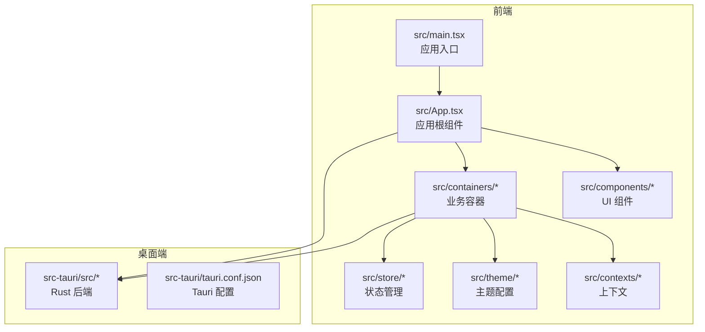
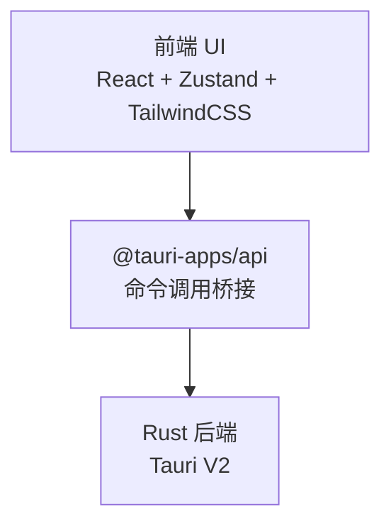
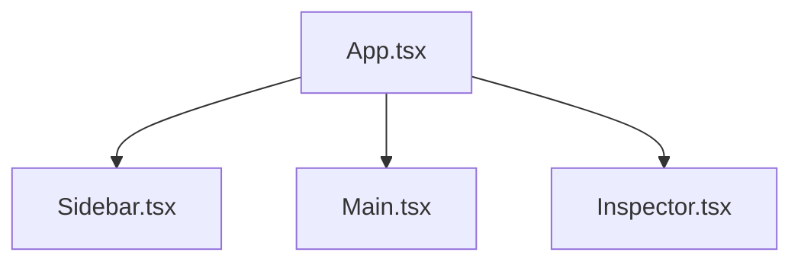
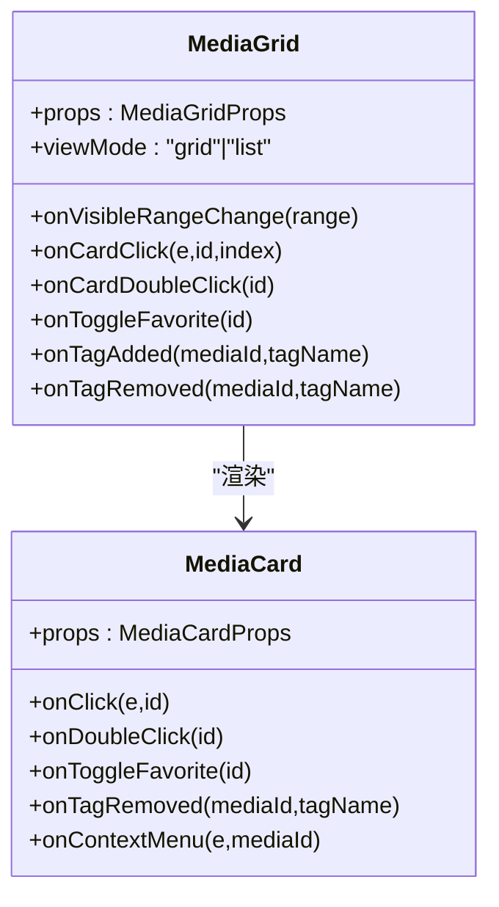
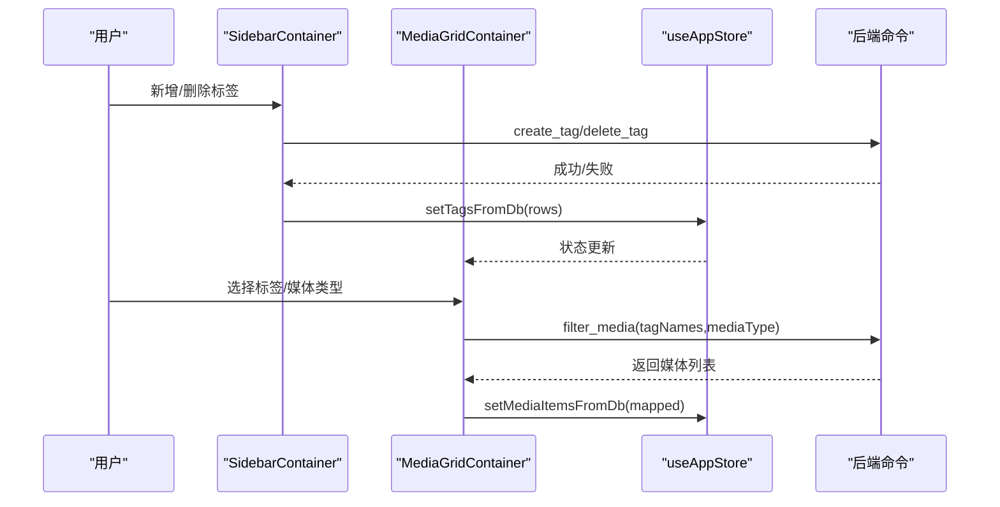
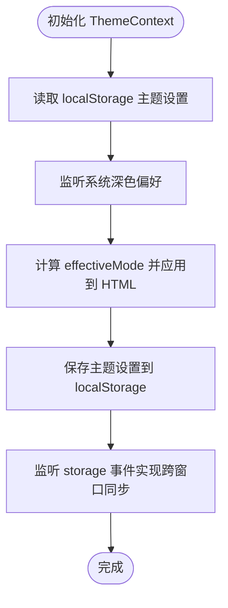
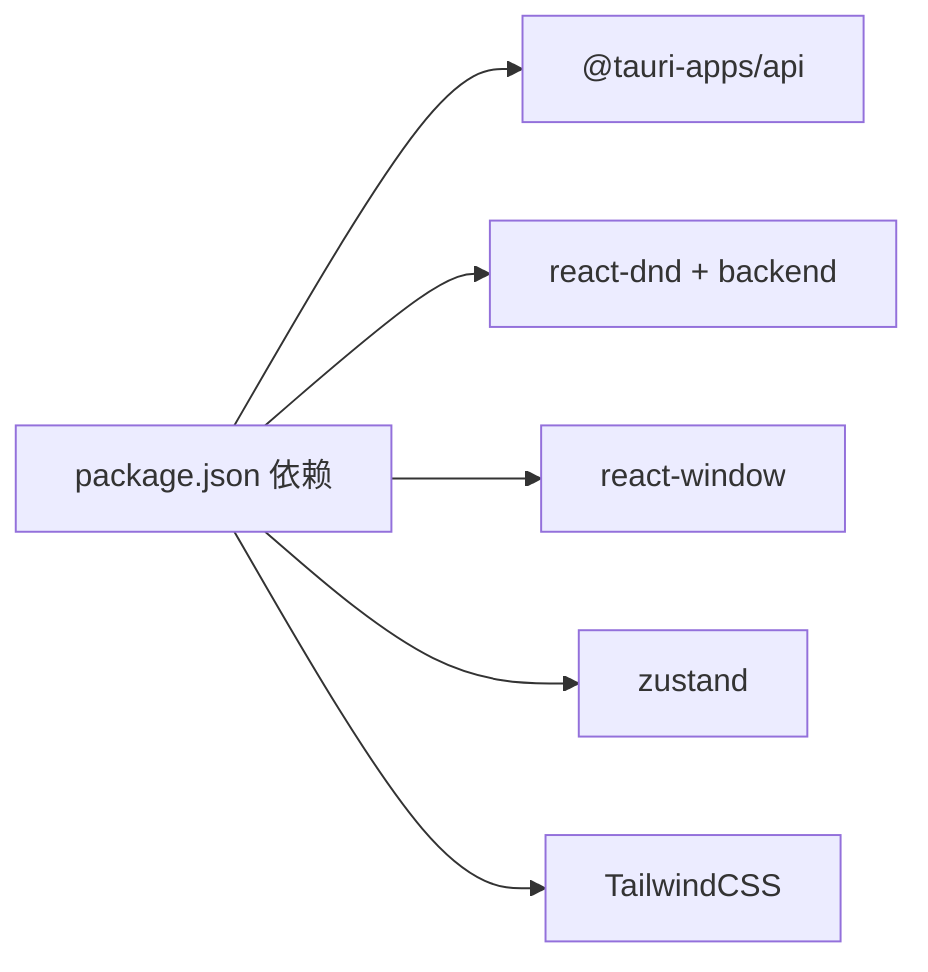

# 功能特性

<cite>
**本文引用的文件**
- [README.md](file://README.md)
- [package.json](file://package.json)
- [src/main.tsx](file://src/main.tsx)
- [src/App.tsx](file://src/App.tsx)
- [src/components/Main.tsx](file://src/components/Main.tsx)
- [src/components/Sidebar.tsx](file://src/components/Sidebar.tsx)
- [src/components/Inspector.tsx](file://src/components/Inspector.tsx)
- [src/components/MediaGrid.tsx](file://src/components/MediaGrid.tsx)
- [src/components/MediaCard.tsx](file://src/components/MediaCard.tsx)
- [src/containers/SidebarContainer.tsx](file://src/containers/SidebarContainer.tsx)
- [src/containers/MediaGridContainer.tsx](file://src/containers/MediaGridContainer.tsx)
- [src/contexts/ThemeContext.tsx](file://src/contexts/ThemeContext.tsx)
- [src/theme/theme.ts](file://src/theme/theme.ts)
- [src/store/useAppStore.ts](file://src/store/useAppStore.ts)
- [src/pages/views/index.ts](file://src/pages/views/index.ts)
</cite>

## 目录
1. [简介](#简介)
2. [项目结构](#项目结构)
3. [核心组件](#核心组件)
4. [架构总览](#架构总览)
5. [详细组件分析](#详细组件分析)
6. [依赖关系分析](#依赖关系分析)
7. [性能考量](#性能考量)
8. [故障排查指南](#故障排查指南)
9. [结论](#结论)
10. [附录](#附录)

## 简介
本文件面向 Medex v0.1.0 版本的功能特性说明与使用指南。Medex 是一款基于 React + TypeScript + Tauri V2 + TailwindCSS 的多媒体管理与播放应用，采用三栏式布局（Sidebar / Main / Inspector），提供媒体网格浏览、标签管理、收藏与最近项筛选、深色主题 UI、以及桌面应用支持能力。同时，本文也概述了后续版本计划中的功能方向。

- 当前版本（v0.1.0）已实现的功能
  - 三栏式布局：Sidebar（导航与标签）、Main（媒体网格）、Inspector（媒体详情与标签管理）
  - 多标签筛选（UI 占位，逻辑已具备基础容器与事件）
  - MediaCard 悬停交互（占位）
  - Dark Theme UI（深色主题为主，浅色主题自动生成）
  - 桌面应用支持（Tauri V2 跨平台）

- 后续版本计划
  - 媒体文件导入与管理
  - 标签系统完整实现
  - 视频播放器集成
  - 图片预览与缩放
  - 搜索与过滤功能
  - 数据持久化
  - 批量操作支持

章节来源
- [README.md:10-32](file://README.md#L10-L32)

## 项目结构
Medex 采用前后端分离的组织方式：
- 前端（React + TypeScript + TailwindCSS）位于 src/ 目录，包含组件、容器、上下文、主题、状态管理与页面视图。
- 桌面端（Tauri V2 + Rust）位于 src-tauri/ 目录，负责系统调用、数据库与后台服务。

图表来源
- [src/main.tsx:9-41](file://src/main.tsx#L9-L41)
- [src/App.tsx:59-71](file://src/App.tsx#L59-L71)

章节来源
- [README.md:97-119](file://README.md#L97-L119)

## 核心组件
- 三栏布局
  - Sidebar：Logo、导航项、标签列表与新增标签输入
  - Main：媒体网格（MediaGrid）与工具栏（ToolbarContainer）
  - Inspector：媒体详情、标签管理、收藏与删除操作
- 主题系统
  - 深色主题为主，浅色主题由深色主题自动生成；支持系统跟随、本地存储持久化与跨窗口同步
- 状态管理
  - 使用 Zustand 管理导航、标签、媒体列表、视图模式与筛选条件
- 媒体网格
  - 支持网格与列表两种视图；使用 react-window 实现虚拟滚动；支持多选、右键菜单、批量标签操作
- 媒体卡片
  - 支持图片与视频预览、收藏按钮、标签移除、悬停交互
- 桌面端集成
  - 通过 @tauri-apps/api 调用后端命令（如扫描、收藏、标签管理、缩略图请求等）

章节来源
- [src/components/Main.tsx:8-24](file://src/components/Main.tsx#L8-L24)
- [src/components/Sidebar.tsx:17-144](file://src/components/Sidebar.tsx#L17-L144)
- [src/components/Inspector.tsx:19-265](file://src/components/Inspector.tsx#L19-L265)
- [src/components/MediaGrid.tsx:70-212](file://src/components/MediaGrid.tsx#L70-L212)
- [src/components/MediaCard.tsx:34-264](file://src/components/MediaCard.tsx#L34-L264)
- [src/containers/SidebarContainer.tsx:7-78](file://src/containers/SidebarContainer.tsx#L7-L78)
- [src/containers/MediaGridContainer.tsx:30-618](file://src/containers/MediaGridContainer.tsx#L30-L618)
- [src/contexts/ThemeContext.tsx:17-90](file://src/contexts/ThemeContext.tsx#L17-L90)
- [src/theme/theme.ts:54-159](file://src/theme/theme.ts#L54-L159)
- [src/store/useAppStore.ts:145-395](file://src/store/useAppStore.ts#L145-L395)

## 架构总览
Medex 的整体架构围绕“前端 UI + Tauri 桥接 + Rust 后端”的模式展开。前端通过 @tauri-apps/api 调用后端命令，实现媒体扫描、标签管理、收藏状态变更、缩略图生成与事件通知等能力。

图表来源
- [src/containers/MediaGridContainer.tsx:210-235](file://src/containers/MediaGridContainer.tsx#L210-L235)
- [src/components/Inspector.tsx:27-41](file://src/components/Inspector.tsx#L27-L41)
- [src/containers/SidebarContainer.tsx:16-33](file://src/containers/SidebarContainer.tsx#L16-L33)

章节来源
- [src/main.tsx:9-41](file://src/main.tsx#L9-L41)
- [src/App.tsx:59-71](file://src/App.tsx#L59-L71)

## 详细组件分析

### 三栏式布局与导航
- Sidebar
  - 负责展示导航项（全部媒体、收藏、最近）与标签列表
  - 支持新增标签、删除标签、标签点击选择
- Main
  - 包含工具栏与媒体网格区域
- Inspector
  - 展示选中媒体的预览、标签集合、信息与操作（收藏、删除）

图表来源
- [src/App.tsx:59-71](file://src/App.tsx#L59-L71)
- [src/components/Sidebar.tsx:17-144](file://src/components/Sidebar.tsx#L17-L144)
- [src/components/Main.tsx:8-24](file://src/components/Main.tsx#L8-L24)
- [src/components/Inspector.tsx:19-265](file://src/components/Inspector.tsx#L19-L265)

章节来源
- [src/App.tsx:59-71](file://src/App.tsx#L59-L71)
- [src/components/Sidebar.tsx:17-144](file://src/components/Sidebar.tsx#L17-L144)
- [src/components/Main.tsx:8-24](file://src/components/Main.tsx#L8-L24)
- [src/components/Inspector.tsx:19-265](file://src/components/Inspector.tsx#L19-L265)

### 媒体网格与卡片
- MediaGrid
  - 支持网格与列表两种视图
  - 使用 react-window 实现虚拟滚动，优化大数据量渲染性能
  - 支持可见范围回调，用于触发缩略图任务队列
- MediaCard
  - 支持图片与视频预览
  - 收藏按钮、标签移除、悬停交互与选中态
  - 通过主题系统统一颜色与交互

图表来源
- [src/components/MediaGrid.tsx:70-212](file://src/components/MediaGrid.tsx#L70-L212)
- [src/components/MediaCard.tsx:34-264](file://src/components/MediaCard.tsx#L34-L264)

章节来源
- [src/components/MediaGrid.tsx:70-212](file://src/components/MediaGrid.tsx#L70-L212)
- [src/components/MediaCard.tsx:34-264](file://src/components/MediaCard.tsx#L34-L264)

### 标签系统与筛选
- SidebarContainer
  - 通过命令获取标签列表与计数，支持新增与删除标签
- MediaGridContainer
  - 支持按标签与媒体类型进行筛选
  - 支持批量标签操作（添加/移除）
- useAppStore
  - 维护标签与媒体列表状态，提供本地增删改方法

图表来源
- [src/containers/SidebarContainer.tsx:35-63](file://src/containers/SidebarContainer.tsx#L35-L63)
- [src/containers/MediaGridContainer.tsx:210-235](file://src/containers/MediaGridContainer.tsx#L210-L235)
- [src/store/useAppStore.ts:258-288](file://src/store/useAppStore.ts#L258-L288)

章节来源
- [src/containers/SidebarContainer.tsx:7-78](file://src/containers/SidebarContainer.tsx#L7-L78)
- [src/containers/MediaGridContainer.tsx:144-175](file://src/containers/MediaGridContainer.tsx#L144-L175)
- [src/store/useAppStore.ts:145-395](file://src/store/useAppStore.ts#L145-L395)

### 深色主题 UI
- ThemeContext
  - 支持 dark/light/system 三种模式
  - 从 localStorage 读取与写入主题设置
  - 监听系统主题变化与跨窗口同步
- theme.ts
  - 定义深色主题与浅色主题生成规则
  - 提供完整的颜色变量体系（背景、文本、边框、交互、按钮、标签等）

图表来源
- [src/contexts/ThemeContext.tsx:17-90](file://src/contexts/ThemeContext.tsx#L17-L90)
- [src/theme/theme.ts:54-159](file://src/theme/theme.ts#L54-L159)

章节来源
- [src/contexts/ThemeContext.tsx:17-90](file://src/contexts/ThemeContext.tsx#L17-L90)
- [src/theme/theme.ts:54-159](file://src/theme/theme.ts#L54-L159)

### 桌面应用支持
- main.tsx
  - 根据 URL 路径渲染不同页面（主界面、设置页、更新页）
- package.json
  - 定义脚本与依赖（@tauri-apps/api、@tauri-apps/cli 等）
- App.tsx
  - 三栏布局容器，承载 Sidebar、Main、Inspector

章节来源
- [src/main.tsx:9-41](file://src/main.tsx#L9-L41)
- [package.json:6-11](file://package.json#L6-L11)
- [src/App.tsx:59-71](file://src/App.tsx#L59-L71)

## 依赖关系分析
- 前端依赖
  - @tauri-apps/api：与桌面端通信
  - react-dnd / react-dnd-html5-backend：拖拽支持（占位）
  - react-window：虚拟滚动
  - zustand：状态管理
- 主题与样式
  - TailwindCSS + PostCSS + Autoprefixer
- 桌面端
  - Tauri V2 + Rust（后端命令在容器中调用）

图表来源
- [package.json:12-34](file://package.json#L12-L34)

章节来源
- [package.json:12-34](file://package.json#L12-L34)

## 性能考量
- 虚拟滚动
  - MediaGrid 使用 react-window 的 FixedSizeGrid/FixedSizeList，仅渲染可视区域，显著降低大列表渲染开销
- 缩略图异步加载
  - 通过任务队列与并发控制，优先请求可见区域缩略图，避免阻塞
- 状态与渲染优化
  - 使用 memo 与 useMemo 减少不必要重渲染
  - 选中态与主题变量通过 props 注入，避免重复计算

章节来源
- [src/components/MediaGrid.tsx:170-212](file://src/components/MediaGrid.tsx#L170-L212)
- [src/containers/MediaGridContainer.tsx:352-451](file://src/containers/MediaGridContainer.tsx#L352-L451)
- [src/components/MediaCard.tsx:317-318](file://src/components/MediaCard.tsx#L317-L318)

## 故障排查指南
- 主题不生效或未持久化
  - 检查 localStorage 中的主题键值是否存在
  - 确认 HTML 的 data-theme 是否正确设置
- 标签操作失败
  - 确认后端命令是否返回成功（create_tag、delete_tag、add_tag_to_media、remove_tag_from_media）
  - 检查全局事件 medex:tags-updated 是否触发
- 媒体列表为空
  - 确认是否已选择媒体库目录（localStorage 中的 libraryPath）
  - 检查后端 scan_and_index 是否执行成功
- 缩略图不显示
  - 检查 thumbnail_ready 事件是否到达
  - 确认 convertFileSrc 是否正确处理绝对路径

章节来源
- [src/contexts/ThemeContext.tsx:34-54](file://src/contexts/ThemeContext.tsx#L34-L54)
- [src/containers/SidebarContainer.tsx:41-62](file://src/containers/SidebarContainer.tsx#L41-L62)
- [src/containers/MediaGridContainer.tsx:311-331](file://src/containers/MediaGridContainer.tsx#L311-L331)
- [src/containers/MediaGridContainer.tsx:457-486](file://src/containers/MediaGridContainer.tsx#L457-L486)

## 结论
v0.1.0 版本的 Medex 已实现三栏式布局、标签筛选占位、深色主题 UI 与桌面应用支持等核心能力。通过虚拟滚动、任务队列与状态管理等手段，系统在性能与可用性上具备良好基础。后续版本将重点补齐媒体导入、标签系统完整实现、视频播放器集成、搜索过滤、数据持久化与批量操作等功能，进一步完善用户体验与生产力。

## 附录
- 页面视图导出
  - 通过 src/pages/views/index.ts 导出多个视图组件，便于页面路由与状态展示

章节来源
- [src/pages/views/index.ts:1-8](file://src/pages/views/index.ts#L1-L8)