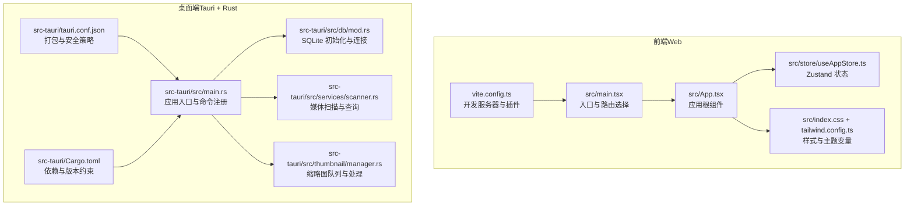
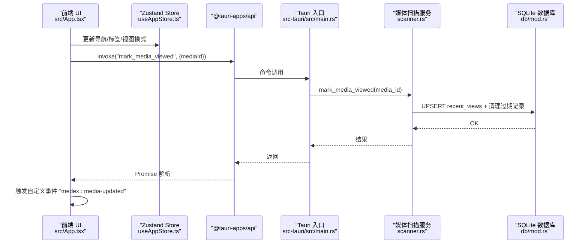
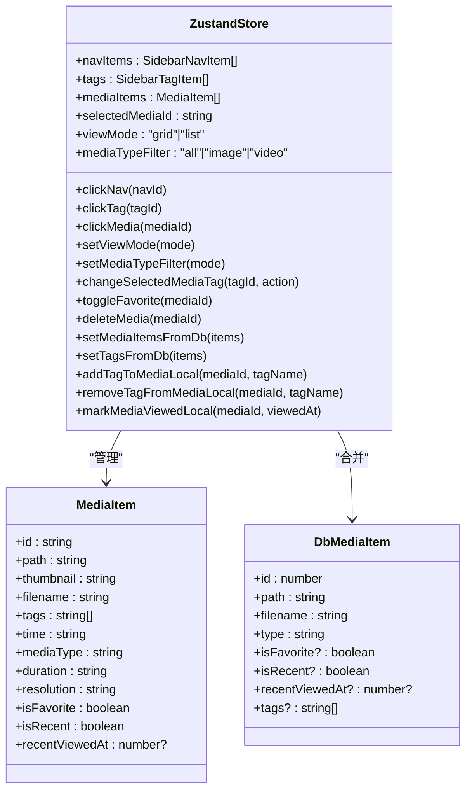
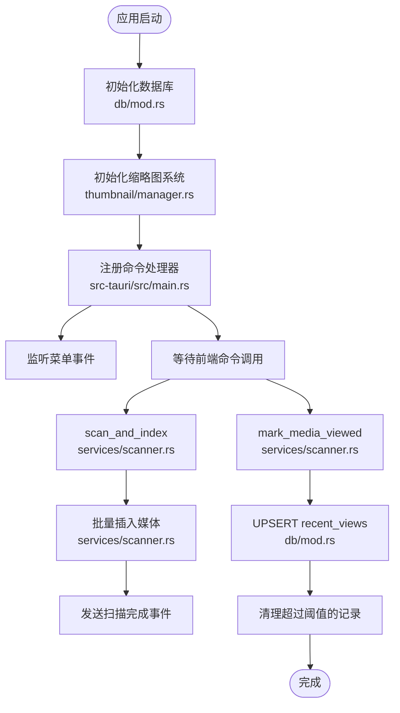
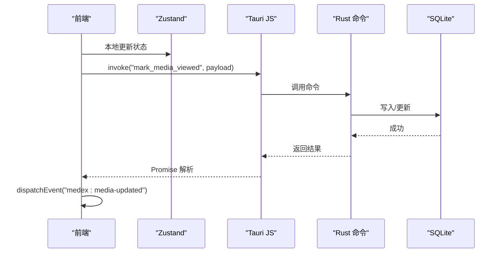
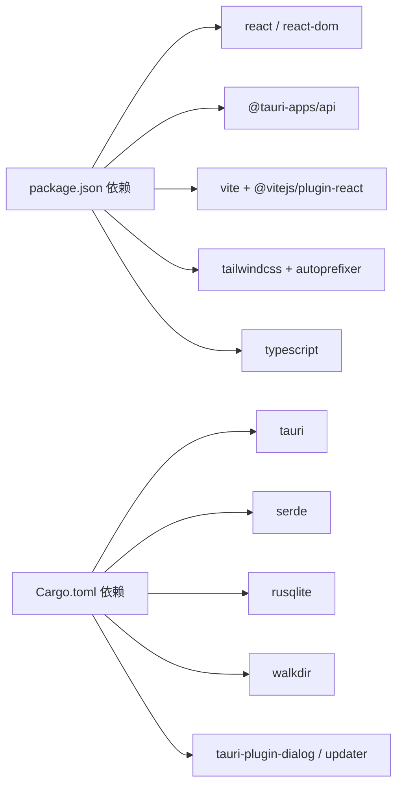

# 技术栈

<cite>
**本文引用的文件**
- [package.json](file://package.json)
- [vite.config.ts](file://vite.config.ts)
- [tailwind.config.ts](file://tailwind.config.ts)
- [postcss.config.js](file://postcss.config.js)
- [tsconfig.json](file://tsconfig.json)
- [src/main.tsx](file://src/main.tsx)
- [src/App.tsx](file://src/App.tsx)
- [src/store/useAppStore.ts](file://src/store/useAppStore.ts)
- [src/index.css](file://src/index.css)
- [src-tauri/Cargo.toml](file://src-tauri/Cargo.toml)
- [src-tauri/tauri.conf.json](file://src-tauri/tauri.conf.json)
- [src-tauri/src/main.rs](file://src-tauri/src/main.rs)
- [src-tauri/src/db/mod.rs](file://src-tauri/src/db/mod.rs)
- [src-tauri/src/services/scanner.rs](file://src-tauri/src/services/scanner.rs)
- [src-tauri/src/thumbnail/manager.rs](file://src-tauri/src/thumbnail/manager.rs)
</cite>

## 目录
1. [简介](#简介)
2. [项目结构](#项目结构)
3. [核心组件](#核心组件)
4. [架构总览](#架构总览)
5. [详细组件分析](#详细组件分析)
6. [依赖分析](#依赖分析)
7. [性能考量](#性能考量)
8. [故障排查指南](#故障排查指南)
9. [结论](#结论)
10. [附录](#附录)

## 简介
本文件面向 Medex 项目的开发者与技术评审，系统化阐述前端与桌面应用两套技术栈的选型动机、架构设计、组件协作与数据流，并提供学习路径与实践建议。前端采用 React 18.3 + TypeScript 5.5 + Vite 5.4 + TailwindCSS 3.4 + Zustand 4.5；桌面端采用 Tauri V2 + Rust 1.77.2 + Serde 1.0。两者通过 Tauri 的命令通道与事件机制实现双向通信，形成“Web 视图 + Rust 后端”的混合架构。

## 项目结构
项目采用前后端分离的多包布局：
- 前端（React + Vite + TailwindCSS + Zustand）位于根目录的 src 及相关配置文件中，负责 UI、状态管理与样式。
- 桌面端（Tauri + Rust）位于 src-tauri，包含数据库初始化、媒体扫描、缩略图生成等后端能力。

图表来源
- [src/main.tsx:1-44](file://src/main.tsx#L1-L44)
- [src/App.tsx:1-73](file://src/App.tsx#L1-L73)
- [src/store/useAppStore.ts:1-395](file://src/store/useAppStore.ts#L1-L395)
- [src/index.css:1-156](file://src/index.css#L1-L156)
- [tailwind.config.ts:1-36](file://tailwind.config.ts#L1-L36)
- [vite.config.ts:1-11](file://vite.config.ts#L1-L11)
- [src-tauri/src/main.rs:1-69](file://src-tauri/src/main.rs#L1-L69)
- [src-tauri/src/db/mod.rs:1-123](file://src-tauri/src/db/mod.rs#L1-L123)
- [src-tauri/src/services/scanner.rs:1-525](file://src-tauri/src/services/scanner.rs#L1-L525)
- [src-tauri/src/thumbnail/manager.rs:1-108](file://src-tauri/src/thumbnail/manager.rs#L1-L108)
- [src-tauri/tauri.conf.json:1-46](file://src-tauri/tauri.conf.json#L1-L46)
- [src-tauri/Cargo.toml:1-23](file://src-tauri/Cargo.toml#L1-L23)

章节来源
- [package.json:1-36](file://package.json#L1-L36)
- [vite.config.ts:1-11](file://vite.config.ts#L1-L11)
- [tailwind.config.ts:1-36](file://tailwind.config.ts#L1-L36)
- [postcss.config.js:1-7](file://postcss.config.js#L1-L7)
- [tsconfig.json:1-19](file://tsconfig.json#L1-L19)
- [src/main.tsx:1-44](file://src/main.tsx#L1-L44)
- [src/App.tsx:1-73](file://src/App.tsx#L1-L73)
- [src/store/useAppStore.ts:1-395](file://src/store/useAppStore.ts#L1-L395)
- [src/index.css:1-156](file://src/index.css#L1-L156)
- [src-tauri/Cargo.toml:1-23](file://src-tauri/Cargo.toml#L1-L23)
- [src-tauri/tauri.conf.json:1-46](file://src-tauri/tauri.conf.json#L1-L46)
- [src-tauri/src/main.rs:1-69](file://src-tauri/src/main.rs#L1-L69)
- [src-tauri/src/db/mod.rs:1-123](file://src-tauri/src/db/mod.rs#L1-L123)
- [src-tauri/src/services/scanner.rs:1-525](file://src-tauri/src/services/scanner.rs#L1-L525)
- [src-tauri/src/thumbnail/manager.rs:1-108](file://src-tauri/src/thumbnail/manager.rs#L1-L108)

## 核心组件
- 前端框架与类型系统
  - React 18.3：函数式组件、并发特性、严格模式与 Suspense 支持，适合复杂 UI 与高性能渲染。
  - TypeScript 5.5：严格的类型推断与编译期检查，提升可维护性与 IDE 支持。
- 构建与开发体验
  - Vite 5.4：基于 ES 模块的快速冷启动与热更新，开发服务器端口固定便于调试。
  - PostCSS + Autoprefixer：自动化前缀处理，保证跨浏览器兼容。
- 样式系统
  - TailwindCSS 3.4：原子化 CSS，结合自定义主题变量与 content 排查范围，实现深浅主题切换。
- 状态管理
  - Zustand 4.5：轻量级状态容器，支持切片与中间件，简化全局状态逻辑。
- 桌面端运行时
  - Tauri V2：以 Web 视图承载前端，通过命令通道调用 Rust 后端，兼顾性能与生态。
  - Rust 1.77.2：内存安全与零成本抽象，配合 SQLite、Serde 实现高效数据处理。
  - Serde 1.0：序列化/反序列化，统一前后端数据契约。

章节来源
- [package.json:12-34](file://package.json#L12-L34)
- [vite.config.ts:4-10](file://vite.config.ts#L4-L10)
- [postcss.config.js:1-7](file://postcss.config.js#L1-L7)
- [tailwind.config.ts:3-33](file://tailwind.config.ts#L3-L33)
- [tsconfig.json:2-16](file://tsconfig.json#L2-L16)
- [src/store/useAppStore.ts:1-395](file://src/store/useAppStore.ts#L1-L395)
- [src-tauri/Cargo.toml:13-23](file://src-tauri/Cargo.toml#L13-L23)
- [src-tauri/src/main.rs:49-65](file://src-tauri/src/main.rs#L49-L65)

## 架构总览
前端通过 @tauri-apps/api 的 invoke 与 emit/on 与 Tauri 命令通道交互，Rust 侧在 main.rs 中集中注册命令，数据库与缩略图服务按需初始化。

图表来源
- [src/App.tsx:35-41](file://src/App.tsx#L35-L41)
- [src-tauri/src/main.rs:49-65](file://src-tauri/src/main.rs#L49-L65)
- [src-tauri/src/services/scanner.rs:356-389](file://src-tauri/src/services/scanner.rs#L356-L389)
- [src-tauri/src/db/mod.rs:97-110](file://src-tauri/src/db/mod.rs#L97-L110)

## 详细组件分析

### 前端技术栈与协作
- React + TypeScript
  - 使用严格模式与 JSX 运行时，确保类型安全与开发体验。
  - tsconfig 配置采用 ESNext 模块解析与 bundler，利于 Vite 打包优化。
- Vite 构建与开发服务器
  - 固定开发端口与 React 插件，提升热更新稳定性。
- TailwindCSS 与主题系统
  - 自定义颜色变量映射到 CSS 变量，content 范围覆盖 src 下 TS/TSX 文件，确保产物裁剪精准。
  - index.css 引入原子化指令并定义深浅主题变量与过渡动画。
- Zustand 状态模型
  - 定义导航项、标签、媒体项等状态切片，提供本地更新与从数据库合并的能力。
  - 提供添加/移除标签、收藏切换、删除媒体、标记最近查看等动作，支持与后端同步。

图表来源
- [src/store/useAppStore.ts:3-68](file://src/store/useAppStore.ts#L3-L68)
- [src/store/useAppStore.ts:16-46](file://src/store/useAppStore.ts#L16-L46)
- [src/store/useAppStore.ts:145-394](file://src/store/useAppStore.ts#L145-L394)

章节来源
- [tsconfig.json:2-16](file://tsconfig.json#L2-L16)
- [vite.config.ts:4-10](file://vite.config.ts#L4-L10)
- [tailwind.config.ts:3-33](file://tailwind.config.ts#L3-L33)
- [postcss.config.js:1-7](file://postcss.config.js#L1-L7)
- [src/index.css:1-156](file://src/index.css#L1-L156)
- [src/store/useAppStore.ts:1-395](file://src/store/useAppStore.ts#L1-L395)

### 桌面端技术栈与协作
- Tauri V2
  - 在 tauri.conf.json 中配置窗口尺寸、安全策略（资产协议启用）、打包目标与更新器。
  - main.rs 注册命令处理器，初始化数据库与缩略图系统，并监听菜单事件。
- Rust 生态
  - Cargo.toml 指定 Rust 版本与依赖：tauri、serde、rusqlite、walkdir、tauri 插件等。
  - db/mod.rs 负责数据库初始化、表结构与索引、连接池封装。
  - services/scanner.rs 提供媒体扫描、批量插入、标签过滤、收藏与最近查看标记等命令。
  - thumbnail/manager.rs 维护缩略图生成队列、工作线程与缓存目录，集成 FFmpeg。

图表来源
- [src-tauri/src/main.rs:14-48](file://src-tauri/src/main.rs#L14-L48)
- [src-tauri/src/db/mod.rs:45-64](file://src-tauri/src/db/mod.rs#L45-L64)
- [src-tauri/src/services/scanner.rs:250-341](file://src-tauri/src/services/scanner.rs#L250-L341)
- [src-tauri/src/services/scanner.rs:356-389](file://src-tauri/src/services/scanner.rs#L356-L389)
- [src-tauri/src/thumbnail/manager.rs:24-49](file://src-tauri/src/thumbnail/manager.rs#L24-L49)

章节来源
- [src-tauri/tauri.conf.json:1-46](file://src-tauri/tauri.conf.json#L1-L46)
- [src-tauri/src/main.rs:1-69](file://src-tauri/src/main.rs#L1-L69)
- [src-tauri/Cargo.toml:1-23](file://src-tauri/Cargo.toml#L1-L23)
- [src-tauri/src/db/mod.rs:1-123](file://src-tauri/src/db/mod.rs#L1-L123)
- [src-tauri/src/services/scanner.rs:1-525](file://src-tauri/src/services/scanner.rs#L1-L525)
- [src-tauri/src/thumbnail/manager.rs:1-108](file://src-tauri/src/thumbnail/manager.rs#L1-L108)

### 数据流与状态同步
- 前端状态更新优先于本地状态，随后通过 invoke 与后端同步，完成后触发自定义事件刷新界面。
- 后端写入数据库后，通过事件广播或前端主动拉取实现数据一致性。

图表来源
- [src/App.tsx:35-41](file://src/App.tsx#L35-L41)
- [src-tauri/src/services/scanner.rs:356-389](file://src-tauri/src/services/scanner.rs#L356-L389)
- [src-tauri/src/db/mod.rs:97-110](file://src-tauri/src/db/mod.rs#L97-L110)

章节来源
- [src/App.tsx:1-73](file://src/App.tsx#L1-L73)
- [src-tauri/src/services/scanner.rs:356-389](file://src-tauri/src/services/scanner.rs#L356-L389)

## 依赖分析
- 前端依赖
  - React 生态与 @tauri-apps/api：用于 UI 与桌面能力桥接。
  - Vite 与 React 插件：开发与构建。
  - TailwindCSS 与 PostCSS/Autoprefixer：样式管线。
  - TypeScript：类型系统。
- 桌面端依赖
  - Tauri 2：应用框架与命令通道。
  - Serde：序列化/反序列化。
  - rusqlite：SQLite 访问与事务。
  - walkdir：目录遍历扫描。
  - tauri-plugin-dialog/updater：对话框与更新器插件。

图表来源
- [package.json:12-34](file://package.json#L12-L34)
- [src-tauri/Cargo.toml:13-23](file://src-tauri/Cargo.toml#L13-L23)

章节来源
- [package.json:1-36](file://package.json#L1-L36)
- [src-tauri/Cargo.toml:1-23](file://src-tauri/Cargo.toml#L1-L23)

## 性能考量
- 前端
  - Vite 的 ES 模块热更新与 Tree-shaking 减少打包体积与冷启动时间。
  - Tailwind 原子类减少样式冲突与重复定义，结合 content 排查避免无用 CSS。
  - Zustand 无样板代码的状态管理，降低订阅与渲染开销。
- 桌面端
  - Tauri 以 Web 视图承载前端，避免 Electron 的重型浏览器进程，内存占用更低。
  - Rust 的零拷贝与并发模型（如缩略图队列）提升 I/O 密集场景性能。
  - SQLite 事务批处理与索引优化（媒体路径、标签关联、最近查看时间）降低查询延迟。
- 数据一致性
  - 前端本地乐观更新 + 后端持久化 + 事件驱动刷新，保证用户体验与数据正确性。

## 故障排查指南
- 开发服务器端口冲突
  - 确认 vite.config.ts 中 server.port 与 strictPort 设置，避免端口被占用导致启动失败。
- 样式未生效
  - 检查 tailwind.config.ts 的 content 范围是否包含新增组件文件，确认 PostCSS 插件链完整。
- Tauri 命令调用失败
  - 在 src-tauri/src/main.rs 中核对命令注册列表与参数签名，确保前端 invoke 的命令名一致。
- 数据库初始化失败
  - 查看 db/mod.rs 的初始化 SQL 与连接路径，确认应用数据目录可写。
- 缩略图生成异常
  - 检查 ffmpeg 是否可用与缓存目录权限，关注 thumbnail/manager.rs 的错误日志输出。

章节来源
- [vite.config.ts:6-9](file://vite.config.ts#L6-L9)
- [tailwind.config.ts:4-4](file://tailwind.config.ts#L4-L4)
- [src-tauri/src/main.rs:49-65](file://src-tauri/src/main.rs#L49-L65)
- [src-tauri/src/db/mod.rs:45-64](file://src-tauri/src/db/mod.rs#L45-L64)
- [src-tauri/src/thumbnail/manager.rs:51-106](file://src-tauri/src/thumbnail/manager.rs#L51-L106)

## 结论
Medex 的技术栈在“现代前端 + Rust 桌面后端”之间取得平衡：前端以 React + TypeScript + Vite + Tailwind + Zustand 构建高可用 UI，桌面端以 Tauri + Rust + Serde + SQLite 提供高性能与安全的本地能力。通过清晰的命令通道与事件机制，前后端协同完成媒体扫描、标签管理、最近查看与缩略图生成等核心功能。

## 附录
- 学习路径与资源
  - 前端
    - React 官方文档与 Hooks 指南
    - TypeScript 官方手册与严格模式配置
    - Vite 官方文档与插件生态
    - TailwindCSS 原子类与响应式系统
    - Zustand 官方示例与中间件使用
  - 桌面端
    - Tauri 官方文档与命令通道
    - Rust 官方教程与所有权模型
    - Serde 序列化指南与 derive 特性
    - rusqlite 官方文档与事务最佳实践
    - Postgres/SQLite 性能优化与索引设计
- 构建与发布
  - 开发：npm run dev（前端）；npm run tauri（桌面端）
  - 构建：npm run build（TypeScript + Vite），由 Tauri 打包
  - 预览：npm run preview
- 配置要点
  - 前端：tsconfig 的模块解析、Vite 的开发端口、Tailwind 的 content 范围
  - 桌面端：tauri.conf.json 的窗口、安全策略、打包与更新器配置；Cargo.toml 的版本与依赖