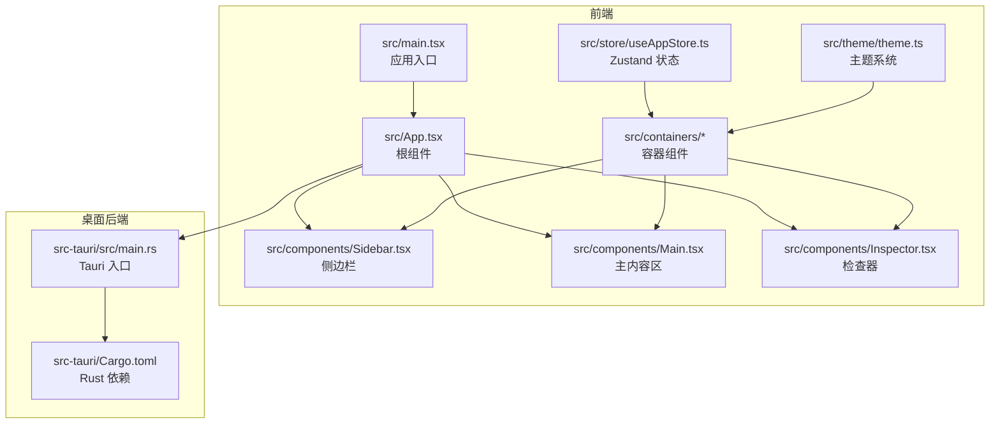
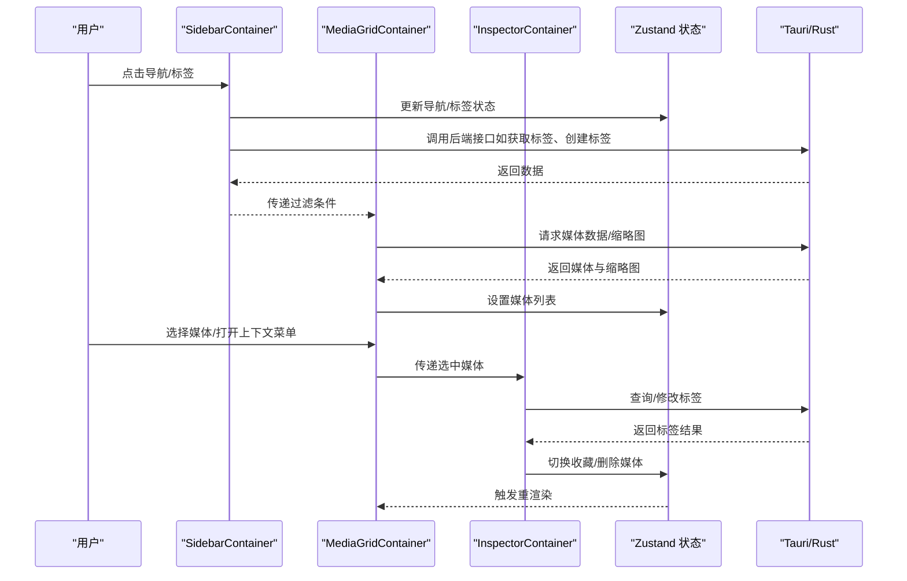
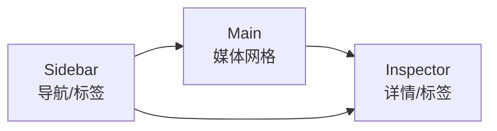
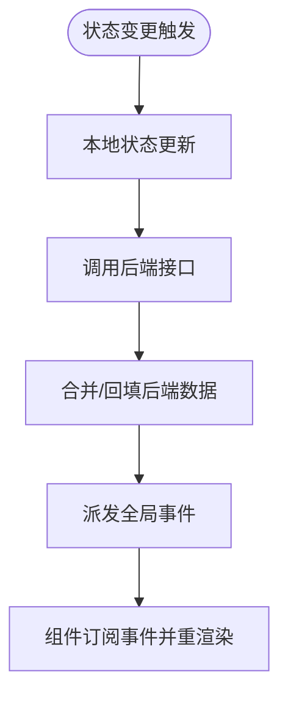
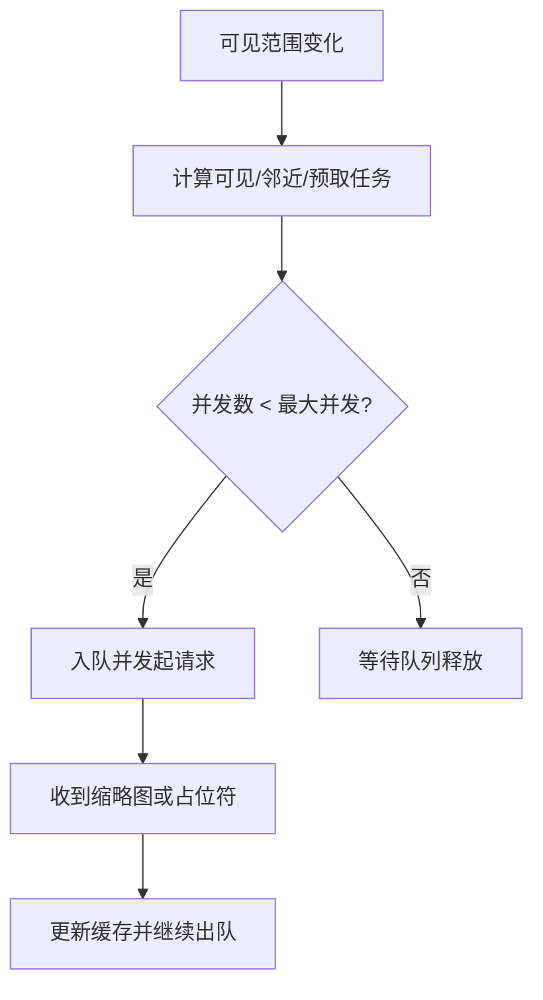
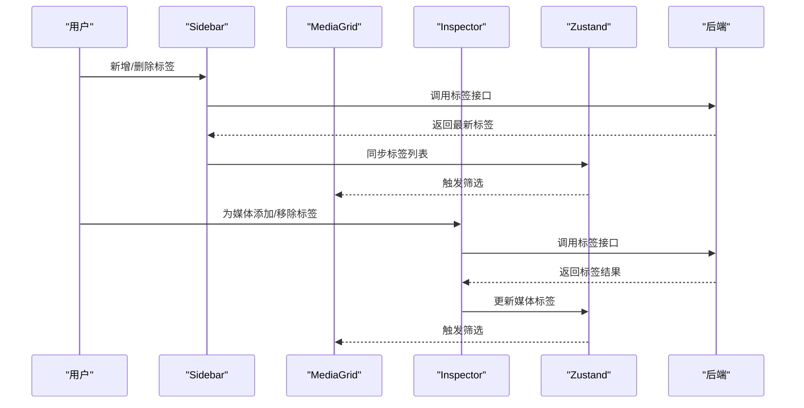
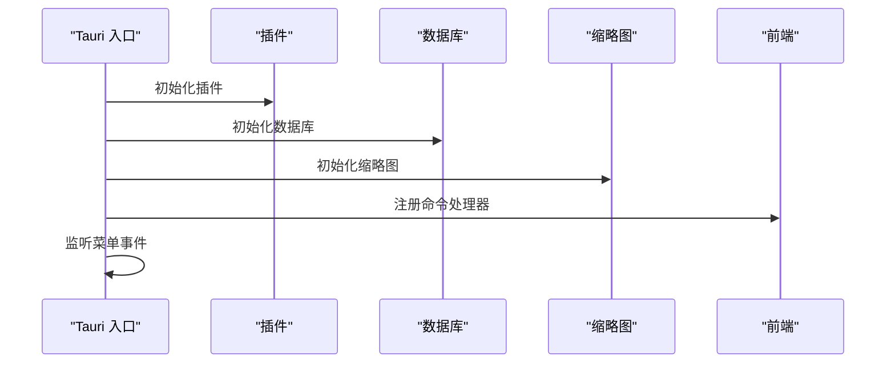
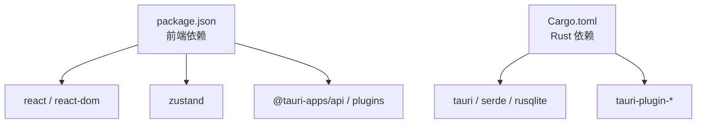

# 项目介绍

<cite>
**本文引用的文件**
- [README.md](file://README.md)
- [package.json](file://package.json)
- [src/main.tsx](file://src/main.tsx)
- [src/App.tsx](file://src/App.tsx)
- [src/components/Sidebar.tsx](file://src/components/Sidebar.tsx)
- [src/containers/SidebarContainer.tsx](file://src/containers/SidebarContainer.tsx)
- [src/components/Main.tsx](file://src/components/Main.tsx)
- [src/containers/MediaGridContainer.tsx](file://src/containers/MediaGridContainer.tsx)
- [src/components/Inspector.tsx](file://src/components/Inspector.tsx)
- [src/containers/InspectorContainer.tsx](file://src/containers/InspectorContainer.tsx)
- [src/store/useAppStore.ts](file://src/store/useAppStore.ts)
- [src/theme/theme.ts](file://src/theme/theme.ts)
- [src-tauri/src/main.rs](file://src-tauri/src/main.rs)
- [src-tauri/Cargo.toml](file://src-tauri/Cargo.toml)
- [src/pages/views/AvailableView.tsx](file://src/pages/views/AvailableView.tsx)
</cite>

## 目录
1. [简介](#简介)
2. [项目结构](#项目结构)
3. [核心组件](#核心组件)
4. [架构总览](#架构总览)
5. [详细组件分析](#详细组件分析)
6. [依赖关系分析](#依赖关系分析)
7. [性能考量](#性能考量)
8. [故障排查指南](#故障排查指南)
9. [结论](#结论)
10. [附录](#附录)

## 简介
Medex 是一款多媒体资产管理与播放应用，专注于视频与图片的浏览、分类与筛选。项目采用“三栏式布局”：左侧 Sidebar（导航与标签）、中间 Main（媒体网格）、右侧 Inspector（媒体详情与标签管理），配合暗色主题与桌面原生体验，帮助用户高效组织与检索个人媒体资源。

- 当前版本：v0.1.0
- 技术栈：React + TypeScript + Tauri V2 + TailwindCSS
- 桌面能力：跨平台原生应用，内置自动扫描、缩略图队列、标签系统与收藏管理等基础能力

Medex 的目标是为创作者、设计师与内容管理者提供一个轻量、直观、可扩展的本地媒体资产管理工具。通过标签体系与多条件筛选，用户可以快速定位所需素材；通过 Inspector 的标签编辑与收藏功能，实现对媒体资产的精细化管理。

**章节来源**
- [README.md:1-209](file://README.md#L1-L209)

## 项目结构
项目采用前后端分离的双层架构：
- 前端（React + TypeScript）：负责 UI、交互与状态管理，使用 Zustand 管理全局状态，TailwindCSS 实现主题与样式
- 桌面后端（Tauri + Rust）：负责系统级能力（文件扫描、数据库、缩略图、菜单、更新等）

**图表来源**
- [src/main.tsx:1-44](file://src/main.tsx#L1-L44)
- [src/App.tsx:1-73](file://src/App.tsx#L1-L73)
- [src/components/Sidebar.tsx:1-145](file://src/components/Sidebar.tsx#L1-L145)
- [src/components/Main.tsx:1-25](file://src/components/Main.tsx#L1-L25)
- [src/components/Inspector.tsx:1-277](file://src/components/Inspector.tsx#L1-L277)
- [src/containers/SidebarContainer.tsx:1-79](file://src/containers/SidebarContainer.tsx#L1-L79)
- [src/containers/MediaGridContainer.tsx:1-620](file://src/containers/MediaGridContainer.tsx#L1-L620)
- [src/containers/InspectorContainer.tsx:1-32](file://src/containers/InspectorContainer.tsx#L1-L32)
- [src/store/useAppStore.ts:1-395](file://src/store/useAppStore.ts#L1-L395)
- [src/theme/theme.ts:1-159](file://src/theme/theme.ts#L1-L159)
- [src-tauri/src/main.rs:1-98](file://src-tauri/src/main.rs#L1-L98)
- [src-tauri/Cargo.toml:1-24](file://src-tauri/Cargo.toml#L1-L24)

**章节来源**
- [README.md:97-119](file://README.md#L97-L119)
- [src/main.tsx:9-41](file://src/main.tsx#L9-L41)
- [src/App.tsx:59-71](file://src/App.tsx#L59-L71)

## 核心组件
- Sidebar（侧边栏）：包含应用 Logo、导航项（全部/收藏/最近）与标签列表，支持新增、删除与选择标签
- Main（主内容区）：包含工具栏与媒体网格，负责媒体列表渲染、多选、上下文菜单与缩略图队列
- Inspector（检查器）：展示选中媒体的预览、标签、属性与操作（收藏、删除、新增标签）

这些组件通过容器组件与状态管理解耦，形成清晰的职责边界，便于扩展与维护。

**章节来源**
- [README.md:123-139](file://README.md#L123-L139)
- [src/components/Sidebar.tsx:17-144](file://src/components/Sidebar.tsx#L17-L144)
- [src/components/Main.tsx:8-24](file://src/components/Main.tsx#L8-L24)
- [src/components/Inspector.tsx:19-265](file://src/components/Inspector.tsx#L19-L265)

## 架构总览
Medex 的整体交互流程如下：

**图表来源**
- [src/containers/SidebarContainer.tsx:16-33](file://src/containers/SidebarContainer.tsx#L16-L33)
- [src/containers/MediaGridContainer.tsx:211-244](file://src/containers/MediaGridContainer.tsx#L211-L244)
- [src/containers/InspectorContainer.tsx:6-31](file://src/containers/InspectorContainer.tsx#L6-L31)
- [src/store/useAppStore.ts:145-394](file://src/store/useAppStore.ts#L145-L394)
- [src-tauri/src/main.rs:78-94](file://src-tauri/src/main.rs#L78-L94)

## 详细组件分析

### 三栏式布局设计理念与用户体验
- Sidebar：集中控制入口，提供导航与标签管理，支持新增/删除标签，便于快速筛选
- Main：以网格为主的信息密度区域，支持多选、拖拽、上下文菜单与缩略图懒加载，兼顾效率与可读性
- Inspector：聚焦于媒体详情与标签编辑，提供即时反馈与操作确认，降低误操作风险

**图表来源**
- [src/components/Sidebar.tsx:28-142](file://src/components/Sidebar.tsx#L28-L142)
- [src/components/Main.tsx:10-22](file://src/components/Main.tsx#L10-L22)
- [src/components/Inspector.tsx:91-263](file://src/components/Inspector.tsx#L91-L263)

**章节来源**
- [README.md:14-21](file://README.md#L14-L21)
- [src/App.tsx:59-71](file://src/App.tsx#L59-L71)

### 状态管理与数据流（Zustand）
- 全局状态包括导航项、标签、媒体列表、视图模式、类型过滤、选中媒体等
- 提供本地变更与后端同步的方法，如设置媒体列表、切换标签、收藏/删除媒体、标记最近查看等
- 通过事件机制（如媒体更新、标签更新）驱动 UI 刷新

**图表来源**
- [src/store/useAppStore.ts:145-394](file://src/store/useAppStore.ts#L145-L394)
- [src/containers/MediaGridContainer.tsx:490-495](file://src/containers/MediaGridContainer.tsx#L490-L495)
- [src/containers/SidebarContainer.tsx:28-32](file://src/containers/SidebarContainer.tsx#L28-L32)

**章节来源**
- [src/store/useAppStore.ts:48-68](file://src/store/useAppStore.ts#L48-L68)

### 缩略图与性能优化
- 视频缩略图采用优先级队列与并发限制策略，避免阻塞主线程
- 通过可见范围回调预取相邻与可视区域缩略图，提升滚动流畅度
- 支持缩略图就绪事件与本地缓存映射，减少重复请求

**图表来源**
- [src/containers/MediaGridContainer.tsx:353-452](file://src/containers/MediaGridContainer.tsx#L353-L452)
- [src/containers/MediaGridContainer.tsx:454-487](file://src/containers/MediaGridContainer.tsx#L454-L487)

**章节来源**
- [src/containers/MediaGridContainer.tsx:28-49](file://src/containers/MediaGridContainer.tsx#L28-L49)
- [src/containers/MediaGridContainer.tsx:311-332](file://src/containers/MediaGridContainer.tsx#L311-L332)

### 标签系统与筛选
- Sidebar 支持新增/删除标签，并与 Main 的标签筛选联动
- Inspector 提供按媒体维度的标签增删与去重处理
- 通过事件驱动（标签/媒体标签更新）保持各组件状态一致

**图表来源**
- [src/containers/SidebarContainer.tsx:35-63](file://src/containers/SidebarContainer.tsx#L35-L63)
- [src/containers/InspectorContainer.tsx:6-31](file://src/containers/InspectorContainer.tsx#L6-L31)
- [src/containers/MediaGridContainer.tsx:146-176](file://src/containers/MediaGridContainer.tsx#L146-L176)

**章节来源**
- [src/containers/SidebarContainer.tsx:16-33](file://src/containers/SidebarContainer.tsx#L16-L33)
- [src/containers/InspectorContainer.tsx:27-53](file://src/containers/InspectorContainer.tsx#L27-L53)

### 桌面后端与系统能力
- Tauri 入口注册插件（对话框、更新、存储），初始化数据库与缩略图系统
- 提供媒体扫描、标签查询、收藏切换、缩略图请求等命令
- 自动扫描逻辑在启动后延迟执行，依据设置决定是否扫描库目录

**图表来源**
- [src-tauri/src/main.rs:11-77](file://src-tauri/src/main.rs#L11-L77)
- [src-tauri/src/main.rs:78-94](file://src-tauri/src/main.rs#L78-L94)

**章节来源**
- [src-tauri/src/main.rs:16-51](file://src-tauri/src/main.rs#L16-L51)
- [src-tauri/Cargo.toml:13-24](file://src-tauri/Cargo.toml#L13-L24)

## 依赖关系分析
- 前端依赖：React、Zustand、@tauri-apps/* 插件、TailwindCSS
- 桌面后端依赖：Tauri、rusqlite、tauri-plugin-*、walkdir 等
- 包管理脚本：dev/build/preview/tauri

**图表来源**
- [package.json:12-36](file://package.json#L12-L36)
- [src-tauri/Cargo.toml:13-24](file://src-tauri/Cargo.toml#L13-L24)

**章节来源**
- [package.json:6-11](file://package.json#L6-L11)
- [src-tauri/Cargo.toml:1-8](file://src-tauri/Cargo.toml#L1-L8)

## 性能考量
- 缩略图并发与队列：限制最大并发与队列长度，避免内存与 I/O 压力
- 可见范围预取：仅在滚动时按优先级加载，减少无关资源占用
- 事件驱动更新：通过全局事件避免全量重渲染，提高响应速度
- 主题与样式：统一主题变量，减少重复计算与样式抖动

[本节为通用性能建议，不直接分析具体文件]

## 故障排查指南
- 标签操作失败：检查后端接口调用与错误提示，确认标签名称唯一性与媒体 ID 有效性
- 缩略图不显示：确认视频路径有效、缩略图生成成功，查看队列与并发状态
- 媒体列表为空：确认媒体库路径已设置并通过扫描完成索引
- 更新提示：在更新页查看可用版本与更新日志，按提示执行更新

**章节来源**
- [src/containers/SidebarContainer.tsx:47-50](file://src/containers/SidebarContainer.tsx#L47-L50)
- [src/containers/MediaGridContainer.tsx:383-387](file://src/containers/MediaGridContainer.tsx#L383-L387)
- [src/pages/views/AvailableView.tsx:12-86](file://src/pages/views/AvailableView.tsx#L12-L86)

## 结论
Medex 以三栏式布局为核心，结合标签筛选、收藏管理与缩略图优化，为用户提供高效的本地媒体资产管理体验。v0.1.0 版本奠定了稳定的基础能力，后续将持续完善媒体导入、搜索过滤、数据持久化与批量操作等功能，逐步演进为成熟的资产管理工具。

[本节为总结性内容，不直接分析具体文件]

## 附录

### 三栏式布局与用户体验要点
- Sidebar：信息密度高、操作集中，适合快速筛选与标签管理
- Main：网格为主、支持多选与上下文菜单，兼顾效率与可读性
- Inspector：细节聚焦、即时反馈，降低误操作风险

**章节来源**
- [README.md:14-21](file://README.md#L14-L21)
- [src/components/Sidebar.tsx:42-72](file://src/components/Sidebar.tsx#L42-L72)
- [src/components/Inspector.tsx:90-111](file://src/components/Inspector.tsx#L90-L111)

### 主题系统与可访问性
- 深色/浅色主题统一变量，确保对比度与可读性
- 交互态（hover/active/selected）颜色明确，提升操作反馈

**章节来源**
- [src/theme/theme.ts:54-98](file://src/theme/theme.ts#L54-L98)
- [src/theme/theme.ts:104-150](file://src/theme/theme.ts#L104-L150)