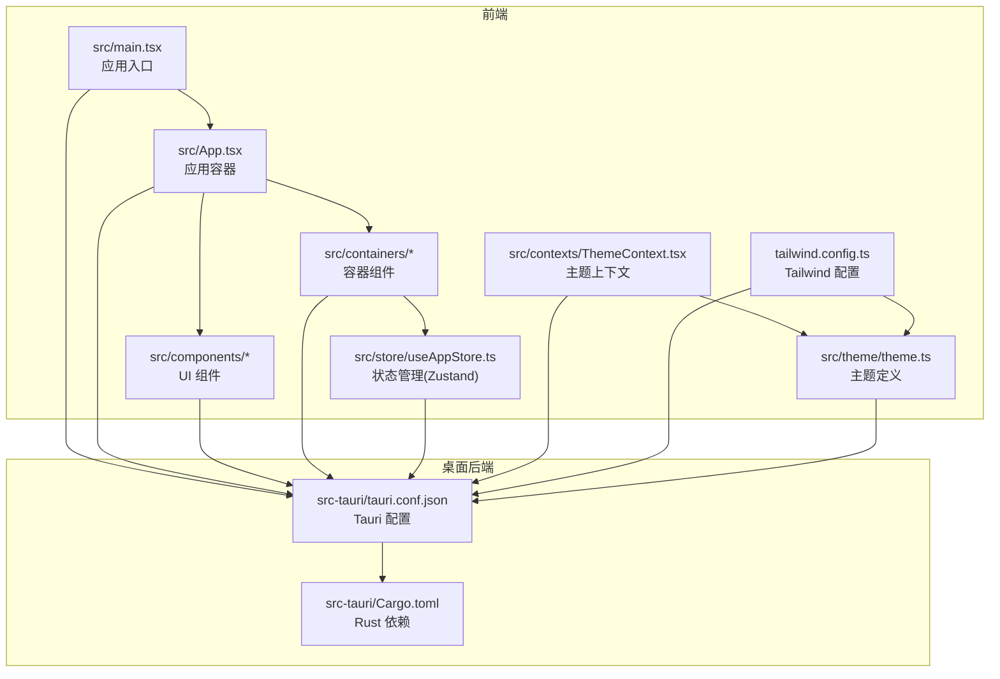
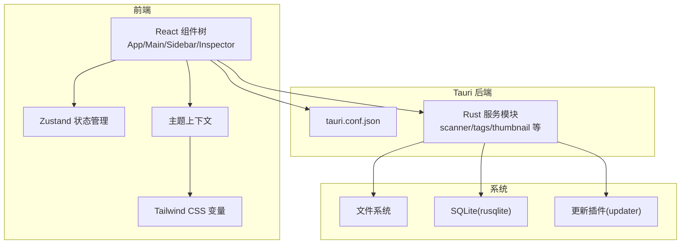
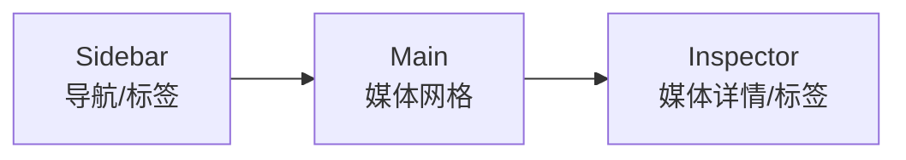
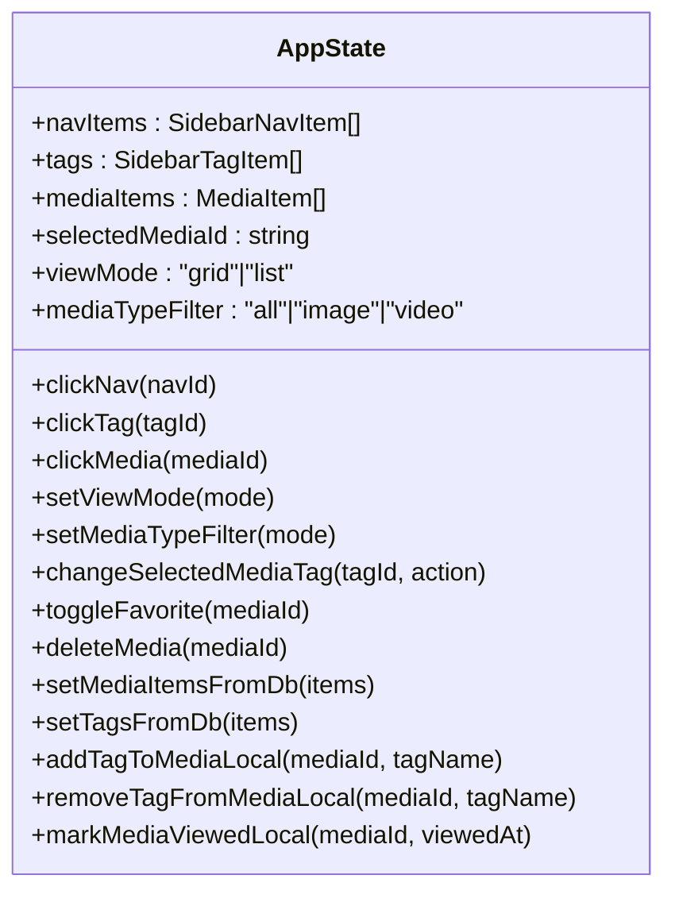
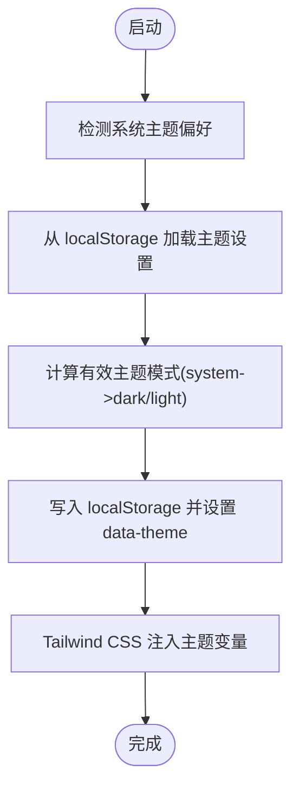
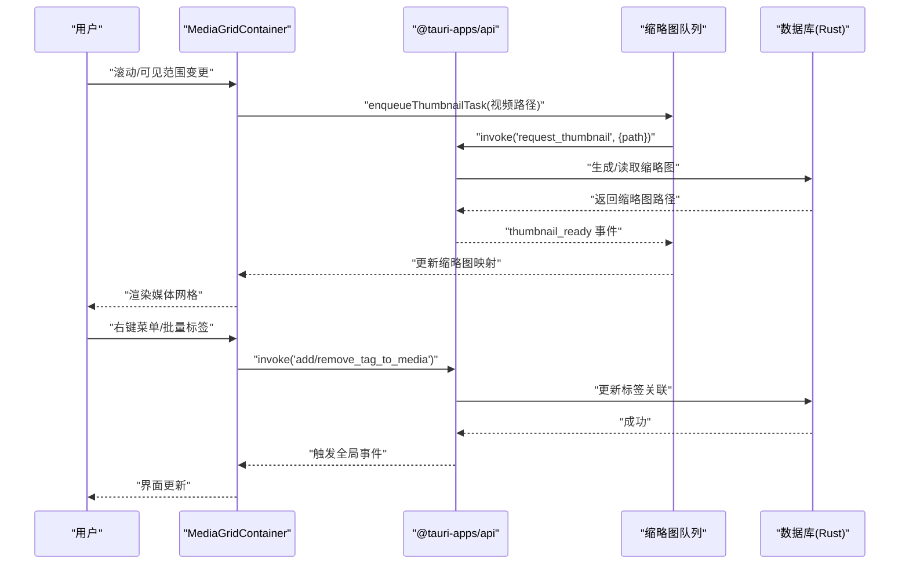
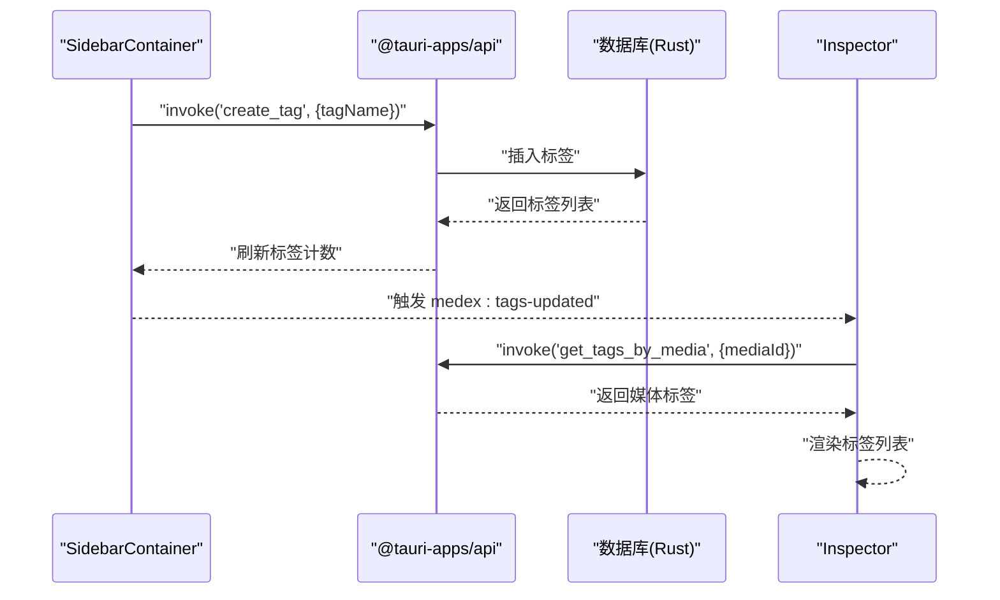
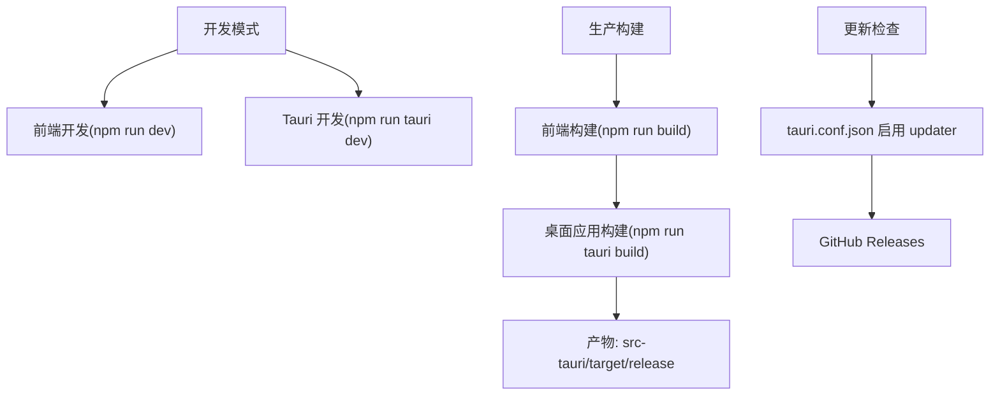
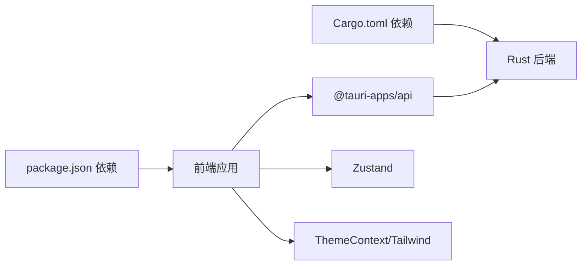

# 项目概述

<cite>
**本文档引用的文件**
- [README.md](file://README.md)
- [package.json](file://package.json)
- [src-tauri/Cargo.toml](file://src-tauri/Cargo.toml)
- [src-tauri/tauri.conf.json](file://src-tauri/tauri.conf.json)
- [src/main.tsx](file://src/main.tsx)
- [src/App.tsx](file://src/App.tsx)
- [src/components/Sidebar.tsx](file://src/components/Sidebar.tsx)
- [src/components/Main.tsx](file://src/components/Main.tsx)
- [src/components/Inspector.tsx](file://src/components/Inspector.tsx)
- [src/containers/SidebarContainer.tsx](file://src/containers/SidebarContainer.tsx)
- [src/containers/MediaGridContainer.tsx](file://src/containers/MediaGridContainer.tsx)
- [src/store/useAppStore.ts](file://src/store/useAppStore.ts)
- [src/contexts/ThemeContext.tsx](file://src/contexts/ThemeContext.tsx)
- [tailwind.config.ts](file://tailwind.config.ts)
- [src/theme/theme.ts](file://src/theme/theme.ts)
</cite>

## 目录
1. [简介](#简介)
2. [项目结构](#项目结构)
3. [核心组件](#核心组件)
4. [架构总览](#架构总览)
5. [详细组件分析](#详细组件分析)
6. [依赖关系分析](#依赖关系分析)
7. [性能考量](#性能考量)
8. [故障排除指南](#故障排除指南)
9. [结论](#结论)
10. [附录](#附录)

## 简介
Medex 是一款多媒体资产管理与播放应用，支持视频与图片的浏览、标签化管理与分类筛选。项目采用三栏式布局设计（Sidebar / Main / Inspector），结合 React + TypeScript + Tauri V2 + TailwindCSS 技术栈，提供现代化的桌面应用体验。当前版本为 v0.1.0，已完成三栏布局、标签系统占位、暗色主题与桌面框架集成等基础能力；后续版本规划包括媒体导入导出、标签系统完善、视频播放器集成、搜索过滤、数据持久化与批量操作等功能。

- 版本：v0.1.0
- 许可证：MIT
- 联系方式：作者 you，项目仓库地址见 README

**章节来源**
- [README.md:1-209](file://README.md#L1-L209)

## 项目结构
项目采用前后端分离的双层结构：
- 前端（React + TypeScript + TailwindCSS）：负责 UI 组件、状态管理、主题系统与用户交互。
- 桌面后端（Tauri V2 + Rust）：负责系统调用、文件扫描与索引、数据库访问、插件与更新机制等。

**图表来源**
- [src/main.tsx:1-44](file://src/main.tsx#L1-L44)
- [src/App.tsx:1-73](file://src/App.tsx#L1-L73)
- [src-tauri/tauri.conf.json:1-46](file://src-tauri/tauri.conf.json#L1-L46)
- [src-tauri/Cargo.toml:1-24](file://src-tauri/Cargo.toml#L1-L24)

**章节来源**
- [README.md:97-119](file://README.md#L97-L119)
- [src/main.tsx:9-41](file://src/main.tsx#L9-L41)

## 核心组件
- 三栏布局
  - Sidebar：应用导航与标签列表，支持新增/删除标签与导航切换。
  - Main：媒体网格区域，包含工具栏与媒体网格容器，支持多选、右键菜单、批量标签操作与缩略图队列。
  - Inspector：媒体详情面板，支持标签增删、收藏切换、删除媒体与预览展示。
- 状态管理：使用 Zustand 管理导航项、标签、媒体项与视图模式等状态。
- 主题系统：支持深色/浅色/系统主题，主题变量通过 Tailwind CSS 自定义属性注入。
- 桌面集成：通过 Tauri API 调用系统对话框、事件监听、命令调用与更新插件。

**章节来源**
- [README.md:10-47](file://README.md#L10-L47)
- [src/components/Sidebar.tsx:1-145](file://src/components/Sidebar.tsx#L1-L145)
- [src/components/Main.tsx:1-25](file://src/components/Main.tsx#L1-L25)
- [src/components/Inspector.tsx:1-277](file://src/components/Inspector.tsx#L1-L277)
- [src/store/useAppStore.ts:1-395](file://src/store/useAppStore.ts#L1-L395)
- [src/contexts/ThemeContext.tsx:1-99](file://src/contexts/ThemeContext.tsx#L1-L99)

## 架构总览
Medex 的整体架构由前端 React 应用与 Tauri/Rust 后端协同组成。前端通过 @tauri-apps/api 与后端通信，执行数据库查询、文件扫描、标签管理与更新检查等操作。状态管理采用 Zustand，主题系统通过 Tailwind CSS 变量与 CSS 自定义属性实现动态切换。

**图表来源**
- [src/App.tsx:1-73](file://src/App.tsx#L1-L73)
- [src/containers/MediaGridContainer.tsx:1-619](file://src/containers/MediaGridContainer.tsx#L1-L619)
- [src-tauri/tauri.conf.json:1-46](file://src-tauri/tauri.conf.json#L1-L46)
- [src-tauri/Cargo.toml:13-24](file://src-tauri/Cargo.toml#L13-L24)

**章节来源**
- [src/App.tsx:59-71](file://src/App.tsx#L59-L71)
- [src/main.tsx:9-41](file://src/main.tsx#L9-L41)

## 详细组件分析

### 三栏式布局设计
三栏式布局旨在最大化媒体浏览效率与信息密度：
- Sidebar：集中管理导航与标签，便于快速切换视图与筛选。
- Main：媒体网格作为主工作区，承载媒体浏览、多选与批量操作。
- Inspector：右侧详情面板，聚焦媒体元信息与标签管理，支持收藏与删除。

**图表来源**
- [src/App.tsx:59-71](file://src/App.tsx#L59-L71)
- [src/components/Sidebar.tsx:28-143](file://src/components/Sidebar.tsx#L28-L143)
- [src/components/Main.tsx:8-24](file://src/components/Main.tsx#L8-L24)
- [src/components/Inspector.tsx:90-264](file://src/components/Inspector.tsx#L90-L264)

**章节来源**
- [README.md:14-21](file://README.md#L14-L21)
- [src/App.tsx:59-71](file://src/App.tsx#L59-L71)

### 状态管理（Zustand）
useAppStore 提供统一的状态模型，包括导航项、标签、媒体项、视图模式与类型过滤等。支持本地标签增删、收藏切换、媒体删除与从数据库合并媒体项等操作。

**图表来源**
- [src/store/useAppStore.ts:48-394](file://src/store/useAppStore.ts#L48-L394)

**章节来源**
- [src/store/useAppStore.ts:145-394](file://src/store/useAppStore.ts#L145-L394)

### 主题系统（深色/浅色/系统）
主题系统通过 ThemeProvider 管理主题模式与颜色变量，Tailwind 配置将 CSS 变量映射为组件可用的颜色类，实现全站主题切换。

**图表来源**
- [src/contexts/ThemeContext.tsx:17-99](file://src/contexts/ThemeContext.tsx#L17-L99)
- [tailwind.config.ts:3-36](file://tailwind.config.ts#L3-L36)
- [src/theme/theme.ts:54-159](file://src/theme/theme.ts#L54-L159)

**章节来源**
- [src/contexts/ThemeContext.tsx:17-99](file://src/contexts/ThemeContext.tsx#L17-L99)
- [tailwind.config.ts:3-36](file://tailwind.config.ts#L3-L36)
- [src/theme/theme.ts:54-159](file://src/theme/theme.ts#L54-L159)

### 媒体网格与缩略图队列
MediaGridContainer 实现媒体网格的虚拟滚动、多选、右键菜单与批量标签操作，并通过任务队列与并发控制优化视频缩略图请求性能。

**图表来源**
- [src/containers/MediaGridContainer.tsx:30-619](file://src/containers/MediaGridContainer.tsx#L30-L619)

**章节来源**
- [src/containers/MediaGridContainer.tsx:30-619](file://src/containers/MediaGridContainer.tsx#L30-L619)

### 标签系统与标签容器
SidebarContainer 负责标签的创建、删除与计数刷新；Inspector 负责媒体标签的增删与预览展示；两者均通过 Tauri 命令与数据库交互，并通过自定义事件保持 UI 同步。

**图表来源**
- [src/containers/SidebarContainer.tsx:7-79](file://src/containers/SidebarContainer.tsx#L7-L79)
- [src/components/Inspector.tsx:19-277](file://src/components/Inspector.tsx#L19-L277)

**章节来源**
- [src/containers/SidebarContainer.tsx:7-79](file://src/containers/SidebarContainer.tsx#L7-L79)
- [src/components/Inspector.tsx:19-277](file://src/components/Inspector.tsx#L19-L277)

### 桌面应用与构建流程
- 开发模式：前端独立开发（npm run dev）或 Tauri 完整开发（npm run tauri dev）。
- 生产构建：先构建前端（npm run build），再构建桌面应用（npm run tauri build），产物位于 src-tauri/target/release。
- 更新机制：启用 updater 插件，支持从 GitHub Releases 检查更新。

**图表来源**
- [README.md:50-94](file://README.md#L50-L94)
- [src-tauri/tauri.conf.json:35-44](file://src-tauri/tauri.conf.json#L35-L44)

**章节来源**
- [README.md:50-94](file://README.md#L50-L94)
- [src-tauri/tauri.conf.json:1-46](file://src-tauri/tauri.conf.json#L1-L46)

## 依赖关系分析
- 前端依赖
  - React 18.3、TypeScript 5.5、TailwindCSS 3.4、Zustand 4.5、@tauri-apps/api 等。
- 桌面后端依赖
  - Tauri 2、Serde、rusqlite、tauri-plugin-dialog/updater/store 等。
- 关键耦合点
  - 前端通过 @tauri-apps/api 调用后端命令，实现标签管理、媒体扫描、收藏状态与更新检查。
  - 状态管理与主题系统贯穿 UI 层，确保一致的交互与视觉体验。

**图表来源**
- [package.json:12-35](file://package.json#L12-L35)
- [src-tauri/Cargo.toml:13-24](file://src-tauri/Cargo.toml#L13-L24)

**章节来源**
- [package.json:12-35](file://package.json#L12-L35)
- [src-tauri/Cargo.toml:13-24](file://src-tauri/Cargo.toml#L13-L24)

## 性能考量
- 缩略图请求队列与并发控制：通过任务队列与最大并发限制，避免大量视频缩略图请求导致的资源争用。
- 虚拟滚动与可视区域计算：仅渲染可见媒体，减少 DOM 节点数量，提升大列表性能。
- 事件驱动的 UI 同步：使用自定义事件（如 medex:tags-updated）降低重复请求与状态不一致风险。
- 主题切换开销最小化：通过 CSS 变量与 data-theme 属性实现即时切换，避免重绘与布局抖动。

**章节来源**
- [src/containers/MediaGridContainer.tsx:27-486](file://src/containers/MediaGridContainer.tsx#L27-L486)
- [src/contexts/ThemeContext.tsx:46-54](file://src/contexts/ThemeContext.tsx#L46-L54)

## 故障排除指南
- 标签操作失败
  - 现象：新增/删除标签弹窗提示失败。
  - 排查：检查后端命令是否正确注册（create_tag/remove_tag_from_media），确认数据库连接与权限。
  - 参考：SidebarContainer 与 Inspector 的错误日志与 alert 提示。
- 缩略图加载异常
  - 现象：视频缩略图不显示或长时间 pending。
  - 排查：确认 ffmpeg 外部二进制路径与权限，检查 request_thumbnail 命令与 thumbnail_ready 事件处理。
  - 参考：MediaGridContainer 的队列与并发逻辑。
- 收藏状态不同步
  - 现象：收藏/取消收藏后 UI 未更新。
  - 排查：确认 set_media_favorite 命令与 toggleFavorite 状态更新，以及 medex:media-updated 事件派发。
  - 参考：MediaGridContainer 的事件监听与状态更新。
- 主题切换无效
  - 现象：切换主题后颜色未改变。
  - 排查：确认 localStorage 存储、data-theme 属性设置与 Tailwind 变量映射。
  - 参考：ThemeContext 与 tailwind.config.ts。

**章节来源**
- [src/containers/SidebarContainer.tsx:35-63](file://src/containers/SidebarContainer.tsx#L35-L63)
- [src/components/Inspector.tsx:55-88](file://src/components/Inspector.tsx#L55-L88)
- [src/containers/MediaGridContainer.tsx:185-201](file://src/containers/MediaGridContainer.tsx#L185-L201)
- [src/contexts/ThemeContext.tsx:46-54](file://src/contexts/ThemeContext.tsx#L46-L54)

## 结论
Medex 以清晰的三栏布局与模块化的组件体系为基础，结合 Zustand 状态管理与 Tailwind 主题系统，构建了现代化的多媒体资产管理界面。通过 Tauri 与 Rust 的深度集成，实现了文件扫描、标签管理与更新检查等核心功能。v0.1.0 版本奠定了稳定的基础，后续版本将持续完善标签系统、播放器集成、搜索过滤与数据持久化等能力，进一步提升用户体验与生产力。

## 附录
- 技术选型说明
  - React + TypeScript：强类型与组件化开发，适合复杂 UI 与状态管理。
  - Tauri V2：跨平台桌面应用框架，安全且性能优异。
  - TailwindCSS：原子化样式与主题变量，提升 UI 一致性与可维护性。
  - Zustand：轻量状态管理，避免过度抽象与样板代码。
- 许可证与联系方式
  - 许可证：MIT
  - 作者：you
  - 项目仓库：GitHub

**章节来源**
- [README.md:183-209](file://README.md#L183-L209)