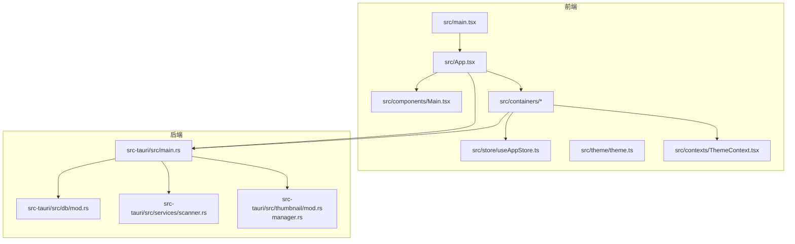
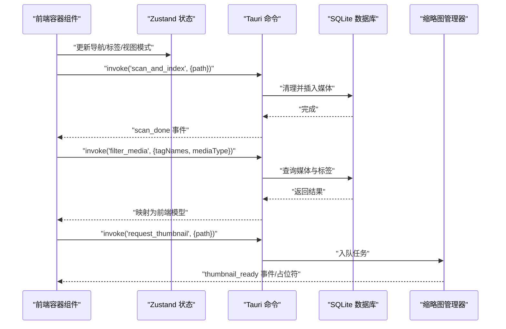
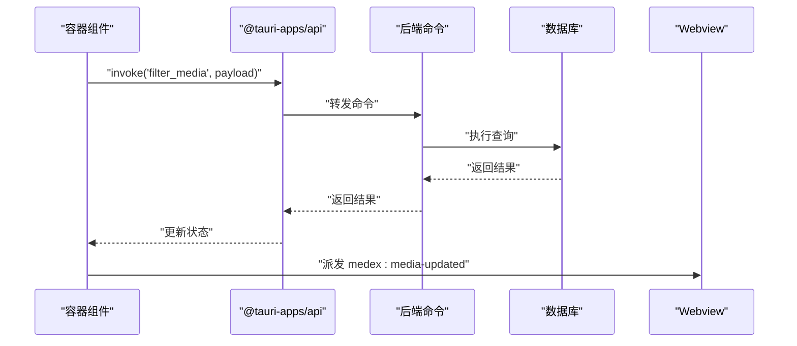
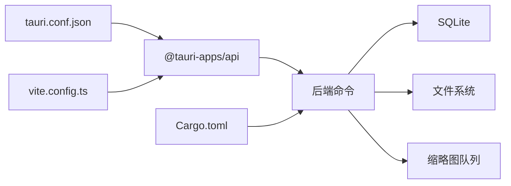

# 项目结构

<cite>
**本文引用的文件**
- [package.json](file://package.json)
- [Cargo.toml](file://src-tauri/Cargo.toml)
- [tauri.conf.json](file://src-tauri/tauri.conf.json)
- [vite.config.ts](file://vite.config.ts)
- [src/main.tsx](file://src/main.tsx)
- [src/App.tsx](file://src/App.tsx)
- [src/components/Main.tsx](file://src/components/Main.tsx)
- [src/containers/SidebarContainer.tsx](file://src/containers/SidebarContainer.tsx)
- [src/containers/MediaGridContainer.tsx](file://src/containers/MediaGridContainer.tsx)
- [src/contexts/ThemeContext.tsx](file://src/contexts/ThemeContext.tsx)
- [src/store/useAppStore.ts](file://src/store/useAppStore.ts)
- [src/theme/theme.ts](file://src/theme/theme.ts)
- [src-tauri/src/main.rs](file://src-tauri/src/main.rs)
- [src-tauri/src/db/mod.rs](file://src-tauri/src/db/mod.rs)
- [src-tauri/src/services/scanner.rs](file://src-tauri/src/services/scanner.rs)
- [src-tauri/src/thumbnail/mod.rs](file://src-tauri/src/thumbnail/mod.rs)
- [src-tauri/src/thumbnail/manager.rs](file://src-tauri/src/thumbnail/manager.rs)
- [src/pages/views/index.ts](file://src/pages/views/index.ts)
</cite>

## 目录
1. [简介](#简介)
2. [项目结构](#项目结构)
3. [核心组件](#核心组件)
4. [架构总览](#架构总览)
5. [详细组件分析](#详细组件分析)
6. [依赖分析](#依赖分析)
7. [性能考虑](#性能考虑)
8. [故障排查指南](#故障排查指南)
9. [结论](#结论)
10. [附录](#附录)

## 简介
本文件面向 Medex 项目，系统性说明前端与后端的目录组织、职责划分、关键配置文件的作用、模块间依赖关系与数据流向，并提供扩展与定制的指导原则，帮助开发者快速理解并定位相应代码位置。

## 项目结构
- 前端采用 React + Vite 架构，按功能域分层组织：
  - src/components/：可复用 UI 组件
  - src/containers/：连接 UI 与状态/业务逻辑的容器组件
  - src/pages/：页面级视图与路由入口
  - src/store/：全局状态管理（Zustand）
  - src/contexts/：上下文（如主题）
  - src/theme/：主题定义与生成
- 后端采用 Tauri + Rust 架构，核心位于 src-tauri/src/：
  - src-tauri/src/main.rs：应用入口与插件注册
  - src-tauri/src/db/：数据库初始化与访问
  - src-tauri/src/services/：业务命令（扫描、标签等）
  - src-tauri/src/thumbnail/：缩略图任务队列与工作线程
  - src-tauri/gen/ 与 src-tauri/capabilities/：Tauri 自动生成与权限声明
- 关键配置文件：
  - package.json：前端依赖与脚本
  - src-tauri/Cargo.toml：Rust 依赖与版本
  - src-tauri/tauri.conf.json：应用构建、打包、安全策略与插件配置
  - vite.config.ts：开发服务器端口与插件

图表来源
- [src/main.tsx:1-44](file://src/main.tsx#L1-L44)
- [src/App.tsx:1-73](file://src/App.tsx#L1-L73)
- [src/components/Main.tsx:1-25](file://src/components/Main.tsx#L1-L25)
- [src/containers/MediaGridContainer.tsx:1-619](file://src/containers/MediaGridContainer.tsx#L1-L619)
- [src/store/useAppStore.ts:1-395](file://src/store/useAppStore.ts#L1-L395)
- [src/contexts/ThemeContext.tsx:1-99](file://src/contexts/ThemeContext.tsx#L1-L99)
- [src/theme/theme.ts:1-159](file://src/theme/theme.ts#L1-L159)
- [src-tauri/src/main.rs:1-69](file://src-tauri/src/main.rs#L1-L69)
- [src-tauri/src/db/mod.rs:1-123](file://src-tauri/src/db/mod.rs#L1-L123)
- [src-tauri/src/services/scanner.rs:1-525](file://src-tauri/src/services/scanner.rs#L1-L525)
- [src-tauri/src/thumbnail/mod.rs:1-62](file://src-tauri/src/thumbnail/mod.rs#L1-L62)
- [src-tauri/src/thumbnail/manager.rs:1-108](file://src-tauri/src/thumbnail/manager.rs#L1-L108)

章节来源
- [package.json:1-36](file://package.json#L1-L36)
- [src-tauri/Cargo.toml:1-23](file://src-tauri/Cargo.toml#L1-L23)
- [src-tauri/tauri.conf.json:1-46](file://src-tauri/tauri.conf.json#L1-L46)
- [vite.config.ts:1-11](file://vite.config.ts#L1-L11)

## 核心组件
- 前端入口与路由
  - src/main.tsx：根据 URL 决定渲染 App、Settings 或 Update 页面，并包裹 ThemeProvider
- 应用根组件
  - src/App.tsx：聚合侧边栏、主内容区与媒体查看器；处理媒体打开、标记已阅与事件派发
- 主体布局
  - src/components/Main.tsx：承载工具栏与媒体网格容器
- 容器组件
  - src/containers/SidebarContainer.tsx：加载/创建/删除标签，联动全局状态与数据库
  - src/containers/MediaGridContainer.tsx：筛选媒体、批量操作、多选、上下文菜单、缩略图请求与队列调度
- 全局状态
  - src/store/useAppStore.ts：导航、标签、媒体项、视图模式、类型过滤、收藏/最近标记、本地变更合并
- 主题系统
  - src/theme/theme.ts：深/浅/系统主题定义与生成
  - src/contexts/ThemeContext.tsx：主题提供者、系统偏好检测、本地持久化与跨窗口同步
- 后端入口
  - src-tauri/src/main.rs：注册插件、初始化数据库与缩略图系统、暴露命令、监听菜单事件
- 数据库
  - src-tauri/src/db/mod.rs：SQLite 初始化、表与索引、连接池封装
- 服务命令
  - src-tauri/src/services/scanner.rs：扫描与索引、查询、收藏/最近标记、清理库数据
- 缩略图
  - src-tauri/src/thumbnail/mod.rs：管理器初始化与命令导出
  - src-tauri/src/thumbnail/manager.rs：队列、并发控制、FFmpeg 分辨与缓存

章节来源
- [src/main.tsx:1-44](file://src/main.tsx#L1-L44)
- [src/App.tsx:1-73](file://src/App.tsx#L1-L73)
- [src/components/Main.tsx:1-25](file://src/components/Main.tsx#L1-L25)
- [src/containers/SidebarContainer.tsx:1-79](file://src/containers/SidebarContainer.tsx#L1-L79)
- [src/containers/MediaGridContainer.tsx:1-619](file://src/containers/MediaGridContainer.tsx#L1-L619)
- [src/store/useAppStore.ts:1-395](file://src/store/useAppStore.ts#L1-L395)
- [src/theme/theme.ts:1-159](file://src/theme/theme.ts#L1-L159)
- [src/contexts/ThemeContext.tsx:1-99](file://src/contexts/ThemeContext.tsx#L1-L99)
- [src-tauri/src/main.rs:1-69](file://src-tauri/src/main.rs#L1-L69)
- [src-tauri/src/db/mod.rs:1-123](file://src-tauri/src/db/mod.rs#L1-L123)
- [src-tauri/src/services/scanner.rs:1-525](file://src-tauri/src/services/scanner.rs#L1-L525)
- [src-tauri/src/thumbnail/mod.rs:1-62](file://src-tauri/src/thumbnail/mod.rs#L1-L62)
- [src-tauri/src/thumbnail/manager.rs:1-108](file://src-tauri/src/thumbnail/manager.rs#L1-L108)

## 架构总览
- 前端通过 @tauri-apps/api 调用后端命令，实现扫描、查询、收藏、标签、缩略图等能力
- 后端以 SQLite 存储媒体、标签、最近观看记录；缩略图通过队列与工作线程异步生成
- 主题系统在前端统一管理，支持深/浅/系统模式与跨窗口同步

图表来源
- [src/containers/MediaGridContainer.tsx:210-243](file://src/containers/MediaGridContainer.tsx#L210-L243)
- [src-tauri/src/services/scanner.rs:250-341](file://src-tauri/src/services/scanner.rs#L250-L341)
- [src-tauri/src/db/mod.rs:45-64](file://src-tauri/src/db/mod.rs#L45-L64)
- [src-tauri/src/thumbnail/mod.rs:57-61](file://src-tauri/src/thumbnail/mod.rs#L57-L61)

## 详细组件分析

### 前端目录结构与职责
- src/components/
  - 可复用 UI 组件，如 Main、MediaGrid、MediaCard、Sidebar、Toolbar、Inspector、MediaViewer 等
- src/containers/
  - 连接 UI 与状态/命令的容器，如 SidebarContainer、MediaGridContainer、ToolbarContainer、InspectorContainer
- src/pages/
  - 页面级视图与入口，如 Settings、Update、UpdatePage 以及 views 下的多种状态视图
- src/store/
  - 全局状态，包括导航、标签、媒体项、视图模式、类型过滤、收藏/最近标记等
- src/contexts/
  - 主题上下文，提供主题切换、系统偏好检测、持久化与跨窗口同步
- src/theme/
  - 主题定义与浅色主题生成逻辑

章节来源
- [src/components/Main.tsx:1-25](file://src/components/Main.tsx#L1-L25)
- [src/containers/SidebarContainer.tsx:1-79](file://src/containers/SidebarContainer.tsx#L1-L79)
- [src/containers/MediaGridContainer.tsx:1-619](file://src/containers/MediaGridContainer.tsx#L1-L619)
- [src/store/useAppStore.ts:1-395](file://src/store/useAppStore.ts#L1-L395)
- [src/contexts/ThemeContext.tsx:1-99](file://src/contexts/ThemeContext.tsx#L1-L99)
- [src/theme/theme.ts:1-159](file://src/theme/theme.ts#L1-L159)
- [src/pages/views/index.ts:1-8](file://src/pages/views/index.ts#L1-L8)

### 后端目录结构与职责
- src-tauri/src/main.rs
  - 注册对话框与更新插件
  - 初始化数据库与缩略图系统
  - 暴露命令：扫描、查询、收藏、标签、缩略图请求等
  - 设置菜单与事件监听
- src-tauri/src/db/mod.rs
  - 初始化 SQLite 表与索引
  - 提供连接获取与迁移（如新增字段）
- src-tauri/src/services/scanner.rs
  - 扫描指定目录，批量插入媒体
  - 查询媒体（支持标签与类型过滤）
  - 收藏/最近标记、清理库数据
- src-tauri/src/thumbnail/mod.rs 与 manager.rs
  - 管理缩略图队列、并发与缓存
  - 请求视频缩略图并回传事件

章节来源
- [src-tauri/src/main.rs:1-69](file://src-tauri/src/main.rs#L1-L69)
- [src-tauri/src/db/mod.rs:1-123](file://src-tauri/src/db/mod.rs#L1-L123)
- [src-tauri/src/services/scanner.rs:1-525](file://src-tauri/src/services/scanner.rs#L1-L525)
- [src-tauri/src/thumbnail/mod.rs:1-62](file://src-tauri/src/thumbnail/mod.rs#L1-L62)
- [src-tauri/src/thumbnail/manager.rs:1-108](file://src-tauri/src/thumbnail/manager.rs#L1-L108)

### 关键配置文件
- package.json
  - 脚本：dev、build、preview、tauri
  - 依赖：@tauri-apps/api、React 生态、Zustand、react-dnd、Tailwind 工具链
- src-tauri/Cargo.toml
  - 应用元信息与 Rust 版本
  - 依赖：tauri、serde、rusqlite、walkdir、tauri 插件
- src-tauri/tauri.conf.json
  - 构建：devUrl、frontendDist、beforeDevCommand/beforeBuildCommand
  - 应用：窗口尺寸、可调整大小
  - 安全：资产协议作用域
  - 打包：目标平台、外部二进制（FFmpeg）、更新器
  - 插件：更新器端点与公钥
- vite.config.ts
  - 开发服务器端口与 React 插件

章节来源
- [package.json:1-36](file://package.json#L1-L36)
- [src-tauri/Cargo.toml:1-23](file://src-tauri/Cargo.toml#L1-L23)
- [src-tauri/tauri.conf.json:1-46](file://src-tauri/tauri.conf.json#L1-L46)
- [vite.config.ts:1-11](file://vite.config.ts#L1-L11)

### 数据流与交互序列
- 媒体库扫描与刷新
  - 用户选择目录 → 容器调用 scan_and_index → 后端清理并批量插入 → 发送 scan_done → 前端刷新
- 媒体筛选与缩略图
  - 容器监听标签/类型变化 → 调用 filter_media → 返回媒体列表 → 对视频媒体请求缩略图 → 队列处理 → 回传 thumbnail_ready
- 收藏与最近标记
  - 容器调用 set_media_favorite/mark_media_viewed → 后端更新数据库 → 前端触发全局事件刷新

图表来源
- [src/containers/MediaGridContainer.tsx:210-243](file://src/containers/MediaGridContainer.tsx#L210-L243)
- [src-tauri/src/services/scanner.rs:160-163](file://src-tauri/src/services/scanner.rs#L160-L163)

## 依赖分析
- 前端对后端的依赖
  - 通过 @tauri-apps/api 的 invoke 调用后端命令
  - 通过事件监听（scan_done、thumbnail_ready、medex:*）进行跨端通信
- 后端内部依赖
  - tauri 插件：dialog、updater
  - 数据库：rusqlite + 自定义初始化与迁移
  - 文件遍历：walkdir
  - 缩略图：once_cell、mpsc 队列、FFmpeg（外部二进制）
- 配置对运行的影响
  - tauri.conf.json 控制 devUrl、frontendDist、打包目标与更新器端点
  - vite.config.ts 控制开发服务器端口
  - Cargo.toml 控制 Rust 依赖与特性

图表来源
- [src-tauri/tauri.conf.json:1-46](file://src-tauri/tauri.conf.json#L1-L46)
- [vite.config.ts:1-11](file://vite.config.ts#L1-L11)
- [src-tauri/Cargo.toml:1-23](file://src-tauri/Cargo.toml#L1-L23)

章节来源
- [src-tauri/tauri.conf.json:1-46](file://src-tauri/tauri.conf.json#L1-L46)
- [vite.config.ts:1-11](file://vite.config.ts#L1-L11)
- [src-tauri/Cargo.toml:1-23](file://src-tauri/Cargo.toml#L1-L23)

## 性能考虑
- 前端
  - 使用 react-window 与虚拟化渲染减少 DOM 数量
  - 缩略图请求采用优先级队列与并发上限，避免阻塞
  - 状态合并（如 setMediaItemsFromDb）保留本地状态，减少重复渲染
- 后端
  - SQLite 事务批量插入，减少 IO 次数
  - 索引优化（媒体路径、标签关联、最近观看时间）
  - 缩略图队列容量与工作线程数量可调，平衡吞吐与资源占用

## 故障排查指南
- 缩略图无法生成
  - 检查 tauri.conf.json 中 externalBin 是否包含 FFmpeg
  - 确认 src-tauri/src/thumbnail/manager.rs 中 ffmpeg 解析与缓存目录
- 扫描无结果或卡住
  - 确认目录权限与路径正确
  - 查看 scan_and_index 的日志与事件派发
- 主题不生效或跨窗口不同步
  - 检查 ThemeContext 的本地存储键与 data-theme 属性更新
- 数据库异常
  - 检查 db 初始化 SQL 与迁移逻辑，确认表与索引存在

章节来源
- [src-tauri/tauri.conf.json:32-33](file://src-tauri/tauri.conf.json#L32-L33)
- [src-tauri/src/thumbnail/manager.rs:24-49](file://src-tauri/src/thumbnail/manager.rs#L24-L49)
- [src-tauri/src/services/scanner.rs:250-341](file://src-tauri/src/services/scanner.rs#L250-L341)
- [src/contexts/ThemeContext.tsx:34-54](file://src/contexts/ThemeContext.tsx#L34-L54)
- [src-tauri/src/db/mod.rs:45-64](file://src-tauri/src/db/mod.rs#L45-L64)

## 结论
Medex 采用清晰的前后端分层与职责划分：前端负责 UI 与状态，后端负责数据与系统能力；通过 Tauri 命令与事件实现稳定通信。配置文件集中控制构建、打包与安全策略。建议在扩展新功能时遵循现有分层与命名约定，优先在容器组件中编排逻辑，保持组件单一职责。

## 附录
- 快速定位
  - 扫描与索引：src-tauri/src/services/scanner.rs
  - 数据库初始化与访问：src-tauri/src/db/mod.rs
  - 缩略图管理：src-tauri/src/thumbnail/mod.rs、manager.rs
  - 前端入口与路由：src/main.tsx、src/App.tsx
  - 全局状态：src/store/useAppStore.ts
  - 主题系统：src/theme/theme.ts、src/contexts/ThemeContext.tsx
  - 页面视图：src/pages/views/index.ts
  - 构建与打包：package.json、src-tauri/Cargo.toml、src-tauri/tauri.conf.json、vite.config.ts