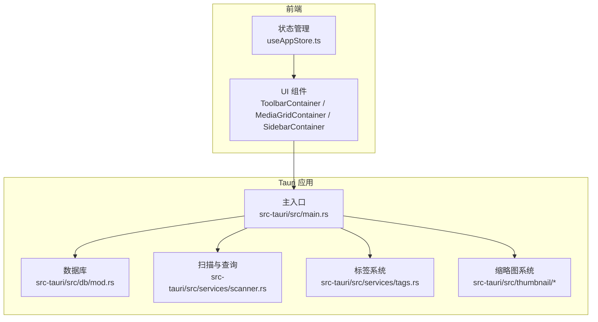
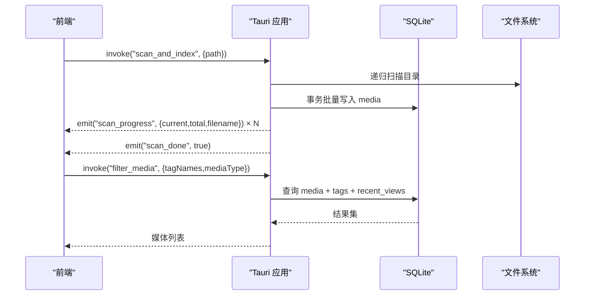
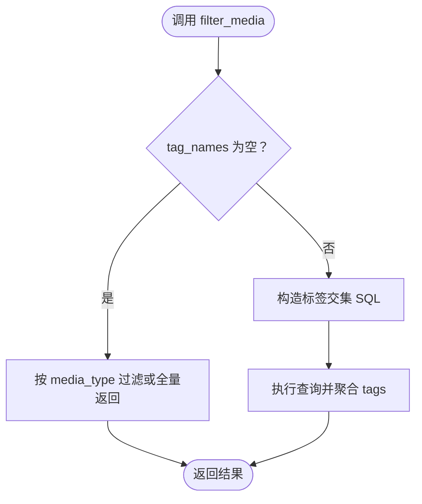
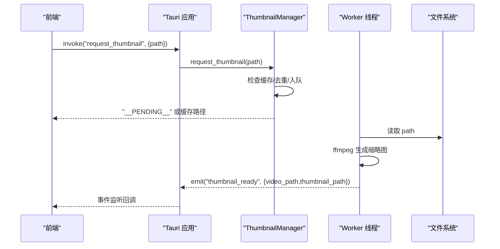
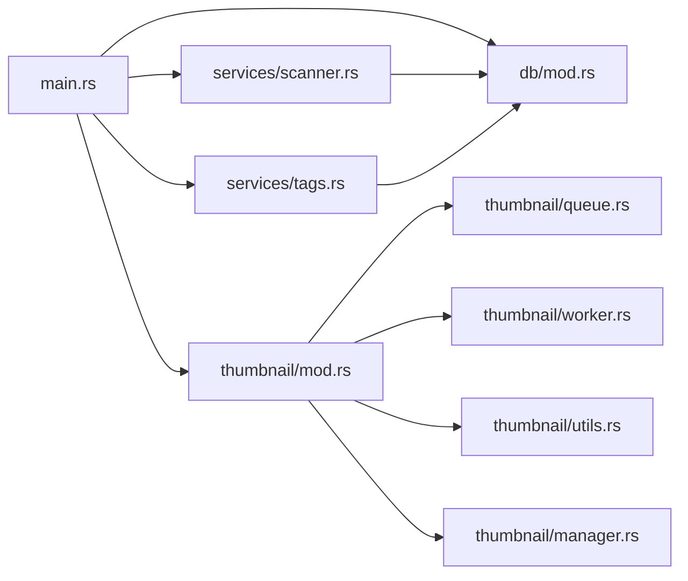

# API 接口文档

<cite>
**本文档引用的文件**
- [API_REFERENCE.md](file://doc/API_REFERENCE.md)
- [DEVELOPMENT.md](file://doc/DEVELOPMENT.md)
- [API 接口文档.md](file://doc/repowiki/zh/content/API 接口文档/API 接口文档.md)
- [Tauri 命令接口/Tauri 命令接口.md](file://doc/repowiki/zh/content/API 接口文档/Tauri 命令接口/Tauri 命令接口.md)
- [事件系统.md](file://doc/repowiki/zh/content/API 接口文档/事件系统.md)
- [并发与性能约定.md](file://doc/repowiki/zh/content/API 接口文档/并发与性能约定.md)
- [数据类型定义.md](file://doc/repowiki/zh/content/API 接口文档/数据类型定义.md)
- [错误处理约定.md](file://doc/repowiki/zh/content/API 接口文档/错误处理约定.md)
- [Tauri 命令接口/媒体相关命令.md](file://doc/repowiki/zh/content/API 接口文档/Tauri 命令接口/媒体相关命令.md)
- [src-tauri/src/main.rs](file://src-tauri/src/main.rs)
- [src-tauri/src/services/scanner.rs](file://src-tauri/src/services/scanner.rs)
- [src-tauri/src/services/tags.rs](file://src-tauri/src/services/tags.rs)
- [src-tauri/src/thumbnail/mod.rs](file://src-tauri/src/thumbnail/mod.rs)
- [src-tauri/src/thumbnail/manager.rs](file://src-tauri/src/thumbnail/manager.rs)
- [src-tauri/src/thumbnail/queue.rs](file://src-tauri/src/thumbnail/queue.rs)
- [src-tauri/src/thumbnail/worker.rs](file://src-tauri/src/thumbnail/worker.rs)
- [src-tauri/src/thumbnail/utils.rs](file://src-tauri/src/thumbnail/utils.rs)
- [src-tauri/src/db/mod.rs](file://src-tauri/src/db/mod.rs)
- [src/store/useAppStore.ts](file://src/store/useAppStore.ts)
- [src/containers/ToolbarContainer.tsx](file://src/containers/ToolbarContainer.tsx)
- [src/containers/MediaGridContainer.tsx](file://src/containers/MediaGridContainer.tsx)
- [src/containers/SidebarContainer.tsx](file://src/containers/SidebarContainer.tsx)
</cite>

## 更新摘要
**变更内容**
- 文档结构重构：API接口文档已移动到doc/API_REFERENCE.md和doc/repowiki/zh/content/API 接口文档目录
- 内容扩展：新增详细的命令接口、事件系统、并发性能约定、数据类型定义和错误处理约定
- 组织优化：采用模块化文档结构，便于维护和查找

## 目录
1. [简介](#简介)
2. [项目结构](#项目结构)
3. [核心组件](#核心组件)
4. [架构总览](#架构总览)
5. [详细组件分析](#详细组件分析)
6. [依赖分析](#依赖分析)
7. [性能考虑](#性能考虑)
8. [故障排除指南](#故障排除指南)
9. [结论](#结论)
10. [附录](#附录)

## 简介
本文档为 Medex 桌面应用的完整 API 接口文档，覆盖 Tauri 命令接口（Rust -> 前端）、事件系统（Rust emit -> 前端 listen）、IPC 通信协议、错误处理策略、调试与监控方法，以及未来演进方向与兼容性建议。文档严格依据仓库现有实现编写，确保与代码一致。

**更新** 文档已重构为模块化结构，包含完整的命令接口、事件系统、并发性能约定、数据类型定义和错误处理约定等专门文档。

## 项目结构
- 后端（Rust/Tauri）位于 src-tauri，包含数据库、扫描器、标签系统、缩略图系统与主入口。
- 前端（React/TS）位于 src，包含容器组件、状态管理与 UI 组件。
- 配置文件位于 tauri.conf.json 与 Cargo.toml，定义构建、安全策略与插件。

**图表来源**
- [src-tauri/src/main.rs:11-96](file://src-tauri/src/main.rs#L11-L96)
- [src-tauri/src/db/mod.rs:45-64](file://src-tauri/src/db/mod.rs#L45-L64)
- [src-tauri/src/services/scanner.rs:160-163](file://src-tauri/src/services/scanner.rs#L160-L163)
- [src-tauri/src/services/tags.rs:19-42](file://src-tauri/src/services/tags.rs#L19-L42)
- [src-tauri/src/thumbnail/mod.rs:32-49](file://src-tauri/src/thumbnail/mod.rs#L32-L49)

**章节来源**
- [src-tauri/src/main.rs:11-96](file://src-tauri/src/main.rs#L11-L96)
- [src-tauri/tauri.conf.json:1-46](file://src-tauri/tauri.conf.json#L1-L46)
- [src-tauri/Cargo.toml:1-24](file://src-tauri/Cargo.toml#L1-L24)

## 核心组件
- 命令注册与生命周期：在主入口集中注册所有命令，并初始化数据库与缩略图系统。
- 数据库：SQLite，包含 media、tags、media_tags、recent_views 表及索引。
- 扫描与查询：扫描目录、批量写入、按标签与类型筛选、收藏与最近查看。
- 标签系统：标签 CRUD、媒体打标签、按媒体查询标签。
- 缩略图系统：请求缩略图、队列与工作线程、缓存与事件通知。
- 前端容器：ToolbarContainer（扫描进度监听）、MediaGridContainer（缩略图调度与事件监听）、SidebarContainer（标签同步）。

**章节来源**
- [src-tauri/src/main.rs:78-94](file://src-tauri/src/main.rs#L78-L94)
- [src-tauri/src/db/mod.rs:12-43](file://src-tauri/src/db/mod.rs#L12-L43)
- [src-tauri/src/services/scanner.rs:160-163](file://src-tauri/src/services/scanner.rs#L160-L163)
- [src-tauri/src/services/tags.rs:19-42](file://src-tauri/src/services/tags.rs#L19-L42)
- [src-tauri/src/thumbnail/mod.rs:57-61](file://src-tauri/src/thumbnail/mod.rs#L57-L61)
- [src/containers/ToolbarContainer.tsx:54-87](file://src/containers/ToolbarContainer.tsx#L54-L87)
- [src/containers/MediaGridContainer.tsx:418-487](file://src/containers/MediaGridContainer.tsx#L418-L487)
- [src/containers/SidebarContainer.tsx:16-33](file://src/containers/SidebarContainer.tsx#L16-L33)

## 架构总览
Medex 采用 Tauri v2 的 IPC 模式：
- 前端通过 invoke 调用 Rust 命令，获得同步响应。
- 后端通过 emit 主动推送事件（扫描进度、缩略图完成）。
- 数据持久化在 SQLite，缩略图缓存于应用数据目录。

**图表来源**
- [src-tauri/src/main.rs:78-94](file://src-tauri/src/main.rs#L78-L94)
- [src-tauri/src/services/scanner.rs:321-413](file://src-tauri/src/services/scanner.rs#L321-L413)
- [src-tauri/src/services/scanner.rs:170-247](file://src-tauri/src/services/scanner.rs#L170-L247)
- [src-tauri/src/db/mod.rs:12-43](file://src-tauri/src/db/mod.rs#L12-L43)

## 详细组件分析

### 命令接口总览
- 命令注册位置：src-tauri/src/main.rs
- 命令清单：
  - 媒体扫描与查询：scan_and_index、get_all_media、filter_media_by_tags、filter_media、set_media_favorite、mark_media_viewed、clear_library_data
  - 标签管理：get_all_tags、get_all_tags_with_count、create_tag、delete_tag、add_tag_to_media、remove_tag_from_media、get_tags_by_media
  - 缩略图：request_thumbnail

**章节来源**
- [src-tauri/src/main.rs:78-94](file://src-tauri/src/main.rs#L78-L94)
- [API_REFERENCE.md:35-545](file://doc/API_REFERENCE.md#L35-L545)

#### 媒体扫描与查询
- scan_and_index
  - 参数：path: string（绝对路径）
  - 返回：void（成功），或错误字符串
  - 副作用：发出 scan_progress（逐文件）、发出 scan_done；清空并重建媒体库后批量写入；完成后刷新非设置窗口
  - 说明：内部调用 scan_and_index_internal 清理旧数据，再扫描写入
- get_all_media
  - 返回：MediaItem[]（按 id 降序）
- filter_media_by_tags
  - 兼容接口：内部转调 filter_media(tag_names, None)
- filter_media
  - 参数：tag_names: string[]，media_type: 'image' | 'video' | null
  - 行为：tag_names 为空则按类型过滤或返回全部；非空则按标签交集 + 类型过滤
- set_media_favorite
  - 参数：media_id: number，is_favorite: boolean
  - 行为：更新 media.is_favorite 与 updated_at
- mark_media_viewed
  - 参数：media_id: number
  - 行为：upsert recent_views，仅保留最近 100 条
- clear_library_data
  - 行为：清空 media、media_tags、recent_views 并重置自增；刷新非设置窗口

**图表来源**
- [src-tauri/src/services/scanner.rs:170-247](file://src-tauri/src/services/scanner.rs#L170-L247)

**章节来源**
- [src-tauri/src/services/scanner.rs:160-163](file://src-tauri/src/services/scanner.rs#L160-L163)
- [src-tauri/src/services/scanner.rs:165-168](file://src-tauri/src/services/scanner.rs#L165-L168)
- [src-tauri/src/services/scanner.rs:170-247](file://src-tauri/src/services/scanner.rs#L170-L247)
- [src-tauri/src/services/scanner.rs:415-426](file://src-tauri/src/services/scanner.rs#L415-L426)
- [src-tauri/src/services/scanner.rs:428-461](file://src-tauri/src/services/scanner.rs#L428-L461)
- [src-tauri/src/services/scanner.rs:547-596](file://src-tauri/src/services/scanner.rs#L547-L596)

#### 标签管理
- get_all_tags
  - 返回：Tag[]（按名称排序）
- get_all_tags_with_count
  - 返回：TagWithCount[]（含 mediaCount）
- create_tag
  - 参数：tag_name: string
  - 规则：trim 后空字符串报错；INSERT OR IGNORE，重复不报错
- delete_tag
  - 参数：tag_id: number
  - 规则：仅当该标签未被任何媒体引用时可删除，否则返回错误
- add_tag_to_media
  - 流程：INSERT OR IGNORE tags(name)；查 tag_id；INSERT OR IGNORE media_tags(media_id, tag_id)
- remove_tag_from_media
  - 流程：删除 media_tags 关联；若标签无人引用则删除 tags 对应记录
- get_tags_by_media
  - 返回：指定媒体的标签数组（id + name）

**章节来源**
- [src-tauri/src/services/tags.rs:19-42](file://src-tauri/src/services/tags.rs#L19-L42)
- [src-tauri/src/services/tags.rs:44-74](file://src-tauri/src/services/tags.rs#L44-L74)
- [src-tauri/src/services/tags.rs:76-93](file://src-tauri/src/services/tags.rs#L76-L93)
- [src-tauri/src/services/tags.rs:95-124](file://src-tauri/src/services/tags.rs#L95-L124)
- [src-tauri/src/services/tags.rs:126-164](file://src-tauri/src/services/tags.rs#L126-L164)
- [src-tauri/src/services/tags.rs:166-188](file://src-tauri/src/services/tags.rs#L166-L188)
- [src-tauri/src/services/tags.rs:190-219](file://src-tauri/src/services/tags.rs#L190-L219)

#### 缩略图系统
- request_thumbnail
  - 参数：path: string（视频绝对路径）
  - 返回：已缓存则返回实际缩略图路径；已入队处理中返回 "__PENDING__"；错误返回字符串
  - 前端建议：若返回 "__PENDING__"，等待 thumbnail_ready 事件；若返回真实路径，立即更新 UI
- 后端实现要点
  - 管理器初始化：创建缓存目录、解析 ffmpeg、启动 workers、创建队列
  - 去重：processing 集合防止同一路径重复入队
  - 队列：有界同步通道，满队列返回占位符
  - 生成：ffmpeg -ss 1 -i 输入 -frames:v 1 -vf scale=320:-1 输出
  - 事件：生成成功后 emit thumbnail_ready

**图表来源**
- [src-tauri/src/thumbnail/mod.rs:57-61](file://src-tauri/src/thumbnail/mod.rs#L57-L61)
- [src-tauri/src/thumbnail/manager.rs:51-106](file://src-tauri/src/thumbnail/manager.rs#L51-L106)
- [src-tauri/src/thumbnail/worker.rs:52-89](file://src-tauri/src/thumbnail/worker.rs#L52-L89)
- [src-tauri/src/thumbnail/utils.rs:36-61](file://src-tauri/src/thumbnail/utils.rs#L36-L61)

**章节来源**
- [src-tauri/src/thumbnail/mod.rs:57-61](file://src-tauri/src/thumbnail/mod.rs#L57-L61)
- [src-tauri/src/thumbnail/manager.rs:24-49](file://src-tauri/src/thumbnail/manager.rs#L24-L49)
- [src-tauri/src/thumbnail/queue.rs:8-11](file://src-tauri/src/thumbnail/queue.rs#L8-L11)
- [src-tauri/src/thumbnail/worker.rs:13-49](file://src-tauri/src/thumbnail/worker.rs#L13-L49)
- [src-tauri/src/thumbnail/utils.rs:71-96](file://src-tauri/src/thumbnail/utils.rs#L71-L96)

### 事件系统
- scan_progress
  - 结构：{ current: number, total: number, filename: string }
  - 触发：scan_and_index 每处理一个文件触发一次
- scan_done
  - 结构：boolean（当前实现固定为 true）
  - 触发：扫描任务提交完毕后触发一次
- thumbnail_ready
  - 结构：{ video_path: string, thumbnail_path: string }
  - 触发：worker 生成缩略图成功后

前端监听与使用示例：
- ToolbarContainer 监听 scan_done，完成后刷新媒体列表
- MediaGridContainer 监听 thumbnail_ready，更新缩略图缓存映射并继续出队

**章节来源**
- [API_REFERENCE.md:282-329](file://doc/API_REFERENCE.md#L282-L329)
- [src/containers/ToolbarContainer.tsx:58-87](file://src/containers/ToolbarContainer.tsx#L58-L87)
- [src/containers/MediaGridContainer.tsx:454-487](file://src/containers/MediaGridContainer.tsx#L454-L487)

### IPC 通信协议
- 调用方式
  - invoke('command_name', payload)：同步请求/响应
  - listen('event_name', handler)：事件监听
- 数据传输
  - 命令参数与返回值遵循 serde 序列化/反序列化
  - 事件负载为 JSON 对象
- 状态同步
  - 前端使用 useAppStore 管理状态，容器组件通过 invoke 与事件驱动状态更新
  - 个别跨容器同步使用 window.dispatchEvent（后续建议迁移到显式 store action）

**章节来源**
- [API_REFERENCE.md:19-32](file://doc/API_REFERENCE.md#L19-L32)
- [src/containers/ToolbarContainer.tsx:31-52](file://src/containers/ToolbarContainer.tsx#L31-L52)
- [src/containers/MediaGridContainer.tsx:366-387](file://src/containers/MediaGridContainer.tsx#L366-L387)
- [src/containers/SidebarContainer.tsx:16-33](file://src/containers/SidebarContainer.tsx#L16-L33)

### 错误处理策略
- Rust 命令统一 Result<_, String>，前端捕获错误并显示提示
- 建议后续统一错误码结构（ApiError：code/message/detail）
- 前端容器对关键命令（收藏、标签、扫描）进行 try/catch 并弹窗提示

**章节来源**
- [API_REFERENCE.md:450-467](file://doc/API_REFERENCE.md#L450-L467)
- [src/containers/MediaGridContainer.tsx:186-202](file://src/containers/MediaGridContainer.tsx#L186-L202)
- [src/containers/MediaGridContainer.tsx:146-176](file://src/containers/MediaGridContainer.tsx#L146-L176)
- [src/containers/ToolbarContainer.tsx:312-332](file://src/containers/ToolbarContainer.tsx#L312-L332)
- [src/containers/SidebarContainer.tsx:35-51](file://src/containers/SidebarContainer.tsx#L35-L51)

### 调试工具与监控
- ffmpeg 二进制定位：优先资源内嵌，其次开发目录，再次系统 PATH，最后 macOS Homebrew 常见路径
- 前端缩略图并发与队列：MAX_CONCURRENT=5，MAX_QUEUE_SIZE=400，按优先级调度
- 后端缩略图并发与队列：worker 数量=4，队列容量=2048，processing 去重
- 常见问题排查：
  - dialog.open not allowed：检查 capabilities/default.json
  - 本地文件无法预览：使用 convertFileSrc
  - 缩略图一直失败：确认 ffmpeg 可用
  - 页面卡顿：检查是否误挂载大量 video 元素、是否启用虚拟化、并发是否过高

**章节来源**
- [DEVELOPMENT.md:470-500](file://doc/DEVELOPMENT.md#L470-L500)
- [src-tauri/src/thumbnail/utils.rs:71-96](file://src-tauri/src/thumbnail/utils.rs#L71-L96)
- [src-tauri/src/thumbnail/manager.rs:24-49](file://src-tauri/src/thumbnail/manager.rs#L24-L49)
- [src-tauri/src/thumbnail/worker.rs:13-49](file://src-tauri/src/thumbnail/worker.rs#L13-L49)
- [src/containers/MediaGridContainer.tsx:28-29](file://src/containers/MediaGridContainer.tsx#L28-L29)
- [DEVELOPMENT.md:564-595](file://doc/DEVELOPMENT.md#L564-L595)

## 依赖分析
- 外部依赖
  - Tauri v2、rusqlite、walkdir、once_cell、anyhow、tauri-plugin-* 等
- 内部模块耦合
  - main.rs 依赖 db、services、thumbnail、menu
  - services 依赖 db
  - thumbnail 依赖 queue、utils、worker、manager
- 插件与配置
  - updater、store、dialog 插件启用
  - 资源协议开启，允许本地文件预览

**图表来源**
- [src-tauri/src/main.rs:3-6](file://src-tauri/src/main.rs#L3-L6)
- [src-tauri/src/thumbnail/mod.rs:1-4](file://src-tauri/src/thumbnail/mod.rs#L1-L4)
- [src-tauri/src/services/scanner.rs:1-8](file://src-tauri/src/services/scanner.rs#L1-L8)
- [src-tauri/src/services/tags.rs:1-3](file://src-tauri/src/services/tags.rs#L1-L3)
- [src-tauri/src/db/mod.rs:1-6](file://src-tauri/src/db/mod.rs#L1-L6)

**章节来源**
- [src-tauri/Cargo.toml:13-23](file://src-tauri/Cargo.toml#L13-L23)
- [src-tauri/src/main.rs:11-24](file://src-tauri/src/main.rs#L11-L24)
- [src-tauri/tauri.conf.json:35-44](file://src-tauri/tauri.conf.json#L35-L44)

## 性能考虑
- 前端
  - 虚拟化渲染：react-window，仅渲染可见 + overscan
  - 缩略图调度：并发上限 5，队列上限 400，优先级（可见 > 下一屏 > overscan）
- 后端
  - 扫描：事务批量写入，INSERT OR IGNORE 防重复
  - 缩略图：worker 固定并发 4，队列容量 2048，processing 去重
  - 数据库：为 media/path、media_tags、recent_views 建立索引

**章节来源**
- [DEVELOPMENT.md:306-342](file://doc/DEVELOPMENT.md#L306-L342)
- [src-tauri/src/services/scanner.rs:90-115](file://src-tauri/src/services/scanner.rs#L90-L115)
- [src-tauri/src/db/mod.rs:39-42](file://src-tauri/src/db/mod.rs#L39-L42)
- [src-tauri/src/thumbnail/manager.rs:24-49](file://src-tauri/src/thumbnail/manager.rs#L24-L49)

## 故障排除指南
- dialog.open not allowed
  - 检查 capabilities/default.json 是否包含 dialog:allow-open 与 dialog:default
- 本地文件无法预览（unsupported URL）
  - 确保前端使用 convertFileSrc(path)，而非直接拼接绝对路径
- 缩略图一直失败
  - 检查系统是否存在 ffmpeg；若无，安装或放置内置二进制
- 页面卡顿/白屏
  - 排查是否在网格内挂载过多 video；确认启用虚拟化；检查并发是否过高

**章节来源**
- [DEVELOPMENT.md:564-595](file://doc/DEVELOPMENT.md#L564-L595)

## 结论
本文档系统梳理了 Medex 的 Tauri 命令、事件与 IPC 通信，结合前端容器的实际使用，提供了参数、返回值、行为与错误处理的权威说明。同时给出性能与调试建议，为后续扩展（如分页、批量标签、统一错误码、版本化 API）提供参考。

## 附录

### 数据模型与类型
- MediaItem（Rust）
  - 字段：id、path、filename、type、is_favorite、is_recent、recent_viewed_at、tags
- Tag（Rust）
  - 字段：id、name
- TagWithCount（Rust）
  - 字段：id、name、media_count
- 前端类型
  - MediaItem、DbMediaItem、DbTagItem（详见 useAppStore.ts）

**章节来源**
- [API_REFERENCE.md:485-521](file://doc/API_REFERENCE.md#L485-L521)
- [src/store/useAppStore.ts:16-46](file://src/store/useAppStore.ts#L16-L46)

### 命令与事件索引
- 命令注册：src-tauri/src/main.rs
- 扫描/筛选：src-tauri/src/services/scanner.rs
- 标签：src-tauri/src/services/tags.rs
- 缩略图：src-tauri/src/thumbnail/*
- 前端调用入口：
  - src/containers/ToolbarContainer.tsx
  - src/containers/MediaGridContainer.tsx
  - src/containers/SidebarContainer.tsx
  - src/components/MediaCard.tsx

**章节来源**
- [API_REFERENCE.md:533-544](file://doc/API_REFERENCE.md#L533-L544)

### 文档结构说明
**更新** Medex 已采用模块化文档结构：

- **核心参考文档**：doc/API_REFERENCE.md - 完整的 API 接口参考
- **详细开发文档**：doc/DEVELOPMENT.md - 项目开发指南
- **专题文档**：
  - doc/repowiki/zh/content/API 接口文档/Tauri 命令接口/Tauri 命令接口.md
  - doc/repowiki/zh/content/API 接口文档/事件系统.md
  - doc/repowiki/zh/content/API 接口文档/并发与性能约定.md
  - doc/repowiki/zh/content/API 接口文档/数据类型定义.md
  - doc/repowiki/zh/content/API 接口文档/错误处理约定.md
  - doc/repowiki/zh/content/API 接口文档/Tauri 命令接口/媒体相关命令.md

这种结构化文档组织方式便于开发者根据具体需求查找相应内容，提高了文档的可维护性和可读性。