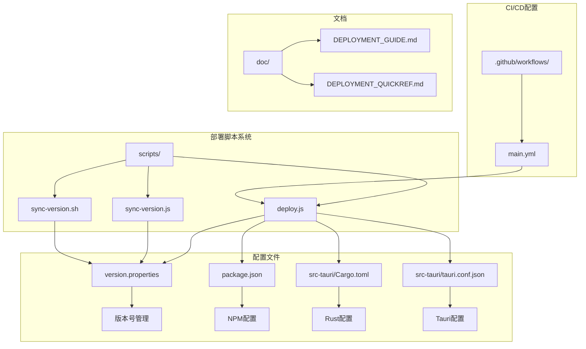
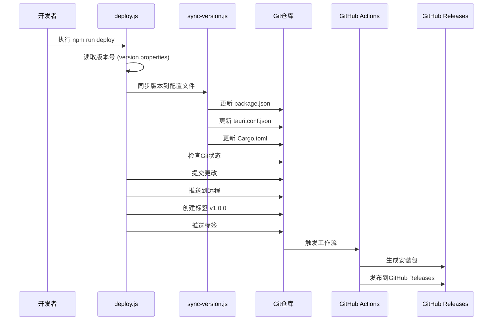
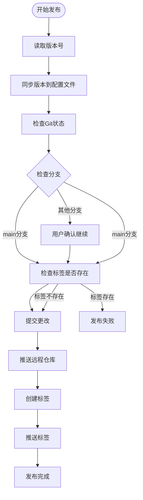
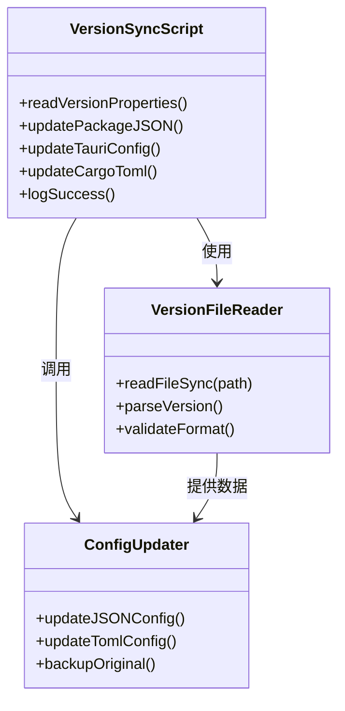
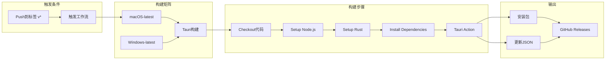
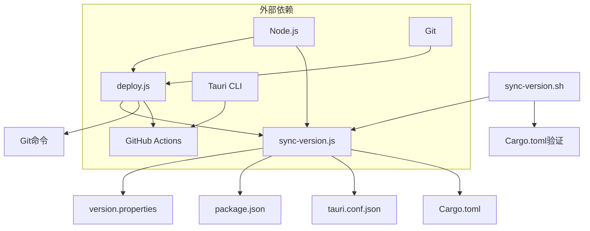
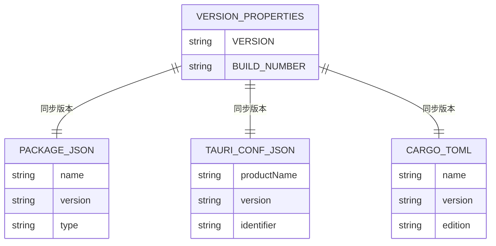

# Deployment Script

<cite>
**本文档引用的文件**
- [scripts/deploy.js](file://scripts/deploy.js)
- [scripts/sync-version.js](file://scripts/sync-version.js)
- [scripts/sync-version.sh](file://scripts/sync-version.sh)
- [package.json](file://package.json)
- [version.properties](file://version.properties)
- [src-tauri/Cargo.toml](file://src-tauri/Cargo.toml)
- [src-tauri/tauri.conf.json](file://src-tauri/tauri.conf.json)
- [.github/workflows/main.yml](file://.github/workflows/main.yml)
- [doc/DEPLOYMENT_GUIDE.md](file://doc/DEPLOYMENT_GUIDE.md)
- [doc/DEPLOYMENT_QUICKREF.md](file://doc/DEPLOYMENT_QUICKREF.md)
- [src-tauri/build.rs](file://src-tauri/build.rs)
</cite>

## 目录
1. [简介](#简介)
2. [项目结构](#项目结构)
3. [核心组件](#核心组件)
4. [架构概览](#架构概览)
5. [详细组件分析](#详细组件分析)
6. [依赖关系分析](#依赖关系分析)
7. [性能考虑](#性能考虑)
8. [故障排除指南](#故障排除指南)
9. [结论](#结论)

## 简介

Medex项目的部署脚本系统是一个自动化发布解决方案，旨在简化跨平台桌面应用的发布流程。该系统通过三个核心脚本实现了完整的版本管理、Git操作和CI/CD集成，确保应用程序能够稳定、可靠地发布到GitHub Releases。

该部署系统基于Tauri V2框架，支持Windows和macOS平台的应用程序构建和分发。系统采用语义化版本控制，通过单一版本源（version.properties）确保所有配置文件的一致性。

## 项目结构

Medex项目的部署相关文件组织结构清晰，采用了模块化的设计理念：

**图表来源**
- [scripts/deploy.js:1-185](file://scripts/deploy.js#L1-L185)
- [scripts/sync-version.js:1-70](file://scripts/sync-version.js#L1-L70)
- [scripts/sync-version.sh:1-33](file://scripts/sync-version.sh#L1-L33)

**章节来源**
- [scripts/deploy.js:1-185](file://scripts/deploy.js#L1-L185)
- [scripts/sync-version.js:1-70](file://scripts/sync-version.js#L1-L70)
- [scripts/sync-version.sh:1-33](file://scripts/sync-version.sh#L1-L33)

## 核心组件

### 自动发布脚本 (deploy.js)

自动发布脚本是整个部署系统的核心，实现了完整的发布流程自动化。该脚本采用模块化设计，每个步骤都有明确的功能和错误处理机制。

主要功能包括：
- 版本号读取和验证
- 多配置文件版本同步
- Git状态检查和分支验证
- 自动提交和推送
- 标签创建和推送
- GitHub Actions触发

### 版本同步脚本 (sync-version.js)

版本同步脚本负责将单一版本源同步到所有相关的配置文件中。该脚本确保了版本信息在整个项目中的一致性。

支持的配置文件同步：
- package.json (前端版本)
- src-tauri/tauri.conf.json (Tauri应用版本)
- src-tauri/Cargo.toml (Rust包版本)

### Shell版本同步脚本 (sync-version.sh)

Shell版本同步脚本提供了额外的验证功能，特别是针对Cargo.toml的环境变量配置检查。

**章节来源**
- [scripts/deploy.js:45-178](file://scripts/deploy.js#L45-L178)
- [scripts/sync-version.js:15-62](file://scripts/sync-version.js#L15-L62)
- [scripts/sync-version.sh:17-23](file://scripts/sync-version.sh#L17-L23)

## 架构概览

Medex的部署架构采用了分层设计，确保了系统的可维护性和扩展性：

**图表来源**
- [scripts/deploy.js:45-178](file://scripts/deploy.js#L45-L178)
- [.github/workflows/main.yml:12-42](file://.github/workflows/main.yml#L12-L42)

该架构的关键特点：
- **单点版本控制**：通过version.properties统一管理版本号
- **自动化流程**：减少人工干预，降低出错概率
- **CI/CD集成**：无缝连接本地发布和云端构建
- **错误处理**：每一步都有完善的错误检测和处理机制

## 详细组件分析

### 自动发布流程分析

#### 步骤1：版本号读取
脚本从version.properties文件中读取版本号，采用正则表达式匹配确保格式正确性。

#### 步骤2：版本同步
通过npm run sync-version命令调用同步脚本，将版本号更新到所有配置文件中。

#### 步骤3-4：Git状态检查
检查工作目录状态和当前分支，确保发布环境的正确性。

#### 步骤5：Tag验证
验证目标版本号的标签是否已存在，避免重复发布。

#### 步骤6-9：提交和推送
执行完整的Git操作流程，包括提交、推送和标签创建。

**图表来源**
- [scripts/deploy.js:45-178](file://scripts/deploy.js#L45-L178)

**章节来源**
- [scripts/deploy.js:45-178](file://scripts/deploy.js#L45-L178)

### 版本同步机制

#### JavaScript版本同步脚本
版本同步脚本采用模块化设计，每个配置文件都有独立的处理逻辑：

**图表来源**
- [scripts/sync-version.js:15-62](file://scripts/sync-version.js#L15-L62)

#### Shell脚本增强功能
Shell脚本提供了额外的安全检查功能，特别是针对Cargo.toml的环境变量配置验证。

**章节来源**
- [scripts/sync-version.js:15-62](file://scripts/sync-version.js#L15-L62)
- [scripts/sync-version.sh:17-23](file://scripts/sync-version.sh#L17-L23)

### CI/CD集成

#### GitHub Actions工作流
GitHub Actions工作流配置简洁高效，支持多平台构建：

**图表来源**
- [.github/workflows/main.yml:12-42](file://.github/workflows/main.yml#L12-L42)

**章节来源**
- [.github/workflows/main.yml:12-42](file://.github/workflows/main.yml#L12-L42)

## 依赖关系分析

### 脚本间依赖关系

**图表来源**
- [scripts/deploy.js:63](file://scripts/deploy.js#L63)
- [scripts/sync-version.js:30](file://scripts/sync-version.js#L30)
- [scripts/sync-version.sh:15](file://scripts/sync-version.sh#L15)

### 配置文件依赖关系

**图表来源**
- [version.properties:5](file://version.properties#L5)
- [package.json:4](file://package.json#L4)
- [src-tauri/tauri.conf.json:4](file://src-tauri/tauri.conf.json#L4)
- [src-tauri/Cargo.toml:3](file://src-tauri/Cargo.toml#L3)

**章节来源**
- [version.properties:5](file://version.properties#L5)
- [package.json:4](file://package.json#L4)
- [src-tauri/tauri.conf.json:4](file://src-tauri/tauri.conf.json#L4)
- [src-tauri/Cargo.toml:3](file://src-tauri/Cargo.toml#L3)

## 性能考虑

### 脚本执行性能

部署脚本系统在设计时充分考虑了性能优化：

1. **异步操作**：使用Promise和async/await模式处理异步操作
2. **错误早返回**：每个步骤都有明确的错误检查和快速失败机制
3. **最小化IO操作**：只在必要时进行文件读写操作
4. **缓存机制**：版本号读取后在内存中缓存，避免重复解析

### Git操作优化

1. **批量提交**：一次性添加多个文件到暂存区
2. **管道输出**：使用管道减少中间缓冲
3. **超时控制**：为长时间运行的操作设置合理的超时时间

## 故障排除指南

### 常见问题及解决方案

#### 1. 版本号读取失败
**问题症状**：脚本显示"未在version.properties中找到VERSION"
**解决方案**：
- 检查version.properties文件格式是否正确
- 确认VERSION属性值不为空
- 验证文件编码格式

#### 2. Git推送失败
**问题症状**：推送阶段报错，提示权限或网络问题
**解决方案**：
- 检查Git远程仓库配置：`git remote -v`
- 验证SSH密钥或访问令牌配置
- 确认网络连接正常

#### 3. 标签已存在
**问题症状**：标签创建阶段失败，提示Tag已存在
**解决方案**：
- 使用新的版本号重新发布
- 或删除现有标签后重试

#### 4. 分支检查失败
**问题症状**：脚本警告不在main分支上
**解决方案**：
- 切换到main分支：`git checkout main`
- 或在脚本提示时确认继续发布

### 调试技巧

1. **启用详细日志**：在本地环境中手动执行各步骤，观察详细输出
2. **检查Git状态**：使用`git status`和`git log`查看当前状态
3. **验证配置文件**：确认所有配置文件的版本号一致
4. **测试网络连接**：确保能够访问GitHub远程仓库

**章节来源**
- [doc/DEPLOYMENT_GUIDE.md:135-176](file://doc/DEPLOYMENT_GUIDE.md#L135-L176)
- [doc/DEPLOYMENT_QUICKREF.md:81-89](file://doc/DEPLOYMENT_QUICKREF.md#L81-L89)

## 结论

Medex项目的部署脚本系统展现了现代软件发布流程的最佳实践。通过精心设计的自动化脚本、严格的版本管理和完善的CI/CD集成，该系统为桌面应用的发布提供了可靠、高效的解决方案。

### 主要优势

1. **高度自动化**：从版本号修改到最终发布，几乎完全无需人工干预
2. **版本一致性**：通过单一版本源确保所有配置文件的版本同步
3. **错误处理完善**：每个步骤都有详细的错误检测和用户友好的提示
4. **跨平台支持**：支持Windows和macOS平台的自动化构建
5. **易于维护**：模块化的脚本设计便于理解和维护

### 改进建议

1. **增加测试覆盖**：为关键脚本添加单元测试和集成测试
2. **增强日志记录**：提供更详细的执行日志，便于问题诊断
3. **配置参数化**：允许通过命令行参数自定义发布行为
4. **回滚机制**：实现发布失败时的自动回滚功能

该部署系统为Medex项目提供了一个坚实的基础，确保了应用程序能够稳定、可靠地交付给用户。通过持续的改进和优化，该系统将继续支持项目的长期发展需求。