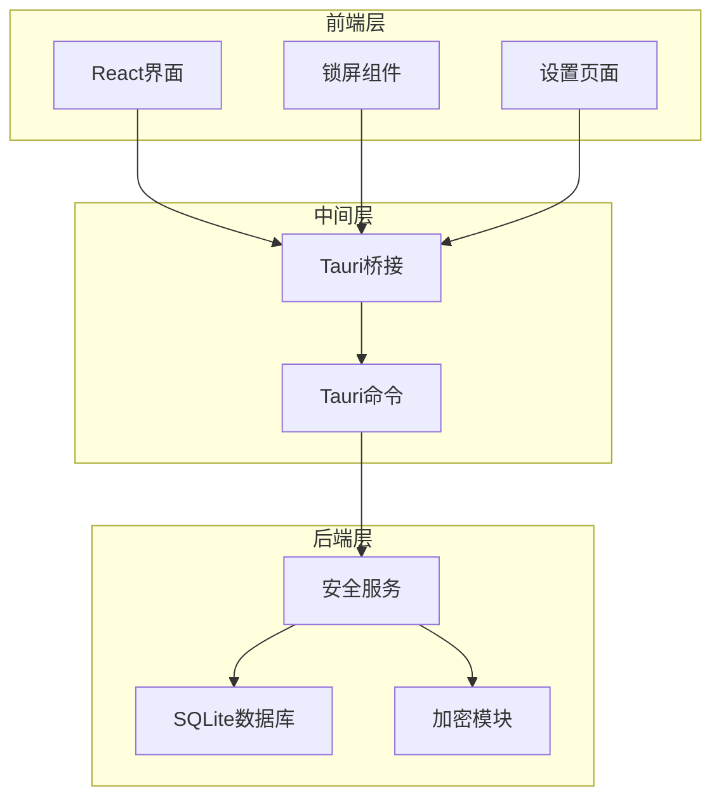
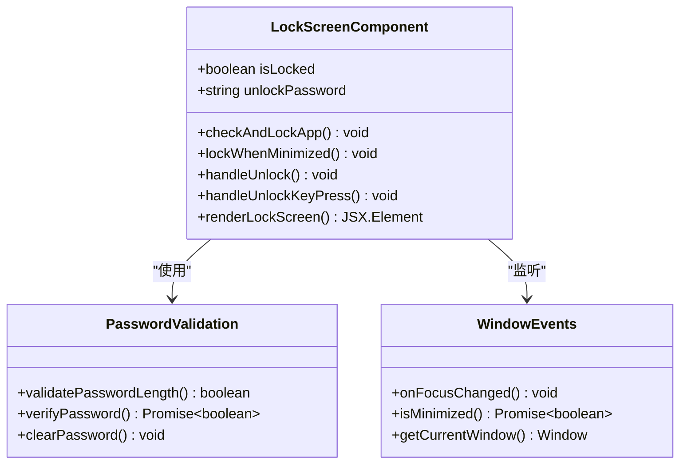
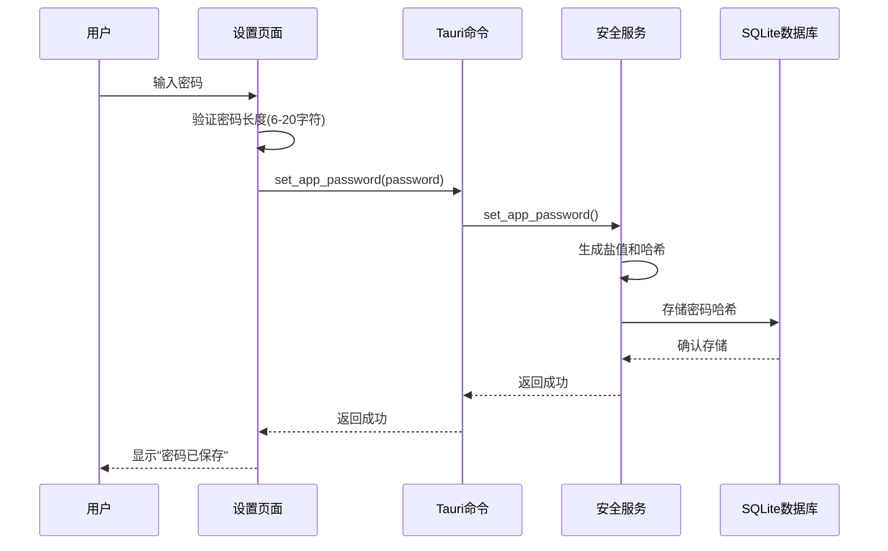
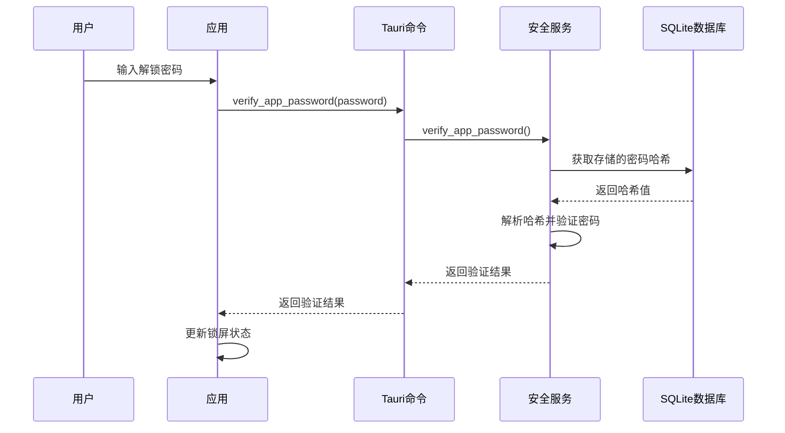

# 锁屏功能文档

<cite>
**本文档引用的文件**
- [src/App.tsx](file://src/App.tsx)
- [src/pages/Settings.tsx](file://src/pages/Settings.tsx)
- [src-tauri/src/services/security.rs](file://src-tauri/src/services/security.rs)
- [src-tauri/src/db/mod.rs](file://src-tauri/src/db/mod.rs)
- [src-tauri/src/main.rs](file://src-tauri/src/main.rs)
- [src/i18n/zh-CN.json](file://src/i18n/zh-CN.json)
- [src/i18n/en-US.json](file://src/i18n/en-US.json)
- [src-tauri/tauri.conf.json](file://src-tauri/tauri.conf.json)
</cite>

## 目录
1. [简介](#简介)
2. [功能概述](#功能概述)
3. [系统架构](#系统架构)
4. [核心组件分析](#核心组件分析)
5. [安全机制](#安全机制)
6. [用户界面设计](#用户界面设计)
7. [配置与设置](#配置与设置)
8. [国际化支持](#国际化支持)
9. [故障排除](#故障排除)
10. [总结](#总结)

## 简介

Medex 应用的锁屏功能是一个重要的安全特性，为用户提供了一种保护其媒体库内容的方式。该功能通过密码验证机制，在应用最小化或启动时阻止未授权访问，确保用户的隐私和数据安全。

## 功能概述

锁屏功能提供了以下核心能力：

- **密码保护**：用户可以设置应用密码来保护整个应用
- **自动锁屏**：当应用最小化到系统托盘或Dock时自动锁定
- **手动解锁**：用户可以通过输入正确密码来解锁应用
- **跨平台支持**：支持Windows、macOS和Linux操作系统
- **国际化支持**：提供中英文界面支持

## 系统架构

锁屏功能采用前后端分离的架构设计，结合了前端React界面和后端Tauri/Rust服务层。



**图表来源**
- [src/App.tsx:15-428](file://src/App.tsx#L15-L428)
- [src-tauri/src/main.rs:20-102](file://src-tauri/src/main.rs#L20-L102)
- [src-tauri/src/services/security.rs:1-45](file://src-tauri/src/services/security.rs#L1-L45)

## 核心组件分析

### 锁屏组件 (LockScreen Component)

锁屏组件是整个功能的核心，负责处理用户交互和状态管理。



**图表来源**
- [src/App.tsx:25-120](file://src/App.tsx#L25-L120)

### 设置页面 (Settings Page)

设置页面允许用户配置锁屏功能的各种选项。



**图表来源**
- [src/pages/Settings.tsx:111-126](file://src/pages/Settings.tsx#L111-L126)
- [src-tauri/src/services/security.rs:8-19](file://src-tauri/src/services/security.rs#L8-L19)

**章节来源**
- [src/App.tsx:71-120](file://src/App.tsx#L71-L120)
- [src/pages/Settings.tsx:111-139](file://src/pages/Settings.tsx#L111-L139)

## 安全机制

### 密码加密存储

系统使用Argon2算法对密码进行加密存储，确保即使数据库被访问，密码也不会被轻易破解。

```mermaid
flowchart TD
Start([用户输入密码]) --> Validate[验证密码长度(6-20字符)]
Validate --> LengthOK{长度有效?}
LengthOK --> |否| Error[返回错误: 密码长度无效]
LengthOK --> |是| GenerateSalt[生成随机盐值]
GenerateSalt --> HashPassword[使用Argon2哈希密码]
HashPassword --> StoreInDB[存储到SQLite数据库]
StoreInDB --> Success[返回成功]
Error --> End([结束])
Success --> End
```

**图表来源**
- [src-tauri/src/services/security.rs:8-19](file://src-tauri/src/services/security.rs#L8-L19)
- [src-tauri/src/db/mod.rs:114-136](file://src-tauri/src/db/mod.rs#L114-L136)

### 解锁验证流程

解锁过程采用安全的密码验证机制：



**图表来源**
- [src/App.tsx:97-114](file://src/App.tsx#L97-L114)
- [src-tauri/src/services/security.rs:22-33](file://src-tauri/src/services/security.rs#L22-L33)

**章节来源**
- [src-tauri/src/services/security.rs:1-45](file://src-tauri/src/services/security.rs#L1-L45)
- [src-tauri/src/db/mod.rs:114-143](file://src-tauri/src/db/mod.rs#L114-L143)

## 用户界面设计

### 锁屏界面布局

锁屏界面采用简洁直观的设计，确保用户能够快速理解和使用：

```mermaid
graph LR
subgraph "锁屏界面"
Overlay[半透明背景遮罩]
Container[圆形容器]
Title[标题: "请输入应用密码"]
Input[密码输入框]
Button[解锁按钮]
end
Overlay --> Container
Container --> Title
Container --> Input
Container --> Button
style Overlay fill-opacity:0.5
style Container background-color: theme.background
style Input border: theme.inputBorder
style Button background-color: theme.buttonBg
```

**图表来源**
- [src/App.tsx:367-425](file://src/App.tsx#L367-L425)

### 主题适配

锁屏界面完全适配当前应用主题，包括深色和浅色模式：

- **深色模式**：半透明黑色遮罩 (rgba(0, 0, 0, 0.5))
- **浅色模式**：半透明白色遮罩 (rgba(255, 255, 255, 0.5))
- **模糊效果**：使用backdrop-filter实现毛玻璃效果

**章节来源**
- [src/App.tsx:367-425](file://src/App.tsx#L367-L425)

## 配置与设置

### 锁屏触发条件

锁屏功能会在以下情况下自动触发：

1. **应用最小化**：当应用窗口最小化到系统托盘或Dock时
2. **应用启动**：应用首次启动时检查是否有设置密码
3. **窗口失去焦点**：当应用窗口失去焦点时

### 设置页面功能

设置页面提供了完整的锁屏配置选项：

- **设置密码**：输入6-20位密码并保存
- **清除密码**：删除现有的应用密码
- **密码状态显示**：显示当前密码设置状态

**章节来源**
- [src/App.tsx:82-95](file://src/App.tsx#L82-L95)
- [src/pages/Settings.tsx:44-65](file://src/pages/Settings.tsx#L44-L65)

## 国际化支持

锁屏功能支持中英文两种语言界面：

### 中文界面文本
- 标题："请输入应用密码"
- 占位符："应用密码"
- 按钮："解锁"
- 错误提示："密码错误，请重试"

### 英文界面文本
- 标题："Enter app password"
- 占位符："App password"
- 按钮："Unlock"
- 错误提示："Wrong password, please try again"

**章节来源**
- [src/i18n/zh-CN.json:27-30](file://src/i18n/zh-CN.json#L27-L30)
- [src/i18n/en-US.json:27-30](file://src/i18n/en-US.json#L27-L30)

## 故障排除

### 常见问题及解决方案

1. **密码无法保存**
   - 检查密码长度是否在6-20字符之间
   - 确认应用数据库连接正常
   - 重启应用后重试

2. **解锁失败**
   - 确认输入的密码正确
   - 检查键盘布局和大小写锁定
   - 清除浏览器缓存后重试

3. **锁屏不生效**
   - 检查应用权限设置
   - 确认窗口事件监听正常
   - 重启应用后检查

### 调试信息

系统提供了详细的日志输出，便于问题诊断：

- 锁屏检查失败：`[app] failed to check app password exists`
- 最小化状态检查失败：`[app] failed to check minimized state`
- 密码验证失败：`[app] verify_app_password failed:`

**章节来源**
- [src/App.tsx:77-94](file://src/App.tsx#L77-L94)
- [src/App.tsx:109-113](file://src/App.tsx#L109-L113)

## 总结

Medex 应用的锁屏功能通过以下特点实现了有效的安全保护：

1. **强加密存储**：使用Argon2算法确保密码安全
2. **智能触发**：基于窗口状态的自动锁屏机制
3. **用户友好**：简洁直观的界面设计和多语言支持
4. **可靠实现**：基于Tauri框架的稳定后端服务
5. **灵活配置**：支持密码设置、清除和状态查询

该功能为用户提供了可靠的隐私保护，确保媒体库内容不会被未授权访问，同时保持了良好的用户体验。