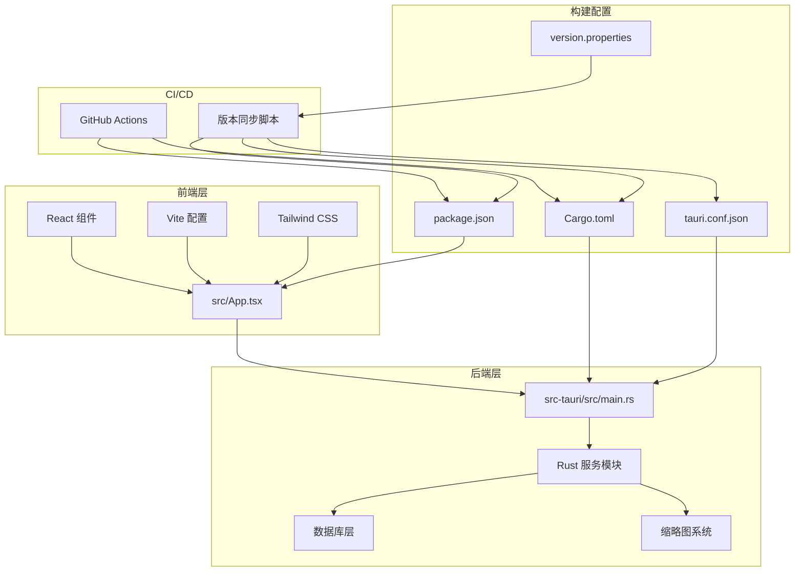
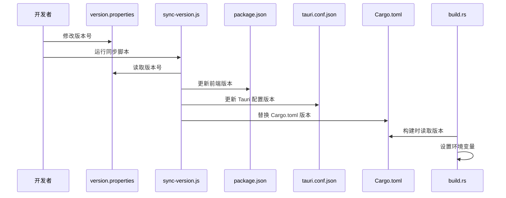
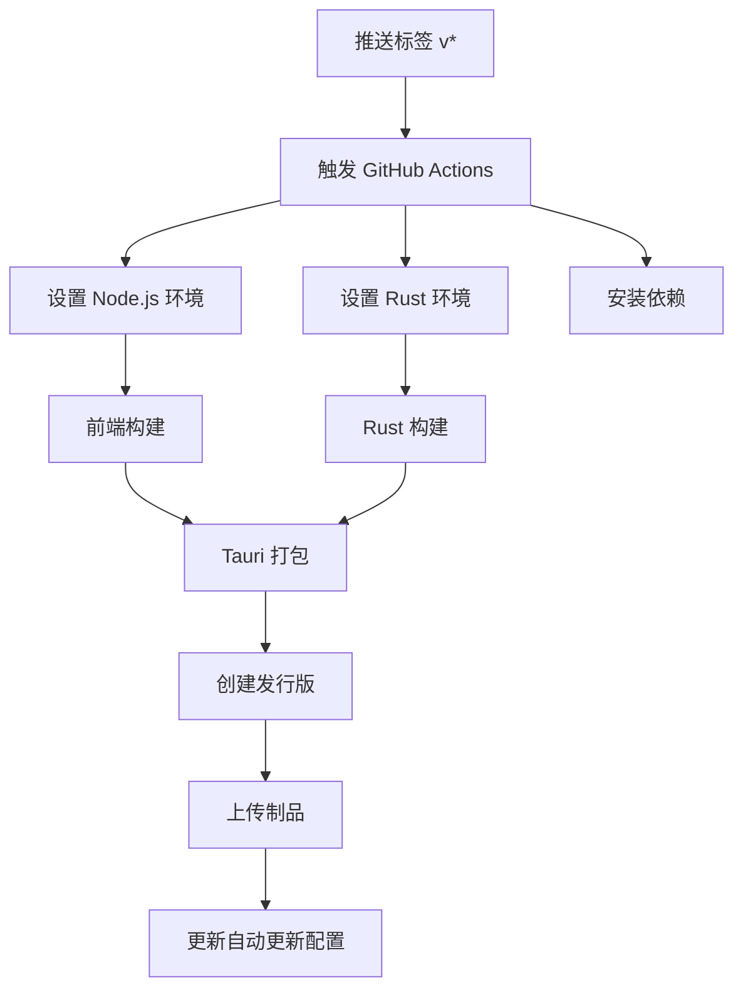
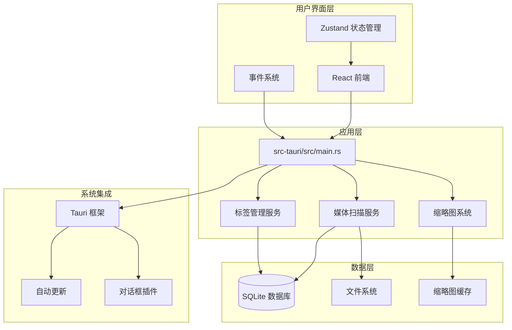
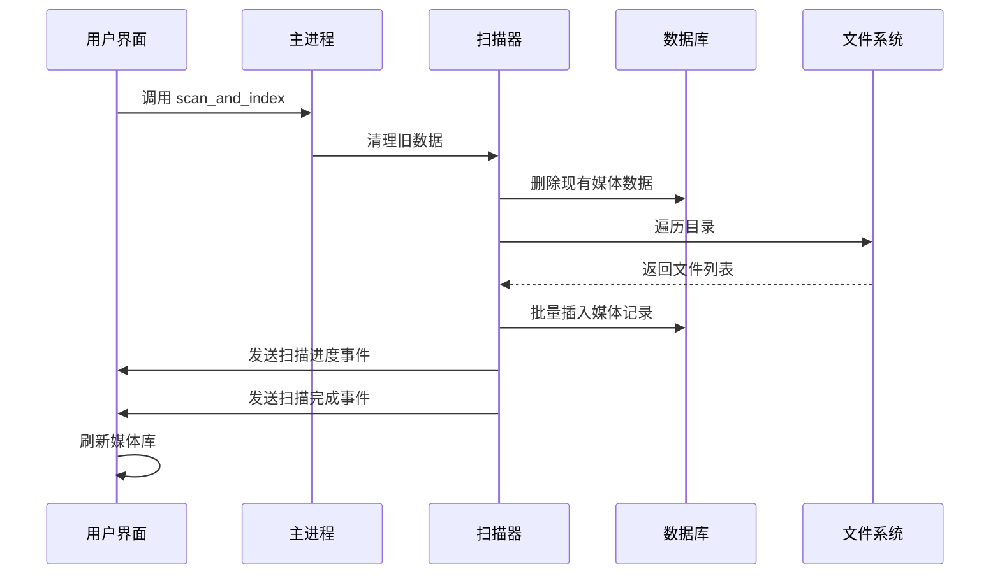
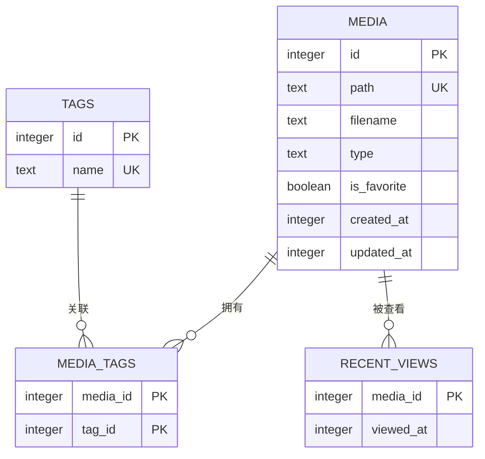
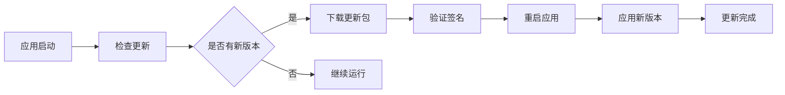
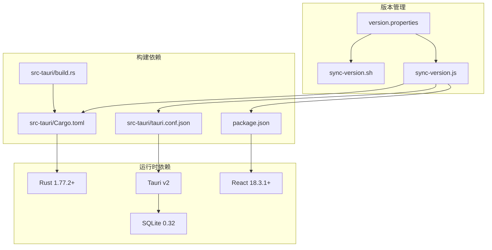

# 发布指南

<cite>
**本文档引用的文件**
- [.github/workflows/main.yml](file://.github/workflows/main.yml)
- [src-tauri/Cargo.toml](file://src-tauri/Cargo.toml)
- [package.json](file://package.json)
- [version.properties](file://version.properties)
- [scripts/sync-version.js](file://scripts/sync-version.js)
- [scripts/sync-version.sh](file://scripts/sync-version.sh)
- [doc/RELEASE_GUIDE.md](file://doc/RELEASE_GUIDE.md)
- [doc/VERSION_MANAGEMENT.md](file://doc/VERSION_MANAGEMENT.md)
- [src-tauri/build.rs](file://src-tauri/build.rs)
- [src-tauri/tauri.conf.json](file://src-tauri/tauri.conf.json)
- [vite.config.ts](file://vite.config.ts)
- [tailwind.config.ts](file://tailwind.config.ts)
- [src-tauri/src/main.rs](file://src-tauri/src/main.rs)
- [src-tauri/src/services/scanner.rs](file://src-tauri/src/services/scanner.rs)
- [src-tauri/src/services/tags.rs](file://src-tauri/src/services/tags.rs)
- [src-tauri/src/db/mod.rs](file://src-tauri/src/db/mod.rs)
- [src/App.tsx](file://src/App.tsx)
</cite>

## 目录
1. [简介](#简介)
2. [项目结构](#项目结构)
3. [核心组件](#核心组件)
4. [架构概览](#架构概览)
5. [详细组件分析](#详细组件分析)
6. [依赖分析](#依赖分析)
7. [性能考虑](#性能考虑)
8. [故障排除指南](#故障排除指南)
9. [结论](#结论)
10. [附录](#附录)

## 简介

Medex 是一个基于 Tauri v2 的跨平台桌面应用程序，专注于媒体管理和浏览。本发布指南提供了完整的发布流程，包括版本管理、构建配置、CI/CD 集成以及发布后的验证步骤。

## 项目结构

Medex 采用现代化的前后端分离架构，结合了 React 前端框架和 Rust 后端服务：



**图表来源**
- [src/App.tsx:1-185](file://src/App.tsx#L1-L185)
- [src-tauri/src/main.rs:1-69](file://src-tauri/src/main.rs#L1-L69)
- [src-tauri/Cargo.toml:1-23](file://src-tauri/Cargo.toml#L1-L23)
- [package.json:1-37](file://package.json#L1-L37)

**章节来源**
- [src-tauri/src/main.rs:1-69](file://src-tauri/src/main.rs#L1-L69)
- [src-tauri/Cargo.toml:1-23](file://src-tauri/Cargo.toml#L1-L23)
- [package.json:1-37](file://package.json#L1-L37)

## 核心组件

### 版本管理系统

Medex 实现了集中化的版本管理，确保所有配置文件保持同步：



**图表来源**
- [version.properties:1-9](file://version.properties#L1-L9)
- [scripts/sync-version.js:1-70](file://scripts/sync-version.js#L1-L70)
- [src-tauri/build.rs:1-18](file://src-tauri/build.rs#L1-L18)

### CI/CD 自动化发布

GitHub Actions 配置实现了自动化发布流程：



**图表来源**
- [.github/workflows/main.yml:1-42](file://.github/workflows/main.yml#L1-L42)

**章节来源**
- [doc/VERSION_MANAGEMENT.md:1-121](file://doc/VERSION_MANAGEMENT.md#L1-L121)
- [.github/workflows/main.yml:1-42](file://.github/workflows/main.yml#L1-L42)

## 架构概览

Medex 采用客户端-服务器架构，结合了现代 Web 技术和原生应用优势：



**图表来源**
- [src-tauri/src/main.rs:1-69](file://src-tauri/src/main.rs#L1-L69)
- [src-tauri/src/services/scanner.rs:1-536](file://src-tauri/src/services/scanner.rs#L1-L536)
- [src-tauri/src/services/tags.rs:1-220](file://src-tauri/src/services/tags.rs#L1-L220)
- [src-tauri/src/db/mod.rs:1-123](file://src-tauri/src/db/mod.rs#L1-L123)

## 详细组件分析

### 媒体扫描服务

媒体扫描服务负责扫描文件系统并建立媒体索引：



**图表来源**
- [src-tauri/src/services/scanner.rs:252-348](file://src-tauri/src/services/scanner.rs#L252-L348)

### 数据库架构

Medex 使用 SQLite 作为本地存储，支持媒体元数据管理：



**图表来源**
- [src-tauri/src/db/mod.rs:12-43](file://src-tauri/src/db/mod.rs#L12-L43)

**章节来源**
- [src-tauri/src/services/scanner.rs:1-536](file://src-tauri/src/services/scanner.rs#L1-L536)
- [src-tauri/src/db/mod.rs:1-123](file://src-tauri/src/db/mod.rs#L1-L123)

### 自动更新机制

Tauri Updater 插件提供自动更新功能：



**图表来源**
- [src-tauri/tauri.conf.json:40-47](file://src-tauri/tauri.conf.json#L40-L47)

**章节来源**
- [src-tauri/tauri.conf.json:1-50](file://src-tauri/tauri.conf.json#L1-L50)

## 依赖分析

### 版本依赖关系



**图表来源**
- [version.properties:1-9](file://version.properties#L1-L9)
- [scripts/sync-version.js:1-70](file://scripts/sync-version.js#L1-L70)
- [src-tauri/build.rs:1-18](file://src-tauri/build.rs#L1-L18)

**章节来源**
- [package.json:1-37](file://package.json#L1-L37)
- [src-tauri/Cargo.toml:1-23](file://src-tauri/Cargo.toml#L1-L23)

## 性能考虑

### 前端性能优化

- **虚拟滚动**: 使用 react-window 实现大数据集的高效渲染
- **懒加载**: 组件按需加载，减少初始包大小
- **状态管理**: Zustand 提供轻量级状态管理
- **主题系统**: CSS 变量实现动态主题切换

### 后端性能优化

- **批量操作**: 数据库操作使用事务和批量插入
- **索引优化**: 为常用查询字段建立索引
- **内存管理**: 使用 OnceCell 实现单例连接池
- **异步处理**: 缩略图生成使用工作线程

## 故障排除指南

### 常见发布错误

| 错误类型 | 症状 | 解决方案 |
|---------|------|----------|
| ffmpeg 缺失 | `resource path binaries/ffmpeg-xxx doesn't exist` | 准备对应平台的 ffmpeg 二进制文件 |
| 构建失败 | `failed to start ffmpeg process: No such file or directory` | 检查二进制文件权限和路径 |
| 版本不一致 | `Cargo.toml` 版本与 `version.properties` 不匹配 | 运行 `npm run sync-version` 同步版本 |
| CI 构建超时 | 平台矩阵构建时间过长 | 优化构建缓存和并行度 |

### 本地验证清单

- [ ] `npm ci` 通过
- [ ] `npm run build` 通过  
- [ ] `cd src-tauri && cargo check` 通过
- [ ] 扫描 100+ 文件无卡死
- [ ] 缩略图能逐步生成并显示
- [ ] 标签新增/删除/筛选正常
- [ ] 收藏状态刷新后不丢失

**章节来源**
- [doc/RELEASE_GUIDE.md:209-238](file://doc/RELEASE_GUIDE.md#L209-L238)

## 结论

Medex 的发布流程经过精心设计，实现了自动化、可重复和可靠的发布过程。通过集中版本管理和 CI/CD 自动化，确保了发布质量和效率。建议团队遵循本指南的流程，在每次发布前进行充分的测试和验证。

## 附录

### 发布操作模板

```bash
# 1) 切换到发布分支
git checkout -b release/v0.1.0

# 2) 安装依赖
npm ci

# 3) 前端构建
npm run build

# 4) Rust 检查
cd src-tauri && cargo check && cd ..

# 5) Tauri 打包
npm run tauri build

# 6) 记录产物
ls -la src-tauri/target/release/bundle
```

### 版本管理最佳实践

- 使用 `version.properties` 作为单一真实来源
- 发布前运行版本同步脚本
- 在 CI/CD 中自动执行版本同步
- 保持语义化版本格式 (MAJOR.MINOR.PATCH)

**章节来源**
- [doc/RELEASE_GUIDE.md:252-272](file://doc/RELEASE_GUIDE.md#L252-L272)
- [doc/VERSION_MANAGEMENT.md:72-87](file://doc/VERSION_MANAGEMENT.md#L72-L87)