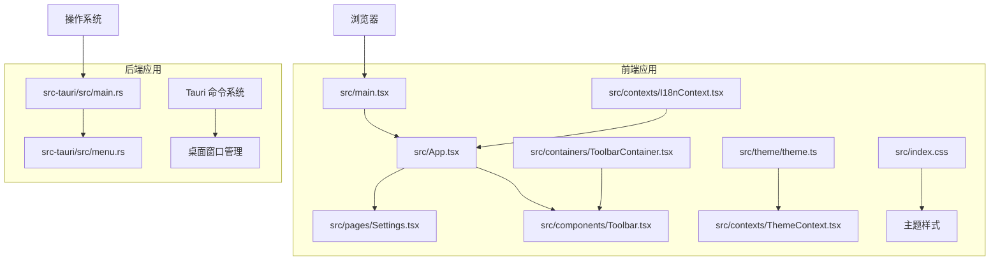
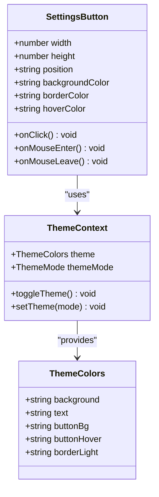
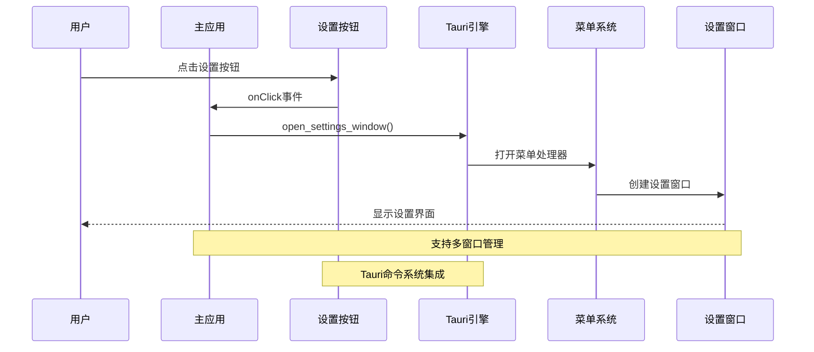
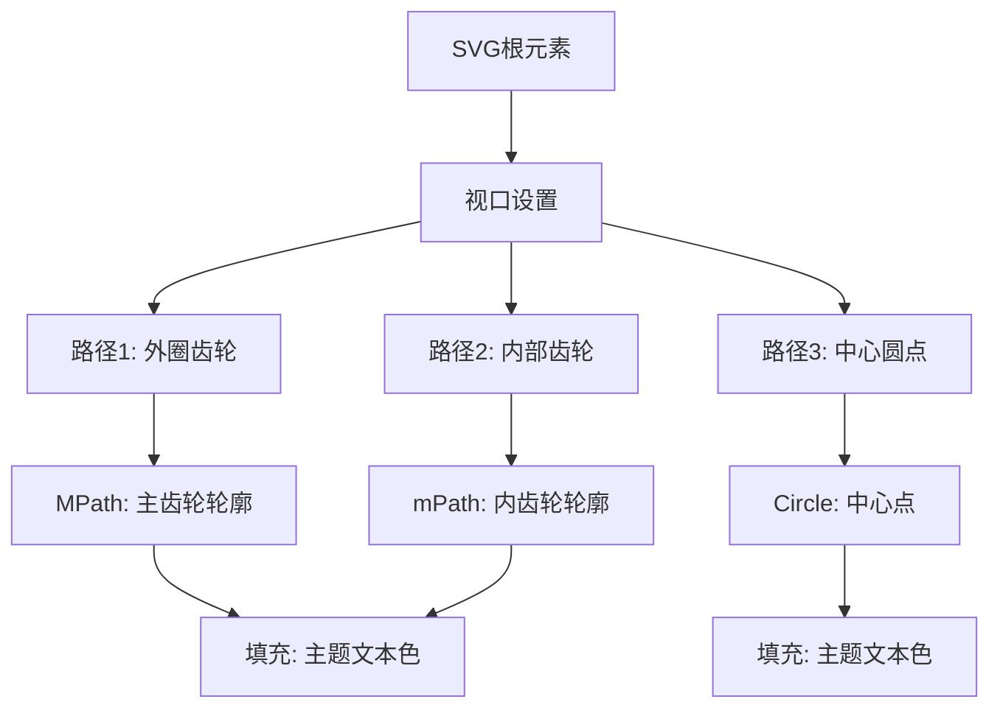
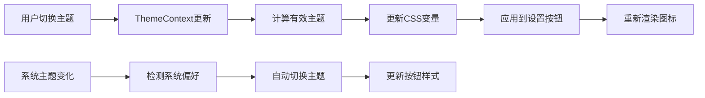
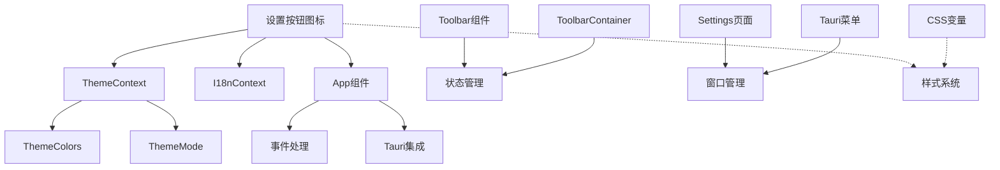

# 设置按钮图标

<cite>
**本文档引用的文件**
- [src/App.tsx](file://src/App.tsx)
- [src/pages/Settings.tsx](file://src/pages/Settings.tsx)
- [src/components/Toolbar.tsx](file://src/components/Toolbar.tsx)
- [src/containers/ToolbarContainer.tsx](file://src/containers/ToolbarContainer.tsx)
- [src/theme/theme.ts](file://src/theme/theme.ts)
- [src/contexts/ThemeContext.tsx](file://src/contexts/ThemeContext.tsx)
- [src/contexts/I18nContext.tsx](file://src/contexts/I18nContext.tsx)
- [src/main.tsx](file://src/main.tsx)
- [src/index.css](file://src/index.css)
- [src-tauri/src/main.rs](file://src-tauri/src/main.rs)
- [src-tauri/src/menu.rs](file://src-tauri/src/menu.rs)
- [index.html](file://index.html)
</cite>

## 目录
1. [简介](#简介)
2. [项目结构](#项目结构)
3. [核心组件](#核心组件)
4. [架构概览](#架构概览)
5. [详细组件分析](#详细组件分析)
6. [依赖关系分析](#依赖关系分析)
7. [性能考虑](#性能考虑)
8. [故障排除指南](#故障排除指南)
9. [结论](#结论)

## 简介

Medex 是一个现代化的媒体管理工具，具有设置按钮图标功能。本文档深入分析了设置按钮图标的实现，包括其在应用中的位置、样式设计、交互行为以及与整个系统架构的关系。

设置按钮图标是应用界面的重要组成部分，位于主界面的右下角，提供快速访问设置页面的功能。该图标采用 SVG 格式，具有响应式设计和主题适配能力。

## 项目结构

Medex 项目采用前后端分离的架构设计，主要分为前端 React 应用和后端 Tauri 应用两大部分：



**图表来源**
- [src/main.tsx:10-51](file://src/main.tsx#L10-L51)
- [src/App.tsx:325-429](file://src/App.tsx#L325-L429)
- [src-tauri/src/main.rs:20-32](file://src-tauri/src/main.rs#L20-L32)

**章节来源**
- [src/main.tsx:10-51](file://src/main.tsx#L10-L51)
- [src/App.tsx:325-429](file://src/App.tsx#L325-L429)

## 核心组件

设置按钮图标的核心实现位于主应用组件中，采用了现代化的 React Hooks 和 Tauri 集成技术：

### 图标组件结构

设置按钮图标包含以下关键元素：
- **SVG 图标**：使用路径数据定义的齿轮图标
- **定位系统**：绝对定位在屏幕右下角
- **交互反馈**：悬停状态的颜色变化
- **主题适配**：动态颜色跟随主题系统

### 样式系统

图标采用响应式设计，支持多种主题模式：



**图表来源**
- [src/App.tsx:336-365](file://src/App.tsx#L336-L365)
- [src/contexts/ThemeContext.tsx:76-83](file://src/contexts/ThemeContext.tsx#L76-L83)

**章节来源**
- [src/App.tsx:336-365](file://src/App.tsx#L336-L365)
- [src/theme/theme.ts:8-52](file://src/theme/theme.ts#L8-L52)

## 架构概览

设置按钮图标在整个应用架构中扮演着重要的导航角色：



**图表来源**
- [src/App.tsx:63-69](file://src/App.tsx#L63-L69)
- [src-tauri/src/main.rs:10-13](file://src-tauri/src/main.rs#L10-L13)
- [src-tauri/src/menu.rs:3-15](file://src-tauri/src/menu.rs#L3-L15)

## 详细组件分析

### 设置按钮实现

设置按钮图标位于主应用组件的底部右侧，采用绝对定位方式：

#### 图标属性配置

| 属性 | 值 | 描述 |
|------|-----|------|
| 宽度 | 48px | 固定尺寸，便于触摸操作 |
| 高度 | 48px | 与宽度相同，保持圆形外观 |
| 圆角 | 50% | 创建完美的圆形按钮 |
| 位置 | left-4 bottom-4 | 使用 Tailwind CSS 定位类 |
| 层级 | z-20 | 确保按钮在其他元素之上 |

#### SVG 图标数据

图标使用了复杂的路径数据，包含多个几何形状：



**图表来源**
- [src/App.tsx:353-364](file://src/App.tsx#L353-L364)

#### 交互行为

按钮实现了完整的交互生命周期：

```mermaid
stateDiagram-v2
[*] --> Normal : 初始状态
Normal --> Hover : 鼠标悬停
Hover --> Normal : 鼠标离开
Normal --> Click : 点击事件
Click --> Disabled : 执行中
Disabled --> Normal : 执行完成
Hover --> Hover : 悬停持续
Normal --> Normal : 空闲状态
```

**图表来源**
- [src/App.tsx:346-351](file://src/App.tsx#L346-L351)

**章节来源**
- [src/App.tsx:336-365](file://src/App.tsx#L336-L365)

### 主题系统集成

设置按钮完全集成到应用的主题系统中：

#### 颜色映射机制

| 主题状态 | 背景色 | 边框色 | 文本色 |
|----------|--------|--------|--------|
| 正常 | buttonBg | borderLight | text |
| 悬停 | buttonHover | borderLight | text |
| 点击 | buttonHover | borderLight | text |

#### 主题切换流程



**图表来源**
- [src/contexts/ThemeContext.tsx:44-54](file://src/contexts/ThemeContext.tsx#L44-L54)
- [src/index.css:10-108](file://src/index.css#L10-L108)

**章节来源**
- [src/theme/theme.ts:54-98](file://src/theme/theme.ts#L54-L98)
- [src/contexts/ThemeContext.tsx:76-83](file://src/contexts/ThemeContext.tsx#L76-L83)

### 国际化支持

设置按钮图标支持多语言环境：

#### 本地化键值

| 语言 | 键值 | 文本内容 |
|------|------|----------|
| 中文 | settings.title | 设置 |
| 英文 | settings.title | Settings |

#### 无障碍功能

按钮提供了完整的无障碍支持：
- **标题属性**：设置为"设置"（中文）
- **ARIA标签**：通过语义化的HTML结构
- **键盘导航**：支持Tab键导航

**章节来源**
- [src/i18n/zh-CN.json:1-3](file://src/i18n/zh-CN.json#L1-L3)
- [src/i18n/en-US.json:2](file://src/i18n/en-US.json#L2)

## 依赖关系分析

设置按钮图标与其他组件存在密切的依赖关系：



**图表来源**
- [src/App.tsx:336-365](file://src/App.tsx#L336-L365)
- [src/contexts/ThemeContext.tsx:17-89](file://src/contexts/ThemeContext.tsx#L17-L89)

### 关键依赖项

| 依赖项 | 类型 | 作用 |
|--------|------|------|
| @tauri-apps/api/core | 外部库 | Tauri命令调用 |
| @tauri-apps/api/event | 外部库 | 事件系统 |
| @tauri-apps/api/window | 外部库 | 窗口管理 |
| react | 外部库 | React框架 |
| tailwindcss | 外部库 | 样式框架 |

**章节来源**
- [src/App.tsx:1-11](file://src/App.tsx#L1-L11)
- [src-tauri/src/main.rs:10-18](file://src-tauri/src/main.rs#L10-L18)

## 性能考虑

设置按钮图标在性能方面进行了优化：

### 渲染优化

- **最小DOM树**：只包含必要的HTML元素
- **CSS动画**：使用硬件加速的CSS过渡
- **事件委托**：避免过多的事件监听器

### 内存管理

- **无状态组件**：图标本身不维护状态
- **上下文共享**：通过ThemeContext共享样式信息
- **懒加载**：设置窗口按需创建

### 交互响应性

- **即时反馈**：悬停状态立即响应
- **防抖处理**：避免重复点击
- **错误边界**：优雅处理异常情况

## 故障排除指南

### 常见问题及解决方案

#### 图标不显示

**症状**：设置按钮图标完全不可见
**可能原因**：
- CSS样式冲突
- 主题变量未正确设置
- SVG路径数据错误

**解决方案**：
1. 检查CSS变量是否正确应用
2. 验证ThemeContext的状态
3. 确认SVG路径数据完整性

#### 交互无响应

**症状**：点击图标无任何反应
**可能原因**：
- 事件监听器未绑定
- Tauri命令调用失败
- 窗口管理器异常

**解决方案**：
1. 检查onClick事件绑定
2. 验证Tauri命令权限
3. 查看控制台错误日志

#### 主题不匹配

**症状**：图标颜色与主题不一致
**可能原因**：
- 主题切换未生效
- CSS变量缓存问题
- 浏览器兼容性问题

**解决方案**：
1. 强制刷新页面
2. 检查localStorage存储
3. 清除浏览器缓存

**章节来源**
- [src/App.tsx:63-69](file://src/App.tsx#L63-L69)
- [src/contexts/ThemeContext.tsx:56-66](file://src/contexts/ThemeContext.tsx#L56-L66)

## 结论

设置按钮图标作为Medex应用的重要界面元素，展现了现代前端开发的最佳实践。通过精心设计的架构和完善的主题系统集成，该图标不仅提供了优秀的用户体验，还确保了系统的可维护性和扩展性。

该实现的关键优势包括：
- **模块化设计**：清晰的组件分离和职责划分
- **主题适配**：完整的深色/浅色主题支持
- **国际化**：多语言环境下的无障碍体验
- **性能优化**：高效的渲染和内存管理
- **错误处理**：健壮的异常处理机制

未来可以考虑的改进方向：
- 添加动画效果增强用户体验
- 实现响应式设计适配不同屏幕尺寸
- 增加更多的交互反馈选项
- 优化移动端触摸体验