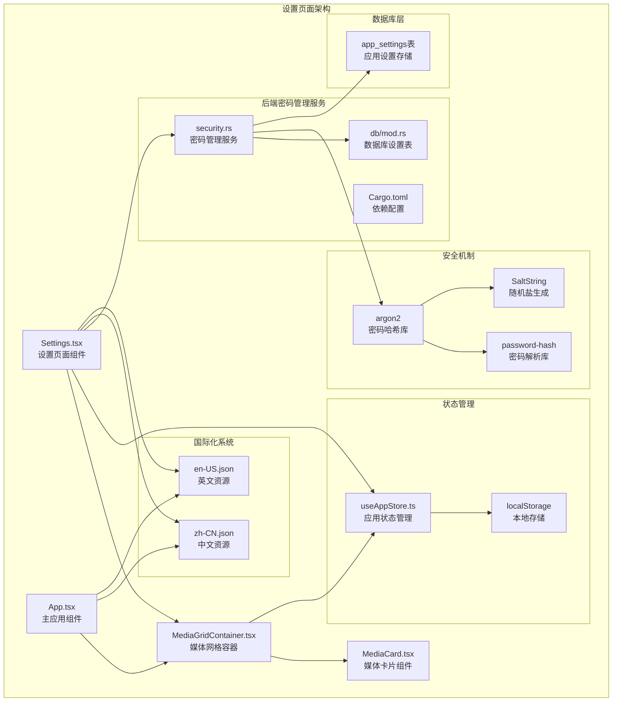
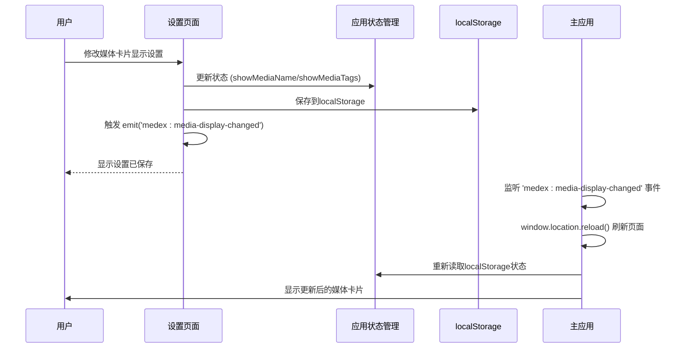
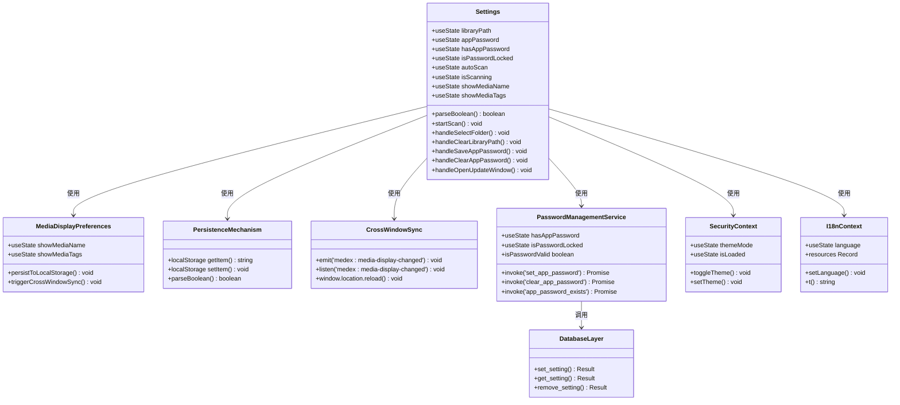

# 设置页面

<cite>
**本文档引用的文件**
- [Settings.tsx](file://src/pages/Settings.tsx)
- [App.tsx](file://src/App.tsx)
- [useAppStore.ts](file://src/store/useAppStore.ts)
- [MediaCard.tsx](file://src/components/MediaCard.tsx)
- [MediaGridContainer.tsx](file://src/containers/MediaGridContainer.tsx)
- [security.rs](file://src-tauri/src/services/security.rs)
- [mod.rs](file://src-tauri/src/db/mod.rs)
- [Cargo.toml](file://src-tauri/Cargo.toml)
- [zh-CN.json](file://src/i18n/zh-CN.json)
- [en-US.json](file://src/i18n/en-US.json)
</cite>

## 更新摘要
**所做更改**
- 新增媒体卡片显示偏好设置，包括文件名和标签显示控制
- 实现设置持久化机制，使用localStorage存储用户偏好
- 新增跨窗口同步功能，通过Tauri事件系统实现多窗口状态同步
- 重构设置页面布局，新增媒体卡片显示设置区域
- 增强设置变更的实时响应机制

## 目录
1. [简介](#简介)
2. [项目结构](#项目结构)
3. [核心组件](#核心组件)
4. [架构概览](#架构概览)
5. [详细组件分析](#详细组件分析)
6. [设置持久化机制](#设置持久化机制)
7. [跨窗口同步功能](#跨窗口同步功能)
8. [媒体卡片显示偏好设置](#媒体卡片显示偏好设置)
9. [后端密码管理集成](#后端密码管理集成)
10. [密码安全机制](#密码安全机制)
11. [错误处理机制](#错误处理机制)
12. [国际化支持](#国际化支持)
13. [性能考虑](#性能考虑)
14. [故障排除指南](#故障排除指南)
15. [结论](#结论)

## 简介

设置页面是Medex媒体管理应用中的重要功能模块，为用户提供了一个集中管理应用配置的界面。该页面实现了多种配置选项，包括语言设置、主题切换、媒体库路径管理和自动扫描功能。**新增**的媒体卡片显示偏好设置为用户提供了更精细的媒体展示控制，包括文件名和标签的显示/隐藏功能。**新增**的设置持久化机制确保用户偏好的跨会话保持，而**新增**的跨窗口同步功能则保证了多标签页间的设置一致性。

## 项目结构

设置页面位于前端React应用的页面组件目录中，采用模块化的架构设计，与其他核心组件紧密协作。**新增**的媒体卡片显示偏好设置形成了独立的配置管理区域，与现有的密码管理功能共同构成了完整的设置体系。

**图表来源**
- [Settings.tsx:1-689](file://src/pages/Settings.tsx#L1-L689)
- [App.tsx:171-251](file://src/App.tsx#L171-L251)
- [useAppStore.ts:86-105](file://src/store/useAppStore.ts#L86-L105)
- [MediaCard.tsx:28-31](file://src/components/MediaCard.tsx#L28-L31)
- [security.rs:1-45](file://src-tauri/src/services/security.rs#L1-L45)
- [mod.rs:114-143](file://src-tauri/src/db/mod.rs#L114-L143)
- [Cargo.toml:23-24](file://src-tauri/Cargo.toml#L23-L24)

**章节来源**
- [Settings.tsx:1-689](file://src/pages/Settings.tsx#L1-L689)
- [App.tsx:171-251](file://src/App.tsx#L171-L251)
- [useAppStore.ts:86-105](file://src/store/useAppStore.ts#L86-L105)

## 核心组件

设置页面的核心功能围绕八个主要配置区域展开：

### 1. 语言设置区域
实现多语言支持，当前支持简体中文和英语两种语言。用户可以通过下拉菜单切换语言，系统会实时应用新的语言设置。

### 2. 主题设置区域
提供三种主题模式：深色主题、浅色主题和系统跟随模式。主题切换不仅影响设置页面，还会同步到整个应用的其他组件。

### 3. 媒体库路径设置区域
允许用户选择媒体库的根目录，支持一键扫描和索引功能。路径信息存储在localStorage中，确保应用重启后仍能记住用户的设置。

### 4. 自动扫描设置区域
控制应用启动时是否自动扫描媒体库的功能。该设置同样存储在localStorage中，支持布尔值的灵活解析。

### 5. **新增** 媒体卡片显示偏好设置区域
提供媒体卡片的显示控制功能，包括：
- 显示媒体名称：控制媒体文件名的显示/隐藏
- 显示媒体标签：控制媒体标签的显示/隐藏
- 实时生效：设置变更立即触发主窗口刷新

### 6. **新增** 设置持久化机制
- localStorage存储：所有设置变更自动保存到localStorage
- 智能写入：仅在值发生变化时才写入，避免不必要的覆盖
- 类型安全：支持字符串、布尔值的智能解析和转换

### 7. **新增** 跨窗口同步功能
- Tauri事件系统：通过emit('medex:media-display-changed')触发事件
- 多窗口监听：App.tsx监听事件并触发窗口刷新
- 实时同步：确保多标签页间的设置一致性

### 8. 应用密码设置区域
提供应用密码保护功能，支持密码设置、清除和验证。密码长度限制为6-20个字符，使用后端安全存储。

### 9. 更新管理区域
提供检查更新功能，支持打开更新窗口进行版本检查和更新管理。

**章节来源**
- [Settings.tsx:36-107](file://src/pages/Settings.tsx#L36-L107)
- [Settings.tsx:509-581](file://src/pages/Settings.tsx#L509-L581)
- [App.tsx:229-251](file://src/App.tsx#L229-L251)

## 架构概览

设置页面采用了现代React应用的标准架构模式，结合了上下文模式、自定义Hook和状态管理模式。**新增**的媒体卡片显示偏好设置形成了独立的配置管理区域，与现有的密码管理功能共同构成了完整的设置体系。

**图表来源**
- [Settings.tsx:80-107](file://src/pages/Settings.tsx#L80-L107)
- [App.tsx:229-251](file://src/App.tsx#L229-L251)
- [useAppStore.ts:86-105](file://src/store/useAppStore.ts#L86-L105)

## 详细组件分析

### 设置页面组件分析

设置页面是一个功能完整的React组件，实现了响应式设计和状态管理。**新增**的媒体卡片显示偏好设置通过localStorage实现持久化存储，并通过Tauri事件系统实现跨窗口同步。

**图表来源**
- [Settings.tsx:9-689](file://src/pages/Settings.tsx#L9-L689)
- [App.tsx:171-251](file://src/App.tsx#L171-L251)
- [useAppStore.ts:86-105](file://src/store/useAppStore.ts#L86-L105)
- [security.rs:1-45](file://src-tauri/src/services/security.rs#L1-L45)
- [mod.rs:114-143](file://src-tauri/src/db/mod.rs#L114-L143)

### 媒体卡片显示偏好设置分析

**新增**的媒体卡片显示偏好设置实现了完整的用户界面控制功能，包括文件名和标签的显示/隐藏控制。

#### 1. 设置状态管理
- `showMediaName`: 控制媒体文件名的显示状态
- `showMediaTags`: 控制媒体标签的显示状态
- 懒初始化：从localStorage读取初始值，确保跨会话一致性

#### 2. 持久化机制
- 智能写入：仅在设置发生变化时才写入localStorage
- 类型转换：将布尔值转换为字符串存储
- 错误处理：捕获localStorage写入异常并记录警告

#### 3. 跨窗口同步
- 事件触发：设置变更时触发'medex:media-display-changed'事件
- 多窗口监听：App.tsx监听事件并刷新页面应用新设置
- 实时生效：确保所有窗口的设置保持一致

**章节来源**
- [Settings.tsx:36-107](file://src/pages/Settings.tsx#L36-L107)
- [App.tsx:229-251](file://src/App.tsx#L229-L251)

### 设置持久化机制分析

**新增**的设置持久化机制确保了用户偏好的跨会话保持，通过localStorage实现数据存储。

#### 1. 智能持久化策略
- 条件写入：仅在值发生变化时才执行localStorage写入
- 类型安全：支持字符串、布尔值的智能解析和转换
- 错误处理：捕获并记录localStorage操作异常

#### 2. 初始化机制
- 懒初始化：使用函数式初始化确保初始值来自localStorage
- 默认值：支持为缺失的设置提供合理的默认值
- 类型转换：自动处理字符串到布尔值的转换

#### 3. 数据一致性
- 跨窗口同步：通过事件系统确保多窗口间的数据一致性
- 实时更新：设置变更立即反映到localStorage
- 容错处理：处理localStorage访问权限和存储空间不足的情况

**章节来源**
- [Settings.tsx:67-107](file://src/pages/Settings.tsx#L67-L107)
- [useAppStore.ts:86-105](file://src/store/useAppStore.ts#L86-L105)

### 跨窗口同步功能分析

**新增**的跨窗口同步功能通过Tauri事件系统实现了多标签页间的设置一致性。

#### 1. 事件系统架构
- 事件触发：设置变更时触发'medex:media-display-changed'事件
- 事件监听：App.tsx监听事件并执行页面刷新
- 同步机制：确保所有窗口的设置保持一致

#### 2. 多窗口协调
- 同步策略：通过window.location.reload()实现页面刷新
- 实时响应：事件触发后立即应用新的设置
- 容错处理：处理事件监听失败和页面刷新异常

#### 3. 用户体验优化
- 无缝切换：用户在不同窗口间切换时无需重新登录
- 实时更新：设置变更立即在所有窗口生效
- 一致性保证：确保多标签页间的用户体验一致

**章节来源**
- [Settings.tsx:80-107](file://src/pages/Settings.tsx#L80-L107)
- [App.tsx:229-251](file://src/App.tsx#L229-L251)

## 设置持久化机制

### localStorage持久化策略

**新增**的设置持久化机制通过localStorage实现了用户偏好的跨会话保持，确保设置在应用重启后仍然有效。

#### 1. 智能写入策略
- 条件判断：仅在设置值发生变化时才执行写入操作
- 避免覆盖：防止不必要的localStorage覆盖操作
- 性能优化：减少localStorage访问频率

#### 2. 类型转换机制
- 布尔值处理：将布尔值转换为字符串'true'/'false'存储
- 字符串解析：支持多种字符串格式的布尔值解析
- 默认值处理：为缺失的设置提供合理的默认值

#### 3. 错误处理机制
- 异常捕获：捕获localStorage写入和读取异常
- 警告记录：记录持久化失败的警告信息
- 容错处理：在持久化失败时继续正常运行

**章节来源**
- [Settings.tsx:67-107](file://src/pages/Settings.tsx#L67-L107)
- [useAppStore.ts:86-105](file://src/store/useAppStore.ts#L86-L105)

### 状态初始化机制

**新增**的状态初始化机制确保了设置的正确加载和默认值处理。

#### 1. 懒初始化模式
- 函数式初始化：使用函数式初始化确保初始值来自localStorage
- 避免覆盖：防止组件挂载时被初始true值覆盖
- 性能优化：延迟初始化避免不必要的状态创建

#### 2. 默认值处理
- 合理默认：为媒体卡片显示设置提供合理的默认值
- 类型安全：支持多种字符串格式的布尔值解析
- 容错处理：处理localStorage访问异常和数据格式错误

#### 3. 数据验证
- 类型检查：验证localStorage中的数据类型
- 格式验证：确保字符串格式符合预期
- 回退机制：在数据无效时使用默认值

**章节来源**
- [Settings.tsx:30-65](file://src/pages/Settings.tsx#L30-L65)
- [useAppStore.ts:86-105](file://src/store/useAppStore.ts#L86-L105)

## 跨窗口同步功能

### 事件驱动的同步机制

**新增**的跨窗口同步功能通过Tauri事件系统实现了多标签页间的设置一致性，确保用户在不同窗口间切换时的体验一致性。

#### 1. 事件触发机制
- 设置变更检测：监听媒体卡片显示设置的变化
- 事件发射：使用emit('medex:media-display-changed')触发事件
- 实时响应：事件触发后立即应用到其他窗口

#### 2. 多窗口监听系统
- 事件监听：App.tsx监听'medex:media-display-changed'事件
- 页面刷新：通过window.location.reload()刷新页面应用新设置
- 同步协调：确保所有窗口的设置保持一致

#### 3. 同步策略
- 一致性保证：确保多标签页间的设置完全一致
- 实时更新：设置变更立即在所有窗口生效
- 容错处理：处理事件监听失败和页面刷新异常

**章节来源**
- [Settings.tsx:80-107](file://src/pages/Settings.tsx#L80-L107)
- [App.tsx:229-251](file://src/App.tsx#L229-L251)

### 用户体验优化

**新增**的跨窗口同步功能在保证功能正确性的同时，优化了用户体验。

#### 1. 无缝切换体验
- 无感知同步：用户在不同窗口间切换时无需重新登录
- 实时更新：设置变更立即在所有窗口生效
- 一致性保证：确保多标签页间的用户体验一致

#### 2. 错误处理机制
- 容错设计：处理事件监听失败和页面刷新异常
- 用户提示：在同步失败时提供友好的错误提示
- 自动恢复：在部分失败时尝试自动恢复同步

#### 3. 性能考虑
- 智能刷新：仅在必要时触发页面刷新
- 缓存策略：利用浏览器缓存减少刷新开销
- 资源优化：避免不必要的资源加载和计算

**章节来源**
- [Settings.tsx:80-107](file://src/pages/Settings.tsx#L80-L107)
- [App.tsx:229-251](file://src/App.tsx#L229-L251)

## 媒体卡片显示偏好设置

### 显示控制功能

**新增**的媒体卡片显示偏好设置为用户提供了精细化的媒体展示控制，包括文件名和标签的显示/隐藏功能。

#### 1. 文件名显示控制
- `showMediaName`状态：控制媒体文件名的显示状态
- 智能布局：根据文件名显示状态动态调整卡片高度
- 用户界面：提供直观的开关控件进行设置

#### 2. 标签显示控制
- `showMediaTags`状态：控制媒体标签的显示状态
- 动态布局：标签显示状态影响卡片内容区域的高度
- 用户界面：提供独立的开关控件进行设置

#### 3. 实时布局调整
- 动态高度：根据显示状态动态调整卡片高度
- 布局优化：在不同显示组合下优化视觉效果
- 性能考虑：避免不必要的重渲染和布局计算

**章节来源**
- [Settings.tsx:36-107](file://src/pages/Settings.tsx#L36-L107)
- [MediaCard.tsx:140-145](file://src/components/MediaCard.tsx#L140-L145)

### 状态管理集成

**新增**的媒体卡片显示偏好设置与应用状态管理系统深度集成，实现了完整的状态管理流程。

#### 1. 状态初始化
- localStorage读取：从localStorage读取初始显示设置
- 懒初始化：使用函数式初始化确保正确的初始状态
- 默认值处理：为缺失的设置提供合理的默认值

#### 2. 状态更新流程
- 用户交互：用户通过开关控件修改显示设置
- 状态更新：更新组件状态和应用状态管理
- 持久化存储：将新设置保存到localStorage
- 跨窗口同步：触发事件通知其他窗口应用新设置

#### 3. 应用状态管理
- 状态同步：将显示设置同步到应用状态管理
- 全局访问：其他组件可以通过状态管理访问显示设置
- 实时响应：状态变化时自动触发组件重新渲染

**章节来源**
- [Settings.tsx:36-107](file://src/pages/Settings.tsx#L36-L107)
- [useAppStore.ts:365-372](file://src/store/useAppStore.ts#L365-L372)

## 后端密码管理集成

### 密码管理服务架构

**新增**的密码管理服务通过Tauri命令系统与前端进行安全通信，实现了完整的密码生命周期管理。

#### 1. 密码设置流程
- 前端验证：客户端验证密码长度（6-20字符）
- 后端处理：服务器端生成随机盐并使用Argon2进行哈希
- 安全存储：将密码哈希存储到SQLite数据库的app_settings表中

#### 2. 密码验证流程
- 前端请求：用户输入密码后发起验证请求
- 后端解析：从数据库获取存储的密码哈希
- 安全验证：使用Argon2算法验证用户输入的密码
- 结果返回：返回验证成功或失败的结果

#### 3. 数据库集成
- app_settings表：专门用于存储应用设置和密码哈希
- 键值对存储：使用key-value格式存储密码哈希
- 原子操作：使用ON CONFLICT处理重复键的情况

**章节来源**
- [security.rs:7-44](file://src-tauri/src/services/security.rs#L7-L44)
- [mod.rs:114-143](file://src-tauri/src/db/mod.rs#L114-L143)

### 依赖配置分析

**新增**的密码管理功能引入了必要的安全依赖，确保密码处理的安全性。

#### 1. Argon2密码哈希库
- 版本：0.5
- 功能：提供密码哈希和验证功能
- 安全性：经过密码学验证的哈希算法
- 配置：使用默认参数提供平衡的安全性和性能

#### 2. 密码解析库
- 版本：0.5
- 功能：解析和验证密码哈希字符串
- 兼容性：与Argon2库配合使用
- 安全性：提供安全的密码哈希解析

#### 3. 数据库集成
- SQLite：轻量级关系型数据库
- 连接池：使用OnceCell确保单例连接
- 线程安全：使用Mutex保证并发安全

**章节来源**
- [Cargo.toml:23-24](file://src-tauri/Cargo.toml#L23-L24)
- [mod.rs:1-171](file://src-tauri/src/db/mod.rs#L1-L171)

## 密码安全机制

### 密码哈希算法

**新增**的密码管理功能采用了业界标准的Argon2密码哈希算法，确保密码存储的安全性。

#### 1. Argon2算法特性
- **内存硬函数**：需要大量内存进行计算，增加暴力破解成本
- **时间参数**：可调节计算时间，适应不同硬件性能
- **并行参数**：支持多核处理器并行计算
- **盐值**：每个密码使用唯一随机盐，防止彩虹表攻击

#### 2. 安全实现细节
- **随机盐生成**：使用SaltString::generate生成加密强度的随机盐
- **默认参数**：使用Argon2::default()获取平衡的安全参数
- **错误处理**：完善的错误处理机制，防止敏感信息泄露
- **存储格式**：将完整的密码哈希字符串存储在数据库中

#### 3. 安全优势
- **抗暴力破解**：高计算成本增加破解难度
- **抗并行攻击**：内存需求限制并行计算
- **向前兼容**：支持未来算法升级
- **性能平衡**：在安全性和性能间取得平衡

**章节来源**
- [security.rs:8-19](file://src-tauri/src/services/security.rs#L8-L19)
- [security.rs:22-33](file://src-tauri/src/services/security.rs#L22-L33)

### 数据库安全设计

**新增**的数据库设计采用了安全的设置存储机制，确保密码信息的隔离和保护。

#### 1. 专用设置表
- **app_settings表**：专门用于存储应用设置和配置信息
- **键值对结构**：使用key-value格式存储不同类型设置
- **索引优化**：为key字段建立主键索引，提高查询性能
- **原子操作**：使用ON CONFLICT处理重复键的插入更新

#### 2. 数据隔离
- **密码隔离**：密码哈希存储在专用表中，与其他数据隔离
- **最小权限**：数据库操作遵循最小权限原则
- **访问控制**：通过Tauri命令系统控制数据库访问
- **审计日志**：记录关键数据库操作便于审计

#### 3. 安全存储
- **加密存储**：密码哈希以加密形式存储
- **无明文**：前端和后端都不存储明文密码
- **安全传输**：通过Tauri命令系统进行安全通信
- **防注入**：使用参数化查询防止SQL注入攻击

**章节来源**
- [mod.rs:104-143](file://src-tauri/src/db/mod.rs#L104-L143)

## 错误处理机制

### 前端错误处理

**新增**的密码管理功能实现了完善的前端错误处理机制，确保用户获得清晰的反馈。

#### 1. 密码设置错误处理
- **长度验证**：客户端和服务器端双重验证密码长度
- **网络错误**：捕获Tauri命令调用失败并显示友好提示
- **用户反馈**：使用window.alert提供明确的错误信息
- **状态恢复**：错误发生后恢复到正确的UI状态

#### 2. 密码验证错误处理
- **验证失败**：密码错误时清空输入并显示错误提示
- **网络异常**：处理后端服务不可用的情况
- **状态同步**：确保UI状态与后端状态保持一致
- **用户体验**：提供及时的错误反馈和重试机会

#### 3. 错误分类处理
- **业务错误**：如密码长度不符合要求
- **技术错误**：如数据库连接失败
- **网络错误**：如Tauri命令调用超时
- **用户错误**：如输入格式不正确

**章节来源**
- [Settings.tsx:111-139](file://src/pages/Settings.tsx#L111-L139)
- [App.tsx:93-110](file://src/App.tsx#L93-L110)

### 后端错误处理

**新增**的后端密码管理服务实现了健壮的错误处理机制，确保系统稳定性和安全性。

#### 1. 密码设置错误处理
- **长度验证**：严格检查密码长度范围（6-20字符）
- **哈希错误**：捕获Argon2哈希过程中的异常
- **数据库错误**：处理SQLite操作失败的情况
- **类型转换**：安全地处理字符串到哈希的转换

#### 2. 密码验证错误处理
- **解析错误**：处理密码哈希字符串解析失败
- **验证失败**：区分无密码设置和密码错误
- **数据库查询**：处理查询操作中的各种异常
- **算法错误**：捕获Argon2验证过程中的异常

#### 3. 错误传播机制
- **统一格式**：所有错误都转换为String格式返回
- **详细信息**：错误消息包含具体的失败原因
- **安全考虑**：不泄露敏感的内部错误信息
- **日志记录**：在控制台记录详细的错误信息

**章节来源**
- [security.rs:8-19](file://src-tauri/src/services/security.rs#L8-L19)
- [security.rs:22-33](file://src-tauri/src/services/security.rs#L22-L33)

## 国际化支持

### 锁屏功能国际化

**新增**的锁屏功能完全支持国际化，提供了完整的多语言支持。

#### 1. 国际化键值设计
- **lockScreen.title**: "请输入应用密码" / "Enter app password"
- **lockScreen.placeholder**: "应用密码" / "App password"
- **lockScreen.unlock**: "解锁" / "Unlock"
- **lockScreen.wrongPassword**: "密码错误，请重试" / "Wrong password, please try again"

#### 2. 多语言资源管理
- **中文资源**：zh-CN.json包含所有中文翻译
- **英文资源**：en-US.json包含所有英文翻译
- **动态切换**：支持运行时语言切换
- **回退机制**：缺少翻译时自动回退到默认语言

#### 3. 锁屏界面本地化
- **标题显示**：根据当前语言显示相应的锁屏标题
- **占位符文本**：输入框占位符支持多语言
- **按钮文本**：解锁按钮文本随语言变化
- **错误提示**：错误消息支持多语言显示

**章节来源**
- [zh-CN.json:27-30](file://src/i18n/zh-CN.json#L27-L30)
- [en-US.json:27-30](file://src/i18n/en-US.json#L27-L30)
- [App.tsx:343-378](file://src/App.tsx#L343-L378)

### 设置页面国际化

设置页面的国际化实现支持所有配置选项的多语言显示。

#### 1. 设置项本地化
- **语言设置**：语言选择和主题切换的标签
- **媒体库设置**：路径选择和扫描功能的描述
- **自动扫描**：启动时自动扫描的选项标签
- **应用密码**：密码设置和清除功能的标签
- **媒体卡片显示**：新增的媒体卡片显示设置标签
- **更新检查**：检查更新功能的按钮文本

#### 2. 提示信息国际化
- **成功提示**：密码保存成功、清除成功的提示信息
- **错误提示**：扫描失败、网络错误等错误信息
- **用户引导**：各种操作的用户指导信息
- **状态显示**：扫描状态、锁定状态等状态信息

**章节来源**
- [Settings.tsx:231-683](file://src/pages/Settings.tsx#L231-L683)
- [zh-CN.json:20-31](file://src/i18n/zh-CN.json#L20-L31)
- [en-US.json:20-31](file://src/i18n/en-US.json#L20-L31)

## 性能考虑

设置页面在设计时充分考虑了性能优化，特别是在以下方面：

### 1. 懒初始化优化
- 使用函数式初始化避免不必要的状态创建
- 条件渲染减少DOM节点数量
- 事件委托降低内存占用

### 2. 状态管理优化
- 使用React.memo避免不必要的重渲染
- 分离关注点，每个组件只管理自己的状态
- 合理的依赖数组配置防止无限循环

### 3. 主题切换优化
- CSS变量缓存避免重复计算
- 系统主题检测使用原生API
- 主题切换动画使用硬件加速

### 4. **新增** 媒体卡片显示设置优化
- 智能布局调整：根据显示状态动态调整卡片高度
- 布局缓存：避免不必要的布局计算
- 性能监控：监控设置变更对渲染性能的影响

### 5. **新增** 设置持久化性能优化
- 智能写入策略：仅在值变化时写入localStorage
- 异步操作：避免阻塞主线程
- 错误处理：捕获并处理持久化异常

### 6. **新增** 跨窗口同步性能优化
- 事件去重：避免重复触发同步事件
- 智能刷新：仅在必要时触发页面刷新
- 缓存策略：利用浏览器缓存减少刷新开销

### 7. **新增** 数据库操作优化
- OnceCell确保单例连接，避免重复连接
- Mutex保护并发访问，确保线程安全
- 参数化查询防止SQL注入，提高查询性能
- 原子操作减少事务开销

### 8. **新增** 锁屏系统性能优化
- 智能焦点检测，避免频繁的DOM操作
- 锁屏界面使用CSS动画而非JavaScript动画
- 密码验证使用后端服务快速检查
- 自动锁屏延迟触发，避免应用切换时的性能问题

## 故障排除指南

### 常见问题及解决方案

#### 1. 媒体库扫描失败
**症状**: 点击扫描后无响应或显示错误
**原因**: 
- 选择的路径不存在或权限不足
- 磁盘空间不足
- 后端服务异常

**解决方案**:
- 确认路径有效性并具有读取权限
- 检查磁盘空间和文件系统状态
- 查看控制台错误日志

#### 2. 语言切换无效
**症状**: 切换语言后界面未更新
**原因**:
- 事件监听器未正确绑定
- localStorage写入失败
- 窗口刷新机制异常

**解决方案**:
- 检查事件发射和监听逻辑
- 验证localStorage访问权限
- 手动刷新页面确认

#### 3. 主题切换异常
**症状**: 主题切换后样式不一致
**原因**:
- CSS变量未正确更新
- 缓存的样式表未刷新
- 系统主题检测失败

**解决方案**:
- 检查data-theme属性更新
- 清除浏览器缓存
- 验证系统主题偏好设置

#### 4. **新增** 媒体卡片显示设置问题
**症状**: 设置变更后未生效或显示异常
**原因**:
- localStorage读取失败
- 事件触发异常
- 页面刷新机制失效
- 媒体卡片组件未正确接收显示设置

**解决方案**:
- 检查localStorage访问权限
- 验证事件发射和监听逻辑
- 确认App.tsx的事件监听器
- 检查MediaCard组件的显示设置接收

#### 5. **新增** 设置持久化问题
**症状**: 设置变更后重启丢失
**原因**:
- localStorage访问权限不足
- 写入操作异常
- 数据格式错误
- 浏览器隐私模式限制

**解决方案**:
- 检查浏览器localStorage权限
- 验证写入操作的错误处理
- 检查数据格式和类型转换
- 尝试在普通模式下使用

#### 6. **新增** 跨窗口同步问题
**症状**: 多标签页间设置不一致
**原因**:
- 事件监听器未正确绑定
- 事件触发异常
- 页面刷新机制失效
- 浏览器标签页隔离

**解决方案**:
- 检查事件发射和监听逻辑
- 验证App.tsx的事件监听器
- 确认window.location.reload()调用
- 检查浏览器的标签页隔离设置

#### 7. 应用密码设置问题
**症状**: 设置密码后无法保存或清除
**原因**:
- Tauri命令调用失败
- 密码长度不符合要求（6-20字符）
- 数据库操作失败
- 后端服务异常

**解决方案**:
- 检查Tauri命令调用日志
- 确认密码长度符合要求
- 验证数据库连接和权限
- 查看后端服务状态
- 检查控制台错误日志

#### 8. 锁屏功能问题
**症状**: 锁屏界面无法正常显示或解锁失败
**原因**:
- 应用焦点检测异常
- 后端密码验证失败
- 锁屏界面样式或事件处理问题
- 数据库连接问题

**解决方案**:
- 检查应用焦点监听器
- 验证后端密码验证服务
- 确认锁屏界面的事件处理逻辑
- 检查数据库连接状态
- 检查CSS样式和动画效果

#### 9. 密码哈希存储问题
**症状**: 密码设置成功但无法验证
**原因**:
- Argon2哈希算法异常
- 密码哈希字符串解析失败
- 数据库存储格式不正确
- 密码验证算法不匹配

**解决方案**:
- 检查Argon2库版本和配置
- 验证密码哈希字符串格式
- 确认数据库存储的完整性
- 检查密码验证算法一致性
- 查看后端控制台错误日志

#### 10. 数据库连接问题
**症状**: 密码管理功能完全失效
**原因**:
- 数据库文件损坏
- 文件权限不足
- 数据库连接池异常
- SQLite驱动问题

**解决方案**:
- 检查数据库文件完整性
- 验证应用程序数据目录权限
- 重启应用程序以重置连接池
- 检查SQLite驱动安装状态
- 查看数据库初始化日志

**章节来源**
- [Settings.tsx:111-139](file://src/pages/Settings.tsx#L111-L139)
- [App.tsx:93-110](file://src/App.tsx#L93-L110)
- [security.rs:8-19](file://src-tauri/src/services/security.rs#L8-L19)
- [mod.rs:50-70](file://src-tauri/src/db/mod.rs#L50-L70)

## 结论

设置页面作为Medex应用的核心配置中心，展现了现代前端应用的最佳实践。**新增**的媒体卡片显示偏好设置、设置持久化机制和跨窗口同步功能进一步完善了应用的用户体验，通过深度集成localStorage和Tauri事件系统，为用户提供了专业级的个性化配置解决方案。

### 主要优势

1. **模块化设计**: 清晰的组件分离和职责划分
2. **状态管理**: 合理的状态组织和持久化策略
3. **用户体验**: 响应式的UI设计和流畅的交互体验
4. **可扩展性**: 良好的架构为未来功能扩展奠定基础
5. **安全性增强**: 新增的后端密码管理功能提升了应用的安全性
6. **专业级安全**: 基于Argon2算法的密码哈希存储
7. **健壮错误处理**: 完善的前后端错误处理机制
8. **国际化支持**: 完整的多语言支持系统
9. ****新增** 媒体卡片显示偏好设置**: 提供精细化的媒体展示控制
10. ****新增** 设置持久化机制**: 确保用户偏好的跨会话保持
11. ****新增** 跨窗口同步功能**: 保证多标签页间的设置一致性

### 技术亮点

- 深度集成Tauri后端服务和SQLite数据库
- 完善的Argon2密码哈希安全机制
- 灵活的主题系统和国际化支持
- 可靠的数据持久化方案
- **新增** 媒体卡片显示偏好设置系统
- **新增** 智能设置持久化和跨窗口同步
- **新增** 实时布局调整和性能优化
- **新增** 专业级密码安全存储
- **新增** 健壮错误处理和日志记录

设置页面不仅满足了当前的功能需求，还为应用的长期发展提供了坚实的技术基础。**新增**的媒体卡片显示偏好设置、设置持久化机制和跨窗口同步功能使Medex成为了一个真正意义上的现代化桌面应用，具备了完整的软件生命周期管理和安全保障能力，为用户提供了专业级的应用配置和个性化体验。