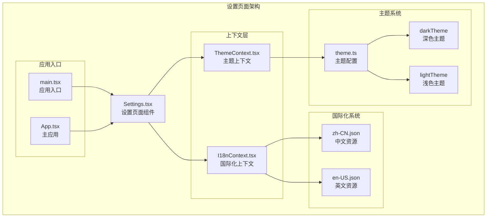
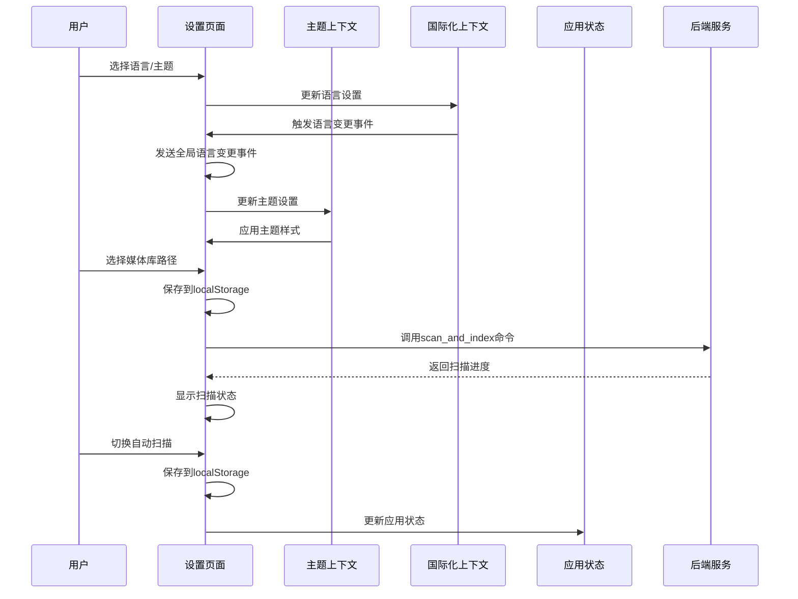
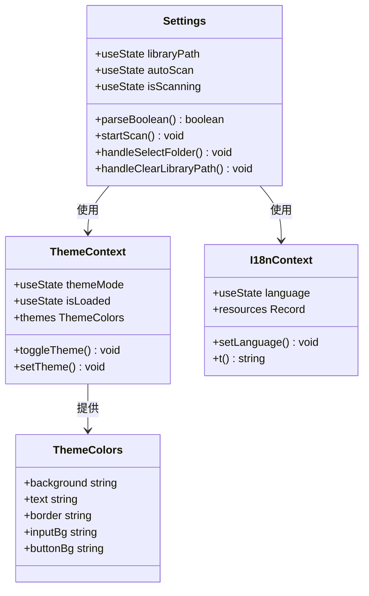
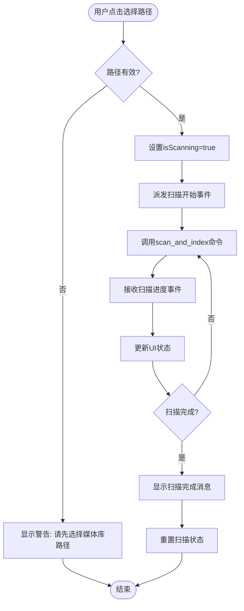
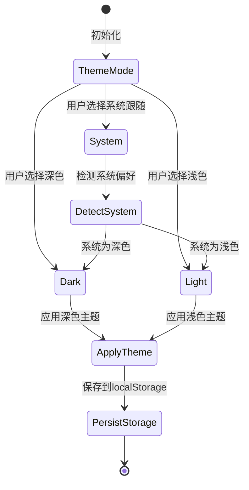
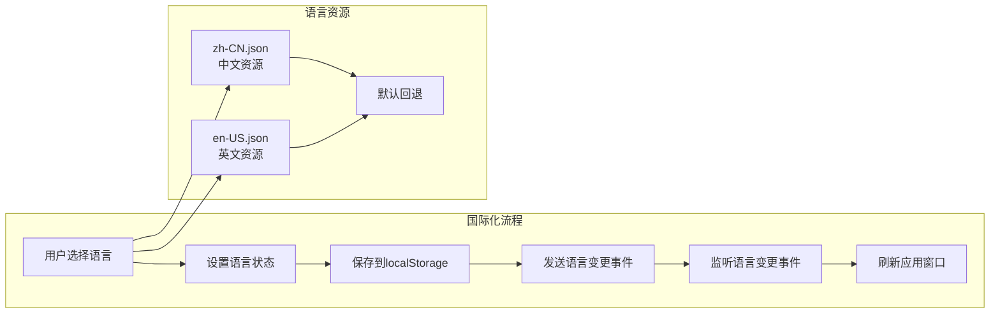

# 设置页面

<cite>
**本文档引用的文件**
- [Settings.tsx](file://src/pages/Settings.tsx)
- [ThemeContext.tsx](file://src/contexts/ThemeContext.tsx)
- [I18nContext.tsx](file://src/contexts/I18nContext.tsx)
- [theme.ts](file://src/theme/theme.ts)
- [zh-CN.json](file://src/i18n/zh-CN.json)
- [en-US.json](file://src/i18n/en-US.json)
- [main.tsx](file://src/main.tsx)
- [App.tsx](file://src/App.tsx)
- [useAppStore.ts](file://src/store/useAppStore.ts)
- [SidebarContainer.tsx](file://src/containers/SidebarContainer.tsx)
- [main.rs](file://src-tauri/src/main.rs)
</cite>

## 目录
1. [简介](#简介)
2. [项目结构](#项目结构)
3. [核心组件](#核心组件)
4. [架构概览](#架构概览)
5. [详细组件分析](#详细组件分析)
6. [依赖关系分析](#依赖关系分析)
7. [性能考虑](#性能考虑)
8. [故障排除指南](#故障排除指南)
9. [结论](#结论)

## 简介

设置页面是Medex媒体管理应用中的重要功能模块，为用户提供了一个集中管理应用配置的界面。该页面实现了多种配置选项，包括语言设置、主题切换、媒体库路径管理和自动扫描功能。通过与后端Tauri命令系统的集成，设置页面能够直接控制媒体库的扫描和索引过程，提供完整的媒体管理解决方案。

## 项目结构

设置页面位于前端React应用的页面组件目录中，采用模块化的架构设计，与其他核心组件紧密协作。



**图表来源**
- [Settings.tsx:1-342](file://src/pages/Settings.tsx#L1-L342)
- [ThemeContext.tsx:1-99](file://src/contexts/ThemeContext.tsx#L1-L99)
- [I18nContext.tsx:1-51](file://src/contexts/I18nContext.tsx#L1-L51)

**章节来源**
- [Settings.tsx:1-342](file://src/pages/Settings.tsx#L1-L342)
- [main.tsx:1-51](file://src/main.tsx#L1-L51)

## 核心组件

设置页面的核心功能围绕四个主要配置区域展开：

### 1. 语言设置区域
实现多语言支持，当前支持简体中文和英语两种语言。用户可以通过下拉菜单切换语言，系统会实时应用新的语言设置。

### 2. 主题设置区域
提供三种主题模式：深色主题、浅色主题和系统跟随模式。主题切换不仅影响设置页面，还会同步到整个应用的其他组件。

### 3. 媒体库路径设置区域
允许用户选择媒体库的根目录，支持一键扫描和索引功能。路径信息存储在localStorage中，确保应用重启后仍能记住用户的设置。

### 4. 自动扫描设置区域
控制应用启动时是否自动扫描媒体库的功能。该设置同样存储在localStorage中，支持布尔值的灵活解析。

**章节来源**
- [Settings.tsx:135-336](file://src/pages/Settings.tsx#L135-L336)

## 架构概览

设置页面采用了现代React应用的标准架构模式，结合了上下文模式、自定义Hook和状态管理模式。



**图表来源**
- [Settings.tsx:54-114](file://src/pages/Settings.tsx#L54-L114)
- [ThemeContext.tsx:68-83](file://src/contexts/ThemeContext.tsx#L68-L83)
- [I18nContext.tsx:33-47](file://src/contexts/I18nContext.tsx#L33-L47)

## 详细组件分析

### 设置页面组件分析

设置页面是一个功能完整的React组件，实现了响应式设计和状态管理。



**图表来源**
- [Settings.tsx:9-342](file://src/pages/Settings.tsx#L9-L342)
- [ThemeContext.tsx:6-83](file://src/contexts/ThemeContext.tsx#L6-L83)
- [I18nContext.tsx:5-45](file://src/contexts/I18nContext.tsx#L5-L45)

#### 媒体库扫描流程

设置页面实现了完整的媒体库扫描和索引功能，包括路径选择、扫描执行和状态管理。



**图表来源**
- [Settings.tsx:55-72](file://src/pages/Settings.tsx#L55-L72)
- [App.tsx:54-100](file://src/App.tsx#L54-L100)

#### 主题系统集成

设置页面与主题系统的深度集成，实现了动态主题切换和持久化存储。



**图表来源**
- [ThemeContext.tsx:17-90](file://src/contexts/ThemeContext.tsx#L17-L90)
- [theme.ts:154-158](file://src/theme/theme.ts#L154-L158)

### 国际化系统分析

设置页面的国际化实现采用了键值对映射的方式，支持动态语言切换。



**图表来源**
- [I18nContext.tsx:22-48](file://src/contexts/I18nContext.tsx#L22-L48)
- [zh-CN.json:1-114](file://src/i18n/zh-CN.json#L1-L114)
- [en-US.json:1-114](file://src/i18n/en-US.json#L1-L114)

**章节来源**
- [Settings.tsx:1-342](file://src/pages/Settings.tsx#L1-L342)
- [ThemeContext.tsx:1-99](file://src/contexts/ThemeContext.tsx#L1-L99)
- [I18nContext.tsx:1-51](file://src/contexts/I18nContext.tsx#L1-L51)

## 依赖关系分析

设置页面与应用其他组件之间存在复杂的依赖关系，形成了一个完整的配置管理系统。

```mermaid
graph TB
subgraph "设置页面依赖关系"
Settings[Settings.tsx]
subgraph "外部依赖"
TauriAPI[@tauri-apps/api<br/>Tauri API]
DialogPlugin[@tauri-apps/plugin-dialog<br/>对话框插件]
Zustand[zustand<br/>状态管理]
end
subgraph "内部依赖"
ThemeCtx[ThemeContext.tsx]
I18nCtx[I18nContext.tsx]
Theme[theme.ts]
Store[useAppStore.ts]
App[App.tsx]
end
subgraph "后端集成"
Scanner[scanner.rs<br/>扫描服务]
Tags[tags.rs<br/>标签服务]
Thumbnail[thumbnail.rs<br/>缩略图服务]
end
end
Settings --> TauriAPI
Settings --> DialogPlugin
Settings --> ThemeCtx
Settings --> I18nCtx
Settings --> Store
TauriAPI --> Scanner
TauriAPI --> Tags
TauriAPI --> Thumbnail
ThemeCtx --> Theme
App --> Store
```

**图表来源**
- [Settings.tsx:1-8](file://src/pages/Settings.tsx#L1-L8)
- [main.rs:49-65](file://src-tauri/src/main.rs#L49-L65)

### 数据持久化策略

设置页面采用了多层次的数据持久化策略，确保用户配置的可靠存储。

| 存储位置 | 数据类型 | 生命周期 | 用途 |
|---------|----------|----------|------|
| localStorage | 字符串键值对 | 永久存储 | 语言设置、主题模式、媒体库路径、自动扫描设置 |
| sessionStorage | 临时数据 | 会话期间 | 防止自动扫描重复触发 |
| 内存状态 | React状态 | 组件生命周期 | UI状态管理 |

**章节来源**
- [Settings.tsx:28-52](file://src/pages/Settings.tsx#L28-L52)
- [App.tsx:54-100](file://src/App.tsx#L54-L100)

## 性能考虑

设置页面在设计时充分考虑了性能优化，特别是在以下方面：

### 1. 懒初始化优化
- 使用函数式初始化避免不必要的状态创建
- 条件渲染减少DOM节点数量
- 事件委托降低内存占用

### 2. 状态管理优化
- 使用React.memo避免不必要的重渲染
- 分离关注点，每个组件只管理自己的状态
- 合理的依赖数组配置防止无限循环

### 3. 主题切换优化
- CSS变量缓存避免重复计算
- 系统主题检测使用原生API
- 主题切换动画使用硬件加速

## 故障排除指南

### 常见问题及解决方案

#### 1. 媒体库扫描失败
**症状**: 点击扫描后无响应或显示错误
**原因**: 
- 选择的路径不存在或权限不足
- 磁盘空间不足
- 后端服务异常

**解决方案**:
- 确认路径有效性并具有读取权限
- 检查磁盘空间和文件系统状态
- 查看控制台错误日志

#### 2. 语言切换无效
**症状**: 切换语言后界面未更新
**原因**:
- 事件监听器未正确绑定
- localStorage写入失败
- 窗口刷新机制异常

**解决方案**:
- 检查事件发射和监听逻辑
- 验证localStorage访问权限
- 手动刷新页面确认

#### 3. 主题切换异常
**症状**: 主题切换后样式不一致
**原因**:
- CSS变量未正确更新
- 缓存的样式表未刷新
- 系统主题检测失败

**解决方案**:
- 检查data-theme属性更新
- 清除浏览器缓存
- 验证系统主题偏好设置

**章节来源**
- [Settings.tsx:66-72](file://src/pages/Settings.tsx#L66-L72)
- [ThemeContext.tsx:56-66](file://src/contexts/ThemeContext.tsx#L56-L66)

## 结论

设置页面作为Medex应用的核心配置中心，展现了现代前端应用的最佳实践。通过精心设计的架构和完善的错误处理机制，该页面为用户提供了直观、可靠的配置体验。

### 主要优势

1. **模块化设计**: 清晰的组件分离和职责划分
2. **状态管理**: 合理的状态组织和持久化策略
3. **用户体验**: 响应式的UI设计和流畅的交互体验
4. **可扩展性**: 良好的架构为未来功能扩展奠定基础

### 技术亮点

- 深度集成Tauri后端服务
- 完善的国际化支持
- 灵活的主题系统
- 可靠的数据持久化方案

设置页面不仅满足了当前的功能需求，还为应用的长期发展提供了坚实的技术基础。