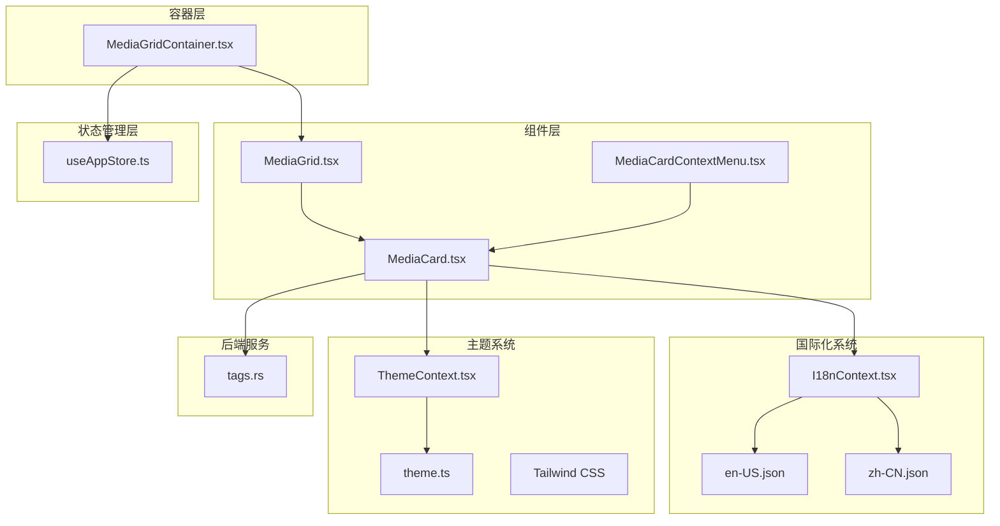
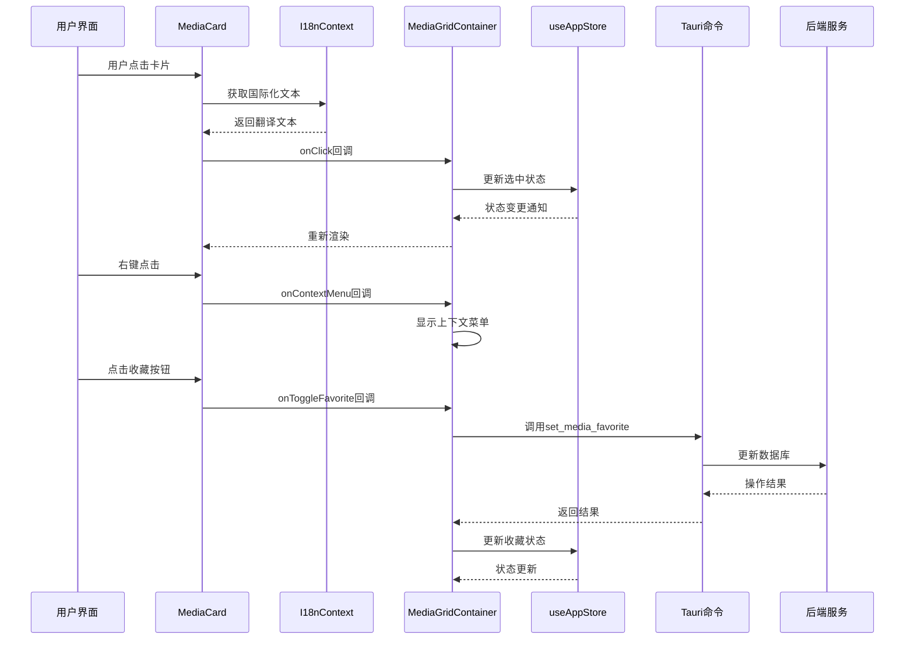
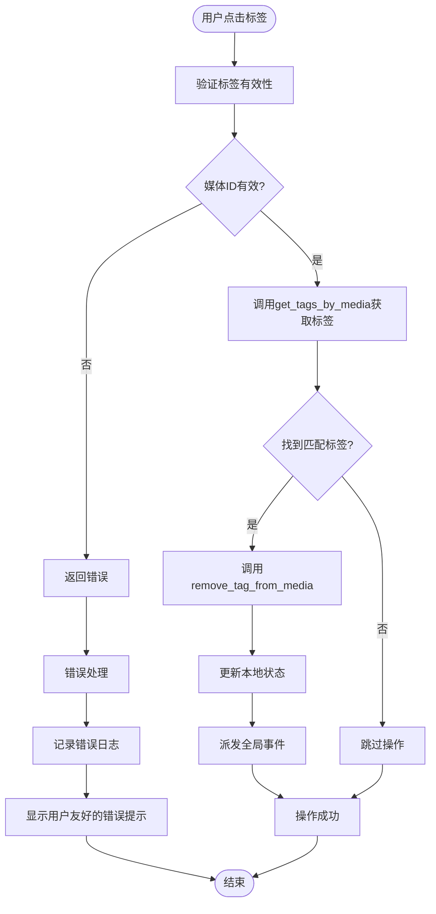
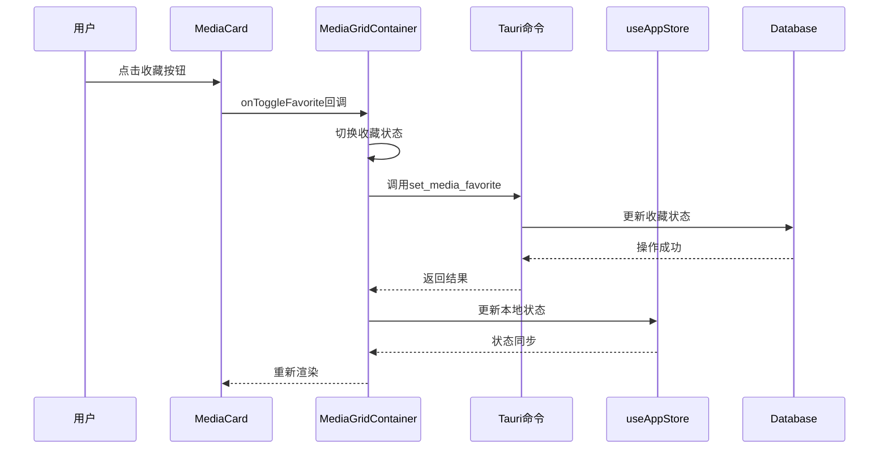
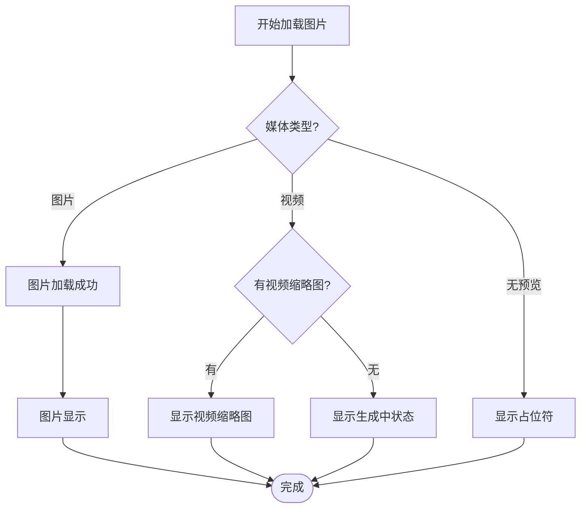
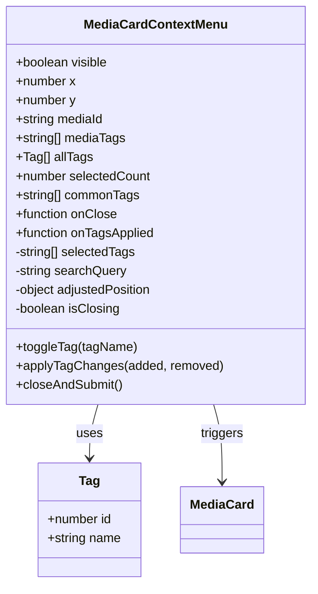
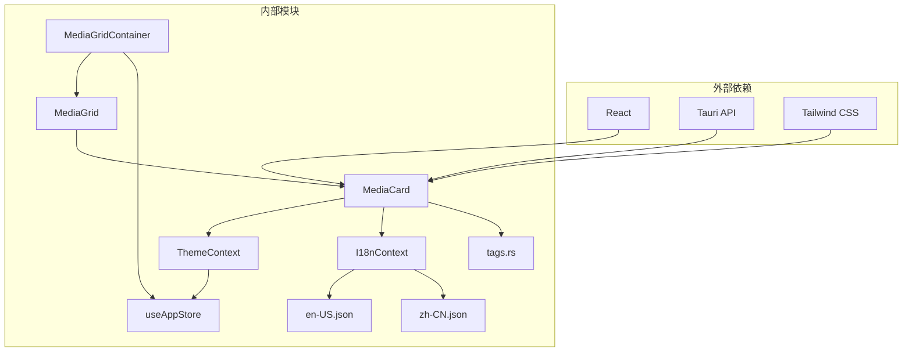
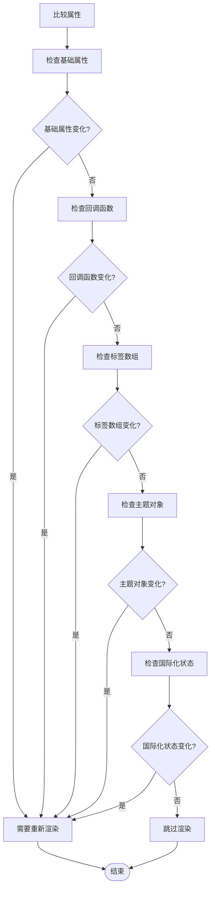

# MediaCard 媒体卡片组件

<cite>
**本文档引用的文件**
- [MediaCard.tsx](file://src/components/MediaCard.tsx)
- [MediaCardContextMenu.tsx](file://src/components/MediaCardContextMenu.tsx)
- [MediaGrid.tsx](file://src/components/MediaGrid.tsx)
- [MediaGridContainer.tsx](file://src/containers/MediaGridContainer.tsx)
- [ThemeContext.tsx](file://src/contexts/ThemeContext.tsx)
- [I18nContext.tsx](file://src/contexts/I18nContext.tsx)
- [theme.ts](file://src/theme/theme.ts)
- [useAppStore.ts](file://src/store/useAppStore.ts)
- [en-US.json](file://src/i18n/en-US.json)
- [zh-CN.json](file://src/i18n/zh-CN.json)
- [tags.rs](file://src-tauri/src/services/tags.rs)
- [tailwind.config.ts](file://tailwind.config.ts)
</cite>

## 目录
1. [简介](#简介)
2. [项目结构](#项目结构)
3. [核心组件](#核心组件)
4. [架构概览](#架构概览)
5. [详细组件分析](#详细组件分析)
6. [依赖关系分析](#依赖关系分析)
7. [性能考虑](#性能考虑)
8. [故障排除指南](#故障排除指南)
9. [结论](#结论)
10. [附录](#附录)

## 简介

MediaCard 是 Medex 媒体管理应用中的核心媒体展示组件，负责以卡片形式呈现媒体文件的预览、元数据和交互功能。该组件实现了完整的媒体浏览体验，包括图片和视频预览、标签管理、收藏功能、右键菜单以及响应式布局。

组件采用现代化的设计理念，支持深色/浅色主题切换，提供流畅的动画过渡效果，并通过 Tauri 命令与后端服务进行数据交互。整体设计注重用户体验和性能优化，特别是在大量媒体内容的场景下保持良好的渲染性能。

**更新** 新增国际化功能支持，提供中英文双语界面，增强全球用户的使用体验。

## 项目结构

MediaCard 组件位于前端组件目录中，与相关的上下文、容器和主题系统紧密集成：



**图表来源**
- [MediaCard.tsx:1-5](file://src/components/MediaCard.tsx#L1-L5)
- [MediaGrid.tsx:1-11](file://src/components/MediaGrid.tsx#L1-L11)
- [MediaGridContainer.tsx:1-10](file://src/containers/MediaGridContainer.tsx#L1-L10)
- [I18nContext.tsx:1-51](file://src/contexts/I18nContext.tsx#L1-L51)
- [en-US.json:1-114](file://src/i18n/en-US.json#L1-L114)
- [zh-CN.json:1-114](file://src/i18n/zh-CN.json#L1-L114)

**章节来源**
- [MediaCard.tsx:1-318](file://src/components/MediaCard.tsx#L1-L318)
- [MediaGrid.tsx:1-351](file://src/components/MediaGrid.tsx#L1-L351)
- [MediaGridContainer.tsx:1-619](file://src/containers/MediaGridContainer.tsx#L1-L619)

## 核心组件

### MediaCard 组件

MediaCard 是媒体卡片的核心组件，提供了完整的媒体展示和交互功能。组件支持多种媒体类型，包括图片和视频，并针对不同类型的媒体提供相应的预览策略。

#### 主要特性

- **多媒体类型支持**：同时支持图片和视频媒体的预览
- **标签管理系统**：内联标签显示和移除功能
- **收藏功能**：一键收藏/取消收藏媒体
- **主题集成**：完全支持深色/浅色主题切换
- **响应式设计**：适配网格和列表两种视图模式
- **性能优化**：使用 memo 和 react-window 进行虚拟化渲染
- **国际化支持**：内置多语言界面支持

#### 关键属性

| 属性名 | 类型 | 必需 | 描述 |
|--------|------|------|------|
| id | string | 是 | 媒体唯一标识符 |
| path | string | 否 | 媒体文件路径 |
| thumbnail | string | 是 | 缩略图URL或本地路径 |
| filename | string | 是 | 媒体文件名 |
| tags | string[] | 是 | 媒体标签数组 |
| time | string | 否 | 媒体时间信息 |
| mediaType | string | 否 | 媒体类型（image/video） |
| duration | string | 否 | 视频时长 |
| resolution | string | 否 | 分解率信息 |
| isFavorite | boolean | 否 | 收藏状态，默认false |
| selected | boolean | 是 | 选中状态 |
| onClick | function | 是 | 点击回调函数 |
| onDoubleClick | function | 否 | 双击回调函数 |
| onToggleFavorite | function | 否 | 收藏状态切换回调 |
| onTagRemoved | function | 否 | 标签移除回调 |
| onContextMenu | function | 否 | 右键菜单回调 |
| videoThumbnail | string | 否 | 视频专用缩略图 |
| className | string | 否 | 自定义CSS类名 |
| mode | 'grid' \| 'list' | 否 | 视图模式，默认'grid' |
| theme | ThemeColors | 是 | 主题颜色配置 |

**章节来源**
- [MediaCard.tsx:6-27](file://src/components/MediaCard.tsx#L6-L27)

### 国际化系统集成

**更新** MediaCard 组件现在集成了完整的国际化系统，支持中英文双语界面。

组件通过 I18nContext 获取当前语言设置，提供动态的语言切换能力。国际化系统支持：

- **自动语言检测**：根据浏览器语言设置自动选择默认语言
- **本地存储持久化**：用户选择的语言会保存到 localStorage
- **键值映射系统**：通过统一的键值对管理所有界面文本
- **动态语言切换**：运行时支持切换语言而不需刷新页面

#### 国际化键值

组件使用的国际化键值包括：

| 键值 | 中文 | 英文 | 用途 |
|------|------|------|------|
| mediaCard.noPreview | 无预览 | No Preview | 无预览状态显示 |
| mediaCard.generatingThumb | 生成缩略图... | Generating thumbnail... | 视频缩略图生成提示 |
| mediaCard.removeTagFailedPrefix | 移除标签失败： | Remove tag failed: | 标签移除错误前缀 |
| inspector.favorite.add | 收藏 | Favorite | 收藏按钮提示 |
| inspector.favorite.remove | 取消收藏 | Unfavorite | 取消收藏按钮提示 |

**章节来源**
- [I18nContext.tsx:1-51](file://src/contexts/I18nContext.tsx#L1-L51)
- [en-US.json:61-64](file://src/i18n/en-US.json#L61-L64)
- [zh-CN.json:61-64](file://src/i18n/zh-CN.json#L61-L64)

### 主题系统集成

组件通过 ThemeContext 获取主题配置，支持深色和浅色两种主题模式。主题系统提供了丰富的颜色变量，包括背景色、文本色、边框色、交互色等。

#### 主题颜色变量

| 颜色类别 | 变量名 | 用途 |
|----------|--------|------|
| 基础背景 | background, sidebar, main, inspector, card, toolbar | 页面和组件背景色 |
| 文本颜色 | text, textSecondary, textTertiary | 文本显示颜色 |
| 边框颜色 | border, borderLight | 边框和分隔线颜色 |
| 交互色 | hover, active, selected, selectionOverlay | 悬停、激活、选中状态 |
| 输入框 | inputBg, inputBorder, inputFocusBorder | 表单控件样式 |
| 标签 | tagBg, tagHover | 标签组件颜色 |
| 按钮 | buttonBg, buttonHover | 按钮组件颜色 |
| 遮罩层 | overlay | 半透明遮罩效果 |
| 功能色 | favorite, highlight, progress | 特殊功能颜色 |

**章节来源**
- [theme.ts:8-52](file://src/theme/theme.ts#L8-L52)
- [ThemeContext.tsx:17-99](file://src/contexts/ThemeContext.tsx#L17-L99)

## 架构概览

MediaCard 组件在整个应用架构中扮演着关键角色，连接了前端界面、状态管理、国际化系统和后端服务：



**图表来源**
- [MediaCard.tsx:94-95](file://src/components/MediaCard.tsx#L94-L95)
- [MediaGridContainer.tsx:58-91](file://src/containers/MediaGridContainer.tsx#L58-L91)
- [useAppStore.ts:236-246](file://src/store/useAppStore.ts#L236-L246)

**章节来源**
- [MediaGridContainer.tsx:185-201](file://src/containers/MediaGridContainer.tsx#L185-L201)
- [useAppStore.ts:145-394](file://src/store/useAppStore.ts#L145-L394)

## 详细组件分析

### 标签移除功能实现

**更新** 标签移除功能现在包含了改进的错误处理机制，提供更好的用户反馈。

标签移除是 MediaCard 组件中最复杂的交互功能之一，涉及前后端的数据同步和状态管理：



**图表来源**
- [MediaCard.tsx:65-92](file://src/components/MediaCard.tsx#L65-L92)
- [MediaGridContainer.tsx:145-175](file://src/containers/MediaGridContainer.tsx#L145-L175)

#### 标签移除流程详解

1. **参数验证**：首先验证媒体ID的有效性，确保转换为有效的数字格式
2. **标签查询**：通过 Tauri 命令 `get_tags_by_media` 查询媒体的所有标签
3. **匹配验证**：在返回的标签列表中查找目标标签，确保操作的安全性
4. **数据库操作**：调用 `remove_tag_from_media` 命令从数据库中移除标签关联
5. **状态更新**：更新本地状态管理器中的媒体标签信息
6. **事件通知**：派发全局事件通知其他组件进行相应更新
7. **错误处理**：捕获并处理任何操作失败的情况，提供用户友好的错误提示

#### 改进的错误处理机制

**更新** 新增了完善的错误处理和用户反馈机制：

- **错误日志记录**：使用 `console.error` 记录详细的错误信息
- **国际化错误提示**：通过 `t()` 函数获取本地化的错误消息
- **用户友好提示**：使用 `window.alert` 提供清晰的错误反馈
- **操作回滚保护**：在失败情况下不会破坏现有状态

#### Tauri 命令调用过程

标签移除功能通过以下 Tauri 命令与后端服务交互：

| 命令名称 | 参数 | 返回值 | 用途 |
|----------|------|--------|------|
| get_tags_by_media | media_id: i64 | Vec<Tag> | 获取媒体的所有标签 |
| remove_tag_from_media | media_id: i64, tag_id: i64 | Result<(), String> | 移除媒体标签关联 |

**章节来源**
- [MediaCard.tsx:70-79](file://src/components/MediaCard.tsx#L70-L79)
- [MediaCard.tsx:88-91](file://src/components/MediaCard.tsx#L88-L91)
- [tags.rs:167-188](file://src-tauri/src/services/tags.rs#L167-L188)

### 收藏功能实现

MediaCard 组件提供了直观的收藏功能，用户可以通过点击收藏按钮快速标记喜欢的媒体：



**图表来源**
- [MediaCard.tsx:123-126](file://src/components/MediaCard.tsx#L123-L126)
- [MediaGridContainer.tsx:185-201](file://src/containers/MediaGridContainer.tsx#L185-L201)

**章节来源**
- [MediaGridContainer.tsx:185-201](file://src/containers/MediaGridContainer.tsx#L185-L201)
- [useAppStore.ts:236-246](file://src/store/useAppStore.ts#L236-L246)

### 图片加载失败处理机制

组件实现了完善的图片加载失败处理机制，确保在各种网络和文件系统条件下都能提供良好的用户体验：



**图表来源**
- [MediaCard.tsx:171-184](file://src/components/MediaCard.tsx#L171-L184)
- [MediaCard.tsx:153-170](file://src/components/MediaCard.tsx#L153-L170)

#### 图片加载策略

1. **远程资源处理**：对于 http/https/asset 协议的资源直接使用
2. **本地文件处理**：对绝对路径使用 Tauri 的 convertFileSrc 转换
3. **错误处理**：通过 onError 回调检测加载失败并切换到备用显示方案
4. **懒加载优化**：使用 loading="lazy" 和 decoding="async" 提升性能

**章节来源**
- [MediaCard.tsx:177-179](file://src/components/MediaCard.tsx#L177-L179)
- [MediaCard.tsx:266-275](file://src/components/MediaCard.tsx#L266-L275)

### 右键菜单系统

MediaCard 组件集成了完整的右键菜单系统，提供丰富的上下文操作：



**图表来源**
- [MediaCardContextMenu.tsx:10-21](file://src/components/MediaCardContextMenu.tsx#L10-L21)
- [MediaCardContextMenu.tsx:5-8](file://src/components/MediaCardContextMenu.tsx#L5-L8)

#### 上下文菜单功能

- **标签管理**：支持添加、移除和搜索标签
- **批量操作**：支持对多个媒体同时应用标签
- **智能定位**：自动调整菜单位置避免超出屏幕边界
- **键盘导航**：支持 Esc 键快速关闭菜单
- **国际化界面**：所有菜单项都支持多语言显示

**章节来源**
- [MediaCardContextMenu.tsx:23-51](file://src/components/MediaCardContextMenu.tsx#L23-L51)
- [MediaCardContextMenu.tsx:135-161](file://src/components/MediaCardContextMenu.tsx#L135-L161)

## 依赖关系分析

MediaCard 组件的依赖关系体现了清晰的分层架构：



**图表来源**
- [MediaCard.tsx:1-5](file://src/components/MediaCard.tsx#L1-L5)
- [MediaGrid.tsx:1-11](file://src/components/MediaGrid.tsx#L1-L11)
- [MediaGridContainer.tsx:1-10](file://src/containers/MediaGridContainer.tsx#L1-L10)
- [I18nContext.tsx:1-51](file://src/contexts/I18nContext.tsx#L1-L51)

### 组件间通信

组件间的通信主要通过 props 传递和事件回调实现：

1. **父组件到子组件**：通过 props 传递媒体数据和回调函数
2. **子组件到父组件**：通过回调函数向上级传递用户交互事件
3. **状态管理**：通过 useAppStore 进行全局状态同步
4. **主题传递**：通过 ThemeContext 在组件树中传递主题配置
5. **国际化传递**：通过 I18nContext 提供多语言支持

**章节来源**
- [MediaGrid.tsx:224-238](file://src/components/MediaGrid.tsx#L224-L238)
- [MediaGridContainer.tsx:589-603](file://src/containers/MediaGridContainer.tsx#L589-L603)

## 性能考虑

### Memo 优化机制

MediaCard 组件采用了深度比较的 memo 优化策略，通过自定义比较函数避免不必要的重渲染：

#### 比较逻辑分析



**图表来源**
- [MediaCard.tsx:277-315](file://src/components/MediaCard.tsx#L277-L315)

#### 优化效果

1. **属性缓存**：基础属性变化才会触发重新渲染
2. **回调函数稳定性**：避免因回调函数重新创建导致的重渲染
3. **标签数组优化**：逐个比较标签内容而非整个数组引用
4. **主题对象比较**：确保主题切换时正确触发重渲染
5. **国际化状态优化**：国际化状态变化时正确触发重渲染

**章节来源**
- [MediaCard.tsx:317](file://src/components/MediaCard.tsx#L317)

### 虚拟化渲染

MediaGridContainer 结合 react-window 实现了高效的虚拟化渲染：

- **FixedSizeGrid**：用于网格视图的高性能网格渲染
- **FixedSizeList**：用于列表视图的高性能列表渲染
- **可视区域计算**：智能计算可见和预加载区域
- **内存优化**：只渲染当前可视区域内的组件

**章节来源**
- [MediaGrid.tsx:146-212](file://src/components/MediaGrid.tsx#L146-L212)
- [MediaGrid.tsx:417-451](file://src/components/MediaGrid.tsx#L417-L451)

### 图片预加载策略

组件实现了智能的图片预加载机制：

1. **延迟加载**：使用 `loading="lazy"` 减少初始加载压力
2. **优先级队列**：视频缩略图按优先级顺序加载
3. **并发控制**：限制同时进行的预加载任务数量
4. **队列管理**：使用任务队列避免过度请求

**章节来源**
- [MediaGridContainer.tsx:352-451](file://src/containers/MediaGridContainer.tsx#L352-L451)

## 故障排除指南

### 常见问题及解决方案

#### 标签移除失败

**更新** 标签移除功能现在包含改进的错误处理机制。

**问题现象**：点击标签删除按钮无反应或出现错误提示

**可能原因**：
1. 媒体ID格式不正确
2. 数据库中不存在对应的标签关联
3. Tauri 命令调用失败
4. 国际化资源加载失败

**解决步骤**：
1. 检查媒体ID是否为有效的数字格式
2. 确认标签确实存在于媒体关联中
3. 查看浏览器控制台的错误日志
4. 验证 Tauri 命令权限配置
5. 检查国际化文件是否正确加载
6. 确认网络连接正常

**章节来源**
- [MediaCard.tsx:65-92](file://src/components/MediaCard.tsx#L65-L92)

#### 图片加载失败

**问题现象**：媒体卡片显示为占位符而非实际图片

**可能原因**：
1. 文件路径无效或不存在
2. 网络连接问题
3. 权限不足访问本地文件

**解决步骤**：
1. 验证文件路径格式（本地文件需要 convertFileSrc 转换）
2. 检查网络连接和防火墙设置
3. 确认应用具有访问文件系统的权限
4. 尝试重新生成缩略图

**章节来源**
- [MediaCard.tsx:177-179](file://src/components/MediaCard.tsx#L177-L179)
- [MediaCard.tsx:266-275](file://src/components/MediaCard.tsx#L266-L275)

#### 收藏功能异常

**问题现象**：收藏按钮点击无效或状态不更新

**可能原因**：
1. Tauri 命令 `set_media_favorite` 调用失败
2. 数据库连接问题
3. 状态同步延迟

**解决步骤**：
1. 检查 Tauri 命令执行结果
2. 验证数据库连接状态
3. 强制刷新页面确认状态更新
4. 查看控制台错误日志

**章节来源**
- [MediaGridContainer.tsx:185-201](file://src/containers/MediaGridContainer.tsx#L185-L201)

#### 国际化显示问题

**更新** 新增国际化相关的问题排查。

**问题现象**：界面文本显示为键值而非翻译内容

**可能原因**：
1. 国际化资源文件加载失败
2. 语言设置未正确保存
3. 键值拼写错误

**解决步骤**：
1. 检查 en-US.json 和 zh-CN.json 文件是否正确加载
2. 验证 localStorage 中的语言设置
3. 确认使用的键值在两个语言文件中都存在
4. 清除浏览器缓存后重试

**章节来源**
- [I18nContext.tsx:22-38](file://src/contexts/I18nContext.tsx#L22-L38)
- [en-US.json:61-64](file://src/i18n/en-US.json#L61-L64)
- [zh-CN.json:61-64](file://src/i18n/zh-CN.json#L61-L64)

### 调试技巧

1. **启用开发模式**：在开发环境中查看详细的错误日志
2. **使用 React DevTools**：监控组件的渲染次数和性能指标
3. **检查网络请求**：确认 Tauri 命令的网络通信正常
4. **验证主题配置**：确保 CSS 变量正确传递到组件
5. **国际化调试**：使用浏览器开发者工具检查 i18n 资源加载状态

## 结论

MediaCard 媒体卡片组件是一个功能完整、性能优化的高质量组件。它成功地将复杂的媒体展示需求转化为简洁易用的用户界面，同时保持了优秀的性能表现。

**更新** 组件现已集成国际化功能，支持中英文双语界面，大大提升了全球用户的使用体验。

组件的主要优势包括：

1. **完整的功能覆盖**：从基本的媒体预览到高级的标签管理
2. **优秀的性能优化**：通过 memo、虚拟化渲染和智能预加载提升性能
3. **灵活的主题系统**：支持深色/浅色主题切换，适应不同用户偏好
4. **健壮的错误处理**：完善的错误捕获和用户反馈机制
5. **清晰的架构设计**：模块化设计便于维护和扩展
6. **国际化支持**：内置多语言界面，支持全球化部署

在未来的发展中，可以考虑进一步优化的方向包括：

- 增加更多媒体类型的支持
- 实现更智能的缓存策略
- 提供更多的自定义选项
- 优化移动端的触摸交互体验
- 扩展国际化支持的语言种类

## 附录

### 使用示例

#### 基本用法

```typescript
// 在 MediaGridContainer 中使用
<MediaCard
  id={mediaItem.id}
  path={mediaItem.path}
  thumbnail={mediaItem.thumbnail}
  filename={mediaItem.filename}
  tags={mediaItem.tags}
  mediaType={mediaItem.mediaType}
  isFavorite={mediaItem.isFavorite}
  selected={selectedIds.has(mediaItem.id)}
  onClick={(e, id) => handleCardClick(e, id, index)}
  onDoubleClick={onOpenViewer}
  onToggleFavorite={handleToggleFavorite}
  onTagRemoved={handleTagRemoved}
  onContextMenu={handleContextMenu}
  videoThumbnail={thumbnails[mediaItem.path]}
  className="w-[180px]"
  mode="grid"
  theme={theme}
/>
```

#### 国际化配置

**更新** 新增国际化配置示例。

```typescript
// 在应用根组件中提供国际化支持
<I18nProvider>
  <ThemeProvider>
    <MediaGridContainer />
  </ThemeProvider>
</I18nProvider>

// 在组件中使用国际化
const { t } = useI18n()
return (
  <button title={t('inspector.favorite.add')}>
    {t('mediaCard.generatingThumb')}
  </button>
)
```

#### 最佳实践

1. **合理使用 memo**：确保传入的回调函数稳定，避免不必要的重渲染
2. **优化图片资源**：使用适当的图片尺寸和格式，减少加载时间
3. **主题一致性**：确保所有子组件使用相同的主题配置
4. **错误处理**：为所有异步操作提供适当的错误处理机制
5. **性能监控**：定期检查组件的渲染性能和内存使用情况
6. **国际化测试**：确保所有界面文本都有对应的翻译
7. **语言切换**：提供便捷的语言切换入口和持久化机制

### 性能优化建议

1. **组件拆分**：将大型组件拆分为更小的功能模块
2. **懒加载**：对非关键资源使用懒加载策略
3. **缓存策略**：实现合理的数据缓存机制
4. **内存管理**：及时清理不需要的事件监听器和定时器
5. **代码分割**：按需加载组件代码，减少初始包大小
6. **国际化优化**：避免重复加载国际化资源，使用缓存机制
7. **错误处理优化**：减少错误处理对主线程的影响，使用异步处理