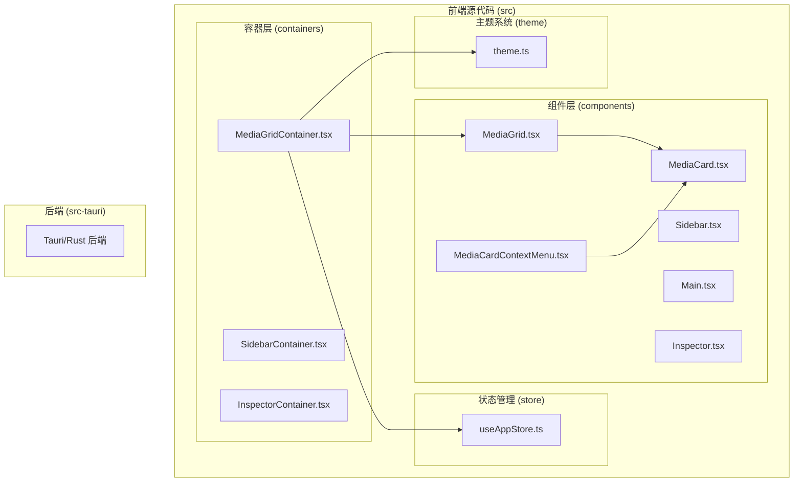
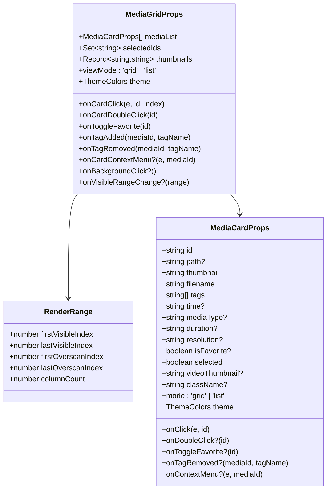
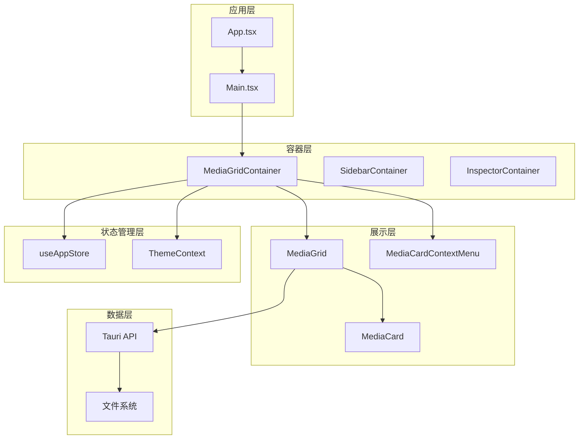
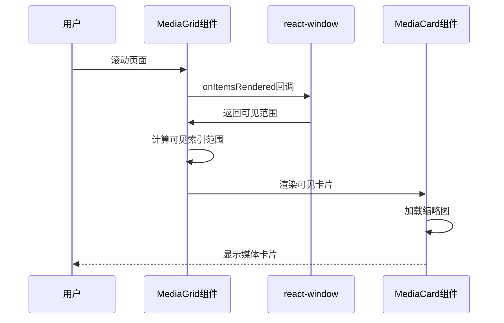
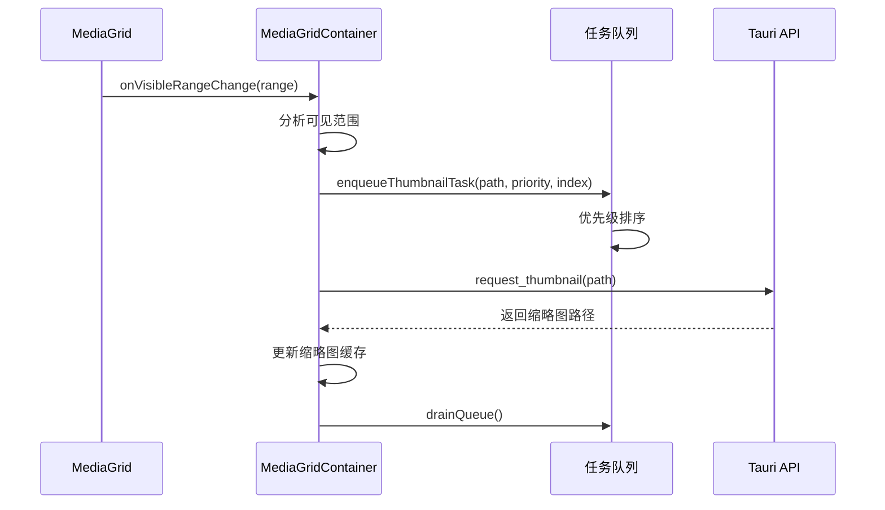
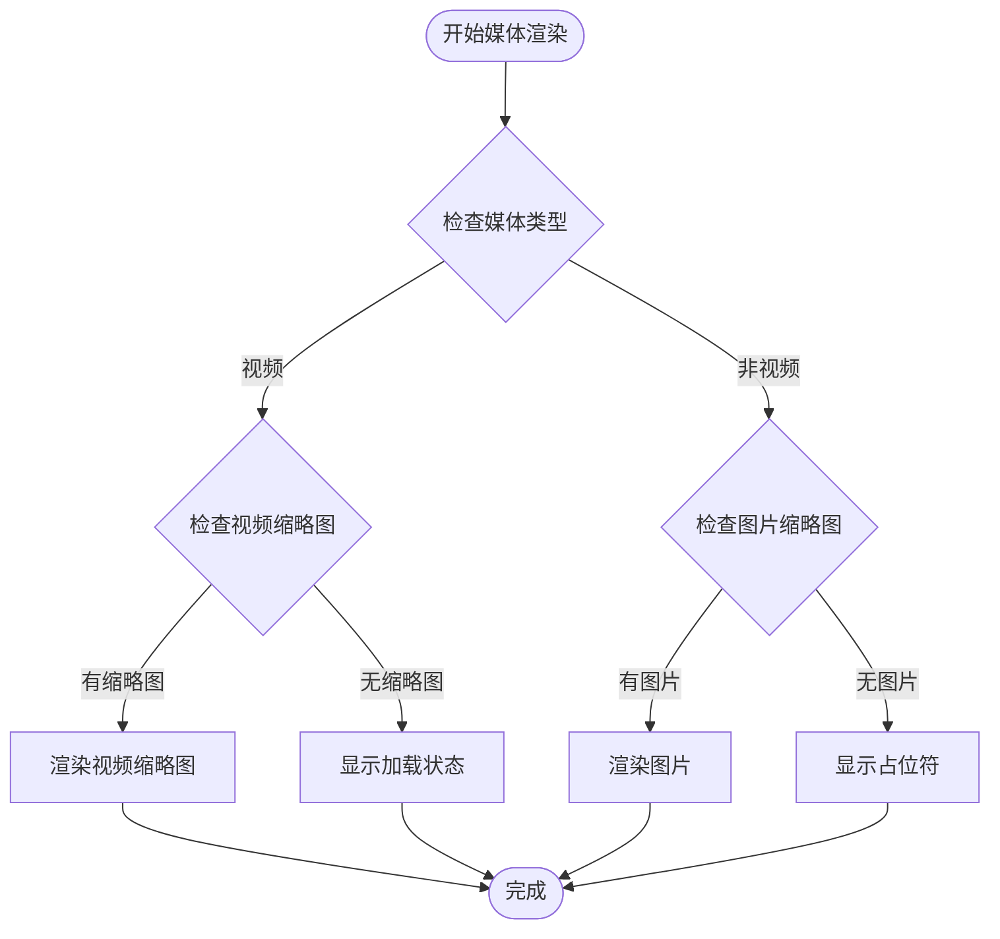
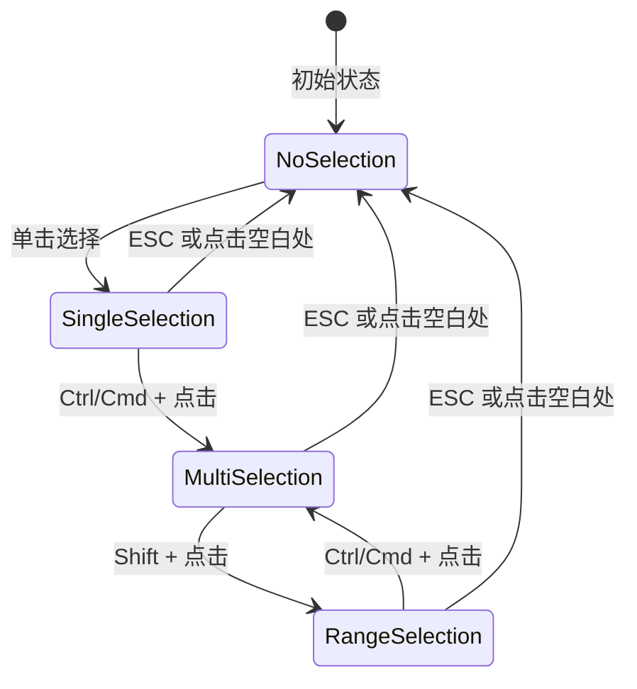
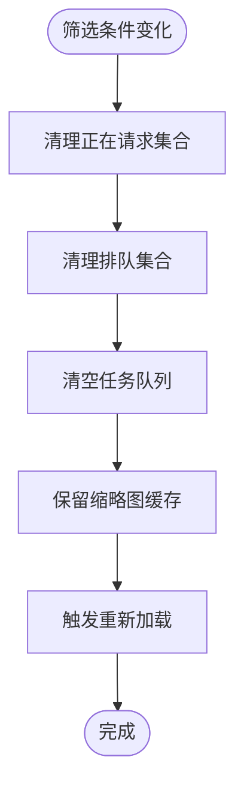

# MediaGrid 媒体网格组件

<cite>
**本文档引用的文件**
- [MediaGrid.tsx](file://src/components/MediaGrid.tsx)
- [MediaGridContainer.tsx](file://src/containers/MediaGridContainer.tsx)
- [MediaCard.tsx](file://src/components/MediaCard.tsx)
- [MediaCardContextMenu.tsx](file://src/components/MediaCardContextMenu.tsx)
- [useAppStore.ts](file://src/store/useAppStore.ts)
- [theme.ts](file://src/theme/theme.ts)
- [README.md](file://README.md)
- [package.json](file://package.json)
</cite>

## 目录
1. [简介](#简介)
2. [项目结构](#项目结构)
3. [核心组件](#核心组件)
4. [架构概览](#架构概览)
5. [详细组件分析](#详细组件分析)
6. [依赖分析](#依赖分析)
7. [性能考虑](#性能考虑)
8. [故障排除指南](#故障排除指南)
9. [结论](#结论)
10. [附录](#附录)

## 简介

MediaGrid 是 Medex 多媒体管理应用中的核心网格组件，负责高效展示大量媒体文件。该组件实现了基于 react-window 的虚拟滚动机制，支持网格和列表两种视图模式，具备响应式布局、懒加载缩略图、批量标签操作等高级功能。

Medex 应用基于 React + TypeScript + Tauri V2 + TailwindCSS 构建，采用三栏式布局：Sidebar（侧边栏）/ Main（主内容区）/ Inspector（检查器）。MediaGrid 作为主内容区的核心组件，为用户提供了流畅的媒体浏览体验。

**更新** 媒体网格组件最近进行了重大性能优化，新增了筛选条件变化时的请求状态清理机制，显著提升了缩略图请求管理效率和整体响应速度。

## 项目结构

Medex 项目采用模块化的组件架构，主要目录结构如下：



**图表来源**
- [MediaGrid.tsx:1-355](file://src/components/MediaGrid.tsx#L1-L355)
- [MediaGridContainer.tsx:1-627](file://src/containers/MediaGridContainer.tsx#L1-L627)
- [useAppStore.ts:1-337](file://src/store/useAppStore.ts#L1-L337)

**章节来源**
- [README.md:97-119](file://README.md#L97-L119)
- [package.json:12-22](file://package.json#L12-L22)

## 核心组件

MediaGrid 组件是整个媒体展示系统的核心，具有以下关键特性：

### 主要功能特性
- **虚拟滚动**：基于 react-window 实现高性能滚动
- **双视图模式**：网格视图和列表视图无缝切换
- **响应式布局**：自动适应容器尺寸变化
- **懒加载缩略图**：智能预取视频缩略图
- **批量选择**：支持 Ctrl/Cmd + 点击、Shift + 连续选择
- **主题集成**：深度集成主题系统，支持暗色/亮色主题

### 核心接口定义



**图表来源**
- [MediaGrid.tsx:16-30](file://src/components/MediaGrid.tsx#L16-L30)
- [MediaGrid.tsx:32-38](file://src/components/MediaGrid.tsx#L32-L38)
- [MediaCard.tsx:6-27](file://src/components/MediaCard.tsx#L6-L27)

**章节来源**
- [MediaGrid.tsx:16-30](file://src/components/MediaGrid.tsx#L16-L30)
- [MediaCard.tsx:6-27](file://src/components/MediaCard.tsx#L6-L27)

## 架构概览

MediaGrid 采用分层架构设计，通过容器组件与展示组件的分离实现关注点分离：



**图表来源**
- [MediaGridContainer.tsx:31-627](file://src/containers/MediaGridContainer.tsx#L31-L627)
- [MediaGrid.tsx:73-216](file://src/components/MediaGrid.tsx#L73-L216)

## 详细组件分析

### MediaGrid 组件详解

MediaGrid 是一个高度优化的虚拟滚动网格组件，实现了以下核心功能：

#### 虚拟滚动实现



**图表来源**
- [MediaGrid.tsx:187-210](file://src/components/MediaGrid.tsx#L187-L210)
- [MediaGrid.tsx:157-165](file://src/components/MediaGrid.tsx#L157-L165)

#### 响应式布局算法

MediaGrid 采用智能的列数计算算法，确保在不同屏幕尺寸下都能提供最佳的用户体验：

```mermaid
flowchart TD
Start([开始布局计算]) --> GetContainerSize[获取容器尺寸]
GetContainerSize --> CalcAvailableWidth[计算可用宽度<br/>availableWidth = width - padding*2]
CalcAvailableWidth --> CalcRawColumns[计算原始列数<br/>rawColumns = floor((availableWidth + gap)/cellWidth)]
CalcRawColumns --> EnsureMinColumns[确保最小列数<br/>columnCount = max(1, rawColumns)]
EnsureMinColumns --> CalcRowCount[计算行数<br/>rowCount = ceil(mediaCount/columnCount)]
CalcRowCount --> CalcGridHeight[计算网格高度<br/>gridHeight = max(0, height)]
CalcGridHeight --> RenderGrid[渲染网格]
RenderGrid --> End([完成])
```

**图表来源**
- [MediaGrid.tsx:96-98](file://src/components/MediaGrid.tsx#L96-L98)
- [MediaGrid.tsx:101-128](file://src/components/MediaGrid.tsx#L101-L128)

#### 缩略图懒加载机制

MediaGrid 实现了智能的缩略图预取系统，通过可见范围回调精确控制缩略图加载：



**图表来源**
- [MediaGridContainer.tsx:425-459](file://src/containers/MediaGridContainer.tsx#L425-L459)
- [MediaGridContainer.tsx:398-423](file://src/containers/MediaGridContainer.tsx#L398-L423)

**章节来源**
- [MediaGrid.tsx:73-216](file://src/components/MediaGrid.tsx#L73-L216)
- [MediaGrid.tsx:157-210](file://src/components/MediaGrid.tsx#L157-L210)
- [MediaGridContainer.tsx:425-459](file://src/containers/MediaGridContainer.tsx#L425-L459)

### MediaCard 组件分析

MediaCard 是 MediaGrid 中的单个媒体单元格，提供了丰富的交互功能：

#### 媒体类型处理



**图表来源**
- [MediaCard.tsx:153-184](file://src/components/MediaCard.tsx#L153-L184)
- [MediaCard.tsx:171-184](file://src/components/MediaCard.tsx#L171-L184)

#### 标签管理系统

MediaCard 实现了完整的标签交互系统，支持标签的添加、删除和批量操作：

**章节来源**
- [MediaCard.tsx:34-264](file://src/components/MediaCard.tsx#L34-L264)

### MediaGridContainer 状态管理

MediaGridContainer 作为容器组件，负责管理复杂的业务逻辑和状态：

#### 多选状态管理



**图表来源**
- [MediaGridContainer.tsx:61-93](file://src/containers/MediaGridContainer.tsx#L61-L93)

#### 批量标签操作

MediaGridContainer 实现了高效的批量标签操作功能，支持对多个媒体项目同时进行标签管理：

#### **更新** 筛选条件变化时的请求状态清理机制

**新增** 当筛选条件发生变化时，组件会自动清理缩略图请求状态，确保新筛选结果的缩略图能够正确加载：



**图表来源**
- [MediaGridContainer.tsx:235-243](file://src/containers/MediaGridContainer.tsx#L235-L243)

#### 缩略图请求管理优化

**新增** 优化了缩略图请求管理，包括：

1. **请求状态清理**：筛选条件变化时自动清理请求状态
2. **队列容量控制**：限制最大队列大小防止内存溢出
3. **并发请求控制**：限制同时进行的缩略图请求数量
4. **优先级调度**：实现三级优先级的任务调度系统

**章节来源**
- [MediaGridContainer.tsx:61-93](file://src/containers/MediaGridContainer.tsx#L61-L93)
- [MediaGridContainer.tsx:147-177](file://src/containers/MediaGridContainer.tsx#L147-L177)
- [MediaGridContainer.tsx:235-243](file://src/containers/MediaGridContainer.tsx#L235-L243)

## 依赖分析

MediaGrid 组件依赖于多个关键技术和库：

```mermaid
graph TB
subgraph "核心依赖"
React[React 18.3.1]
TypeScript[TypeScript 5.5]
TailwindCSS[TailwindCSS 3.4]
end
subgraph "第三方库"
ReactWindow[react-window 1.8.10]
Zusta[useState 4.5.5]
TauriAPI[@tauri-apps/api 2.0]
DialogPlugin[@tauri-apps/plugin-dialog 2.0]
end
subgraph "构建工具"
Vite[Vite 5.4]
PostCSS[PostCSS 8.4]
Autoprefixer[Autorpfixer 10.4]
end
MediaGrid --> React
MediaGrid --> ReactWindow
MediaGrid --> TauriAPI
MediaGrid --> TailwindCSS
MediaGridContainer --> Zusta
MediaGridContainer --> DialogPlugin
```

**图表来源**
- [package.json:12-22](file://package.json#L12-L22)

### 关键依赖说明

| 依赖包 | 版本 | 用途 |
|--------|------|------|
| react-window | ^1.8.10 | 虚拟滚动实现 |
| @tauri-apps/api | ^2.0.0 | 桌面应用 API |
| @tauri-apps/plugin-dialog | ^2.0.0 | 对话框插件 |
| zustand | ^4.5.5 | 状态管理 |
| react | ^18.3.1 | 核心框架 |
| react-dnd | ^16.0.1 | 拖拽功能 |

**章节来源**
- [package.json:12-22](file://package.json#L12-L22)

## 性能考虑

MediaGrid 组件在设计时充分考虑了性能优化，采用了多种策略来确保在大数据集下的流畅体验：

### 虚拟滚动优化

1. **智能可视区域计算**：通过 `onItemsRendered` 回调精确计算可见范围
2. **合理的预取策略**：使用 `overscanRowCount` 和 `overscanColumnCount` 控制预渲染数量
3. **内存管理**：只渲染可视区域内的组件实例

### 缩略图加载优化

**更新** 最近进行了重大性能优化：

1. **请求状态清理机制**：筛选条件变化时自动清理请求状态，避免重复请求
2. **智能队列管理**：实现三级优先级的任务调度系统
3. **并发控制优化**：限制同时进行的缩略图请求数量（MAX_CONCURRENT = 5）
4. **缓存机制增强**：使用内存缓存避免重复请求，同时保留缩略图缓存
5. **队列容量限制**：防止内存溢出（MAX_QUEUE_SIZE = 400）

### 渲染优化策略

1. **React.memo 优化**：对组件进行记忆化处理
2. **useMemo 优化**：避免不必要的对象重建
3. **ResizeObserver**：高效监听容器尺寸变化
4. **懒加载**：图片和视频缩略图的延迟加载

**章节来源**
- [MediaGrid.tsx:187-188](file://src/components/MediaGrid.tsx#L187-L188)
- [MediaGridContainer.tsx:28-29](file://src/containers/MediaGridContainer.tsx#L28-L29)
- [MediaGridContainer.tsx:360-396](file://src/containers/MediaGridContainer.tsx#L360-L396)
- [MediaGridContainer.tsx:235-243](file://src/containers/MediaGridContainer.tsx#L235-L243)

## 故障排除指南

### 常见问题及解决方案

#### 缩略图不显示问题

**症状**：视频缩略图长时间显示加载状态或空白

**可能原因**：
1. 缩略图生成服务未启动
2. 文件路径转换错误
3. 网络连接问题

**解决方案**：
1. 检查 Tauri 后端服务状态
2. 验证文件路径格式
3. 确认网络连接正常

#### **更新** 筛选条件变化后缩略图加载异常

**症状**：筛选条件变化后缩略图不更新或显示错误

**可能原因**：
1. 请求状态未正确清理
2. 缓存数据过期
3. 队列状态异常

**解决方案**：
1. 确认筛选条件变化时的请求状态清理机制正常工作
2. 检查缩略图缓存是否正确保留
3. 验证队列状态是否重置

#### 性能问题

**症状**：滚动卡顿或内存占用过高

**可能原因**：
1. 虚拟滚动配置不当
2. 缩略图队列过大
3. 组件重渲染过多

**解决方案**：
1. 调整 `overscan` 参数
2. 限制队列大小
3. 检查组件记忆化设置

#### 布局异常

**症状**：网格布局错乱或卡片重叠

**可能原因**：
1. 容器尺寸监听失效
2. CSS 样式冲突
3. 响应式断点问题

**解决方案**：
1. 检查 ResizeObserver 设置
2. 验证 TailwindCSS 类名
3. 调整断点配置

**章节来源**
- [MediaGrid.tsx:327-355](file://src/components/MediaGrid.tsx#L327-L355)
- [MediaCard.tsx:165-170](file://src/components/MediaCard.tsx#L165-L170)

## 结论

MediaGrid 媒体网格组件是一个高度优化的虚拟滚动组件，成功解决了大数据集下的性能瓶颈问题。通过合理的架构设计、智能的缩略图加载策略和完善的响应式布局，为用户提供了流畅的媒体浏览体验。

**更新** 最近的性能优化包括：

1. **筛选条件变化时的请求状态清理机制**：确保新筛选结果的缩略图能够正确加载
2. **优化的缩略图请求管理**：包括智能队列管理、并发控制和缓存机制
3. **增强的内存管理**：防止内存溢出，提升整体性能

组件的主要优势包括：
- 基于 react-window 的高性能虚拟滚动
- 智能的缩略图预取和缓存机制
- 支持网格和列表双视图模式
- 完善的主题系统集成
- 批量选择和标签操作功能
- **新增** 高效的筛选条件变化处理机制

未来可以进一步优化的方向包括：
- 更精细的内存管理策略
- 更智能的预取算法
- 更丰富的交互手势支持

## 附录

### 配置选项参考

| 属性名 | 类型 | 必需 | 描述 |
|--------|------|------|------|
| mediaList | MediaCardProps[] | 是 | 媒体项目数组 |
| selectedIds | Set<string> | 是 | 选中项目的 ID 集合 |
| onCardClick | Function | 是 | 卡片点击回调 |
| onCardDoubleClick | Function | 是 | 卡片双击回调 |
| onToggleFavorite | Function | 是 | 收藏状态切换回调 |
| onTagAdded | Function | 是 | 标签添加回调 |
| onTagRemoved | Function | 是 | 标签移除回调 |
| thumbnails | Record<string,string> | 是 | 缩略图映射表 |
| viewMode | 'grid' \| 'list' | 是 | 视图模式 |
| theme | ThemeColors | 是 | 主题配置 |

### 使用场景示例

1. **媒体库浏览**：展示大量图片和视频文件
2. **标签筛选**：基于标签进行媒体筛选和组织
3. **批量操作**：支持多选和批量标签管理
4. **主题切换**：支持暗色和亮色主题切换
5. ****更新** 筛选条件动态变化**：支持实时筛选和缩略图更新

### 自定义和扩展

组件支持通过以下方式进行定制：
- 修改网格尺寸和间距参数
- 自定义主题颜色配置
- 扩展媒体类型支持
- 添加新的交互手势
- **新增** 调整缩略图请求参数（MAX_CONCURRENT、MAX_QUEUE_SIZE）