# 主内容组件 (Main)

<cite>
**本文档引用的文件**
- [Main.tsx](file://src/components/Main.tsx)
- [MediaGridContainer.tsx](file://src/containers/MediaGridContainer.tsx)
- [SidebarContainer.tsx](file://src/containers/SidebarContainer.tsx)
- [InspectorContainer.tsx](file://src/containers/InspectorContainer.tsx)
- [App.tsx](file://src/App.tsx)
- [theme.ts](file://src/theme/theme.ts)
- [ThemeContext.tsx](file://src/contexts/ThemeContext.tsx)
- [useAppStore.ts](file://src/store/useAppStore.ts)
- [MediaGrid.tsx](file://src/components/MediaGrid.tsx)
- [MediaCard.tsx](file://src/components/MediaCard.tsx)
- [Sidebar.tsx](file://src/components/Sidebar.tsx)
- [Inspector.tsx](file://src/components/Inspector.tsx)
- [ToolbarContainer.tsx](file://src/containers/ToolbarContainer.tsx)
- [MediaCardContextMenu.tsx](file://src/components/MediaCardContextMenu.tsx)
- [security.rs](file://src-tauri/src/services/security.rs)
- [Settings.tsx](file://src/pages/Settings.tsx)
- [en-US.json](file://src/i18n/en-US.json)
- [zh-CN.json](file://src/i18n/zh-CN.json)
</cite>

## 更新摘要
**变更内容**
- 新增刷新按钮功能说明，支持手动刷新页面数据
- 添加生产环境右键菜单禁用机制，增强应用安全性
- 补充与后端安全系统的完整集成说明，包括密码验证和锁屏功能
- 更新组件交互模式和数据流向分析

## 目录
1. [简介](#简介)
2. [项目结构](#项目结构)
3. [核心组件](#核心组件)
4. [架构概览](#架构概览)
5. [详细组件分析](#详细组件分析)
6. [依赖分析](#依赖分析)
7. [性能考虑](#性能考虑)
8. [故障排除指南](#故障排除指南)
9. [结论](#结论)
10. [附录](#附录)

## 简介

主内容组件（Main）是 Medex 应用程序的核心布局容器，负责协调侧边栏、媒体网格和检查器三个主要区域的布局关系。该组件采用 Flexbox 布局系统，实现了响应式的三栏布局设计，支持媒体库管理、标签筛选、收藏管理和批量操作等功能。

**更新** 新增了刷新按钮功能，允许用户手动刷新页面数据；在生产环境中禁用右键菜单以增强应用安全性；与后端安全系统深度集成，提供应用密码保护功能。

## 项目结构

Medex 采用模块化的组件架构，Main 组件作为中央布局容器，与侧边栏、媒体网格和检查器形成清晰的职责分离：

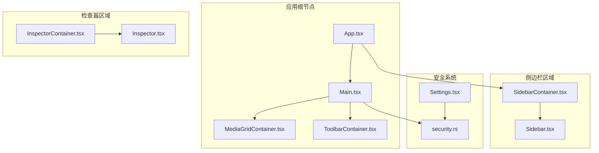

**图表来源**
- [App.tsx:59-71](file://src/App.tsx#L59-L71)
- [Main.tsx:8-24](file://src/components/Main.tsx#L8-L24)
- [security.rs:1-45](file://src-tauri/src/services/security.rs#L1-L45)

**章节来源**
- [App.tsx:8-72](file://src/App.tsx#L8-L72)
- [Main.tsx:1-25](file://src/components/Main.tsx#L1-L25)

## 核心组件

### Main 组件架构

Main 组件采用简洁的三层布局结构：

1. **头部区域**：显示媒体网格标题和刷新按钮
2. **工具栏区域**：提供筛选和视图控制
3. **内容区域**：嵌套媒体网格容器

组件通过 Tailwind CSS 实现响应式设计，支持最小宽度约束和溢出处理。

**更新** 新增了刷新按钮，提供手动刷新功能，支持国际化标题和样式定制。

**章节来源**
- [Main.tsx:8-24](file://src/components/Main.tsx#L8-L24)
- [Main.tsx:18-44](file://src/components/Main.tsx#L18-L44)

### 布局算法

Main 组件实现了以下布局算法：

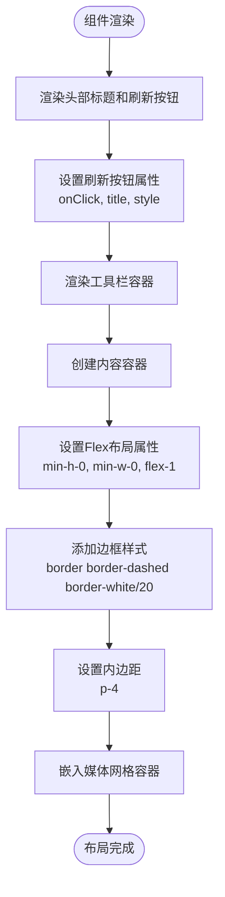

**图表来源**
- [Main.tsx:10-21](file://src/components/Main.tsx#L10-L21)

**章节来源**
- [Main.tsx:10-21](file://src/components/Main.tsx#L10-L21)

## 架构概览

### 整体架构设计

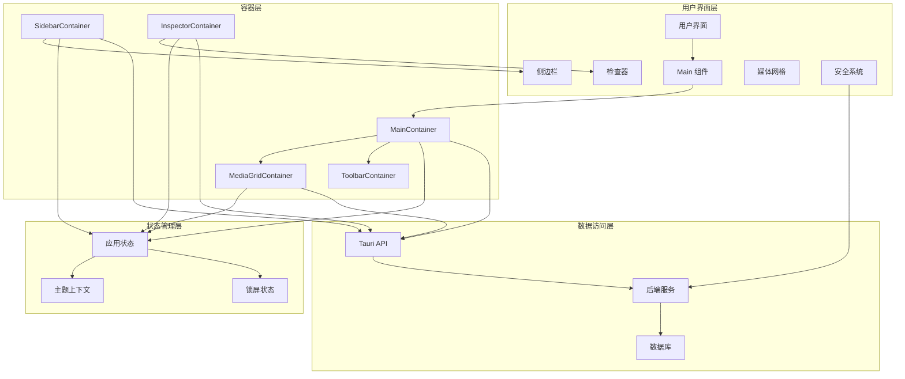

**图表来源**
- [App.tsx:59-71](file://src/App.tsx#L59-L71)
- [Main.tsx:8-24](file://src/components/Main.tsx#L8-L24)

### 数据流架构

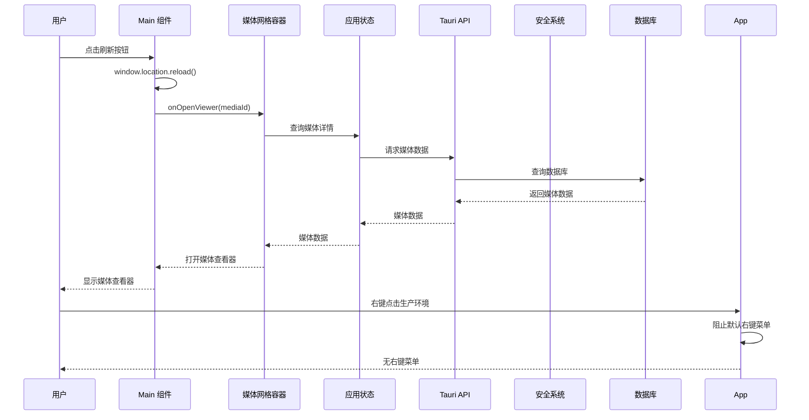

**图表来源**
- [App.tsx:28-42](file://src/App.tsx#L28-L42)
- [Main.tsx:5](file://src/components/Main.tsx#L5)
- [App.tsx:226-236](file://src/App.tsx#L226-L236)

**章节来源**
- [App.tsx:28-42](file://src/App.tsx#L28-L42)
- [useAppStore.ts:145-394](file://src/store/useAppStore.ts#L145-L394)

## 详细组件分析

### Main 组件详细分析

#### 布局结构分析

Main 组件采用语义化 HTML 结构，通过 CSS 类名实现样式控制：

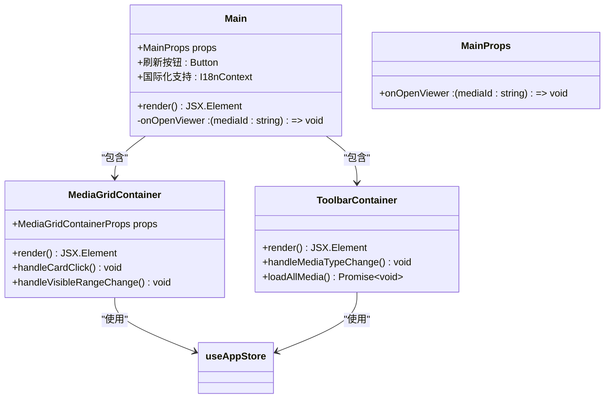

**图表来源**
- [Main.tsx:4-6](file://src/components/Main.tsx#L4-L6)
- [MediaGridContainer.tsx:12-14](file://src/containers/MediaGridContainer.tsx#L12-L14)
- [ToolbarContainer.tsx:14](file://src/containers/ToolbarContainer.tsx#L14)

#### 尺寸计算逻辑

Main 组件的尺寸计算遵循以下规则：

1. **最小尺寸约束**：使用 `min-h-0` 和 `min-w-0` 确保组件可以收缩到内容大小
2. **弹性增长**：通过 `flex-1` 实现剩余空间的自动分配
3. **容器边界**：外层容器设置 `rounded` 和 `border` 样式
4. **内边距控制**：使用 `p-4` 设置统一的内边距

**更新** 新增了刷新按钮的尺寸和样式计算，支持响应式设计和主题定制。

**章节来源**
- [Main.tsx:10-21](file://src/components/Main.tsx#L10-L21)

### 刷新按钮功能

#### 功能实现

Main 组件新增了刷新按钮功能，提供手动刷新页面的能力：

```mermaid
flowchart TD
RefreshButton[刷新按钮] --> Click[用户点击]
Click --> Reload[window.location.reload()]
Reload --> Cache[清除缓存]
Cache --> Rebuild[重建DOM]
Rebuild --> DataFetch[重新获取数据]
DataFetch --> UIUpdate[更新界面]
UIUpdate --> Complete[刷新完成]
```

**图表来源**
- [Main.tsx:18-44](file://src/components/Main.tsx#L18-L44)

#### 国际化支持

刷新按钮支持多语言国际化：

- **中文**：`"toolbar.refreshButton": "刷新"`
- **英文**：`"toolbar.refreshButton": "Refresh"`

**章节来源**
- [Main.tsx:18-44](file://src/components/Main.tsx#L18-L44)
- [zh-CN.json:46](file://src/i18n/zh-CN.json#L46)
- [en-US.json:46](file://src/i18n/en-US.json#L46)

### 生产环境右键菜单禁用机制

#### 安全机制实现

App.tsx 中实现了生产环境下的右键菜单禁用机制：

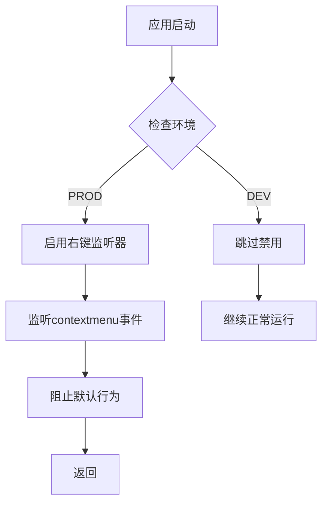

**图表来源**
- [App.tsx:226-236](file://src/App.tsx#L226-L236)

#### 安全考虑

- **仅在生产环境启用**：开发环境保持正常的右键菜单功能
- **事件监听管理**：正确清理事件监听器，防止内存泄漏
- **用户体验平衡**：在安全性和可用性之间取得平衡

**章节来源**
- [App.tsx:226-236](file://src/App.tsx#L226-L236)

### 与后端安全系统的集成

#### 应用密码功能

系统集成了完整的应用密码保护功能：

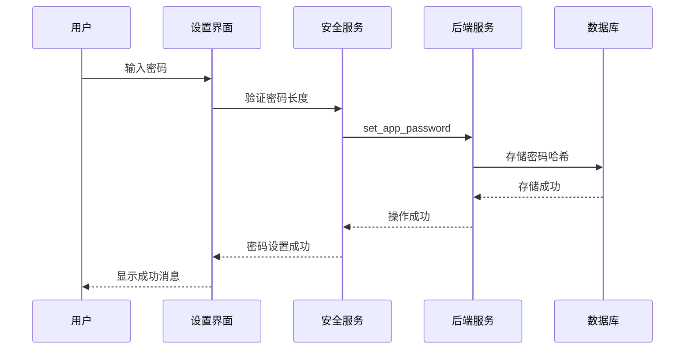

**图表来源**
- [Settings.tsx:74-89](file://src/pages/Settings.tsx#L74-L89)
- [security.rs:8-19](file://src-tauri/src/services/security.rs#L8-L19)

#### 锁屏机制

应用实现了智能的锁屏保护：

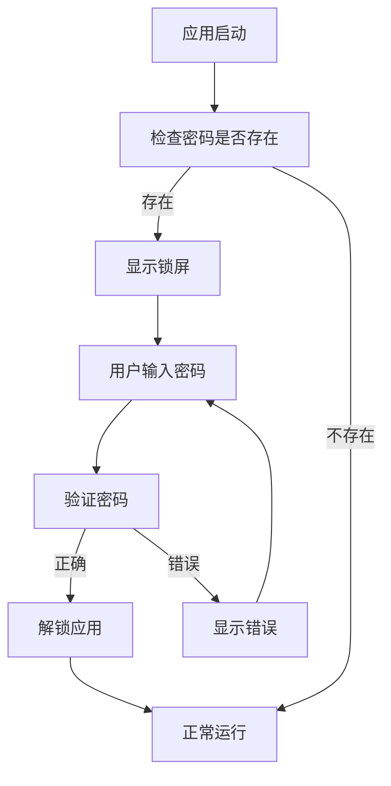

**图表来源**
- [App.tsx:67-110](file://src/App.tsx#L67-L110)
- [security.rs:22-33](file://src-tauri/src/services/security.rs#L22-L33)

**章节来源**
- [Settings.tsx:74-89](file://src/pages/Settings.tsx#L74-L89)
- [security.rs:8-44](file://src-tauri/src/services/security.rs#L8-L44)
- [App.tsx:67-110](file://src/App.tsx#L67-L110)

### 媒体网格容器分析

#### 媒体网格容器架构

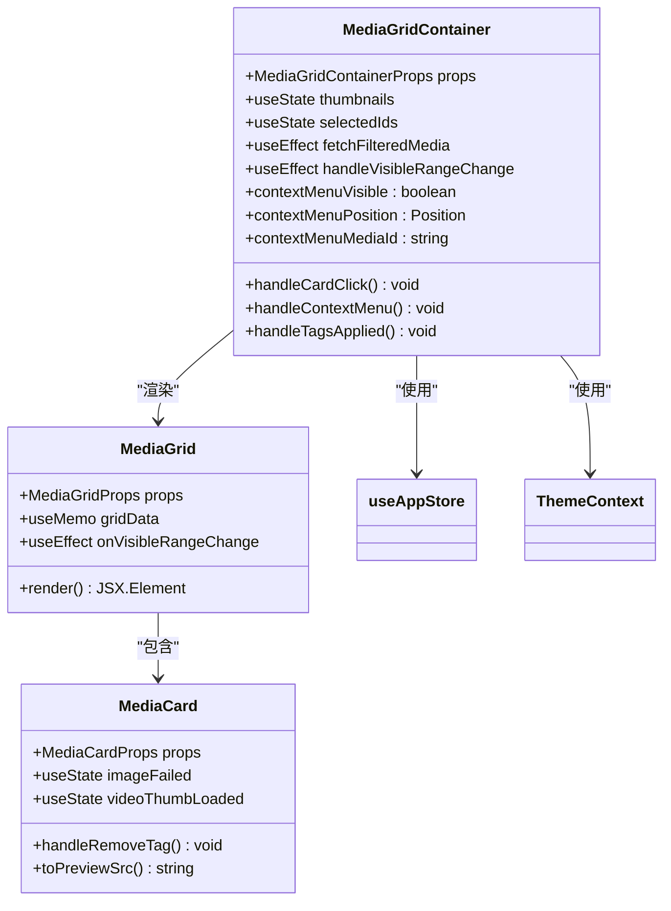

**图表来源**
- [MediaGridContainer.tsx:30-618](file://src/containers/MediaGridContainer.tsx#L30-L618)
- [MediaGrid.tsx:70-212](file://src/components/MediaGrid.tsx#L70-L212)
- [MediaCard.tsx:34-264](file://src/components/MediaCard.tsx#L34-L264)

#### 响应式适配机制

媒体网格实现了智能的响应式适配：

1. **动态列数计算**：基于容器宽度自动计算列数
2. **固定尺寸网格**：使用 `react-window` 实现虚拟化渲染
3. **滚动优化**：支持大列表的高性能滚动
4. **预加载策略**：为可见区域和可视范围内的项目预加载缩略图

**章节来源**
- [MediaGrid.tsx:92-96](file://src/components/MediaGrid.tsx#L92-L96)
- [MediaGrid.tsx:170-211](file://src/components/MediaGrid.tsx#L170-L211)

### 侧边栏容器分析

#### 侧边栏交互模式

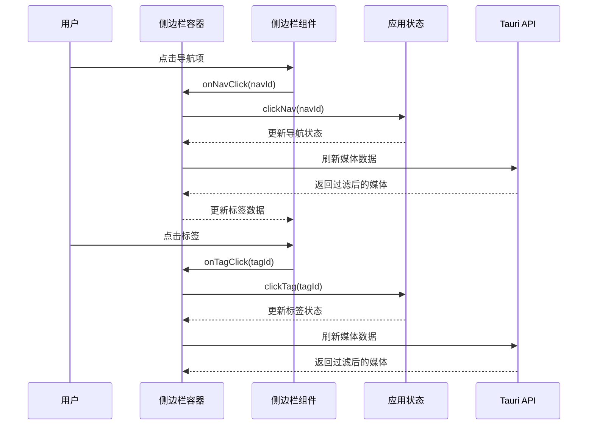

**图表来源**
- [SidebarContainer.tsx:66-76](file://src/containers/SidebarContainer.tsx#L66-L76)
- [useAppStore.ts:152-172](file://src/store/useAppStore.ts#L152-L172)

**章节来源**
- [SidebarContainer.tsx:66-76](file://src/containers/SidebarContainer.tsx#L66-L76)
- [Sidebar.tsx:45-70](file://src/components/Sidebar.tsx#L45-L70)

### 检查器容器分析

#### 检查器数据流

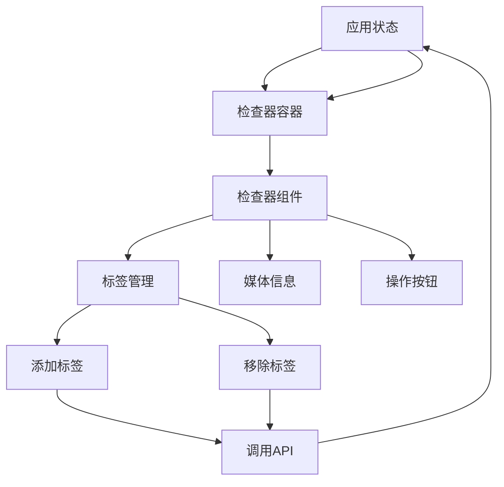

**图表来源**
- [InspectorContainer.tsx:6-31](file://src/containers/InspectorContainer.tsx#L6-L31)
- [Inspector.tsx:19-264](file://src/components/Inspector.tsx#L19-L264)

**章节来源**
- [InspectorContainer.tsx:6-31](file://src/containers/InspectorContainer.tsx#L6-L31)
- [Inspector.tsx:19-264](file://src/components/Inspector.tsx#L19-L264)

## 依赖分析

### 组件依赖关系

```mermaid
graph TB
subgraph "外部依赖"
React[React]
Tauri[Tauri API]
Window[react-window]
Zustand[Zustand]
Tailwind[Tailwind CSS]
Argon2[Argon2加密]
end
subgraph "内部组件"
Main[Main]
MediaGridContainer[MediaGridContainer]
SidebarContainer[SidebarContainer]
InspectorContainer[InspectorContainer]
MediaGrid[MediaGrid]
MediaCard[MediaCard]
Sidebar[Sidebar]
Inspector[Inspector]
ToolbarContainer[ToolbarContainer]
MediaCardContextMenu[MediaCardContextMenu]
end
subgraph "上下文"
ThemeContext[ThemeContext]
AppStore[AppStore]
I18nContext[I18nContext]
end
subgraph "后端服务"
SecurityService[Security Service]
end
Main --> MediaGridContainer
Main --> ToolbarContainer
MediaGridContainer --> MediaGrid
MediaGrid --> MediaCard
SidebarContainer --> Sidebar
InspectorContainer --> Inspector
MediaGridContainer --> ThemeContext
MediaGridContainer --> AppStore
MediaGrid --> ThemeContext
MediaGrid --> AppStore
SidebarContainer --> ThemeContext
SidebarContainer --> AppStore
InspectorContainer --> ThemeContext
InspectorContainer --> AppStore
ToolbarContainer --> ThemeContext
ToolbarContainer --> AppStore
Main --> I18nContext
MediaCardContextMenu --> I18nContext
MediaGridContainer --> Tauri
SidebarContainer --> Tauri
InspectorContainer --> Tauri
ToolbarContainer --> Tauri
MediaGridContainer --> Argon2
SecurityService --> Argon2
Main --> React
MediaGridContainer --> React
SidebarContainer --> React
InspectorContainer --> React
MediaGrid --> React
MediaCard --> React
Sidebar --> React
Inspector --> React
ToolbarContainer --> React
MediaCardContextMenu --> React
MediaGridContainer --> Window
MediaGrid --> Window
MediaGridContainer --> Zustand
MediaGrid --> Zustand
SidebarContainer --> Zustand
InspectorContainer --> Zustand
ToolbarContainer --> Zustand
Main --> Zustand
Main --> Tailwind
MediaGridContainer --> Tailwind
SidebarContainer --> Tailwind
InspectorContainer --> Tailwind
MediaGrid --> Tailwind
MediaCard --> Tailwind
Sidebar --> Tailwind
Inspector --> Tailwind
ToolbarContainer --> Tailwind
MediaCardContextMenu --> Tailwind
```

**图表来源**
- [Main.tsx:1-2](file://src/components/Main.tsx#L1-L2)
- [MediaGridContainer.tsx:1-10](file://src/containers/MediaGridContainer.tsx#L1-L10)
- [SidebarContainer.tsx:1-5](file://src/containers/SidebarContainer.tsx#L1-L5)
- [InspectorContainer.tsx:1-4](file://src/containers/InspectorContainer.tsx#L1-L4)

### 数据流向分析

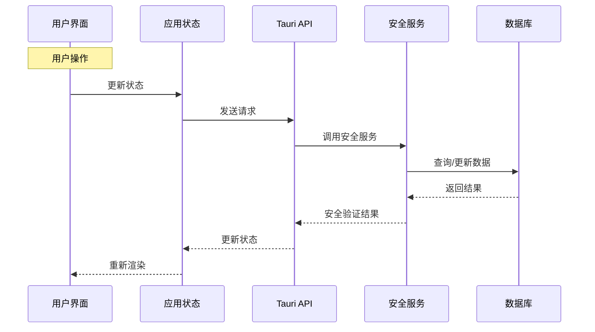

**图表来源**
- [useAppStore.ts:145-394](file://src/store/useAppStore.ts#L145-L394)

**章节来源**
- [useAppStore.ts:145-394](file://src/store/useAppStore.ts#L145-L394)

## 性能考虑

### 优化策略

1. **虚拟化渲染**：使用 react-window 实现媒体网格的虚拟化，只渲染可见区域
2. **状态管理优化**：通过 useMemo 和 useCallback 避免不必要的重渲染
3. **图片懒加载**：媒体卡片支持懒加载，提升初始渲染性能
4. **事件监听优化**：合理清理事件监听器，防止内存泄漏
5. **安全机制优化**：右键菜单禁用仅在生产环境启用，减少不必要的事件处理

### 内存管理

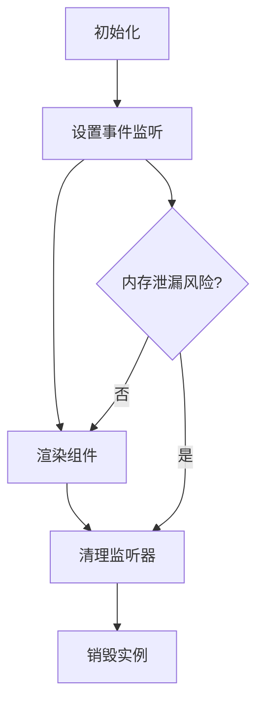

**章节来源**
- [MediaGridContainer.tsx:453-494](file://src/containers/MediaGridContainer.tsx#L453-L494)
- [MediaGrid.tsx:323-350](file://src/components/MediaGrid.tsx#L323-L350)

## 故障排除指南

### 常见问题及解决方案

#### 媒体网格不显示

**症状**：媒体网格显示为空白或只有占位符

**可能原因**：
1. 媒体库路径未设置
2. 数据库连接失败
3. 网络问题导致缩略图加载失败

**解决方案**：
1. 检查媒体库路径设置
2. 验证数据库连接状态
3. 确认网络连接正常

#### 缩略图加载失败

**症状**：视频缩略图显示加载中状态

**可能原因**：
1. 缩略图生成任务排队
2. 文件路径解析错误
3. 权限问题

**解决方案**：
1. 等待缩略图生成队列处理
2. 检查文件路径格式
3. 验证文件访问权限

#### 刷新按钮无效

**症状**：点击刷新按钮无反应

**可能原因**：
1. 浏览器缓存问题
2. 网络连接异常
3. 应用状态异常

**解决方案**：
1. 清除浏览器缓存
2. 检查网络连接
3. 重新启动应用

#### 生产环境右键菜单问题

**症状**：右键菜单无法使用

**可能原因**：
1. 应用处于生产环境
2. 右键菜单禁用机制生效
3. 浏览器安全设置

**解决方案**：
1. 确认应用环境设置
2. 检查安全设置
3. 在开发环境进行测试

**章节来源**
- [MediaGridContainer.tsx:334-340](file://src/containers/MediaGridContainer.tsx#L334-L340)
- [MediaGridContainer.tsx:457-474](file://src/containers/MediaGridContainer.tsx#L457-L474)

## 结论

Main 主内容组件成功实现了 Medex 应用的核心布局功能，通过合理的组件分层和数据流设计，提供了流畅的用户体验。组件具有以下特点：

1. **清晰的职责分离**：Main 专注于布局，具体功能由容器组件实现
2. **响应式设计**：支持不同屏幕尺寸的自适应布局
3. **高性能渲染**：采用虚拟化技术处理大量媒体数据
4. **主题集成**：完整的主题系统支持深色/浅色模式切换
5. **安全增强**：生产环境右键菜单禁用机制，提升应用安全性
6. **手动刷新**：提供刷新按钮，支持手动数据刷新
7. **安全系统集成**：与后端安全系统深度集成，提供应用密码保护

通过持续优化状态管理和性能监控，Main 组件将继续为用户提供优秀的媒体管理体验。

## 附录

### 样式定制选项

Main 组件支持以下样式定制：

- **背景色**：通过 `bg-medexMain` 类名控制
- **文本颜色**：通过 `text-medexText` 类名控制
- **边框样式**：使用 `border-dashed border-white/20` 实现虚线边框
- **圆角设置**：通过 `rounded` 类名实现圆角效果
- **刷新按钮样式**：支持主题定制的颜色和边框

### 主题集成方式

组件通过 ThemeContext 提供主题支持：

1. **主题模式**：支持 dark、light、system 三种模式
2. **颜色变量**：使用 CSS 自定义属性实现主题切换
3. **动态更新**：支持运行时主题切换

**章节来源**
- [theme.ts:104-150](file://src/theme/theme.ts#L104-L150)
- [ThemeContext.tsx:17-90](file://src/contexts/ThemeContext.tsx#L17-L90)

### 安全系统集成

#### 应用密码功能

- **密码长度限制**：6-20字符
- **密码哈希存储**：使用 Argon2 加密算法
- **密码验证**：实时验证用户输入的密码
- **密码清除**：支持清除已设置的应用密码

#### 锁屏保护

- **自动锁屏**：应用最小化时自动锁屏
- **密码验证**：解锁时验证用户输入的密码
- **错误处理**：密码错误时显示提示信息
- **本地存储**：密码状态存储在本地

**章节来源**
- [security.rs:8-44](file://src-tauri/src/services/security.rs#L8-L44)
- [Settings.tsx:74-89](file://src/pages/Settings.tsx#L74-L89)
- [App.tsx:67-110](file://src/App.tsx#L67-L110)