# 侧边栏组件 (Sidebar)

<cite>
**本文档引用的文件**
- [Sidebar.tsx](file://src/components/Sidebar.tsx)
- [SidebarContainer.tsx](file://src/containers/SidebarContainer.tsx)
- [TagItem.tsx](file://src/components/TagItem.tsx)
- [ThemeContext.tsx](file://src/contexts/ThemeContext.tsx)
- [I18nContext.tsx](file://src/contexts/I18nContext.tsx)
- [theme.ts](file://src/theme/theme.ts)
- [useAppStore.ts](file://src/store/useAppStore.ts)
- [en-US.json](file://src/i18n/en-US.json)
- [zh-CN.json](file://src/i18n/zh-CN.json)
- [Settings.tsx](file://src/pages/Settings.tsx)
- [index.css](file://src/index.css)
- [tailwind.config.ts](file://src/tailwind.config.ts)
- [App.tsx](file://src/App.tsx)
- [README.md](file://README.md)
</cite>

## 更新摘要
**变更内容**
- Sidebar 组件进行了显著的布局改进，采用新的 flexbox 布局系统
- 标签管理部分重构，实现更好的溢出处理和响应式设计
- 条件删除按钮显示逻辑优化，仅在标签无媒体关联时显示
- 新增底部占位区域，确保标签列表不会延伸到设置按钮区域
- 改进的标签列表滚动机制和包装布局

## 目录
1. [简介](#简介)
2. [项目结构](#项目结构)
3. [核心组件](#核心组件)
4. [架构概览](#架构概览)
5. [详细组件分析](#详细组件分析)
6. [国际化功能](#国际化功能)
7. [依赖关系分析](#依赖关系分析)
8. [性能考虑](#性能考虑)
9. [故障排除指南](#故障排除指南)
10. [结论](#结论)
11. [附录](#附录)

## 简介

Sidebar 侧边栏组件是 Medex 多媒体管理应用的核心导航组件，负责提供应用的主要导航功能和标签管理系统。该组件采用现代化的 React + TypeScript 架构，集成了完整的主题系统、响应式设计、可访问性特性和国际化功能。

Medex 应用采用三栏式布局：Sidebar（侧边栏）+ Main（主内容区）+ Inspector（检查器），Sidebar 作为用户与应用交互的主要入口点，提供导航菜单和标签管理功能。组件现已支持中英文双语界面，为全球用户提供本地化的使用体验。

**更新** 组件现已完全国际化，使用 `useI18n()` 钩子和 `t()` 函数进行翻译，所有导航标签和UI文本均通过翻译系统提供多语言支持。布局系统已重构为基于 Flexbox 的现代化设计，提供更好的响应式体验和溢出处理。

## 项目结构

Sidebar 组件在项目中的组织结构如下：

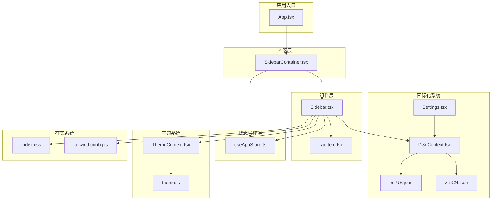

**图表来源**
- [Sidebar.tsx:1-176](file://src/components/Sidebar.tsx#L1-L176)
- [SidebarContainer.tsx:1-81](file://src/containers/SidebarContainer.tsx#L1-L81)
- [I18nContext.tsx:1-51](file://src/contexts/I18nContext.tsx#L1-L51)
- [en-US.json:1-128](file://src/i18n/en-US.json#L1-L128)
- [zh-CN.json:1-128](file://src/i18n/zh-CN.json#L1-L128)
- [Settings.tsx:1-342](file://src/pages/Settings.tsx#L1-L342)

**章节来源**
- [README.md:123-140](file://README.md#L123-L140)
- [App.tsx:59-72](file://src/App.tsx#L59-L72)

## 核心组件

### SidebarProps 接口定义

Sidebar 组件通过清晰的 TypeScript 接口定义了所有必要的属性和回调函数：

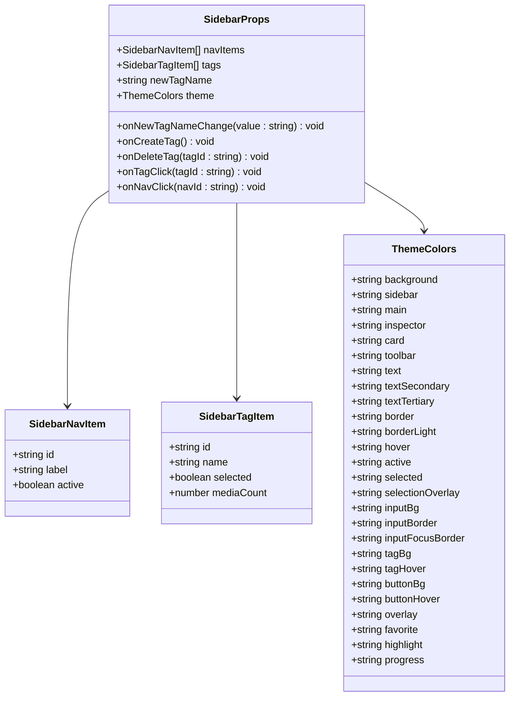

**图表来源**
- [Sidebar.tsx:6-16](file://src/components/Sidebar.tsx#L6-L16)
- [useAppStore.ts:3-14](file://src/store/useAppStore.ts#L3-L14)
- [theme.ts:8-52](file://src/theme/theme.ts#L8-L52)

### 主要功能特性

1. **现代化 Flexbox 布局**：采用全新的 flexbox 布局系统，提供更好的响应式设计
2. **标签管理重构**：标签区域采用新的布局结构，支持更好的溢出处理
3. **条件删除按钮**：仅在标签无媒体关联时显示删除按钮
4. **底部占位区域**：预留设置按钮高度，防止标签列表覆盖
5. **滚动优化**：标签列表区域实现独立滚动，提升用户体验
6. **主题适配**：完全集成的深色/浅色主题系统
7. **国际化支持**：中英文双语界面切换
8. **响应式设计**：适应不同屏幕尺寸的布局
9. **可访问性**：支持键盘导航和屏幕阅读器

**更新** 组件现已完全国际化，所有UI文本通过 `useI18n()` 钩子动态获取翻译。布局系统已重构为基于 Flexbox 的现代化设计，提供更好的响应式体验和溢出处理。

**章节来源**
- [Sidebar.tsx:18-176](file://src/components/Sidebar.tsx#L18-L176)
- [useAppStore.ts:70-81](file://src/store/useAppStore.ts#L70-L81)

## 架构概览

Sidebar 组件采用了分层架构设计，确保了良好的关注点分离和可维护性：

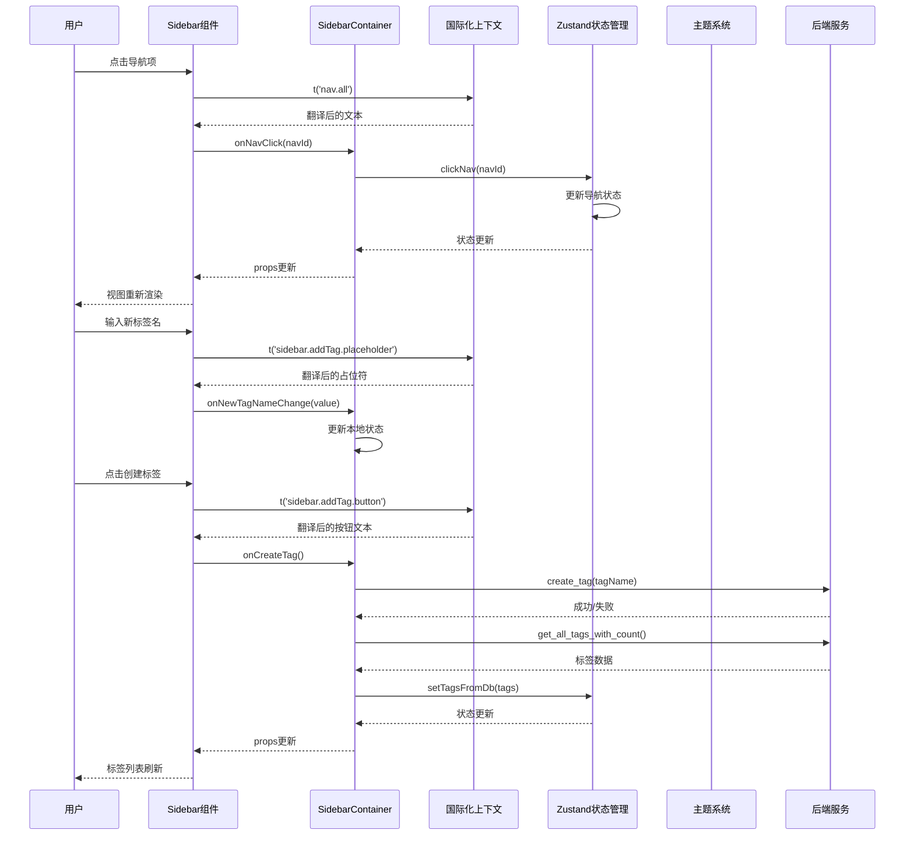

**图表来源**
- [SidebarContainer.tsx:35-63](file://src/containers/SidebarContainer.tsx#L35-L63)
- [useAppStore.ts:152-173](file://src/store/useAppStore.ts#L152-L173)
- [I18nContext.tsx:40-43](file://src/contexts/I18nContext.tsx#L40-L43)

## 详细组件分析

### Sidebar 主组件

Sidebar 组件实现了完整的侧边栏功能，包括导航菜单和标签管理区域，并集成了国际化功能。**更新** 组件现已采用全新的 Flexbox 布局系统，提供更好的响应式设计和溢出处理。

#### Flexbox 布局系统

组件采用了现代化的 Flexbox 布局，实现了垂直方向的灵活布局：

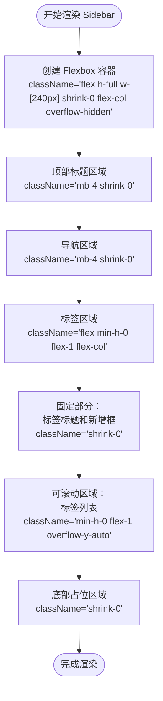

**图表来源**
- [Sidebar.tsx:32-39](file://src/components/Sidebar.tsx#L32-L39)
- [Sidebar.tsx:90-172](file://src/components/Sidebar.tsx#L90-L172)

#### 导航项渲染逻辑

导航项的渲染采用了条件样式绑定，根据激活状态动态调整外观：

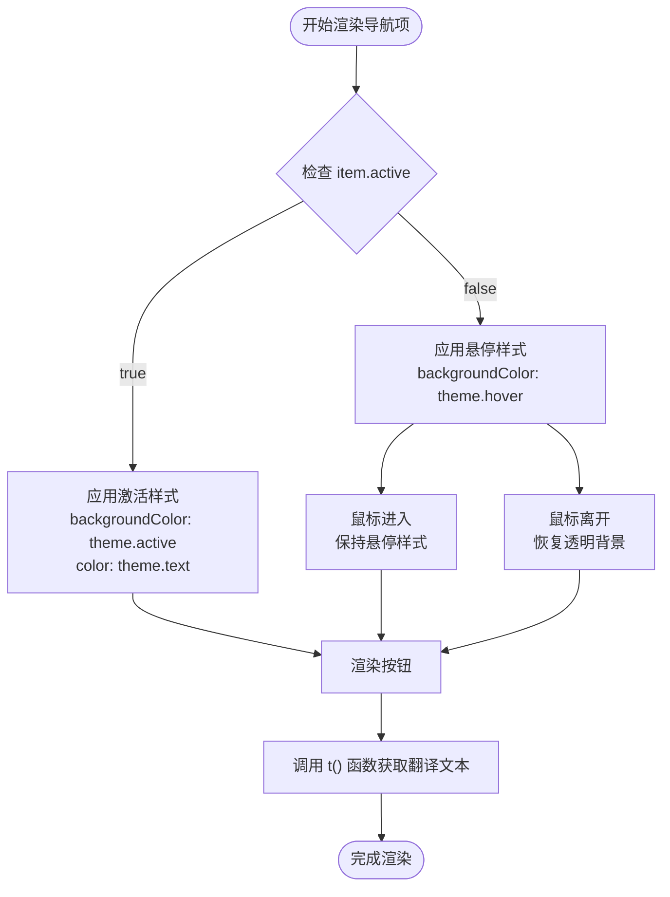

**图表来源**
- [Sidebar.tsx:62-84](file://src/components/Sidebar.tsx#L62-L84)

#### 标签管理区域重构

**更新** 标签管理区域已完全重构，采用新的 Flexbox 布局：

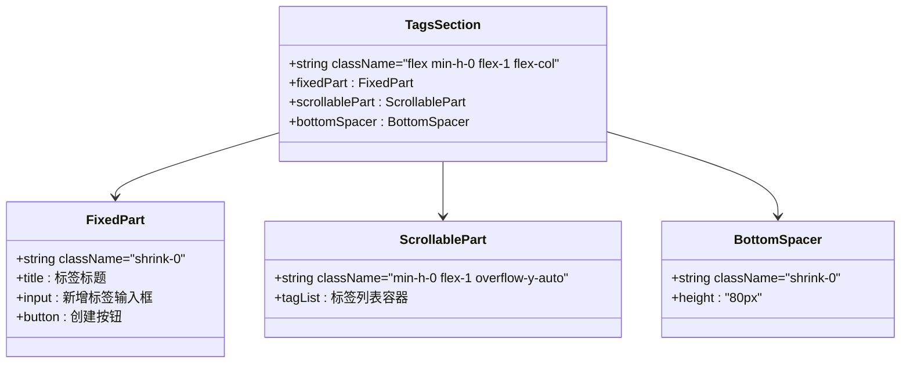

**图表来源**
- [Sidebar.tsx:90-172](file://src/components/Sidebar.tsx#L90-L172)

#### 标签创建和删除机制

标签管理功能提供了完整的 CRUD 操作：

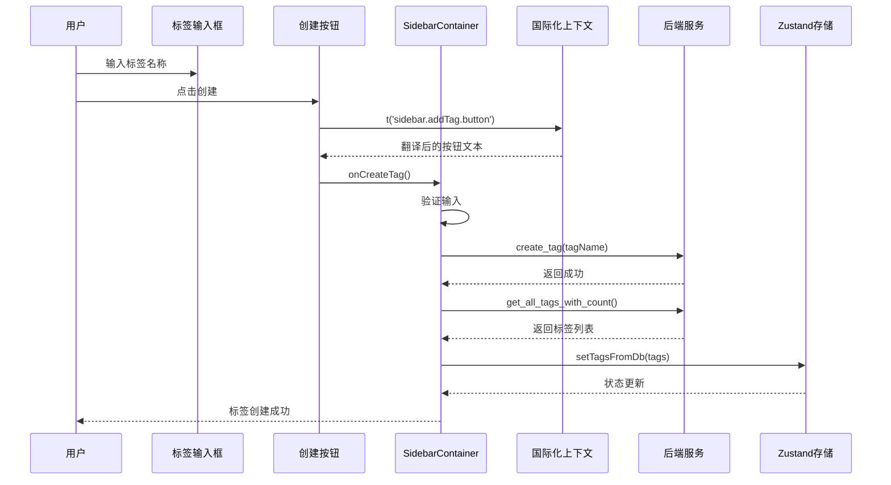

**图表来源**
- [SidebarContainer.tsx:37-53](file://src/containers/SidebarContainer.tsx#L37-L53)
- [Sidebar.tsx:101-152](file://src/components/Sidebar.tsx#L101-L152)

#### 标签项组件

TagItem 子组件负责单个标签的显示和交互，**更新** 现在实现了条件删除按钮显示逻辑：

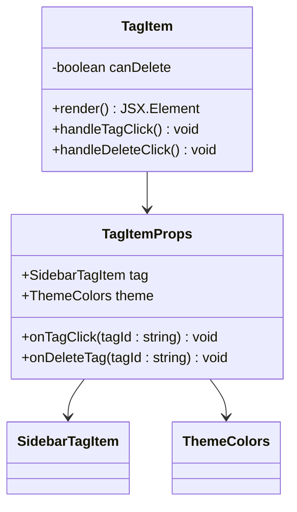

**图表来源**
- [TagItem.tsx:5-10](file://src/components/TagItem.tsx#L5-L10)
- [TagItem.tsx:12-71](file://src/components/TagItem.tsx#L12-L71)

**更新** 条件删除按钮显示逻辑：
- `canDelete = (tag.mediaCount ?? 0) === 0`
- 仅当标签媒体计数为 0 时才显示删除按钮
- 使用 `group-hover:opacity-100` 实现悬停显示效果

**章节来源**
- [Sidebar.tsx:18-176](file://src/components/Sidebar.tsx#L18-L176)
- [TagItem.tsx:12-71](file://src/components/TagItem.tsx#L12-L71)

### SidebarContainer 容器组件

SidebarContainer 作为容器组件，负责处理业务逻辑和数据流：

#### 状态管理集成

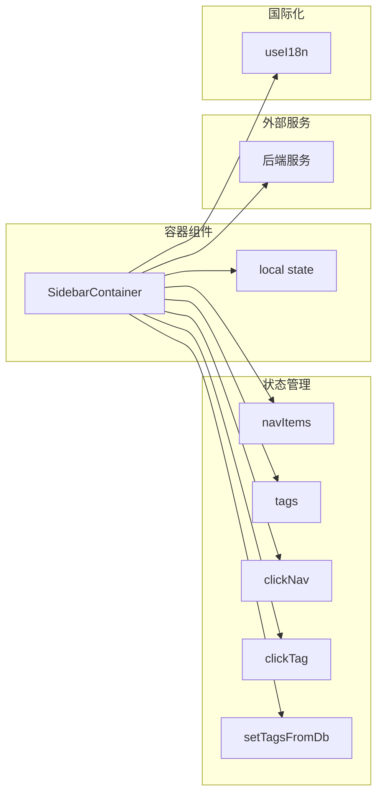

**图表来源**
- [SidebarContainer.tsx:8-35](file://src/containers/SidebarContainer.tsx#L8-L35)
- [useAppStore.ts:145-394](file://src/store/useAppStore.ts#L145-L394)

#### 标签生命周期管理

容器组件实现了完整的标签生命周期管理：

**章节来源**
- [SidebarContainer.tsx:16-35](file://src/containers/SidebarContainer.tsx#L16-L35)
- [SidebarContainer.tsx:37-65](file://src/containers/SidebarContainer.tsx#L37-L65)

### 主题系统集成

Sidebar 组件完全集成了 Medex 的主题系统，支持深色/浅色主题切换：

#### 主题颜色配置

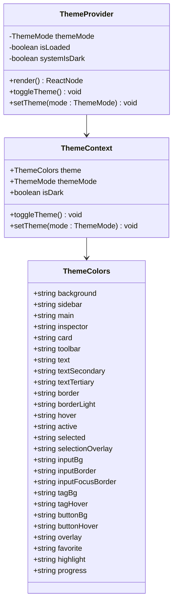

**图表来源**
- [theme.ts:8-52](file://src/theme/theme.ts#L8-L52)
- [ThemeContext.tsx:6-13](file://src/contexts/ThemeContext.tsx#L6-L13)
- [ThemeContext.tsx:17-99](file://src/contexts/ThemeContext.tsx#L17-L99)

#### 主题切换机制

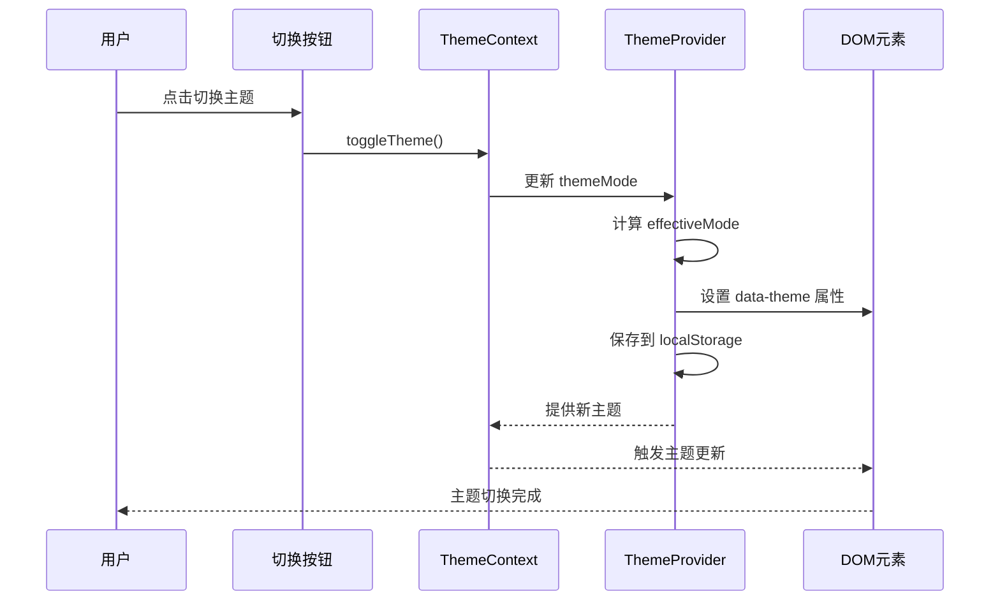

**图表来源**
- [ThemeContext.tsx:68-83](file://src/contexts/ThemeContext.tsx#L68-L83)
- [ThemeContext.tsx:43-54](file://src/contexts/ThemeContext.tsx#L43-L54)

**章节来源**
- [theme.ts:104-159](file://src/theme/theme.ts#L104-L159)
- [ThemeContext.tsx:17-99](file://src/contexts/ThemeContext.tsx#L17-L99)

## 国际化功能

### I18nContext 国际化上下文

Sidebar 组件集成了完整的国际化功能，通过 I18nContext 提供多语言支持：

#### 国际化上下文实现

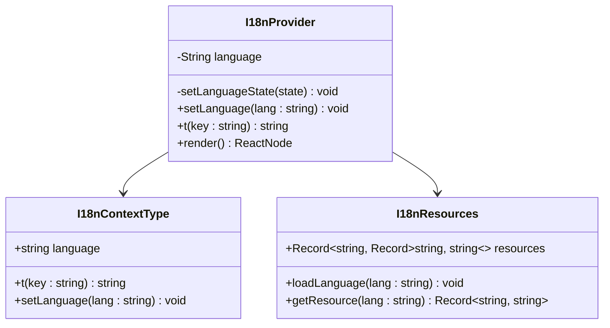

**图表来源**
- [I18nContext.tsx:5-20](file://src/contexts/I18nContext.tsx#L5-L20)
- [I18nContext.tsx:22-51](file://src/contexts/I18nContext.tsx#L22-L51)

#### 语言资源管理

国际化系统支持中英文双语，通过 JSON 文件管理翻译资源：

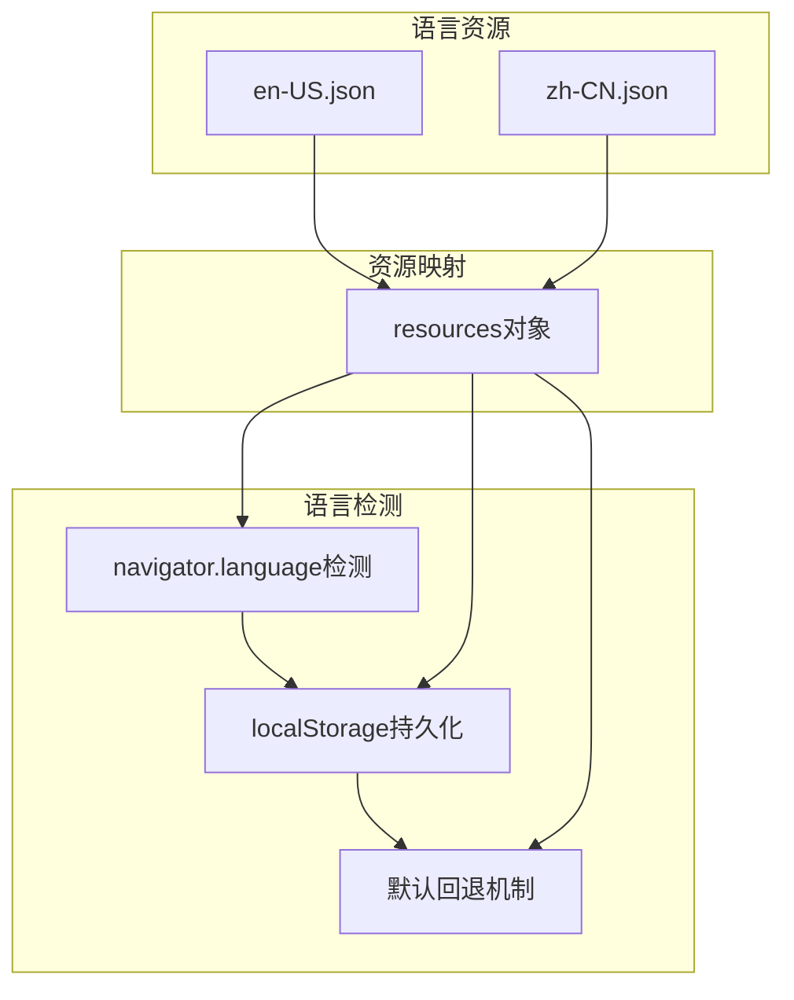

**图表来源**
- [en-US.json:1-128](file://src/i18n/en-US.json#L1-L128)
- [zh-CN.json:1-128](file://src/i18n/zh-CN.json#L1-L128)
- [I18nContext.tsx:11-31](file://src/contexts/I18nContext.tsx#L11-L31)

#### 翻译键值系统

Sidebar 组件使用标准化的翻译键值系统：

| 翻译键 | 用途 | 示例文本 |
|--------|------|----------|
| `sidebar.title` | 侧边栏标题 | Medex |
| `sidebar.subtitle` | 侧边栏副标题 | Media Management |
| `sidebar.navigation` | 导航标题 | Navigation |
| `sidebar.tags` | 标签标题 | Tags |
| `sidebar.addTag.placeholder` | 新标签输入框占位符 | New tag |
| `sidebar.addTag.button` | 新标签创建按钮 | Add |
| `nav.all` | 全部媒体导航项 | All Media |
| `nav.favorites` | 收藏导航项 | Favorites |
| `nav.recent` | 最近导航项 | Recent |
| `tag.mediaCount` | 标签媒体计数 | Media count |
| `actions.deleteTag` | 删除标签动作 | Delete tag |

**更新** 所有导航项和UI文本现在都通过 `t()` 函数动态获取翻译，支持实时语言切换。

**章节来源**
- [I18nContext.tsx:1-51](file://src/contexts/I18nContext.tsx#L1-L51)
- [en-US.json:33-42](file://src/i18n/en-US.json#L33-L42)
- [zh-CN.json:33-42](file://src/i18n/zh-CN.json#L33-L42)

### Settings 页面国际化集成

Settings 页面提供了语言切换功能，与 Sidebar 组件形成完整的国际化体系：

#### 语言设置界面

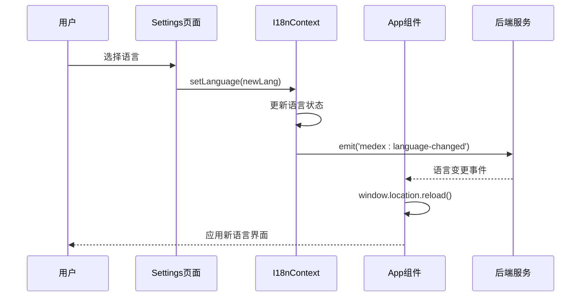

**图表来源**
- [Settings.tsx:144-160](file://src/pages/Settings.tsx#L144-L160)
- [App.tsx:127-158](file://src/App.tsx#L127-L158)

#### 语言切换机制

语言切换通过事件系统实现跨窗口同步：

**章节来源**
- [Settings.tsx:135-172](file://src/pages/Settings.tsx#L135-L172)
- [App.tsx:126-158](file://src/App.tsx#L126-L158)

## 依赖关系分析

Sidebar 组件的依赖关系展现了清晰的分层架构：

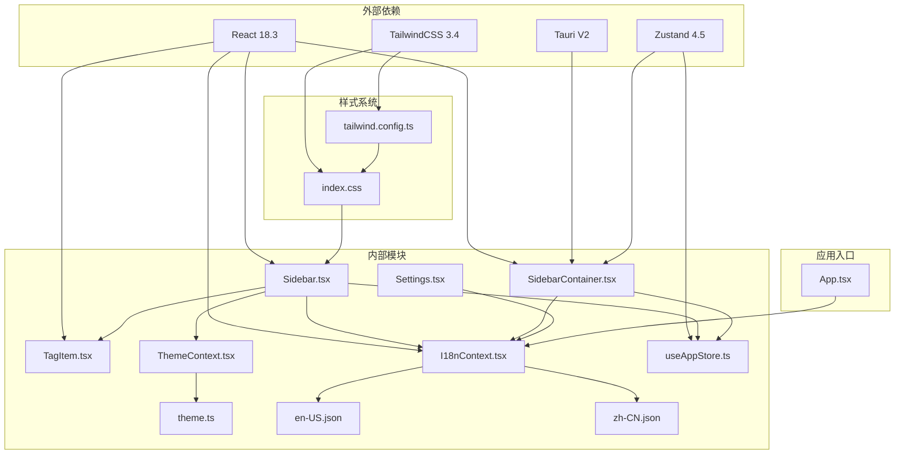

**图表来源**
- [Sidebar.tsx:1-5](file://src/components/Sidebar.tsx#L1-L5)
- [SidebarContainer.tsx:2-7](file://src/containers/SidebarContainer.tsx#L2-L7)
- [I18nContext.tsx:1-4](file://src/contexts/I18nContext.tsx#L1-L4)
- [useAppStore.ts:1](file://src/store/useAppStore.ts#L1)
- [ThemeContext.tsx:2](file://src/contexts/ThemeContext.tsx#L2)
- [theme.ts:2](file://src/theme/theme.ts#L2)

### 组件耦合度分析

- **低耦合高内聚**：Sidebar 组件专注于 UI 渲染，业务逻辑集中在容器组件
- **清晰的职责分离**：导航逻辑、标签管理、主题处理、国际化各自独立
- **松散耦合**：通过 props 和回调函数进行通信，减少直接依赖
- **国际化解耦**：I18nContext 提供独立的语言服务，不影响其他组件

**更新** 国际化功能通过 `useI18n()` 钩子实现，与组件的其他功能解耦，提高了代码的可维护性。

**章节来源**
- [Sidebar.tsx:18-28](file://src/components/Sidebar.tsx#L18-L28)
- [SidebarContainer.tsx:67-80](file://src/containers/SidebarContainer.tsx#L67-L80)

## 性能考虑

### 渲染优化策略

1. **Flexbox 布局优化**：使用 `min-h-0` 和 `flex-1` 实现精确的高度计算
2. **条件渲染**：仅在必要时重新渲染标签项
3. **事件委托**：使用事件冒泡减少事件处理器数量
4. **样式缓存**：主题颜色通过上下文传递，避免重复计算
5. **翻译缓存**：useMemo 优化翻译函数，避免重复计算
6. **滚动优化**：标签列表独立滚动，避免整体重排

### 内存管理

- **清理事件监听器**：在组件卸载时移除事件监听器
- **防抖处理**：对频繁触发的操作进行防抖优化
- **状态最小化**：只存储必要的状态数据
- **语言资源缓存**：翻译资源通过上下文共享，避免重复加载
- **Flexbox 优化**：使用 `shrink-0` 防止元素被意外收缩

### 性能监控

- **控制台日志**：关键操作添加日志输出便于调试
- **错误边界**：异常情况下的优雅降级处理
- **语言切换优化**：通过事件系统实现页面级语言切换

## 故障排除指南

### 常见问题及解决方案

#### 标签无法创建

**问题症状**：输入标签名称后点击创建按钮无反应

**可能原因**：
1. 输入为空或仅包含空白字符
2. 后端服务调用失败
3. 网络连接问题

**解决步骤**：
1. 检查输入框是否为空
2. 查看浏览器控制台错误信息
3. 验证后端服务状态
4. 确认网络连接正常

#### 标签删除失败

**问题症状**：点击删除按钮后标签仍然存在

**可能原因**：
1. 标签被选中且仍有媒体关联
2. 删除权限不足
3. 数据库事务失败

**解决步骤**：
1. 确保标签未被选中
2. 检查标签媒体计数是否为 0
3. 验证用户权限
4. 查看后端错误日志

#### 标签删除按钮不显示

**问题症状**：标签列表中的删除按钮始终不显示

**可能原因**：
1. 标签媒体计数不正确
2. `canDelete` 逻辑错误
3. CSS 样式问题

**解决步骤**：
1. 检查 `tag.mediaCount` 是否为 0
2. 验证 `canDelete = (tag.mediaCount ?? 0) === 0` 逻辑
3. 检查 `group-hover:opacity-100` 样式是否正确
4. 确认 `max-w-[150px] truncate` 样式不影响按钮显示

#### 标签列表溢出问题

**问题症状**：标签列表超出容器高度或覆盖底部区域

**可能原因**：
1. `min-h-0` 和 `flex-1` 类使用不当
2. 底部占位区域高度不正确
3. 滚动容器设置错误

**解决步骤**：
1. 确认标签区域使用 `flex min-h-0 flex-1 flex-col`
2. 验证滚动容器使用 `min-h-0 flex-1 overflow-y-auto`
3. 检查底部占位区域 `height: '80px'`
4. 确认固定部分使用 `shrink-0`

#### 主题切换无效

**问题症状**：切换主题后界面颜色未改变

**可能原因**：
1. localStorage 权限问题
2. CSS 变量未正确更新
3. 缓存问题

**解决步骤**：
1. 检查浏览器 localStorage 支持
2. 刷新页面强制重新加载样式
3. 清除浏览器缓存
4. 验证 CSS 变量定义

#### 语言切换失效

**问题症状**：切换语言后界面文本未更新

**可能原因**：
1. 事件系统未正确触发
2. localStorage 保存失败
3. 页面未重新加载
4. 翻译资源加载失败

**解决步骤**：
1. 检查浏览器控制台是否有事件错误
2. 验证 localStorage 是否正常工作
3. 确认页面是否重新加载
4. 检查翻译资源文件是否存在
5. 验证翻译键值是否正确

**更新** 对于国际化相关的问题，还需要检查：
- `useI18n()` 钩子是否正确初始化
- 翻译键值是否存在于对应的 JSON 文件中
- `I18nProvider` 是否正确包装了应用

**章节来源**
- [SidebarContainer.tsx:21-23](file://src/containers/SidebarContainer.tsx#L21-L23)
- [SidebarContainer.tsx:47-50](file://src/containers/SidebarContainer.tsx#L47-L50)
- [App.tsx:126-158](file://src/App.tsx#L126-L158)

## 结论

Sidebar 侧边栏组件展现了现代前端开发的最佳实践，通过清晰的架构设计、完善的主题系统集成、优秀的用户体验设计和完整的国际化支持，为 Medex 应用提供了强大的导航和标签管理功能。

组件的主要优势包括：

1. **现代化布局**：采用 Flexbox 布局系统，提供更好的响应式设计
2. **重构的标签管理**：新的布局结构支持更好的溢出处理和用户体验
3. **智能删除控制**：仅在标签无媒体关联时显示删除按钮
4. **精确的空间管理**：底部占位区域确保标签列表不会覆盖设置按钮
5. **架构清晰**：分层设计确保了良好的可维护性和扩展性
6. **主题完整**：深色/浅色主题的无缝切换提升了用户体验
7. **功能完整**：导航和标签管理功能一应俱全
8. **国际化完善**：中英文双语支持，为全球化应用奠定基础
9. **性能优秀**：合理的渲染策略和内存管理
10. **易于使用**：直观的 API 设计和丰富的配置选项

**更新** 组件现已完全国际化，使用 `useI18n()` 钩子和 `t()` 函数提供多语言支持，所有UI文本都可以动态切换。布局系统已重构为基于 Flexbox 的现代化设计，提供更好的响应式体验和溢出处理。

未来可以考虑的功能增强：
- 添加更多语言支持
- 实现标签搜索和过滤功能
- 实现标签拖拽排序
- 增加标签分组和层级管理
- 优化移动端响应式设计
- 添加语言包热更新机制

## 附录

### 组件使用模式

#### 基本使用模式

```typescript
// 在应用中使用 Sidebar 组件
<Sidebar
  navItems={navItems}
  tags={tags}
  newTagName={newTagName}
  onNewTagNameChange={setNewTagName}
  onCreateTag={handleCreateTag}
  onDeleteTag={handleDeleteTag}
  onTagClick={handleTagClick}
  onNavClick={handleNavClick}
  theme={theme}
/>
```

#### 国际化集成模式

```typescript
// 在组件中使用国际化功能
const { t, language, setLanguage } = useI18n();

// 获取翻译文本
const translatedText = t('sidebar.title');

// 切换语言
setLanguage('zh-CN');
```

#### 最佳实践建议

1. **状态管理**：使用容器组件处理复杂的状态逻辑
2. **主题适配**：始终通过 ThemeContext 获取主题颜色
3. **国际化**：使用标准化的翻译键值系统
4. **错误处理**：为异步操作提供适当的错误处理
5. **性能优化**：合理使用 React.memo 和 useMemo
6. **可访问性**：确保组件支持键盘导航和屏幕阅读器
7. **语言切换**：通过事件系统实现跨窗口语言同步
8. **Flexbox 优化**：正确使用 `min-h-0` 和 `flex-1` 实现精确布局
9. **条件渲染**：利用 `canDelete` 逻辑优化删除按钮显示
10. **滚动优化**：使用独立滚动容器提升用户体验

### API 参考

#### SidebarProps 接口方法

| 方法名 | 参数类型 | 返回值 | 描述 |
|--------|----------|--------|------|
| onNavClick | (navId: string) => void | void | 导航项点击事件处理器 |
| onTagClick | (tagId: string) => void | void | 标签点击事件处理器 |
| onDeleteTag | (tagId: string) => void | void | 标签删除事件处理器 |
| onCreateTag | () => void | void | 标签创建事件处理器 |
| onNewTagNameChange | (value: string) => void | void | 新标签名称变更处理器 |

#### 国际化 API

| 方法名 | 参数类型 | 返回值 | 描述 |
|--------|----------|--------|------|
| t | (key: string) => string | string | 获取翻译文本的函数 |
| language | string | string | 当前语言代码 |
| setLanguage | (lang: string) => void | void | 设置语言的函数 |

#### 主题颜色配置

组件支持以下主题颜色变量：
- `background`: 基础背景色
- `sidebar`: 侧边栏背景色
- `text`: 主要文本颜色
- `textSecondary`: 次要文本颜色
- `textTertiary`: 第三文本颜色
- `border`: 主要边框颜色
- `borderLight`: 轻量边框颜色
- `hover`: 悬停状态颜色
- `active`: 激活状态颜色
- `selected`: 选中状态颜色
- `inputBg`: 输入框背景色
- `inputBorder`: 输入框边框颜色
- `buttonBg`: 按钮背景色
- `buttonHover`: 按钮悬停颜色
- `tagHover`: 标签悬停颜色

### 翻译键值参考

#### Sidebar 组件翻译键值

| 键值 | 语言 | 文本 |
|------|------|------|
| `sidebar.title` | zh-CN | Medex |
| `sidebar.title` | en-US | Medex |
| `sidebar.subtitle` | zh-CN | 媒体管理 |
| `sidebar.subtitle` | en-US | Media Management |
| `sidebar.navigation` | zh-CN | 导航 |
| `sidebar.navigation` | en-US | Navigation |
| `sidebar.tags` | zh-CN | 标签 |
| `sidebar.tags` | en-US | Tags |
| `sidebar.addTag.placeholder` | zh-CN | 新增标签 |
| `sidebar.addTag.placeholder` | en-US | New tag |
| `sidebar.addTag.button` | zh-CN | 新增 |
| `sidebar.addTag.button` | en-US | Add |

#### 导航项翻译键值

| 键值 | 语言 | 文本 |
|------|------|------|
| `nav.all` | zh-CN | 所有媒体 |
| `nav.all` | en-US | All Media |
| `nav.favorites` | zh-CN | 收藏 |
| `nav.favorites` | en-US | Favorites |
| `nav.recent` | zh-CN | 最近 |
| `nav.recent` | en-US | Recent |

#### 标签相关翻译键值

| 键值 | 语言 | 文本 |
|------|------|------|
| `tag.mediaCount` | zh-CN | 媒体数 |
| `tag.mediaCount` | en-US | Media count |
| `actions.deleteTag` | zh-CN | 删除标签 |
| `actions.deleteTag` | en-US | Delete tag |

**更新** 所有导航项和UI文本现在都通过 `t()` 函数动态获取翻译，支持实时语言切换。