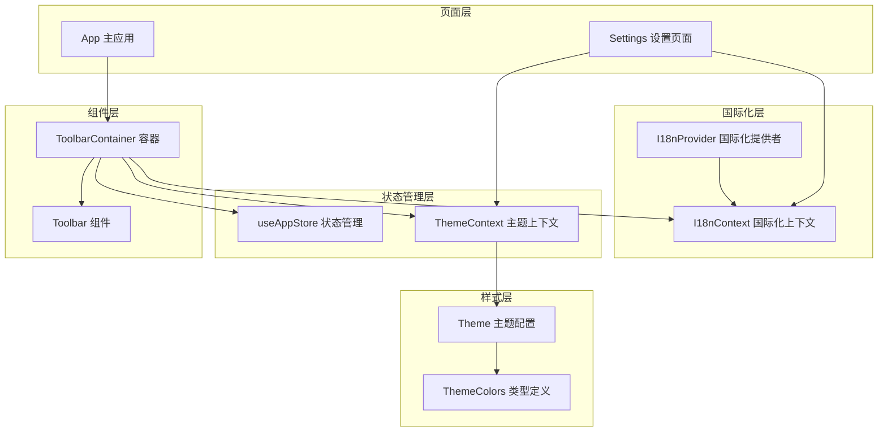
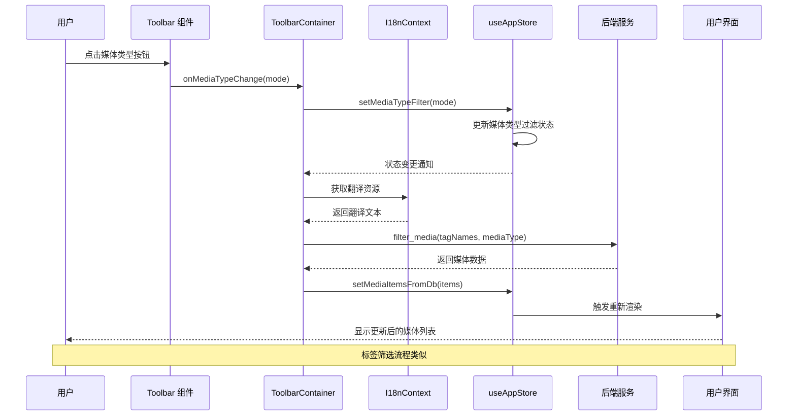
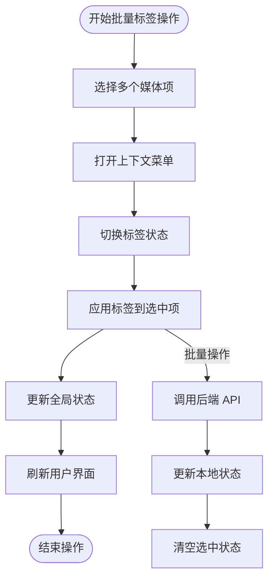
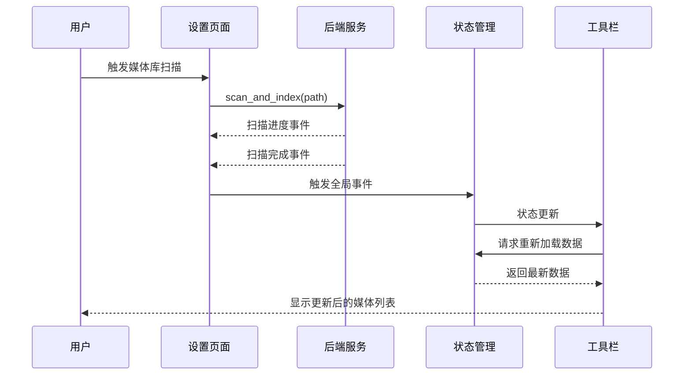
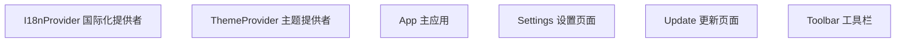
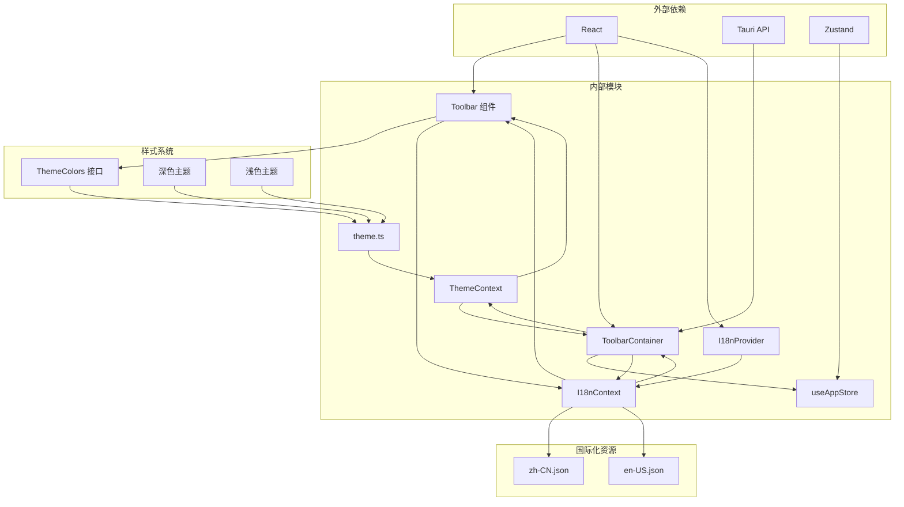

# 工具栏组件 (Toolbar)

<cite>
**本文档引用的文件**
- [Toolbar.tsx](file://src/components/Toolbar.tsx)
- [ToolbarContainer.tsx](file://src/containers/ToolbarContainer.tsx)
- [I18nContext.tsx](file://src/contexts/I18nContext.tsx)
- [en-US.json](file://src/i18n/en-US.json)
- [zh-CN.json](file://src/i18n/zh-CN.json)
- [useAppStore.ts](file://src/store/useAppStore.ts)
- [ThemeContext.tsx](file://src/contexts/ThemeContext.tsx)
- [theme.ts](file://src/theme/theme.ts)
- [MediaGridContainer.tsx](file://src/containers/MediaGridContainer.tsx)
- [MediaCardContextMenu.tsx](file://src/components/MediaCardContextMenu.tsx)
- [Settings.tsx](file://src/pages/Settings.tsx)
- [App.tsx](file://src/App.tsx)
- [main.tsx](file://src/main.tsx)
</cite>

## 更新摘要
**变更内容**
- 新增国际化功能集成章节
- 更新工具栏组件国际化实现细节
- 添加 I18nContext 上下文系统说明
- 更新设置页面语言切换功能
- 增强多语言支持的技术架构描述

## 目录
1. [简介](#简介)
2. [项目结构](#项目结构)
3. [核心组件](#核心组件)
4. [架构概览](#架构概览)
5. [详细组件分析](#详细组件分析)
6. [国际化功能集成](#国际化功能集成)
7. [依赖关系分析](#依赖关系分析)
8. [性能考虑](#性能考虑)
9. [故障排除指南](#故障排除指南)
10. [结论](#结论)
11. [附录](#附录)

## 简介
工具栏组件是 Medex 媒体管理应用的核心界面元素，负责提供媒体浏览的控制面板。该组件实现了标签筛选、媒体类型过滤、结果统计等核心功能，并与全局状态管理系统深度集成，提供流畅的用户体验。

工具栏组件采用现代化的设计理念，支持深色/浅色主题切换，具有响应式布局和优雅的视觉反馈。组件通过事件驱动的方式与应用其他部分进行通信，确保了良好的可维护性和扩展性。

**更新** 工具栏组件现已集成完整的国际化功能，支持简体中文和英语两种语言，为全球用户提供本地化的用户体验。

## 项目结构
工具栏组件在项目中的组织结构如下：



**图表来源**
- [Toolbar.tsx:1-77](file://src/components/Toolbar.tsx#L1-L77)
- [ToolbarContainer.tsx:1-115](file://src/containers/ToolbarContainer.tsx#L1-L115)
- [I18nContext.tsx:1-51](file://src/contexts/I18nContext.tsx#L1-L51)
- [useAppStore.ts:145-179](file://src/store/useAppStore.ts#L145-L179)
- [ThemeContext.tsx:17-90](file://src/contexts/ThemeContext.tsx#L17-L90)

**章节来源**
- [Toolbar.tsx:1-77](file://src/components/Toolbar.tsx#L1-L77)
- [ToolbarContainer.tsx:1-115](file://src/containers/ToolbarContainer.tsx#L1-L115)
- [I18nContext.tsx:1-51](file://src/contexts/I18nContext.tsx#L1-L51)

## 核心组件
工具栏组件由三个主要部分组成：展示组件、容器组件和国际化上下文。

### 展示组件 (Toolbar)
展示组件负责渲染工具栏的视觉界面，包括标签显示区域和媒体类型过滤按钮组。

### 容器组件 (ToolbarContainer)
容器组件处理业务逻辑，包括状态管理、事件监听和数据处理。

### 国际化上下文 (I18nContext)
国际化上下文提供多语言支持，管理语言切换和翻译资源。

**章节来源**
- [Toolbar.tsx:12-77](file://src/components/Toolbar.tsx#L12-L77)
- [ToolbarContainer.tsx:14-115](file://src/containers/ToolbarContainer.tsx#L14-L115)
- [I18nContext.tsx:1-51](file://src/contexts/I18nContext.tsx#L1-L51)

## 架构概览
工具栏组件采用分层架构设计，实现了清晰的关注点分离：



**图表来源**
- [ToolbarContainer.tsx:27-52](file://src/containers/ToolbarContainer.tsx#L27-L52)
- [useAppStore.ts:178-179](file://src/store/useAppStore.ts#L178-L179)
- [I18nContext.tsx:40-43](file://src/contexts/I18nContext.tsx#L40-L43)

## 详细组件分析

### Toolbar 展示组件
Toolbar 展示组件是一个纯函数组件，负责渲染工具栏的视觉元素。

#### 组件属性接口
组件接受以下属性：
- `activeTags`: 当前激活的标签数组
- `resultCount`: 结果数量
- `mediaType`: 当前媒体类型过滤模式
- `onMediaTypeChange`: 媒体类型变更回调函数
- `loading`: 加载状态标志
- `theme`: 主题颜色配置对象

#### 标签显示区域
标签显示区域采用响应式设计，能够自动处理标签溢出：
- 当有激活标签时，每个标签以圆角矩形形式显示
- 每个标签包含 `#` 前缀标识
- 当没有激活标签时，显示占位文本"未选择标签"
- 结果计数显示在标签区域右侧

#### 媒体类型过滤按钮组
媒体类型过滤按钮组提供三种过滤模式：
- **All**: 显示所有媒体类型
- **Image**: 仅显示图片
- **Video**: 仅显示视频

按钮具有以下交互特性：
- 当前选中模式的按钮使用强调色背景
- 非选中模式的按钮在悬停时显示高亮效果
- 按钮采用圆角设计，提供平滑的视觉过渡

**更新** 工具栏组件现已集成国际化功能，所有静态文本都通过 `useI18n()` hook 获取翻译。

**章节来源**
- [Toolbar.tsx:3-10](file://src/components/Toolbar.tsx#L3-L10)
- [Toolbar.tsx:25-40](file://src/components/Toolbar.tsx#L25-L40)
- [Toolbar.tsx:42-71](file://src/components/Toolbar.tsx#L42-L71)

### ToolbarContainer 容器组件
ToolbarContainer 是工具栏的业务逻辑容器，负责处理状态管理和事件处理。

#### 状态管理
容器组件管理以下状态：
- `activeTags`: 从全局状态中计算的激活标签数组
- `statusMessage`: 扫描完成后的状态消息
- `scanInFlightRef`: 扫描进行中的引用标志
- `doneHandledRef`: 扫描完成事件已处理的引用标志

#### 媒体类型过滤处理
`handleMediaTypeChange` 函数处理媒体类型变更：
- 接收新的媒体类型模式
- 调用全局状态管理器更新媒体类型过滤
- 自动触发媒体列表重新加载

#### 媒体数据加载
`loadAllMedia` 函数负责从数据库加载媒体数据：
- 调用后端服务 `filter_media` API
- 支持标签筛选和媒体类型过滤
- 将数据库格式转换为前端格式
- 更新全局媒体状态

#### 扫描事件监听
容器组件监听 `scan_done` 事件：
- 监听扫描完成事件
- 防止重复处理扫描完成事件
- 自动重新加载媒体数据
- 显示扫描完成的状态消息

**更新** 容器组件现已集成国际化功能，在扫描完成后显示本地化的状态消息。

**章节来源**
- [ToolbarContainer.tsx:14-29](file://src/containers/ToolbarContainer.tsx#L14-L29)
- [ToolbarContainer.tsx:31-52](file://src/containers/ToolbarContainer.tsx#L31-L52)
- [ToolbarContainer.tsx:58-87](file://src/containers/ToolbarContainer.tsx#L58-L87)

### 全局状态管理系统集成
工具栏组件与全局状态管理系统深度集成：

#### Zustand 状态管理
使用 Zustand 实现轻量级状态管理：
- `mediaTypeFilter`: 当前媒体类型过滤状态
- `setMediaTypeFilter`: 更新媒体类型过滤的 Action
- `setMediaItemsFromDb`: 更新媒体列表的 Action

#### 状态同步机制
状态变更通过以下流程同步：
1. 用户操作触发容器组件方法
2. 容器组件调用全局状态 Action
3. 全局状态更新触发组件重新渲染
4. 新状态通过 props 传递给展示组件

**章节来源**
- [useAppStore.ts:48-68](file://src/store/useAppStore.ts#L48-L68)
- [useAppStore.ts:178-179](file://src/store/useAppStore.ts#L178-L179)

### 主题系统集成
工具栏组件完全集成到主题系统中：

#### 主题颜色配置
支持多种主题颜色配置：
- `toolbar`: 工具栏背景色
- `tagBg`: 标签背景色
- `tagHover`: 标签悬停效果色
- `text`: 主要文本颜色
- `textSecondary`: 次要文本颜色
- `textTertiary`: 第三文本颜色

#### 主题上下文提供者
ThemeContext 提供主题信息：
- 自动检测系统主题偏好
- 支持手动切换主题模式
- 本地存储主题设置
- 实时主题更新

**章节来源**
- [ThemeContext.tsx:17-90](file://src/contexts/ThemeContext.tsx#L17-L90)
- [theme.ts:8-52](file://src/theme/theme.ts#L8-L52)

### 批量标签操作集成
工具栏组件与批量标签操作功能协同工作：

#### 批量标签操作流程


**图表来源**
- [MediaGridContainer.tsx:144-175](file://src/containers/MediaGridContainer.tsx#L144-L175)
- [MediaCardContextMenu.tsx:174-192](file://src/components/MediaCardContextMenu.tsx#L174-L192)

#### 批量操作确认机制
批量标签操作包含以下确认机制：
- 多媒体项选择确认
- 标签状态变更预览
- 操作执行确认对话框
- 操作结果反馈

**章节来源**
- [MediaGridContainer.tsx:144-175](file://src/containers/MediaGridContainer.tsx#L144-L175)
- [MediaCardContextMenu.tsx:163-171](file://src/components/MediaCardContextMenu.tsx#L163-L171)

### 刷新按钮功能
工具栏组件集成了媒体库刷新功能：

#### 刷新流程


**图表来源**
- [Settings.tsx:23-51](file://src/pages/Settings.tsx#L23-L51)
- [ToolbarContainer.tsx:62-87](file://src/containers/ToolbarContainer.tsx#L62-L87)

#### 刷新状态管理
- 扫描进行中状态跟踪
- 扫描完成事件处理
- 自动数据重新加载
- 用户反馈消息显示

**章节来源**
- [Settings.tsx:23-51](file://src/pages/Settings.tsx#L23-L51)
- [ToolbarContainer.tsx:62-87](file://src/containers/ToolbarContainer.tsx#L62-L87)

### 设置入口集成
工具栏组件与设置页面集成，提供统一的设置访问方式：

#### 设置页面功能
设置页面提供以下配置选项：
- 主题模式切换（深色/浅色/跟随系统）
- 媒体库路径配置
- 自动扫描设置
- 语言选择

#### 设置与工具栏的交互
- 主题变更实时影响工具栏外观
- 设置变更通过全局事件通知
- 统一的样式系统确保视觉一致性

**章节来源**
- [Settings.tsx:88-152](file://src/pages/Settings.tsx#L88-L152)
- [ThemeContext.tsx:68-84](file://src/contexts/ThemeContext.tsx#L68-L84)

## 国际化功能集成

### I18nContext 国际化上下文系统
工具栏组件现已集成完整的国际化功能，通过 I18nContext 提供多语言支持。

#### 国际化上下文接口
I18nContext 提供以下核心功能：
- `t(key: string)`: 获取翻译文本的方法
- `language`: 当前语言代码（'zh-CN' 或 'en-US'）
- `setLanguage(lang: string)`: 切换语言的方法

#### 语言资源管理
系统支持以下语言资源：
- **简体中文 (zh-CN)**: 默认语言，包含 114 条翻译键值对
- **英语 (en-US)**: 英文语言，包含 114 条翻译键值对

#### 语言检测与持久化
- **自动检测**: 基于浏览器语言设置自动选择语言
- **本地存储**: 将用户选择的语言保存到 localStorage
- **默认回退**: 未找到匹配语言时回退到简体中文

#### 翻译键值映射
工具栏组件使用的国际化键值：
- `toolbar.noTagsSelected`: "未选择标签" / "No tags selected"
- `toolbar.resultsPrefix`: "结果：" / "Results: "
- `toolbar.scanCompletePrefix`: "扫描完成，当前共 " / "Scan complete, "
- `toolbar.scanCompleteSuffix`: " 个媒体文件" / " media files"
- `filter.all`: "全部" / "All"
- `filter.image`: "图片" / "Image"
- `filter.video`: "视频" / "Video"

**章节来源**
- [I18nContext.tsx:1-51](file://src/contexts/I18nContext.tsx#L1-L51)
- [en-US.json:31-105](file://src/i18n/en-US.json#L31-L105)
- [zh-CN.json:31-105](file://src/i18n/zh-CN.json#L31-L105)

### Toolbar 组件国际化实现
工具栏组件通过 `useI18n()` hook 集成国际化功能：

#### 国际化钩子使用
```typescript
const { t } = useI18n();
// 使用翻译文本
<span className="text-[12px]" style={{ color: theme.textTertiary }}>
  {t('toolbar.noTagsSelected')}
</span>
```

#### 翻译键值使用
工具栏组件使用的翻译键值：
- `toolbar.noTagsSelected`: 标签区域无标签时的占位文本
- `toolbar.resultsPrefix`: 结果数量前缀文本
- `filter.all`: 媒体类型过滤按钮文本
- `filter.image`: 媒体类型过滤按钮文本
- `filter.video`: 媒体类型过滤按钮文本

#### 扫描完成消息国际化
扫描完成后显示的本地化消息：
- 中文: "扫描完成，当前共 {count} 个媒体文件"
- 英文: "Scan complete, {count} media files"

**章节来源**
- [Toolbar.tsx:21](file://src/components/Toolbar.tsx#L21)
- [Toolbar.tsx:39](file://src/components/Toolbar.tsx#L39)
- [Toolbar.tsx:41](file://src/components/Toolbar.tsx#L41)
- [Toolbar.tsx:69](file://src/components/Toolbar.tsx#L69)
- [ToolbarContainer.tsx:72](file://src/containers/ToolbarContainer.tsx#L72)

### Settings 页面语言切换集成
设置页面提供语言选择功能，与工具栏组件形成完整的国际化体系：

#### 语言选择界面
设置页面包含以下语言相关元素：
- 语言选择下拉框
- 中文语言选项：简体中文
- 英语语言选项：English

#### 语言切换机制
语言切换通过以下流程实现：
1. 用户在设置页面选择新语言
2. `setLanguage()` 方法更新语言状态
3. 语言设置保存到 localStorage
4. 发送 `medex:language-changed` 全局事件
5. 应用监听到事件后重新加载页面应用新语言

#### 事件驱动的语言切换
- **全局事件**: `medex:language-changed`
- **本地事件**: `medex:language-changed` 自定义事件
- **自动刷新**: 监听器收到事件后自动刷新页面

**章节来源**
- [Settings.tsx:144-172](file://src/pages/Settings.tsx#L144-L172)
- [Settings.tsx:25](file://src/pages/Settings.tsx#L25)
- [App.tsx:126-158](file://src/App.tsx#L126-L158)

### 应用级国际化集成
工具栏组件的国际化功能通过应用级集成实现：

#### Provider 层级结构
应用通过以下层级结构集成国际化：


#### 多页面支持
国际化功能支持以下页面：
- 主应用页面 (`/`)
- 设置页面 (`/settings.html`)
- 更新页面 (`/update.html`)

#### 语言持久化机制
- **localStorage**: 存储用户选择的语言设置
- **浏览器检测**: 基于 `navigator.language` 自动检测
- **默认回退**: 未匹配语言时使用简体中文

**章节来源**
- [main.tsx:20-44](file://src/main.tsx#L20-L44)
- [I18nContext.tsx:22-38](file://src/contexts/I18nContext.tsx#L22-L38)

## 依赖关系分析



**图表来源**
- [Toolbar.tsx:1](file://src/components/Toolbar.tsx#L1)
- [ToolbarContainer.tsx:2-7](file://src/containers/ToolbarContainer.tsx#L2-L7)
- [I18nContext.tsx:1](file://src/contexts/I18nContext.tsx#L1)
- [useAppStore.ts:1](file://src/store/useAppStore.ts#L1)
- [ThemeContext.tsx:1](file://src/contexts/ThemeContext.tsx#L1)

### 组件耦合度分析
- **低耦合**: Toolbar 展示组件与 ToolbarContainer 容器组件通过 props 和回调函数解耦
- **单向数据流**: 数据从容器流向展示组件，避免了复杂的双向绑定
- **清晰的职责分离**: 展示组件专注于渲染，容器组件处理业务逻辑
- **国际化解耦**: I18nContext 与业务组件通过 hook 解耦

### 外部依赖管理
- **React**: 提供组件生命周期和状态管理
- **Tauri**: 提供跨平台桌面应用能力
- **Zustand**: 提供轻量级状态管理解决方案

**章节来源**
- [Toolbar.tsx:1](file://src/components/Toolbar.tsx#L1)
- [ToolbarContainer.tsx:2-7](file://src/containers/ToolbarContainer.tsx#L2-L7)
- [I18nContext.tsx:1](file://src/contexts/I18nContext.tsx#L1)

## 性能考虑
工具栏组件在设计时充分考虑了性能优化：

### 渲染优化
- **虚拟滚动**: 标签区域支持溢出内容的虚拟滚动
- **条件渲染**: 无激活标签时显示占位符而非空列表
- **CSS 过渡**: 使用硬件加速的 CSS 过渡效果

### 状态管理优化
- **选择性订阅**: 使用 Zustand 的选择性订阅减少不必要的重渲染
- **引用稳定**: 使用 `useMemo` 和 `useCallback` 优化函数引用稳定性
- **批量更新**: 状态更新采用批处理机制

### 内存管理
- **事件清理**: 正确清理事件监听器防止内存泄漏
- **引用清理**: 使用 `useRef` 管理异步操作状态
- **组件卸载**: 在组件卸载时清理所有资源

### 国际化性能优化
- **翻译缓存**: I18nContext 缓存翻译结果
- **语言切换优化**: 语言切换时只重新渲染受影响的组件
- **资源加载**: 语言资源在应用启动时一次性加载

## 故障排除指南

### 常见问题及解决方案

#### 标签显示异常
**问题**: 标签无法正确显示或显示错误
**可能原因**:
- 全局状态未正确更新
- 标签数据格式不正确
- 主题颜色配置错误

**解决步骤**:
1. 检查全局状态中标签数据结构
2. 验证标签名称格式和编码
3. 确认主题颜色配置正确

#### 媒体类型过滤失效
**问题**: 媒体类型按钮点击无效
**可能原因**:
- 回调函数未正确传递
- 状态更新逻辑错误
- 事件处理程序异常

**解决步骤**:
1. 检查 `onMediaTypeChange` 回调函数
2. 验证 `setMediaTypeFilter` Action 实现
3. 确认事件处理程序正常执行

#### 扫描功能异常
**问题**: 媒体库扫描无法触发或完成
**可能原因**:
- 事件监听器未正确注册
- 异步操作状态管理错误
- 后端服务调用失败

**解决步骤**:
1. 检查 `scan_done` 事件监听器
2. 验证 `scanInFlightRef` 状态管理
3. 确认后端服务调用链路

#### 国际化功能异常
**问题**: 语言切换无效或翻译文本显示错误
**可能原因**:
- I18nContext 未正确初始化
- 翻译键值不存在
- 语言资源文件加载失败

**解决步骤**:
1. 检查 I18nProvider 是否正确包裹应用
2. 验证翻译键值是否存在于对应语言文件
3. 确认语言资源文件格式正确
4. 检查 localStorage 中的语言设置

**章节来源**
- [ToolbarContainer.tsx:58-87](file://src/containers/ToolbarContainer.tsx#L58-L87)
- [ToolbarContainer.tsx:27-29](file://src/containers/ToolbarContainer.tsx#L27-L29)
- [I18nContext.tsx:40-43](file://src/contexts/I18nContext.tsx#L40-L43)

## 结论
工具栏组件作为 Medex 应用的核心界面元素，展现了现代前端开发的最佳实践。组件设计注重用户体验、性能优化和可维护性，通过清晰的架构分离和强大的状态管理系统，为用户提供流畅的媒体浏览体验。

**更新** 工具栏组件现已集成完整的国际化功能，支持简体中文和英语两种语言，为全球用户提供本地化的用户体验。国际化功能通过 I18nContext 提供者模式实现，与应用的其他组件无缝集成。

组件的主要优势包括：
- **模块化设计**: 清晰的展示组件和容器组件分离
- **主题系统集成**: 完整的深色/浅色主题支持
- **状态管理**: 基于 Zustand 的高效状态管理
- **事件驱动**: 响应式的事件处理机制
- **国际化支持**: 多语言本地化功能
- **性能优化**: 多层次的性能优化策略

未来可以考虑的功能增强包括快捷键支持、更丰富的筛选选项、高级的批量操作功能和更多语言支持。

## 附录

### 样式定制选项
工具栏组件支持以下样式定制：

#### 主题颜色变量
- `toolbar`: 工具栏背景色
- `tagBg`: 标签背景色
- `tagHover`: 标签悬停效果色
- `text`: 主要文本颜色
- `textSecondary`: 次要文本颜色
- `textTertiary`: 第三文本颜色

#### 尺寸规格
- 工具栏高度: 60px
- 标签圆角半径: 6px
- 标签内边距: 2px 4px
- 按钮内边距: 1px 4px

### 图标设计规范
虽然当前版本未实现具体图标，但设计规范建议：

#### 图标尺寸标准
- 媒体类型按钮: 12px 字体大小
- 标签显示: 12px 字体大小
- 结果计数: 12px 字体大小

#### 图标风格
- 简洁线条风格
- 与整体设计语言一致
- 支持深色/浅色主题适配

### 国际化功能扩展
工具栏组件的国际化功能支持进一步扩展：

#### 新语言添加流程
1. 创建新的语言 JSON 文件
2. 在 I18nContext 中注册语言资源
3. 在 Settings 页面添加语言选项
4. 在应用入口文件中添加路由支持

#### 翻译键值命名规范
- 使用点号分隔的层级结构
- 采用小写字母和连字符
- 保持语义明确的键值命名

#### 多语言测试策略
- 单元测试验证翻译键值存在性
- 端到端测试验证界面显示
- 用户验收测试验证本地化质量

### 快捷键支持计划
未来版本计划实现的快捷键支持：
- `Ctrl+Shift+F`: 切换媒体类型过滤
- `Ctrl+Shift+T`: 切换标签筛选
- `Ctrl+R`: 刷新媒体库
- `Esc`: 清除选中状态
- `Ctrl+L`: 切换语言（待实现）