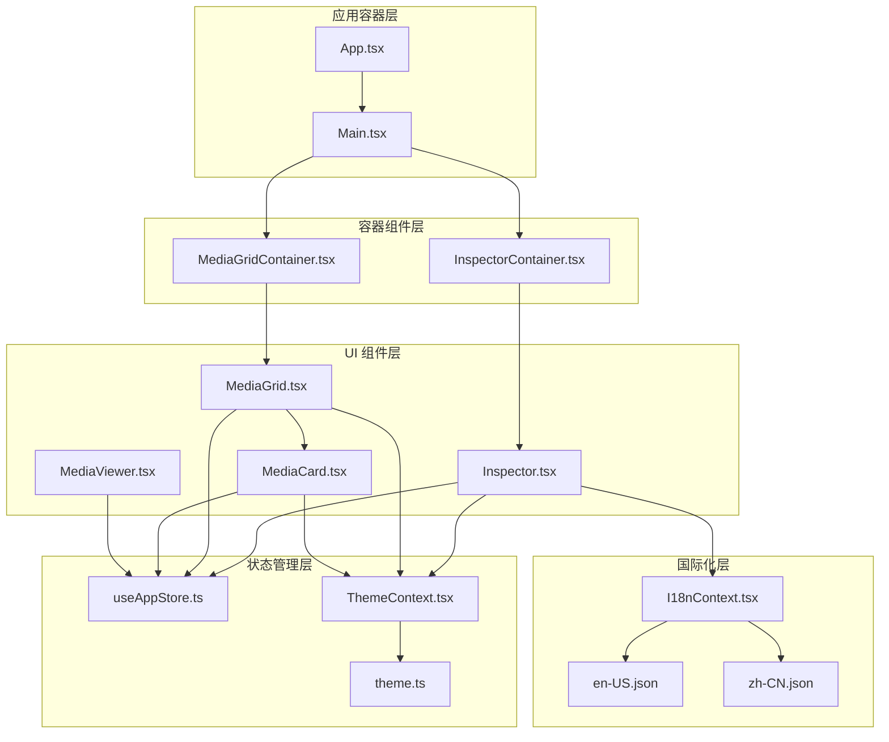
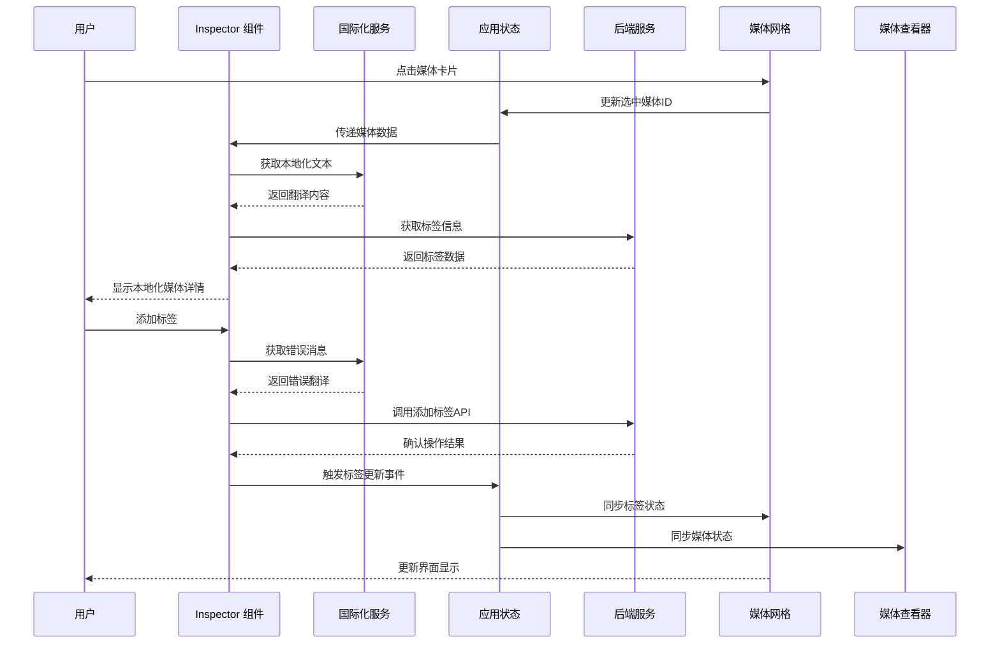
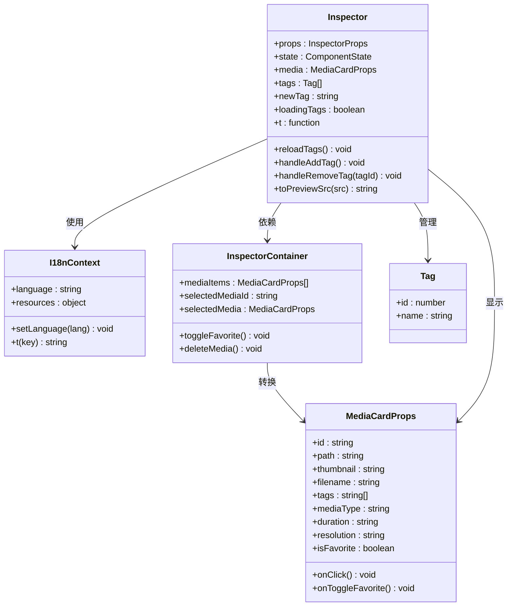
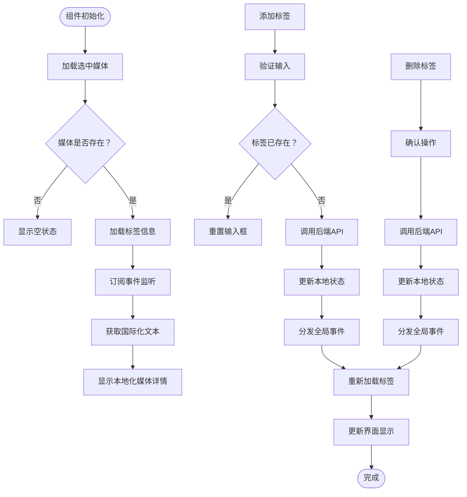
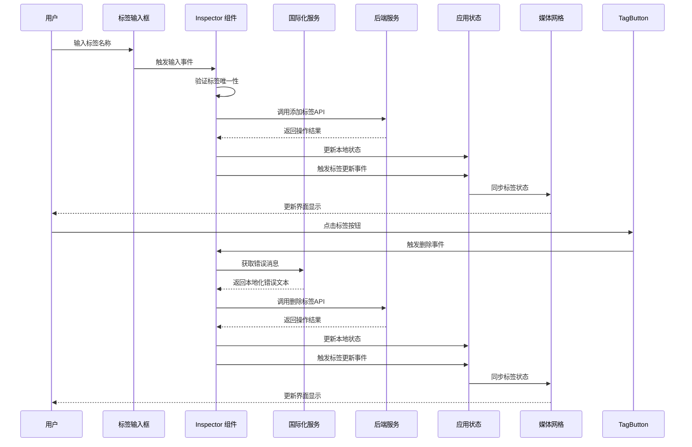
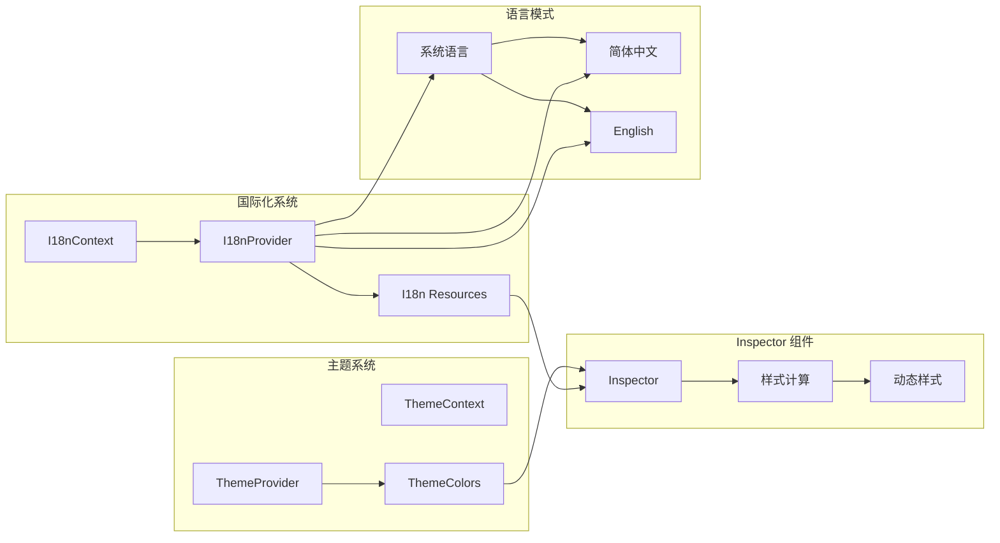
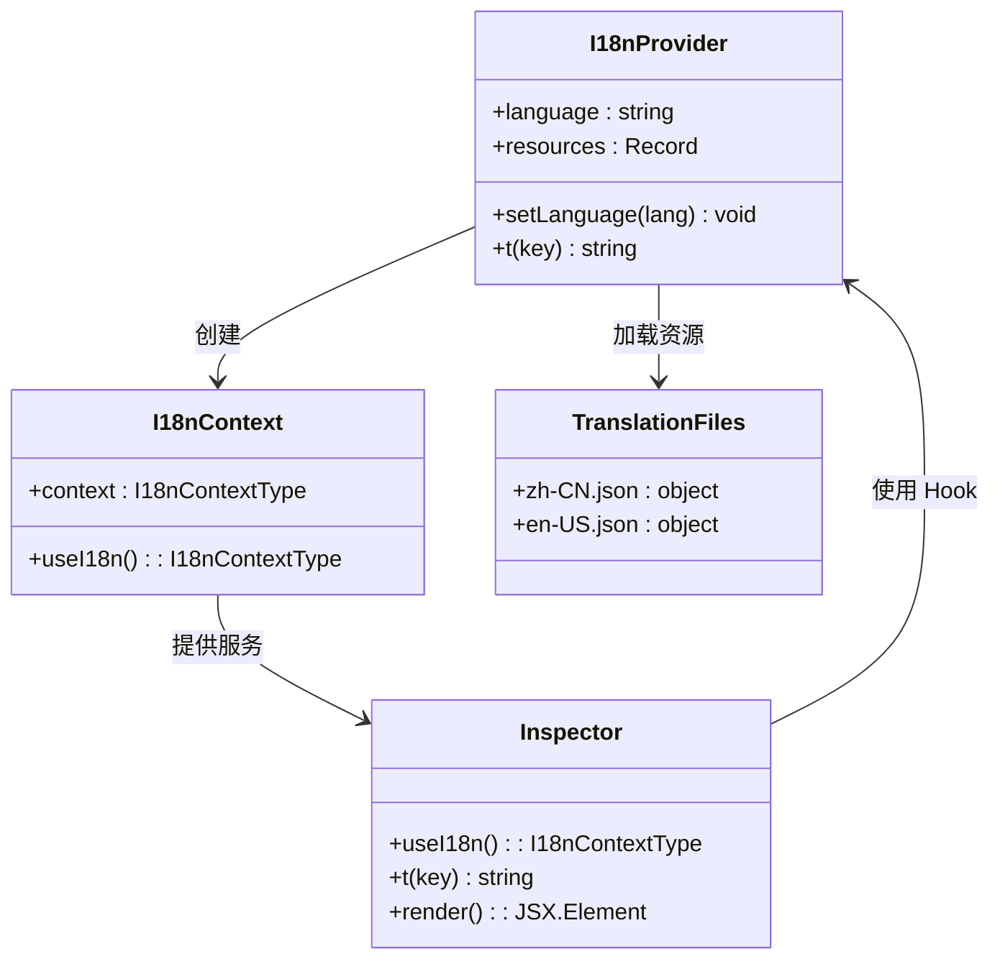
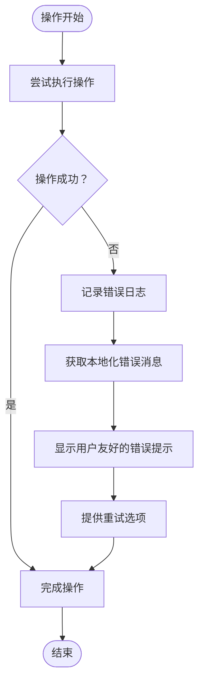
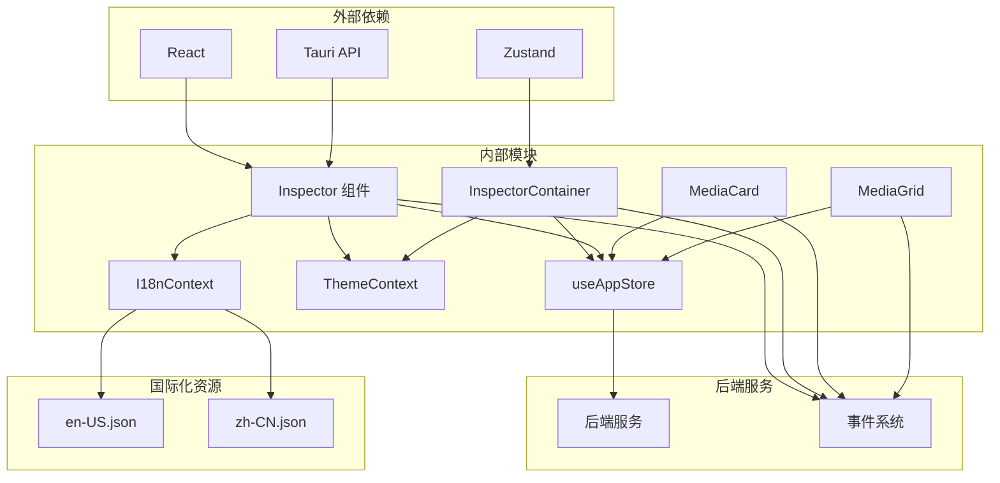

# 检查器组件 (Inspector)

<cite>
**本文档引用的文件**
- [Inspector.tsx](file://src/components/Inspector.tsx)
- [InspectorContainer.tsx](file://src/containers/InspectorContainer.tsx)
- [MediaGrid.tsx](file://src/components/MediaGrid.tsx)
- [MediaCard.tsx](file://src/components/MediaCard.tsx)
- [MediaViewer.tsx](file://src/components/MediaViewer.tsx)
- [useAppStore.ts](file://src/store/useAppStore.ts)
- [ThemeContext.tsx](file://src/contexts/ThemeContext.tsx)
- [theme.ts](file://src/theme/theme.ts)
- [MediaGridContainer.tsx](file://src/containers/MediaGridContainer.tsx)
- [App.tsx](file://src/App.tsx)
- [I18nContext.tsx](file://src/contexts/I18nContext.tsx)
- [en-US.json](file://src/i18n/en-US.json)
- [zh-CN.json](file://src/i18n/zh-CN.json)
- [main.tsx](file://src/main.tsx)
</cite>

## 更新摘要
**变更内容**
- 新增国际化功能支持，包括英文和中文翻译
- 改进错误处理机制，使用统一的国际化错误消息
- 增强用户界面的本地化体验
- 完善多语言支持的架构设计

## 目录
1. [简介](#简介)
2. [项目结构](#项目结构)
3. [核心组件](#核心组件)
4. [架构概览](#架构概览)
5. [详细组件分析](#详细组件分析)
6. [国际化功能](#国际化功能)
7. [错误处理改进](#错误处理改进)
8. [依赖关系分析](#依赖关系分析)
9. [性能考虑](#性能考虑)
10. [故障排除指南](#故障排除指南)
11. [结论](#结论)
12. [附录](#附录)

## 简介

Inspector 检查器组件是 Medex 媒体管理应用中的关键界面元素，负责显示和管理媒体文件的详细信息。该组件提供了媒体预览、标签管理、收藏状态切换和删除操作等功能，是用户与媒体数据进行深度交互的主要入口。

检查器组件采用现代化的 React 架构设计，结合 Tauri 后端服务，实现了高性能的媒体数据处理和实时更新机制。组件支持深色和浅色主题模式，具备完整的键盘导航和无障碍访问支持。**新增功能**：组件现已集成完整的国际化支持，支持简体中文和英语两种语言，为全球用户提供本地化的用户体验。

## 项目结构

Medex 应用采用模块化的组件架构，Inspector 组件位于组件层次结构的中央位置，与媒体网格、媒体查看器等核心组件紧密协作。**新增国际化架构**：应用现在通过 I18nProvider 提供统一的国际化支持，确保所有组件都能访问翻译资源。

**图表来源**
- [App.tsx:1-73](file://src/App.tsx#L1-L73)
- [Main.tsx:1-25](file://src/components/Main.tsx#L1-L25)
- [InspectorContainer.tsx:1-32](file://src/containers/InspectorContainer.tsx#L1-L32)
- [I18nContext.tsx:1-51](file://src/contexts/I18nContext.tsx#L1-L51)
- [en-US.json:1-114](file://src/i18n/en-US.json#L1-L114)
- [zh-CN.json:1-114](file://src/i18n/zh-CN.json#L1-L114)

**章节来源**
- [App.tsx:1-73](file://src/App.tsx#L1-L73)
- [Main.tsx:1-25](file://src/components/Main.tsx#L1-L25)
- [main.tsx:1-51](file://src/main.tsx#L1-L51)

## 核心组件

Inspector 组件是媒体详情检查器的核心实现，具有以下主要功能特性：

### 数据绑定机制
- **单向数据流**：通过 props 接收媒体数据，确保数据流向清晰可控
- **状态同步**：监听全局事件实现与其他组件的数据同步
- **本地状态管理**：管理标签输入、加载状态等临时数据

### 用户交互设计
- **标签管理**：支持标签的添加、删除和搜索功能
- **媒体预览**：提供缩略图和视频预览功能
- **操作按钮**：收藏切换、删除等核心操作
- **键盘导航**：完整的键盘快捷键支持

### 样式定制选项
- **主题适配**：完全支持深色和浅色主题模式
- **动态样式**：根据主题变量动态计算样式属性
- **响应式设计**：适配不同屏幕尺寸和设备

### **新增** 国际化支持
- **多语言界面**：支持简体中文和英语的完整界面翻译
- **动态语言切换**：通过 I18nContext 实现运行时语言切换
- **本地化资源**：独立的翻译文件管理，便于维护和扩展

**章节来源**
- [Inspector.tsx:13-297](file://src/components/Inspector.tsx#L13-L297)
- [InspectorContainer.tsx:6-31](file://src/containers/InspectorContainer.tsx#L6-L31)
- [I18nContext.tsx:1-51](file://src/contexts/I18nContext.tsx#L1-L51)

## 架构概览

Inspector 组件在整个应用架构中扮演着数据展示和用户交互的关键角色，与多个组件形成紧密的协作关系。**新增国际化集成**：组件现在通过 useI18n Hook 访问翻译服务，实现界面文本的动态本地化。

**图表来源**
- [Inspector.tsx:26-88](file://src/components/Inspector.tsx#L26-L88)
- [useAppStore.ts:145-394](file://src/store/useAppStore.ts#L145-L394)
- [I18nContext.tsx:40-43](file://src/contexts/I18nContext.tsx#L40-43)

## 详细组件分析

### Inspector 组件架构

Inspector 组件采用函数式组件设计，结合 React Hooks 实现复杂的状态管理和副作用处理。**新增国际化集成点**：组件现在使用 useI18n Hook 获取翻译服务，所有用户可见的文本都通过国际化系统提供。

**图表来源**
- [Inspector.tsx:13-297](file://src/components/Inspector.tsx#L13-L297)
- [I18nContext.tsx:1-51](file://src/contexts/I18nContext.tsx#L1-51)
- [InspectorContainer.tsx:6-31](file://src/containers/InspectorContainer.tsx#L6-L31)

### 数据流处理机制

Inspector 组件实现了完整的数据流处理机制，确保媒体信息的实时更新和一致性。**新增国际化数据流**：组件现在通过国际化服务处理所有用户可见的文本，包括错误消息和界面提示。

**图表来源**
- [Inspector.tsx:33-95](file://src/components/Inspector.tsx#L33-L95)
- [Inspector.tsx:49-60](file://src/components/Inspector.tsx#L49-L60)

### 标签管理系统

Inspector 组件提供了完整的标签管理功能，支持标签的添加、删除和搜索操作。**新增国际化错误处理**：标签操作失败时，组件现在使用国际化服务获取本地化的错误消息。

**图表来源**
- [Inspector.tsx:62-95](file://src/components/Inspector.tsx#L62-L95)
- [Inspector.tsx:55-65](file://src/components/Inspector.tsx#L55-L65)

**章节来源**
- [Inspector.tsx:19-297](file://src/components/Inspector.tsx#L19-L297)

### 主题适配机制

Inspector 组件完全支持动态主题切换，能够根据用户偏好自动调整界面外观。**新增国际化主题集成**：组件现在同时支持主题和语言的动态切换，提供完整的本地化体验。

**图表来源**
- [I18nContext.tsx:17-51](file://src/contexts/I18nContext.tsx#L17-L51)
- [ThemeContext.tsx:17-99](file://src/contexts/ThemeContext.tsx#L17-L99)
- [theme.ts:8-159](file://src/theme/theme.ts#L8-L159)

**章节来源**
- [I18nContext.tsx:17-51](file://src/contexts/I18nContext.tsx#L17-L51)
- [ThemeContext.tsx:17-99](file://src/contexts/ThemeContext.tsx#L17-L99)
- [theme.ts:54-159](file://src/theme/theme.ts#L54-L159)

## 国际化功能

### 国际化架构设计

Medex 应用采用了完整的国际化架构，为 Inspector 组件提供了强大的本地化支持。**新增功能**：组件现在通过 I18nContext 提供的 useI18n Hook 访问翻译服务，实现了界面文本的动态本地化。

**图表来源**
- [I18nContext.tsx:1-51](file://src/contexts/I18nContext.tsx#L1-L51)
- [Inspector.tsx:26](file://src/components/Inspector.tsx#L26)
- [en-US.json:1-114](file://src/i18n/en-US.json#L1-L114)
- [zh-CN.json:1-114](file://src/i18n/zh-CN.json#L1-L114)

### 支持的语言

**简体中文 (zh-CN)**：为中文用户提供完整的本地化界面，包括所有用户可见的文本、提示和错误消息。

**英语 (en-US)**：为国际用户提供标准的英文界面，确保全球用户的使用体验。

### 翻译键值结构

Inspector 组件使用了专门的翻译键值结构，确保界面文本的一致性和可维护性：

- `inspector.title`：检查器标题
- `inspector.selectPrompt`：选择媒体提示
- `inspector.tagsLabel`：标签标签
- `inspector.loadingTags`：加载标签提示
- `inspector.infoLabel`：信息标签
- `inspector.duration`：时长标签
- `inspector.resolution`：分辨率标签
- `inspector.actions`：操作标签
- `inspector.inputTagPlaceholder`：标签输入框占位符
- `inspector.addTagButton`：添加标签按钮
- `inspector.favorite.add`：收藏按钮文本
- `inspector.favorite.remove`：取消收藏按钮文本
- `inspector.delete`：删除按钮文本

**章节来源**
- [I18nContext.tsx:1-51](file://src/contexts/I18nContext.tsx#L1-L51)
- [en-US.json:47-59](file://src/i18n/en-US.json#L47-L59)
- [zh-CN.json:47-59](file://src/i18n/zh-CN.json#L47-L59)

## 错误处理改进

### 统一错误处理机制

**新增功能**：Inspector 组件现在集成了改进的错误处理机制，通过国际化服务提供本地化的错误消息，提升了用户体验的一致性。

### 错误消息本地化

组件现在使用国际化服务处理所有错误消息，包括：

- **标签操作错误**：新增标签失败、删除标签失败等
- **网络请求错误**：API 调用失败、连接超时等
- **用户操作错误**：重复标签、无效输入等

### 错误处理流程

**图表来源**
- [Inspector.tsx:62-72](file://src/components/Inspector.tsx#L62-L72)
- [Inspector.tsx:89-95](file://src/components/Inspector.tsx#L89-L95)

### 错误处理最佳实践

**错误消息本地化**：使用 `t('errors.deleteTagFailed')` 获取本地化的错误消息，确保用户看到符合其语言的错误提示。

**用户友好提示**：通过 `window.alert()` 显示错误消息，虽然简单但能确保用户注意到问题。

**日志记录**：使用 `console.error()` 记录详细的错误信息，便于开发者调试和问题追踪。

**章节来源**
- [Inspector.tsx:62-95](file://src/components/Inspector.tsx#L62-L95)
- [en-US.json:100-101](file://src/i18n/en-US.json#L100-L101)
- [zh-CN.json:100-101](file://src/i18n/zh-CN.json#L100-L101)

## 依赖关系分析

Inspector 组件与应用中的多个模块存在紧密的依赖关系，形成了复杂的依赖网络。**新增国际化依赖**：组件现在依赖 I18nContext 提供的国际化服务，增加了新的依赖关系。

**图表来源**
- [Inspector.tsx:1-8](file://src/components/Inspector.tsx#L1-L8)
- [InspectorContainer.tsx:2-4](file://src/containers/InspectorContainer.tsx#L2-L4)
- [I18nContext.tsx:1-3](file://src/contexts/I18nContext.tsx#L1-L3)
- [en-US.json:1](file://src/i18n/en-US.json#L1)
- [zh-CN.json:1](file://src/i18n/zh-CN.json#L1)

### 组件耦合度分析

Inspector 组件的设计遵循低耦合高内聚的原则，通过接口抽象和事件驱动的方式降低组件间的依赖关系。**新增国际化解耦**：通过 I18nContext 将翻译逻辑与组件逻辑分离，降低了组件的复杂度。

**章节来源**
- [Inspector.tsx:13-297](file://src/components/Inspector.tsx#L13-L297)
- [InspectorContainer.tsx:6-31](file://src/containers/InspectorContainer.tsx#L6-L31)
- [I18nContext.tsx:1-51](file://src/contexts/I18nContext.tsx#L1-L51)

## 性能考虑

Inspector 组件在设计时充分考虑了性能优化，采用了多种策略确保良好的用户体验。**新增国际化性能优化**：组件通过 useMemo 优化翻译函数的性能，避免不必要的重新渲染。

### 渲染优化
- **条件渲染**：根据媒体状态动态渲染不同的内容区域
- **懒加载**：标签信息按需加载，避免不必要的请求
- **事件节流**：对频繁触发的事件进行防抖处理
- ****新增** Memoized translations**：使用 useMemo 优化翻译函数的性能

### 内存管理
- **清理机制**：正确清理事件监听器和定时器
- **状态复用**：利用 React.memo 和 useMemo 优化重渲染
- **资源释放**：及时释放视频播放器等资源
- ****新增** Translation caching**：缓存翻译结果，减少重复计算

### 网络优化
- **缓存策略**：合理利用浏览器缓存减少重复请求
- **并发控制**：限制同时进行的网络请求数量
- **错误恢复**：实现优雅的错误处理和重试机制

## 故障排除指南

### 常见问题及解决方案

**标签操作失败**
- 检查网络连接状态
- 验证后端服务是否正常运行
- 查看浏览器控制台错误信息
- **新增** 检查国际化资源是否正确加载

**媒体预览无法加载**
- 确认媒体文件路径有效
- 检查文件权限设置
- 验证文件格式支持情况

**主题切换异常**
- 刷新页面重新加载主题
- 检查系统主题设置
- 清除浏览器缓存

****新增** 国际化问题**
- 检查翻译文件是否正确加载
- 验证语言设置是否正确
- 确认本地存储的语言偏好
- 查看控制台是否有翻译错误

**章节来源**
- [Inspector.tsx:55-95](file://src/components/Inspector.tsx#L55-L95)
- [Inspector.tsx:36-40](file://src/components/Inspector.tsx#L36-L40)
- [I18nContext.tsx:23-31](file://src/contexts/I18nContext.tsx#L23-L31)

## 结论

Inspector 检查器组件作为 Medex 应用的核心界面元素，展现了现代前端开发的最佳实践。**重大更新**：组件现已集成了完整的国际化功能和改进的错误处理机制，在提供丰富功能的同时保持了良好的可维护性和扩展性。

组件的主要优势包括：
- **模块化设计**：清晰的职责分离和接口定义
- **响应式交互**：流畅的用户操作反馈和状态更新
- **主题适配**：完整的深色和浅色主题支持
- **性能优化**：高效的渲染策略和资源管理
- ****新增** 国际化支持**：完整的多语言本地化体验
- ****新增** 统一错误处理**：一致的错误消息和用户体验

未来可以考虑的改进方向：
- 增加更多的键盘快捷键支持
- 优化移动端的触摸交互体验
- 扩展标签管理的高级功能
- 加强离线状态下的数据同步能力
- **新增** 支持更多语言的国际化扩展
- **新增** 更丰富的错误处理和用户反馈机制

## 附录

### 使用场景和交互模式

**场景一：媒体详情查看**
用户通过点击媒体网格中的项目来查看详细的媒体信息，包括标签、元数据和操作按钮。**新增**：界面文本会根据用户的语言偏好自动本地化。

**场景二：标签管理**
用户可以在检查器中添加或删除标签，实现对媒体内容的分类和组织。**新增**：所有操作反馈和错误消息都会使用用户当前的语言显示。

**场景三：收藏管理**
用户可以通过检查器快速切换媒体的收藏状态，便于后续查找和管理。

**场景四：批量操作**
结合媒体网格的选择功能，用户可以在检查器中执行批量标签操作。

### 样式定制指南

**主题变量映射**
- `sidebar`: 检查器背景色
- `borderLight`: 边框颜色
- `text`: 主要文本颜色
- `tagBg`: 标签背景色
- `tagHover`: 标签悬停效果
- `buttonBg`: 按钮背景色
- `buttonHover`: 按钮悬停效果
- `inputBg`: 输入框背景色
- `inputBorder`: 输入框边框色

****新增** 国际化样式定制**
- `localization`: 国际化状态指示器
- `translationKey`: 翻译键值显示
- `languageSwitcher`: 语言切换器样式

### **新增** 国际化配置指南

**语言资源管理**
- 翻译文件位于 `src/i18n/` 目录下
- 支持 JSON 格式的翻译资源
- 通过 I18nContext 进行集中管理
- 支持运行时语言切换

**翻译键值命名规范**
- 使用点号分隔的层级结构
- 采用小写和下划线的命名方式
- 保持语义清晰和一致性
- 支持嵌套的对象结构

**章节来源**
- [Inspector.tsx:90-297](file://src/components/Inspector.tsx#L90-L297)
- [theme.ts:8-52](file://src/theme/theme.ts#L8-L52)
- [I18nContext.tsx:11-14](file://src/contexts/I18nContext.tsx#L11-L14)
- [en-US.json:47-59](file://src/i18n/en-US.json#L47-L59)
- [zh-CN.json:47-59](file://src/i18n/zh-CN.json#L47-L59)