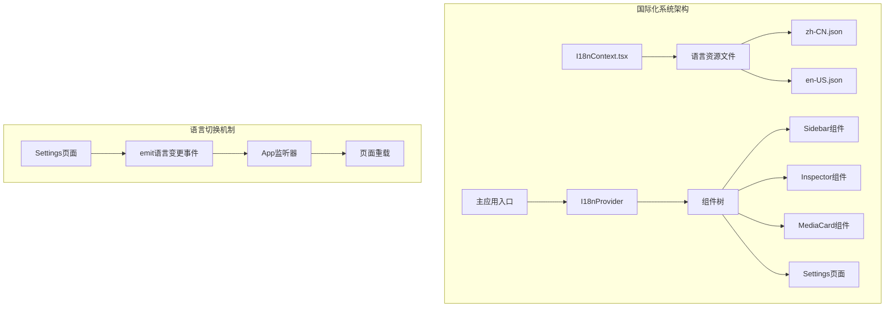
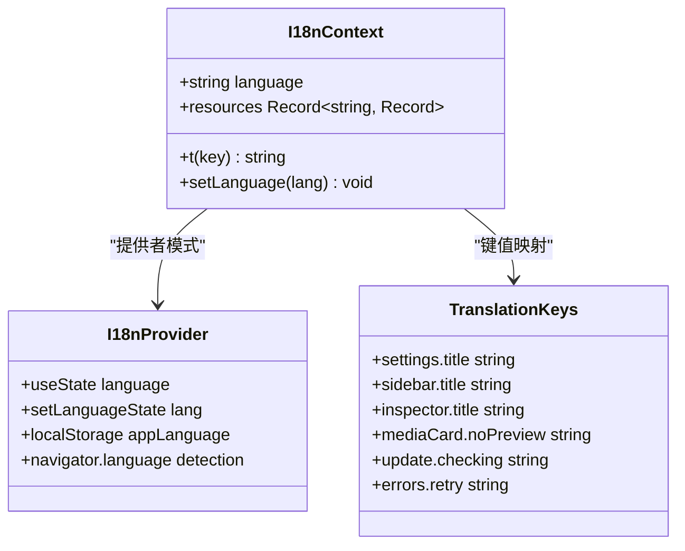
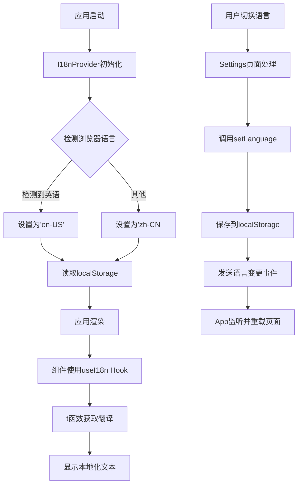
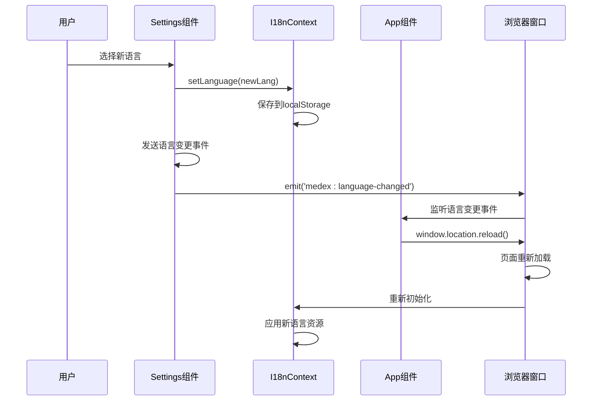
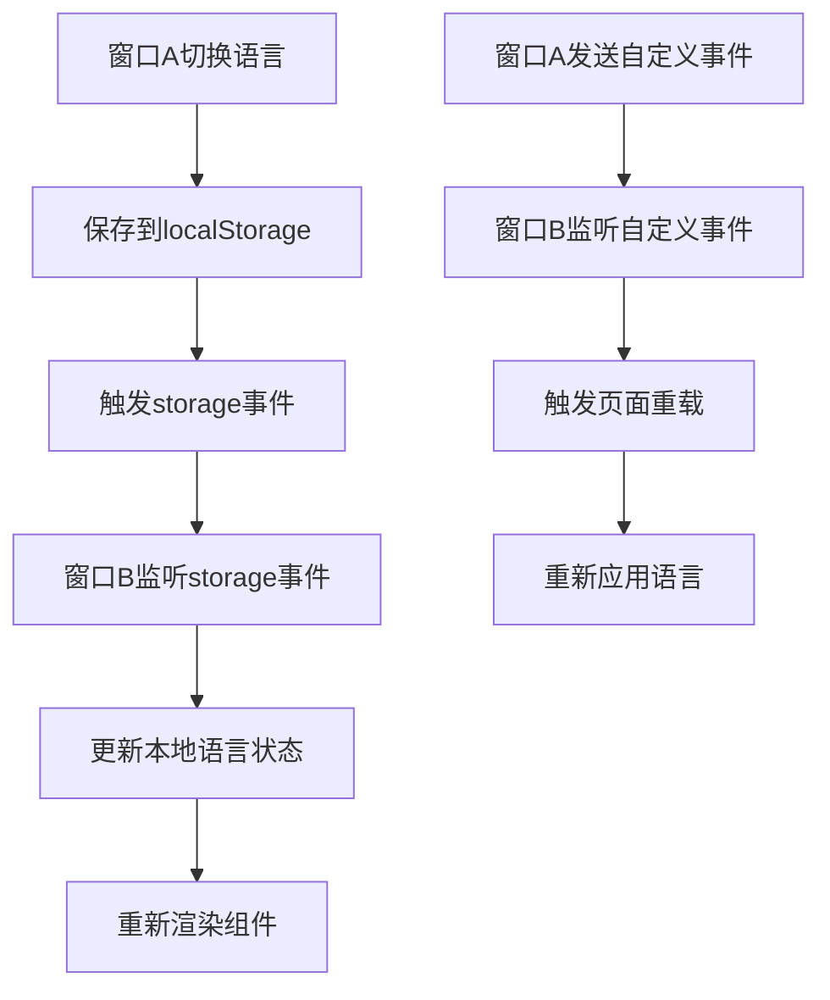
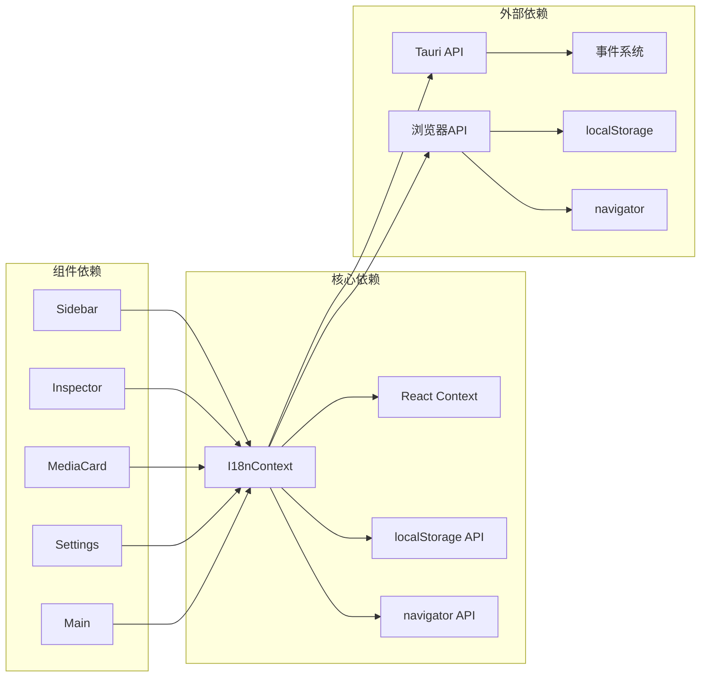

# 国际化系统

<cite>
**本文档引用的文件**
- [I18nContext.tsx](file://src/contexts/I18nContext.tsx)
- [zh-CN.json](file://src/i18n/zh-CN.json)
- [en-US.json](file://src/i18n/en-US.json)
- [Settings.tsx](file://src/pages/Settings.tsx)
- [App.tsx](file://src/App.tsx)
- [main.tsx](file://src/main.tsx)
- [Sidebar.tsx](file://src/components/Sidebar.tsx)
- [Inspector.tsx](file://src/components/Inspector.tsx)
- [MediaCard.tsx](file://src/components/MediaCard.tsx)
- [SidebarContainer.tsx](file://src/containers/SidebarContainer.tsx)
- [InspectorContainer.tsx](file://src/containers/InspectorContainer.tsx)
- [ThemeContext.tsx](file://src/contexts/ThemeContext.tsx)
- [UpdatePage.tsx](file://src/pages/UpdatePage.tsx)
- [AvailableView.tsx](file://src/pages/views/AvailableView.tsx)
- [CheckingView.tsx](file://src/pages/views/CheckingView.tsx)
- [ReadyView.tsx](file://src/pages/views/ReadyView.tsx)
</cite>

## 目录
1. [简介](#简介)
2. [项目结构](#项目结构)
3. [核心组件](#核心组件)
4. [架构概览](#架构概览)
5. [详细组件分析](#详细组件分析)
6. [依赖关系分析](#依赖关系分析)
7. [性能考虑](#性能考虑)
8. [故障排除指南](#故障排除指南)
9. [结论](#结论)

## 简介

Medex 是一个基于 Tauri 和 React 的跨平台媒体管理系统，其国际化系统采用轻量级、高效的实现方式。该系统支持简体中文和英语两种语言，通过上下文提供者模式实现全局语言状态管理，并在应用启动时根据浏览器语言偏好自动检测默认语言。

国际化系统的核心特点包括：
- 基于 React Context 的全局状态管理
- JSON 格式的语言资源文件
- 支持运行时语言切换
- 多窗口场景下的语言同步
- 本地存储持久化语言偏好

## 项目结构

国际化系统在项目中的组织结构如下：

**图表来源**
- [I18nContext.tsx:1-51](file://src/contexts/I18nContext.tsx#L1-L51)
- [main.tsx:17-47](file://src/main.tsx#L17-L47)
- [Settings.tsx:144-171](file://src/pages/Settings.tsx#L144-L171)

**章节来源**
- [I18nContext.tsx:1-51](file://src/contexts/I18nContext.tsx#L1-L51)
- [main.tsx:1-51](file://src/main.tsx#L1-L51)

## 核心组件

### I18nContext 国际化上下文

I18nContext 是整个国际化系统的核心，它提供了以下功能：

- **语言状态管理**：维护当前语言状态和语言切换功能
- **翻译函数**：提供 `t()` 函数用于获取翻译文本
- **资源管理**：集中管理多语言资源文件
- **持久化存储**：自动保存用户语言偏好到 localStorage

**图表来源**
- [I18nContext.tsx:5-20](file://src/contexts/I18nContext.tsx#L5-L20)
- [I18nContext.tsx:40-43](file://src/contexts/I18nContext.tsx#L40-L43)

### 语言资源文件

系统包含两个主要的语言资源文件：

**中文资源文件 (zh-CN.json)**：
- 包含114个翻译键值对
- 覆盖设置、侧边栏、检查器、媒体卡片等所有界面元素
- 提供完整的中文本地化支持

**英文资源文件 (en-US.json)**：
- 包含114个翻译键值对
- 与中文资源文件保持相同的键结构
- 确保双语一致性

**章节来源**
- [zh-CN.json:1-114](file://src/i18n/zh-CN.json#L1-L114)
- [en-US.json:1-114](file://src/i18n/en-US.json#L1-L114)

## 架构概览

国际化系统采用分层架构设计，确保了良好的可扩展性和维护性：

**图表来源**
- [I18nContext.tsx:23-31](file://src/contexts/I18nContext.tsx#L23-L31)
- [Settings.tsx:146-160](file://src/pages/Settings.tsx#L146-L160)
- [App.tsx:127-158](file://src/App.tsx#L127-L158)

## 详细组件分析

### 设置页面语言切换

设置页面是语言切换的主要入口点，实现了完整的语言切换流程：

**图表来源**
- [Settings.tsx:146-160](file://src/pages/Settings.tsx#L146-L160)
- [App.tsx:131-136](file://src/App.tsx#L131-L136)

### 组件本地化实现

各个 UI 组件通过 `useI18n` Hook 实现本地化：

**侧边栏组件 (Sidebar)**：
- 标题和副标题显示
- 导航项本地化
- 标签输入框占位符
- 添加按钮文本

**检查器组件 (Inspector)**：
- 标题显示
- 提示文本
- 标签信息显示
- 操作按钮文本

**媒体卡片组件 (MediaCard)**：
- 无预览提示
- 缩略图生成提示
- 标签移除错误提示

**章节来源**
- [Sidebar.tsx:44-47](file://src/components/Sidebar.tsx#L44-L47)
- [Sidebar.tsx:55](file://src/components/Sidebar.tsx#L55)
- [Sidebar.tsx:105](file://src/components/Sidebar.tsx#L105)
- [Sidebar.tsx:144](file://src/components/Sidebar.tsx#L144)
- [Inspector.tsx:106](file://src/components/Inspector.tsx#L106)
- [Inspector.tsx:161](file://src/components/Inspector.tsx#L161)
- [MediaCard.tsx:210](file://src/components/MediaCard.tsx#L210)
- [MediaCard.tsx:230](file://src/components/MediaCard.tsx#L230)

### 多窗口语言同步

系统支持多窗口场景下的语言同步：

**图表来源**
- [ThemeContext.tsx:56-66](file://src/contexts/ThemeContext.tsx#L56-L66)
- [App.tsx:127-158](file://src/App.tsx#L127-L158)

**章节来源**
- [ThemeContext.tsx:56-66](file://src/contexts/ThemeContext.tsx#L56-L66)
- [App.tsx:127-158](file://src/App.tsx#L127-L158)

## 依赖关系分析

国际化系统与其他模块的依赖关系：

**图表来源**
- [I18nContext.tsx:1-3](file://src/contexts/I18nContext.tsx#L1-L3)
- [Sidebar.tsx:4](file://src/components/Sidebar.tsx#L4)
- [Settings.tsx:25](file://src/pages/Settings.tsx#L25)

**章节来源**
- [I18nContext.tsx:1-3](file://src/contexts/I18nContext.tsx#L1-L3)
- [Sidebar.tsx:4](file://src/components/Sidebar.tsx#L4)
- [Settings.tsx:25](file://src/pages/Settings.tsx#L25)

## 性能考虑

国际化系统在性能方面的优化措施：

### 1. 资源加载优化
- 语言资源文件在应用启动时一次性加载
- 使用内存缓存避免重复解析
- JSON 文件结构简单，解析开销小

### 2. 状态管理优化
- 使用 React.memo 优化组件渲染
- useMemo 优化翻译函数计算
- Context 变更只影响订阅组件

### 3. 存储优化
- localStorage 持久化减少重复检测
- 避免频繁的网络请求

### 4. 运行时性能
- t 函数查找复杂度 O(1)
- 字符串回退机制简单高效
- 语言切换时的页面重载只在必要时发生

## 故障排除指南

### 常见问题及解决方案

**问题1：语言切换后界面没有更新**
- 检查是否正确调用了 `setLanguage` 函数
- 确认 localStorage 中的语言设置
- 验证事件监听器是否正常工作

**问题2：新添加的翻译键无效**
- 检查 JSON 文件中的键是否存在
- 确认所有语言文件都包含相同的键
- 验证键名拼写是否正确

**问题3：多窗口语言不同步**
- 检查 storage 事件监听器
- 确认自定义事件发送和接收
- 验证页面重载逻辑

**问题4：默认语言检测异常**
- 检查浏览器语言设置
- 验证 navigator.language 值
- 确认语言代码格式正确

**章节来源**
- [I18nContext.tsx:33-38](file://src/contexts/I18nContext.tsx#L33-L38)
- [Settings.tsx:149-160](file://src/pages/Settings.tsx#L149-L160)
- [App.tsx:131-158](file://src/App.tsx#L131-L158)

## 结论

Medex 的国际化系统采用简洁而高效的实现方式，具有以下优势：

1. **实现简单**：基于 React Context 的轻量级实现
2. **易于维护**：清晰的文件结构和明确的职责分离
3. **性能良好**：内存缓存和优化的渲染策略
4. **扩展性强**：支持添加新的语言资源文件
5. **用户体验佳**：自动语言检测和持久化存储

系统目前支持简体中文和英语两种语言，为后续扩展到更多语言奠定了良好的基础。通过事件驱动的语言切换机制，系统能够很好地处理多窗口场景下的语言同步需求。

建议的改进方向：
- 添加更多语言支持
- 实现动态语言包加载
- 增加翻译覆盖率检查
- 优化大语言包的加载性能