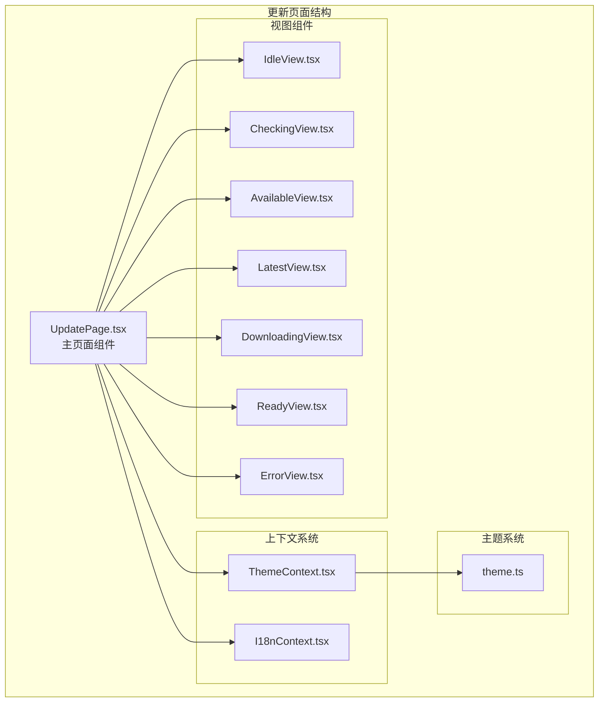
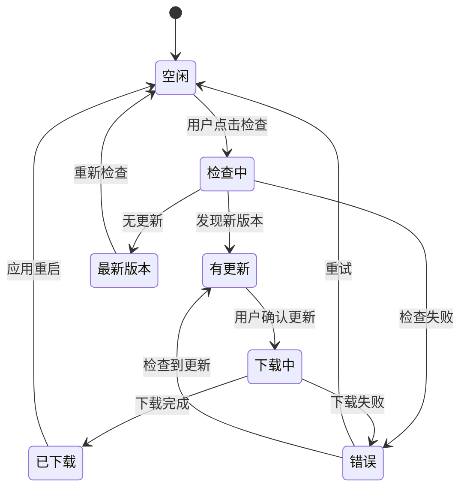
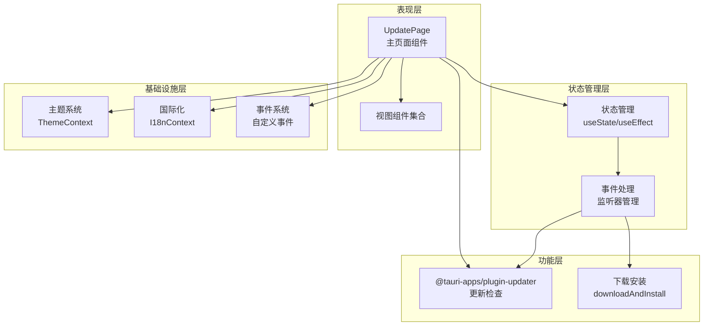
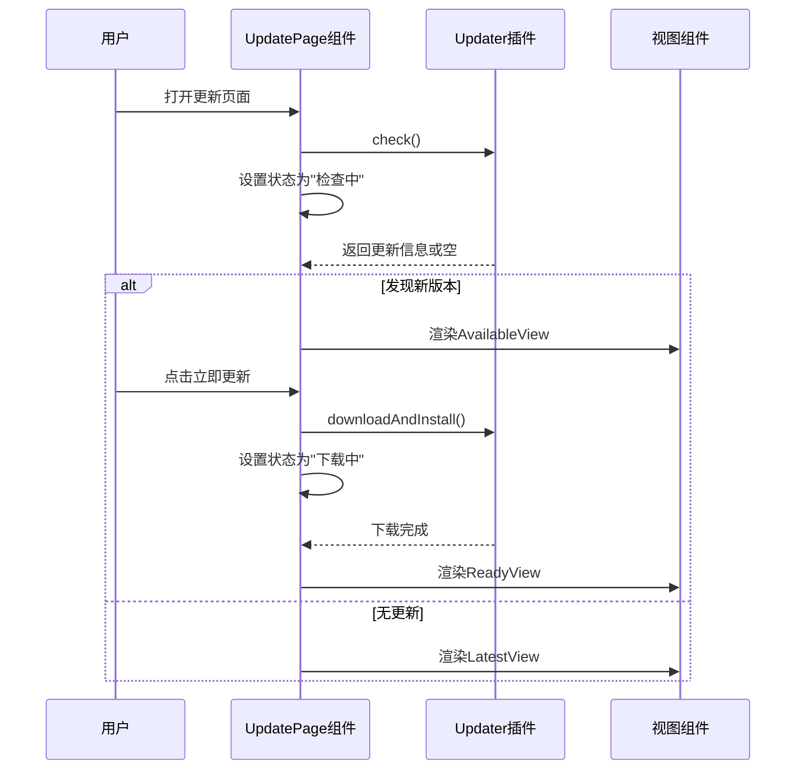
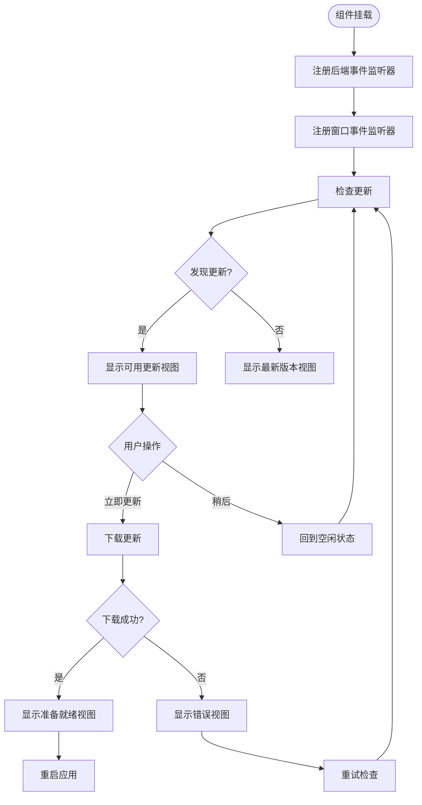
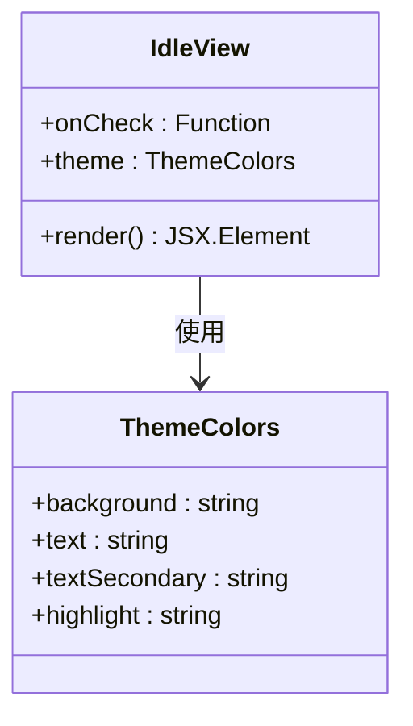
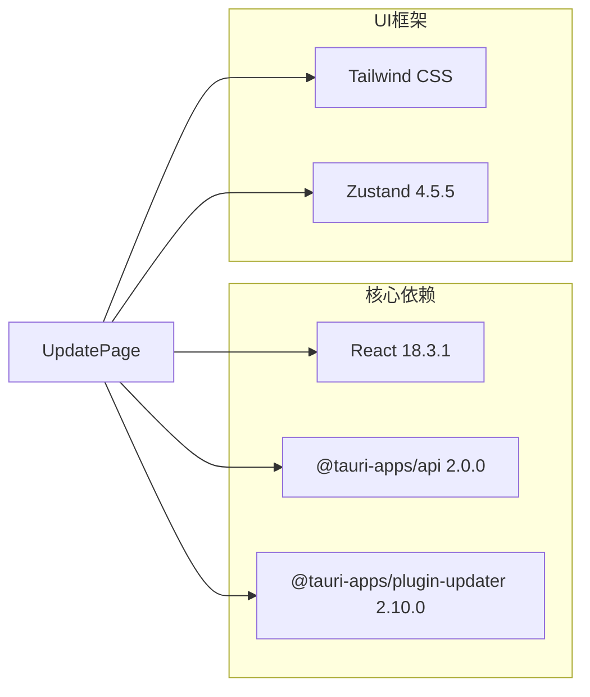
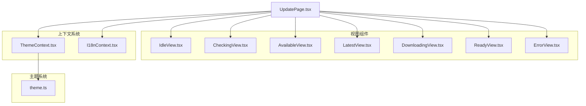

# 更新页面

<cite>
**本文档引用的文件**
- [src/pages/UpdatePage.tsx](file://src/pages/UpdatePage.tsx)
- [src/pages/Update.tsx](file://src/pages/Update.tsx)
- [src/main.tsx](file://src/main.tsx)
- [src/pages/views/CheckingView.tsx](file://src/pages/views/CheckingView.tsx)
- [src/pages/views/AvailableView.tsx](file://src/pages/views/AvailableView.tsx)
- [src/pages/views/LatestView.tsx](file://src/pages/views/LatestView.tsx)
- [src/pages/views/DownloadingView.tsx](file://src/pages/views/DownloadingView.tsx)
- [src/pages/views/ReadyView.tsx](file://src/pages/views/ReadyView.tsx)
- [src/pages/views/ErrorView.tsx](file://src/pages/views/ErrorView.tsx)
- [src/pages/views/IdleView.tsx](file://src/pages/views/IdleView.tsx)
- [src/contexts/ThemeContext.tsx](file://src/contexts/ThemeContext.tsx)
- [src/contexts/I18nContext.tsx](file://src/contexts/I18nContext.tsx)
- [package.json](file://package.json)
</cite>

## 目录
1. [简介](#简介)
2. [项目结构](#项目结构)
3. [核心组件](#核心组件)
4. [架构概览](#架构概览)
5. [详细组件分析](#详细组件分析)
6. [依赖关系分析](#依赖关系分析)
7. [性能考虑](#性能考虑)
8. [故障排除指南](#故障排除指南)
9. [结论](#结论)

## 简介

更新页面是 Medex 应用程序中的一个重要功能模块，负责检查应用程序是否有可用的新版本更新，并提供完整的更新流程管理。该页面实现了现代化的用户界面，支持多语言切换、主题系统集成，并提供了流畅的用户体验。

该更新页面采用 React Hooks 和 Tauri 插件架构，集成了 @tauri-apps/plugin-updater 来实现自动更新功能。页面状态管理包括检查更新、显示可用更新、下载更新、准备重启等完整流程。

## 项目结构

更新页面位于 `src/pages/` 目录下，采用模块化设计，包含主页面组件和多个视图组件：

**图表来源**
- [src/pages/UpdatePage.tsx:1-182](file://src/pages/UpdatePage.tsx#L1-L182)
- [src/pages/views/IdleView.tsx:1-34](file://src/pages/views/IdleView.tsx#L1-L34)
- [src/pages/views/CheckingView.tsx:1-31](file://src/pages/views/CheckingView.tsx#L1-L31)

**章节来源**
- [src/pages/UpdatePage.tsx:1-182](file://src/pages/UpdatePage.tsx#L1-L182)
- [src/main.tsx:1-51](file://src/main.tsx#L1-L51)

## 核心组件

### 更新状态管理

更新页面定义了完整的状态管理系统，支持七种不同的更新状态：

**图表来源**
- [src/pages/UpdatePage.tsx:14-26](file://src/pages/UpdatePage.tsx#L14-L26)
- [src/pages/UpdatePage.tsx:33-35](file://src/pages/UpdatePage.tsx#L33-L35)

### 更新信息结构

页面使用标准的更新信息接口来管理版本信息：

| 字段名 | 类型 | 描述 | 示例值 |
|--------|------|------|--------|
| version | string | 新版本号 | "1.2.3" |
| body | string | 更新说明内容 | "修复了若干bug 新增功能..." |

**章节来源**
- [src/pages/UpdatePage.tsx:23-26](file://src/pages/UpdatePage.tsx#L23-L26)

## 架构概览

更新页面采用分层架构设计，实现了清晰的关注点分离：

**图表来源**
- [src/pages/UpdatePage.tsx:30-182](file://src/pages/UpdatePage.tsx#L30-L182)
- [src/contexts/ThemeContext.tsx:17-99](file://src/contexts/ThemeContext.tsx#L17-L99)
- [src/contexts/I18nContext.tsx:22-51](file://src/contexts/I18nContext.tsx#L22-L51)

## 详细组件分析

### UpdatePage 主组件

UpdatePage 是整个更新功能的核心组件，负责协调所有子组件和状态管理：

#### 核心功能特性

1. **自动更新检查**：组件挂载时自动发起更新检查
2. **多语言支持**：实时响应语言变更事件
3. **主题集成**：完全集成主题系统，支持深色/浅色模式
4. **错误处理**：完善的错误捕获和用户友好的错误提示

#### 状态流转流程

**图表来源**
- [src/pages/UpdatePage.tsx:73-124](file://src/pages/UpdatePage.tsx#L73-L124)
- [src/pages/views/AvailableView.tsx:13-88](file://src/pages/views/AvailableView.tsx#L13-L88)

#### 事件监听机制

组件实现了双重事件监听机制来确保多窗口场景下的同步：

**图表来源**
- [src/pages/UpdatePage.tsx:42-71](file://src/pages/UpdatePage.tsx#L42-L71)
- [src/pages/UpdatePage.tsx:107-124](file://src/pages/UpdatePage.tsx#L107-L124)

**章节来源**
- [src/pages/UpdatePage.tsx:30-182](file://src/pages/UpdatePage.tsx#L30-L182)

### 视图组件系统

#### IdleView - 空闲状态视图

空闲状态视图为用户提供检查更新的入口：

**图表来源**
- [src/pages/views/IdleView.tsx:4-34](file://src/pages/views/IdleView.tsx#L4-L34)
- [src/theme/theme.ts:8-52](file://src/theme/theme.ts#L8-L52)

#### AvailableView - 可用更新视图

可用更新视图为用户提供详细的更新信息和操作选项：

| 组件元素 | 功能描述 | 样式特性 |
|----------|----------|----------|
| 版本信息面板 | 显示当前版本和最新版本 | 使用透明背景色 |
| 更新说明区域 | 显示详细的更新内容 | 支持滚动查看 |
| 操作按钮 | 提供"稍后"和"立即更新"选项 | 响应式悬停效果 |

**章节来源**
- [src/pages/views/AvailableView.tsx:1-89](file://src/pages/views/AvailableView.tsx#L1-L89)

#### 其他视图组件

每个视图组件都遵循统一的设计模式，实现了完整的状态展示和用户交互：

- **CheckingView**: 显示加载动画和检查进度
- **LatestView**: 显示"已是最新版本"的消息
- **DownloadingView**: 显示下载进度和状态
- **ReadyView**: 显示更新完成并提示重启
- **ErrorView**: 显示错误信息和重试选项

**章节来源**
- [src/pages/views/CheckingView.tsx:1-31](file://src/pages/views/CheckingView.tsx#L1-L31)
- [src/pages/views/LatestView.tsx:1-50](file://src/pages/views/LatestView.tsx#L1-L50)
- [src/pages/views/DownloadingView.tsx:1-49](file://src/pages/views/DownloadingView.tsx#L1-L49)
- [src/pages/views/ReadyView.tsx:1-50](file://src/pages/views/ReadyView.tsx#L1-L50)
- [src/pages/views/ErrorView.tsx:1-55](file://src/pages/views/ErrorView.tsx#L1-L55)

### 主题和国际化系统

#### 主题系统集成

更新页面完全集成到应用的主题系统中，支持：

1. **深色/浅色主题自动切换**
2. **系统主题偏好检测**
3. **跨窗口主题同步**
4. **持久化的主题设置**

#### 国际化支持

页面支持中英文双语界面，通过 I18nContext 实现：

- **动态语言切换**：支持运行时语言变更
- **本地存储记忆**：记住用户的语言偏好
- **浏览器语言检测**：自动检测系统语言
- **完整的翻译键值对**：覆盖所有更新相关的文本

**章节来源**
- [src/contexts/ThemeContext.tsx:17-99](file://src/contexts/ThemeContext.tsx#L17-L99)
- [src/contexts/I18nContext.tsx:22-51](file://src/contexts/I18nContext.tsx#L22-L51)

## 依赖关系分析

### 外部依赖

更新页面主要依赖以下外部库：

**图表来源**
- [package.json:12-22](file://package.json#L12-L22)

### 内部依赖关系

**图表来源**
- [src/pages/UpdatePage.tsx:6-12](file://src/pages/UpdatePage.tsx#L6-L12)
- [src/contexts/ThemeContext.tsx:1-1](file://src/contexts/ThemeContext.tsx#L1-L1)

**章节来源**
- [package.json:12-36](file://package.json#L12-L36)

## 性能考虑

### 状态管理优化

1. **状态最小化**：只维护必要的状态变量
2. **副作用管理**：合理使用 useEffect 管理生命周期
3. **事件监听清理**：确保组件卸载时清理监听器

### 渲染性能

1. **条件渲染**：根据状态动态渲染不同视图
2. **样式内联**：使用内联样式减少额外的 CSS 文件
3. **动画优化**：使用 CSS 动画而非 JavaScript 动画

### 内存管理

1. **监听器清理**：组件卸载时自动清理事件监听器
2. **状态清理**：错误状态下的资源清理
3. **缓存策略**：避免重复的网络请求

## 故障排除指南

### 常见问题及解决方案

#### 更新检查失败

**症状**：显示"检查更新失败"错误信息

**可能原因**：
1. 网络连接问题
2. 更新服务器不可达
3. 应用版本未发布更新

**解决方案**：
1. 检查网络连接状态
2. 稍后重试检查
3. 确认应用版本已发布更新

#### 下载更新失败

**症状**：下载过程中出现错误

**可能原因**：
1. 磁盘空间不足
2. 权限问题
3. 网络中断

**解决方案**：
1. 确保有足够的磁盘空间
2. 检查应用权限
3. 重新尝试下载

#### 重启后应用无法启动

**症状**：更新完成后应用无法正常启动

**可能原因**：
1. 更新包损坏
2. 系统兼容性问题
3. 权限不足

**解决方案**：
1. 重新下载更新包
2. 检查系统兼容性
3. 以管理员权限运行

### 调试技巧

1. **查看控制台日志**：检查 JavaScript 控制台输出
2. **网络监控**：使用浏览器开发者工具监控网络请求
3. **状态检查**：通过 React DevTools 检查组件状态

**章节来源**
- [src/pages/UpdatePage.tsx:90-105](file://src/pages/UpdatePage.tsx#L90-L105)
- [src/pages/views/ErrorView.tsx:10-55](file://src/pages/views/ErrorView.tsx#L10-L55)

## 结论

更新页面是 Medex 应用程序中设计精良的功能模块，具有以下特点：

1. **完整的功能覆盖**：从检查更新到应用重启的全流程管理
2. **优秀的用户体验**：直观的界面设计和流畅的状态切换
3. **强大的扩展性**：模块化设计便于功能扩展和维护
4. **完善的错误处理**：全面的错误捕获和用户友好的提示
5. **现代化的技术栈**：基于 React Hooks 和 Tauri 的现代架构

该更新页面为用户提供了可靠的软件更新体验，同时为开发者提供了清晰的架构参考。其设计原则和实现模式可以作为类似功能开发的最佳实践案例。