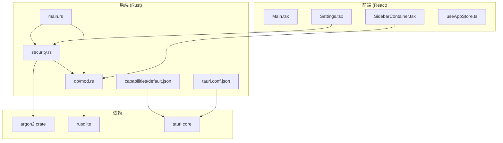
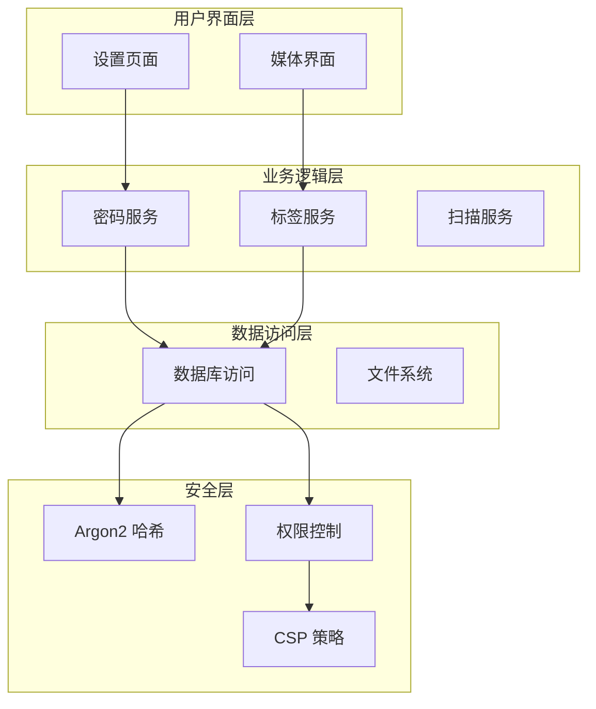
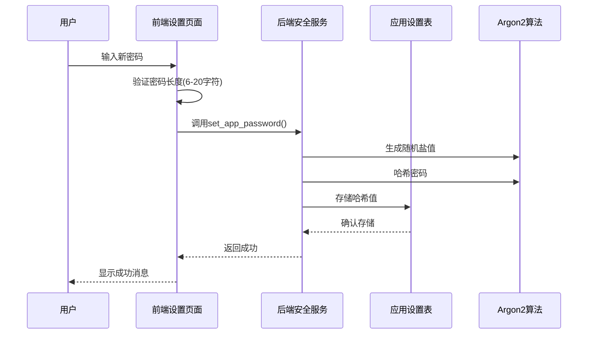
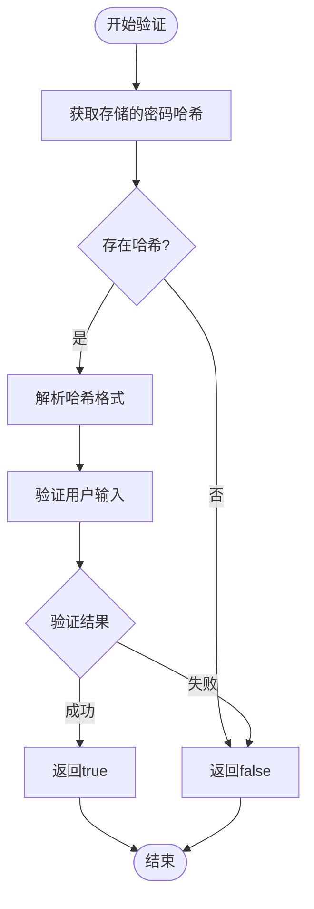
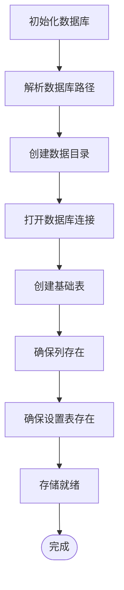
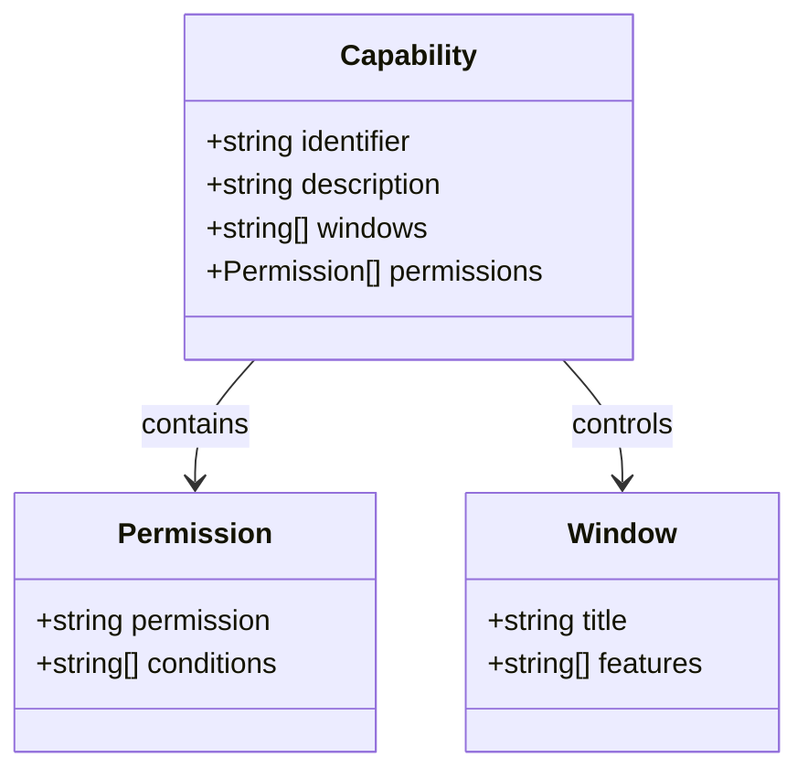
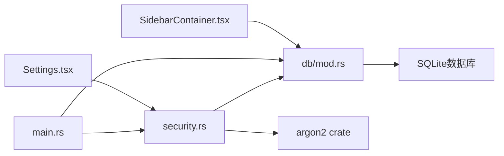

# 安全系统

<cite>
**本文档引用的文件**
- [src-tauri/src/services/security.rs](file://src-tauri/src/services/security.rs)
- [src-tauri/src/db/mod.rs](file://src-tauri/src/db/mod.rs)
- [src-tauri/src/main.rs](file://src-tauri/src/main.rs)
- [src-tauri/capabilities/default.json](file://src-tauri/capabilities/default.json)
- [src-tauri/tauri.conf.json](file://src-tauri/tauri.conf.json)
- [src-tauri/Cargo.toml](file://src-tauri/Cargo.toml)
- [src/pages/Settings.tsx](file://src/pages/Settings.tsx)
- [src/containers/SidebarContainer.tsx](file://src/containers/SidebarContainer.tsx)
- [src/store/useAppStore.ts](file://src/store/useAppStore.ts)
</cite>

## 目录
1. [简介](#简介)
2. [项目结构](#项目结构)
3. [核心组件](#核心组件)
4. [架构概览](#架构概览)
5. [详细组件分析](#详细组件分析)
6. [依赖分析](#依赖分析)
7. [性能考虑](#性能考虑)
8. [故障排除指南](#故障排除指南)
9. [结论](#结论)

## 简介

Medex 是一个基于 Tauri 框架构建的桌面应用程序，专注于媒体管理和浏览。本文档详细分析了系统的安全架构，特别是密码保护机制、权限控制和数据安全方面。

该应用程序采用多层安全设计，包括前端密码输入验证、后端密码哈希存储、权限控制以及安全的数据库访问模式。系统支持可选的应用程序密码保护，为用户的媒体库提供额外的安全保障。

## 项目结构

Medex 项目采用典型的 Tauri 应用程序结构，分为前端 React 应用和后端 Rust 服务两大部分：

**图表来源**
- [src-tauri/src/main.rs:1-103](file://src-tauri/src/main.rs#L1-103)
- [src-tauri/src/services/security.rs:1-45](file://src-tauri/src/services/security.rs#L1-45)
- [src-tauri/src/db/mod.rs:1-171](file://src-tauri/src/db/mod.rs#L1-171)

**章节来源**
- [src-tauri/src/main.rs:1-103](file://src-tauri/src/main.rs#L1-103)
- [src/pages/Settings.tsx:1-503](file://src/pages/Settings.tsx#L1-503)

## 核心组件

### 密码安全服务

系统的核心安全功能由专门的密码安全服务提供，包含以下关键功能：

- **密码设置**: 验证密码长度并进行安全哈希存储
- **密码验证**: 使用 Argon2 算法验证用户输入的密码
- **密码存在性检查**: 检查是否已设置应用程序密码
- **密码清除**: 删除已存储的密码哈希

### 数据库安全

数据库层实现了安全的数据存储机制：

- **应用设置表**: 专门用于存储应用程序配置和安全设置
- **连接池管理**: 线程安全的数据库连接管理
- **SQL 注入防护**: 使用参数化查询防止 SQL 注入攻击

### 权限控制系统

系统采用细粒度的权限控制机制：

- **能力配置**: 明确声明应用程序的权限范围
- **窗口权限**: 控制不同窗口的访问权限
- **插件权限**: 限制第三方插件的功能范围

**章节来源**
- [src-tauri/src/services/security.rs:1-45](file://src-tauri/src/services/security.rs#L1-45)
- [src-tauri/src/db/mod.rs:114-143](file://src-tauri/src/db/mod.rs#L114-143)
- [src-tauri/capabilities/default.json:1-15](file://src-tauri/capabilities/default.json#L1-15)

## 架构概览

Medex 的安全架构采用分层设计，确保每个层面都有适当的安全控制：

**图表来源**
- [src/pages/Settings.tsx:74-102](file://src/pages/Settings.tsx#L74-102)
- [src-tauri/src/services/security.rs:7-39](file://src-tauri/src/services/security.rs#L7-39)
- [src-tauri/tauri.conf.json:21-27](file://src-tauri/tauri.conf.json#L21-27)

## 详细组件分析

### 密码安全实现

密码安全功能是系统的核心安全组件，采用业界标准的密码哈希算法：

#### 密码哈希流程

**图表来源**
- [src-tauri/src/services/security.rs:8-19](file://src-tauri/src/services/security.rs#L8-19)
- [src/pages/Settings.tsx:74-89](file://src/pages/Settings.tsx#L74-89)

#### 密码验证流程

**图表来源**
- [src-tauri/src/services/security.rs:22-33](file://src-tauri/src/services/security.rs#L22-33)

**章节来源**
- [src-tauri/src/services/security.rs:1-45](file://src-tauri/src/services/security.rs#L1-45)
- [src/pages/Settings.tsx:74-102](file://src/pages/Settings.tsx#L74-102)

### 数据库安全实现

数据库层实现了多层次的安全保护：

#### 数据库初始化流程

**图表来源**
- [src-tauri/src/db/mod.rs:50-70](file://src-tauri/src/db/mod.rs#L50-70)

#### 设置存储机制

系统使用专门的应用设置表来存储敏感配置信息：

| 设置键 | 描述 | 类型 |
|--------|------|------|
| `app_password_hash` | 应用程序密码的哈希值 | 文本 |
| 其他设置键 | 应用程序配置项 | 文本 |

**章节来源**
- [src-tauri/src/db/mod.rs:114-143](file://src-tauri/src/db/mod.rs#L114-143)
- [src-tauri/src/db/mod.rs:103-112](file://src-tauri/src/db/mod.rs#L103-112)

### 权限控制系统

系统采用基于能力的权限控制模型：

#### 能力配置结构

**图表来源**
- [src-tauri/capabilities/default.json:1-15](file://src-tauri/capabilities/default.json#L1-15)

**章节来源**
- [src-tauri/capabilities/default.json:1-15](file://src-tauri/capabilities/default.json#L1-15)
- [src-tauri/tauri.conf.json:21-27](file://src-tauri/tauri.conf.json#L21-27)

## 依赖分析

### 外部依赖安全

系统依赖的关键安全库：

| 依赖库 | 版本 | 安全用途 | 关键特性 |
|--------|------|----------|----------|
| `argon2` | 0.5 | 密码哈希 | 盐值生成、内存硬哈希 |
| `rusqlite` | 0.32 | 数据库访问 | 参数化查询、事务支持 |
| `tauri` | 2 | 应用框架 | 安全上下文、权限控制 |

### 内部模块依赖

**图表来源**
- [src-tauri/src/main.rs:77-99](file://src-tauri/src/main.rs#L77-99)
- [src-tauri/Cargo.toml:23-24](file://src-tauri/Cargo.toml#L23-24)

**章节来源**
- [src-tauri/Cargo.toml:1-25](file://src-tauri/Cargo.toml#L1-25)
- [src-tauri/src/main.rs:77-99](file://src-tauri/src/main.rs#L77-99)

## 性能考虑

### 密码哈希性能

Argon2 算法提供了良好的安全性和性能平衡：

- **内存使用**: 适中的内存消耗，适合桌面应用
- **计算时间**: 可配置的计算成本，平衡安全性和响应性
- **并发处理**: 支持多线程安全操作

### 数据库性能优化

- **连接池**: 使用 OnceCell 实现高效的连接复用
- **索引优化**: 为常用查询字段建立索引
- **批量操作**: 支持批量插入和更新操作

## 故障排除指南

### 常见安全问题

| 问题 | 可能原因 | 解决方案 |
|------|----------|----------|
| 密码设置失败 | 密码长度不符合要求 | 确保密码长度在6-20字符之间 |
| 密码验证失败 | 输入错误或数据库连接问题 | 检查数据库连接和密码输入 |
| 权限不足 | 能力配置不正确 | 检查 capabilities/default.json 配置 |
| 数据库连接失败 | 文件权限问题 | 确保应用程序有数据库文件访问权限 |

### 调试建议

1. **启用详细日志**: 在开发环境中启用详细的错误日志
2. **检查依赖版本**: 确保所有安全相关依赖都是最新版本
3. **验证配置**: 定期检查安全配置文件的有效性
4. **监控性能**: 监控密码哈希操作的性能影响

**章节来源**
- [src/pages/Settings.tsx:85-101](file://src/pages/Settings.tsx#L85-101)
- [src-tauri/src/services/security.rs:9-11](file://src-tauri/src/services/security.rs#L9-11)

## 结论

Medex 的安全系统采用了多层次的设计理念，从密码哈希到权限控制，从数据库安全到前端验证，形成了完整的安全防护体系。

### 主要安全特性

1. **强密码保护**: 使用 Argon2 算法提供业界标准的密码哈希
2. **细粒度权限控制**: 基于能力的权限模型确保最小权限原则
3. **安全数据存储**: 专门的设置表和参数化查询防止数据泄露
4. **用户友好的安全**: 提供直观的密码设置和管理界面

### 最佳实践建议

1. **定期更新**: 及时更新安全相关依赖库
2. **配置审计**: 定期审查和审计安全配置
3. **监控告警**: 建立安全事件的监控和告警机制
4. **用户教育**: 提供安全使用指南和最佳实践

该安全系统为 Medex 应用程序提供了坚实的安全基础，能够有效保护用户的媒体库和个人数据安全。